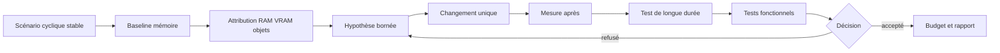

# Optimisation RAM, VRAM et allocations

> **Repères d’utilisation :** **[PS]** PowerShell 7, **[VSC]** Visual Studio Code, **[APP]** application graphique nommée, **[SORTIE]** résultat à lire sans le saisir, **[LECTURE]** exemple ou structure de référence. Voir la [convention complète](../Volume-0/annexes/CONVENTION-OUTILS-ET-CONTEXTES.md).

## 1. Rôle du chapitre

L’optimisation mémoire transforme un arrêt brutal, une croissance lente, un pic de chargement ou une saturation de VRAM en enquête reproductible. Elle distingue la mémoire réellement nécessaire au produit des références oubliées, duplications, caches sans limite et allocations transitoires.

Le chapitre 7 conserve le coût des passes de rendu et les profils graphiques. Le présent chapitre possède les budgets RAM/VRAM, les rapports d’allocations, les stratégies de cache et les tests de longue durée. Le chapitre 9 conservera le chargement en arrière-plan, le streaming, les transitions et les politiques d’éviction liées aux zones.

La règle centrale est la suivante : libérer davantage n’est pas un objectif en soi. Une modification est acceptable lorsqu’elle réduit un pic ou une croissance mesurée, respecte les budgets de plateforme et ne dégrade ni correction fonctionnelle, ni stabilité, ni qualité visuelle.

## 2. Résultats d’apprentissage

- distinguer mémoire résidente, mémoire privée, mémoire statique, pic et mémoire vidéo ;
- définir des budgets souples et durs par plateforme ;
- utiliser les moniteurs mémoire de Godot sans les présenter comme un inventaire exhaustif ;
- identifier références persistantes, nœuds orphelins et ressources dupliquées ;
- concevoir des caches bornés et observables ;
- gérer explicitement la durée de vie des nœuds, `RefCounted` et ressources ;
- limiter les allocations temporaires dans les boucles fréquentes ;
- préparer un test de longue durée avec phases, plateaux et critères de fuite ;
- comparer baseline et candidate avec les mêmes scènes et cycles ;
- relier RAM, VRAM, qualité et temps de frame sans confondre leurs causes ;
- organiser le diagnostic en modes Solo et Studio ;
- refuser une optimisation fondée sur une seule capture ou un seul compteur.

## 3. Niveau de preuve et réserves

Le chapitre est accepté au niveau `static-review`. Les contrats, scripts et procédures sont relus statiquement. Aucune campagne mémoire, aucun profil d’allocations, aucun test de longue durée et aucune réduction runtime de `Project Asteria` ne sont revendiqués comme produits.

> **[LECTURE] État de preuve du chapitre — Ne pas saisir.**

```yaml
evidence_level:
  chapter: static_review
  memory_budget_qualified: false
  allocation_report_created: false
  cache_strategy_executed: false
  soak_test_executed: false
  ram_peak_reduced: false
  vram_peak_reduced: false
  functional_regression_suite_executed: false
  runtime_improvement_claimed: false
```

<!-- qa:code-explanation -->

**Explication structurée du bloc :**

- **Statut :** `static_review` décrit une revue documentaire et non une campagne mémoire.
- **Séparation :** RAM, VRAM, allocations, cache et longue durée possèdent des indicateurs distincts.
- **Régression :** la suite fonctionnelle reste indépendante de la mesure mémoire.
- **Limite :** une future validation devra conserver environnement, cycles, échantillons et artefacts.

## 4. Prérequis et frontières

Le lecteur doit connaître les portes qualité du chapitre 2, les tests fonctionnels du chapitre 3, l’observabilité locale du chapitre 5, les campagnes CPU du chapitre 6 et les signaux VRAM du chapitre 7.

Le présent chapitre possède les budgets mémoire, les rapports d’allocations, les politiques de cache, la recherche de références persistantes et les tests de longue durée. Il peut mesurer une phase de chargement, mais ne définit ni la file de streaming, ni les priorités de zones, ni l’interface de progression du chapitre 9.

> **Frontière essentielle :** une baisse ponctuelle après changement de scène ne démontre ni l’absence de fuite, ni l’efficacité d’un cache, ni la stabilité d’un produit après plusieurs heures.

## 5. Vocabulaire opérationnel

- **RAM :** mémoire principale consommée par le processus, le moteur, les bibliothèques et les données.
- **VRAM :** mémoire vidéo utilisée par textures, buffers et ressources gérées par le pilote.
- **Mémoire résidente :** pages actuellement présentes en mémoire physique pour le processus.
- **Mémoire privée :** mémoire engagée qui n’est pas partagée avec d’autres processus.
- **Mémoire statique Godot :** mémoire suivie par l’allocateur statique exposé par les moniteurs du moteur.
- **Pic :** valeur maximale observée dans une fenêtre ou une phase.
- **Plateau :** niveau relativement stable après une phase de chauffe ou de charge.
- **Fuite :** croissance non récupérée liée à des objets, ressources ou allocations qui restent accessibles ou non libérés.
- **Rétention :** conservation volontaire ou involontaire d’une référence.
- **Duplication :** copie indépendante d’une donnée qui aurait pu être partagée ou reconstruite.
- **Cache :** stockage temporaire destiné à éviter un recalcul ou un rechargement.
- **Allocation temporaire :** mémoire créée pour une opération courte, souvent répétée.
- **Fragmentation :** impossibilité d’utiliser efficacement des espaces libres dispersés.
- **Budget souple :** seuil qui déclenche enquête, réduction ou avertissement.
- **Budget dur :** limite qui bloque une promotion ou force un profil de repli.
- **Test de longue durée :** campagne répétée destinée à observer croissance, plateaux et dérive.

## 6. Modèle de décision

> **[LECTURE] Cycle d’optimisation mémoire — Ne pas exécuter.**



<!-- qa:code-explanation -->

**Explication structurée du bloc :**

- **Entrée :** le scénario cyclique précède la mesure.
- **Attribution :** la croissance est séparée entre RAM, VRAM, objets et caches.
- **Durée :** le test prolongé vérifie qu’un gain local ne masque pas une dérive.
- **Décision :** la correction fonctionnelle et les budgets déterminent l’acceptation.

## 7. Les quatre questions d’une enquête mémoire

- **Combien ?** Quelle quantité est observée, avec quelle unité et quel compteur ?
- **Quand ?** La valeur augmente-t-elle au chargement, pendant l’usage, à la sortie ou après plusieurs cycles ?
- **Qui retient ?** Nœud, ressource, singleton, signal, cache, thread, pilote ou bibliothèque native ?
- **Pourquoi conserver ?** Besoin fonctionnel, anticipation, réutilisation, erreur de durée de vie ou duplication ?

Un seul nombre ne répond pas à ces questions. Le diagnostic associe une série temporelle, un scénario, un inventaire d’objets et une hypothèse de durée de vie.

## 8. Budgets mémoire par plateforme

Un budget sépare le disponible théorique, la part réservée au système, la cible du produit et une marge pour les pics. Les valeurs ci-dessous sont des emplacements à qualifier, pas des mesures.

> **[VSC] Visual Studio Code — Créer `config/performance/memory_budgets.yaml`.**

```yaml
schema_version: 1
budgets:
  windows_reference:
    hardware:
      ram_installed_gib: 32
      vram_installed_gib: 12
    process_ram:
      soft_limit_mib: pending_qualification
      hard_limit_mib: pending_qualification
      peak_window_seconds: 10
    render_vram:
      soft_limit_mib: pending_qualification
      hard_limit_mib: pending_qualification
    temporary_allocations:
      max_growth_per_cycle_mib: pending_qualification
    decision:
      require_functional_suite: true
      require_long_run: true
```

<!-- qa:code-explanation -->

**Explication structurée du bloc :**

- **Plateforme :** le budget est rattaché au poste Windows de référence.
- **Seuils :** les limites souples et dures restent à qualifier par mesure.
- **Pic :** la fenêtre évite de confondre un échantillon isolé et un pic durable.
- **Porte :** la longue durée et la suite fonctionnelle sont obligatoires.

## 9. Unités et conversions

Les outils peuvent afficher octets, mébioctets ou gibioctets. Un rapport doit conserver l’unité source et la conversion appliquée.

> **[LECTURE] Conversions binaires de référence — Ne pas saisir.**

```text
1 KiB = 1 024 octets
1 MiB = 1 024 KiB = 1 048 576 octets
1 GiB = 1 024 MiB = 1 073 741 824 octets

mib = bytes / 1_048_576
gib = bytes / 1_073_741_824
```

<!-- qa:code-explanation -->

**Explication structurée du bloc :**

- **Convention :** les unités binaires évitent une ambiguïté avec les multiples décimaux.
- **Traçabilité :** le nombre d’octets source doit rester disponible.
- **Comparaison :** baseline et candidate utilisent la même conversion.
- **Limite :** une conversion correcte ne garantit pas que deux compteurs mesurent la même chose.

## 10. Contrat de campagne mémoire

> **[VSC] Visual Studio Code — Créer `config/performance/memory_campaign.yaml`.**

```yaml
schema_version: 1
campaign:
  id: AST-MEM-001
  build: pending_build_id
  platform: windows_reference
  scenario: hub_combat_hub_cycle
  warmup_cycles: 3
  measured_cycles: 30
  phases:
    - hub_enter
    - combat_enter
    - combat_play
    - combat_exit
    - hub_return
    - idle_plateau
  sample_interval_ms: 500
  invalidation:
    - build_mismatch
    - scene_error
    - background_update
    - capture_tool_failure
  artifacts:
    raw_samples: reports/performance/memory/raw/
    summaries: reports/performance/memory/summaries/
    snapshots: reports/performance/memory/snapshots/
```

<!-- qa:code-explanation -->

**Explication structurée du bloc :**

- **Cycle :** la même séquence chargement-usage-sortie est répétée.
- **Warm-up :** les premiers cycles sont séparés de la comparaison principale.
- **Phases :** les pics et plateaux sont attribués à une étape nommée.
- **Invalidation :** les exclusions sont définies avant observation.

## 11. Manifeste d’environnement

> **[VSC] Visual Studio Code — Créer `config/performance/memory_environment.yaml`.**

```yaml
schema_version: 1
environment:
  os: Windows 11 64 bits
  cpu: AMD Ryzen 7 2700
  ram_gib: 32
  gpu: AMD Radeon RX 6750 XT
  vram_gib: 12
  renderer: Forward+
  godot: 4.7.1-stable
  display_resolution: pending_record
  graphics_profile: pending_record
  driver_version: pending_record
  page_file_policy: pending_record
  background_process_policy: controlled
  capture_tools: []
```

<!-- qa:code-explanation -->

**Explication structurée du bloc :**

- **Mémoire :** RAM, VRAM et politique de fichier d’échange sont documentées.
- **Rendu :** résolution et profil graphique influencent la VRAM.
- **Pilote :** la version doit rester comparable entre campagnes.
- **Outils :** chaque capture externe est déclarée car elle peut modifier l’empreinte.

## 12. Moniteurs mémoire de Godot

Le singleton `Performance` expose des moniteurs légers. Ils décrivent les domaines suivis par Godot ; ils ne remplacent ni le compteur du système, ni un inventaire natif complet.

> **[VSC] Visual Studio Code — Créer `res://src/core/performance/memory_probe.gd`.**

```gdscript
class_name MemoryProbe
extends RefCounted

static func snapshot() -> Dictionary:
    return {
        "static_bytes": Performance.get_monitor(
            Performance.MEMORY_STATIC
        ),
        "static_peak_bytes": Performance.get_monitor(
            Performance.MEMORY_STATIC_MAX
        ),
        "message_buffer_peak_bytes": Performance.get_monitor(
            Performance.MEMORY_MESSAGE_BUFFER_MAX
        ),
        "object_count": Performance.get_monitor(
            Performance.OBJECT_COUNT
        ),
        "orphan_node_count": Performance.get_monitor(
            Performance.OBJECT_ORPHAN_NODE_COUNT
        ),
        "resource_count": Performance.get_monitor(
            Performance.OBJECT_RESOURCE_COUNT
        ),
        "node_count": Performance.get_monitor(
            Performance.OBJECT_NODE_COUNT
        ),
    }
```

<!-- qa:code-explanation -->

**Explication structurée du bloc :**

- **Mémoire :** `MEMORY_STATIC` et son pic suivent l’allocateur statique exposé par le moteur.
- **Objets :** objets, ressources, nœuds et orphelins orientent l’attribution.
- **Tampon :** le pic de messages peut signaler une pression distincte.
- **Limite :** ces compteurs ne constituent pas toute la mémoire du processus.

## 13. Mémoire du processus côté moteur

Les informations du système d’exploitation complètent les moniteurs Godot. Leur disponibilité et leur définition peuvent varier selon la plateforme.

> **[VSC] Visual Studio Code — Étendre `memory_probe.gd`.**

```gdscript
static func process_snapshot() -> Dictionary:
    return {
        "static_usage_bytes": OS.get_static_memory_usage(),
        "static_peak_bytes": OS.get_static_memory_peak_usage(),
        "platform": OS.get_name(),
        "process_id": OS.get_process_id(),
    }
```

<!-- qa:code-explanation -->

**Explication structurée du bloc :**

- **Source :** les appels `OS` fournissent le point de vue du moteur sur son allocation statique.
- **Identité :** le PID permet de corréler avec un outil système.
- **Plateforme :** le nom du système accompagne chaque série.
- **Prudence :** le rapport doit documenter le sens exact du compteur utilisé.

## 14. Mémoire vidéo depuis RenderingServer

Les indicateurs de rendu exposent des estimations ou compteurs gérés par le moteur. Ils servent à suivre une tendance compatible, pas à reconstituer toute l’allocation du pilote.

> **[VSC] Visual Studio Code — Ajouter une sonde VRAM.**

```gdscript
static func rendering_memory_snapshot() -> Dictionary:
    return {
        "texture_mem_bytes": RenderingServer.get_rendering_info(
            RenderingServer.RENDERING_INFO_TEXTURE_MEM_USED
        ),
        "buffer_mem_bytes": RenderingServer.get_rendering_info(
            RenderingServer.RENDERING_INFO_BUFFER_MEM_USED
        ),
