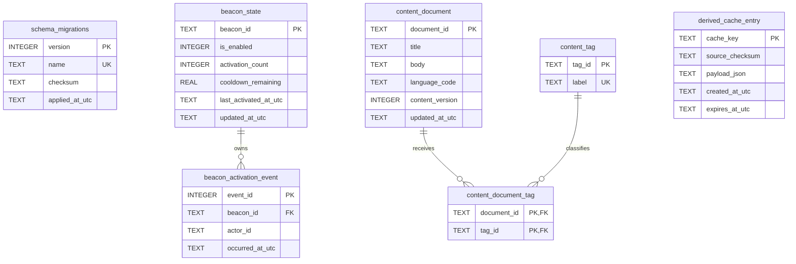
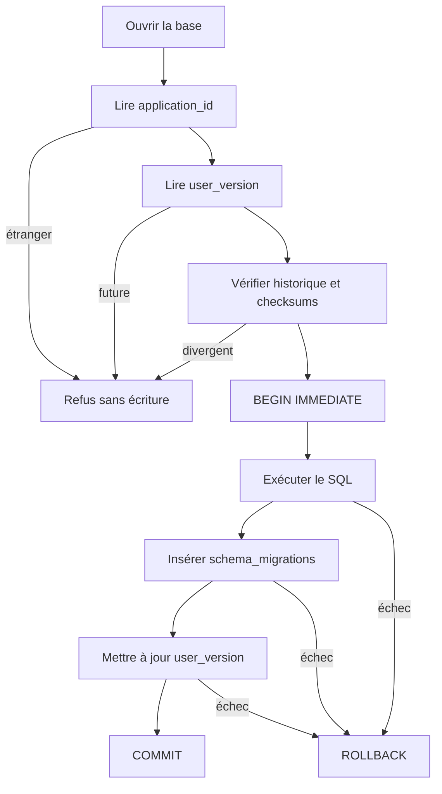

# Schéma et diagrammes

## Vue relationnelle

## Cycle de migration

## Autorités

- `beacon_state` : état relationnel persistant courant ;
- `beacon_activation_event` : historique dépendant ;
- `content_document` : contenu canonique synthétique de démonstration ;
- `derived_cache_entry` : donnée dérivée supprimable ;
- `schema_migrations` : preuve technique d’application, pas autorité métier.
