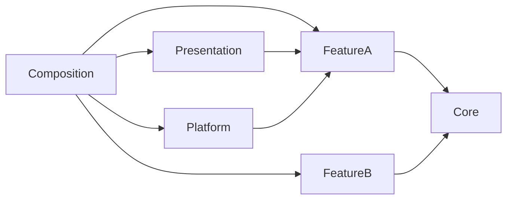

# Architecture Solo et architecture Studio

> **Repères d’utilisation :** **[PS]** PowerShell 7, **[CMD]** Invite de commandes, **[WSL]** terminal WSL, **[DCT]** terminal dans un conteneur, **[DCK]** Docker Desktop, **[VSC]** Visual Studio Code, **[WEB]** navigateur, **[APP]** application graphique, **[SORTIE]** résultat à lire sans le saisir, **[LECTURE]** exemple ou structure de référence. Voir la [convention complète](../Volume-0/annexes/CONVENTION-OUTILS-ET-CONTEXTES.md).

> **Identifiant stable :** `DOC-L2-CH30`  
> **Priorité :** Obligatoire  
> **Parcours :** Mode Solo · Mode Studio  
> **Public :** débutant à avancé  
> **Versions de référence :** Godot `4.7.1-stable`, cible principale CPython `3.14.6`, repli CPython `3.13.14`, édition Standard, GDScript, Forward+  

## 1. Rôle du dernier chapitre du Livre II

Ce chapitre ne crée aucun nouveau système de gameplay. Il assemble les contrats déjà établis pour transformer `Project Asteria` en projet gouvernable selon deux profils : un profil **Solo**, optimisé pour une personne et une machine principale, et un profil **Studio**, conçu pour plusieurs responsabilités, plusieurs environnements et des validations collectives.

Les deux profils partagent les mêmes autorités métier, les mêmes formats de sauvegarde, les mêmes identifiants stables, les mêmes règles de sécurité et les mêmes critères de déterminisme. Ils diffèrent par la profondeur de gouvernance, la séparation des responsabilités, le nombre de plateformes qualifiées et le niveau d’automatisation obligatoire.

La distinction n’est donc pas « petit code contre gros code ». Elle oppose deux enveloppes opérationnelles autour d’un même cœur. Le profil Studio ajoute des contrôles ; il ne réécrit pas le domaine et ne crée pas un gestionnaire global capable de contourner les systèmes propriétaires.

## 2. Frontières et invariants non négociables

Le chapitre consolide les fondations Godot, la plateforme IA locale, les douze systèmes de gameplay et les quatre chapitres d’industrialisation précédents. Chaque domaine conserve son dépôt, ses commandes, ses validations, ses événements et sa section de sauvegarde.

Les invariants suivants s’appliquent aux deux profils :

- aucune scène, interface, sortie IA, tâche Python ou outil d’éditeur ne modifie directement un état métier ;
- le temps autoritaire reste logique ; l’horloge système sert aux diagnostics civils, jamais à l’ordre de simulation ;
- les identités sont stables et indépendantes des noms affichés, chemins et positions dans une collection ;
- les écritures multi-autorités sont préparées puis committées selon un contrat explicite ;
- les données externes sont bornées, versionnées et validées avant usage ;
- les services IA restent remplaçables et facultatifs pour les fonctions essentielles ;
- les journaux, métriques, traces, caches et index dérivés ne deviennent pas des sources de vérité ;
- chaque dépendance future du Starter Kit doit être qualifiée avant adoption ;
- un build publiable provient d’un commit identifié, de dépendances qualifiées et d’une chaîne reproductible ;
- le Mode Studio ne doit jamais obliger le Mode Solo à maintenir une infrastructure distribuée inutile.

> **[LECTURE] Exemple du chapitre — Ne pas saisir.**
```text
Sources et décisions
        │
        ▼
Domaines propriétaires ──► Application ──► Adaptateurs de plateforme
        │                         │
        │                         ├──► Présentation Godot
        │                         ├──► Stockage et sauvegarde
        │                         ├──► Services IA facultatifs
        │                         └──► Outils de production
        │
        ▼
Événements typés et snapshots versionnés
        │
        ▼
Tests, diagnostics, manifestes et artefacts de publication
```

<!-- qa:code-explanation -->

**Explication structurée du bloc :**

- **Rôle précis du bloc :** La vue sépare l’autorité métier, la coordination applicative, les adaptateurs techniques et les artefacts d’exploitation.
- **Direction des dépendances :** Les domaines ne dépendent ni de la présentation, ni du stockage concret, ni des services IA.
- **Flux de preuve :** Tests, diagnostics et manifestes décrivent une exécution ou une publication sans reconstruire l’autorité du jeu.
- **Résultat attendu :** Un lecteur peut localiser la responsabilité d’une décision avant de choisir un profil Solo ou Studio.

## 3. Un produit, deux enveloppes opérationnelles

Le profil Solo privilégie la réduction du coût cognitif : une branche de travail courte, une machine principale, des scripts locaux lisibles et des portes de validation exécutables sans infrastructure permanente. Le profil Studio ajoute des propriétaires de code, des revues obligatoires, des matrices de plateforme, des artefacts de CI et des responsabilités séparées.

Le passage de Solo à Studio doit être progressif. Les fichiers du cœur, les ports applicatifs et les formats persistés ne changent pas de nature. Seules la composition, la gouvernance et les contrôles s’enrichissent.

> **[LECTURE] Exemple du chapitre — Ne pas saisir.**
```yaml
architecture_profiles:
  solo:
    required_reviewers: 0
    protected_main: true
    required_platforms:
      - windows-x86_64
    local_ai_required: false
    release_approval: self-review
  studio:
    required_reviewers: 1
    protected_main: true
    required_platforms:
      - windows-x86_64
      - linux-x86_64
    local_ai_required: false
    release_approval: independent-approver
```

<!-- qa:code-explanation -->

**Explication structurée du bloc :**

- **Rôle précis du bloc :** La matrice exprime les différences de gouvernance sans dupliquer les règles métier.
- **Paramètres importants :** Les plateformes et approbations sont des obligations de livraison, pas des conditions de validité du domaine.
- **Invariant commun :** `local_ai_required` reste faux pour préserver un chemin déterministe local lorsque les services IA sont absents.
- **Limite :** Ces valeurs constituent un exemple de départ et doivent être ajustées aux contraintes réelles du projet matérialisé.

## 4. Carte des autorités de Project Asteria

Une autorité est le composant qui peut accepter ou refuser une mutation métier. Le chapitre 30 ne centralise pas ces décisions ; il publie une carte qui rend les frontières visibles pendant les revues, les tests et les migrations.

> **[LECTURE] Exemple du chapitre — Ne pas saisir.**
```yaml
authorities:
  characters: character_repository
  social: social_relationship_repository
  families: family_graph
  agents: agent_state_repository
  combat: combat_repository
  skills: skill_state_repository
  inventory: inventory_repository
  economy: ledger_repository
  ecology: world_region_repository
  politics: institution_repository
  construction: domain_repository
  narrative: narrative_repository

coordination:
  multi_authority_commit: application_unit_of_work
  save_restore: save_orchestrator
  runtime_composition: application_composition
```

<!-- qa:code-explanation -->

**Explication structurée du bloc :**

- **Rôle précis du bloc :** La carte nomme les propriétaires de données et les trois coordinations transversales autorisées.
- **Autorités métier :** Chaque dépôt ou graphe conserve la validation et le commit de son agrégat.
- **Coordination limitée :** L’unité de travail, l’orchestrateur de sauvegarde et la composition ne décident pas à la place des domaines.
- **Usage en revue :** Une mutation visant un composant absent de cette carte doit être justifiée ou refusée.

> **[LECTURE] Exemple du chapitre — Ne pas saisir.**
```text
Mutation demandée
      │
      ▼
Commande typée
      │
      ▼
Service applicatif
      │
      ├──► valide auprès des autorités concernées
      ├──► prépare les changements
      ├──► committe ou annule l'ensemble
      └──► publie les événements après succès
```

<!-- qa:code-explanation -->

**Explication structurée du bloc :**

- **Rôle précis du bloc :** Le flux rappelle l’ordre commun aux mutations simples et multi-autorités.
- **Point de refus :** Toute validation échouée arrête la préparation avant le premier commit.
- **Atomicité déclarée :** Le coordinateur doit documenter ce qu’il peut annuler et ne promet pas une atomicité universelle.
- **Résultat attendu :** Aucun événement de succès n’est émis avant la réussite de la mutation autoritaire.

## 5. Organisation physique de référence

Godot utilise directement le système de fichiers du projet. L’organisation doit donc rendre visibles les frontières de dépendances et maintenir les ressources près des fonctionnalités qui les consomment, tout en isolant les outils, les tests et les artefacts régénérables.

> **[LECTURE] Exemple du chapitre — Ne pas saisir.**
```text
project.godot
export_presets.cfg
addons/
automation/
content/
  source/
  generated/
docs/
scenes/
  bootstrap/
  learning/
src/
  core/
  features/
  platform/
  presentation/
  composition/
tests/
  unit/
  component/
  integration/
  simulation/
  platform/
work/
  staging/
  reports/
  diagnostics/
builds/
```

<!-- qa:code-explanation -->

**Explication structurée du bloc :**

- **Rôle précis du bloc :** L’arborescence sépare sources canoniques, code runtime, outils, tests et sorties jetables.
- **Frontière Godot :** `src` et `scenes` appartiennent au projet importé ; les sorties de travail doivent être ignorées ou placées sous `.gdignore` lorsque nécessaire.
- **Nommage :** Les chemins utilisent des minuscules et `snake_case` afin de réduire les écarts de casse entre plateformes.
- **Résultat attendu :** Une revue peut distinguer immédiatement une source versionnée d’un artefact reconstruit.

> **[LECTURE] Exemple du chapitre — Ne pas saisir.**
```text
src/features/inventory/
├── domain/
│   ├── item_id.gd
│   ├── inventory_state.gd
│   └── transfer_policy.gd
├── application/
│   ├── transfer_item_command.gd
│   └── inventory_service.gd
├── infrastructure/
│   ├── inventory_snapshot_codec.gd
│   └── in_memory_inventory_repository.gd
└── presentation/
    ├── inventory_panel.tscn
    └── inventory_panel.gd
```

<!-- qa:code-explanation -->

**Explication structurée du bloc :**

- **Rôle précis du bloc :** La fonctionnalité regroupe ses couches sans disperser ses fichiers dans des dossiers globaux par type.
- **Dépendances internes :** Le domaine reste indépendant ; l’application utilise ses contrats ; l’infrastructure et la présentation adaptent les bords.
- **Testabilité :** Chaque couche peut recevoir ses propres doubles et fixtures sans charger l’interface complète.
- **Limite :** Les classes partagées par plusieurs fonctionnalités ne migrent vers `core` qu’après preuve d’un contrat réellement commun.

## 6. Règles de dépendances

Le graphe de dépendances doit rester dirigé. `core` contient des primitives transversales stables, jamais un catalogue de commodité. Une fonctionnalité peut dépendre de `core`, mais `core` ne dépend d’aucune fonctionnalité. La composition connaît les implémentations concrètes ; les domaines ne les connaissent pas.

> **[LECTURE] Exemple du chapitre — Ne pas saisir.**


<!-- qa:code-explanation -->

**Explication structurée du bloc :**

- **Rôle précis du bloc :** Le graphe rend explicites les dépendances autorisées au démarrage et au runtime.
- **Interdiction principale :** Aucune flèche ne remonte depuis `Core` vers une fonctionnalité ou depuis un domaine vers `Platform`.
- **Composition :** La couche de composition est la seule à connaître simultanément plusieurs implémentations concrètes.
- **Contrôle :** Une analyse statique ou une revue de chemin doit refuser les imports qui inversent ces flèches.

> **[VSC] Exemple du chapitre — Ne pas saisir.**
```gdscript
class_name CharacterDirectory
extends RefCounted

func has_character(_character_id: StringName) -> bool:
    push_error("CharacterDirectory.has_character() must be implemented")
    return false

func all_character_ids() -> Array[StringName]:
    push_error("CharacterDirectory.all_character_ids() must be implemented")
    return []
```

<!-- qa:code-explanation -->

**Explication structurée du bloc :**

- **Rôle précis du bloc :** Le port expose uniquement les capacités nécessaires à ses clients.
- **Types :** `StringName` représente une identité logique compacte ; le tableau retourné doit être une copie défensive.
- **Implémentation :** Les adaptateurs concrets remplacent les méthodes et les tests peuvent injecter un faux déterministe.
- **Limite :** Ce port ne donne aucun accès au nœud actif ni aux détails de stockage.

## 7. Racine de composition explicite

La racine de composition construit les implémentations et injecte leurs ports. Elle ne devient pas un Service Locator accessible depuis tout le projet. Après le démarrage, les objets reçoivent leurs dépendances par constructeur, méthode d’initialisation ou fabrique contrôlée.

> **[VSC] Exemple du chapitre — Ne pas saisir.**
```gdscript
class_name ApplicationComposition
extends RefCounted

var character_repository: CharacterRepository
var inventory_repository: InventoryRepository
var save_orchestrator: SaveOrchestrator
var ai_gateway: AiGateway

static func build(profile: ArchitectureProfile) -> ApplicationComposition:
    var result := ApplicationComposition.new()
    result.character_repository = InMemoryCharacterRepository.new()
    result.inventory_repository = InMemoryInventoryRepository.new()
    result.ai_gateway = OptionalAiGateway.new(profile.ai_endpoint)
    result.save_orchestrator = SaveOrchestrator.new(
        result.character_repository,
        result.inventory_repository
    )
    return result
```

<!-- qa:code-explanation -->

**Explication structurée du bloc :**

- **Rôle précis du bloc :** La fabrique concentre le choix des adaptateurs et retourne un graphe déjà cohérent.
- **Paramètre :** `profile` sélectionne des capacités opérationnelles ; il ne modifie pas les règles des domaines.
- **Effets de bord :** La construction instancie les dépôts et passerelles, mais ne charge encore aucune sauvegarde.
- **Invariant :** Les dépendances nécessaires au `SaveOrchestrator` sont fournies explicitement au lieu d’être recherchées globalement.

> **[VSC] Exemple du chapitre — Ne pas saisir.**
```gdscript
class_name RuntimeBootstrap
extends Node

var composition: ApplicationComposition

func initialize(profile: ArchitectureProfile) -> void:
    assert(composition == null)
    composition = ApplicationComposition.build(profile)
    _bind_scene_dependencies()

func _bind_scene_dependencies() -> void:
    var game_root := get_tree().current_scene as GameRoot
    game_root.initialize(
        composition.character_repository,
        composition.inventory_repository,
        composition.ai_gateway
    )
```

<!-- qa:code-explanation -->

**Explication structurée du bloc :**

- **Rôle précis du bloc :** Le nœud de bootstrap relie le graphe applicatif à la scène principale.
- **Ordre :** `initialize()` doit être appelé avant que le gameplay accepte une entrée ou une commande.
- **Garde :** L’assertion évite une seconde composition concurrente dans la même session.
- **Limite :** Le bootstrap transmet les ports nécessaires ; il ne relaie pas toutes les opérations du jeu.

> **[VSC] Exemple du chapitre — Ne pas saisir.**
```gdscript
class_name RuntimeServices
extends RefCounted

var save_orchestrator: SaveOrchestrator
var diagnostic_exporter: DiagnosticExporter
var content_manifest: ContentManifest

func _init(
    save_service: SaveOrchestrator,
    diagnostics: DiagnosticExporter,
    manifest: ContentManifest
) -> void:
    save_orchestrator = save_service
    diagnostic_exporter = diagnostics
    content_manifest = manifest
```

<!-- qa:code-explanation -->

**Explication structurée du bloc :**

- **Rôle précis du bloc :** Le bundle regroupe quelques services de cycle de vie transmis ensemble à la scène racine.
- **Portée :** Il ne contient ni dépôts métier arbitraires ni méthode générique de résolution par chaîne.
- **Types :** Chaque propriété conserve son type concret ou son port explicite.
- **Usage :** Le bundle réduit le bruit de câblage sans devenir un registre mutable global.

## 8. Profils d’architecture typés

Le profil d’architecture décrit l’environnement, les contrôles et les capacités facultatives. Il ne change pas la signification d’une commande métier. Les valeurs invalides doivent être refusées au démarrage avant le chargement d’une sauvegarde.

> **[VSC] Exemple du chapitre — Ne pas saisir.**
```gdscript
class_name ArchitectureProfile
extends Resource

enum Kind {
    SOLO,
    STUDIO
}

@export var kind: Kind = Kind.SOLO
@export var environment_name: StringName = &"development"
@export var ai_endpoint: String = ""
@export var require_signed_content_manifest: bool = false
@export var allow_editor_tools: bool = true

func validate() -> PackedStringArray:
    var errors := PackedStringArray()
    if environment_name.is_empty():
        errors.append("environment_name is required")
    if kind == Kind.STUDIO and not require_signed_content_manifest:
        errors.append("studio profile requires a signed content manifest")
    return errors
```

<!-- qa:code-explanation -->

**Explication structurée du bloc :**

- **Rôle précis du bloc :** La ressource porte des choix de composition contrôlés et sérialisables.
- **Validation :** Le profil Studio exige ici une preuve d’origine du manifeste de contenu.
- **Frontière :** `kind` ne donne aucune permission métier et n’accorde aucun droit à un joueur ou un opérateur.
- **Résultat attendu :** Le démarrage refuse un profil incohérent avec une liste de diagnostics exploitable.

> **[VSC] Exemple du chapitre — Ne pas saisir.**
```gdscript
class_name ArchitectureProfileLoader
extends RefCounted

static func load_profile(path: String) -> ArchitectureProfile:
    var resource := ResourceLoader.load(path, "ArchitectureProfile")
    if resource == null or not resource is ArchitectureProfile:
        push_error("invalid architecture profile: %s" % path)
        return null
    var profile := resource as ArchitectureProfile
    var errors := profile.validate()
    if not errors.is_empty():
        push_error("profile validation failed: %s" % errors)
        return null
    return profile
```

<!-- qa:code-explanation -->

**Explication structurée du bloc :**

- **Rôle précis du bloc :** Le chargeur transforme une ressource externe en profil validé ou en refus explicite.
- **Paramètres :** `path` doit provenir d’une sélection de démarrage contrôlée, pas d’une donnée réseau non fiable.
- **Retour :** La fonction retourne `null` après diagnostic lorsqu’un type ou un invariant est invalide.
- **Effet protégé :** Aucun dépôt, service ou scène métier n’est construit avant la réussite de la validation.

> **[LECTURE] Exemple du chapitre — Ne pas saisir.**
```ini
[asteria]

architecture/profile="solo"
architecture/environment="development"
ai/required=false
diagnostics/export_enabled=true

[asteria.studio]

architecture/profile="studio"
content/require_signed_manifest=true
diagnostics/export_enabled=true
```

<!-- qa:code-explanation -->

**Explication structurée du bloc :**

- **Rôle précis du bloc :** Les clés montrent comment des réglages de base et des variantes peuvent être nommés dans `ProjectSettings`.
- **Lecture :** Le code doit utiliser une méthode tenant compte des surcharges lorsque les feature tags sont impliqués.
- **Sécurité :** Aucun secret ni jeton ne doit être stocké dans `project.godot`.
- **Limite :** Les tags personnalisés d’un export ne sont pas supposés actifs pendant une exécution ordinaire depuis l’éditeur.

> **[VSC] Exemple du chapitre — Ne pas saisir.**
```gdscript
func read_runtime_profile() -> StringName:
    var value: Variant = ProjectSettings.get_setting_with_override(
        "asteria/architecture/profile",
        "solo"
    )
    return StringName(str(value))

func is_studio_export() -> bool:
    return OS.has_feature("asteria_studio")
```

<!-- qa:code-explanation -->

**Explication structurée du bloc :**

- **Rôle précis du bloc :** Les fonctions distinguent une valeur de réglage surchargée et un tag de build exporté.
- **Retour :** Le profil est normalisé en `StringName`; le tag retourne un booléen.
- **Prudence :** Le comportement de l’éditeur doit être testé séparément, car les tags personnalisés d’export n’y reproduisent pas toujours un build.
- **Invariant :** Un tag choisit une composition ou un contrôle, jamais une règle métier différente.

## 9. Architecture du Mode Solo

Le Mode Solo doit être complet sans serveur permanent, sans file distante obligatoire et sans administration séparée. Il peut utiliser GitHub Actions, Docker ou des services IA locaux, mais leur absence ne doit pas empêcher la validation des fonctions essentielles.

Le développeur Solo reste responsable de plusieurs rôles ; il doit compenser l’absence de séparation humaine par des listes de contrôle, des scripts reproductibles, des branches courtes et une auto-revue différée avant fusion.

> **[LECTURE] Exemple du chapitre — Ne pas saisir.**
```yaml
solo_composition:
  repository_mode: local
  save_slots: user_directory
  content_source: repository
  ai_gateway: optional_local
  diagnostics: local_bundle
  review:
    branch_required: true
    checklist_required: true
    independent_approval_required: false
  release:
    platforms:
      - windows-x86_64
    manual_smoke_test: required
```

<!-- qa:code-explanation -->

**Explication structurée du bloc :**

- **Rôle précis du bloc :** Le profil Solo fixe un minimum opérationnel réaliste pour une personne.
- **Simplicité :** Stockage, diagnostics et IA restent locaux ; aucun service d’équipe n’est requis au runtime.
- **Compensation :** Branche et checklist limitent les erreurs malgré l’absence d’approbateur indépendant.
- **Critère de sortie :** Un test de fumée manuel reste obligatoire sur le paquet réellement destiné au joueur.

> **[LECTURE] Exemple du chapitre — Ne pas saisir.**
```text
issue ou intention
      │
      ▼
branche courte
      │
      ▼
modification + tests ciblés
      │
      ▼
validation locale complète
      │
      ▼
auto-revue après interruption
      │
      ▼
pull request + CI
      │
      ▼
fusion puis paquet candidat
```

<!-- qa:code-explanation -->

**Explication structurée du bloc :**

- **Rôle précis du bloc :** Le flux Solo sépare la production, la vérification et la fusion même lorsqu’une seule personne agit.
- **Auto-revue différée :** Une interruption réduit l’effet de familiarité immédiate avec le changement.
- **Portes :** Les tests ciblés ne remplacent pas la validation complète avant fusion.
- **Résultat attendu :** Chaque paquet candidat peut être rattaché à une pull request et à un commit fusionné.

## 10. Architecture du Mode Studio

Le Mode Studio sépare les responsabilités de domaine, plateforme, contenu, QA et publication. Une personne peut cumuler plusieurs rôles dans une petite équipe, mais la décision de publication doit rester distincte de la production de l’artefact lorsque le risque le justifie.

Le Studio n’introduit pas de microservices par défaut. Il commence par renforcer les contrats, la propriété des fichiers, les environnements éphémères et les preuves de validation. Une extraction de service n’est justifiée que par une contrainte mesurée de déploiement, de sécurité, de charge ou d’autonomie d’équipe.

> **[LECTURE] Exemple du chapitre — Ne pas saisir.**
```yaml
studio_composition:
  repository_mode: reviewed
  save_compatibility_owner: platform
  content_source: signed_manifest
  ai_gateway: optional_local_or_remote
  diagnostics: consented_bundle
  review:
    branch_required: true
    code_owner_required: true
    independent_approval_required: true
  release:
    platforms:
      - windows-x86_64
      - linux-x86_64
    promotion_environment: required
    release_approver: required
```

<!-- qa:code-explanation -->

**Explication structurée du bloc :**

- **Rôle précis du bloc :** Le profil Studio ajoute des responsabilités et des preuves sans changer les autorités du jeu.
- **Propriété :** La compatibilité des sauvegardes et les manifestes de contenu ont des propriétaires identifiés.
- **Promotion :** Un environnement ou lot candidat est validé avant d’être promu comme publication.
- **Limite :** La présence d’un approbateur n’autorise pas à ignorer un contrôle automatisé échoué.

> **[LECTURE] Exemple du chapitre — Ne pas saisir.**
```yaml
responsibilities:
  gameplay_domain:
    owns:
      - src/features/**
      - tests/unit/**
  platform:
    owns:
      - src/platform/**
      - export_presets.cfg
      - automation/**
  content:
    owns:
      - content/source/**
      - schemas/**
  quality:
    owns:
      - tests/integration/**
      - tests/simulation/**
      - acceptance/**
  release:
    owns:
      - release/**
      - signing/**
      - provenance/**
```

<!-- qa:code-explanation -->

**Explication structurée du bloc :**

- **Rôle précis du bloc :** La carte relie les responsabilités à des surfaces de revue concrètes.
- **Lecture :** `owns` signifie responsabilité de maintenance et de revue, pas droit exclusif de modification.
- **Séparation :** La publication et la signature restent distinctes du code de gameplay.
- **Évolution :** Les motifs de chemins doivent être revus lorsque l’arborescence change pour éviter des zones sans propriétaire.

## 11. Environnements et manifestes

Chaque environnement doit être décrit par des versions et capacités observables. Un nom comme `dev` ou `prod` ne suffit pas. Le manifeste d’environnement relie Godot, Python, dépendances, profils d’export, schémas et capacités IA.

> **[LECTURE] Exemple du chapitre — Ne pas saisir.**
```json
{
  "schema_version": 1,
  "environment_id": "studio-ci-windows",
  "godot": {
    "version": "4.7.1-stable",
    "edition": "standard",
    "renderer": "forward_plus"
  },
  "python": {
    "primary": "3.14.6",
    "fallback": "3.13.14"
  },
  "architecture_profile": "studio",
  "capabilities": {
    "local_ai": false,
    "signed_content": true,
    "export_templates": true
  }
}
```

<!-- qa:code-explanation -->

**Explication structurée du bloc :**

- **Rôle précis du bloc :** Le manifeste décrit les versions et capacités nécessaires à une qualification.
- **Versionnement :** `schema_version` permet de refuser ou migrer une structure future.
- **Python :** La cible et le repli sont enregistrés séparément afin de ne pas masquer un changement d’interpréteur.
- **Résultat attendu :** Un rapport de CI peut citer exactement l’environnement qu’il a exercé.

> **[VSC] Exemple du chapitre — Ne pas saisir.**
```toml
schema_version = 1
inventory_id = "starter-kit-python-minimal"

[[dependencies]]
name = "hatchling"
version = "1.31.0"
purpose = "build-backend"
native = false

[[dependencies]]
name = "jsonschema"
version = "4.26.0"
purpose = "schema-validation"
native = false

[[transitive_watch]]
name = "rpds-py"
native = true
binary_wheel_required = true
```

<!-- qa:code-explanation -->

**Explication structurée du bloc :**

- **Rôle précis du bloc :** L’inventaire documente les dépendances directes et les transitives natives à surveiller.
- **Champs :** Le but et la nature native aident à choisir les plateformes et les contrôles de qualification.
- **Règle :** Une dépendance transitive critique doit rester visible même lorsqu’elle n’est pas déclarée directement.
- **Limite :** Cet inventaire ne remplace ni le verrou résolu ni un SBOM généré depuis l’environnement installé.

## 12. Règle permanente pour les dépendances futures du Starter Kit

Toute dépendance ajoutée, supprimée ou mise à jour dans le Starter Kit déclenche une nouvelle qualification avant adoption. Une déclaration de compatibilité sur une page de paquet n’est pas une preuve suffisante.

La qualification minimale doit couvrir :

1. la résolution complète des dépendances ;
2. l’installation dans un environnement vierge ;
3. les roues binaires pour les paquets natifs sur chaque plateforme ciblée ;
4. `pip check` ou l’équivalent du gestionnaire retenu ;
5. les imports et commandes réellement utilisés ;
6. les tests du Starter Kit concernés ;
7. les verrous distincts lorsque Python ou la plateforme change la résolution ;
8. une comparaison avec l’environnement de repli ;
9. la mise à jour de l’inventaire, du SBOM et des licences ;
10. une réserve explicite pour toute plateforme non exécutée.

Une dépendance non qualifiée reste dans une branche d’évaluation ou un environnement expérimental. Elle ne devient pas une dépendance de référence du guide.

> **[LECTURE] Exemple du chapitre — Ne pas saisir.**
```yaml
dependency_qualification:
  change_id: "dep-jsonschema-4.26.0"
  direct_dependencies:
    - hatchling==1.31.0
    - jsonschema==4.26.0
  matrix:
    - os: windows-x86_64
      python: 3.14.6
    - os: linux-x86_64
      python: 3.14.6
    - os: windows-x86_64
      python: 3.13.14
    - os: linux-x86_64
      python: 3.13.14
  requirements:
    clean_environment: true
    binary_only_for_native: true
    dependency_check: true
    imports: true
    starter_kit_tests: true
```

<!-- qa:code-explanation -->

**Explication structurée du bloc :**

- **Rôle précis du bloc :** La matrice constitue le contrat minimal d’une modification de dépendance.
- **Comparaison :** La cible principale et le repli sont testés sur les plateformes déclarées.
- **Preuve :** Chaque exigence doit produire un statut et, lorsque pertinent, un artefact ou un journal.
- **Décision :** L’adoption reste bloquée tant qu’une case obligatoire est absente, échouée ou non justifiée.

> **[VSC] Exemple du chapitre — Ne pas saisir.**
```python
from dataclasses import dataclass
from pathlib import Path
import subprocess
import sys

@dataclass(frozen=True)
class QualificationCommand:
    name: str
    arguments: tuple[str, ...]

def run_gate(commands: tuple[QualificationCommand, ...], report: Path) -> int:
    lines: list[str] = []
    for command in commands:
        completed = subprocess.run(
            command.arguments,
            shell=False,
            text=True,
            capture_output=True,
            timeout=600,
            check=False,
        )
        lines.append(f"{command.name}: {completed.returncode}")
        if completed.returncode != 0:
            report.write_text("\n".join(lines) + "\n", encoding="utf-8")
            return completed.returncode
    report.write_text("\n".join(lines) + "\n", encoding="utf-8")
    return 0

if __name__ == "__main__":
    sys.exit(run_gate((), Path("work/reports/dependency-gate.txt")))
```

<!-- qa:code-explanation -->

**Explication structurée du bloc :**

- **Rôle précis du bloc :** La porte exécute une liste fermée de commandes et conserve le premier code d’échec.
- **Sécurité :** Les arguments sont transmis sous forme de tuple avec `shell=False`; aucune chaîne de commande n’est évaluée.
- **Effets de bord :** Le rapport est écrit dans un répertoire de travail, jamais dans une source canonique.
- **Limite :** L’exemple montre l’orchestrateur ; la liste réelle des commandes doit être construite depuis une configuration validée.

> **[LECTURE] Exemple du chapitre — Ne pas saisir.**
```text
pylock.windows-py314.toml
pylock.windows-py313.toml
pylock.linux-py314.toml
pylock.linux-py313.toml
sbom.windows-py314.cdx.json
sbom.linux-py314.cdx.json
```

<!-- qa:code-explanation -->

**Explication structurée du bloc :**

- **Rôle précis du bloc :** La convention rend visible la plateforme et la série Python associées à chaque verrou ou SBOM.
- **Invariant :** Un fichier ne doit pas être réutilisé pour une résolution produite sous une autre combinaison.
- **Traçabilité :** Le nom facilite la comparaison des écarts de distributions et de dépendances transitives.
- **Limite :** La convention de nommage ne garantit pas le contenu ; les manifestes doivent aussi enregistrer leurs empreintes.

## 13. Décisions d’architecture et propriété du changement

Une décision durable doit être enregistrée avant que le code ne rende le retour coûteux. Un ADR explique le contexte, la décision, les conséquences et les conditions de réexamen. Il ne sert pas à justifier rétroactivement une préférence personnelle.

> **[VSC] Exemple du chapitre — Ne pas saisir.**
```markdown
# ADR-0042 — Conserver une architecture monolithique modulaire

## Statut
Accepté

## Contexte
Les domaines partagent un cycle de simulation et une sauvegarde coordonnée.

## Décision
Conserver un exécutable Godot modulaire. Extraire uniquement les services IA
facultatifs et les outils de production déjà séparés par protocole.

## Conséquences
- transactions locales plus simples ;
- déploiement joueur autonome ;
- contrats de modules obligatoires ;
- extraction future conditionnée par une mesure.

## Réexamen
Revoir si une équipe ou une contrainte de déploiement exige une autonomie réelle.
```

<!-- qa:code-explanation -->

**Explication structurée du bloc :**

- **Rôle précis du bloc :** L’ADR fixe pourquoi le monolithe modulaire reste le choix de référence.
- **Portée :** La décision concerne le déploiement et les frontières, pas les règles internes des domaines.
- **Conséquences :** Les bénéfices et coûts sont enregistrés ensemble pour éviter une décision unilatérale.
- **Réexamen :** Une condition mesurable remplace une date arbitraire ou une préférence technologique.

> **[VSC] Exemple du chapitre — Ne pas saisir.**
```text
/src/core/                       @platform
/src/features/characters/        @gameplay
/src/features/combat/            @gameplay @quality
/src/features/economy/           @gameplay @quality
/src/platform/save/              @platform @quality
/content/source/                 @content
/automation/                     @platform
/release/                        @release
```

<!-- qa:code-explanation -->

**Explication structurée du bloc :**

- **Rôle précis du bloc :** Le fichier de propriétaires demande une revue aux responsabilités concernées.
- **Granularité :** Les chemins sensibles peuvent exiger plusieurs groupes, par exemple gameplay et qualité.
- **Limite :** Un propriétaire de chemin ne remplace pas la revue sémantique d’une autorité métier affectée indirectement.
- **Maintenance :** Les règles doivent évoluer avec l’arborescence et être testées contre des fichiers réels.

> **[LECTURE] Exemple du chapitre — Ne pas saisir.**
```yaml
change_classification:
  domain_rule:
    reviewers:
      - domain-owner
      - quality
    required_tests:
      - unit
      - simulation
  save_format:
    reviewers:
      - platform
      - domain-owner
      - quality
    required_tests:
      - migration
      - round_trip
      - backward_compatibility
  dependency:
    reviewers:
      - platform
      - security
    required_tests:
      - qualification_matrix
      - license_inventory
```

<!-- qa:code-explanation -->

**Explication structurée du bloc :**

- **Rôle précis du bloc :** La classification relie un type de changement à ses revues et preuves obligatoires.
- **Sensibilité :** Les formats de sauvegarde exigent davantage de regards qu’une modification locale de présentation.
- **Dépendances :** Toute modification de paquet déclenche la matrice de qualification et l’inventaire de licences.
- **Résultat attendu :** Une pull request peut calculer ses portes à partir d’une catégorie déclarée et vérifiée.

## 14. Branches, pull requests et revues

`main` représente toujours un état validable. Une branche décrit une intention courte. Les migrations, formats persistés, dépendances et politiques de sécurité ne doivent pas être mélangés avec une refonte sans rapport.

> **[VSC] Exemple du chapitre — Ne pas saisir.**
```markdown
## Intention
Décrire le résultat utilisateur ou technique recherché.

## Autorités touchées
- inventory_repository
- ledger_repository

## Risques
- cohérence multi-autorités ;
- migration de sauvegarde ;
- changement de dépendance : non.

## Preuves
- tests unitaires ;
- test d’intégration achat ;
- simulation déterministe ;
- rapport de validation documentaire.

## Repli
Revenir au commit précédent et ne pas promouvoir la migration.
```

<!-- qa:code-explanation -->

**Explication structurée du bloc :**

- **Rôle précis du bloc :** Le modèle de pull request oblige à nommer autorités, risques, preuves et repli.
- **Signal :** Une dépendance est déclarée explicitement afin de déclencher la règle de qualification.
- **Revue :** Les preuves citées doivent correspondre à des runs ou artefacts accessibles.
- **Limite :** Le modèle guide la revue ; il ne transforme pas une affirmation en preuve.

> **[LECTURE] Exemple du chapitre — Ne pas saisir.**
```yaml
review_checklist:
  - id: authority-boundaries
    question: "Les autorités métier restent-elles propriétaires des mutations ?"
  - id: persistence
    question: "Le format persisté ou sa migration change-t-il ?"
  - id: determinism
    question: "L'ordre, le RNG ou le temps logique changent-ils ?"
  - id: dependencies
    question: "Une dépendance du Starter Kit change-t-elle ?"
  - id: diagnostics
    question: "Des secrets ou données sensibles peuvent-ils être exportés ?"
  - id: rollback
    question: "Le repli est-il possible sans corrompre une sauvegarde future ?
```

<!-- qa:code-explanation -->

**Explication structurée du bloc :**

- **Rôle précis du bloc :** La checklist couvre les risques transversaux construits dans le Livre II.
- **Forme :** Les questions exigent une réponse motivée plutôt qu’une case cochée sans contexte.
- **Dépendances :** La quatrième question rend la qualification future impossible à oublier silencieusement.
- **Usage :** Solo l’utilise en auto-revue ; Studio l’associe aux propriétaires et approbateurs concernés.

## 15. Cycle du contenu

Les sources de contenu passent par validation, compilation déterministe, prévisualisation et promotion. Un outil d’éditeur ou une sortie IA peut proposer un brouillon ; seul le pipeline validé produit un artefact publiable.

> **[LECTURE] Exemple du chapitre — Ne pas saisir.**
```text
content/source
      │
      ▼
validation de schéma et métier
      │
      ▼
compilation déterministe
      │
      ▼
work/staging
      │
      ▼
prévisualisation et revue
      │
      ▼
manifeste + empreintes
      │
      ▼
content/generated promu
```

<!-- qa:code-explanation -->

**Explication structurée du bloc :**

- **Rôle précis du bloc :** Le cycle sépare source, travail temporaire et artefact promu.
- **Refus :** Une erreur de schéma, de référence, d’autorité ou de provenance arrête la promotion.
- **IA :** Une sortie générée rejoint `content/source` comme brouillon seulement après décision humaine explicite.
- **Résultat attendu :** Tout artefact généré est relié à ses sources, sa version de compilateur et son manifeste.

> **[VSC] Exemple du chapitre — Ne pas saisir.**
```json
{
  "schema_version": 1,
  "manifest_id": "content-2026-07-22-001",
  "source_commit": "0123456789abcdef",
  "compiler_version": "asteria-content-1.0.0",
  "artifacts": [
    {
      "path": "content/generated/items.json",
      "sha256": "aaaaaaaaaaaaaaaaaaaaaaaaaaaaaaaaaaaaaaaaaaaaaaaaaaaaaaaaaaaaaaaa"
    }
  ],
  "approval": {
    "profile": "studio",
    "approved": true,
    "approval_record": "review-184"
  }
}
```

<!-- qa:code-explanation -->

**Explication structurée du bloc :**

- **Rôle précis du bloc :** Le manifeste relie un artefact à son commit source, son compilateur, son empreinte et son approbation.
- **Intégrité :** SHA-256 détecte une modification mais ne prouve pas à lui seul l’identité de l’auteur.
- **Profil :** Solo peut utiliser une auto-revue enregistrée ; Studio exige un enregistrement d’approbation indépendant selon sa politique.
- **Limite :** Les valeurs d’exemple ne doivent jamais être réutilisées comme empreintes réelles.

## 16. Portes de validation et intégration continue

Les portes sont ordonnées du retour le plus rapide au plus coûteux. Une étape ne doit pas masquer le code de sortie d’une étape précédente. Les artefacts sont publiés même après certains échecs lorsque cela aide au diagnostic, mais jamais promus comme build réussi.

> **[LECTURE] Exemple du chapitre — Ne pas saisir.**
```yaml
gates:
  - id: format-and-static
    required: true
    produces:
      - static-report
  - id: unit
    required: true
    produces:
      - junit-unit
  - id: integration
    required: true
    produces:
      - junit-integration
  - id: simulation
    required: true
    produces:
      - deterministic-snapshots
  - id: content
    required: true
    produces:
      - content-manifest
  - id: dependency-qualification
    required_when: dependencies_changed
    produces:
      - qualification-report
  - id: export-smoke
    required: true
    produces:
      - candidate-package
```

<!-- qa:code-explanation -->

**Explication structurée du bloc :**

- **Rôle précis du bloc :** La liste définit les portes et artefacts d’un changement publiable.
- **Condition :** La qualification des dépendances devient obligatoire dès qu’un changement de paquet est détecté.
- **Ordre :** Les contrôles rapides précèdent les simulations et exports plus coûteux.
- **Résultat attendu :** Une publication peut expliquer quelle porte a produit chaque preuve.

> **[VSC] Exemple du chapitre — Ne pas saisir.**
```yaml
name: Validate Asteria

on:
  pull_request:
  push:
    branches: [main]

jobs:
  static:
    runs-on: ubuntu-latest
    steps:
      - uses: actions/checkout@v4
      - run: python tools/validate_chapters.py

  godot:
    needs: static
    runs-on: ubuntu-latest
    steps:
      - uses: actions/checkout@v4
      - run: godot --headless --path . --quit-after 1

  dependency-qualification:
    if: contains(github.event.pull_request.labels.*.name, 'dependencies')
    strategy:
      matrix:
        os: [windows-latest, ubuntu-latest]
        python: ['3.14.6', '3.13.14']
    runs-on: ${{ matrix.os }}
    steps:
      - uses: actions/checkout@v4
      - uses: actions/setup-python@v5
        with:
          python-version: ${{ matrix.python }}
      - run: python automation/qualify_dependencies.py
```

<!-- qa:code-explanation -->

**Explication structurée du bloc :**

- **Rôle précis du bloc :** Le workflow illustre la séparation entre validation documentaire, démarrage Godot et qualification conditionnelle.
- **Matrice :** Le changement de dépendance compare Windows, Linux, cible Python et repli.
- **Headless :** Le binaire utilisé doit fournir les fonctions d’éditeur requises et les modèles d’export doivent être installés pour exporter.
- **Limite :** L’exemple ne remplace pas les tests GDScript du projet ni les étapes de signature et publication.

> **[PS] Exemple du chapitre — Ne pas saisir.**
```powershell
$ErrorActionPreference = "Stop"
& $env:GODOT_EDITOR --headless --path . --quit-after 1
if ($LASTEXITCODE -ne 0) {
    exit $LASTEXITCODE
}

& $env:GODOT_EDITOR --headless --path . `
    --export-release "Windows Desktop" `
    "builds/windows/asteria.exe"
exit $LASTEXITCODE
```

<!-- qa:code-explanation -->

**Explication structurée du bloc :**

- **Rôle précis du bloc :** Les commandes ouvrent le projet sans interface puis exportent le preset Windows.
- **Variables :** `GODOT_EDITOR` doit pointer vers un binaire d’éditeur compatible avec la version de référence.
- **Codes de sortie :** Chaque code non nul est conservé ; PowerShell ne transforme pas un échec d’export en succès.
- **Chemin :** La sortie est explicitement placée sous `builds`, répertoire d’artefacts non canonique.

> **[WSL] Exemple du chapitre — Ne pas saisir.**
```bash
set -euo pipefail

"${GODOT_EDITOR}" --headless --path . --quit-after 1

"${GODOT_EDITOR}" --headless --path .       --export-release "Linux/X11"       "builds/linux/asteria.x86_64"

test -f "builds/linux/asteria.x86_64"
```

<!-- qa:code-explanation -->

**Explication structurée du bloc :**

- **Rôle précis du bloc :** La procédure Linux ouvre le projet puis construit le preset prévu.
- **Arrêt :** `set -euo pipefail` interrompt le script lorsqu’une commande, variable ou pipeline obligatoire échoue.
- **Preset :** Le nom doit correspondre exactement à une entrée de `export_presets.cfg`.
- **Limite :** Une exécution Linux hébergée ne valide pas automatiquement les chemins montés ou permissions d’un WSL réel.

## 17. Profils d’export et paquets candidats

Les presets d’export sont versionnés, à l’exception des secrets éventuels séparés par le moteur. Un paquet candidat n’est jamais nommé « final » avant les tests de fumée, l’inventaire des dépendances et l’approbation de publication.

> **[LECTURE] Exemple du chapitre — Ne pas saisir.**
```ini
[preset.0]
name="Windows Desktop"
platform="Windows Desktop"
runnable=true
custom_features="asteria_solo"
export_filter="all_resources"
export_path="builds/windows/asteria.exe"

[preset.1]
name="Linux/X11"
platform="Linux/X11"
runnable=false
custom_features="asteria_studio"
export_filter="all_resources"
export_path="builds/linux/asteria.x86_64"
```

<!-- qa:code-explanation -->

**Explication structurée du bloc :**

- **Rôle précis du bloc :** Les presets nomment la plateforme, la sortie et les tags de composition.
- **Versionnement :** `export_presets.cfg` peut être suivi pour rendre la configuration de build révisable.
- **Tags :** Les tags personnalisés distinguent un paquet exporté ; ils ne doivent pas changer les règles métier.
- **Prudence :** Les options exactes de plateforme doivent être régénérées et relues avec Godot 4.7.1-stable.

> **[LECTURE] Exemple du chapitre — Ne pas saisir.**
```json
{
  "schema_version": 1,
  "release_id": "asteria-0.1.0-rc.1",
  "source_commit": "fedcba9876543210",
  "architecture_profile": "studio",
  "godot_version": "4.7.1-stable",
  "content_manifest": "content-2026-07-22-001",
  "dependency_inventory": "starter-kit-python-minimal",
  "packages": [
    {
      "platform": "windows-x86_64",
      "path": "builds/windows/asteria.exe",
      "sha256": "bbbbbbbbbbbbbbbbbbbbbbbbbbbbbbbbbbbbbbbbbbbbbbbbbbbbbbbbbbbbbbbb"
    }
  ]
}
```

<!-- qa:code-explanation -->

**Explication structurée du bloc :**

- **Rôle précis du bloc :** Le manifeste de release relie le paquet à ses sources, profils et inventaires.
- **Candidat :** Le suffixe `rc.1` indique une version candidate et évite de confondre validation et publication.
- **Empreinte :** Chaque paquet possède sa propre empreinte calculée après construction.
- **Limite :** La signature, lorsqu’elle existe, doit être enregistrée séparément avec son identité et sa chaîne de confiance.

> **[LECTURE] Exemple du chapitre — Ne pas saisir.**
```json
{
  "schema_version": 1,
  "provenance_id": "prov-asteria-0.1.0-rc.1",
  "builder": "github-actions",
  "workflow_run": "29800000000",
  "source_commit": "fedcba9876543210",
  "inputs": [
    "export_presets.cfg",
    "content-manifest.json",
    "dependency-inventory.toml"
  ],
  "reproducible_claim": "not-measured",
  "signature": {
    "status": "not-produced"
  }
}
```

<!-- qa:code-explanation -->

**Explication structurée du bloc :**

- **Rôle précis du bloc :** La provenance décrit le constructeur, le run et les entrées d’un paquet.
- **Honnêteté :** Les champs `not-measured` et `not-produced` empêchent de revendiquer une reproductibilité ou une signature absente.
- **Traçabilité :** Le run et le commit permettent de retrouver les journaux et artefacts.
- **Évolution :** Le schéma pourra recevoir une attestation signée sans modifier le manifeste métier du jeu.

## 18. Services IA, secrets et dégradation contrôlée

Les services IA appartiennent aux bords de l’architecture. Le cœur consomme des ports de capacité et accepte l’indisponibilité. Les secrets sont injectés depuis l’environnement ou un gestionnaire local ; ils ne sont jamais versionnés, copiés dans un diagnostic ou intégrés au paquet client.

> **[LECTURE] Exemple du chapitre — Ne pas saisir.**
```yaml
secrets:
  local_ai_token:
    source: environment
    variable: ASTERIA_AI_TOKEN
    allowed_consumers:
      - ai_sidecar
    redact_in_logs: true
  signing_private_key:
    source: external_key_store
    allowed_consumers:
      - release_signer
    export_to_client: false
```

<!-- qa:code-explanation -->

**Explication structurée du bloc :**

- **Rôle précis du bloc :** La carte nomme la source, les consommateurs autorisés et les règles de rédaction.
- **Séparation :** La clé de signature n’est jamais consommée par le runtime joueur.
- **Journalisation :** Les valeurs sont exclues des journaux et paquets de diagnostic.
- **Limite :** Le fichier décrit les identifiants de secrets, jamais leurs valeurs.

> **[VSC] Exemple du chapitre — Ne pas saisir.**
```json
{
  "schema_version": 1,
  "service_id": "local-text-generation",
  "required": false,
  "capabilities": [
    "draft_dialogue",
    "summarize_notes"
  ],
  "timeouts_ms": {
    "connect": 2000,
    "request": 15000
  },
  "fallback": {
    "mode": "deterministic_template",
    "user_message": "Service IA indisponible ; réponse locale utilisée."
  }
}
```

<!-- qa:code-explanation -->

**Explication structurée du bloc :**

- **Rôle précis du bloc :** Le contrat sépare disponibilité, capacités, délais et repli.
- **Facultatif :** `required` reste faux pour éviter qu’une fonction essentielle dépende du service.
- **Délais :** Les limites sont explicites et doivent être adaptées par mesure, sans attente infinie.
- **Repli :** Le chemin local est déterministe et informe l’utilisateur sans masquer une erreur de protocole.

## 19. Diagnostic, exploitation locale et incidents

Solo et Studio utilisent les mêmes événements structurés et les mêmes règles de rédaction. Studio ajoute une conservation et un consentement gouvernés ; Solo privilégie un paquet local facile à inspecter.

> **[LECTURE] Exemple du chapitre — Ne pas saisir.**
```json
{
  "schema_version": 1,
  "profile": "studio",
  "logging": {
    "minimum_severity": "INFO",
    "retain_days": 14,
    "include_payloads": false
  },
  "metrics": {
    "enabled": true,
    "maximum_label_values": 100
  },
  "traces": {
    "enabled": true,
    "sample_ratio": 0.05,
    "always_keep_severities": ["ERROR", "FATAL"]
  },
  "diagnostic_bundle": {
    "consent_required": true
  }
}
```

<!-- qa:code-explanation -->

**Explication structurée du bloc :**

- **Rôle précis du bloc :** Le profil borne la conservation, les labels, l’échantillonnage et le consentement.
- **Confidentialité :** Les payloads complets restent exclus par défaut.
- **Gravité :** Les erreurs graves ne sont pas perdues par l’échantillonnage.
- **Limite :** Les valeurs de conservation doivent respecter les contraintes légales et organisationnelles du projet réel.

> **[LECTURE] Exemple du chapitre — Ne pas saisir.**
```text
work/diagnostics/session-7f3a/
├── manifest.json
├── session.json
├── events.jsonl
├── metrics.json
├── traces.jsonl
├── environment.json
├── content-manifest.json
├── dependency-inventory.toml
└── consent.json
```

<!-- qa:code-explanation -->

**Explication structurée du bloc :**

- **Rôle précis du bloc :** Le paquet rassemble les preuves nécessaires à une reproduction sans exporter tout `user://`.
- **Liste fermée :** Chaque fichier est explicitement autorisé et référencé par le manifeste.
- **Dépendances :** L’inventaire aide à distinguer un défaut de code d’un écart d’environnement.
- **Sécurité :** Le paquet reste soumis à rédaction, taille maximale, consentement et inspection avant transmission.

> **[VSC] Exemple du chapitre — Ne pas saisir.**
```yaml
incident:
  id: "INC-2026-0042"
  detected_in: "asteria-0.1.0-rc.1"
  severity: high
  affected_authority: save_orchestrator
  containment:
    - stop_release_promotion
    - preserve_diagnostic_artifacts
    - block_save_migration
  rollback:
    allowed: true
    target_commit: "abc123"
    save_compatibility_checked: true
  follow_up:
    - add_regression_test
    - update_adr
    - review_dependency_changes
```

<!-- qa:code-explanation -->

**Explication structurée du bloc :**

- **Rôle précis du bloc :** La fiche ordonne confinement, repli et actions de suivi.
- **Sauvegardes :** Le rollback n’est autorisé qu’après vérification de compatibilité avec les données déjà produites.
- **Preuves :** Les artefacts sont préservés avant toute tentative de nettoyage.
- **Amélioration :** Le suivi transforme l’incident en test, décision ou règle durable.

## 20. Passage progressif de Solo à Studio

Le passage au Studio est déclenché par des risques observés : conflits fréquents, responsabilités distinctes, plusieurs plateformes, publication régulière, exigences de sécurité ou volume de contenu. Il ne doit pas être motivé par la seule volonté d’imiter une grande organisation.

> **[LECTURE] Exemple du chapitre — Ne pas saisir.**
```yaml
transition_plan:
  phase_1:
    - protect_main
    - require_pull_requests
    - publish_validation_artifacts
  phase_2:
    - define_code_owners
    - split_domain_and_release_approval
    - qualify_second_platform
  phase_3:
    - sign_content_manifests
    - formalize_incident_response
    - create_ephemeral_test_environments
  invariants:
    - preserve_domain_interfaces
    - preserve_save_compatibility
    - preserve_deterministic_fallbacks
```

<!-- qa:code-explanation -->

**Explication structurée du bloc :**

- **Rôle précis du bloc :** Le plan ajoute les contrôles dans un ordre progressif.
- **Déclenchement :** Chaque phase répond à un besoin de collaboration ou de risque mesurable.
- **Invariants :** Les interfaces, sauvegardes et replis ne sont pas réécrits pendant la transition.
- **Retour :** Une phase peut être différée sans supprimer les contrôles déjà utiles au profil Solo.

## 21. Plan de matérialisation du Starter Kit

Le Starter Kit sera créé après la validation complète du Livre II. Il ne doit pas être présenté comme existant tant que ses fichiers, tests et licences ne sont pas matérialisés. Le chapitre définit cependant son découpage et ses portes d’entrée.

> **[LECTURE] Exemple du chapitre — Ne pas saisir.**
```text
Starter-Kit/
├── godot-project/
│   ├── project.godot
│   ├── export_presets.cfg
│   ├── src/
│   ├── scenes/
│   └── tests/
├── automation/
│   ├── pyproject.toml
│   ├── locks/
│   ├── schemas/
│   └── src/asteria_tools/
├── content/
│   ├── source/
│   └── examples/
├── environments/
│   ├── solo/
│   └── studio/
├── docs/
│   ├── adr/
│   └── runbooks/
└── licenses/
```

<!-- qa:code-explanation -->

**Explication structurée du bloc :**

- **Rôle précis du bloc :** L’arbre prépare un kit séparant projet Godot, automatisation, contenu, profils, décisions et licences.
- **Matérialisation :** Chaque dossier devra recevoir des fichiers exécutables ou explicites, pas seulement des placeholders silencieux.
- **Dépendances :** Les verrous et inventaires seront produits après qualification de chaque dépendance réelle.
- **Limite :** Ce chapitre documente la structure cible ; il ne revendique pas la création du kit.

Le plan de matérialisation doit être piloté par des lots vérifiables :

1. créer le squelette Godot et ouvrir le projet avec la version de référence ;
2. matérialiser les primitives `core` et une fonctionnalité verticale complète ;
3. intégrer les ports de sauvegarde, de diagnostic et d’IA facultative ;
4. ajouter les suites unitaires, d’intégration et de simulation ;
5. matérialiser l’automatisation Python minimale ;
6. qualifier toutes les dépendances directes et transitives ;
7. générer les verrous, l’inventaire de licences et le SBOM ;
8. créer les profils Solo et Studio ;
9. produire les presets d’export et les paquets candidats ;
10. exécuter les campagnes Windows, Linux et WSL réel prévues ;
11. construire le PDF du Livre II et inspecter ses pages ;
12. publier seulement après fermeture des réserves bloquantes.

## 22. Critères d’acceptation de l’architecture

L’architecture est acceptable lorsque les décisions suivantes peuvent être démontrées :

- chaque mutation rejoint une autorité identifiée ;
- les dépendances respectent le graphe de couches ;
- le projet démarre sans service IA ;
- le profil Solo reste exploitable sans infrastructure d’équipe permanente ;
- le profil Studio ajoute revues, propriétaires et preuves sans changer le domaine ;
- les sauvegardes sont versionnées et migrables ;
- les pipelines de contenu séparent source, staging et promotion ;
- les tests déterministes ne dépendent ni de l’horloge système ni d’un réseau réel ;
- les diagnostics excluent les secrets et restent non autoritaires ;
- toute dépendance du Starter Kit possède une qualification actuelle ;
- chaque paquet candidat possède un manifeste et une provenance honnête ;
- un repli est documenté sans promettre la restauration d’une sauvegarde future incompatible.

## 23. Mode Solo et Mode Studio

### Mode Solo

Le développeur Solo conserve une seule source de vérité Git, travaille sur des branches courtes, exécute les validations localement puis en CI, réalise une auto-revue différée et publie uniquement depuis un commit fusionné. Il peut commencer avec une seule plateforme qualifiée, mais il enregistre clairement les autres comme non testées.

Il n’est pas obligé d’installer un gestionnaire de secrets distant, un cluster, une file distribuée ou un système de déploiement permanent. Les services IA locaux, Docker et les outils graphiques restent facultatifs et séparés du chemin essentiel du jeu.

### Mode Studio

Le Studio maintient la même architecture métier, mais attribue les responsabilités de domaine, plateforme, contenu, qualité et release. Les changements sensibles exigent les propriétaires appropriés, des environnements identifiés, des artefacts de validation et une approbation de promotion.

Les matrices de plateforme, la qualification des dépendances, les inventaires de licences, les SBOM, les manifestes signés et la réponse aux incidents deviennent des politiques d’équipe. Elles ne donnent jamais à la CI ou à un approbateur le droit de déclarer valide une mutation refusée par le domaine.

## 24. Erreurs fréquentes et corrections

<!-- qa:error-correction-section -->

### 24.1 Créer un super-manager transversal

**Symptôme ou risque :** Toute fonctionnalité appelle un objet global qui connaît les dépôts, l’interface, les fichiers et les services IA.

**Exemple fautif :**

> **[LECTURE] Exemple du chapitre — Ne pas saisir.**
```text
GlobalManager
  ├── change_health()
  ├── transfer_item()
  ├── pay()
  ├── save_game()
  ├── call_ai()
  └── export_release()
```

<!-- qa:code-explanation -->

**Pourquoi cet exemple est fautif :** le gestionnaire absorbe les autorités, permet les contournements et crée une dépendance globale impossible à tester isolément.

**Exemple corrigé :**

> **[LECTURE] Exemple du chapitre — Ne pas saisir.**
```text
ApplicationComposition
  ├── CharacterService
  ├── InventoryService
  ├── EconomyService
  ├── SaveOrchestrator
  └── OptionalAiGateway
```

<!-- qa:code-explanation -->

**Pourquoi la correction fonctionne :** la composition construit des services spécialisés dont les ports et autorités restent visibles ; elle ne relaie pas les opérations métier.

### 24.2 Faire diverger les règles Solo et Studio

**Symptôme ou risque :** Le même achat est accepté en Solo mais refusé en Studio à données identiques.

**Exemple fautif :**

> **[LECTURE] Exemple du chapitre — Ne pas saisir.**
```python
if profile == "solo":
    allow_negative_balance = true
else:
    allow_negative_balance = false
```

<!-- qa:code-explanation -->

**Pourquoi cet exemple est fautif :** le profil opérationnel modifie une règle économique et produit deux jeux incompatibles au lieu de deux modes de gouvernance.

**Exemple corrigé :**

> **[LECTURE] Exemple du chapitre — Ne pas saisir.**
```python
economy_policy.allow_negative_balance = false
solo.reviewers = 0
studio.reviewers = 1
```

<!-- qa:code-explanation -->

**Pourquoi la correction fonctionne :** la règle métier reste identique ; seules les obligations de revue diffèrent entre les profils.

### 24.3 Adopter une dépendance future sans qualification

**Symptôme ou risque :** Une bibliothèque est ajoutée parce que sa page annonce Python 3.14, sans installation ni test sur les plateformes ciblées.

**Exemple fautif :**

> **[LECTURE] Exemple du chapitre — Ne pas saisir.**
```text
dependencies = [
  "new-native-package>=2"
]
# aucune matrice, aucun verrou, aucun test
```

<!-- qa:code-explanation -->

**Pourquoi cet exemple est fautif :** une déclaration de métadonnées ne prouve ni la disponibilité des roues transitives, ni la résolution, ni les commandes réellement utilisées.

**Exemple corrigé :**

> **[LECTURE] Exemple du chapitre — Ne pas saisir.**
```text
dependencies = [
  "new-native-package==2.1.0"
]
qualification = [
  "windows-py314",
  "linux-py314",
  "windows-py313",
  "linux-py313"
]
```

<!-- qa:code-explanation -->

**Pourquoi la correction fonctionne :** la version est épinglée pour l’évaluation et l’adoption reste conditionnée à une matrice, aux tests du Starter Kit, aux verrous et à l’inventaire de licences.

### 24.4 Utiliser un verrou unique pour toutes les plateformes

**Symptôme ou risque :** Windows et Linux consomment le même fichier de verrou malgré des distributions natives différentes.

**Exemple fautif :**

> **[LECTURE] Exemple du chapitre — Ne pas saisir.**
```text
automation/
  pylock.toml
```

<!-- qa:code-explanation -->

**Pourquoi cet exemple est fautif :** le fichier masque la combinaison qui a produit la résolution et peut référencer une distribution indisponible ailleurs.

**Exemple corrigé :**

> **[LECTURE] Exemple du chapitre — Ne pas saisir.**
```text
automation/locks/
  pylock.windows-py314.toml
  pylock.windows-py313.toml
  pylock.linux-py314.toml
  pylock.linux-py313.toml
```

<!-- qa:code-explanation -->

**Pourquoi la correction fonctionne :** chaque verrou porte sa plateforme et sa série Python, ce qui rend les différences explicites et vérifiables.

### 24.5 Confondre revue et autorité métier

**Symptôme ou risque :** Un approbateur Studio force la promotion d’une commande refusée par le domaine.

**Exemple fautif :**

> **[LECTURE] Exemple du chapitre — Ne pas saisir.**
```python
domain_result = economy.validate(command)
if reviewer.approved:
    economy.commit(command)  # ignore domain_result
```

<!-- qa:code-explanation -->

**Pourquoi cet exemple est fautif :** l’approbation humaine contourne la validation autoritaire et transforme la gouvernance en permission métier.

**Exemple corrigé :**

> **[LECTURE] Exemple du chapitre — Ne pas saisir.**
```python
domain_result = economy.validate(command)
if not domain_result.accepted:
    return domain_result
if not reviewer.approved:
    return ReleaseDecision.pending()
return economy.commit(command)
```

<!-- qa:code-explanation -->

**Pourquoi la correction fonctionne :** la décision de domaine reste prioritaire ; la revue ajoute une porte de promotion après l’acceptation métier.

### 24.6 Déployer les outils de production dans le runtime joueur

**Symptôme ou risque :** Les scripts de génération, les clés de signature et les plugins d’éditeur sont inclus dans le paquet client.

**Exemple fautif :**

> **[LECTURE] Exemple du chapitre — Ne pas saisir.**
```text
export/
  game.exe
  automation/
  signing/private.key
  addons/content_pipeline/
```

<!-- qa:code-explanation -->

**Pourquoi cet exemple est fautif :** le paquet expose des capacités et secrets inutiles au joueur, augmente la surface d’attaque et brouille la frontière production/runtime.

**Exemple corrigé :**

> **[LECTURE] Exemple du chapitre — Ne pas saisir.**
```text
export/
  game.exe
  game.pck

production-only/
  automation/
  signing/
  editor-addons/
```

<!-- qa:code-explanation -->

**Pourquoi la correction fonctionne :** l’export contient uniquement les ressources runtime nécessaires ; les outils et clés restent dans des environnements de production séparés.

### 24.7 Traiter un succès Linux comme une validation WSL complète

**Symptôme ou risque :** Une matrice Ubuntu hébergée est présentée comme preuve des chemins montés et permissions d’un poste Windows avec WSL.

**Exemple fautif :**

> **[LECTURE] Exemple du chapitre — Ne pas saisir.**
```text
linux-ci: success
wsl-supported: guaranteed
```

<!-- qa:code-explanation -->

**Pourquoi cet exemple est fautif :** Linux hébergé ne reproduit pas les montages, interactions inter-systèmes, politiques antivirus et permissions d’un WSL réel.

**Exemple corrigé :**

> **[LECTURE] Exemple du chapitre — Ne pas saisir.**
```text
linux-ci: success
wsl-proxy: success
real-wsl:
  status: not-tested
  required-before-guarantee: true
```

<!-- qa:code-explanation -->

**Pourquoi la correction fonctionne :** le succès Linux reste une preuve utile de distributions et d’imports, tandis que la garantie WSL demeure bloquée jusqu’à une campagne dédiée.

### 24.8 Construire depuis un espace de travail modifié

**Symptôme ou risque :** Un paquet est exporté avec des fichiers non commités et sans enregistrer le commit source.

**Exemple fautif :**

> **[LECTURE] Exemple du chapitre — Ne pas saisir.**
```text
godot --headless --export-release "Windows Desktop" game.exe
copy game.exe releases/final.exe
```

<!-- qa:code-explanation -->

**Pourquoi cet exemple est fautif :** l’artefact ne peut pas être reconstruit ni attribué à un état précis du dépôt.

**Exemple corrigé :**

> **[LECTURE] Exemple du chapitre — Ne pas saisir.**
```text
git diff --exit-code
git rev-parse HEAD > work/source-commit.txt
godot --headless --export-release "Windows Desktop" builds/asteria.exe
python automation/write_release_manifest.py
```

<!-- qa:code-explanation -->

**Pourquoi la correction fonctionne :** la propreté est vérifiée, le commit est enregistré et le manifeste relie ensuite le paquet à ses entrées.

### 24.9 Promouvoir automatiquement une sortie IA

**Symptôme ou risque :** Un texte ou un contenu généré rejoint directement les sources publiées.

**Exemple fautif :**

> **[LECTURE] Exemple du chapitre — Ne pas saisir.**
```text
ai_output
   │
   └──► content/generated/live.json
```

<!-- qa:code-explanation -->

**Pourquoi cet exemple est fautif :** la sortie non fiable acquiert une autorité de contenu sans validation de schéma, de références, de provenance ni d’intention.

**Exemple corrigé :**

> **[LECTURE] Exemple du chapitre — Ne pas saisir.**
```text
ai_output
   │
   ▼
content/source/drafts
   │
   ▼
validation + revue humaine
   │
   ▼
compilation + manifeste + promotion
```

<!-- qa:code-explanation -->

**Pourquoi la correction fonctionne :** le résultat reste un brouillon, puis traverse les mêmes portes que toute source avant de devenir un artefact promu.

### 24.10 Migrer vers Studio en réécrivant tous les domaines

**Symptôme ou risque :** L’équipe remplace les services et formats persistés uniquement pour adopter une organisation plus formelle.

**Exemple fautif :**

> **[LECTURE] Exemple du chapitre — Ne pas saisir.**
```text
phase_studio:
  - rewrite_all_domains
  - replace_all_ids
  - discard_save_compatibility
  - introduce_microservices
```

<!-- qa:code-explanation -->

**Pourquoi cet exemple est fautif :** la transition opérationnelle devient une refonte risquée qui détruit les identités, sauvegardes et preuves acquises.

**Exemple corrigé :**

> **[LECTURE] Exemple du chapitre — Ne pas saisir.**
```text
phase_studio:
  - protect_main
  - add_code_owners
  - publish_validation_artifacts
  - qualify_more_platforms
  - preserve_domain_interfaces
  - preserve_save_compatibility
```

<!-- qa:code-explanation -->

**Pourquoi la correction fonctionne :** le Studio ajoute d’abord gouvernance et qualification autour du cœur existant ; toute extraction technique future exige un besoin mesuré.

## 25. Synthèse finale pour Project Asteria

`Project Asteria` possède désormais une architecture complète sur le plan documentaire :

- Godot fournit la scène, la composition, la présentation et les adaptateurs runtime ;
- les domaines possèdent leurs identités, règles, dépôts, commandes, événements et sauvegardes ;
- SQLite, JSON, Resources et snapshots sont utilisés selon leurs responsabilités ;
- les services IA locaux sont encapsulés derrière des ports facultatifs et des replis déterministes ;
- les douze systèmes de gameplay restent séparés mais peuvent participer à des commits coordonnés ;
- les outils d’éditeur et pipelines de contenu travaillent par staging, validation et promotion ;
- les tests unitaires, d’intégration et de simulation vérifient les invariants sans réseau réel obligatoire ;
- les journaux, métriques, traces et paquets de diagnostic décrivent les exécutions sans devenir autoritaires ;
- Python orchestre la génération, les validations et les artefacts sans décider du métier ;
- le Mode Solo et le Mode Studio partagent le même cœur et diffèrent par leur enveloppe de gouvernance ;
- toute dépendance future du Starter Kit doit être qualifiée avant adoption ;
- les publications sont rattachées à un commit, un manifeste, une provenance et des réserves explicites.

Le Livre II définit ainsi ce qui doit être construit, où se trouvent les autorités, comment valider les changements et comment passer d’un projet individuel à une organisation collective sans réécrire le jeu.

## 26. Réserves de clôture

Le présent chapitre est accepté au niveau `static-review`. Il ne revendique pas :

- la matérialisation du Starter Kit ;
- l’ouverture du projet complet sous Godot `4.7.1-stable` ;
- l’exécution des scripts GDScript ;
- l’installation des modèles d’export ;
- la compilation des paquets Windows ou Linux ;
- la qualification d’un WSL réel ;
- l’exécution des suites, simulations et migrations décrites ;
- la génération d’un SBOM ou d’une signature réelle ;
- la mesure de reproductibilité octet par octet ;
- la construction et l’inspection du PDF complet du Livre II.

Ces réserves appartiennent à la validation finale du Livre II et à la matérialisation future du Companion Pack. Elles ne réduisent pas les frontières et règles d’architecture établies dans les trente chapitres.
