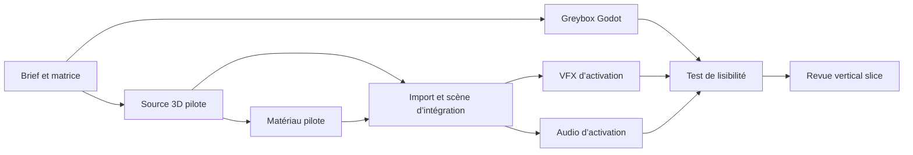
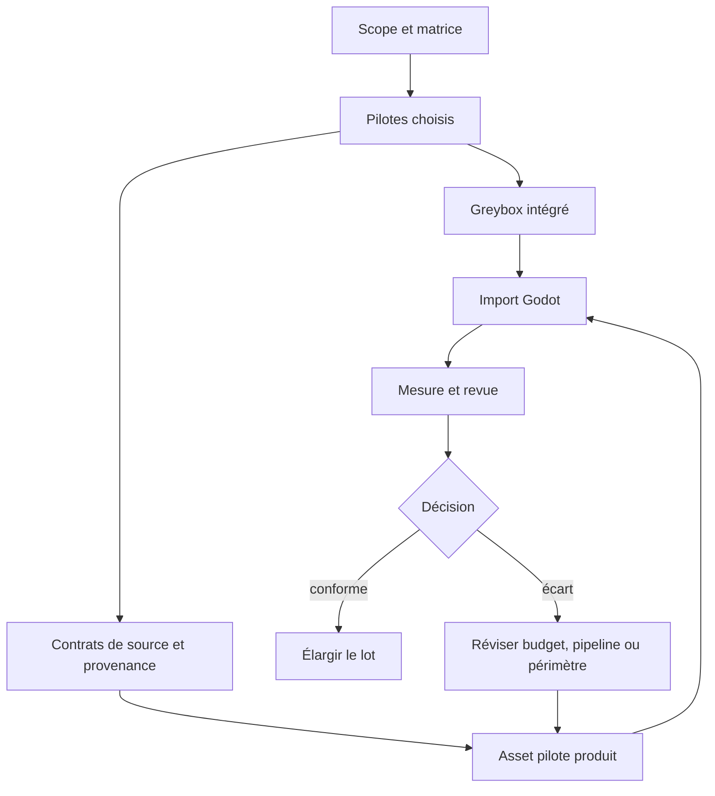

# Préproduction et cahier des charges artistique

> **Repères d’utilisation :** **[PS]** PowerShell 7, **[CMD]** Invite de commandes, **[WSL]** terminal WSL, **[DCT]** terminal dans un conteneur, **[DCK]** Docker Desktop, **[VSC]** Visual Studio Code, **[WEB]** navigateur, **[APP]** application graphique, **[SORTIE]** résultat à lire sans le saisir, **[LECTURE]** exemple ou structure de référence. Voir la [convention complète](../Volume-0/annexes/CONVENTION-OUTILS-ET-CONTEXTES.md).

> **Identifiant stable :** `DOC-L3-CH01`  
> **Priorité :** Obligatoire  
> **Parcours :** Mode Solo · Mode Studio  
> **Public :** débutant à avancé  
> **Version de référence :** Godot `4.7.1-stable`, édition Standard, GDScript, Forward+

## 1. Rôle du chapitre

Le Livre II a défini les systèmes, les responsabilités et les contraintes techniques de `Project Asteria`. Le Livre III doit maintenant transformer ces décisions en contenus concrets : personnages, créatures, objets, bâtiments, terrains, matériaux, animations, effets, interfaces et sons. Commencer directement par modéliser ou générer des images conduirait pourtant à produire des éléments séduisants mais incompatibles entre eux, trop coûteux ou inutiles au vertical slice.

Ce chapitre établit le **programme de production artistique**. Il répond à cinq questions avant la création : **quoi produire**, **pour quel usage**, **dans quel ordre**, **avec quel budget** et **selon quel critère mesurable l’élément pourra sortir de production**.

Le résultat n’est pas une galerie d’intentions. Il s’agit d’un ensemble versionné de décisions : cahier des charges, matrice d’assets, budgets initiaux, calendrier, registre des risques et checklist d’acceptation. Ces documents restent révisables lorsque les premières mesures contredisent les hypothèses.

> **[LECTURE] Chaîne de décision — Ne pas saisir.**

```text
Vision du jeu
    ↓
Besoins fonctionnels observables
    ↓
Familles et identités d’assets
    ↓
Priorités, dépendances et budgets initiaux
    ↓
Lots de production et jalons
    ↓
Critères d’acceptation mesurables
    ↓
Mesures dans Godot et révision des hypothèses
```

<!-- qa:code-explanation -->

**Explication structurée du bloc :**

- **Rôle précis du bloc :** Le flux transforme une vision générale en décisions de production vérifiables plutôt qu’en liste d’images souhaitées.

- **Déroulement :** Chaque étage doit exister avant le suivant : un budget sans usage identifié ou un calendrier sans dépendances ne possède pas de base défendable.

- **Boucle de retour :** La dernière étape renvoie vers les budgets et les priorités dès que les mesures réelles dans Godot contredisent une estimation.

- **Invariant :** Aucun asset n’est déclaré nécessaire uniquement parce qu’il serait agréable à produire ; il doit servir un besoin du prototype, du vertical slice ou de la production complète.

- **Résultat attendu :** Une autre personne doit pouvoir relier chaque ligne de la matrice d’assets à un besoin, un jalon et une preuve d’acceptation.

## 2. Prérequis, outils et fichiers de travail

Le lecteur doit connaître la vision générale de `Project Asteria`, les principaux systèmes du Livre II et la configuration de référence : Windows 11, Radeon RX 6750 XT 12 Go, Ryzen 7 2700, 32 Go de RAM et Godot `4.7.1-stable` en Forward+.

Aucune version de Blender n’est imposée dans ce chapitre. La version du DCC principal sera qualifiée lorsque le pipeline Blender deviendra actif. Ce chapitre se limite aux contrats de préproduction qui doivent survivre à un changement d’outil.

Préparer les documents suivants dans Visual Studio Code :

- `docs/art/ART-BRIEF.md` : cahier des charges artistique ;
- `content/registry/assets.csv` : matrice des assets ;
- `docs/art/ASSET-BUDGETS.yaml` : hypothèses de budgets ;
- `docs/production/ART-SCHEDULE.yaml` : calendrier et jalons ;
- `docs/production/ART-RISKS.yaml` : registre des risques ;
- `docs/art/ASSET-ACCEPTANCE.md` : checklist d’acceptation.

Ces chemins décrivent une organisation cible de `Project Asteria`. Ils ne prouvent pas que le Starter Kit ou les assets correspondants sont déjà matérialisés.

> **[VSC] Visual Studio Code — Créer :** `docs/art/ART-BRIEF.md`.

```markdown
# Cahier des charges artistique — Project Asteria

- Version : 1.0.0
- Périmètre : vertical slice
- Plateforme de mesure : Windows 11, RX 6750 XT 12 Go
- Moteur : Godot 4.7.1-stable, Forward+
- Responsable du document : art-production-owner
- Date de prochaine revue : 2026-08-05

## Objectif du lot

Prouver une chaîne complète allant d’une source traçable à un asset
accepté dans une scène Godot de validation.

## Hors périmètre

- style visuel définitif ;
- catalogue complet de la production ;
- optimisation globale du jeu ;
- décision juridique personnalisée.
```

<!-- qa:code-explanation -->

**Explication structurée du bloc :**

- **Rôle précis du bloc :** Le document fixe le périmètre de décision et empêche qu’un lot de préproduction soit confondu avec la production complète.

- **Métadonnées importantes :** La version, le périmètre, la plateforme de mesure, le moteur et le propriétaire rendent la décision révisable et attribuable.

- **Date de revue :** Elle déclenche une réévaluation planifiée ; elle n’est ni une identité d’asset ni une preuve de conformité.

- **Objectif :** Le vertical slice doit démontrer une chaîne complète, pas seulement accumuler plusieurs assets partiellement terminés.

- **Frontières :** Les choix de style, l’optimisation globale et l’analyse juridique détaillée restent dans leurs chapitres ou responsabilités propres.

- **Résultat attendu :** Un nouveau membre du projet peut déterminer en quelques minutes ce que ce lot doit prouver et ce qu’il ne doit pas tenter de résoudre.

## 3. Distinguer intention, besoin et livrable

Une **intention artistique** décrit l’effet recherché sur le joueur : majesté, vulnérabilité, lisibilité, étrangeté, chaleur ou menace. Elle oriente les décisions mais ne permet pas, seule, de planifier une tâche.

Un **besoin fonctionnel** décrit ce que l’asset doit permettre au jeu de montrer ou de faire : reconnaître un personnage à vingt mètres, aligner une arme sur une main, distinguer un danger, traverser un bâtiment ou comprendre une interaction.

Un **livrable de production** est un élément vérifiable : fichier source, export, texture, rig, animation, scène d’intégration, manifeste ou rapport de mesure. Il possède un responsable, un état et une définition de terminé.

> **[LECTURE] Exemple de décomposition — Ne pas saisir.**

```yaml
production_need:
  intention: "rendre la balise ancienne mais encore fonctionnelle"
  functional_need: "le joueur identifie son état à 15 mètres"
  deliverables:
    - "source 3D versionnée"
    - "matériau avec trois états visuels"
    - "LOD de proximité et de distance"
    - "scène Godot de comparaison"
  evidence:
    - "capture à 5 m"
    - "capture à 15 m"
    - "mesure mémoire et temps de frame"
```

<!-- qa:code-explanation -->

**Explication structurée du bloc :**

- **Rôle précis du bloc :** L’exemple sépare le but perceptif, la fonction de gameplay, les fichiers à produire et les preuves attendues.

- **Types de données :** `intention` et `functional_need` sont des chaînes ; `deliverables` et `evidence` sont des listes ordonnées de résultats distincts.

- **Dépendance :** Les livrables découlent du besoin fonctionnel ; ils ne sont pas choisis à partir d’une technique préférée ou d’un outil disponible.

- **Vérification :** Les captures à deux distances testent la lisibilité, tandis que les mesures techniques vérifient que cette lisibilité n’est pas obtenue au prix d’un coût incontrôlé.

- **Limite :** Les formulations visuelles restent provisoires tant que la bible visuelle n’a pas fixé le langage artistique définitif.

## 4. Définir les horizons de production

Un même nom d’asset peut désigner des niveaux de maturité très différents. Le projet doit distinguer au moins cinq horizons afin de ne pas exiger une finition de livraison pendant un prototype ni accepter un placeholder pendant la finition.

1. **Prototype** : prouver l’usage, l’échelle et l’intégration minimale.
2. **Vertical slice** : démontrer une qualité cible sur un périmètre limité.
3. **Contenu en Alpha** : couvrir la totalité des besoins prévus, avec des éléments encore perfectibles.
4. **Finition** : corriger cohérence, optimisation, transitions et défauts visibles.
5. **Livraison** : figer les sources, droits, budgets, imports et preuves du build candidat.

> **[VSC] Visual Studio Code — Ajouter à :** `docs/art/ART-BRIEF.md`.

```yaml
maturity_levels:
  prototype:
    purpose: "prouver la fonction"
    allowed_placeholders: true
    mandatory_godot_test: true
  vertical_slice:
    purpose: "prouver la qualité cible"
    allowed_placeholders: false
    mandatory_godot_test: true
  content_alpha:
    purpose: "couvrir tous les besoins prévus"
    allowed_placeholders: limited
    mandatory_godot_test: true
  polish:
    purpose: "corriger cohérence et défauts perceptibles"
    allowed_placeholders: false
    mandatory_godot_test: true
  delivery:
    purpose: "figer un candidat distribuable"
    allowed_placeholders: false
    mandatory_godot_test: true
```

<!-- qa:code-explanation -->

**Explication structurée du bloc :**

- **Rôle précis du bloc :** La table rend explicite ce que signifie avancer pour un asset à chaque horizon de production.

- **Valeurs fermées :** `allowed_placeholders` utilise `true`, `false` ou `limited` ; si ce format devient un fichier consommé par un outil, cette troisième valeur devra être formalisée par un schéma.

- **Invariant commun :** Le test dans Godot est obligatoire dès le prototype : un fichier correct dans son DCC ne suffit pas à prouver son échelle, son import ou son usage.

- **Progression :** La couverture s’élargit à l’alpha, puis la finition réduit les écarts ; la livraison ne sert pas à découvrir tardivement les dépendances ou licences manquantes.

- **Résultat attendu :** Chaque ligne de la matrice peut déclarer un niveau courant et une cible sans utiliser le terme ambigu `presque fini`.

## 5. Fixer l’hypothèse de vertical slice de Project Asteria

Le vertical slice doit être assez petit pour être terminé, mais assez transversal pour révéler les incompatibilités entre 3D, animation, matériaux, effets, interface, audio et import Godot.

L’hypothèse de départ retenue pour la planification est une **zone de validation jouable** contenant une balise ancienne, un personnage pilote, une créature ou un animal secondaire, un petit kit architectural, une végétation limitée, une interaction, un effet visuel et une réponse audio. Cette hypothèse ne fixe pas encore le style définitif.

> **[VSC] Visual Studio Code — Ajouter à :** `docs/art/ART-BRIEF.md`.

```yaml
vertical_slice_scope:
  location_count: 1
  playable_character_variants: 1
  secondary_living_asset_count: 1
  modular_architecture_kits: 1
  hero_props: 1
  vegetation_families: 2
  signature_vfx: 1
  signature_audio_sets: 1
  ui_flows: 1
  cinematic_sequences: 0
  final_visual_style_locked: false
```

<!-- qa:code-explanation -->

**Explication structurée du bloc :**

- **Rôle précis du bloc :** Le périmètre chiffre les familles nécessaires à une démonstration complète sans prétendre couvrir tout le jeu.

- **Types et unités :** Chaque champ `*_count` est un entier représentant une famille ou une variante planifiée, pas le nombre de fichiers exportés.

- **Décision explicite :** `cinematic_sequences: 0` évite qu’une cinématique devienne une dépendance cachée du premier lot.

- **Frontière artistique :** `final_visual_style_locked: false` rappelle que la préproduction organise le travail sans choisir seule la grammaire visuelle.

- **Révision :** Toute augmentation doit identifier sa capacité, ses dépendances et ce qu’elle remplace ; ajouter une ligne sans retirer de charge fausse le calendrier.

## 6. Construire une taxonomie d’assets

Une taxonomie permet de compter et de comparer des éléments sans réduire leur identité à un nom de fichier. Les familles initiales du Livre III sont :

- `character` : humains et humanoïdes ;
- `creature` : animaux et créatures ;
- `prop` : objets, équipements et armes ;
- `architecture` : bâtiments et kits modulaires ;
- `terrain` : reliefs, eau et grandes surfaces ;
- `vegetation` : arbres, plantes et débris naturels ;
- `material` : matériaux et ensembles de textures ;
- `animation` : rigs, clips et systèmes faciaux ;
- `vfx` : particules, shaders et simulations visuelles ;
- `ui` : composants, icônes et écrans ;
- `audio` : voix, bruitages, ambiances et musique ;
- `integration` : presets, scènes et scripts d’import ou de validation.

L’identifiant stable ne contient ni statut, ni version, ni propriétaire. Ces informations évoluent ; l’identité logique reste la même.

> **[LECTURE] Convention d’identifiants — Ne pas saisir.**

```text
<family>_<scope>_<name>

Exemples :
character_pilot_aster
prop_pilot_signal_beacon
architecture_pilot_ruin_kit
vegetation_pilot_moorland
vfx_pilot_beacon_activation
audio_pilot_beacon_activation
```

<!-- qa:code-explanation -->

**Explication structurée du bloc :**

- **Rôle précis du bloc :** La convention rend l’identité lisible dans un tableau, un rapport et un nom de scène sans dépendre d’un chemin physique.

- **Composants :** `family` classe l’asset, `scope` indique son rôle de pilote ou de production et `name` porte une désignation stable en `snake_case`.

- **Invariant :** La version, le niveau de maturité et la personne responsable restent dans les métadonnées ; les ajouter à l’identifiant provoquerait un changement d’identité à chaque révision.

- **Unicité :** Deux variantes qui partagent une même autorité de production restent sous un même identifiant avec des variantes déclarées ; deux assets indépendants reçoivent des identifiants distincts.

- **Limite :** Cette convention documentaire ne remplace pas les identifiants métier du Livre II et ne doit pas être utilisée comme clé d’instance de gameplay.

## 7. Créer la matrice des assets

La matrice constitue l’inventaire de planification. Une ligne représente un asset ou un lot cohérent possédant une seule définition de terminé. Elle ne doit pas devenir une base de données contenant tous les détails techniques : les fiches individuelles portent les informations qui changent moins souvent ou exigent davantage de contexte.

Les états minimaux sont `planned`, `ready`, `in_progress`, `review`, `accepted`, `blocked` et `retired`. `ready` signifie que les dépendances d’entrée sont disponibles ; `accepted` signifie que les critères du niveau visé ont été démontrés.

> **[VSC] Visual Studio Code — Créer :** `content/registry/assets.csv`.

```csv
asset_id,family,maturity_target,state,priority,owner,depends_on,budget_profile,acceptance_profile
character_pilot_aster,character,vertical_slice,planned,P0,solo-owner,,hero_character,character_vertical_slice
prop_pilot_signal_beacon,prop,vertical_slice,planned,P0,solo-owner,,hero_prop,hero_prop_vertical_slice
architecture_pilot_ruin_kit,architecture,vertical_slice,planned,P1,solo-owner,prop_pilot_signal_beacon,modular_kit,architecture_vertical_slice
vegetation_pilot_moorland,vegetation,vertical_slice,planned,P1,solo-owner,architecture_pilot_ruin_kit,vegetation_near,vegetation_vertical_slice
vfx_pilot_beacon_activation,vfx,vertical_slice,planned,P1,solo-owner,prop_pilot_signal_beacon,signature_vfx,vfx_vertical_slice
audio_pilot_beacon_activation,audio,vertical_slice,planned,P1,solo-owner,prop_pilot_signal_beacon,signature_audio,audio_vertical_slice
```

<!-- qa:code-explanation -->

**Explication structurée du bloc :**

- **Rôle précis du bloc :** Le CSV rend le périmètre filtrable et diffable tout en restant ouvrable dans un tableur ou un script simple.

- **Colonnes d’identité :** `asset_id` et `family` définissent l’élément ; aucune colonne de nom de fichier n’est utilisée comme identité.

- **Colonnes de pilotage :** `state`, `priority` et `owner` indiquent qui agit et dans quel ordre, sans confondre urgence et avancement.

- **Dépendances :** `depends_on` contient ici un identifiant unique pour rester lisible ; plusieurs dépendances devront être normalisées dans un format structuré ou une table séparée.

- **Profils :** `budget_profile` et `acceptance_profile` référencent des contrats réutilisables afin d’éviter de recopier les mêmes limites dans chaque ligne.

- **Résultat attendu :** Chaque ligne peut être reliée à un budget, une définition de terminé et une place dans le chemin critique.

## 8. Rédiger une fiche d’asset

La fiche complète la matrice avec les besoins fonctionnels, variantes, formats, provenance attendue et critères propres à l’asset. Elle décrit le contrat de production ; elle ne stocke pas les fichiers binaires ni les mesures historiques complètes.

> **[VSC] Visual Studio Code — Créer :** `content/registry/prop_pilot_signal_beacon.yaml`.

```yaml
schema_version: 1
asset_id: "prop_pilot_signal_beacon"
family: "prop"
purpose:
  gameplay: "support visuel de l’interaction avec une balise"
  perceptual: "distinguer inactif, disponible et activé à 15 mètres"
maturity_target: "vertical_slice"
variants:
  - "inactive"
  - "available"
  - "activated"
source_format: "to-be-qualified"
delivery_format: "glb"
scale_unit: "meter"
dependencies:
  - "material_pilot_beacon_surface"
  - "vfx_pilot_beacon_activation"
  - "audio_pilot_beacon_activation"
provenance_status: "required-before-production"
budget_profile: "hero_prop"
acceptance_profile: "hero_prop_vertical_slice"
```

<!-- qa:code-explanation -->

**Explication structurée du bloc :**

- **Rôle précis du bloc :** La fiche relie l’asset à son usage, ses variantes, ses dépendances et ses profils de contrôle.

- **Version de schéma :** `schema_version` versionne la structure de la fiche ; il ne correspond ni à la version de l’asset ni à celle du fichier source.

- **Formats :** Le format source reste `to-be-qualified` tant que le pipeline DCC n’est pas validé ; `glb` représente l’hypothèse d’échange recommandée pour la scène 3D, à confirmer par le pipeline.

- **Unité :** `scale_unit: meter` établit le contrat dimensionnel sans fixer encore les dimensions de la balise.

- **Provenance :** Le statut bloque la production définitive tant que la source, l’auteur, l’outil et les droits ne sont pas renseignés.

- **Frontière :** Les trois états visuels ne contiennent aucune règle d’interaction ; le système de gameplay reste propriétaire de l’état autoritaire.

## 9. Définir priorité, criticité et valeur d’apprentissage

Une priorité indique **quand** travailler ; une criticité indique **ce que l’échec bloque**. Les deux notions ne sont pas interchangeables.

- `P0` : indispensable pour prouver le vertical slice ;
- `P1` : nécessaire au niveau de qualité visé ;
- `P2` : amélioration importante mais remplaçable ;
- `P3` : variation ou confort à produire seulement après sécurisation du cœur.

La valeur d’apprentissage mesure la quantité d’incertitude qu’un asset pilote permet de réduire. Un petit asset révélant l’échelle, l’import, les matériaux et la réimportation peut être plus utile qu’un asset spectaculaire mais isolé.

> **[VSC] Visual Studio Code — Ajouter à :** `content/registry/prop_pilot_signal_beacon.yaml`.

```yaml
planning:
  priority: "P0"
  criticality: "blocks_vertical_slice_interaction"
  learning_value:
    import_pipeline: high
    material_pipeline: high
    gameplay_readability: high
    rigging_pipeline: none
    audio_pipeline: medium
  replacement_strategy: "use validated greybox prop"
```

<!-- qa:code-explanation -->

**Explication structurée du bloc :**

- **Rôle précis du bloc :** Les champs expliquent pourquoi l’asset est prioritaire et quelles incertitudes il doit réduire.

- **Criticité :** La valeur décrit le blocage produit par l’absence de l’asset ; elle est plus précise qu’un niveau numérique isolé.

- **Valeurs d’apprentissage :** Les niveaux `high`, `medium` et `none` comparent les domaines testés par ce pilote ; ils ne sont pas des notes de qualité.

- **Stratégie de remplacement :** Un greybox validé maintient la jouabilité lorsque la production finale est bloquée, sans faire passer le placeholder pour un asset accepté.

- **Résultat attendu :** Le projet peut décider de reporter un asset sans perdre la preuve fonctionnelle du vertical slice.

## 10. Cartographier les dépendances et le chemin critique

Une dépendance signifie qu’un livrable ne peut pas atteindre son niveau cible avant qu’un autre contrat soit disponible. Elle ne signifie pas forcément que tout le travail doit attendre : un greybox peut permettre l’intégration pendant que le modèle final progresse.

Le **chemin critique** est la chaîne de dépendances dont le retard décale directement le jalon. Il doit être recalculé à chaque changement majeur de périmètre ou de capacité.

> **[LECTURE] Graphe de dépendances du pilote — Ne pas exécuter.**



<!-- qa:code-explanation -->

**Explication structurée du bloc :**

- **Rôle précis du bloc :** Le graphe expose les prérequis du pilote et les branches pouvant avancer en parallèle.

- **Chemin critique probable :** La source 3D, le matériau, l’import puis le test de lisibilité forment une chaîne bloquante tant qu’aucun substitut valide n’existe.

- **Parallélisme :** Le greybox, le VFX et l’audio peuvent commencer avec des contrats provisoires à condition de déclarer ce qui devra être revalidé.

- **Point de convergence :** Le test de lisibilité exige les éléments visuels et audio intégrés ; valider chaque fichier séparément ne prouve pas la scène complète.

- **Révision :** Toute dépendance ajoutée doit indiquer si elle bloque réellement le jalon ou si une interface temporaire permet de préserver l’avancement.

## 11. Fixer des niveaux de qualité distincts

La qualité ne se résume pas à « low », « medium » ou « high ». Un profil doit préciser la distance de lecture, l’importance gameplay, la fréquence d’apparition, le nombre d’instances et les contraintes de gros plan.

Les valeurs qui suivent sont des **hypothèses initiales de planification**, pas des normes universelles. Elles doivent être remplacées par des budgets mesurés sur les scènes et le matériel de référence.

> **[VSC] Visual Studio Code — Créer :** `docs/art/ASSET-BUDGETS.yaml`.

```yaml
schema_version: 1
budget_status: "initial_hypothesis"
measurement_platform: "windows-rx6750xt-12gb"
profiles:
  hero_close:
    screen_use: "close-up or interaction focus"
    expected_instances: 1
    quality_priority: "silhouette_and_material_detail"
  gameplay_near:
    screen_use: "normal play distance"
    expected_instances: 1-12
    quality_priority: "readability_and_stable_cost"
  background_repeated:
    screen_use: "distant or repeated"
    expected_instances: 12-1000
    quality_priority: "batching_lod_and_memory"
revision_rule: "replace assumptions after measured pilot scenes"
```

<!-- qa:code-explanation -->

**Explication structurée du bloc :**

- **Rôle précis du bloc :** Le fichier distingue trois contextes de rendu avant de définir des nombres par famille.

- **Statut :** `initial_hypothesis` interdit de présenter les limites comme validées tant qu’aucune scène pilote n’a été mesurée.

- **Plateforme :** Le profil de mesure nomme la configuration de référence ; une autre plateforme doit produire ses propres résultats ou hériter explicitement d’une réserve.

- **Cardinalité :** `expected_instances` relie le coût unitaire à la densité prévue ; un asset léger répété mille fois peut coûter davantage qu’un héros unique.

- **Priorité qualitative :** Chaque profil indique ce que l’optimisation doit préserver : détail, lisibilité, stabilité, batching ou mémoire.

- **Révision :** Les mesures du pilote remplacent les hypothèses au lieu de s’ajouter comme seconde vérité contradictoire.

## 12. Budgéter la géométrie

La géométrie doit être planifiée par **niveau de détail**, nombre d’instances visibles, silhouettes et coût des déformations. Un nombre de triangles isolé ne décrit pas les matériaux, l’overdraw, le skinning ou les appels de rendu.

Pour le vertical slice, utiliser des plages de travail suffisamment larges pour laisser place à l’apprentissage. Les plafonds ne deviennent contraignants qu’après comparaison dans une scène Godot représentative.

> **[VSC] Visual Studio Code — Ajouter à :** `docs/art/ASSET-BUDGETS.yaml`.

```yaml
geometry_profiles:
  hero_character:
    lod0_triangles_target: 80000
    lod1_triangles_target: 40000
    lod2_triangles_target: 16000
    skinned_meshes_target: 4
    visible_instances_target: 1
  hero_prop:
    lod0_triangles_target: 30000
    lod1_triangles_target: 12000
    lod2_triangles_target: 4000
    visible_instances_target: 2
  modular_kit_piece:
    lod0_triangles_target: 12000
    lod1_triangles_target: 5000
    lod2_triangles_target: 1500
    visible_instances_target: 40
enforcement: "measure_first_then_approve_or_revise"
```

<!-- qa:code-explanation -->

**Explication structurée du bloc :**

- **Rôle précis du bloc :** Les profils fournissent une base chiffrée pour estimer la charge et préparer les tests LOD.

- **Unités :** Les cibles de triangles sont des entiers par instance et par LOD ; elles ne correspondent ni aux sommets importés ni au total de la scène.

- **Personnage :** Le nombre de maillages skinnés est suivi séparément, car plusieurs surfaces déformées peuvent augmenter le coût sans changer fortement le total de triangles.

- **Répétition :** Le kit modulaire possède une cible unitaire plus basse parce que plusieurs dizaines de pièces peuvent être visibles simultanément.

- **Limite :** Ces valeurs ne sont pas une garantie de performance ; shaders, ombres, transparence, skinning et appels de rendu doivent être mesurés ensemble.

- **Traitement d’un dépassement :** Un asset au-dessus de la cible peut être accepté seulement avec une mesure, une justification et une compensation documentées.

## 13. Budgéter textures et matériaux

La mémoire des textures dépend de la résolution, du format, des mipmaps, de la compression, du nombre de variantes et du nombre de cartes. La résolution maximale n’est donc pas une mesure suffisante.

Le cahier des charges doit suivre au minimum : dimensions sources, dimensions importées, espace colorimétrique, compression, nombre de matériaux, nombre de textures uniques et possibilité d’atlas ou de réutilisation.

> **[VSC] Visual Studio Code — Ajouter à :** `docs/art/ASSET-BUDGETS.yaml`.

```yaml
texture_material_profiles:
  hero_character:
    unique_texture_sets_target: 3
    maximum_import_resolution: 4096
    material_slots_target: 6
    transparency_allowed: "hair_and_eyes_only"
  hero_prop:
    unique_texture_sets_target: 1
    maximum_import_resolution: 2048
    material_slots_target: 3
    transparency_allowed: "exception_only"
  modular_kit:
    unique_texture_sets_target: 2
    maximum_import_resolution: 2048
    material_slots_per_piece_target: 2
    shared_trim_sheet_preferred: true
  vegetation_near:
    maximum_import_resolution: 2048
    material_slots_target: 2
    transparency_allowed: "foliage_cards"
memory_gate: "record_imported_vram_estimate_in_validation_scene"
```

<!-- qa:code-explanation -->

**Explication structurée du bloc :**

- **Rôle précis du bloc :** Les profils limitent simultanément la variété de textures, la résolution importée, les matériaux et les usages de transparence.

- **Résolution :** `maximum_import_resolution` constitue un plafond de départ ; une source peut être plus grande si l’export et l’archive le justifient, mais l’import du vertical slice respecte le profil.

- **Matériaux :** Réduire les slots peut diminuer les changements d’état et simplifier l’import, mais ne doit pas conduire à un atlas illisible ou juridiquement ambigu.

- **Transparence :** Les usages sont déclarés parce que l’overdraw et le tri peuvent coûter davantage que la géométrie remplacée.

- **Réutilisation :** Le trim sheet est préféré pour le kit modulaire afin de contrôler la mémoire et la cohérence, sans devenir une obligation pour tous les assets.

- **Vérification :** La porte exige une estimation de mémoire issue de la scène importée, pas un calcul basé uniquement sur les fichiers sources.

## 14. Budgéter rigs et animations

Le coût d’un personnage ou d’une créature dépend du nombre d’os actifs, des influences par sommet, des maillages skinnés, des blendshapes, des clips et de la fréquence d’évaluation. La planification sépare donc le **contrat de rig** de la **bibliothèque d’animations**.

> **[VSC] Visual Studio Code — Ajouter à :** `docs/art/ASSET-BUDGETS.yaml`.

```yaml
rig_profiles:
  humanoid_pilot:
    deform_bones_target: 120
    influences_per_vertex_maximum: 4
    facial_blendshapes_target: 24
    sockets_required:
      - "hand_r"
      - "hand_l"
      - "back"
  animal_pilot:
    deform_bones_target: 80
    influences_per_vertex_maximum: 4
    facial_blendshapes_target: 0
animation_profiles:
  vertical_slice_character:
    locomotion_clips_target: 8
    interaction_clips_target: 4
    combat_clips_target: 0
    loop_seams_required: true
    root_motion_policy: "declared_per_clip"
```

<!-- qa:code-explanation -->

**Explication structurée du bloc :**

- **Rôle précis du bloc :** Les profils transforment les besoins de déformation et de mouvement en limites vérifiables avant la production de nombreuses animations.

- **Os de déformation :** Le compteur exclut les contrôleurs qui ne sont pas exportés ; la nomenclature et les orientations seront définies dans le pipeline de rig.

- **Influences :** Le plafond par sommet doit être vérifié après export, car une normalisation ou un transfert de poids peut modifier le résultat.

- **Blendshapes :** La cible faciale est une hypothèse de vertical slice et ne constitue pas encore le jeu définitif de visèmes ou d’expressions.

- **Clips :** Les catégories évitent de multiplier des variantes avant de couvrir les locomotions et interactions essentielles.

- **Root motion :** La politique est déclarée par clip afin que la vitesse gameplay et la trajectoire visuelle ne se contredisent pas silencieusement.

## 15. Budgéter les effets visuels

Un VFX doit être budgété par nombre d’instances simultanées, particules actives, surface écran, transparence, lumières, collisions et durée de vie. La valeur artistique n’autorise pas un effet à masquer l’action ou à devenir une règle de gameplay.

> **[VSC] Visual Studio Code — Ajouter à :** `docs/art/ASSET-BUDGETS.yaml`.

```yaml
vfx_profiles:
  signature_vfx:
    simultaneous_instances_target: 2
    particles_per_instance_target: 5000
    dynamic_lights_maximum: 1
    collision_required: false
    screen_coverage_target_percent: 20
    lifetime_seconds_maximum: 6
  repeated_gameplay_vfx:
    simultaneous_instances_target: 16
    particles_per_instance_target: 500
    dynamic_lights_maximum: 0
    collision_required: false
    screen_coverage_target_percent: 8
    lifetime_seconds_maximum: 2
overdraw_review_required: true
```

<!-- qa:code-explanation -->

**Explication structurée du bloc :**

- **Rôle précis du bloc :** Les profils distinguent un effet signature rare d’un effet répété, ce qui empêche de réutiliser un budget de héros pour une foule d’instances.

- **Cardinalité :** Le coût doit être évalué au nombre simultané prévu ; tester un seul effet répété ne prouve pas la scène réelle.

- **Lumières et collisions :** Ces fonctionnalités sont suivies séparément parce qu’elles ajoutent des coûts qui ne se lisent pas dans le nombre de particules.

- **Surface écran :** Le pourcentage cible sert à protéger la lisibilité et l’overdraw ; il doit être évalué dans la caméra de jeu.

- **Durée :** Une limite de vie empêche les émetteurs ou particules résiduelles de s’accumuler après l’événement.

- **Frontière :** Les valeurs décrivent la représentation ; la logique d’activation reste sous l’autorité des systèmes du Livre II.

## 16. Budgéter l’audio

Le budget audio combine mémoire, durée, nombre de voix simultanées, formats, fréquence d’échantillonnage, canaux et stratégie de streaming. La qualité d’un fichier isolé ne garantit ni la cohérence du mix ni l’absence de saturation en jeu.

> **[VSC] Visual Studio Code — Ajouter à :** `docs/art/ASSET-BUDGETS.yaml`.

```yaml
audio_profiles:
  signature_audio:
    variations_target: 4
    simultaneous_voices_target: 2
    streamed: false
    channels: "mono_or_stereo_by_use"
    maximum_duration_seconds: 12
  ambience_loop:
    variations_target: 2
    simultaneous_voices_target: 4
    streamed: true
    channels: "stereo"
    loop_seam_required: true
  repeated_sfx:
    variations_target: 6
    simultaneous_voices_target: 24
    streamed: false
    channels: "mono_preferred"
mix_review_required: true
```

<!-- qa:code-explanation -->

**Explication structurée du bloc :**

- **Rôle précis du bloc :** Les profils relient le type de son à ses variations, sa concurrence et sa stratégie de chargement.

- **Variations :** La cible réduit la répétition perceptible ; elle ne signifie pas que toutes les variantes jouent avec la même probabilité.

- **Voix simultanées :** Le nombre sert à préparer les limites et priorités de mix, pas à imposer qu’elles soient toujours utilisées.

- **Streaming :** Les ambiances longues sont candidates au streaming, tandis que les sons courts répétés privilégient une disponibilité immédiate ; la mesure réelle reste nécessaire.

- **Canaux :** Le mono est privilégié pour les sources spatialisées, mais un usage musical ou ambiant peut justifier la stéréo.

- **Vérification :** La revue doit écouter les sons ensemble dans la scène et mesurer mémoire et voix actives, pas seulement inspecter les fichiers.

## 17. Budgéter l’interface

L’interface possède aussi un coût : textures, polices, thèmes, animations, nombre de contrôles, résolution, variantes de contraste et temps de compréhension. Le premier lot doit prouver un flux complet plutôt que créer plusieurs écrans uniques.

> **[VSC] Visual Studio Code — Ajouter à :** `docs/art/ASSET-BUDGETS.yaml`.

```yaml
ui_profiles:
  vertical_slice_flow:
    screen_count_target: 3
    reusable_component_target: 8
    unique_icon_target: 16
    font_family_target: 1
    font_weight_target: 3
    animated_transition_target: 4
    tested_resolutions:
      - "1920x1080"
      - "2560x1440"
    controller_navigation_required: true
    contrast_variant_required: true
```

<!-- qa:code-explanation -->

**Explication structurée du bloc :**

- **Rôle précis du bloc :** Le profil limite le nombre d’écrans et privilégie des composants réutilisables pour le vertical slice.

- **Composants :** La cible ne signifie pas huit apparences finales ; elle encourage des boutons, panneaux et indicateurs partagés plutôt que des écrans monolithiques.

- **Typographie :** Une famille et trois graisses réduisent les dépendances tout en permettant une hiérarchie initiale ; la bible visuelle pourra réviser cette hypothèse.

- **Résolutions :** Les deux formats de référence testent la mise à l’échelle sur le matériel visé sans prétendre couvrir tous les ratios.

- **Navigation :** La manette et la variante de contraste sont intégrées au budget dès la préproduction afin d’éviter une reprise tardive de tous les composants.

- **Limite :** Les critères UX détaillés, le daltonisme et les profils d’accessibilité complets seront traités dans leurs chapitres dédiés.

## 18. Transformer les hypothèses en mesures Godot

Godot fournit des moniteurs de performance et des vues de diagnostic qui permettent d’observer le coût d’une scène. Le chapitre 1 ne définit pas encore la scène universelle de validation ; il fixe les données que chaque pilote devra produire.

Une mesure utile possède une version du projet, une scène, une plateforme, un scénario de caméra, une durée d’observation, des valeurs et les limites de l’essai. Une capture unique du meilleur cas n’est pas une preuve suffisante.

> **[LECTURE] Boucle de révision des budgets — Ne pas saisir.**

```text
Hypothèse de budget
    ↓
Asset pilote importé
    ↓
Scène Godot représentative
    ↓
Mesures répétées et captures
    ↓
Comparaison à la cible perceptuelle
    ↓
Accepter / optimiser / réduire le périmètre / réviser le budget
    ↓
Enregistrer la décision et sa justification
```

<!-- qa:code-explanation -->

**Explication structurée du bloc :**

- **Rôle précis du bloc :** La boucle empêche de transformer une estimation de préproduction en règle immuable ou en justification a posteriori.

- **Ordre :** La mesure intervient après import dans une scène représentative, car le DCC et le fichier exporté ne reproduisent pas toutes les conditions du moteur.

- **Double comparaison :** Le coût technique et la cible perceptuelle sont évalués ensemble : réduire fortement un asset qui perd sa fonction de lecture n’est pas un succès.

- **Décisions possibles :** L’équipe peut optimiser, réduire le périmètre ou réviser le budget ; seule une justification documentée distingue une adaptation d’un abandon silencieux.

- **Traçabilité :** La décision finale référence les données mesurées et remplace l’hypothèse antérieure dans le registre courant.

> **[VSC] Visual Studio Code — Créer :** `work/reports/art-budget-measurement.yaml` lorsque la scène pilote existe.

```yaml
schema_version: 1
measurement_id: "measure_prop_pilot_signal_beacon_001"
asset_id: "prop_pilot_signal_beacon"
project_revision: "commit-sha-required"
engine: "Godot 4.7.1-stable"
renderer: "Forward+"
platform: "windows-rx6750xt-12gb"
scene: "res://scenes/validation/props/signal_beacon_validation.tscn"
scenario:
  camera_distance_meters: [5, 15, 30]
  simultaneous_instances: 2
  sample_duration_seconds: 60
observations:
  frame_time_ms_median: null
  frame_time_ms_p95: null
  draw_calls: null
  video_memory_estimate_mib: null
decision: "pending-runtime-measurement"
reservations:
  - "values are not populated by this documentation chapter"
```

<!-- qa:code-explanation -->

**Explication structurée du bloc :**

- **Rôle précis du bloc :** Le rapport définit la forme minimale d’une mesure reproductible sans inventer de résultats runtime.

- **Identité :** `measurement_id`, `asset_id` et `project_revision` permettent de relier les valeurs à une version précise de l’asset et du projet.

- **Scénario :** Les distances, le nombre d’instances et la durée empêchent de comparer deux mesures réalisées dans des conditions différentes.

- **Statistiques :** La médiane décrit le comportement habituel et le percentile 95 met en évidence les ralentissements fréquents ; aucune valeur n’est remplie sans exécution.

- **Valeurs nulles :** `null` indique explicitement que la donnée n’existe pas encore ; zéro signifierait une mesure réelle égale à zéro et serait trompeur.

- **Réserve :** Le chapitre reste au niveau statique et ne revendique ni scène matérialisée ni benchmark exécuté.

## 19. Estimer la capacité plutôt que promettre une date

Une estimation combine quantité, complexité, incertitude, disponibilité et reprises prévues. La capacité ne correspond jamais à cent pour cent du temps disponible : documentation, revues, intégration, corrections et imprévus consomment une part réelle du calendrier.

Utiliser des unités de capacité internes cohérentes — par exemple des **journées de production focalisée** — plutôt que convertir immédiatement chaque ligne en date publique. Les valeurs doivent être calibrées après plusieurs tâches terminées.

> **[VSC] Visual Studio Code — Ajouter à :** `docs/production/ART-SCHEDULE.yaml`.

```yaml
capacity_model:
  unit: "focused_production_day"
  weekly_available_units: 3.5
  allocation:
    planned_production_percent: 60
    integration_and_review_percent: 20
    correction_buffer_percent: 15
    maintenance_percent: 5
  estimation_confidence:
    known_pipeline: 0.75
    partially_known_pipeline: 0.50
    unknown_pipeline: 0.25
  recalibration_interval_completed_items: 3
```

<!-- qa:code-explanation -->

**Explication structurée du bloc :**

- **Rôle précis du bloc :** Le modèle sépare le temps disponible des différentes consommations nécessaires pour livrer un asset accepté.

- **Unité :** Une journée focalisée désigne une capacité de travail, pas une journée calendaire garantie ; interruptions et tâches administratives restent hors de cette valeur.

- **Allocation :** Les pourcentages totalisent 100 et réservent explicitement du temps aux revues, corrections et maintenance.

- **Confiance :** Les coefficients réduisent la fiabilité d’une estimation lorsque le pipeline n’a pas encore été pratiqué ; ils ne multiplient pas automatiquement la durée sans modèle explicite.

- **Recalibrage :** Après trois éléments terminés, le projet compare prévu et réel pour mettre à jour les estimations suivantes.

- **Limite :** Les valeurs sont adaptées au parcours Solo d’exemple ; une équipe doit mesurer sa propre capacité par spécialité.

## 20. Organiser les jalons et les lots

Un jalon est un état vérifiable du projet, pas une date sans définition de sortie. Chaque jalon possède un périmètre, des preuves, des dépendances et une décision de passage.

Le calendrier du premier chapitre doit rester à un niveau qui survivra aux changements d’outil : préparation des contrats, pilotes, intégration, mesure et revue. Les tâches détaillées seront ajoutées lorsque les pipelines spécialisés seront définis.

> **[VSC] Visual Studio Code — Créer :** `docs/production/ART-SCHEDULE.yaml`.

```yaml
schema_version: 1
schedule_status: "planning_baseline"
milestones:
  - id: "M4A_scope_ready"
    exit:
      - "asset matrix covers the vertical slice"
      - "pilot assets and blocking risks are identified"
      - "initial budget profiles exist"
  - id: "M4B_greybox_integrated"
    depends_on: ["M4A_scope_ready"]
    exit:
      - "validation zone is traversable in Godot"
      - "pilot interaction uses replaceable placeholders"
  - id: "M4C_pilot_chain_measured"
    depends_on: ["M4B_greybox_integrated"]
    exit:
      - "one pilot asset completed the source-to-Godot chain"
      - "technical and perceptual observations are recorded"
  - id: "M4D_vertical_slice_art_review"
    depends_on: ["M4C_pilot_chain_measured"]
    exit:
      - "all P0 assets meet their vertical-slice acceptance profile"
      - "remaining P1 deviations have an approved plan"
```

<!-- qa:code-explanation -->

**Explication structurée du bloc :**

- **Rôle précis du bloc :** Les jalons ordonnent la réduction des risques depuis le cadrage jusqu’à la revue du vertical slice.

- **Statut :** `planning_baseline` indique une référence de planification modifiable par une décision versionnée.

- **Dépendances :** Chaque jalon après le premier nomme son prérequis ; une date ne peut pas contourner une sortie non démontrée.

- **Placeholders :** Le greybox est accepté comme support fonctionnel tant qu’il reste remplaçable et n’est pas confondu avec l’asset final.

- **Mesure du pilote :** Le jalon M4C exige une chaîne complète avant de multiplier les familles d’assets.

- **Passage :** Les écarts P1 peuvent rester ouverts uniquement s’ils possèdent un plan approuvé ; aucun écart P0 ne reste implicite.

> **[LECTURE] Chemin critique initial — Ne pas exécuter.**



<!-- qa:code-explanation -->

**Explication structurée du bloc :**

- **Rôle précis du bloc :** Le diagramme met en évidence la chaîne qui doit être sécurisée avant l’élargissement de la production.

- **Convergence :** L’asset produit et le greybox se rejoignent à l’import ; un pipeline visuel sans scène fonctionnelle ou une scène sans source traçable restent incomplets.

- **Porte de décision :** La mesure conduit soit à l’élargissement, soit à une révision explicite ; elle ne valide jamais automatiquement un dépassement.

- **Boucle de reprise :** Un écart renvoie vers la production avec un budget, un pipeline ou un périmètre modifié, ce qui conserve l’historique du problème.

- **Résultat attendu :** Le projet évite de lancer dix assets sur un pipeline dont le premier aller-retour n’a pas été prouvé.

## 21. Maintenir un registre des risques

Un risque est un événement incertain susceptible d’affecter coût, délai, qualité, droit d’usage ou capacité de reprise. Un problème déjà présent n’est plus un risque : il devient un blocage ou un écart à traiter.

Chaque risque possède une probabilité, un impact, un propriétaire, un déclencheur observable, une mitigation et une stratégie de repli. Les niveaux ne remplacent pas la description concrète.

> **[VSC] Visual Studio Code — Créer :** `docs/production/ART-RISKS.yaml`.

```yaml
schema_version: 1
risks:
  - risk_id: "ART-RISK-001"
    description: "le pipeline source vers Godot change l’échelle ou les matériaux"
    probability: high
    impact: critical
    owner: "art-production-owner"
    trigger: "second import non équivalent au premier"
    mitigation: "valider un asset pilote avant production en série"
    fallback: "maintenir le greybox et suspendre les variantes"
    status: open
  - risk_id: "ART-RISK-002"
    description: "une source externe possède des droits de redistribution ambigus"
    probability: medium
    impact: critical
    owner: "provenance-owner"
    trigger: "licence ou consentement incomplet"
    mitigation: "bloquer la promotion et chercher une source remplaçable"
    fallback: "recréer l’asset depuis une source autorisée"
    status: open
  - risk_id: "ART-RISK-003"
    description: "les budgets initiaux sont incompatibles avec la scène réelle"
    probability: high
    impact: high
    owner: "technical-art-owner"
    trigger: "mesure pilote au-dessus de la cible de frame ou mémoire"
    mitigation: "réserver LOD, profils de qualité et marge de correction"
    fallback: "réduire densité, variété ou distance d’affichage"
    status: open
```

<!-- qa:code-explanation -->

**Explication structurée du bloc :**

- **Rôle précis du bloc :** Le registre transforme trois incertitudes majeures en signaux observables et en décisions préparées.

- **Identité :** `risk_id` reste stable même si la formulation, le propriétaire ou le statut évoluent.

- **Probabilité et impact :** Les deux dimensions restent séparées : un événement peu probable mais critique peut exiger une mitigation immédiate.

- **Déclencheur :** Chaque risque possède un fait observable qui indique qu’il se matérialise, évitant une surveillance purement intuitive.

- **Mitigation et repli :** La mitigation réduit la probabilité ou l’impact avant le problème ; le fallback décrit l’action lorsque le problème survient.

- **Frontière juridique :** Le blocage d’une source ambiguë protège la production sans prétendre fournir un avis juridique personnalisé.

## 22. Écrire des critères d’acceptation mesurables

Un critère d’acceptation décrit un résultat observable, une condition d’essai et une décision. Les formulations « beau », « réaliste », « optimisé » ou « propre » sont insuffisantes sans contexte.

Chaque profil doit couvrir les dimensions pertinentes : fonction, perception, technique, intégration, provenance, reprise et livraison. Un asset peut réussir une dimension et échouer sur une autre.

> **[VSC] Visual Studio Code — Ajouter à :** `docs/art/ASSET-ACCEPTANCE.md`.

```yaml
acceptance_profile:
  id: "hero_prop_vertical_slice"
  checks:
    - id: "function.state_readability"
      condition: "inactive, available and activated are distinguishable at 15 m"
      evidence: "three captures from the gameplay camera"
    - id: "integration.scale_orientation"
      condition: "asset imports at declared scale, pivot and forward axis"
      evidence: "Godot validation scene and import metadata"
    - id: "technical.budget"
      condition: "measured values comply with the approved hero_prop profile"
      evidence: "versioned measurement report"
    - id: "provenance.complete"
      condition: "source, author or tool, licence and transformations are recorded"
      evidence: "asset provenance record"
    - id: "reimport.stable"
      condition: "a controlled reimport preserves the integration contract"
      evidence: "before-and-after comparison"
  decision_rule: "all required checks pass or a signed exception names compensation"
```

<!-- qa:code-explanation -->

**Explication structurée du bloc :**

- **Rôle précis du bloc :** Le profil convertit la définition de terminé en contrôles séparés et prouvables.

- **Identifiants de contrôle :** Chaque `id` permet de référencer précisément un écart sans recopier tout le texte.

- **Condition et preuve :** La condition décrit ce qui doit être vrai ; `evidence` décrit l’artefact permettant de vérifier ce résultat.

- **Mesure :** Le contrôle de budget référence un profil approuvé et un rapport versionné, pas une impression de fluidité.

- **Réimport :** La stabilité de reprise fait partie de l’acceptation, car un asset impossible à réviser n’est pas réellement intégré.

- **Exception :** Une dérogation doit nommer sa compensation et son approbateur ; elle ne transforme pas un échec en succès silencieux.

## 23. Choisir les assets pilotes

Un pilote doit traverser plusieurs frontières et révéler les problèmes tôt. Il n’est pas nécessairement l’asset le plus prestigieux. Le lot de `Project Asteria` retient des pilotes complémentaires :

- la balise pour source 3D, matériaux, états, VFX, audio et interaction ;
- le personnage Aster pour silhouette, rig, animation, vêtements et caméra ;
- la zone en ruine pour métriques, kit modulaire, terrain, végétation, collisions et navigation ;
- un flux UI pour composants, navigation et lisibilité.

> **[VSC] Visual Studio Code — Ajouter à :** `docs/art/ART-BRIEF.md`.

```yaml
pilot_assets:
  - asset_id: "prop_pilot_signal_beacon"
    proves: ["source", "materials", "states", "vfx", "audio", "godot_import"]
    priority: "P0"
  - asset_id: "character_pilot_aster"
    proves: ["anatomy", "rig", "skinning", "animation", "equipment", "lod"]
    priority: "P0"
  - asset_id: "architecture_pilot_ruin_kit"
    proves: ["metrics", "modularity", "collisions", "navigation", "shared_materials"]
    priority: "P1"
  - asset_id: "ui_pilot_beacon_interaction"
    proves: ["components", "focus", "controller_navigation", "feedback", "scaling"]
    priority: "P1"
expansion_gate: "no family expands before its pilot completes the acceptance profile"
```

<!-- qa:code-explanation -->

**Explication structurée du bloc :**

- **Rôle précis du bloc :** La liste explique quelle chaîne chaque pilote doit éprouver et dans quel ordre elle réduit les risques.

- **Couverture :** Les tableaux `proves` nomment les domaines testés ; ils ne garantissent pas encore la réussite de ces domaines.

- **Priorité :** Les deux P0 sécurisent les chaînes les plus transversales et la fonction centrale du vertical slice.

- **Porte d’élargissement :** Une famille ne multiplie pas ses variantes avant que son pilote n’ait franchi les contrôles définis.

- **Limite :** La liste ne fixe ni le style, ni l’anatomie finale, ni les matériaux définitifs ; ces décisions arrivent avec la bible et les chapitres spécialisés.

## 24. Mode Solo

Le Mode Solo réduit le coût de gestion sans supprimer les décisions essentielles.

- un seul tableau de matrice ;
- sept états maximum ;
- quatre niveaux de priorité ;
- un propriétaire unique par ligne, souvent la même personne ;
- une revue personnelle différée d’au moins une session de travail ;
- un seul pilote complet avant les variantes ;
- un calendrier fondé sur la capacité réellement disponible ;
- des profils de budget peu nombreux et réutilisables.

La personne seule doit éviter de passer plus de temps à administrer le tableau qu’à réduire les risques. Toute colonne qui ne change aucune décision peut être retirée.

> **[LECTURE] Tableau Solo minimal — Ne pas saisir.**

```yaml
solo_board:
  states:
    - planned
    - ready
    - in_progress
    - review
    - accepted
    - blocked
    - retired
  work_in_progress_limit: 2
  weekly_review:
    - "update states and blockers"
    - "compare capacity with actual work"
    - "review one accepted item after a delay"
    - "remove or defer one low-value item when scope grows"
  required_documents:
    - "asset matrix"
    - "budgets"
    - "schedule"
    - "risks"
    - "acceptance checklist"
```

<!-- qa:code-explanation -->

**Explication structurée du bloc :**

- **Rôle précis du bloc :** Le tableau condense le pilotage Solo autour d’un nombre limité d’états, d’une limite de travail en cours et d’une revue hebdomadaire.

- **Limite WIP :** Deux éléments simultanés permettent un petit parallélisme sans disperser la personne sur trop de chaînes inachevées.

- **Revue différée :** Relire un asset après une interruption réduit le biais de familiarité sans exiger un second validateur permanent.

- **Contrôle du périmètre :** Toute croissance doit entraîner une suppression, un report ou une capacité supplémentaire ; elle ne s’ajoute pas gratuitement.

- **Documents :** Les cinq livrables obligatoires restent présents, mais peuvent être courts et réunis dans un même dépôt.

## 25. Mode Studio

Le Mode Studio conserve les mêmes identités, profils de budget et critères d’acceptation, mais sépare les responsabilités de décision.

Une matrice RACI peut distinguer :

- **Responsible** : réalise la tâche ;
- **Accountable** : porte la décision finale ;
- **Consulted** : fournit une expertise avant décision ;
- **Informed** : reçoit l’information après décision.

Une seule personne reste `Accountable` pour une décision donnée. Multiplier les propriétaires finaux rend les refus et arbitrages impossibles à attribuer.

> **[VSC] Visual Studio Code — Ajouter à :** `docs/production/ART-SCHEDULE.yaml`.

```yaml
studio_roles:
  art_direction:
    accountable: "art-director"
    responsible: ["concept-artist", "lead-artist"]
    consulted: ["game-design", "technical-art"]
  asset_production:
    accountable: "asset-family-owner"
    responsible: ["artist"]
    consulted: ["technical-art", "animation", "integration"]
  technical_budget:
    accountable: "technical-art-owner"
    responsible: ["technical-artist"]
    consulted: ["rendering", "platform-owner"]
  provenance:
    accountable: "provenance-owner"
    responsible: ["asset-producer"]
    consulted: ["legal-or-designated-reviewer"]
  final_acceptance:
    accountable: "production-owner"
    responsible: ["art-reviewer", "technical-reviewer"]
    consulted: ["gameplay-owner", "provenance-owner"]
independent_review_required_for:
  - "critical budget exception"
  - "external source with redistribution constraints"
  - "P0 asset acceptance"
```

<!-- qa:code-explanation -->

**Explication structurée du bloc :**

- **Rôle précis du bloc :** La matrice attribue les décisions artistiques, techniques, de provenance et de sortie sans créer une autorité globale unique.

- **Accountable :** Chaque domaine possède un décideur final unique ; les listes sont réservées aux personnes qui réalisent ou conseillent.

- **Revue indépendante :** Les exceptions critiques, droits contraints et assets P0 nécessitent une personne qui n’est pas l’unique auteur de la proposition.

- **Frontières :** Le gameplay est consulté sur la fonction et la lisibilité, mais ne devient pas propriétaire du fichier artistique ou de sa provenance.

- **Adaptation :** Une petite équipe peut cumuler plusieurs rôles sur une personne tout en conservant la distinction des responsabilités dans la décision.

## 26. Organiser les fichiers de préproduction

Les documents de décision sont des sources canoniques versionnées. Les exports, captures temporaires, caches et rapports reconstruits doivent rester séparés afin qu’une suppression de `work/` ne détruise aucune décision.

> **[LECTURE] Arborescence de référence — Ne pas saisir.**

```text
content/
├── registry/
│   ├── assets.csv
│   └── <asset_id>.yaml
├── source/
├── generated/
└── delivery/
docs/
├── art/
│   ├── ART-BRIEF.md
│   ├── ASSET-BUDGETS.yaml
│   └── ASSET-ACCEPTANCE.md
└── production/
    ├── ART-SCHEDULE.yaml
    └── ART-RISKS.yaml
scenes/
└── validation/
work/
├── staging/
├── captures/
└── reports/
```

<!-- qa:code-explanation -->

**Explication structurée du bloc :**

- **Rôle précis du bloc :** L’arborescence sépare registre, sources, sorties générées, livraisons, décisions, scènes de validation et fichiers de travail.

- **Sources canoniques :** `content/source` et `docs` portent les éléments qui ne doivent pas être reconstruits sans décision humaine.

- **Généré et livraison :** `generated` contient les sorties reproductibles intermédiaires ; `delivery` ne reçoit que les candidats promus après validation.

- **Validation :** Les scènes dédiées restent proches du projet Godot et peuvent comparer plusieurs assets sans introduire de logique métier.

- **Travail temporaire :** `work` accueille staging, captures et rapports ; sa suppression ne doit pas effacer la matrice, les budgets ou les sources.

- **Limite :** Les conventions Blender détaillées, bibliothèques liées et presets d’export seront définis avec le pipeline DCC.

## 27. Gérer les changements de périmètre

Un changement de périmètre doit montrer son coût net. Ajouter une variante, une plateforme ou une séquence implique au moins une modification de capacité, de calendrier, de risque ou de priorité.

La demande de changement ne sert pas à ralentir les petites corrections. Elle devient obligatoire lorsqu’une décision modifie un jalon, un P0, un budget de famille, une dépendance critique ou un droit de distribution.

> **[VSC] Visual Studio Code — Créer :** `docs/production/change-requests/ART-CR-001.yaml` lorsque nécessaire.

```yaml
schema_version: 1
change_id: "ART-CR-001"
status: "proposed"
requested_change: "ajouter une seconde variante jouable au vertical slice"
reason: "tester la compatibilité du pipeline d’équipement"
affected_assets:
  - "character_pilot_aster"
  - "ui_pilot_beacon_interaction"
impact:
  capacity_units: 18
  milestones: ["M4C_pilot_chain_measured", "M4D_vertical_slice_art_review"]
  new_risks: ["morphology-equipment-compatibility"]
compensation_options:
  - "retirer la variante de végétation saisonnière"
  - "déplacer la seconde variante après la revue vertical slice"
decision: "pending"
approver: "production-owner"
```

<!-- qa:code-explanation -->

**Explication structurée du bloc :**

- **Rôle précis du bloc :** La demande relie l’ajout souhaité à ses assets, sa capacité, ses jalons, ses risques et ses compensations.

- **Statut :** `proposed` signifie que le périmètre courant n’a pas encore changé ; aucune tâche ne doit être planifiée comme acquise avant la décision.

- **Impact :** La capacité est exprimée dans l’unité du calendrier et les jalons touchés sont nommés explicitement.

- **Compensation :** Les options rendent visible le choix : retirer, reporter ou ajouter de la capacité, plutôt que promettre le même délai avec davantage de travail.

- **Approbation :** Un propriétaire de production tranche après consultation des domaines concernés ; la demande elle-même ne modifie pas la matrice.

## 28. Checklist de réalisation

- [ ] Le vertical slice possède un périmètre chiffré et un hors-périmètre explicite.
- [ ] Chaque asset prévu possède un identifiant stable et une famille.
- [ ] La matrice distingue maturité, état, priorité, propriétaire et dépendances.
- [ ] Les P0 et le chemin critique sont identifiés.
- [ ] Au moins un pilote réduit plusieurs risques de pipeline.
- [ ] Les budgets sont marqués comme hypothèses tant qu’ils ne sont pas mesurés.
- [ ] Géométrie, textures, matériaux, rigs, animations, VFX, audio et UI possèdent un profil initial.
- [ ] Les mesures futures nomment projet, plateforme, scène et scénario.
- [ ] Le calendrier utilise une capacité réaliste et réserve du temps aux corrections.
- [ ] Chaque jalon possède des critères de sortie observables.
- [ ] Chaque risque possède déclencheur, mitigation, repli et propriétaire.
- [ ] Chaque profil d’acceptation associe condition et preuve.
- [ ] Le Mode Solo limite le travail en cours.
- [ ] Le Mode Studio attribue un responsable final unique par décision.
- [ ] Une demande de changement montre son coût net.
- [ ] Aucun choix de style définitif n’est présenté comme acquis.
- [ ] Aucun benchmark runtime n’est revendiqué sans mesure conservée.

## 29. Critères de validation du cahier des charges

Le cahier des charges est utilisable lorsque :

1. chaque besoin du vertical slice est relié à au moins un asset ou à une décision explicite de non-production ;
2. chaque asset possède identité, famille, niveau cible, priorité, budget et profil d’acceptation ;
3. les dépendances et le chemin critique permettent d’ordonner le travail ;
4. la somme des charges reste compatible avec la capacité déclarée ;
5. les P0, pilotes et risques bloquants sont visibles ;
6. les budgets portent un statut d’hypothèse ou une preuve de mesure ;
7. les critères de sortie peuvent être vérifiés par une autre personne ;
8. une source juridiquement ou techniquement incertaine peut être bloquée ou remplacée ;
9. le projet peut reprendre après une interruption sans reconstruire les décisions depuis la mémoire ;
10. la frontière avec la direction artistique définitive reste explicite.

## 30. Erreurs fréquentes et corrections

<!-- qa:error-correction-section -->

### 30.1 Commencer par une liste de techniques préférées

**Symptôme ou risque :** le planning contient beaucoup de sculpt, de génération IA ou de shaders, mais aucun lien avec les besoins du vertical slice.

> **[LECTURE] Exemple fautif — Ne pas utiliser.**

```yaml
tasks:
  - "faire un sculpt 8K"
  - "générer 200 concepts"
  - "créer un shader complexe"
```

<!-- qa:code-explanation -->

**Pourquoi cet exemple est fautif :** Les tâches décrivent des moyens séduisants sans préciser la fonction, l’asset, la priorité, la preuve ou la dépendance. Le projet peut les terminer sans se rapprocher d’un vertical slice jouable.

> **[LECTURE] Exemple corrigé — Ne pas saisir.**

```yaml
tasks:
  - asset_id: "prop_pilot_signal_beacon"
    need: "distinguer trois états à 15 m"
    deliverable: "asset intégré avec scène de comparaison"
    acceptance_profile: "hero_prop_vertical_slice"
```

<!-- qa:code-explanation -->

**Pourquoi la correction fonctionne :** La tâche part d’un besoin observable, nomme l’asset et la preuve de sortie. La technique reste un choix du pipeline et peut changer sans invalider l’objectif.

### 30.2 Utiliser le nom de fichier comme identité

**Symptôme ou risque :** un renommage ou un déplacement crée un nouvel asset dans la matrice et rompt l’historique des mesures.

> **[LECTURE] Exemple fautif — Ne pas utiliser.**

```csv
asset_id,path,state
beacon_final_v7.glb,content/props/beacon_final_v7.glb,review
```

<!-- qa:code-explanation -->

**Pourquoi cet exemple est fautif :** Le champ d’identité contient un nom de fichier, un statut implicite et un numéro de version. Toute correction de nom ou de format change artificiellement l’identité logique.

> **[LECTURE] Exemple corrigé — Ne pas saisir.**

```csv
asset_id,source_path,state,version
prop_pilot_signal_beacon,content/source/props/beacon.blend,review,7
```

<!-- qa:code-explanation -->

**Pourquoi la correction fonctionne :** L’identité stable reste indépendante du chemin, tandis que le fichier, l’état et la version peuvent évoluer sans perdre l’historique de l’asset.

### 30.3 Présenter une hypothèse de budget comme une norme

**Symptôme ou risque :** les artistes réduisent ou augmentent leurs assets pour respecter un nombre arbitraire qui n’a jamais été mesuré dans Godot.

> **[LECTURE] Exemple fautif — Ne pas utiliser.**

```yaml
hero_character:
  triangles_maximum: 80000
  status: "validated"
```

<!-- qa:code-explanation -->

**Pourquoi cet exemple est fautif :** Le statut affirme une validation sans scène, plateforme, scénario ni rapport. Le nombre devient une autorité fictive et masque les autres coûts du rendu.

> **[LECTURE] Exemple corrigé — Ne pas saisir.**

```yaml
hero_character:
  lod0_triangles_target: 80000
  status: "initial_hypothesis"
  validation: "measure in representative Godot scene"
```

<!-- qa:code-explanation -->

**Pourquoi la correction fonctionne :** La valeur reste une cible de planification et indique comment elle sera remplacée ou approuvée après une mesure représentative.

### 30.4 Additionner du périmètre sans compensation

**Symptôme ou risque :** chaque idée est déclarée obligatoire, mais le calendrier et la capacité ne changent jamais.

> **[LECTURE] Exemple fautif — Ne pas utiliser.**

```yaml
requested_change: "ajouter deux créatures et une cinématique"
schedule_change: 0
removed_scope: []
decision: "approved"
```

<!-- qa:code-explanation -->

**Pourquoi cet exemple est fautif :** La décision prétend absorber une charge nouvelle sans capacité, report ni suppression. Elle rend le calendrier incohérent dès son approbation.

> **[LECTURE] Exemple corrigé — Ne pas saisir.**

```yaml
requested_change: "ajouter une créature pilote"
capacity_units: 20
compensation:
  defer:
    - "cinematic_pilot_intro"
decision: "approved_with_scope_tradeoff"
```

<!-- qa:code-explanation -->

**Pourquoi la correction fonctionne :** L’ajout possède un coût et une compensation visibles. Le nouveau périmètre peut être réestimé sans conserver deux promesses contradictoires.

### 30.5 Confondre priorité et état

**Symptôme ou risque :** un asset bloqué reste marqué urgent et l’équipe suppose qu’il progresse parce qu’il est P0.

> **[LECTURE] Exemple fautif — Ne pas utiliser.**

```yaml
asset_id: "character_pilot_aster"
priority: "in_progress"
state: "P0"
```

<!-- qa:code-explanation -->

**Pourquoi cet exemple est fautif :** Les vocabulaires sont inversés : `P0` décrit l’ordre d’importance et `in_progress` décrit l’avancement. Les filtres et décisions deviennent impossibles à interpréter.

> **[LECTURE] Exemple corrigé — Ne pas saisir.**

```yaml
asset_id: "character_pilot_aster"
priority: "P0"
state: "blocked"
blocker: "rig profile not qualified"
```

<!-- qa:code-explanation -->

**Pourquoi la correction fonctionne :** L’asset reste prioritaire tout en déclarant honnêtement son blocage. Le propriétaire peut alors traiter la dépendance plutôt que masquer l’arrêt.

### 30.6 Valider un asset uniquement dans son DCC

**Symptôme ou risque :** le modèle paraît correct dans l’outil de création, mais arrive à la mauvaise échelle ou perd ses matériaux dans Godot.

> **[LECTURE] Exemple fautif — Ne pas utiliser.**

```yaml
acceptance:
  - "looks correct in source application"
decision: "accepted"
```

<!-- qa:code-explanation -->

**Pourquoi cet exemple est fautif :** La seule preuve dépend de l’environnement source et n’observe ni import, ni échelle, ni pivot, ni matériau, ni réimport dans le moteur cible.

> **[LECTURE] Exemple corrigé — Ne pas saisir.**

```yaml
acceptance:
  - "source file opens without missing dependencies"
  - "Godot import matches declared scale and orientation"
  - "materials and LOD are verified in validation scene"
  - "controlled reimport preserves the integration contract"
decision: "pending_until_all_checks_pass"
```

<!-- qa:code-explanation -->

**Pourquoi la correction fonctionne :** Les contrôles couvrent la source, l’échange, le moteur et la reprise. L’acceptation dépend de la chaîne complète plutôt que d’une vue isolée.

### 30.7 Oublier la provenance jusqu’à la livraison

**Symptôme ou risque :** un asset avancé doit être retiré parce que personne ne peut démontrer ses droits ou ses transformations.

> **[LECTURE] Exemple fautif — Ne pas utiliser.**

```yaml
asset_id: "material_pilot_stone"
provenance_status: "to_check_before_release"
production_state: "accepted"
```

<!-- qa:code-explanation -->

**Pourquoi cet exemple est fautif :** L’asset atteint l’acceptation alors que sa provenance reste inconnue. Le coût de remplacement augmente à mesure qu’il est réutilisé par d’autres éléments.

> **[LECTURE] Exemple corrigé — Ne pas saisir.**

```yaml
asset_id: "material_pilot_stone"
provenance_status: "complete"
production_gate: "blocked_unless_provenance_complete"
production_state: "ready"
```

<!-- qa:code-explanation -->

**Pourquoi la correction fonctionne :** La provenance devient une condition d’entrée de la production définitive. Une source ambiguë est remplacée avant de contaminer les dépendances.

### 30.8 Déclarer tous les assets critiques

**Symptôme ou risque :** le tableau ne permet plus de choisir quoi terminer lorsque la capacité diminue ou qu’un pipeline bloque.

> **[LECTURE] Exemple fautif — Ne pas utiliser.**

```csv
asset_id,priority
character_pilot_aster,P0
prop_pilot_signal_beacon,P0
architecture_pilot_ruin_kit,P0
vegetation_pilot_moorland,P0
vfx_pilot_beacon_activation,P0
audio_pilot_beacon_activation,P0
```

<!-- qa:code-explanation -->

**Pourquoi cet exemple est fautif :** Une priorité unique supprime la fonction de classement. Le projet ne distingue plus la preuve minimale, la qualité cible et les améliorations reportables.

> **[LECTURE] Exemple corrigé — Ne pas saisir.**

```csv
asset_id,priority
character_pilot_aster,P0
prop_pilot_signal_beacon,P0
architecture_pilot_ruin_kit,P1
vegetation_pilot_moorland,P1
vfx_pilot_beacon_activation,P1
audio_pilot_beacon_activation,P1
```

<!-- qa:code-explanation -->

**Pourquoi la correction fonctionne :** Les P0 sécurisent la fonction et les chaînes principales ; les P1 complètent la qualité du vertical slice sans masquer ce qui doit survivre à une réduction de capacité.

### 30.9 Mesurer un meilleur cas non représentatif

**Symptôme ou risque :** un benchmark fluide avec un seul asset immobile est utilisé pour autoriser une scène qui en affichera plusieurs avec VFX, ombres et animation.

> **[LECTURE] Exemple fautif — Ne pas utiliser.**

```yaml
scenario:
  simultaneous_instances: 1
  camera: "static"
  duration_seconds: 2
decision: "budget_validated_for_gameplay"
```

<!-- qa:code-explanation -->

**Pourquoi cet exemple est fautif :** Le scénario réduit artificiellement la densité, le mouvement et la durée. Il ne couvre ni la répétition prévue ni les variations du temps de frame.

> **[LECTURE] Exemple corrigé — Ne pas saisir.**

```yaml
scenario:
  simultaneous_instances: 12
  camera_path: "representative_gameplay_route"
  vfx_enabled: true
  shadows_enabled: true
  duration_seconds: 60
  statistics: ["median", "p95"]
decision: "pending_measured_results"
```

<!-- qa:code-explanation -->

**Pourquoi la correction fonctionne :** Le scénario reproduit la densité et les fonctions prévues, dure assez longtemps pour observer des variations et conserve plusieurs statistiques avant décision.

### 30.10 Choisir le style définitif dans le cahier des charges

**Symptôme ou risque :** les budgets et quantités sont liés à une esthétique non testée, ce qui empêche la bible visuelle de comparer plusieurs directions viables.

> **[LECTURE] Exemple fautif — Ne pas utiliser.**

```yaml
art_brief:
  final_style: "photorealistic dark fantasy with exact palette"
  alternatives_allowed: false
  validation_status: "locked"
```

<!-- qa:code-explanation -->

**Pourquoi cet exemple est fautif :** Le document verrouille une grammaire visuelle sans planches comparatives, tests de lisibilité ou validation dans Godot. Il consomme prématurément la responsabilité de la bible visuelle.

> **[LECTURE] Exemple corrigé — Ne pas saisir.**

```yaml
art_brief:
  perceptual_goals:
    - "silhouettes lisibles à distance"
    - "matières anciennes mais fonctionnelles"
    - "contraste suffisant pour les interactions"
  final_style_locked: false
  decision_inputs_required:
    - "visual bible proposals"
    - "Godot readability tests"
    - "measured production cost"
```

<!-- qa:code-explanation -->

**Pourquoi la correction fonctionne :** Le cahier des charges fixe des objectifs et les preuves nécessaires, tout en laissant la direction artistique comparer et valider le langage visuel définitif.

## 31. Décisions retenues pour Project Asteria

La préproduction artistique de `Project Asteria` retient les décisions suivantes :

- le premier objectif est un vertical slice limité mais transversal ;
- les besoins fonctionnels précèdent les techniques de création ;
- chaque asset possède un identifiant stable indépendant de ses fichiers et versions ;
- la matrice sépare maturité, état, priorité, propriétaire, dépendances, budget et acceptation ;
- les budgets initiaux sont des hypothèses explicitement révisables ;
- les mesures futures sont réalisées dans des scènes Godot représentatives et reliées à un commit ;
- aucun résultat runtime n’est inventé dans ce chapitre ;
- le chemin critique sécurise d’abord un aller-retour source vers Godot ;
- la balise, Aster, le kit en ruine et le flux UI servent de pilotes complémentaires ;
- les risques de pipeline, de droits et de performance possèdent déclencheurs et replis ;
- le Mode Solo limite le travail en cours et la charge administrative ;
- le Mode Studio sépare réalisation, responsabilité finale, consultation et information ;
- toute croissance du périmètre expose son coût net et sa compensation ;
- la provenance devient une condition d’entrée, pas une formalité de livraison ;
- le style visuel définitif reste ouvert jusqu’à sa validation par une bible et des tests dédiés.

## 32. Sources techniques officielles

- [Godot 4.7 — Formats de scènes 3D disponibles et recommandation glTF 2.0](https://docs.godotengine.org/en/4.7/tutorials/assets_pipeline/importing_3d_scenes/available_formats.html)
- [Godot 4.7 — Classe `Performance` et moniteurs disponibles](https://docs.godotengine.org/en/4.7/classes/class_performance.html)
- [Godot — Configuration avancée de l’import de scènes 3D](https://docs.godotengine.org/en/stable/tutorials/assets_pipeline/importing_3d_scenes/import_configuration.html)
- [Godot 4.7 — Optimisation générale et importance de la mesure](https://docs.godotengine.org/en/4.7/tutorials/performance/general_optimization.html)

Ces références confirment le choix d’un échange 3D centré sur glTF, l’existence de moniteurs de performance et la nécessité de mesurer dans le moteur. Elles ne constituent pas une exécution du projet ni une qualification du futur pipeline Blender.
