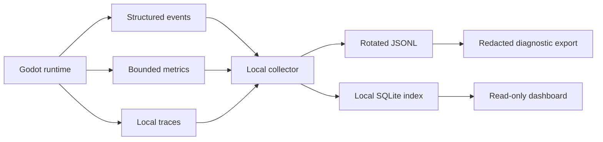

# Journalisation et observabilité locale

> **Repères d’utilisation :** **[PS]** PowerShell 7, **[VSC]** Visual Studio Code, **[APP]** application graphique nommée, **[SORTIE]** résultat à lire sans le saisir, **[LECTURE]** exemple ou structure de référence. Voir la [convention complète](../Volume-0/annexes/CONVENTION-OUTILS-ET-CONTEXTES.md).
## 1. Rôle du chapitre
La journalisation répond à la question « que s’est-il passé ? ». L’observabilité locale ajoute les moyens de relier les événements, de mesurer leur évolution et de suivre le parcours d’une opération sans envoyer les données vers un service distant.
Ce chapitre définit une architecture locale, hors ligne par défaut et bornée. Elle fournit des preuves utiles au diagnostic du chapitre 4, sans recopier son protocole de rapport, et prépare les mesures du chapitre 6 sans transformer les journaux en profiler CPU.
`Project Asteria` utilise trois familles complémentaires : des événements structurés lisibles, des métriques agrégées à cardinalité contrôlée et des traces corrélées pour les opérations importantes.
## 2. Résultats d’apprentissage
À la fin du chapitre, le lecteur saura :
- choisir un niveau et une catégorie de journal adaptés ;
- émettre un événement structuré avec horodatage, contexte et corrélation ;
- distinguer un journal, une métrique et une trace ;
- limiter la cardinalité, le volume et le coût d’écriture ;
- appliquer redaction, minimisation, rétention et purge ;
- construire un collecteur local validant les schémas ;
- préparer un tableau de bord local sans lui donner d’autorité métier ;
- diagnostiquer un incident simulé à partir d’une chaîne de preuves ;
- organiser l’observabilité en modes Solo et Studio ;
- maintenir une frontière nette avec le débogage approfondi et le profilage.

## 3. Niveau de preuve et réserves
Le chapitre est accepté au niveau `static-review`. Les politiques, schémas, extraits GDScript, scripts Python, requêtes SQL et procédures sont relus statiquement. Aucun collecteur n’est installé, aucun incident n’est réellement simulé et aucune mesure runtime de `Project Asteria` n’est revendiquée.
> **[LECTURE] État de preuve du chapitre — Ne pas saisir.**
```yaml
evidence_level:
  chapter: static_review
  local_collector_materialized: false
  dashboard_materialized: false
  incident_simulation_executed: false
  runtime_overhead_measured: false
  player_data_collected: false
```
<!-- qa:code-explanation -->
**Explication structurée du bloc :**
- **Statut :** `static_review` qualifie une revue documentaire et non une campagne d’exécution.
- **Indépendance :** chaque livrable possède son propre indicateur de matérialisation.
- **Confidentialité :** `player_data_collected: false` interdit d’inférer une collecte réelle.
- **Limite :** un futur passage à `runtime-tested` exigera des artefacts, des commandes, des sorties et une durée conservée.

## 4. Prérequis et frontières
Le lecteur doit connaître la stratégie QA du chapitre 2, les campagnes du chapitre 3, les dossiers d’anomalie du chapitre 4 et les bases de journalisation du Livre II, chapitre 28.
Le présent chapitre possède la politique de journalisation, le format structuré, le collecteur local, la rotation, la confidentialité, la purge et les tableaux de bord. Le chapitre 4 conserve la reproduction et la réduction des anomalies. Le chapitre 6 possédera les budgets CPU, les captures de profiler et les comparaisons avant/après.
> **Frontière essentielle :** une mesure d’observabilité signale et contextualise. Elle ne prouve pas à elle seule une cause, ne remplace pas une reproduction et ne déclenche pas directement une décision gameplay.
## 5. Vocabulaire opérationnel
- **Journal :** suite d’événements horodatés décrivant des faits observables.
- **Événement :** enregistrement atomique d’un fait avec nom, niveau, catégorie et attributs.
- **Métrique :** valeur numérique agrégée associée à une unité, une fenêtre et des dimensions bornées.
- **Trace :** enchaînement d’opérations corrélées, composé de spans parent-enfant.
- **Span :** intervalle représentant une opération avec début, fin, statut et attributs.
- **Corrélation :** identifiant partagé reliant plusieurs événements d’une même opération.
- **Cardinalité :** nombre de valeurs distinctes possibles pour une dimension.
- **Rétention :** durée pendant laquelle une donnée reste conservée.
- **Rotation :** fermeture d’un fichier courant et ouverture d’un nouveau selon une règle.
- **Expurgation :** suppression ou transformation irréversible d’informations sensibles avant stockage ou partage.

## 6. Modèle d’observabilité locale
> **[LECTURE] Architecture locale de référence — Ne pas saisir.**

<!-- qa:code-explanation -->
**Explication structurée du bloc :**
- **Flux :** les trois familles convergent vers un collecteur local commun.
- **Stockage :** JSONL conserve la preuve brute alors que SQLite fournit un index interrogeable.
- **Lecture :** le tableau de bord est en lecture seule et ne modifie pas le runtime.
- **Export :** seules des données expurgées entrent dans une archive diagnostique.

## 7. Principes directeurs
- local et hors ligne par défaut ;
- schéma versionné avant volume ;
- attributs minimaux et utiles ;
- aucun secret ni donnée personnelle en clair ;
- cardinalité et rétention bornées ;
- horloge et unités explicites ;
- corrélation stable sur toute l’opération ;
- perte contrôlée préférable au blocage du gameplay ;
- tableau de bord sans autorité métier ;
- purge testable et traçable.

## 8. Distinguer événements, métriques et traces
> **[LECTURE] Matrice de choix — Ne pas saisir.**
```yaml
decision:
  exact_fact:
    use: event
    example: save_completed
  numeric_trend:
    use: metric
    example: save_duration_ms
  multi_step_path:
    use: trace
    example: save_pipeline
  root_cause:
    use: reproduction_plus_evidence
    owner: chapter_4
```
<!-- qa:code-explanation -->
**Explication structurée du bloc :**
- **Événement :** convient à un fait discret dont le contenu doit rester consultable.
- **Métrique :** convient à une tendance numérique dont les dimensions sont bornées.
- **Trace :** convient au chemin d’une opération traversant plusieurs composants.
- **Cause :** reste une conclusion d’investigation et non un type de télémétrie.

## 9. Politique de journalisation
> **[VSC] Visual Studio Code — Créer `config/observability/logging-policy.v1.yaml`.**
```yaml
logging_policy:
  schema_version: 1
  default_level: info
  minimum_release_level: info
  local_only: true
  structured_format: jsonl
  max_event_bytes: 16384
  fail_mode: drop_and_count
  secrets_allowed: false
  personal_data_allowed: false
```
<!-- qa:code-explanation -->
**Explication structurée du bloc :**
- **Niveau :** `default_level` s’applique lorsque la catégorie n’a pas de règle plus précise.
- **Taille :** `max_event_bytes` empêche un attribut libre de gonfler un fichier.
- **Défaillance :** `drop_and_count` évite de bloquer le gameplay tout en comptant la perte.
- **Données :** les deux indicateurs à `false` définissent une interdiction, pas une simple préférence.

## 10. Niveaux de journal
- **`trace` :** détail très fin, désactivé dans une version distribuée sauf session diagnostique bornée.
- **`debug` :** information de développement utile pour comprendre une branche ou un état.
- **`info` :** événement normal important : démarrage, sauvegarde réussie, migration terminée.
- **`notice` :** situation inhabituelle mais gérée : repli utilisé, ressource facultative absente.
- **`warning` :** dégradation ou risque qui mérite une investigation sans interrompre l’opération.
- **`error` :** opération échouée avec impact local et état final connu.
- **`critical` :** intégrité, sécurité ou disponibilité fortement compromise ; action immédiate requise.

## 11. Règles de niveau par catégorie
> **[VSC] Visual Studio Code — Créer `config/observability/category-levels.v1.yaml`.**
```yaml
category_levels:
  persistence:
    release_minimum: info
    diagnostic_override: debug
  ai_runtime:
    release_minimum: notice
    diagnostic_override: debug
  rendering:
    release_minimum: warning
    diagnostic_override: info
  security:
    release_minimum: notice
    diagnostic_override: debug
```
<!-- qa:code-explanation -->
**Explication structurée du bloc :**
- **Catégories :** chaque domaine peut relever son seuil sans modifier le schéma global.
- **Version distribuée :** `release_minimum` limite le volume permanent.
- **Session diagnostique :** `diagnostic_override` reste temporaire, local et explicitement activé.
- **Sécurité :** un niveau détaillé n’autorise jamais l’écriture de secrets.

## 12. Taxonomie des catégories
- **`lifecycle` :** démarrage, arrêt, changement de scène et version chargée.
- **`persistence` :** sauvegarde, chargement, migration et intégrité.
- **`gameplay` :** actions significatives, transitions de règles et résultats contrôlés.
- **`ai_runtime` :** décisions synthétiques, repli et files d’attente, sans prompts sensibles.
- **`content` :** chargement de catalogues, validation et identifiants manquants.
- **`network` :** réservé aux chapitres multijoueur ; aucune donnée de session secrète.
- **`security` :** refus d’autorisation, intégrité, configuration et politiques.
- **`performance` :** signaux agrégés légers ; le profilage détaillé appartient aux chapitres 6 à 9.
- **`diagnostics` :** statut du collecteur, perte, rotation et purge.

## 13. Schéma d’événement structuré
> **[VSC] Visual Studio Code — Créer `config/observability/event-schema.v1.yaml`.**
```yaml
event:
  schema_version: 1
  event_name: save.completed
  timestamp_utc: "2026-07-26T00:00:00.000000Z"
  level: info
  category: persistence
  correlation_id: "01JOBSERVABILITY000000000001"
  source: SaveService
  build_id: "asteria-dev-placeholder"
  attributes:
    slot_kind: test_fixture
    duration_ms: 0
  outcome: success
```
<!-- qa:code-explanation -->
**Explication structurée du bloc :**
- **Identité :** `event_name` est stable et indépendant du texte humain.
- **Temps :** l’horodatage UTC inclut les fractions de seconde et le suffixe `Z`.
- **Corrélation :** l’identifiant relie l’événement à une opération plus large.
- **Attributs :** les valeurs restent typées, bornées et sans texte libre joueur.
- **Résultat :** `outcome` distingue succès, refus contrôlé et échec.

## 14. Convention des noms d’événement
Un nom suit la forme `domaine.action` ou `domaine.objet.action`, en minuscules, sans identifiant dynamique. `save.completed` est stable ; `save.player_8472.completed` crée une taxonomie illimitée et doit être refusé.
> **[LECTURE] Exemples de noms stables — Ne pas saisir.**
```yaml
accepted:
  - app.started
  - save.write.completed
  - save.migration.rejected
  - content.catalog.loaded
  - diagnostics.events.dropped
rejected:
  - player_8472_saved
  - error_20260726_001
  - something_bad_happened
```
<!-- qa:code-explanation -->
**Explication structurée du bloc :**
- **Acceptés :** les noms décrivent une classe de faits réutilisable.
- **Rejetés :** les identifiants, dates et formulations vagues empêchent l’agrégation.
- **Dimension :** une valeur variable appartient aux attributs seulement si sa cardinalité est autorisée.
- **Évolution :** un changement de sens exige un nouveau nom ou une nouvelle version de schéma.

## 15. Horodatage et horloge monotone
> **[VSC] Visual Studio Code — Créer `res://src/core/observability/clock.gd`.**
```gdscript
class_name ObservabilityClock
extends RefCounted

static func utc_iso8601() -> String:
	return Time.get_datetime_string_from_system(true, true) + "Z"

static func monotonic_usec() -> int:
	return Time.get_ticks_usec()
```
<!-- qa:code-explanation -->
**Explication structurée du bloc :**
- **UTC :** `true` demande la représentation UTC pour relier des fichiers de machines différentes.
- **Monotone :** `get_ticks_usec()` mesure une durée sans dépendre d’un changement de l’horloge civile.
- **Séparation :** l’instant UTC sert au classement ; le compteur monotone sert aux durées.
- **Limite :** la précision réellement utile dépend du système et ne doit pas être inventée.

## 16. Identifiants de corrélation
> **[VSC] Visual Studio Code — Créer `res://src/core/observability/correlation_context.gd`.**
```gdscript
class_name CorrelationContext
extends RefCounted

var correlation_id: String
var parent_span_id: String

func _init(p_correlation_id: String, p_parent_span_id: String = "") -> void:
	correlation_id = p_correlation_id
	parent_span_id = p_parent_span_id

func child(p_span_id: String) -> CorrelationContext:
	return CorrelationContext.new(correlation_id, p_span_id)
```
<!-- qa:code-explanation -->
**Explication structurée du bloc :**
- **Propagation :** un enfant conserve `correlation_id` au lieu d’en créer un nouveau.
- **Parenté :** `parent_span_id` décrit l’opération immédiatement englobante.
- **Constructeur :** les paramètres obligent l’appelant à fournir un contexte explicite.
- **Limite :** la génération cryptographiquement sûre de l’identifiant doit utiliser une bibliothèque qualifiée si une propriété de sécurité est requise.

## 17. Contexte minimal commun
> **[VSC] Visual Studio Code — Créer `config/observability/common-fields.v1.yaml`.**
```yaml
common_fields:
  required:
    - schema_version
    - event_name
    - timestamp_utc
    - level
    - category
    - correlation_id
    - source
    - build_id
    - outcome
  optional_bounded:
    - scene_id
    - subsystem
    - operation_kind
    - retry_index
```
<!-- qa:code-explanation -->
**Explication structurée du bloc :**
- **Requis :** les champs permettent de filtrer et relier les événements sans lire un message libre.
- **Optionnels :** les dimensions sont des vocabulaires bornés, pas des identifiants d’instance.
- **Build :** `build_id` relie l’observation à un artefact précis.
- **Refus :** un champ non déclaré doit être rejeté ou placé derrière une évolution de schéma.

## 18. Contrat d’émetteur Godot
> **[VSC] Visual Studio Code — Créer `res://src/core/observability/event_emitter.gd`.**
```gdscript
class_name EventEmitter
extends RefCounted

var _sink: ObservabilitySink
var _clock: ObservabilityClock

func _init(p_sink: ObservabilitySink, p_clock: ObservabilityClock) -> void:
	_sink = p_sink
	_clock = p_clock

func emit(event_name: String, level: String, category: String,
		context: CorrelationContext, attributes: Dictionary,
		outcome: String) -> Error:
	var event := {
		"schema_version": 1,
		"event_name": event_name,
		"timestamp_utc": _clock.utc_iso8601(),
		"monotonic_usec": _clock.monotonic_usec(),
		"level": level,
		"category": category,
		"correlation_id": context.correlation_id,
		"source": "runtime",
		"attributes": attributes.duplicate(true),
		"outcome": outcome,
	}
	return _sink.write(event)
```
<!-- qa:code-explanation -->
**Explication structurée du bloc :**
- **Injection :** le sink et l’horloge sont fournis pour permettre les tests déterministes.
- **Copie :** `duplicate(true)` évite qu’un appelant modifie les attributs après émission.
- **Codes de retour :** `Error` permet à l’appelant de compter une perte sans lever une exception gameplay.
- **Frontière :** la validation et l’expurgation finales restent la responsabilité du sink.

## 19. Interface de sink
> **[VSC] Visual Studio Code — Créer `res://src/core/observability/observability_sink.gd`.**
```gdscript
class_name ObservabilitySink
extends RefCounted

func write(_event: Dictionary) -> Error:
	return ERR_UNAVAILABLE

func flush() -> Error:
	return OK

func close() -> Error:
	return OK
```
<!-- qa:code-explanation -->
**Explication structurée du bloc :**
- **Abstraction :** l’émetteur ne dépend ni d’un fichier ni d’une base.
- **Valeur par défaut :** `ERR_UNAVAILABLE` empêche une implémentation vide de simuler un succès.
- **Flush :** la méthode matérialise une frontière de durabilité sans promettre une synchronisation disque universelle.
- **Fermeture :** `close()` permet de finaliser une rotation ou un arrêt contrôlé.

## 20. Sink JSON Lines
> **[VSC] Visual Studio Code — Créer `res://src/core/observability/jsonl_sink.gd`.**
```gdscript
class_name JsonlSink
extends ObservabilitySink

var _file: FileAccess
var _validator: EventValidator

func _init(path: String, validator: EventValidator) -> void:
	_validator = validator
	_file = FileAccess.open(path, FileAccess.WRITE_READ)

func write(event: Dictionary) -> Error:
	var checked := _validator.validate_and_redact(event)
	if not checked.ok:
		return ERR_INVALID_DATA
	_file.seek_end()
	_file.store_line(JSON.stringify(checked.event))
	return OK if _file.get_error() == OK else _file.get_error()

func flush() -> Error:
	_file.flush()
	return _file.get_error()
```
<!-- qa:code-explanation -->
**Explication structurée du bloc :**
- **Validation :** aucune ligne n’est écrite avant la validation et l’expurgation.
- **Append :** `seek_end()` maintient un journal append-only dans le fichier courant.
- **Sérialisation :** une ligne JSON indépendante facilite la récupération après troncature partielle.
- **Retour :** l’erreur de `FileAccess` reste visible pour le compteur de pertes.

## 21. Validation et expurgation
> **[VSC] Visual Studio Code — Créer `res://src/core/observability/event_validator.gd`.**
```gdscript
class_name EventValidator
extends RefCounted

const FORBIDDEN_KEYS := {
	"password": true,
	"token": true,
	"authorization": true,
	"email": true,
	"ip_address": true,
}

func validate_and_redact(event: Dictionary) -> Dictionary:
	if not event.has_all(["event_name", "level", "category", "attributes"]):
		return {"ok": false, "event": {}}
	var clean := event.duplicate(true)
	for key in clean.attributes.keys():
		if FORBIDDEN_KEYS.has(String(key).to_lower()):
			clean.attributes[key] = "[REDACTED]"
	return {"ok": true, "event": clean}
```
<!-- qa:code-explanation -->
**Explication structurée du bloc :**
- **Liste interdite :** les clés sensibles connues sont remplacées avant stockage.
- **Copie profonde :** l’événement original reste inchangé pour éviter un effet de bord caché.
- **Schéma minimal :** l’absence d’un champ essentiel produit un refus contrôlé.
- **Limite :** une liste de clés ne remplace pas la minimisation ni une revue des valeurs libres.

## 22. Classification des données
> **[VSC] Visual Studio Code — Créer `config/observability/data-classification.v1.yaml`.**
```yaml
data_classes:
  public_technical:
    examples: [event_name, build_id, schema_version]
    storage: allowed
  internal_bounded:
    examples: [scene_id, operation_kind, retry_index]
    storage: allowed_with_retention
  sensitive:
    examples: [filesystem_path, free_text, crash_dump]
    storage: deny_by_default
  secret:
    examples: [password, token, private_key]
    storage: forbidden
```
<!-- qa:code-explanation -->
**Explication structurée du bloc :**
- **Public technique :** les valeurs décrivent le logiciel et non une personne.
- **Interne borné :** le stockage exige une finalité et une rétention.
- **Sensible :** l’absence d’autorisation explicite vaut refus.
- **Secret :** aucune configuration de niveau ne peut lever cette interdiction.

## 23. Politique de taille
> **[VSC] Visual Studio Code — Créer `config/observability/size-limits.v1.yaml`.**
```yaml
size_limits:
  max_event_bytes: 16384
  max_attribute_string_bytes: 512
  max_attribute_count: 32
  max_array_items: 16
  oversize_action: reject_and_count
```
<!-- qa:code-explanation -->
**Explication structurée du bloc :**
- **Événement :** la taille totale empêche les charges accidentelles ou hostiles.
- **Chaîne :** une valeur libre est tronquée ou refusée selon la politique, jamais stockée sans borne.
- **Collections :** les nombres d’attributs et d’éléments limitent la complexité.
- **Signal :** `reject_and_count` rend la perte observable sans recopier la charge refusée.

## 24. Rotation des fichiers
> **[VSC] Visual Studio Code — Créer `config/observability/rotation.v1.yaml`.**
```yaml
rotation:
  active_file: "user://observability/events-current.jsonl"
  max_file_bytes: 8388608
  max_file_age_minutes: 60
  retained_files: 12
  naming: "events-{sequence:04d}.jsonl"
  rotate_before_write: true
```
<!-- qa:code-explanation -->
**Explication structurée du bloc :**
- **Double seuil :** la taille et l’âge couvrent les sessions très actives comme les sessions longues.
- **Rétention :** `retained_files` borne le nombre d’archives locales.
- **Séquence :** le nom ne contient ni identifiant joueur ni texte libre.
- **Pré-écriture :** la rotation avant écriture évite de dépasser fortement la limite avec un événement valide.

## 25. État de rotation
> **[VSC] Visual Studio Code — Créer `res://src/core/observability/rotation_state.gd`.**
```gdscript
class_name RotationState
extends RefCounted

var sequence: int = 0
var opened_monotonic_usec: int = 0
var bytes_written: int = 0

func should_rotate(next_event_bytes: int, now_usec: int,
		max_bytes: int, max_age_usec: int) -> bool:
	return (
		bytes_written + next_event_bytes > max_bytes
		or now_usec - opened_monotonic_usec >= max_age_usec
	)
```
<!-- qa:code-explanation -->
**Explication structurée du bloc :**
- **Prévision :** la taille du prochain événement participe à la décision.
- **Durée :** l’âge utilise une horloge monotone pour résister aux changements d’heure système.
- **État :** les trois valeurs suffisent à une décision locale et testable.
- **Limite :** la suppression des anciens fichiers reste une opération séparée et vérifiée.

## 26. Rétention et purge
> **[VSC] Visual Studio Code — Créer `config/observability/retention.v1.yaml`.**
```yaml
retention:
  events_days: 3
  metrics_days: 14
  traces_days: 3
  diagnostic_exports_days: 7
  purge_on_startup: true
  purge_on_shutdown: false
  legal_hold_supported: false
```
<!-- qa:code-explanation -->
**Explication structurée du bloc :**
- **Durées :** chaque famille possède une finalité et une durée distinctes.
- **Démarrage :** la purge au lancement permet de récupérer après un arrêt brutal.
- **Arrêt :** la purge n’allonge pas la fermeture du jeu.
- **Portée :** l’absence de conservation légale évite d’inventer une obligation au projet fil rouge.

## 27. Procédure de purge locale
> **[VSC] Visual Studio Code — Créer `tools/observability/purge_local.py`.**
```python
from __future__ import annotations

from datetime import datetime, timezone
from pathlib import Path

def purge(root: Path, older_than_epoch: float) -> list[Path]:
    removed: list[Path] = []
    for path in sorted(root.glob("*.jsonl")):
        if path.is_symlink() or not path.is_file():
            continue
        if path.stat().st_mtime < older_than_epoch:
            path.unlink()
            removed.append(path)
    return removed

if __name__ == "__main__":
    now = datetime.now(timezone.utc).timestamp()
    deleted = purge(Path("workspace/observability"), now - 3 * 86400)
    print({"deleted_files": len(deleted)})
```
<!-- qa:code-explanation -->
**Explication structurée du bloc :**
- **Confinement :** la fonction reçoit une racine explicite et ne remonte jamais dans l’arborescence.
- **Liens :** les liens symboliques sont ignorés pour ne pas supprimer une cible externe.
- **Ordre :** le tri rend le résultat reproductible.
- **Sortie :** seul le nombre de fichiers est affiché ; aucun chemin personnel n’est exposé par défaut.

## 28. Backpressure et perte contrôlée
> **[VSC] Visual Studio Code — Créer `config/observability/backpressure.v1.yaml`.**
```yaml
backpressure:
  queue_capacity: 2048
  enqueue_timeout_ms: 0
  on_full:
    trace: drop
    debug: drop
    info: drop_and_count
    notice: drop_and_count
    warning: synchronous_fallback
    error: synchronous_fallback
    critical: synchronous_fallback
  dropped_metric: observability_events_dropped_total
```
<!-- qa:code-explanation -->
**Explication structurée du bloc :**
- **Capacité :** la file est bornée pour éviter une croissance mémoire incontrôlée.
- **Timeout :** zéro milliseconde protège la boucle principale contre une attente.
- **Priorité :** les niveaux élevés disposent d’un repli plus coûteux mais rare.
- **Perte :** un compteur agrégé rend la saturation visible sans générer un événement récursif.

## 29. Échantillonnage
> **[VSC] Visual Studio Code — Créer `config/observability/sampling.v1.yaml`.**
```yaml
sampling:
  deterministic_key: correlation_id
  rules:
    - event_name: ai.plan.step
      rate_per_thousand: 50
    - event_name: rendering.frame.summary
      rate_per_thousand: 10
    - event_name: save.write.failed
      rate_per_thousand: 1000
```
<!-- qa:code-explanation -->
**Explication structurée du bloc :**
- **Déterminisme :** la même corrélation reçoit la même décision au sein d’une opération.
- **Taux :** les valeurs sur mille évitent l’ambiguïté d’un nombre décimal sans unité.
- **Échecs :** un événement rare et important reste conservé intégralement.
- **Interdiction :** l’échantillonnage ne sert pas à contourner une politique de confidentialité.

## 30. Limitation de débit
> **[VSC] Visual Studio Code — Créer `config/observability/rate-limits.v1.yaml`.**
```yaml
rate_limits:
  default:
    events_per_minute: 600
    burst: 50
  overrides:
    diagnostics.events_dropped:
      events_per_minute: 1
      burst: 1
    save.write.failed:
      events_per_minute: 60
      burst: 10
```
<!-- qa:code-explanation -->
**Explication structurée du bloc :**
- **Débit :** le quota borne un événement répétitif même si sa cardinalité est faible.
- **Rafale :** `burst` absorbe une courte concentration sans ouvrir un débit permanent.
- **Récursion :** le signal de perte est lui-même fortement limité.
- **Échec de sauvegarde :** la limite reste assez haute pour conserver une série utile sans tempête infinie.

## 31. Déduplication temporelle
> **[VSC] Visual Studio Code — Créer `config/observability/deduplication.v1.yaml`.**
```yaml
deduplication:
  window_seconds: 10
  key_fields: [event_name, source, outcome, reason_code]
  emit_summary: true
  summary_event: diagnostics.events.coalesced
  preserve_first: true
  preserve_last_timestamp: true
```
<!-- qa:code-explanation -->
**Explication structurée du bloc :**
- **Clé :** seuls des champs bornés participent à la signature.
- **Fenêtre :** la fusion est temporelle et ne transforme pas des incidents éloignés en un seul.
- **Preuve :** le premier événement reste disponible.
- **Résumé :** le compteur et le dernier instant conservent l’intensité du phénomène.

## 32. Métriques : types et contrats
Une métrique doit avoir un nom stable, une unité, un type, une description, une politique de dimensions et une fenêtre d’agrégation. Une valeur isolée sans unité ni dénominateur n’est pas un contrat de mesure.
> **[VSC] Visual Studio Code — Créer `config/observability/metrics-catalog.v1.yaml`.**
```yaml
metrics:
  - name: save_attempts_total
    type: counter
    unit: "{attempt}"
    dimensions: [outcome, slot_kind]
  - name: save_duration_ms
    type: histogram
    unit: "ms"
    dimensions: [slot_kind]
    buckets: [1, 2, 4, 8, 16, 32, 64, 128, 256, 512]
  - name: observability_queue_depth
    type: gauge
    unit: "{event}"
    dimensions: []
```
<!-- qa:code-explanation -->
**Explication structurée du bloc :**
- **Compteur :** `save_attempts_total` ne décroît pas pendant un processus.
- **Histogramme :** les buckets explicites permettent de reconstruire une distribution bornée.
- **Jauge :** la profondeur décrit un état instantané.
- **Dimensions :** les vocabulaires restent petits et ne contiennent aucun identifiant utilisateur.

## 33. Cardinalité
> **[VSC] Visual Studio Code — Créer `config/observability/cardinality-budgets.v1.yaml`.**
```yaml
cardinality_budgets:
  global_series_limit: 500
  dimensions:
    outcome: [success, rejected, failed, blocked]
    slot_kind: [manual, autosave, checkpoint, test_fixture]
    platform: [windows, linux, macos, unknown]
  forbidden_dimensions:
    - player_id
    - save_id
    - filepath
    - correlation_id
    - free_text
```
<!-- qa:code-explanation -->
**Explication structurée du bloc :**
- **Budget :** le nombre total de séries est borné indépendamment du volume d’événements.
- **Vocabulaires :** les valeurs admises sont déclarées avant collecte.
- **Interdits :** une corrélation utile dans un événement serait catastrophique comme dimension métrique.
- **Inconnu :** une valeur non reconnue devient `unknown` ou est rejetée selon le contrat.

## 34. Compteurs avec numérateur et dénominateur
> **[LECTURE] Rapport métrique de référence — Ne pas saisir.**
```yaml
save_success_ratio:
  numerator:
    metric: save_attempts_total
    filter: outcome=success
    value: 0
  denominator:
    metric: save_attempts_total
    filter: outcome in [success, rejected, failed]
    value: 0
  ratio: null
  reason: denominator_is_zero
```
<!-- qa:code-explanation -->
**Explication structurée du bloc :**
- **Traçabilité :** le numérateur et le dénominateur restent consultables.
- **Nullabilité :** un ratio sans tentative vaut `null`, pas zéro.
- **Filtre :** les statuts inclus sont explicites et versionnables.
- **Limite :** cet exemple ne revendique aucune valeur runtime.

## 35. Traces et spans
> **[VSC] Visual Studio Code — Créer `config/observability/trace-schema.v1.yaml`.**
```yaml
span:
  trace_id: "01JTRACE000000000000000000"
  span_id: "01JSPAN0000000000000000000"
  parent_span_id: null
  name: save.pipeline
  start_monotonic_usec: 0
  end_monotonic_usec: 0
  status: unset
  attributes:
    slot_kind: test_fixture
  events: []
```
<!-- qa:code-explanation -->
**Explication structurée du bloc :**
- **Trace :** `trace_id` relie toutes les opérations d’un même parcours.
- **Parenté :** `parent_span_id` construit l’arbre sans recopier le contexte complet.
- **Durée :** les deux compteurs monotones servent à calculer une durée locale.
- **Statut :** `unset` évite d’inventer un succès avant la fin de l’opération.

## 36. Gestionnaire de span
> **[VSC] Visual Studio Code — Créer `res://src/core/observability/local_span.gd`.**
```gdscript
class_name LocalSpan
extends RefCounted

var _clock: ObservabilityClock
var _record: Dictionary
var _ended := false

func _init(clock: ObservabilityClock, record: Dictionary) -> void:
	_clock = clock
	_record = record.duplicate(true)
	_record.start_monotonic_usec = _clock.monotonic_usec()

func end(status: String) -> Dictionary:
	if _ended:
		return {}
	_ended = true
	_record.end_monotonic_usec = _clock.monotonic_usec()
	_record.status = status
	return _record.duplicate(true)
```
<!-- qa:code-explanation -->
**Explication structurée du bloc :**
- **État :** `_ended` garantit une seule fin de span.
- **Temps :** le début et la fin proviennent de la même horloge injectée.
- **Retour :** un second appel renvoie un dictionnaire vide, signalant un usage invalide sans dupliquer la trace.
- **Copie :** le résultat est détaché de l’état interne.

## 37. Collecteur local
> **[VSC] Visual Studio Code — Créer `tools/observability/collector.py`.**
```python
from __future__ import annotations

import json
from dataclasses import dataclass
from pathlib import Path
from typing import Any

@dataclass(frozen=True)
class CollectResult:
    accepted: int
    rejected: int

def collect(source: Path, destination: Path) -> CollectResult:
    accepted = 0
    rejected = 0
    destination.parent.mkdir(parents=True, exist_ok=True)
    with source.open("r", encoding="utf-8") as reader, destination.open(
        "a", encoding="utf-8", newline="
"
    ) as writer:
        for raw in reader:
            try:
                event: dict[str, Any] = json.loads(raw)
                if not isinstance(event.get("event_name"), str):
                    raise ValueError("event_name")
                writer.write(json.dumps(event, ensure_ascii=False, separators=(",", ":")) + "
")
                accepted += 1
            except (json.JSONDecodeError, ValueError, TypeError):
                rejected += 1
    return CollectResult(accepted, rejected)
```
<!-- qa:code-explanation -->
**Explication structurée du bloc :**
- **Lecture :** chaque ligne est traitée indépendamment, ce qui isole une ligne corrompue.
- **Validation :** le collecteur vérifie au minimum le type de `event_name` avant indexation.
- **Écriture :** les séparateurs compacts réduisent la taille sans modifier les valeurs.
- **Résultat :** les comptes acceptés et rejetés restent séparés ; les données rejetées ne sont pas recopiées.

## 38. Index SQLite local
> **[VSC] Visual Studio Code — Créer `tools/observability/schema.sql`.**
```sql
PRAGMA journal_mode = WAL;
PRAGMA foreign_keys = ON;

CREATE TABLE event (
    event_id INTEGER PRIMARY KEY,
    timestamp_utc TEXT NOT NULL,
    event_name TEXT NOT NULL,
    level TEXT NOT NULL,
    category TEXT NOT NULL,
    correlation_id TEXT NOT NULL,
    outcome TEXT NOT NULL,
    attributes_json TEXT NOT NULL
);

CREATE INDEX idx_event_time ON event(timestamp_utc);
CREATE INDEX idx_event_name_time ON event(event_name, timestamp_utc);
CREATE INDEX idx_event_correlation ON event(correlation_id);
```
<!-- qa:code-explanation -->
**Explication structurée du bloc :**
- **WAL :** le mode améliore la coexistence entre collecte et lecture locale.
- **Colonnes :** les champs les plus filtrés restent typés en colonnes.
- **Attributs :** le JSON conserve l’extension contrôlée sans créer une colonne par version.
- **Index :** les trois parcours couvrent chronologie, type d’événement et corrélation.

## 39. Validation d’ingestion
> **[VSC] Visual Studio Code — Créer `config/observability/ingestion-contract.v1.yaml`.**
```yaml
ingestion:
  accepted_schema_versions: [1]
  unknown_event_name: reject
  unknown_attribute: reject
  invalid_timestamp: reject
  oversized_event: reject
  rejected_payload_storage: none
  rejection_metrics:
    - observability_ingestion_rejected_total
```
<!-- qa:code-explanation -->
**Explication structurée du bloc :**
- **Versions :** la liste empêche l’acceptation silencieuse d’un schéma futur.
- **Attributs :** un champ inconnu force une évolution explicite du contrat.
- **Charge rejetée :** le contenu potentiellement sensible n’est pas conservé.
- **Compteur :** la raison du refus doit être une dimension bornée et non le payload.

## 40. Tableau de bord local
> **[VSC] Visual Studio Code — Créer `config/observability/dashboard.v1.yaml`.**
```yaml
dashboard:
  title: "Project Asteria — Local observability"
  data_source: "workspace/observability/index.sqlite"
  read_only: true
  refresh_seconds: 5
  panels:
    - id: recent_failures
      query_id: failures_last_hour
    - id: dropped_events
      query_id: dropped_events_by_minute
    - id: save_duration_distribution
      query_id: save_duration_histogram
```
<!-- qa:code-explanation -->
**Explication structurée du bloc :**
- **Lecture seule :** le dashboard ne peut pas écrire dans le runtime ou la base canonique.
- **Rafraîchissement :** cinq secondes conviennent à un diagnostic local sans promettre du temps réel strict.
- **Panneaux :** chaque panneau référence une requête versionnée.
- **Autorité :** une visualisation aide l’enquête mais ne ferme pas une anomalie ni une porte QA.

## 41. Requêtes versionnées
> **[VSC] Visual Studio Code — Créer `tools/observability/queries/failures_last_hour.sql`.**
```sql
SELECT
    event_name,
    outcome,
    COUNT(*) AS event_count
FROM event
WHERE timestamp_utc >= :window_start_utc
  AND outcome IN ('failed', 'blocked')
GROUP BY event_name, outcome
ORDER BY event_count DESC, event_name ASC;
```
<!-- qa:code-explanation -->
**Explication structurée du bloc :**
- **Paramètre :** `:window_start_utc` est fourni par l’appelant et évite une dépendance implicite à l’horloge SQL.
- **Filtre :** les statuts analysés sont explicites.
- **Agrégation :** le compteur conserve le volume par classe d’événement.
- **Ordre :** le tri secondaire stabilise l’affichage lorsque les comptes sont égaux.

## 42. Fenêtres et fuseaux horaires
> **[LECTURE] Contrat de fenêtre — Ne pas saisir.**
```yaml
query_window:
  start_utc: "2026-07-26T00:00:00Z"
  end_utc: "2026-07-26T01:00:00Z"
  display_timezone: Europe/Paris
  boundaries: half_open
  includes_start: true
  includes_end: false
```
<!-- qa:code-explanation -->
**Explication structurée du bloc :**
- **Stockage :** les bornes restent en UTC.
- **Affichage :** le fuseau est une préférence de rendu, pas une transformation du fait stocké.
- **Intervalle :** la convention semi-ouverte évite de compter deux fois une limite adjacente.
- **Exemple :** les dates servent uniquement à montrer le format.

## 43. Export diagnostique local
> **[VSC] Visual Studio Code — Créer `config/observability/export-policy.v1.yaml`.**
```yaml
diagnostic_export:
  default_window_minutes: 15
  include_categories: [lifecycle, persistence, diagnostics]
  include_levels: [notice, warning, error, critical]
  redact_before_archive: true
  include_raw_crash_dump: false
  include_database_copy: false
  manifest: sha256
  destination_root: "workspace/diagnostic-exports"
```
<!-- qa:code-explanation -->
**Explication structurée du bloc :**
- **Fenêtre :** quinze minutes limite le volume au voisinage de l’incident.
- **Sélection :** catégories et niveaux réduisent le bruit.
- **Exclusions :** dump et base entière restent hors export par défaut.
- **Confinement :** la destination est une racine de travail dédiée.

## 44. Manifeste d’export
> **[VSC] Visual Studio Code — Créer `tools/observability/build_manifest.py`.**
```python
from __future__ import annotations

import hashlib
import json
from pathlib import Path

def digest(path: Path) -> str:
    hasher = hashlib.sha256()
    with path.open("rb") as stream:
        for chunk in iter(lambda: stream.read(1024 * 1024), b""):
            hasher.update(chunk)
    return hasher.hexdigest()

def build_manifest(root: Path) -> dict[str, object]:
    files = []
    for path in sorted(p for p in root.rglob("*") if p.is_file()):
        files.append({
            "path": path.relative_to(root).as_posix(),
            "sha256": digest(path),
            "bytes": path.stat().st_size,
        })
    return {"algorithm": "sha256", "files": files}

if __name__ == "__main__":
    root = Path("workspace/diagnostic-exports/current")
    print(json.dumps(build_manifest(root), ensure_ascii=False, indent=2))
```
<!-- qa:code-explanation -->
**Explication structurée du bloc :**
- **Lecture bornée :** le hachage parcourt les fichiers par blocs d’un mégaoctet.
- **Chemins :** seuls les chemins relatifs à l’archive apparaissent.
- **Déterminisme :** le tri stabilise le manifeste.
- **Portée :** SHA-256 vérifie l’intégrité ; il ne prouve pas l’identité de l’auteur.

## 45. Confidentialité et consentement
L’observabilité locale ne doit pas devenir une collecte opportuniste. Une donnée est admise seulement si sa finalité diagnostique est explicite, si une valeur moins sensible ne suffit pas et si la durée de conservation est déclarée.
> **[VSC] Visual Studio Code — Créer `config/observability/privacy.v1.yaml`.**
```yaml
privacy:
  local_collection_default: enabled
  remote_collection_default: disabled
  free_text_default: forbidden
  identifiers:
    account_id: forbidden
    device_id: forbidden
    installation_id: forbidden
  user_controls:
    view_local_data: required
    purge_local_data: required
    create_diagnostic_export: explicit_action
```
<!-- qa:code-explanation -->
**Explication structurée du bloc :**
- **Local :** le stockage local n’annule pas les exigences de minimisation.
- **Distant :** toute transmission reste désactivée et hors périmètre de ce chapitre.
- **Identifiants :** le projet fil rouge n’enregistre pas d’identifiant permanent.
- **Contrôles :** la consultation, la purge et l’export sont des actions distinctes.

## 46. Détection de secrets
> **[VSC] Visual Studio Code — Créer `tools/observability/scan_secrets.py`.**
```python
from __future__ import annotations

import re
from pathlib import Path

PATTERNS = {
    "authorization_header": re.compile(r"(?i)authorization\s*[:=]"),
    "private_key": re.compile(r"-----BEGIN (?:RSA |EC |OPENSSH )?PRIVATE KEY-----"),
    "bearer_token": re.compile(r"(?i)bearer\s+[A-Za-z0-9._~+/=-]{16,}"),
}

def scan(path: Path) -> list[tuple[int, str]]:
    findings: list[tuple[int, str]] = []
    for line_number, line in enumerate(path.read_text(
        encoding="utf-8", errors="replace"
    ).splitlines(), start=1):
        for name, pattern in PATTERNS.items():
            if pattern.search(line):
                findings.append((line_number, name))
    return findings
```
<!-- qa:code-explanation -->
**Explication structurée du bloc :**
- **Signatures :** les motifs visent des classes de secrets connues sans imprimer leur valeur.
- **Sortie :** seuls le numéro de ligne et le nom de la règle sont retournés.
- **Encodage :** les octets invalides sont remplacés pour poursuivre l’inspection.
- **Limite :** un scan par motifs complète la prévention mais ne garantit jamais l’absence totale de secret.

## 47. Santé du collecteur
> **[VSC] Visual Studio Code — Créer `config/observability/health.v1.yaml`.**
```yaml
collector_health:
  signals:
    - queue_depth
    - events_accepted_total
    - events_rejected_total
    - events_dropped_total
    - last_successful_flush_utc
    - active_file_bytes
  degraded_when:
    queue_depth_ratio_gte: 0.8
    flush_age_seconds_gte: 30
  unhealthy_when:
    writable_storage: false
```
<!-- qa:code-explanation -->
**Explication structurée du bloc :**
- **Signaux :** la santé se mesure sans analyser le contenu métier.
- **Ratio :** le seuil de profondeur dépend de la capacité déclarée.
- **Flush :** l’âge signale un blocage possible sans attendre une perte.
- **Stockage :** une destination non écrivable place le collecteur en état indisponible.

## 48. Mode dégradé
> **[VSC] Visual Studio Code — Créer `config/observability/degraded-mode.v1.yaml`.**
```yaml
degraded_mode:
  trigger: collector_unhealthy
  keep_levels: [warning, error, critical]
  drop_metrics: true
  drop_traces: true
  fallback_file: "user://observability/emergency.jsonl"
  max_fallback_bytes: 1048576
  notify_once_event: diagnostics.collector.degraded
```
<!-- qa:code-explanation -->
**Explication structurée du bloc :**
- **Priorité :** seuls les niveaux importants restent écrits.
- **Réduction :** métriques et traces sont abandonnées avant les événements critiques.
- **Repli :** le fichier d’urgence possède sa propre borne stricte.
- **Notification :** l’événement unique évite une tempête récursive.

## 49. Simulation d’incident
> **[VSC] Visual Studio Code — Créer `test/observability/incidents/save-storage-full.v1.yaml`.**
```yaml
incident_simulation:
  id: AST-OBS-INCIDENT-STORAGE-FULL-001
  fixture: synthetic_storage_quota
  correlation_id: fixed_test_correlation
  steps:
    - fill_test_storage_to_limit
    - request_manual_save
    - query_correlated_events
  expected_evidence:
    - save.write.started
    - save.write.failed
    - diagnostics.storage.unavailable
  expected_outcome: diagnosed
  runtime_status: not_executed
```
<!-- qa:code-explanation -->
**Explication structurée du bloc :**
- **Fixture :** le quota synthétique évite de saturer un disque réel.
- **Corrélation :** une valeur fixe permet au test de retrouver la chaîne complète.
- **Preuves :** les événements attendus sont déclarés avant l’exécution.
- **Statut :** `not_executed` maintient honnêtement la réserve du chapitre.

## 50. Requête de diagnostic simulé
> **[VSC] Visual Studio Code — Créer `tools/observability/queries/incident_by_correlation.sql`.**
```sql
SELECT
    timestamp_utc,
    event_name,
    level,
    source,
    outcome,
    attributes_json
FROM event
WHERE correlation_id = :correlation_id
ORDER BY timestamp_utc ASC, event_id ASC;
```
<!-- qa:code-explanation -->
**Explication structurée du bloc :**
- **Filtre :** une seule corrélation borne le dossier d’incident.
- **Chronologie :** l’identifiant numérique départage des horodatages identiques.
- **Attributs :** le JSON est consulté après la sélection et reste soumis à l’expurgation.
- **Résultat :** la requête fournit une chronologie, pas une cause confirmée.

## 51. Critère de diagnostic de l’incident
> **[LECTURE] Décision de diagnostic — Ne pas saisir.**
```yaml
diagnostic_decision:
  incident_id: AST-OBS-INCIDENT-STORAGE-FULL-001
  evidence_complete: false
  correlated_chain_found: false
  secrets_detected: null
  diagnosis: not_executed
  next_owner: chapter_4_reproduction
```
<!-- qa:code-explanation -->
**Explication structurée du bloc :**
- **Complétude :** la chaîne doit contenir toutes les preuves attendues.
- **Secrets :** `null` signifie que le scan n’a pas encore été exécuté.
- **Décision :** `not_executed` interdit une conclusion documentaire présentée comme runtime.
- **Transmission :** le chapitre 4 prend le relais si une reproduction ou une réduction est nécessaire.

## 52. Contrôle de coût
L’instrumentation doit rester bornée, mais ce chapitre ne définit pas de budget CPU de frame. Il prépare seulement des compteurs de coût qui seront mesurés et interprétés au chapitre 6.
> **[VSC] Visual Studio Code — Créer `config/observability/overhead-contract.v1.yaml`.**
```yaml
overhead_contract:
  main_thread_blocking_allowed: false
  allocation_per_event_budget: pending_measurement
  serialization_duration_budget_usec: pending_measurement
  queue_enqueue_duration_budget_usec: pending_measurement
  measurement_owner: chapter_6
  functional_behavior_must_remain_unchanged: true
```
<!-- qa:code-explanation -->
**Explication structurée du bloc :**
- **Blocage :** la boucle principale ne doit pas attendre un collecteur.
- **Budgets :** les valeurs restent `pending_measurement` tant qu’aucun profilage n’a été exécuté.
- **Propriétaire :** le chapitre 6 produira les mesures CPU.
- **Invariant :** l’ajout ou le retrait de l’instrumentation ne doit pas changer les règles de jeu.

## 53. Tests de schéma
> **[VSC] Visual Studio Code — Créer `test/observability/test_event_schema.py`.**
```python
from __future__ import annotations

REQUIRED = {
    "schema_version",
    "event_name",
    "timestamp_utc",
    "level",
    "category",
    "correlation_id",
    "source",
    "outcome",
}

def validate(event: dict[str, object]) -> bool:
    return REQUIRED.issubset(event) and event["schema_version"] == 1

def test_missing_outcome_is_rejected() -> None:
    event = {key: "x" for key in REQUIRED if key != "outcome"}
    event["schema_version"] = 1
    assert validate(event) is False
```
<!-- qa:code-explanation -->
**Explication structurée du bloc :**
- **Ensemble :** `issubset` vérifie la présence sans dépendre de l’ordre des clés.
- **Version :** le schéma 1 est le seul accepté par ce test.
- **Cas négatif :** l’absence de `outcome` doit produire un refus.
- **Limite :** la suite complète devra aussi vérifier types, tailles, vocabulaires et expurgation.

## 54. Tests de rotation
> **[LECTURE] Cas de rotation de référence — Ne pas saisir.**
```yaml
rotation_cases:
  - id: next_event_crosses_size
    bytes_written: 8388500
    next_event_bytes: 200
    age_minutes: 1
    expected_rotate: true
  - id: age_crosses_limit
    bytes_written: 1024
    next_event_bytes: 200
    age_minutes: 60
    expected_rotate: true
  - id: below_both_limits
    bytes_written: 1024
    next_event_bytes: 200
    age_minutes: 1
    expected_rotate: false
```
<!-- qa:code-explanation -->
**Explication structurée du bloc :**
- **Taille :** le premier cas vérifie le dépassement prévisionnel.
- **Âge :** le deuxième cas vérifie le seuil temporel indépendamment du volume.
- **Normal :** le troisième protège contre une rotation prématurée.
- **Valeurs :** les nombres sont des fixtures de test et non des mesures runtime.

## 55. Modes Solo et Studio
En mode Solo, une personne peut cumuler les rôles, mais elle sépare les moments de configuration, d’observation et de décision. Le fichier de politique, les requêtes et le rapport d’incident restent versionnés.
En mode Studio, les responsabilités sont séparées : l’équipe runtime émet, l’équipe plateforme maintient le collecteur, la sécurité valide l’expurgation, la QA construit l’incident simulé et le propriétaire produit décide des suites.
La répartition recommandée est la suivante :
- **Responsable runtime :** possède les contrats d’événements et l’instrumentation ;
- **Responsable plateforme :** possède le collecteur, la rotation et la purge ;
- **Relecteur sécurité :** valide classification, expurgation et export ;
- **Responsable QA :** possède l’incident simulé et les requêtes de preuve ;
- **Responsable produit :** approuve la rétention et conserve l’autorité de décision.
Même lorsqu’une seule personne cumule ces responsabilités, elle conserve des décisions séparées et versionnées.

## 56. Checklist de préparation
- [ ] la politique de niveaux et catégories est versionnée ;
- [ ] le schéma d’événement est fermé et validé ;
- [ ] les corrélations sont propagées sans régénération locale ;
- [ ] les horodatages UTC et monotones sont séparés ;
- [ ] la cardinalité métrique est bornée ;
- [ ] la rotation possède seuils, séquence et rétention ;
- [ ] la file et le mode dégradé sont bornés ;
- [ ] les secrets et données personnelles sont interdits par défaut ;
- [ ] la purge reste confinée à une racine déclarée ;
- [ ] le tableau de bord est en lecture seule ;
- [ ] l’incident simulé utilise des fixtures synthétiques ;
- [ ] les résultats non exécutés restent explicitement marqués.

## 57. Critère d’acceptation
> **[LECTURE] Critère d’acceptation du chapitre — Ne pas saisir.**
```yaml
acceptance:
  documentation:
    logging_policy_complete: true
    structured_schema_complete: true
    local_collector_designed: true
    dashboard_designed: true
    purge_procedure_complete: true
  simulated_incident:
    fixture_materialized: false
    execution_completed: false
    correlated_chain_found: false
    secret_scan_passed: false
  current_decision: static_review_only
```
<!-- qa:code-explanation -->
**Explication structurée du bloc :**
- **Documentation :** les cinq livrables du plan maître sont couverts.
- **Incident :** chaque étape runtime reste `false` tant qu’elle n’est pas exécutée.
- **Décision :** le niveau courant n’est pas confondu avec une validation produit.
- **Évolution :** une future preuve devra remplacer les booléens par des références d’artefacts et de runs.

## 58. Diagnostic — Journaliser un secret
Le contre-exemple suivant viole un invariant établi dans ce chapitre.
> **[LECTURE] Contre-exemple — Ne pas créer ni exécuter.**
```gdscript
func call_service(token: String) -> void:
	print("Authorization: Bearer %s" % token)
```
<!-- qa:error-explanation -->
**Pourquoi cet exemple est fautif :**
Le jeton apparaît en clair dans une sortie susceptible d’être conservée, copiée ou jointe à un rapport.
> **[LECTURE] Correction de référence — Adapter avant usage.**
```gdscript
func call_service(_token: String) -> void:
	_observability.emit(
		"ai.service.requested",
		"info",
		"ai_runtime",
		_context,
		{"authentication": "configured"},
		"started"
	)
```
<!-- qa:corrected-explanation -->
**Pourquoi la correction fonctionne :**
La correction journalise uniquement l’état de configuration et exclut la valeur du secret.
## 59. Diagnostic — Émettre un événement à chaque frame
Le contre-exemple suivant viole un invariant établi dans ce chapitre.
> **[LECTURE] Contre-exemple — Ne pas créer ni exécuter.**
```gdscript
func _process(delta: float) -> void:
	_emitter.emit("player.position", "debug", "gameplay", _context,
		{"x": position.x, "y": position.y, "delta": delta}, "observed")
```
<!-- qa:error-explanation -->
**Pourquoi cet exemple est fautif :**
La fréquence dépend du framerate, le volume est non borné et les coordonnées créent une série de valeurs inutiles au diagnostic courant.
> **[LECTURE] Correction de référence — Adapter avant usage.**
```gdscript
var _next_summary_usec := 0

func _process(_delta: float) -> void:
	var now := Time.get_ticks_usec()
	if now >= _next_summary_usec:
		_next_summary_usec = now + 5_000_000
		_emitter.emit("gameplay.movement.summary", "debug", "gameplay",
			_context, {"movement_state": "active"}, "observed")
```
<!-- qa:corrected-explanation -->
**Pourquoi la correction fonctionne :**
La correction agrège l’état sur une cadence bornée et remplace les coordonnées continues par un vocabulaire stable.
## 60. Diagnostic — Utiliser un identifiant comme dimension métrique
Le contre-exemple suivant viole un invariant établi dans ce chapitre.
> **[LECTURE] Contre-exemple — Ne pas créer ni exécuter.**
```yaml
metric:
  name: quest_completed_total
  dimensions:
    player_id: "player-8472"
    quest_id: "quest-000184"
```
<!-- qa:error-explanation -->
**Pourquoi cet exemple est fautif :**
`player_id` et `quest_id` multiplient les séries et introduisent des identifiants persistants inutiles à une tendance globale.
> **[LECTURE] Correction de référence — Adapter avant usage.**
```yaml
metric:
  name: quest_completed_total
  dimensions:
    quest_family: main_story
    outcome: success
```
<!-- qa:corrected-explanation -->
**Pourquoi la correction fonctionne :**
La correction emploie deux vocabulaires bornés qui répondent à une question produit sans identifier une personne ni une instance.
## 61. Diagnostic — Écrire uniquement un message libre
Le contre-exemple suivant viole un invariant établi dans ce chapitre.
> **[LECTURE] Contre-exemple — Ne pas créer ni exécuter.**
```gdscript
print("Save failed maybe disk full for slot " + slot_name)
```
<!-- qa:error-explanation -->
**Pourquoi cet exemple est fautif :**
Le message mélange fait, hypothèse et donnée variable ; il ne fournit ni code de raison, ni corrélation, ni résultat typé.
> **[LECTURE] Correction de référence — Adapter avant usage.**
```gdscript
_emitter.emit(
	"save.write.failed",
	"error",
	"persistence",
	context,
	{"slot_kind": "manual", "reason_code": "storage_unavailable"},
	"failed"
)
```
<!-- qa:corrected-explanation -->
**Pourquoi la correction fonctionne :**
La correction sépare le fait de la cause codifiée, conserve une corrélation et évite un nom de slot libre.
## 62. Diagnostic — Employer `info` pour une perte d’intégrité
Le contre-exemple suivant viole un invariant établi dans ce chapitre.
> **[LECTURE] Contre-exemple — Ne pas créer ni exécuter.**
```yaml
event:
  event_name: save.checksum.mismatch
  level: info
  outcome: success
```
<!-- qa:error-explanation -->
**Pourquoi cet exemple est fautif :**
Le niveau et le résultat contredisent un écart d’intégrité, ce qui masque le signal dans les filtres ordinaires.
> **[LECTURE] Correction de référence — Adapter avant usage.**
```yaml
event:
  event_name: save.checksum.mismatch
  level: critical
  outcome: failed
  attributes:
    recovery_action: quarantined
```
<!-- qa:corrected-explanation -->
**Pourquoi la correction fonctionne :**
La correction aligne niveau, résultat et action de confinement sans exposer le contenu de la sauvegarde.
## 63. Diagnostic — Faire tourner sans politique de rétention
Le contre-exemple suivant viole un invariant établi dans ce chapitre.
> **[LECTURE] Contre-exemple — Ne pas créer ni exécuter.**
```yaml
rotation:
  max_file_bytes: 8388608
  naming: "events-{sequence}.jsonl"
```
<!-- qa:error-explanation -->
**Pourquoi cet exemple est fautif :**
Le fichier courant change, mais aucune archive n’est supprimée ; l’espace disque reste donc non borné.
> **[LECTURE] Correction de référence — Adapter avant usage.**
```yaml
rotation:
  max_file_bytes: 8388608
  retained_files: 12
  purge_oldest_after_successful_rotate: true
  naming: "events-{sequence:04d}.jsonl"
```
<!-- qa:corrected-explanation -->
**Pourquoi la correction fonctionne :**
La correction lie la rotation à une borne de conservation et ne purge qu’après création réussie du nouveau fichier.
## 64. Diagnostic — Régénérer la corrélation à chaque couche
Le contre-exemple suivant viole un invariant établi dans ce chapitre.
> **[LECTURE] Contre-exemple — Ne pas créer ni exécuter.**
```gdscript
func save_profile() -> void:
	var context := CorrelationContext.new(_new_id())
	_repository.write_profile(context)

func write_profile(_parent: CorrelationContext) -> void:
	var context := CorrelationContext.new(_new_id())
	_file.write(context)
```
<!-- qa:error-explanation -->
**Pourquoi cet exemple est fautif :**
La deuxième couche coupe la chaîne de preuve en ignorant le contexte reçu.
> **[LECTURE] Correction de référence — Adapter avant usage.**
```gdscript
func save_profile() -> void:
	var context := CorrelationContext.new(_new_id())
	_repository.write_profile(context)

func write_profile(parent: CorrelationContext) -> void:
	var child := parent.child(_new_span_id())
	_file.write(child)
```
<!-- qa:corrected-explanation -->
**Pourquoi la correction fonctionne :**
La correction conserve l’identifiant de corrélation et crée seulement un span enfant.
## 65. Diagnostic — Publier une moyenne sans distribution
Le contre-exemple suivant viole un invariant établi dans ce chapitre.
> **[LECTURE] Contre-exemple — Ne pas créer ni exécuter.**
```yaml
metric_report:
  save_duration_average_ms: 42
```
<!-- qa:error-explanation -->
**Pourquoi cet exemple est fautif :**
Une moyenne seule masque la dispersion, la taille de l’échantillon et les valeurs extrêmes.
> **[LECTURE] Correction de référence — Adapter avant usage.**
```yaml
metric_report:
  count: 0
  sum_ms: 0
  histogram_buckets_ms:
    "16": 0
    "32": 0
    "64": 0
    "128": 0
  average_ms: null
```
<!-- qa:corrected-explanation -->
**Pourquoi la correction fonctionne :**
La correction conserve les éléments nécessaires au calcul et représente l’absence d’échantillon par `null`.
## 66. Diagnostic — Copier une charge complète dans une trace
Le contre-exemple suivant viole un invariant établi dans ce chapitre.
> **[LECTURE] Contre-exemple — Ne pas créer ni exécuter.**
```yaml
span:
  name: ai.request
  attributes:
    prompt: "texte complet potentiellement personnel"
    response: "réponse complète"
    headers: "Authorization: Bearer secret"
```
<!-- qa:error-explanation -->
**Pourquoi cet exemple est fautif :**
La trace contient du texte libre, une réponse volumineuse et un secret ; l’échantillonnage ne corrige pas ce défaut.
> **[LECTURE] Correction de référence — Adapter avant usage.**
```yaml
span:
  name: ai.request
  attributes:
    operation_kind: summarize_local_document
    input_bytes_bucket: 4096_to_8191
    outcome: success
    authentication: configured
```
<!-- qa:corrected-explanation -->
**Pourquoi la correction fonctionne :**
La correction ne conserve que des caractéristiques bornées nécessaires au diagnostic technique.
## 67. Diagnostic — Donner une autorité métier au dashboard
Le contre-exemple suivant viole un invariant établi dans ce chapitre.
> **[LECTURE] Contre-exemple — Ne pas créer ni exécuter.**
```python
if dashboard.save_failure_ratio > 0.05:
    game.disable_saving()
    release_gate.reject()
```
<!-- qa:error-explanation -->
**Pourquoi cet exemple est fautif :**
Une visualisation dérivée agit directement sur le gameplay et sur une décision de publication sans vérification ni contexte.
> **[LECTURE] Correction de référence — Adapter avant usage.**
```python
if dashboard.save_failure_ratio > 0.05:
    create_review_signal(
        metric="save_failure_ratio",
        action="investigate",
        owner="qa"
    )
```
<!-- qa:corrected-explanation -->
**Pourquoi la correction fonctionne :**
La correction produit un signal de revue ; la reproduction, l’analyse et la décision restent humaines et traçables.
## 68. Références techniques
- [Documentation Godot — FileAccess](https://docs.godotengine.org/en/stable/classes/class_fileaccess.html) — écriture, erreurs et flush de fichiers locaux.
- [Documentation Godot — Time](https://docs.godotengine.org/en/stable/classes/class_time.html) — horodatage civil et compteurs monotones.
- [Documentation Python — logging](https://docs.python.org/3/library/logging.html) — modèle de niveaux, handlers et formatters.
- [Documentation Python — sqlite3](https://docs.python.org/3/library/sqlite3.html) — index local et requêtes paramétrées.
- [SQLite — Write-Ahead Logging](https://www.sqlite.org/wal.html) — lecture et écriture concurrentes dans un index local.
- [OpenTelemetry — Concepts](https://opentelemetry.io/docs/concepts/) — distinction entre traces, métriques et journaux.
- [OWASP Logging Cheat Sheet](https://cheatsheetseries.owasp.org/cheatsheets/Logging_Cheat_Sheet.html) — événements de sécurité, données à exclure et protection des journaux.

## 69. Synthèse opérationnelle de Project Asteria
`Project Asteria` adopte une observabilité locale, structurée et bornée. Les événements JSONL conservent les faits, SQLite fournit un index local, les métriques décrivent des tendances avec unités et cardinalité contrôlée, et les traces relient les opérations importantes.
Le collecteur refuse les schémas inconnus, expurge avant stockage, limite taille et débit, fait tourner les fichiers et purge selon une politique versionnée. Un mode dégradé protège la boucle principale lorsque le stockage ou la file devient indisponible.
Le tableau de bord reste en lecture seule. L’incident simulé de stockage saturé est préparé mais non exécuté. Une future validation runtime devra matérialiser la fixture synthétique, retrouver la chaîne corrélée, vérifier l’absence de secret, produire une archive diagnostique bornée et transmettre au chapitre 4 toute reproduction approfondie.
