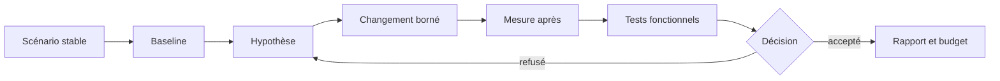

# Profilage CPU

> **Repères d’utilisation :** **[PS]** PowerShell 7, **[VSC]** Visual Studio Code, **[APP]** application graphique nommée, **[SORTIE]** résultat à lire sans le saisir, **[LECTURE]** exemple ou structure de référence. Voir la [convention complète](../Volume-0/annexes/CONVENTION-OUTILS-ET-CONTEXTES.md).

## 1. Rôle du chapitre

Le profilage CPU transforme une sensation de lenteur en comparaison mesurable. Il localise les fonctions, systèmes et phases qui consomment le temps processeur, puis vérifie qu’une modification réduit réellement ce coût sans changer le comportement attendu.

Ce chapitre applique une discipline simple : reproduire une charge, capturer une référence, formuler une hypothèse, modifier une seule cause principale, mesurer de nouveau et soumettre le résultat aux tests fonctionnels du chapitre 3.

Le chapitre 5 conserve les événements, métriques légères et traces locales. Le présent chapitre mesure le temps CPU avec une instrumentation volontairement bornée. Le chapitre 7 conservera les passes de rendu, les draw calls, l’overdraw et le coût GPU.

## 2. Résultats d’apprentissage

À la fin du chapitre, le lecteur saura :

- définir un scénario de benchmark reproductible ;
- convertir une cadence cible en budget de frame ;
- utiliser le Profiler et les Monitors de Godot ;
- distinguer temps inclusif et temps propre ;
- mesurer scripts, physique, navigation, IA et tâches parallèles ;
- identifier fréquence, durée, dispersion et pics ;
- comparer médiane, percentiles et dépassements de budget ;
- séparer un goulot CPU d’un problème GPU ou d’entrée-sortie ;
- construire un rapport avant/après ;
- protéger la fonctionnalité avec une porte de non-régression ;
- organiser le travail en modes Solo et Studio ;
- éviter l’optimisation prématurée.

## 3. Niveau de preuve et réserves

Le chapitre est accepté au niveau `static-review`. Les contrats, procédures, extraits GDScript, scripts Python et commandes PowerShell sont relus statiquement. Aucune scène de benchmark, aucune capture de profiler, aucune série de mesures et aucune amélioration runtime de `Project Asteria` ne sont revendiquées comme produites.
> **[LECTURE] État de preuve du chapitre — Ne pas saisir.**
```yaml
evidence_level:
  chapter: static_review
  benchmark_scene_materialized: false
  profiler_capture_created: false
  cpu_budget_measured: false
  before_after_campaign_executed: false
  functional_regression_suite_executed: false
  runtime_improvement_claimed: false
```
<!-- qa:code-explanation -->
**Explication structurée du bloc :**
- **Statut :** `static_review` décrit une revue documentaire, pas une mesure du projet fil rouge
- **Indépendance :** chaque livrable possède son propre indicateur de matérialisation
- **Régression :** la campagne fonctionnelle reste distincte de la campagne de performance
- **Limite :** un résultat futur devra citer matériel, build, scénario, échantillons et artefacts
## 4. Prérequis et frontières

Le lecteur doit connaître :

- les portes et risques du chapitre 2 ;
- les suites et contrats de non-régression du chapitre 3 ;
- les dossiers d’anomalie du chapitre 4 ;
- l’observabilité locale du chapitre 5 ;
- les notions de `_process()`, `_physics_process()`, navigation, IA et tâches parallèles étudiées dans les Livres précédents.

Le présent chapitre possède les scènes de benchmark CPU, les captures du Profiler, les budgets de frame, les rapports avant/après et la checklist de diagnostic.

Le chapitre 7 possède le profilage GPU. Le chapitre 8 possédera les budgets RAM, VRAM et allocations. Un symptôme CPU ne doit donc pas absorber artificiellement les responsabilités de ces chapitres.

> **Frontière essentielle :** réduire un temps mesuré ne suffit pas. La modification doit préserver le résultat fonctionnel, les déterminismes requis et les contrats de publication.

## 5. Vocabulaire opérationnel

- **Frame :** intervalle de travail nécessaire pour produire une image et faire progresser le jeu.
- **Tick physique :** mise à jour à pas fixe consacrée notamment à la physique.
- **Temps de frame :** durée totale associée à une frame observée.
- **Temps propre :** temps passé dans le corps d’une fonction, sans ses appels enfants.
- **Temps inclusif :** temps propre ajouté au temps des appels déclenchés par la fonction.
- **Goulot d’étranglement :** partie qui limite le débit ou provoque les dépassements de budget.
- **Pic :** échantillon nettement plus coûteux que le comportement central.
- **Percentile :** seuil sous lequel se trouve une proportion donnée des échantillons.
- **Warm-up :** période d’amorçage exclue de la comparaison principale.
- **Baseline :** référence mesurée avant modification.
- **Budget :** limite de temps attribuée à une phase ou à un système.
- **Régression de performance :** dégradation mesurable par rapport à une référence comparable.

## 6. Modèle de décision
> **[LECTURE] Cycle de profilage de référence — Ne pas exécuter.**

<!-- qa:code-explanation -->
**Explication structurée du bloc :**
- **Entrée :** le scénario stable précède toute mesure
- **Comparaison :** la baseline et la mesure après utilisent le même contrat
- **Sécurité :** les tests fonctionnels empêchent une optimisation qui change le produit
- **Boucle :** un résultat refusé conduit à une nouvelle hypothèse, pas à une justification rétroactive
## 7. Budget de frame

Une cadence cible fournit un plafond théorique :

`budget_frame_ms = 1 000 / cadence_cible_fps`

À 60 images par seconde, le budget théorique est d’environ `16,667 ms`. Ce nombre ne constitue pas une mesure de `Project Asteria`. Il sert seulement à répartir un plafond entre logique, physique, navigation, IA, rendu CPU, attente et marge de sécurité.
> **[LECTURE] Exemple de budget cible — Ne pas interpréter comme mesure.**
```yaml
frame_budget:
  target_fps: 60
  theoretical_frame_ms: 16.667
  allocations_ms:
    gameplay_scripts: 3.000
    physics: 3.000
    navigation: 1.500
    ai: 2.000
    render_submission_cpu: 3.000
    platform_and_io: 1.000
    safety_margin: 3.167
  measured_status: pending_measurement
```
<!-- qa:code-explanation -->
**Explication structurée du bloc :**
- **Calcul :** `theoretical_frame_ms` provient de `1000 / 60`
- **Allocation :** les sous-budgets sont des cibles de travail et non des résultats
- **Marge :** la marge absorbe variabilité et tâches non attribuées
- **Preuve :** `pending_measurement` interdit de publier ces valeurs comme observées
## 8. Mesurer plusieurs distributions, pas un seul nombre

Une moyenne peut masquer des pics visibles. Une comparaison robuste conserve au minimum :

- le nombre d’échantillons ;
- la médiane ;
- le percentile 95 ;
- le percentile 99 ;
- le maximum ;
- le nombre et le taux de dépassements du budget ;
- la durée du warm-up ;
- la durée de la fenêtre mesurée.

Le percentile n’explique pas la cause. Il indique seulement la distribution du symptôme.

## 9. Contrat de benchmark

Un benchmark utile déclare exactement ce qui doit rester stable.
> **[VSC] Visual Studio Code — Créer `config/performance/cpu_benchmark_contract.yaml`.**
```yaml
schema_version: 1
benchmark:
  id: AST-CPU-BENCH-001
  scene: res://benchmarks/cpu/benchmark_cpu_main.tscn
  build_revision: pending
  platform_profile: windows_reference
  renderer: Forward+
  target_fps: 60
  physics_ticks_per_second: 60
  warmup_seconds: 15
  measurement_seconds: 120
  repetitions: 5
  deterministic_seed: 74021
  player_input_fixture: res://benchmarks/cpu/fixtures/input_route_01.json
  acceptance:
    p95_frame_ms_max: pending_budget
    p99_frame_ms_max: pending_budget
    functional_suite: cpu_benchmark_regression
```
<!-- qa:code-explanation -->
**Explication structurée du bloc :**
- **Identité :** `id` relie toutes les captures d’une même campagne
- **Stabilité :** scène, tick physique, seed et fixture d’entrée sont déclarés
- **Fenêtres :** warm-up et mesure ne doivent pas être confondus
- **Acceptation :** les seuils restent en attente jusqu’à qualification réelle
## 10. Manifeste d’environnement

Une comparaison n’est valable que si les différences d’environnement sont visibles.
> **[VSC] Visual Studio Code — Créer `config/performance/cpu_environment_manifest.yaml`.**
```yaml
schema_version: 1
environment:
  captured_at_utc: pending
  godot_version: 4.7.1-stable
  build_revision: pending
  build_mode: debug
  operating_system: Windows
  cpu_model: pending
  logical_processors: pending
  memory_gib: pending
  power_profile: pending
  background_process_policy: documented
  display_refresh_hz: pending
  vsync_mode: documented
  profiler_enabled: true
```
<!-- qa:code-explanation -->
**Explication structurée du bloc :**
- **Comparabilité :** version, build et mode d’exécution accompagnent chaque campagne
- **Matériel :** le modèle CPU et le nombre de processeurs logiques restent à capturer
- **Contexte :** profil d’alimentation et processus concurrents peuvent modifier la distribution
- **Instrumentation :** `profiler_enabled` rend visible le coût potentiel de la capture
## 11. Matrice des scénarios

Une scène unique ne représente pas toutes les charges. La campagne sépare les familles afin d’éviter qu’un système masque les autres.
> **[LECTURE] Matrice de scénarios de référence — Ne pas saisir.**
```yaml
scenarios:
  - id: SCRIPT_DENSE
    focus: gameplay_scripts
    controlled_load: scripted_entities
  - id: PHYSICS_STACK
    focus: physics
    controlled_load: active_bodies_and_contacts
  - id: NAVIGATION_CROWD
    focus: navigation
    controlled_load: agents_and_avoidance
  - id: AI_DECISION_WAVE
    focus: ai
    controlled_load: decision_updates
  - id: THREAD_BATCH
    focus: worker_tasks
    controlled_load: independent_jobs
  - id: INTEGRATED_ROUTE
    focus: combined
    controlled_load: fixed_player_route
```
<!-- qa:code-explanation -->
**Explication structurée du bloc :**
- **Isolation :** les cinq premiers scénarios privilégient une famille de coût
- **Intégration :** `INTEGRATED_ROUTE` vérifie ensuite le comportement combiné
- **Charge :** `controlled_load` doit être matérialisée par des fixtures bornées
- **Lecture :** une campagne peut sélectionner un sous-ensemble selon le risque
## 12. Warm-up, répétitions et ordre des runs

Le warm-up absorbe le chargement initial, les caches, les compilations différées et les premières allocations. Il ne doit pas être supprimé parce qu’il rend un résultat moins favorable ; il doit être analysé séparément si le démarrage fait partie de l’expérience produit.

L’ordre des variantes peut influencer la comparaison. Alterner `A-B-A-B` ou randomiser un ordre déclaré réduit certains biais. Chaque répétition conserve son identifiant et ne remplace pas les précédentes.

## 13. Utiliser le Profiler Godot

Le Profiler se trouve dans le panneau inférieur **Debugger > Profiler**. Il doit être démarré explicitement, car la collecte elle-même a un coût. Le scénario est lancé, le warm-up est observé, la capture est vidée, puis la fenêtre de mesure commence.

Le Profiler permet d’examiner le temps de frame, les phases physiques, les temps d’inactivité et les fonctions de script. La vue inclusive montre le coût d’une fonction avec ses enfants ; la vue propre isole le corps de la fonction. Une fonction inclusive coûteuse peut donc seulement appeler une fonction enfant réellement dominante.

> **[APP] Godot — Exécuter :** ouvrir **Debugger > Profiler**, lancer le projet, démarrer la capture après le warm-up, reproduire le scénario, arrêter la capture et sélectionner les frames de pic.

## 14. Capturer une baseline
> **[VSC] Visual Studio Code — Créer `reports/performance/cpu/AST-CPU-BENCH-001/baseline_manifest.yaml`.**
```yaml
campaign:
  id: AST-CPU-BENCH-001-BASELINE
  benchmark_contract: config/performance/cpu_benchmark_contract.yaml
  environment_manifest: config/performance/cpu_environment_manifest.yaml
  revision: pending
  variant: baseline
  profiler_capture: pending
  samples_csv: pending
  functional_result: not_executed
  reviewer: pending
  decision: pending
```
<!-- qa:code-explanation -->
**Explication structurée du bloc :**
- **Traçabilité :** les deux contrats sont référencés plutôt que recopiés
- **Artefacts :** capture et échantillons possèdent des chemins distincts
- **Fonctionnel :** le résultat fonctionnel ne peut pas être déduit du profiler
- **Autorité :** la décision reste humaine et explicitement en attente
## 15. Monitors et singleton `Performance`

Le singleton `Performance` expose des moniteurs utilisés aussi par le panneau **Monitors** du Debugger. Les valeurs utiles au chapitre incluent notamment le FPS, le temps de traitement, le temps physique et le temps de navigation. Certaines valeurs ne sont disponibles qu’en mode debug ou sont actualisées moins fréquemment que la boucle de jeu ; leur cadence doit donc être respectée.
> **[VSC] Visual Studio Code — Créer `res://src/core/performance/cpu_monitor_bridge.gd`.**
```gdscript
extends Node
class_name CpuMonitorBridge

const SAMPLE_PERIOD_SEC := 1.0
var _elapsed_sec := 0.0

func _process(delta: float) -> void:
    _elapsed_sec += delta
    if _elapsed_sec < SAMPLE_PERIOD_SEC:
        return
    _elapsed_sec = 0.0

    var snapshot := {
        "fps": Performance.get_monitor(Performance.TIME_FPS),
        "process_sec": Performance.get_monitor(Performance.TIME_PROCESS),
        "physics_sec": Performance.get_monitor(Performance.TIME_PHYSICS_PROCESS),
        "navigation_sec": Performance.get_monitor(Performance.TIME_NAVIGATION_PROCESS),
    }
    cpu_snapshot_ready.emit(snapshot)

signal cpu_snapshot_ready(snapshot: Dictionary)
```
<!-- qa:code-explanation -->
**Explication structurée du bloc :**
- **Cadence :** l’échantillonnage à une seconde évite une lecture à chaque frame
- **Unités :** les temps intégrés sont conservés en secondes selon le contrat de l’API
- **Sortie :** le signal transmet un instantané sans l’écrire lui-même
- **Limite :** ce pont complète le profiler mais ne remplace pas les captures de fonctions
## 16. Moniteurs personnalisés

Un moniteur personnalisé doit retourner un nombre positif ou nul et rester peu coûteux, car son callable est invoqué lorsque la valeur est demandée. Il convient aux compteurs de charge qui expliquent un coût, pas au chronométrage détaillé de chaque entité.
> **[VSC] Visual Studio Code — Créer `res://src/core/performance/cpu_custom_monitors.gd`.**
```gdscript
extends Node
class_name CpuCustomMonitors

const ACTIVE_AI_ID := &"asteria/active_ai_agents"
var active_ai_agents: int = 0

func _ready() -> void:
    if not Performance.has_custom_monitor(ACTIVE_AI_ID):
        Performance.add_custom_monitor(ACTIVE_AI_ID, _read_active_ai_agents)

func _exit_tree() -> void:
    if Performance.has_custom_monitor(ACTIVE_AI_ID):
        Performance.remove_custom_monitor(ACTIVE_AI_ID)

func _read_active_ai_agents() -> float:
    return float(max(active_ai_agents, 0))
```
<!-- qa:code-explanation -->
**Explication structurée du bloc :**
- **Identifiant :** un seul slash place le moniteur dans la catégorie `asteria`
- **Cycle de vie :** l’ajout et le retrait évitent les doublons lors des rechargements
- **Valeur :** la fonction retourne toujours un nombre positif ou nul
- **Coût :** le callable lit un compteur déjà maintenu au lieu de parcourir la scène
## 17. Chronométrage manuel borné

Le chronométrage manuel intervient après localisation d’une zone suspecte. `Time.get_ticks_usec()` fournit une horloge monotone adaptée à une durée. Le chronomètre ne doit pas entourer tout le projet ni rester actif sans évaluation de son propre coût.
> **[VSC] Visual Studio Code — Créer `res://src/core/performance/cpu_scope_timer.gd`.**
```gdscript
extends RefCounted
class_name CpuScopeTimer

static func measure_usec(operation: Callable) -> Dictionary:
    if not operation.is_valid():
        return {"status": "blocked", "elapsed_usec": null}

    var started_usec := Time.get_ticks_usec()
    operation.call()
    var elapsed_usec := Time.get_ticks_usec() - started_usec

    return {
        "status": "measured",
        "elapsed_usec": elapsed_usec,
    }
```
<!-- qa:code-explanation -->
**Explication structurée du bloc :**
- **Précondition :** un callable invalide produit `blocked` au lieu d’une fausse durée
- **Horloge :** les ticks monotones évitent les changements de l’horloge civile
- **Unité :** `elapsed_usec` indique explicitement les microsecondes
- **Effet :** l’opération est appelée une fois ; les répétitions appartiennent au pilote
## 18. Pilote de répétitions

Un appel unique est trop sensible au bruit. Le pilote exécute warm-up et répétitions séparément, puis restitue les durées brutes afin que l’analyse reste reproductible.
> **[VSC] Visual Studio Code — Créer `res://src/core/performance/cpu_repeat_runner.gd`.**
```gdscript
extends RefCounted
class_name CpuRepeatRunner

static func run(
    operation: Callable,
    warmup_iterations: int,
    measured_iterations: int
) -> Dictionary:
    if not operation.is_valid():
        return {"status": "blocked", "samples_usec": []}
    if warmup_iterations < 0 or measured_iterations <= 0:
        return {"status": "blocked", "samples_usec": []}

    for index in range(warmup_iterations):
        operation.call()

    var samples_usec: Array[int] = []
    samples_usec.resize(measured_iterations)
    for index in range(measured_iterations):
        var started_usec := Time.get_ticks_usec()
        operation.call()
        samples_usec[index] = Time.get_ticks_usec() - started_usec

    return {
        "status": "measured",
        "samples_usec": samples_usec,
    }
```
<!-- qa:code-explanation -->
**Explication structurée du bloc :**
- **Entrées :** warm-up et répétitions mesurées sont indépendants
- **Garde :** une fenêtre vide ou négative est refusée
- **Données :** les échantillons bruts sont conservés sans moyenne prématurée
- **Limite :** le pilote convient à une opération isolée, pas à la frame intégrée
## 19. Exporter des échantillons de frame

Le fichier CSV de campagne doit contenir une ligne par frame mesurée et des colonnes stables. Les valeurs absentes restent nulles ou reçoivent un statut ; elles ne sont pas remplacées par zéro.
> **[LECTURE] Schéma CSV de référence — Ne pas saisir.**
```csv
run_id,frame_index,frame_ms,process_ms,physics_ms,navigation_ms,scenario_status
BASE-01,0,16.120,3.180,2.760,0.940,measured
BASE-01,1,18.450,4.920,2.810,1.010,measured
BASE-01,2,,,,blocked
```
<!-- qa:code-explanation -->
**Explication structurée du bloc :**
- **Identité :** `run_id` sépare les répétitions
- **Index :** `frame_index` conserve l’ordre temporel
- **Nullabilité :** une frame bloquée ne reçoit pas de valeurs inventées
- **Statut :** `scenario_status` permet d’exclure explicitement les données non mesurées
## 20. Analyser les distributions

Le script suivant lit uniquement les lignes `measured`, vérifie les durées et calcule des statistiques sans supprimer les pics.
> **[VSC] Visual Studio Code — Créer `tools/performance/analyze_cpu_samples.py`.**
```python
from __future__ import annotations

import argparse
import csv
import json
import math
from pathlib import Path


def percentile(sorted_values: list[float], ratio: float) -> float:
    if not sorted_values:
        raise ValueError("aucun échantillon")
    position = (len(sorted_values) - 1) * ratio
    lower = math.floor(position)
    upper = math.ceil(position)
    if lower == upper:
        return sorted_values[lower]
    weight = position - lower
    return (
        sorted_values[lower] * (1.0 - weight)
        + sorted_values[upper] * weight
    )


def load_frame_ms(path: Path) -> list[float]:
    values: list[float] = []
    with path.open("r", encoding="utf-8", newline="") as handle:
        for row in csv.DictReader(handle):
            if row["scenario_status"] != "measured":
                continue
            value = float(row["frame_ms"])
            if not math.isfinite(value) or value < 0.0:
                raise ValueError(f"durée invalide: {value}")
            values.append(value)
    if not values:
        raise ValueError("aucune frame mesurée")
    return sorted(values)


def summarize(values: list[float], budget_ms: float) -> dict[str, float | int]:
    over_budget = sum(value > budget_ms for value in values)
    return {
        "count": len(values),
        "median_ms": percentile(values, 0.50),
        "p95_ms": percentile(values, 0.95),
        "p99_ms": percentile(values, 0.99),
        "max_ms": values[-1],
        "over_budget_count": over_budget,
        "over_budget_ratio": over_budget / len(values),
    }


def main() -> int:
    parser = argparse.ArgumentParser()
    parser.add_argument("samples", type=Path)
    parser.add_argument("--budget-ms", type=float, required=True)
    parser.add_argument("--output", type=Path, required=True)
    args = parser.parse_args()

    if not math.isfinite(args.budget_ms) or args.budget_ms <= 0.0:
        raise ValueError("budget invalide")

    report = summarize(load_frame_ms(args.samples), args.budget_ms)
    args.output.parent.mkdir(parents=True, exist_ok=True)
    args.output.write_text(
        json.dumps(report, indent=2, sort_keys=True) + "\n",
        encoding="utf-8",
    )
    return 0


if __name__ == "__main__":
    raise SystemExit(main())
```
<!-- qa:code-explanation -->
**Explication structurée du bloc :**
- **Validation :** les statuts, nombres finis et durées positives sont contrôlés
- **Percentiles :** l’interpolation conserve une définition explicite et déterministe
- **Dépassements :** le compteur et le ratio gardent numérateur et dénominateur
- **Sortie :** le rapport JSON est trié et réutilisable par une comparaison
## 21. Exécuter l’analyse
> **[PS] PowerShell 7 — Exécuter depuis la racine du projet.**
```powershell
python tools/performance/analyze_cpu_samples.py `
  reports/performance/cpu/AST-CPU-BENCH-001/baseline_samples.csv `
  --budget-ms 16.667 `
  --output reports/performance/cpu/AST-CPU-BENCH-001/baseline_summary.json
```
<!-- qa:code-explanation -->
**Explication structurée du bloc :**
- **Entrée :** le CSV appartient à la baseline qualifiée
- **Budget :** `16.667` reste un exemple de plafond à 60 images par seconde
- **Sortie :** le résumé est écrit à côté des artefacts de campagne
- **Refus :** le script s’arrête si le budget ou les échantillons sont invalides
## 22. Outils système comme contexte

Le profiler Godot localise les phases et fonctions du projet. Un compteur système complète cette vue avec la charge globale de la machine. Il ne doit pas être utilisé pour attribuer seul une cause à une fonction.
> **[PS] PowerShell 7 — Capturer un contexte processeur hôte borné.**
```powershell
New-Item -ItemType Directory `
  -Force reports/performance/cpu/AST-CPU-BENCH-001/system | Out-Null

Get-Counter '\Processor(_Total)\% Processor Time' `
  -SampleInterval 1 `
  -MaxSamples 120 |
  Export-Counter `
    -Path reports/performance/cpu/AST-CPU-BENCH-001/system/host_cpu.blg `
    -Force
```
<!-- qa:code-explanation -->
**Explication structurée du bloc :**
- **Portée :** le compteur mesure l’ensemble de l’hôte et non une fonction Godot
- **Fenêtre :** `MaxSamples` borne la durée et le volume
- **Artefact :** le fichier binaire conserve la série pour inspection
- **Interprétation :** une charge hôte élevée signale un confondant possible, pas une cause prouvée
## 23. Diagnostiquer les scripts

Pour une fonction de script coûteuse, examiner successivement :

1. son nombre d’appels ;
2. son temps inclusif ;
3. son temps propre ;
4. les fonctions enfants ;
5. la répartition entre frames ;
6. la relation entre charge contrôlée et coût.

Une fonction appelée très souvent peut coûter peu par appel mais dominer le total. Une fonction rarement appelée peut provoquer un pic visible. Les deux nécessitent des réponses différentes.

## 24. Réduire la fréquence avant de réécrire l’algorithme

Les mises à jour de perception, sélection de cible, score tactique ou maintenance d’interface n’ont pas toutes besoin de s’exécuter à chaque frame. La cadence doit toutefois respecter le comportement attendu.
> **[VSC] Visual Studio Code — Créer `res://src/features/ai/staggered_ai_scheduler.gd`.**
```gdscript
extends Node
class_name StaggeredAiScheduler

@export_range(1, 60, 1) var updates_per_second := 10
var _accumulator_sec := 0.0

func _process(delta: float) -> void:
    _accumulator_sec += delta
    var period_sec := 1.0 / float(updates_per_second)
    if _accumulator_sec < period_sec:
        return

    _accumulator_sec = fmod(_accumulator_sec, period_sec)
    ai_update_requested.emit()

signal ai_update_requested
```
<!-- qa:code-explanation -->
**Explication structurée du bloc :**
- **Paramètre :** `updates_per_second` borne la cadence entre 1 et 60
- **Accumulation :** le reliquat est conservé avec `fmod` au lieu d’être perdu
- **Sortie :** le signal sépare l’ordonnancement du calcul IA
- **Régression :** la cadence choisie doit être validée sur réactivité et comportement
## 25. Diagnostiquer la physique

Le temps physique doit être rapproché de la charge contrôlée :

- nombre de corps actifs ;
- nombre de paires de collision ;
- complexité des formes ;
- fréquence des requêtes ;
- création et destruction de corps ;
- cadence physique configurée.

Modifier la cadence physique uniquement pour gagner du temps peut augmenter la latence d’entrée ou produire du jitter. Cette modification est donc fonctionnelle et exige des tests dédiés.
> **[LECTURE] Contrat de charge physique — Ne pas saisir.**
```yaml
physics_load:
  scenario: PHYSICS_STACK
  active_bodies: controlled
  collision_pairs: captured
  shape_complexity_profile: simple_convex
  physics_ticks_per_second: 60
  interpolation_policy: documented
  gameplay_equivalence_required: true
```
<!-- qa:code-explanation -->
**Explication structurée du bloc :**
- **Charge :** les corps actifs et paires de collision accompagnent le temps physique
- **Formes :** le profil de complexité évite de comparer des géométries différentes
- **Cadence :** le tick reste déclaré dans chaque campagne
- **Équivalence :** la performance ne peut pas annuler les exigences de gameplay
## 26. Diagnostiquer la navigation

Le temps de navigation peut inclure mises à jour de carte et évitement des agents. La campagne sépare :

- construction ou modification de la carte ;
- requêtes de chemin ;
- cadence de recalcul ;
- nombre d’agents ;
- évitement ;
- invalidation due aux obstacles dynamiques.

Un compteur d’agents n’explique pas tout. Il doit être relié à une scène, une densité, une cadence et un profil d’obstacles.
> **[LECTURE] Contrat de charge navigation — Ne pas saisir.**
```yaml
navigation_load:
  scenario: NAVIGATION_CROWD
  map_revision: pending
  agents_active: controlled
  path_requests_per_second: controlled
  avoidance_enabled: true
  dynamic_obstacles: controlled
  map_updates_during_measurement: forbidden_unless_scenario_requires
```
<!-- qa:code-explanation -->
**Explication structurée du bloc :**
- **Carte :** `map_revision` rend les changements de navigation visibles
- **Débit :** les requêtes par seconde accompagnent le nombre d’agents
- **Évitement :** son activation est déclarée plutôt que supposée
- **Invariants :** les mises à jour de carte sont interdites sauf scénario explicite
## 27. Diagnostiquer l’IA

Une IA coûteuse combine souvent plusieurs fréquences :

- perception ;
- sélection de cible ;
- planification ;
- navigation ;
- animation décisionnelle ;
- communication entre agents.

Le profiler doit distinguer la fréquence d’appel du coût unitaire. Une réduction de cadence est acceptable seulement si les tests de comportement restent verts.
> **[LECTURE] Décomposition IA de référence — Ne pas saisir.**
```yaml
ai_budget:
  perception:
    cadence_hz: pending_measurement
    budget_ms: pending_budget
  target_selection:
    cadence_hz: pending_measurement
    budget_ms: pending_budget
  planning:
    cadence_hz: pending_measurement
    budget_ms: pending_budget
  group_coordination:
    cadence_hz: pending_measurement
    budget_ms: pending_budget
```
<!-- qa:code-explanation -->
**Explication structurée du bloc :**
- **Décomposition :** chaque sous-système possède cadence et budget séparés
- **Qualification :** aucune valeur n’est inventée avant campagne
- **Décision :** un budget doit répondre à une expérience produit
- **Frontière :** la navigation reste mesurée comme système distinct même si l’IA la déclenche
## 28. Diagnostiquer les tâches parallèles

Les threads ne rendent pas automatiquement un calcul plus rapide. Il faut mesurer :

- temps de préparation ;
- temps de travail ;
- attente de synchronisation ;
- contention ;
- taille des lots ;
- nombre de tâches ;
- coût de fusion ;
- utilisation effective des cœurs.

Une tâche trop petite peut coûter davantage en orchestration qu’elle ne gagne en parallélisme.
> **[LECTURE] Contrat de lot parallèle — Ne pas saisir.**
```yaml
parallel_batch:
  scenario: THREAD_BATCH
  job_count: controlled
  items_per_job: controlled
  setup_usec: measured
  work_usec: measured
  wait_usec: measured
  merge_usec: measured
  correctness_hash: required
  timeout_sec: bounded
```
<!-- qa:code-explanation -->
**Explication structurée du bloc :**
- **Phases :** préparation, travail, attente et fusion sont séparés
- **Taille :** le nombre de tâches et d’éléments par tâche sont contrôlés
- **Correction :** une empreinte fonctionnelle protège contre les résultats incomplets
- **Temps :** un timeout borne les attentes et évite un run suspendu
## 29. Distinguer CPU, GPU et attente

Un temps de frame élevé n’implique pas nécessairement que les scripts dominent. Une frame peut attendre :

- le rendu ;
- la synchronisation verticale ;
- une entrée-sortie ;
- une ressource ;
- un verrou ;
- une tâche externe.

Le Visual Profiler couvre le coût CPU et GPU des tâches de rendu ; il ne remplace pas le Profiler standard pour scripts et physique. Lorsque les indices pointent vers le rendu, le dossier passe au chapitre 7 au lieu d’optimiser arbitrairement le gameplay.

## 30. Hypothèse d’optimisation

Une hypothèse relie un signal, une cause candidate, une modification bornée et un résultat attendu.
> **[VSC] Visual Studio Code — Créer `reports/performance/cpu/AST-CPU-BENCH-001/hypothesis.yaml`.**
```yaml
hypothesis:
  id: AST-CPU-HYP-001
  observed_signal: pending_baseline
  suspected_scope: ai.target_selection
  evidence:
    profiler_frames: pending
    inclusive_time: pending
    self_time: pending
    call_count: pending
  proposed_change: stagger_updates_without_changing_selection_rules
  changed_variables:
    - target_selection_cadence
  expected_effect:
    p95_frame_ms: decrease
    functional_output: equivalent
  rollback: revert_single_change
```
<!-- qa:code-explanation -->
**Explication structurée du bloc :**
- **Signal :** l’hypothèse dépend de la baseline et de frames identifiées
- **Portée :** le sous-système suspect est précis
- **Variable :** une variable principale rend la comparaison interprétable
- **Retour arrière :** le changement peut être annulé sans migration
## 31. Rapport avant/après

Le rapport juxtapose les mêmes statistiques et conserve les échantillons. Il ne supprime pas les runs défavorables.
> **[VSC] Visual Studio Code — Créer `reports/performance/cpu/AST-CPU-BENCH-001/comparison.yaml`.**
```yaml
comparison:
  benchmark_id: AST-CPU-BENCH-001
  baseline_revision: pending
  candidate_revision: pending
  environment_match: pending
  sample_contract_match: pending
  baseline:
    median_ms: pending
    p95_ms: pending
    p99_ms: pending
    over_budget_count: pending
    sample_count: pending
  candidate:
    median_ms: pending
    p95_ms: pending
    p99_ms: pending
    over_budget_count: pending
    sample_count: pending
  functional_suite:
    id: cpu_benchmark_regression
    result: not_executed
  decision: pending
```
<!-- qa:code-explanation -->
**Explication structurée du bloc :**
- **Symétrie :** baseline et candidate utilisent les mêmes champs
- **Comparabilité :** environnement et contrat d’échantillons possèdent leur propre statut
- **Fonctionnel :** la suite de régression est une condition séparée
- **Décision :** aucune amélioration n’est déclarée avant remplissage et revue
## 32. Calculer les deltas
> **[VSC] Visual Studio Code — Créer `tools/performance/compare_cpu_summaries.py`.**
```python
from __future__ import annotations

import argparse
import json
import math
from pathlib import Path


FIELDS = ("median_ms", "p95_ms", "p99_ms", "max_ms", "over_budget_ratio")


def read_summary(path: Path) -> dict[str, float]:
    raw = json.loads(path.read_text(encoding="utf-8"))
    result: dict[str, float] = {}
    for field in FIELDS:
        value = float(raw[field])
        if not math.isfinite(value) or value < 0.0:
            raise ValueError(f"{path}: {field} invalide")
        result[field] = value
    return result


def compare(baseline: dict[str, float], candidate: dict[str, float]) -> dict:
    deltas = {}
    for field in FIELDS:
        before = baseline[field]
        after = candidate[field]
        deltas[field] = {
            "before": before,
            "after": after,
            "absolute": after - before,
            "relative": None if before == 0.0 else (after - before) / before,
        }
    return {"metrics": deltas}


def main() -> int:
    parser = argparse.ArgumentParser()
    parser.add_argument("baseline", type=Path)
    parser.add_argument("candidate", type=Path)
    parser.add_argument("--output", type=Path, required=True)
    args = parser.parse_args()

    report = compare(read_summary(args.baseline), read_summary(args.candidate))
    args.output.parent.mkdir(parents=True, exist_ok=True)
    args.output.write_text(
        json.dumps(report, indent=2, sort_keys=True) + "\n",
        encoding="utf-8",
    )
    return 0


if __name__ == "__main__":
    raise SystemExit(main())
```
<!-- qa:code-explanation -->
**Explication structurée du bloc :**
- **Champs :** les mêmes mesures sont exigées des deux résumés
- **Validation :** les nombres non finis et négatifs sont refusés
- **Delta :** valeurs absolue et relative sont conservées
- **Zéro :** un dénominateur nul produit `null` au lieu d’une division artificielle
## 33. Porte d’acceptation

Une candidate est acceptable seulement si :

- les contrats d’environnement et d’échantillonnage correspondent ;
- le changement principal est identifié ;
- les statistiques choisies s’améliorent ou respectent le budget ;
- aucun autre percentile critique ne se dégrade au-delà de la tolérance ;
- les dépassements de budget ne s’aggravent pas ;
- les tests fonctionnels requis réussissent ;
- aucune nouvelle anomalie critique n’est ouverte ;
- le coût d’instrumentation est compris ;
- le rapport et les artefacts sont conservés.
> **[LECTURE] Porte de décision de référence — Ne pas saisir.**
```yaml
cpu_gate:
  comparable_environment: required
  comparable_samples: required
  p95_within_budget: required
  p99_regression_tolerance: pending_policy
  over_budget_ratio_not_worse: required
  functional_suite_passed: required
  critical_defect_count: 0
  profiler_artifacts_present: required
  human_approval: required
```
<!-- qa:code-explanation -->
**Explication structurée du bloc :**
- **Comparabilité :** les deux premières gardes précèdent les statistiques
- **Distribution :** p95, p99 et dépassements sont contrôlés séparément
- **Produit :** la suite fonctionnelle et les défauts bloquent la promotion
- **Autorité :** l’approbation humaine reste obligatoire
## 34. Checklist de diagnostic par système

### 34.1 Scripts

- appel par frame réellement nécessaire ;
- boucle et taille des collections ;
- allocation temporaire ;
- recherche répétée de nœuds ;
- signaux excessifs ;
- conversion ou formatage ;
- récursion et appels enfants.

### 34.2 Physique

- corps actifs ;
- paires de collision ;
- formes ;
- requêtes ;
- cadence ;
- activation hors zone utile.

### 34.3 Navigation

- changements de carte ;
- agents et évitement ;
- débit des chemins ;
- obstacles dynamiques ;
- cadence de recalcul.

### 34.4 IA

- perception ;
- sélection ;
- planification ;
- fréquence ;
- partage des résultats invariants ;
- échelonnement des mises à jour.

### 34.5 Threads

- taille des lots ;
- attente ;
- contention ;
- fusion ;
- déterminisme ;
- timeout ;
- bénéfice net après orchestration.

## 35. Coût de l’instrumentation

Le profiler, les chronomètres et les moniteurs ajoutent du travail. Une campagne sérieuse conserve :

1. une capture détaillée pour localiser ;
2. une mesure légère pour confirmer ;
3. une exécution fonctionnelle sans instrumentation intrusive ;
4. la différence entre ces modes.

Le coût n’est pas soustrait arbitrairement. Il est mesuré dans un run séparé lorsque cela devient nécessaire.

## 36. Scènes de benchmark

Une scène de benchmark n’est pas une scène spectacle. Elle doit :

- démarrer dans un état connu ;
- charger les mêmes ressources ;
- produire une charge contrôlée ;
- éviter les entrées humaines non enregistrées ;
- fournir une fin bornée ;
- écrire un manifeste ;
- signaler les statuts `measured`, `blocked` ou `invalid`;
- rester indépendante du tableau de bord.
> **[LECTURE] Arborescence de benchmark — Ne pas créer sans plan d’intégration.**
```text
res://benchmarks/cpu/
├── benchmark_cpu_main.tscn
├── benchmark_cpu_main.gd
├── fixtures/
│   ├── input_route_01.json
│   └── cpu_load_profile_01.yaml
└── scenarios/
    ├── script_dense.tscn
    ├── physics_stack.tscn
    ├── navigation_crowd.tscn
    ├── ai_decision_wave.tscn
    └── thread_batch.tscn
```
<!-- qa:code-explanation -->
**Explication structurée du bloc :**
- **Racine :** le benchmark est séparé des scènes produit
- **Fixtures :** entrée et charge possèdent des fichiers versionnés
- **Scénarios :** chaque famille CPU conserve une scène identifiable
- **Intégration :** l’arborescence reste une cible documentaire tant qu’elle n’est pas matérialisée
## 37. Statuts de campagne
> **[LECTURE] Statuts de campagne — Ne pas saisir.**
```yaml
campaign_statuses:
  measured:
    meaning: samples_complete_and_contract_respected
  blocked:
    meaning: required_precondition_missing
  invalid:
    meaning: contract_broken_after_start
  inconclusive:
    meaning: samples_valid_but_decision_not_supported
  accepted:
    meaning: performance_and_functional_gates_passed
  rejected:
    meaning: at_least_one_gate_failed
```
<!-- qa:code-explanation -->
**Explication structurée du bloc :**
- **Mesure :** `measured` qualifie les données mais pas la décision
- **Blocage :** `blocked` ne devient pas une mauvaise performance
- **Incertitude :** `inconclusive` conserve une campagne valide mais insuffisante
- **Décision :** `accepted` exige à la fois performance et fonctionnalité
## 38. Prioriser les changements

Une optimisation est priorisée selon :

- sévérité du symptôme ;
- fréquence ;
- part du budget ;
- confiance dans l’hypothèse ;
- coût du changement ;
- risque fonctionnel ;
- facilité de retour arrière ;
- couverture de test.

Une fonction facile à modifier n’est pas forcément le bon goulot. À l’inverse, un goulot réel peut rester volontairement inchangé si son risque de régression dépasse le bénéfice.

## 39. Diagnostics et corrections

<!-- qa:error-correction-section -->
### 39.1 Optimiser sans baseline
**Symptôme ou risque :** Les changements s’accumulent sans preuve de gain ni point de retour.
**Exemple fautif :**
> **[LECTURE] Exemple fautif — Ne pas appliquer.**
```yaml
optimization:
  baseline: absent
  changes:
    - rewrite_ai
    - lower_physics_tick
    - cache_everything
  decision: faster_by_feeling
```
<!-- qa:code-explanation -->
**Pourquoi cet exemple est fautif :** Plusieurs variables changent avant toute mesure ; le ressenti ne permet ni attribution ni retour fiable.
**Exemple corrigé :**
> **[LECTURE] Exemple corrigé — Adapter au contrat du projet.**
```yaml
optimization:
  baseline: AST-CPU-BENCH-001-BASELINE
  hypothesis: AST-CPU-HYP-001
  changed_variables:
    - target_selection_cadence
  decision: pending_measurement
```
<!-- qa:code-explanation -->
**Pourquoi la correction fonctionne :** La baseline, l’hypothèse et la variable principale rendent le résultat attribuable.
### 39.2 Publier une moyenne seule
**Symptôme ou risque :** Les pics visibles disparaissent derrière une valeur centrale favorable.
**Exemple fautif :**
> **[LECTURE] Exemple fautif — Ne pas appliquer.**
```yaml
summary:
  average_frame_ms: 12.4
  decision: accepted
```
<!-- qa:code-explanation -->
**Pourquoi cet exemple est fautif :** La moyenne ne décrit ni les queues de distribution ni les dépassements du budget.
**Exemple corrigé :**
> **[LECTURE] Exemple corrigé — Adapter au contrat du projet.**
```yaml
summary:
  sample_count: 7200
  median_ms: 11.8
  p95_ms: 15.9
  p99_ms: 24.7
  over_budget_count: 93
  decision: pending_gate
```
<!-- qa:code-explanation -->
**Pourquoi la correction fonctionne :** Les percentiles, le maximum implicite du rapport complet et les dépassements conservent le risque de pic.
### 39.3 Modifier plusieurs variables
**Symptôme ou risque :** Une amélioration existe, mais personne ne sait quel changement l’a produite.
**Exemple fautif :**
> **[LECTURE] Exemple fautif — Ne pas appliquer.**
```yaml
candidate:
  changes:
    - ai_cadence
    - collision_shapes
    - navigation_map
    - thread_count
```
<!-- qa:code-explanation -->
**Pourquoi cet exemple est fautif :** Quatre causes potentielles empêchent d’attribuer le delta.
**Exemple corrigé :**
> **[LECTURE] Exemple corrigé — Adapter au contrat du projet.**
```yaml
candidate:
  changes:
    - ai_cadence
  follow_up_candidates:
    - collision_shapes
    - navigation_map
    - thread_count
```
<!-- qa:code-explanation -->
**Pourquoi la correction fonctionne :** Une variable principale est mesurée ; les autres deviennent des campagnes séparées.
### 39.4 Confondre temps inclusif et temps propre
**Symptôme ou risque :** Une fonction coordinatrice est réécrite alors que son enfant concentre le coût.
**Exemple fautif :**
> **[LECTURE] Exemple fautif — Ne pas appliquer.**
```yaml
profiler_reading:
  function: update_agents
  inclusive_ms: 5.8
  conclusion: update_agents_body_is_slow
```
<!-- qa:code-explanation -->
**Pourquoi cet exemple est fautif :** Le temps inclusif contient les appels enfants et ne prouve pas que le corps est dominant.
**Exemple corrigé :**
> **[LECTURE] Exemple corrigé — Adapter au contrat du projet.**
```yaml
profiler_reading:
  function: update_agents
  inclusive_ms: 5.8
  self_ms: 0.3
  dominant_child: find_target
  conclusion: inspect_child_first
```
<!-- qa:code-explanation -->
**Pourquoi la correction fonctionne :** La vue propre et l’enfant dominant orientent l’enquête vers la vraie zone coûteuse.
### 39.5 Chronométrer un seul appel
**Symptôme ou risque :** Le résultat change fortement d’un run à l’autre.
**Exemple fautif :**
> **[LECTURE] Exemple fautif — Ne pas appliquer.**
```yaml
timing:
  warmup_iterations: 0
  measured_iterations: 1
  elapsed_usec: 142
  decision: accepted
```
<!-- qa:code-explanation -->
**Pourquoi cet exemple est fautif :** Un appel unique est sensible au scheduling, aux caches et aux interruptions.
**Exemple corrigé :**
> **[LECTURE] Exemple corrigé — Adapter au contrat du projet.**
```yaml
timing:
  warmup_iterations: 100
  measured_iterations: 5000
  samples_preserved: true
  decision: pending_distribution_analysis
```
<!-- qa:code-explanation -->
**Pourquoi la correction fonctionne :** Warm-up, répétitions et conservation des échantillons permettent une distribution.
### 39.6 Réduire le tick physique sans test
**Symptôme ou risque :** Le budget s’améliore mais les entrées et mouvements changent.
**Exemple fautif :**
> **[LECTURE] Exemple fautif — Ne pas appliquer.**
```yaml
physics:
  ticks_per_second:
    before: 60
    after: 20
  functional_suite: not_executed
  decision: accepted
```
<!-- qa:code-explanation -->
**Pourquoi cet exemple est fautif :** La cadence physique est une variable fonctionnelle ; son coût ne suffit pas à autoriser le changement.
**Exemple corrigé :**
> **[LECTURE] Exemple corrigé — Adapter au contrat du projet.**
```yaml
physics:
  ticks_per_second:
    before: 60
    after: 30
  interpolation_policy: tested
  latency_suite: passed
  movement_regression_suite: passed
  decision: pending_performance_gate
```
<!-- qa:code-explanation -->
**Pourquoi la correction fonctionne :** Les effets produit sont testés avant la décision de performance.
### 39.7 Ajouter des threads sans mesurer l’attente
**Symptôme ou risque :** Le nombre de tâches augmente mais le temps de frame se dégrade.
**Exemple fautif :**
> **[LECTURE] Exemple fautif — Ne pas appliquer.**
```yaml
parallel:
  jobs: 256
  work_usec: measured
  wait_usec: ignored
  merge_usec: ignored
  conclusion: more_threads_is_faster
```
<!-- qa:code-explanation -->
**Pourquoi cet exemple est fautif :** L’orchestration, l’attente et la fusion peuvent dominer le travail utile.
**Exemple corrigé :**
> **[LECTURE] Exemple corrigé — Adapter au contrat du projet.**
```yaml
parallel:
  jobs: 16
  setup_usec: measured
  work_usec: measured
  wait_usec: measured
  merge_usec: measured
  correctness_hash: matched
```
<!-- qa:code-explanation -->
**Pourquoi la correction fonctionne :** Le coût total et l’équivalence fonctionnelle déterminent le bénéfice net.
### 39.8 Attribuer au CPU un goulot GPU
**Symptôme ou risque :** Les scripts sont réécrits sans réduire les frames lentes.
**Exemple fautif :**
> **[LECTURE] Exemple fautif — Ne pas appliquer.**
```yaml
diagnosis:
  frame_ms: high
  cpu_script_self_ms: low
  visual_profiler: not_checked
  conclusion: rewrite_gameplay_scripts
```
<!-- qa:code-explanation -->
**Pourquoi cet exemple est fautif :** Un temps de frame élevé peut venir du rendu ou d’une attente ; les scripts ne sont pas prouvés responsables.
**Exemple corrigé :**
> **[LECTURE] Exemple corrigé — Adapter au contrat du projet.**
```yaml
diagnosis:
  frame_ms: high
  cpu_script_self_ms: low
  render_signal: suspected
  handoff: chapter_07_gpu_profiling
  conclusion: no_cpu_change_yet
```
<!-- qa:code-explanation -->
**Pourquoi la correction fonctionne :** Le dossier passe au profilage GPU avant toute modification CPU injustifiée.
### 39.9 Supprimer les runs défavorables
**Symptôme ou risque :** Le rapport paraît stable alors que certaines répétitions dépassent le budget.
**Exemple fautif :**
> **[LECTURE] Exemple fautif — Ne pas appliquer.**
```yaml
campaign:
  repetitions: 5
  retained_runs:
    - run_02
    - run_04
  discarded_reason: slower_than_expected
```
<!-- qa:code-explanation -->
**Pourquoi cet exemple est fautif :** Le résultat attendu est utilisé comme filtre, ce qui biaise la campagne.
**Exemple corrigé :**
> **[LECTURE] Exemple corrigé — Adapter au contrat du projet.**
```yaml
campaign:
  repetitions: 5
  retained_runs:
    - run_01
    - run_02
    - run_03
    - run_04
    - run_05
  invalid_runs: []
  exclusion_policy: defined_before_measurement
```
<!-- qa:code-explanation -->
**Pourquoi la correction fonctionne :** Tous les runs valides sont conservés et les exclusions reposent sur une règle antérieure.
### 39.10 Déclarer le succès avec les FPS
**Symptôme ou risque :** Le compteur indique 60 FPS alors que des pics restent perceptibles.
**Exemple fautif :**
> **[LECTURE] Exemple fautif — Ne pas appliquer.**
```yaml
result:
  fps: 60
  p95_frame_ms: absent
  p99_frame_ms: absent
  over_budget_count: absent
  functional_suite: absent
  decision: accepted
```
<!-- qa:code-explanation -->
**Pourquoi cet exemple est fautif :** Le FPS actualisé périodiquement ne décrit ni chaque frame ni la fonctionnalité.
**Exemple corrigé :**
> **[LECTURE] Exemple corrigé — Adapter au contrat du projet.**
```yaml
result:
  target_fps: 60
  p95_frame_ms: measured
  p99_frame_ms: measured
  over_budget_count: measured
  functional_suite: passed
  decision: pending_human_approval
```
<!-- qa:code-explanation -->
**Pourquoi la correction fonctionne :** La distribution, les dépassements, la régression fonctionnelle et l’approbation soutiennent la décision.
## 40. Modes Solo et Studio

### Mode Solo

La même personne peut concevoir le scénario, profiler et modifier le code, mais elle sépare explicitement les rôles dans le temps :

- figer le contrat avant mesure ;
- conserver la baseline ;
- écrire l’hypothèse avant modification ;
- limiter le changement ;
- exécuter les tests fonctionnels ;
- relire le rapport après une pause ou avec une checklist ;
- conserver un retour arrière simple.

### Mode Studio

Les responsabilités recommandées sont :

- **QA performance :** possède les contrats, campagnes et artefacts ;
- **programmeur système :** formule et implémente l’hypothèse ;
- **QA fonctionnelle :** vérifie l’équivalence du produit ;
- **référent plateforme :** qualifie matériel, alimentation et processus concurrents ;
- **tech lead :** arbitre risque, budget et dette ;
- **release owner :** conserve l’autorité de promotion.

La personne qui implémente peut analyser les données, mais une amélioration critique gagne à recevoir une reproduction indépendante et une revue de la campagne.

## 41. Checklist d’acceptation

### Contrat

- [ ] scène, build, plateforme et mode déclarés ;
- [ ] cadence cible et budget théorique documentés ;
- [ ] warm-up, fenêtre, répétitions et ordre déclarés ;
- [ ] seed et entrées contrôlées ;
- [ ] critères d’exclusion définis avant mesure.

### Mesure

- [ ] capture du Profiler conservée ;
- [ ] temps propre et inclusif distingués ;
- [ ] échantillons bruts conservés ;
- [ ] médiane, p95, p99, maximum et dépassements calculés ;
- [ ] charge système associée au scénario ;
- [ ] coût d’instrumentation déclaré.

### Changement

- [ ] hypothèse écrite ;
- [ ] variable principale identifiée ;
- [ ] retour arrière défini ;
- [ ] comparaison sur environnement compatible ;
- [ ] runs défavorables valides conservés.

### Produit

- [ ] tests fonctionnels exécutés ;
- [ ] latence, déterminisme et comportement vérifiés lorsque pertinents ;
- [ ] aucune anomalie critique ouverte ;
- [ ] décision humaine enregistrée ;
- [ ] aucune valeur runtime inventée.

## 42. Critère d’acceptation du pilote

Le chapitre sera validé au niveau runtime lorsque `Project Asteria` disposera d’au moins une campagne CPU matérialisée répondant simultanément aux conditions suivantes :

1. scène et fixture de benchmark versionnées ;
2. manifeste d’environnement complet ;
3. baseline répétée avec échantillons conservés ;
4. goulot localisé par une capture consultable ;
5. hypothèse écrite avant modification ;
6. candidate mesurée avec le même contrat ;
7. amélioration soutenue par les statistiques choisies ;
8. tests fonctionnels réussis ;
9. rapport avant/après et retour arrière conservés ;
10. approbation humaine enregistrée.

## 43. Synthèse opérationnelle pour Project Asteria

Le lot documentaire prépare :

- `res://benchmarks/cpu/` pour les scènes de charge ;
- `config/performance/cpu_benchmark_contract.yaml` pour le protocole ;
- `config/performance/cpu_environment_manifest.yaml` pour l’environnement ;
- `res://src/core/performance/` pour les moniteurs et chronomètres bornés ;
- `tools/performance/` pour les analyses reproductibles ;
- `reports/performance/cpu/` pour les captures et comparaisons ;
- la suite `cpu_benchmark_regression` comme garde fonctionnelle ;
- une porte humaine liant performance, qualité et risque.

Aucun de ces artefacts n’est présenté comme matérialisé. Le chapitre fournit des contrats prêts à être intégrés et audités.

## 44. Références techniques

- [Godot 4.7 — Debug tools](https://docs.godotengine.org/en/4.7/tutorials/scripting/debug/index.html)
- [Godot — The Profiler](https://docs.godotengine.org/en/stable/tutorials/scripting/debug/the_profiler.html)
- [Godot — Debugger panel](https://docs.godotengine.org/en/stable/tutorials/scripting/debug/debugger_panel.html)
- [Godot — CPU optimization](https://docs.godotengine.org/en/stable/tutorials/performance/cpu_optimization.html)
- [Godot — Performance singleton](https://docs.godotengine.org/en/stable/classes/class_performance.html)
- [Godot — Custom performance monitors](https://docs.godotengine.org/en/stable/tutorials/scripting/debug/custom_performance_monitors.html)
- [Godot 4.7 — ObjectDB profiler](https://docs.godotengine.org/en/4.7/tutorials/scripting/debug/objectdb_profiler.html)

## 45. Conclusion

Le profilage CPU est une discipline de preuve : scénario stable, baseline, hypothèse bornée, mesure après et validation fonctionnelle. Les budgets guident l’enquête, mais les données et la décision humaine déterminent si une optimisation est réelle, sûre et maintenable.
