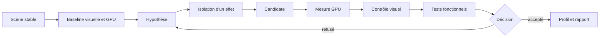

# Profilage GPU et optimisation du rendu

> **Repères d’utilisation :** **[PS]** PowerShell 7, **[VSC]** Visual Studio Code, **[WEB]** navigateur internet, **[APP]** application graphique nommée, **[SORTIE]** résultat à lire sans le saisir, **[LECTURE]** exemple ou structure de référence. Voir la [convention complète](../Volume-0/annexes/CONVENTION-OUTILS-ET-CONTEXTES.md).
## 1. Rôle du chapitre
Le profilage GPU transforme une baisse de fluidité ou un coût visuel supposé en comparaison mesurable. Il relie une frame lente à des passes, des draw calls, des zones d’overdraw, des shaders, des lumières, des ombres, des effets ou des transferts mémoire avant de proposer un changement.

Le chapitre 6 conserve les campagnes CPU, les budgets de logique et l’analyse des scripts. Le présent chapitre possède le temps GPU, les captures de frame, les profils graphiques et le rapport de coût par effet. Le chapitre 8 conservera les budgets mémoire, les allocations et les tests de longue durée.

La règle centrale est la suivante : une optimisation visuelle n’est acceptée que si la comparaison est compatible, la qualité est documentée et les tests fonctionnels restent satisfaits.
## 2. Résultats d’apprentissage
À la fin du chapitre, le lecteur saura :

- distinguer temps CPU de soumission, temps GPU et attente de synchronisation ;
- préparer une scène de stress reproductible ;
- utiliser le Visual Profiler de Godot et les moniteurs de rendu ;
- mesurer draw calls, primitives, temps GPU et indicateurs de mémoire vidéo ;
- identifier un goulot de fill rate, d’overdraw, de géométrie ou de shader ;
- isoler le coût des lumières, ombres, transparences et effets ;
- construire des profils graphiques versionnés ;
- comparer une baseline et une candidate à qualité contrôlée ;
- adapter la campagne à la Radeon RX 6750 XT de référence ;
- recourir à une capture externe sans confondre replay et mesure native ;
- organiser le travail en modes Solo et Studio ;
- refuser les optimisations sans preuve.
## 3. Niveau de preuve et réserves
Le chapitre est accepté au niveau `static-review`. Les contrats, procédures, extraits GDScript, scripts Python et commandes sont relus statiquement. Aucune scène de stress, capture de frame, série de temps GPU ou amélioration visuelle de `Project Asteria` n’est revendiquée comme produite.
> **[LECTURE] État de preuve du chapitre — Ne pas saisir.**
```yaml
evidence_level:
  chapter: static_review
  stress_scene_materialized: false
  visual_profiler_capture_created: false
  external_gpu_capture_created: false
  gpu_budget_qualified: false
  quality_profile_validated: false
  before_after_campaign_executed: false
  runtime_improvement_claimed: false
```
<!-- qa:code-explanation -->
**Explication structurée du bloc :**
- **Statut :** `static_review` décrit une revue documentaire et non une campagne GPU.
- **Indépendance :** chaque livrable possède son propre indicateur de matérialisation.
- **Qualité :** un profil graphique n’est pas déclaré validé sans comparaison visuelle.
- **Limite :** une future validation exigera captures, mesures, environnement et décision conservés.
## 4. Prérequis et frontières
Le lecteur doit connaître les portes qualité du chapitre 2, les tests fonctionnels du chapitre 3, la collecte locale du chapitre 5 et la discipline de benchmark du chapitre 6.

Le chapitre 7 possède :

- le budget GPU par frame ;
- les captures du Visual Profiler et les captures externes ;
- les profils graphiques ;
- le rapport de coût par effet ;
- la scène de stress ;
- la décision qualité/performance.

Le Livre III conserve la création des assets et leurs variantes optimisées. Le chapitre 8 possédera les budgets RAM, VRAM et allocations. Une métrique de mémoire vidéo peut orienter l’enquête ici, mais son diagnostic de long terme appartient au chapitre 8.

> **Frontière essentielle :** réduire le nombre de draw calls, la résolution ou un effet ne prouve pas à lui seul une amélioration GPU acceptable. Il faut mesurer le temps GPU, contrôler l’image et préserver les contrats produit.
## 5. Vocabulaire opérationnel
- **Passe de rendu :** étape qui lit et écrit des ressources pour produire une partie de l’image.
- **Draw call :** commande de rendu soumise pour dessiner un lot de primitives.
- **Changement d’état :** modification de pipeline, matériau, texture ou configuration entre commandes.
- **Overdraw :** écriture répétée de plusieurs fragments sur les mêmes pixels.
- **Fill rate :** capacité à traiter et écrire des fragments sur la surface de l’image.
- **Shader de vertex :** programme exécuté pour les sommets.
- **Shader de fragment :** programme exécuté pour les fragments susceptibles de produire des pixels.
- **Bande passante :** débit de lecture et d’écriture entre unités de calcul et mémoire.
- **VRAM :** mémoire vidéo utilisée par textures, buffers et ressources du pilote.
- **Pipeline graphique :** configuration des étapes, états et shaders utilisés par un rendu.
- **Compilation de pipeline :** création d’une variante exécutable par le pilote.
- **Profil graphique :** ensemble versionné de réglages visuels destiné à une classe de matériel.
- **Capture de frame :** artefact permettant d’inspecter les événements et ressources d’une image.
- **Temps GPU :** durée mesurée sur le GPU pour exécuter le rendu d’une frame ou d’un viewport.
## 6. Modèle de décision
> **[LECTURE] Cycle de profilage GPU — Ne pas exécuter.**

<!-- qa:code-explanation -->
**Explication structurée du bloc :**
- **Entrée :** la scène stable précède toute mesure ou capture.
- **Isolation :** un effet principal est modifié à la fois.
- **Double porte :** temps GPU et qualité visuelle sont contrôlés séparément.
- **Décision :** une candidate refusée conduit à une nouvelle hypothèse.
## 7. Distinguer CPU de rendu, GPU et attente
Le rendu peut ralentir à plusieurs endroits :

- préparation et soumission côté CPU ;
- compilation ou activité du pilote ;
- exécution des passes sur le GPU ;
- transfert ou lecture de ressources ;
- synchronisation entre CPU et GPU ;
- limitation volontaire par V-Sync ou cadence maximale.

Le Visual Profiler expose des catégories CPU et GPU liées au rendu. Il ne remplace pas le Profiler standard pour les scripts et la physique. Une comparaison doit donc conserver les deux dimensions lorsqu’un symptôme traverse la frontière.
> **[LECTURE] Matrice d’attribution initiale — Ne pas interpréter comme résultat.**
```yaml
render_diagnosis:
  frame_time_ms: measured
  render_cpu_ms: measured
  gpu_ms: measured
  vsync_state: recorded
  max_fps: recorded
  conclusion:
    cpu_submission_bound: pending_analysis
    gpu_bound: pending_analysis
    synchronization_bound: pending_analysis
```
<!-- qa:code-explanation -->
**Explication structurée du bloc :**
- **Mesures :** les trois durées sont conservées séparément.
- **Cadence :** V-Sync et `max_fps` empêchent une lecture naïve du compteur FPS.
- **Attribution :** aucune cause n’est fixée avant comparaison des signaux.
- **Sortie :** la conclusion reste en attente d’analyse.
## 8. Budget GPU par frame
À 60 images par seconde, le budget théorique complet est d’environ `16,667 ms`. Le GPU ne reçoit pas automatiquement tout ce plafond : la frame contient aussi le travail CPU, les attentes et une marge.

Un budget GPU est une cible. Il ne devient qualifié qu’après mesure sur la plateforme retenue.
> **[LECTURE] Exemple de cible GPU — Ne pas présenter comme mesure.**
```yaml
gpu_frame_budget:
  target_fps: 60
  theoretical_frame_ms: 16.667
  target_gpu_ms: 11.000
  reserve_for_cpu_and_sync_ms: 5.667
  quality_profile: high_reference
  platform: windows_rx_6750_xt
  measured_status: pending_measurement
```
<!-- qa:code-explanation -->
**Explication structurée du bloc :**
- **Calcul :** le plafond complet provient de `1000 / 60`.
- **Répartition :** `target_gpu_ms` réserve du temps aux autres phases de la frame.
- **Contexte :** la cible appartient à un profil et une plateforme nommés.
- **Preuve :** `pending_measurement` interdit toute revendication runtime.
## 9. Contrat de benchmark GPU
> **[VSC] Visual Studio Code — Créer `config/performance/gpu_benchmark_contract.yaml`.**
```yaml
schema_version: 1
benchmark:
  id: AST-GPU-BENCH-001
  scene: res://benchmarks/gpu/gpu_stress_main.tscn
  build: pending
  rendering_method: forward_plus
  rendering_driver: pending
  resolution:
    width: 2560
    height: 1440
    scale: 1.0
  display:
    mode: exclusive_fullscreen
    refresh_hz: pending
    vsync: disabled_for_uncapped_probe
  camera_path: camera_path_city_night_v1
  warmup_seconds: 30
  measurement_seconds: 120
  repetitions: 5
  random_seed: 74007
  quality_profile: high_reference
  capture_points:
    - dense_lights
    - transparent_market
    - post_process_plaza
```
<!-- qa:code-explanation -->
**Explication structurée du bloc :**
- **Scène :** la scène et le trajet caméra figent la charge visible.
- **Affichage :** résolution, mode, fréquence et V-Sync appartiennent au contrat.
- **Échantillonnage :** warm-up, fenêtre et répétitions sont déclarés avant mesure.
- **Captures :** les points nommés rendent les artefacts comparables.
## 10. Manifeste d’environnement AMD
> **[VSC] Visual Studio Code — Créer `config/performance/gpu_environment_manifest.yaml`.**
```yaml
schema_version: 1
environment:
  capture_id: pending
  timestamp_utc: pending
  os: Windows 11 64 bits
  engine: Godot 4.7.1-stable
  build_hash: pending
  renderer: Forward+
  rendering_driver: pending
  api_version: pending
  gpu:
    name: AMD Radeon RX 6750 XT
    architecture: RDNA 2
    vram_gib: 12
    driver_version: pending
    power_profile: pending
  cpu: AMD Ryzen 7 2700
  ram_gib: 32
  display:
    resolution: 2560x1440
    refresh_hz: pending
    hdr: pending
  background_process_policy: controlled
```
<!-- qa:code-explanation -->
**Explication structurée du bloc :**
- **Identité :** le build, le pilote et l’API doivent être enregistrés.
- **Matériel :** la RX 6750 XT constitue la plateforme de référence du guide.
- **Affichage :** résolution, fréquence et HDR modifient le coût de rendu.
- **Inconnues :** les valeurs `pending` doivent être remplies par la campagne réelle.
## 11. Scène de stress
La scène de stress doit concentrer plusieurs coûts sans devenir un mélange impossible à interpréter. Elle comprend des sous-zones activables séparément :

- densité géométrique et LOD ;
- lumières locales et ombres ;
- surfaces transparentes superposées ;
- particules et effets de fragments ;
- réflexion et effets écran ;
- matériaux et variantes de shader ;
- résolution et mise à l’échelle.

Chaque sous-zone possède un état de référence et un état isolé.
> **[LECTURE] Structure de la scène de stress — Ne pas saisir telle quelle.**
```yaml
stress_scene:
  root: res://benchmarks/gpu/gpu_stress_main.tscn
  zones:
    geometry:
      toggle: stress_geometry
      primary_signal: primitives_in_frame
    lights:
      toggle: stress_lights
      primary_signal: gpu_ms
    transparency:
      toggle: stress_transparency
      primary_signal: resolution_sensitivity
    shaders:
      toggle: stress_shaders
      primary_signal: visual_profiler_pass
    post_process:
      toggle: stress_post
      primary_signal: gpu_ms
  combined_mode:
    enabled_only_after_isolated_runs: true
```
<!-- qa:code-explanation -->
**Explication structurée du bloc :**
- **Isolation :** chaque zone peut être activée indépendamment.
- **Signal :** un indicateur principal oriente l’analyse sans suffire à conclure.
- **Combinaison :** le mode complet vient après les campagnes isolées.
- **Usage :** la structure évite de modifier plusieurs causes invisibles.
## 12. Visual Profiler de Godot
Le Visual Profiler se trouve dans le panneau Debugger. Il affiche les catégories de rendu côté CPU et GPU. La capture doit couvrir le point de charge nommé, puis être arrêtée et enregistrée selon la procédure du projet.

L’analyse conserve :

- le numéro ou la fenêtre de frames ;
- les catégories dominantes ;
- la durée CPU de rendu ;
- la durée GPU ;
- les pics ;
- le contexte caméra et profil graphique ;
- une capture d’écran ou un export disponible ;
- les limites de l’outil.
> **[LECTURE] Contrat de capture Visual Profiler — Ne pas saisir sans campagne.**
```yaml
visual_profiler_capture:
  id: pending
  benchmark_id: AST-GPU-BENCH-001
  capture_point: dense_lights
  start_condition: camera_marker_reached
  duration_frames: 600
  cpu_render_categories: pending
  gpu_categories: pending
  peak_frame: pending
  artifact_path: reports/performance/gpu/captures/pending
  interpretation: pending_review
```
<!-- qa:code-explanation -->
**Explication structurée du bloc :**
- **Corrélation :** la capture référence le benchmark et le point caméra.
- **Fenêtre :** la durée est bornée en frames.
- **Séparation :** catégories CPU de rendu et GPU restent distinctes.
- **Artefact :** l’interprétation cite un chemin consultable.
## 13. Moniteurs de rendu
Le panneau Monitors et le singleton `Performance` fournissent des indicateurs légers. Les valeurs utiles incluent notamment objets, primitives, draw calls et mémoire vidéo. Elles servent à décrire la charge, pas à attribuer à elles seules le temps GPU.
> **[VSC] Visual Studio Code — Créer `res://src/core/performance/gpu_render_monitors.gd`.**
```gdscript
extends Node

func capture_render_monitors() -> Dictionary:
    return {
        "objects": Performance.get_monitor(
            Performance.RENDER_TOTAL_OBJECTS_IN_FRAME
        ),
        "primitives": Performance.get_monitor(
            Performance.RENDER_TOTAL_PRIMITIVES_IN_FRAME
        ),
        "draw_calls": Performance.get_monitor(
            Performance.RENDER_TOTAL_DRAW_CALLS_IN_FRAME
        ),
        "video_mem_bytes": Performance.get_monitor(
            Performance.RENDER_VIDEO_MEM_USED
        ),
        "texture_mem_bytes": Performance.get_monitor(
            Performance.RENDER_TEXTURE_MEM_USED
        ),
        "buffer_mem_bytes": Performance.get_monitor(
            Performance.RENDER_BUFFER_MEM_USED
        ),
    }
```
<!-- qa:code-explanation -->
**Explication structurée du bloc :**
- **Sortie :** la fonction renvoie un dictionnaire d’indicateurs de la dernière frame.
- **Unités :** les champs mémoire sont exprimés en octets.
- **Attribution :** draw calls et primitives décrivent la charge sans mesurer le coût d’un shader.
- **Limite :** certaines valeurs peuvent dépendre du mode debug et du renderer.
## 14. Informations globales et par viewport
`RenderingServer.get_rendering_info()` décrit des informations globales. `viewport_get_render_info()` permet de cibler un viewport et un type de passe. Les valeurs ne sont disponibles qu’après le démarrage effectif du rendu ; un échantillonneur doit donc attendre plusieurs frames.
> **[VSC] Visual Studio Code — Ajouter `capture_after_render_start()` au collecteur GPU.**
```gdscript
extends Node

func capture_after_render_start() -> Dictionary:
    for _i in 2:
        await get_tree().process_frame

    var viewport_rid := get_viewport().get_viewport_rid()
    return {
        "global_draw_calls": RenderingServer.get_rendering_info(
            RenderingServer.RENDERING_INFO_TOTAL_DRAW_CALLS_IN_FRAME
        ),
        "visible_draw_calls": RenderingServer.viewport_get_render_info(
            viewport_rid,
            RenderingServer.VIEWPORT_RENDER_INFO_TYPE_VISIBLE,
            RenderingServer.VIEWPORT_RENDER_INFO_DRAW_CALLS_IN_FRAME
        ),
        "shadow_draw_calls": RenderingServer.viewport_get_render_info(
            viewport_rid,
            RenderingServer.VIEWPORT_RENDER_INFO_TYPE_SHADOW,
            RenderingServer.VIEWPORT_RENDER_INFO_DRAW_CALLS_IN_FRAME
        ),
    }
```
<!-- qa:code-explanation -->
**Explication structurée du bloc :**
- **Précondition :** deux frames sont attendues avant la première lecture.
- **Portée :** le global et le viewport ne décrivent pas exactement le même périmètre.
- **Passes :** visible et ombres sont conservés séparément.
- **Asynchronisme :** la fonction doit être appelée avec `await`.
## 15. Mesurer le temps GPU du viewport
Godot peut mesurer le temps de rendu CPU et GPU d’un viewport lorsque la mesure est explicitement activée. Le temps GPU reste une observation de la frame précédente et doit être collecté sur une série, pas lu une seule fois.
> **[VSC] Visual Studio Code — Créer `res://src/core/performance/gpu_time_sampler.gd`.**
```gdscript
extends Node

var _viewport_rid: RID

func _ready() -> void:
    _viewport_rid = get_viewport().get_viewport_rid()
    RenderingServer.viewport_set_measure_render_time(_viewport_rid, true)

func read_render_times_ms() -> Dictionary:
    return {
        "render_cpu_ms": RenderingServer.viewport_get_measured_render_time_cpu(
            _viewport_rid
        ),
        "gpu_ms": RenderingServer.viewport_get_measured_render_time_gpu(
            _viewport_rid
        ),
        "frame_setup_cpu_ms": RenderingServer.get_frame_setup_time_cpu(),
    }
```
<!-- qa:code-explanation -->
**Explication structurée du bloc :**
- **Activation :** la mesure doit être activée pour le viewport.
- **Sortie :** les durées sont exprimées en millisecondes.
- **Séparation :** setup CPU, rendu CPU et GPU sont conservés distinctement.
- **Échantillonnage :** la fonction doit alimenter une série bornée.
## 16. Collecte CSV bornée
> **[VSC] Visual Studio Code — Créer `res://src/core/performance/gpu_csv_sampler.gd`.**
```gdscript
extends Node

@export var output_path := "user://gpu_samples.csv"
@export_range(1, 36000, 1) var max_samples := 7200

var _samples_written := 0
var _file: FileAccess
var _viewport_rid: RID

func _ready() -> void:
    _viewport_rid = get_viewport().get_viewport_rid()
    RenderingServer.viewport_set_measure_render_time(_viewport_rid, true)
    _file = FileAccess.open(output_path, FileAccess.WRITE)
    if _file == null:
        push_error("Impossible d'ouvrir le fichier GPU.")
        set_process(false)
        return
    _file.store_line("frame,gpu_ms,render_cpu_ms,draw_calls,primitives")

func _process(_delta: float) -> void:
    if _file == null or _samples_written >= max_samples:
        set_process(false)
        return

    var frame := Engine.get_process_frames()
    var gpu_ms := RenderingServer.viewport_get_measured_render_time_gpu(
        _viewport_rid
    )
    var render_cpu_ms := RenderingServer.viewport_get_measured_render_time_cpu(
        _viewport_rid
    )
    var draws := Performance.get_monitor(
        Performance.RENDER_TOTAL_DRAW_CALLS_IN_FRAME
    )
    var primitives := Performance.get_monitor(
        Performance.RENDER_TOTAL_PRIMITIVES_IN_FRAME
    )
    _file.store_csv_line(PackedStringArray([
        str(frame),
        str(gpu_ms),
        str(render_cpu_ms),
        str(draws),
        str(primitives),
    ]))
    _samples_written += 1
```
<!-- qa:code-explanation -->
**Explication structurée du bloc :**
- **Borne :** `max_samples` arrête la collecte.
- **Colonnes :** temps GPU, temps CPU de rendu et charge géométrique sont alignés par frame.
- **Refus contrôlé :** l’échec d’ouverture désactive la collecte sans bloquer le jeu.
- **Effet de bord :** l’écriture peut ajouter un coût qui doit être mesuré séparément.
## 17. Analyser une distribution GPU
> **[VSC] Visual Studio Code — Créer `tools/performance/summarize_gpu.py`.**
```python
from __future__ import annotations

import csv
import math
import statistics
from pathlib import Path

def percentile_nearest_rank(values: list[float], percentile: float) -> float:
    if not values:
        raise ValueError("La série GPU est vide.")
    ordered = sorted(values)
    rank = max(1, math.ceil((percentile / 100.0) * len(ordered)))
    return ordered[rank - 1]

def summarize_gpu(path: Path, budget_ms: float) -> dict[str, float | int]:
    samples: list[float] = []
    with path.open("r", encoding="utf-8", newline="") as stream:
        for row in csv.DictReader(stream):
            value = float(row["gpu_ms"])
            if not math.isfinite(value) or value < 0.0:
                raise ValueError(f"Échantillon GPU invalide : {value!r}")
            samples.append(value)

    if not samples:
        raise ValueError("Aucun échantillon GPU exploitable.")

    over = sum(value > budget_ms for value in samples)
    return {
        "count": len(samples),
        "median_ms": statistics.median(samples),
        "p95_ms": percentile_nearest_rank(samples, 95.0),
        "p99_ms": percentile_nearest_rank(samples, 99.0),
        "max_ms": max(samples),
        "over_budget_count": over,
        "over_budget_ratio": over / len(samples),
    }
```
<!-- qa:code-explanation -->
**Explication structurée du bloc :**
- **Entrées :** le script reçoit un CSV et un budget en millisecondes.
- **Validation :** les valeurs négatives, infinies ou non numériques sont refusées.
- **Sorties :** médiane, p95, p99, maximum et dépassements sont conservés.
- **Limite :** le résumé n’identifie pas la passe responsable.
## 18. Savoir si le projet est limité par le fill rate
Une sonde utile compare plusieurs résolutions avec la même scène, le même trajet et les mêmes réglages hors résolution. Une forte baisse du temps GPU lorsque la surface diminue indique une sensibilité au travail par pixel. Elle ne prouve pas à elle seule quel effet ou shader domine.
> **[LECTURE] Plan de sonde de résolution — Ne pas interpréter comme mesure.**
```yaml
resolution_probe:
  constant:
    scene: gpu_stress_main
    camera_path: camera_path_city_night_v1
    quality_profile: high_reference
    vsync: disabled
  variants:
    - resolution: 2560x1440
      gpu_ms: pending
    - resolution: 1920x1080
      gpu_ms: pending
    - resolution: 1280x720
      gpu_ms: pending
  interpretation:
    fill_rate_sensitive: pending_analysis
    next_isolation: transparency_or_post_process
```
<!-- qa:code-explanation -->
**Explication structurée du bloc :**
- **Constantes :** la scène, la caméra et le profil restent identiques.
- **Variable :** seule la résolution principale change.
- **Signal :** la variation du temps GPU révèle une sensibilité aux pixels.
- **Suite :** transparence et post-traitement sont isolés ensuite.
## 19. Draw calls et changements d’état
Un nombre élevé de draw calls peut coûter du temps CPU de rendu et du temps pilote. La réduction pertinente vise les lots compatibles, la réutilisation des matériaux et shaders, et l’instanciation lorsque la scène le permet.

Fusionner toute une zone en un seul mesh peut réduire les draw calls mais dégrader le culling. Le rapport doit donc comparer draw calls, primitives visibles, temps CPU de rendu et temps GPU.
> **[LECTURE] Hypothèse de regroupement — Ne pas appliquer sans mesure.**
```yaml
draw_call_hypothesis:
  observation:
    render_cpu_ms: high
    draw_calls: high
    gpu_ms: moderate
  candidate:
    reuse_materials: true
    reuse_shaders: true
    multimesh_for_repeated_props: evaluated
    static_merge_scope: block_level_only
  guards:
    frustum_culling: preserved
    occlusion_culling: reviewed
    visual_equivalence: required
```
<!-- qa:code-explanation -->
**Explication structurée du bloc :**
- **Observation :** la soumission CPU et les draw calls motivent l’enquête.
- **Candidate :** les réutilisations sont préférées à une fusion globale.
- **Culling :** la granularité spatiale reste contrôlée.
- **Porte :** l’équivalence visuelle demeure obligatoire.
## 20. Géométrie, LOD et taille à l’écran
Le nombre de triangles n’est pas un indicateur universel. Le coût dépend du matériel, de la taille à l’écran, du nombre de passes, du skinning, des ombres et du nombre de fragments produits.

Les LOD réduisent le travail lorsque la contribution visuelle diminue. La campagne doit vérifier les transitions, les silhouettes et les ombres, pas seulement le compteur de primitives.
> **[LECTURE] Contrat de campagne LOD — Ne pas présenter comme réglage validé.**
```yaml
lod_campaign:
  asset_family: city_props_v3
  distances_m:
    lod0_to_lod1: 18
    lod1_to_lod2: 42
    lod2_to_impostor: 95
  measures:
    visible_primitives: pending
    shadow_primitives: pending
    gpu_ms: pending
  quality_checks:
    silhouette_pop: required
    shadow_pop: required
    animation_compatibility: required
```
<!-- qa:code-explanation -->
**Explication structurée du bloc :**
- **Portée :** une famille d’assets est testée ensemble.
- **Mesures :** passes visibles et ombres sont distinguées.
- **Qualité :** les transitions et silhouettes sont vérifiées.
- **Statut :** les distances restent des hypothèses tant que la campagne n’est pas exécutée.
## 21. Culling et occlusion
Le frustum culling évite les objets hors champ. L’occlusion culling peut éviter certains objets masqués et réduire overdraw ou travail de vertex, mais ses occluders et sa préparation ont un coût CPU.

Une campagne d’occlusion conserve donc :

- draw calls visibles et ombres ;
- primitives ;
- temps CPU de setup ;
- temps GPU ;
- erreurs visuelles ;
- coût des occluders.
> **[LECTURE] Comparaison d’occlusion — Ne pas saisir comme résultat.**
```yaml
occlusion_comparison:
  baseline:
    occlusion_enabled: false
  candidate:
    occlusion_enabled: true
    occluder_set: city_center_v2
  compare:
    frame_setup_cpu_ms: required
    visible_draw_calls: required
    visible_primitives: required
    gpu_ms: required
    false_occlusion_events: required
  decision: pending
```
<!-- qa:code-explanation -->
**Explication structurée du bloc :**
- **Symétrie :** baseline et candidate partagent le même scénario.
- **Coût CPU :** le setup est conservé avec les gains GPU.
- **Défauts :** les occultations erronées sont des régressions.
- **Décision :** aucun gain n’est présumé.
## 22. Overdraw et transparence
Les surfaces transparentes sont souvent rendues de l’arrière vers l’avant et ne bénéficient pas des mêmes économies de profondeur que les surfaces opaques. Les couches superposées, grandes particules et interfaces translucides peuvent donc multiplier le travail par pixel.

Le test doit isoler la surface couverte, le nombre de couches et le shader.
> **[LECTURE] Sonde de transparence — Ne pas interpréter comme verdict.**
```yaml
transparency_probe:
  scene: transparent_market
  variants:
    - id: opaque_reference
      blend_layers: 0
    - id: alpha_tested
      blend_layers: 0
      alpha_scissor: enabled
    - id: blended_two_layers
      blend_layers: 2
    - id: blended_six_layers
      blend_layers: 6
  constant:
    camera: fixed
    resolution: 2560x1440
    shader_family: market_fabric_v2
  metrics:
    gpu_ms: pending
    visual_acceptance: pending
```
<!-- qa:code-explanation -->
**Explication structurée du bloc :**
- **Variable :** le nombre et le mode de couches changent explicitement.
- **Constantes :** caméra, résolution et famille de shader restent stables.
- **Mesure :** le temps GPU accompagne le contrôle visuel.
- **Usage :** la sonde distingue transparence et géométrie opaque.
## 23. Shaders et coût par fragment
Un shader de fragment coûte d’autant plus qu’il couvre de pixels, exécute d’opérations, lit de textures ou s’applique dans plusieurs passes. Les branches, variantes et lectures doivent être mesurées sur le matériel cible.

Une simplification ne doit pas devenir une réécriture opaque. Le rapport conserve le shader source, la variante, le nombre de lectures attendu, la surface couverte et l’image de référence.
> **[LECTURE] Rapport de variante shader — Ne pas présenter comme gain.**
```yaml
shader_variant_report:
  shader: res://shaders/wet_stone.gdshader
  baseline_variant: wet_stone_full
  candidate_variant: wet_stone_reduced_reads
  declared_change:
    texture_reads_removed: 2
    branch_removed: 1
  constant:
    geometry: plaza_ground_v4
    camera: fixed
    resolution: 2560x1440
  outputs:
    gpu_ms: pending
    reference_image: pending
    difference_image: pending
    human_review: pending
```
<!-- qa:code-explanation -->
**Explication structurée du bloc :**
- **Changement :** les lectures et branches retirées sont déclarées.
- **Constantes :** géométrie, caméra et résolution restent identiques.
- **Preuves :** temps GPU et images sont conservés ensemble.
- **Autorité :** la revue humaine clôt la comparaison visuelle.
## 24. Variantes et compilations de pipeline
Multiplier les options conditionnelles peut multiplier les variantes à compiler. Les compilations tardives peuvent produire des à-coups qui ne ressemblent pas à un coût GPU continu.

Godot expose des compteurs de compilation de pipeline dans les informations de rendu. Le chapitre conserve ces compteurs autour des transitions critiques, sans assimiler tout pic à une compilation.
> **[VSC] Visual Studio Code — Ajouter `capture_pipeline_compilations()` au collecteur.**
```gdscript
extends Node

func capture_pipeline_compilations() -> Dictionary:
    return {
        "canvas": RenderingServer.get_rendering_info(
            RenderingServer.RENDERING_INFO_PIPELINE_COMPILATIONS_CANVAS
        ),
        "mesh": RenderingServer.get_rendering_info(
            RenderingServer.RENDERING_INFO_PIPELINE_COMPILATIONS_MESH
        ),
        "surface": RenderingServer.get_rendering_info(
            RenderingServer.RENDERING_INFO_PIPELINE_COMPILATIONS_SURFACE
        ),
        "draw": RenderingServer.get_rendering_info(
            RenderingServer.RENDERING_INFO_PIPELINE_COMPILATIONS_DRAW
        ),
        "specialization": RenderingServer.get_rendering_info(
            RenderingServer.RENDERING_INFO_PIPELINE_COMPILATIONS_SPECIALIZATION
        ),
    }
```
<!-- qa:code-explanation -->
**Explication structurée du bloc :**
- **Sortie :** la fonction sépare plusieurs familles de compilation.
- **Nature :** les valeurs sont des compteurs, pas des durées.
- **Corrélation :** les variations doivent être alignées avec les transitions observées.
- **Limite :** un compteur accru n’identifie pas automatiquement la cause du pic.
## 25. Lumières et couverture écran
Dans Forward+, les lumières sont regroupées spatialement. Le coût dépend notamment de leur couverture écran, de leur type, des objets affectés et des ombres.

Le test de densité ne change pas à la fois le nombre de lumières, leur rayon, leurs ombres et la résolution. Chaque dimension reçoit une campagne distincte.
> **[LECTURE] Campagne de densité lumineuse — Ne pas saisir comme limite validée.**
```yaml
light_density_campaign:
  scene: city_night_lights
  constant:
    resolution: 2560x1440
    shadows: disabled
    light_radius_m: 8
    camera_path: camera_path_city_night_v1
  variants:
    - active_local_lights: 16
    - active_local_lights: 32
    - active_local_lights: 64
    - active_local_lights: 128
  measures:
    gpu_ms: pending
    render_cpu_ms: pending
    visual_coverage: recorded
```
<!-- qa:code-explanation -->
**Explication structurée du bloc :**
- **Variable :** seul le nombre de lumières actives change.
- **Ombres :** elles sont désactivées pour isoler l’éclairage.
- **Mesures :** CPU de rendu et GPU sont conservés.
- **Couverture :** le cadrage visuel accompagne les nombres.
## 26. Ombres
Les ombres ajoutent des passes, des lectures et des écritures de shadow maps. Leur coût dépend du nombre de lumières concernées, de la résolution des cartes, du mode de filtrage, de la géométrie et de la fréquence de mise à jour.

Le meilleur profil n’est pas nécessairement celui qui baisse uniformément toutes les ombres. Il classe les lumières selon leur contribution visuelle.
> **[LECTURE] Matrice de contribution des ombres — Ne pas interpréter comme profil final.**
```yaml
shadow_cost_matrix:
  light_groups:
    hero_key:
      shadows: required
      quality: high
    street_primary:
      shadows: selective
      quality: medium
    street_secondary:
      shadows: disabled
      quality: none
    distant_decorative:
      shadows: disabled
      quality: none
  compare:
    shadow_draw_calls: pending
    shadow_primitives: pending
    gpu_ms: pending
    visual_review: pending
```
<!-- qa:code-explanation -->
**Explication structurée du bloc :**
- **Hiérarchie :** les lumières sont classées par importance visuelle.
- **Charge :** draw calls et primitives des ombres sont suivis.
- **Mesure :** le temps GPU reste la métrique de coût principale.
- **Qualité :** la revue visuelle empêche une désactivation aveugle.
## 27. Post-traitement et effets écran
Les effets écran lisent souvent des buffers à grande échelle. Leur coût varie avec la résolution, la qualité, le nombre de passes et le renderer.

Une campagne par effet compare un profil sans effet, un niveau de référence et une candidate. Les effets combinés sont mesurés seulement après les coûts isolés.
> **[LECTURE] Matrice de post-traitement — Adapter aux options réellement disponibles.**
```yaml
post_process_campaign:
  scene: post_process_plaza
  effects:
    ssao:
      baseline: disabled
      reference: medium
      candidate: low
    ssil:
      baseline: disabled
      reference: enabled
      candidate: disabled
    ssr:
      baseline: disabled
      reference: enabled
      candidate: half_resolution
    glow:
      baseline: disabled
      reference: high
      candidate: medium
  metrics:
    isolated_gpu_ms: pending
    combined_gpu_ms: pending
    visual_review: pending
```
<!-- qa:code-explanation -->
**Explication structurée du bloc :**
- **Isolation :** chaque effet possède une référence sans effet.
- **Profils :** référence et candidate sont nommées.
- **Combinaison :** le coût agrégé est mesuré après les tests isolés.
- **Disponibilité :** les options dépendent du renderer et doivent être vérifiées.
## 28. Résolution dynamique et mise à l’échelle
La réduction de résolution interne peut diminuer le travail par pixel. Elle modifie toutefois la netteté, les effets écran, l’interface et parfois la stabilité temporelle.

Le profil doit définir une plage, une cible et une politique de retour. Une échelle dynamique ne doit pas osciller rapidement.
> **[LECTURE] Contrat de mise à l’échelle — Ne pas activer sans validation.**
```yaml
resolution_scaling_profile:
  id: high_dynamic_v1
  target_gpu_ms: 11.0
  scale:
    minimum: 0.75
    maximum: 1.00
    step: 0.05
  controller:
    sample_window_frames: 120
    decrease_after_over_budget_windows: 3
    increase_after_under_budget_windows: 8
    cooldown_windows: 4
  quality_checks:
    ui_resolution_independent: required
    temporal_stability: required
    capture_comparison: required
```
<!-- qa:code-explanation -->
**Explication structurée du bloc :**
- **Plage :** l’échelle reste bornée.
- **Hystérésis :** les seuils de montée et descente diffèrent.
- **Stabilité :** une fenêtre et un cooldown réduisent les oscillations.
- **Qualité :** interface et stabilité temporelle sont contrôlées.
## 29. Textures et bande passante
La compression VRAM réduit la bande passante et le stockage en mémoire vidéo au prix d’artefacts possibles. Les textures 2D, transparentes ou de pixel art peuvent exiger une politique différente.

Le chapitre ne remplace pas la production PBR du Livre III. Il mesure l’impact de variantes importées et transmet les besoins d’asset au pipeline artistique.
> **[LECTURE] Campagne de variantes de texture — Ne pas présenter comme import validé.**
```yaml
texture_variant_campaign:
  asset: plaza_marble_set
  variants:
    - id: reference_4k_vram
      max_size: 4096
      compression: vram
    - id: candidate_2k_vram
      max_size: 2048
      compression: vram
    - id: diagnostic_uncompressed
      max_size: 4096
      compression: lossless
  measures:
    texture_mem_bytes: pending
    gpu_ms: pending
    load_time_ms: handoff_chapter_09
    visual_difference: pending
```
<!-- qa:code-explanation -->
**Explication structurée du bloc :**
- **Variantes :** résolution et compression sont nommées.
- **Mémoire :** l’indicateur texture accompagne le temps GPU.
- **Frontière :** le temps de chargement est transmis au chapitre 9.
- **Qualité :** les artefacts sont contrôlés visuellement.
## 30. VRAM : signal local et frontière mémoire
Les moniteurs vidéo, texture et buffer donnent un signal local. Ils ne constituent pas un inventaire exhaustif de toutes les allocations du pilote et ne remplacent pas une analyse de résidence ou de fuite.

Le chapitre 7 utilise la VRAM pour corréler une scène ou un effet. Le chapitre 8 possède :

- les budgets mémoire par plateforme ;
- les pics et longues durées ;
- les allocations, libérations et caches ;
- les outils spécialisés de mémoire ;
- les procédures de fuite.
> **[LECTURE] Frontière VRAM — Ne pas saisir comme rapport.**
```yaml
vram_handoff:
  chapter_07:
    purpose: correlate_render_variant
    fields:
      - video_mem_bytes
      - texture_mem_bytes
      - buffer_mem_bytes
    window: bounded_benchmark
  chapter_08:
    purpose: qualify_memory_budget_and_lifetime
    required:
      - long_duration_test
      - allocation_report
      - cache_policy
      - leak_diagnosis
```
<!-- qa:code-explanation -->
**Explication structurée du bloc :**
- **Portée locale :** le chapitre 7 corrèle une variante de rendu.
- **Durée :** la fenêtre reste celle du benchmark.
- **Transmission :** les budgets et durées longues appartiennent au chapitre 8.
- **Prudence :** les moniteurs intégrés ne décrivent pas toute la mémoire du pilote.
## 31. Captures externes sur AMD
Sur la RX 6750 XT de référence, les outils AMD peuvent approfondir une enquête Vulkan ou DirectX 12. Radeon GPU Profiler analyse notamment la chronologie GPU, les événements, les barrières, les pipelines et les stalls. Radeon Developer Panel réalise la capture selon les pilotes et modes pris en charge.

Ces outils sont optionnels. Une capture externe n’est pas une condition pour utiliser le chapitre, et sa compatibilité doit être qualifiée pour le driver Godot réellement sélectionné.
> **[LECTURE] Contrat de capture AMD — Ne pas présenter comme compatibilité validée.**
```yaml
amd_external_capture:
  tool_suite: Radeon Developer Tool Suite
  gpu: AMD Radeon RX 6750 XT
  api:
    godot_driver: pending
    capture_support: pending_qualification
  capture:
    tool: Radeon GPU Profiler
    capture_id: pending
    native_run: required
    replay_based_measurement: not_primary_baseline
  artifacts:
    profile: pending
    system_info: pending
    interpretation: pending
```
<!-- qa:code-explanation -->
**Explication structurée du bloc :**
- **Qualification :** le driver et l’API sont vérifiés avant capture.
- **Baseline :** une exécution native reste la référence principale.
- **Artefacts :** profil, informations système et interprétation sont conservés.
- **Limite :** l’outil externe ne remplace pas le contrôle dans Godot.
## 32. RenderDoc et inspection de frame
RenderDoc peut aider à inspecter événements, ressources, états et sorties intermédiaires d’une frame. Le replay d’une capture peut toutefois modifier le comportement temporel. Une capture d’inspection ne doit donc pas devenir la seule mesure de performance.

Le dossier distingue :

- mesure native ;
- capture d’inspection ;
- profil matériel ;
- image de référence ;
- conclusion.
> **[LECTURE] Contrat d’inspection RenderDoc — Ne pas saisir sans capture réelle.**
```yaml
frame_inspection:
  benchmark_run: native_run_03
  native_gpu_summary: reports/performance/gpu/native_run_03.yaml
  renderdoc_capture: reports/performance/gpu/captures/frame_1842.rdc
  replay_timing_used_as_baseline: false
  inspected:
    events: pending
    render_targets: pending
    depth: pending
    textures: pending
    pipelines: pending
  conclusion: pending_review
```
<!-- qa:code-explanation -->
**Explication structurée du bloc :**
- **Séparation :** la mesure native et le replay sont distincts.
- **Artefact :** la capture possède un chemin stable.
- **Inspection :** les ressources et états à vérifier sont déclarés.
- **Décision :** la conclusion reste soumise à revue.
## 33. Profils graphiques
Un profil graphique est un contrat versionné, pas une collection informelle de réglages. Il indique plateforme, cible de frame, résolution, effets, ombres, textures, LOD et règle de repli.

Les profils de `Project Asteria` sont dérivés d’une référence puis qualifiés séparément.
> **[VSC] Visual Studio Code — Créer `config/graphics/gpu_high_rx6750xt_v1.yaml`.**
```yaml
schema_version: 1
profile:
  id: gpu_high_rx6750xt_v1
  platform: windows_desktop
  reference_gpu: AMD Radeon RX 6750 XT
  renderer: Forward+
  target:
    fps: 60
    gpu_ms: 11.0
    resolution: 2560x1440
  quality:
    shadow_tier: high_selective
    texture_tier: high
    ssao: medium
    ssil: enabled
    ssr: half_resolution
    glow: medium
    volumetric_fog: medium
    lod_multiplier: 1.0
  fallback_profile: gpu_medium_desktop_v1
  qualification: pending_measurement
```
<!-- qa:code-explanation -->
**Explication structurée du bloc :**
- **Identité :** le profil, la plateforme et le GPU de référence sont nommés.
- **Cible :** cadence, temps GPU et résolution sont explicites.
- **Qualité :** les effets importants sont versionnés.
- **Repli :** un profil moins coûteux est prévu avant publication.
## 34. Rapport de coût par effet
> **[VSC] Visual Studio Code — Créer `reports/performance/gpu/effect_cost_report.yaml`.**
```yaml
schema_version: 1
effect_cost_report:
  benchmark_id: AST-GPU-BENCH-001
  baseline_profile: gpu_high_rx6750xt_v1
  effect: volumetric_fog
  baseline:
    state: enabled_medium
    gpu_summary: pending
    reference_image: pending
  candidate:
    state: enabled_low
    gpu_summary: pending
    reference_image: pending
  delta:
    median_gpu_ms: pending
    p95_gpu_ms: pending
    p99_gpu_ms: pending
    visual_difference: pending
  functional_suite: pending
  decision: pending_human_approval
  rollback: restore_enabled_medium
```
<!-- qa:code-explanation -->
**Explication structurée du bloc :**
- **Symétrie :** baseline et candidate conservent le même benchmark.
- **Distribution :** plusieurs statistiques GPU sont comparées.
- **Qualité :** les images et différences accompagnent les nombres.
- **Retour arrière :** la restauration est définie avant décision.
## 35. Comparaison visuelle
Une comparaison visuelle doit être reproductible :

- caméra et animation figées ;
- exposition et tonemapping stables ;
- résolution et profil connus ;
- capture au même marqueur ;
- format d’image sans conversion imprévue ;
- différence calculée ;
- revue humaine.

Un score d’image ne remplace pas la revue, car certaines différences sont attendues ou localisées.
> **[VSC] Visual Studio Code — Créer `tools/performance/compare_render_images.py`.**
```python
from __future__ import annotations

from pathlib import Path
from PIL import Image, ImageChops, ImageStat

def compare_images(reference: Path, candidate: Path, diff_path: Path) -> dict[str, float]:
    with Image.open(reference).convert("RGB") as ref:
        with Image.open(candidate).convert("RGB") as cand:
            if ref.size != cand.size:
                raise ValueError(
                    f"Dimensions incompatibles : {ref.size} != {cand.size}"
                )
            diff = ImageChops.difference(ref, cand)
            diff.save(diff_path)
            stat = ImageStat.Stat(diff)
            mean_channel_delta = sum(stat.mean) / len(stat.mean)
            extrema = diff.getextrema()
            max_channel_delta = max(maximum for _minimum, maximum in extrema)
            return {
                "mean_channel_delta": float(mean_channel_delta),
                "max_channel_delta": float(max_channel_delta),
            }
```
<!-- qa:code-explanation -->
**Explication structurée du bloc :**
- **Entrées :** deux images RGB de mêmes dimensions sont requises.
- **Artefact :** une image de différence est enregistrée.
- **Sorties :** les deltas moyen et maximal décrivent l’écart brut.
- **Limite :** ces nombres ne déterminent pas l’acceptabilité artistique.
## 36. Campagne avant/après
> **[LECTURE] Structure de campagne avant/après — Ne pas présenter comme campagne exécutée.**
```yaml
before_after_campaign:
  id: AST-GPU-COMP-001
  benchmark_contract: gpu_benchmark_contract_v1
  environment_compatibility: required
  baseline:
    commit: pending
    profile: gpu_high_rx6750xt_v1
    repetitions: 5
    captures: pending
  candidate:
    commit: pending
    profile: gpu_high_rx6750xt_v1
    repetitions: 5
    captures: pending
  primary_change: pending
  compare:
    median_gpu_ms: required
    p95_gpu_ms: required
    p99_gpu_ms: required
    over_budget_frames: required
    render_cpu_ms: required
    draw_calls: contextual
    primitives: contextual
    image_difference: required
  invalid_run_policy: defined_before_measurement
```
<!-- qa:code-explanation -->
**Explication structurée du bloc :**
- **Compatibilité :** les environnements doivent être comparables.
- **Répétitions :** baseline et candidate utilisent le même nombre de runs.
- **Variable :** le changement principal est déclaré.
- **Preuves :** temps, charge et image sont conservés ensemble.
## 37. Porte de décision
> **[LECTURE] Porte d’acceptation GPU — Ne pas saisir comme décision.**
```yaml
gpu_optimization_gate:
  measurement:
    compatible_environment: required
    gpu_distribution_improved: required
    no_hidden_cpu_regression: required
  quality:
    reference_images_reviewed: required
    visual_difference_accepted: required
    accessibility_contrast_preserved: required
  product:
    functional_suite: required
    no_critical_open_defect: required
    platform_profiles_consistent: required
  governance:
    rollback_tested: required
    reviewer: required
    decision: pending
```
<!-- qa:code-explanation -->
**Explication structurée du bloc :**
- **Mesure :** le gain GPU ne doit pas masquer une régression CPU.
- **Qualité :** les différences et le contraste sont revus.
- **Produit :** tests et profils plateforme restent cohérents.
- **Gouvernance :** rollback, relecteur et décision sont obligatoires.
## 38. Retour arrière
Le retour arrière peut restaurer :

- un profil graphique ;
- un import de texture ;
- une variante de shader ;
- un réglage de lumière ou d’ombre ;
- une scène ou un matériau ;
- une option de renderer ;
- une résolution interne.

Le rollback doit être plus simple que la correction et ne pas dépendre d’une reconstruction manuelle non documentée.
> **[LECTURE] Contrat de retour arrière — Adapter au changement réel.**
```yaml
gpu_rollback:
  change_id: AST-GPU-CHANGE-001
  trigger:
    - p99_gpu_regression
    - visual_defect
    - platform_incompatibility
    - shader_compilation_stutter
  action:
    restore_profile: gpu_high_rx6750xt_v1
    restore_assets_from_commit: pending
    clear_unqualified_cache: procedure_required
  verification:
    benchmark_rerun: required
    reference_images: required
    functional_suite: required
```
<!-- qa:code-explanation -->
**Explication structurée du bloc :**
- **Déclencheurs :** performance, qualité et compatibilité peuvent imposer le rollback.
- **Action :** profil et sources sont restaurés explicitement.
- **Cache :** toute purge doit suivre une procédure confinée.
- **Vérification :** la restauration est mesurée et testée.
## 39. Gouvernance des mesures
Les règles suivantes sont obligatoires :

- conserver tous les runs valides, y compris défavorables ;
- définir les exclusions avant mesure ;
- ne pas modifier plusieurs effets sans les déclarer ;
- ne pas comparer des résolutions, pilotes ou modes différents sans qualification ;
- conserver les images et captures associées ;
- distinguer mesure native et replay ;
- ne pas conclure depuis le FPS seul ;
- documenter tout compromis visuel ;
- laisser la décision finale à une personne responsable.
## 40. Diagnostics et corrections
<!-- qa:error-correction-section -->
### 40.1 Optimiser depuis le compteur FPS
**Symptôme ou risque :** Le compteur semble stable mais des frames GPU dépassent le budget.
**Exemple fautif :**
> **[LECTURE] Exemple fautif — Ne pas appliquer.**
```yaml
diagnosis:
  fps: 60
  gpu_ms: absent
  p95_gpu_ms: absent
  p99_gpu_ms: absent
  decision: accepted
```
<!-- qa:code-explanation -->
**Pourquoi cet exemple est fautif :** Le FPS agrégé masque les distributions et peut être plafonné par V-Sync.
**Exemple corrigé :**
> **[LECTURE] Exemple corrigé — Adapter au contrat du projet.**
```yaml
diagnosis:
  target_fps: 60
  gpu_samples: retained
  median_gpu_ms: measured
  p95_gpu_ms: measured
  p99_gpu_ms: measured
  over_budget_frames: measured
  decision: pending_review
```
<!-- qa:code-explanation -->
**Pourquoi la correction fonctionne :** La distribution GPU et les dépassements soutiennent la décision au lieu d’un compteur unique.
### 40.2 Confondre draw calls et temps GPU
**Symptôme ou risque :** Les draw calls baissent mais la frame reste lente.
**Exemple fautif :**
> **[LECTURE] Exemple fautif — Ne pas appliquer.**
```yaml
result:
  draw_calls:
    before: measured
    after: lower
  gpu_ms: not_measured
  conclusion: gpu_optimized
```
<!-- qa:code-explanation -->
**Pourquoi cet exemple est fautif :** Une baisse de draw calls peut surtout réduire la soumission CPU et ne prouve pas un gain GPU.
**Exemple corrigé :**
> **[LECTURE] Exemple corrigé — Adapter au contrat du projet.**
```yaml
result:
  draw_calls:
    before: measured
    after: lower
  render_cpu_ms:
    before: measured
    after: measured
  gpu_ms:
    before: measured
    after: measured
  conclusion: pending_analysis
```
<!-- qa:code-explanation -->
**Pourquoi la correction fonctionne :** La charge, le CPU de rendu et le temps GPU sont comparés séparément.
### 40.3 Comparer des résolutions différentes
**Symptôme ou risque :** La candidate paraît plus rapide mais produit moins de pixels.
**Exemple fautif :**
> **[LECTURE] Exemple fautif — Ne pas appliquer.**
```yaml
comparison:
  baseline_resolution: 2560x1440
  candidate_resolution: 1920x1080
  other_changes: shader_simplification
  conclusion: shader_gain
```
<!-- qa:code-explanation -->
**Pourquoi cet exemple est fautif :** La résolution et le shader changent ensemble, donc le gain ne peut pas être attribué.
**Exemple corrigé :**
> **[LECTURE] Exemple corrigé — Adapter au contrat du projet.**
```yaml
comparison:
  baseline_resolution: 2560x1440
  candidate_resolution: 2560x1440
  primary_change: shader_simplification
  resolution_probe: separate_campaign
  conclusion: pending_measurement
```
<!-- qa:code-explanation -->
**Pourquoi la correction fonctionne :** Une variable principale est isolée et la sonde de résolution devient une campagne distincte.
### 40.4 Fusionner toute la ville
**Symptôme ou risque :** Les draw calls chutent mais des quartiers invisibles restent rendus.
**Exemple fautif :**
> **[LECTURE] Exemple fautif — Ne pas appliquer.**
```yaml
batching:
  merged_scope: entire_city
  draw_calls: lower
  culling_granularity: lost
  occlusion_review: absent
```
<!-- qa:code-explanation -->
**Pourquoi cet exemple est fautif :** La fusion globale détruit la granularité nécessaire au culling.
**Exemple corrigé :**
> **[LECTURE] Exemple corrigé — Adapter au contrat du projet.**
```yaml
batching:
  merged_scope: spatial_blocks
  material_reuse: enabled
  culling_granularity: preserved
  compare:
    draw_calls: measured
    primitives: measured
    gpu_ms: measured
```
<!-- qa:code-explanation -->
**Pourquoi la correction fonctionne :** Le regroupement reste spatialement borné et ses effets secondaires sont mesurés.
### 40.5 Désactiver toutes les ombres
**Symptôme ou risque :** Le temps GPU baisse mais la scène perd sa lecture et ses repères.
**Exemple fautif :**
> **[LECTURE] Exemple fautif — Ne pas appliquer.**
```yaml
shadows:
  all_lights: disabled
  gpu_ms: lower
  visual_review: absent
  decision: accepted
```
<!-- qa:code-explanation -->
**Pourquoi cet exemple est fautif :** La candidate supprime une fonction visuelle sans contrôle de qualité.
**Exemple corrigé :**
> **[LECTURE] Exemple corrigé — Adapter au contrat du projet.**
```yaml
shadows:
  hero_key: high
  street_primary: selective
  street_secondary: disabled
  gpu_ms: measured
  reference_images: reviewed
  decision: pending_human_approval
```
<!-- qa:code-explanation -->
**Pourquoi la correction fonctionne :** Les ombres sont hiérarchisées et le compromis est vérifié visuellement.
### 40.6 Mesurer uniquement une capture rejouée
**Symptôme ou risque :** Le profil externe montre des durées différentes du run natif.
**Exemple fautif :**
> **[LECTURE] Exemple fautif — Ne pas appliquer.**
```yaml
capture:
  source: replay
  native_baseline: absent
  timing_used_for_release_gate: true
```
<!-- qa:code-explanation -->
**Pourquoi cet exemple est fautif :** Le replay peut modifier le comportement temporel et ne constitue pas une baseline native.
**Exemple corrigé :**
> **[LECTURE] Exemple corrigé — Adapter au contrat du projet.**
```yaml
capture:
  native_baseline: retained
  replay_capture: inspection_only
  hardware_profile: separate
  timing_used_for_release_gate: native_measurement
```
<!-- qa:code-explanation -->
**Pourquoi la correction fonctionne :** La mesure native possède l’autorité temporelle et le replay sert à inspecter.
### 40.7 Lire le temps GPU sans activer la mesure
**Symptôme ou risque :** Le collecteur enregistre des zéros et conclut que le rendu est gratuit.
**Exemple fautif :**
> **[LECTURE] Exemple fautif — Ne pas appliquer.**
```gdscript
func read_gpu_ms(viewport_rid: RID) -> float:
    return RenderingServer.viewport_get_measured_render_time_gpu(
        viewport_rid
    )
```
<!-- qa:code-explanation -->
**Pourquoi cet exemple est fautif :** La mesure du viewport n’a jamais été activée, donc la valeur peut rester nulle.
**Exemple corrigé :**
> **[LECTURE] Exemple corrigé — Adapter au contrat du projet.**
```gdscript
func enable_and_read_gpu_ms(viewport_rid: RID) -> float:
    RenderingServer.viewport_set_measure_render_time(
        viewport_rid, true
    )
    await get_tree().process_frame
    return RenderingServer.viewport_get_measured_render_time_gpu(
        viewport_rid
    )
```
<!-- qa:code-explanation -->
**Pourquoi la correction fonctionne :** La mesure est activée avant la lecture et une frame est laissée au renderer.
### 40.8 Attribuer au GPU un pic de compilation
**Symptôme ou risque :** Un changement de zone provoque un à-coup unique interprété comme shader lent en continu.
**Exemple fautif :**
> **[LECTURE] Exemple fautif — Ne pas appliquer.**
```yaml
spike:
  location: zone_transition
  pipeline_compilations: ignored
  repeated_gpu_cost: not_checked
  conclusion: fragment_shader_too_expensive
```
<!-- qa:code-explanation -->
**Pourquoi cet exemple est fautif :** La compilation tardive et le coût continu n’ont pas été distingués.
**Exemple corrigé :**
> **[LECTURE] Exemple corrigé — Adapter au contrat du projet.**
```yaml
spike:
  location: zone_transition
  pipeline_compilations: captured
  first_visit: measured
  repeated_visits: measured
  steady_state_gpu_ms: measured
  conclusion: pending_analysis
```
<!-- qa:code-explanation -->
**Pourquoi la correction fonctionne :** Première visite, visites répétées et compteurs de compilation sont comparés.
### 40.9 Valider une différence d’image par un score unique
**Symptôme ou risque :** Le score moyen est faible mais un artefact visible touche le visage du personnage.
**Exemple fautif :**
> **[LECTURE] Exemple fautif — Ne pas appliquer.**
```yaml
visual_gate:
  mean_pixel_delta: below_threshold
  localized_artifact_review: absent
  human_review: skipped
  decision: accepted
```
<!-- qa:code-explanation -->
**Pourquoi cet exemple est fautif :** Une moyenne peut masquer une différence localisée et importante.
**Exemple corrigé :**
> **[LECTURE] Exemple corrigé — Adapter au contrat du projet.**
```yaml
visual_gate:
  mean_pixel_delta: recorded
  max_pixel_delta: recorded
  diff_image: retained
  regions_of_interest: reviewed
  human_review: completed
  decision: pending_record
```
<!-- qa:code-explanation -->
**Pourquoi la correction fonctionne :** L’image de différence, les régions importantes et la revue humaine complètent le score.
### 40.10 Réduire la qualité sur un seul GPU
**Symptôme ou risque :** Le profil paraît valide sur la RX 6750 XT mais casse une autre plateforme cible.
**Exemple fautif :**
> **[LECTURE] Exemple fautif — Ne pas appliquer.**
```yaml
profile:
  qualified_on: RX_6750_XT
  other_platforms: assumed_compatible
  fallback: absent
  decision: publish
```
<!-- qa:code-explanation -->
**Pourquoi cet exemple est fautif :** Une qualification sur une seule carte ne prouve pas la compatibilité multi-plateforme.
**Exemple corrigé :**
> **[LECTURE] Exemple corrigé — Adapter au contrat du projet.**
```yaml
profile:
  reference: gpu_high_rx6750xt_v1
  qualified_on:
    - RX_6750_XT
  pending_platforms:
    - integrated_desktop
    - mobile_target
  fallback: gpu_medium_desktop_v1
  decision: pending_platform_qualification
```
<!-- qa:code-explanation -->
**Pourquoi la correction fonctionne :** Le profil de référence, les plateformes restantes et le repli sont explicitement séparés.
## 41. Modes Solo et Studio
### 41.1 Mode Solo
La même personne peut construire la scène, capturer et modifier les réglages, mais elle sépare les rôles dans le temps :

- figer le contrat avant la baseline ;
- conserver les images et captures originales ;
- écrire l’hypothèse avant modification ;
- isoler une variable principale ;
- comparer temps GPU et temps CPU de rendu ;
- contrôler la qualité avec une checklist ;
- exécuter les tests fonctionnels ;
- conserver un profil de repli ;
- relire le rapport après une pause.
### 41.2 Mode Studio
Les responsabilités recommandées sont :

- **QA performance :** possède contrats, campagnes et artefacts ;
- **programmeur rendu :** formule et implémente l’hypothèse ;
- **technical artist :** évalue matériaux, shaders, LOD et compromis visuels ;
- **art lead :** valide la qualité et les priorités visuelles ;
- **référent plateforme :** qualifie GPU, pilote, API et affichage ;
- **QA fonctionnelle :** vérifie les comportements du produit ;
- **tech lead :** arbitre dette, risque et profils ;
- **release owner :** conserve l’autorité de promotion.

Une optimisation critique gagne à être reproduite sur une seconde machine ou par une seconde personne avant intégration.
## 42. Checklist d’acceptation
### 42.1 Contrat
- [ ] scène, build, caméra et profil déclarés ;
- [ ] renderer, driver, résolution, fréquence et V-Sync enregistrés ;
- [ ] warm-up, fenêtre, répétitions et ordre déclarés ;
- [ ] points de capture nommés ;
- [ ] critères d’exclusion définis avant mesure.
### 42.2 Mesure
- [ ] temps GPU collecté sur une série ;
- [ ] temps CPU de rendu conservé ;
- [ ] draw calls et primitives utilisés comme contexte ;
- [ ] médiane, p95, p99, maximum et dépassements calculés ;
- [ ] capture Visual Profiler conservée ;
- [ ] mesure native distinguée des replays ;
- [ ] coût d’instrumentation déclaré.
### 42.3 Qualité
- [ ] images de référence et candidate alignées ;
- [ ] différence d’image conservée ;
- [ ] régions importantes revues ;
- [ ] silhouettes, ombres, transparences et effets contrôlés ;
- [ ] accessibilité visuelle préservée ;
- [ ] compromis accepté par la personne responsable.
### 42.4 Produit et gouvernance
- [ ] tests fonctionnels exécutés ;
- [ ] aucune anomalie critique ouverte ;
- [ ] profils plateforme cohérents ;
- [ ] retour arrière défini et vérifié ;
- [ ] runs valides défavorables conservés ;
- [ ] décision humaine enregistrée ;
- [ ] aucune valeur runtime inventée.
## 43. Critère d’acceptation du pilote
Le chapitre sera validé au niveau runtime lorsque `Project Asteria` disposera d’au moins une campagne GPU matérialisée répondant simultanément aux conditions suivantes :

1. scène de stress et trajet caméra versionnés ;
2. manifeste d’environnement complet ;
3. baseline native répétée avec échantillons conservés ;
4. capture Visual Profiler consultable ;
5. goulot GPU formulé avant modification ;
6. candidate mesurée avec le même contrat ;
7. distribution GPU améliorée selon les critères prévus ;
8. qualité visuelle comparée et acceptée ;
9. tests fonctionnels réussis ;
10. profil graphique et retour arrière enregistrés ;
11. approbation humaine conservée ;
12. aucune régression CPU ou plateforme masquée.
## 44. Synthèse opérationnelle pour Project Asteria
Le lot documentaire prépare :

- `res://benchmarks/gpu/` pour les scènes et trajets de stress ;
- `config/performance/gpu_benchmark_contract.yaml` pour le protocole ;
- `config/performance/gpu_environment_manifest.yaml` pour l’environnement ;
- `res://src/core/performance/` pour les moniteurs et échantillonneurs ;
- `config/graphics/` pour les profils versionnés ;
- `tools/performance/` pour les résumés et différences d’images ;
- `reports/performance/gpu/` pour séries, captures et comparaisons ;
- une porte humaine liant temps GPU, qualité, fonctionnalité et plateforme.

Aucun de ces artefacts n’est présenté comme matérialisé. Le chapitre fournit des contrats prêts à être intégrés et audités.
## 45. Références techniques
- [Godot 4.7 — Debugger panel et Visual Profiler](https://docs.godotengine.org/en/4.7/tutorials/scripting/debug/debugger_panel.html)
- [Godot — GPU optimization](https://docs.godotengine.org/en/stable/tutorials/performance/gpu_optimization.html)
- [Godot 4.7 — Internal rendering architecture](https://docs.godotengine.org/en/4.7/engine_details/architecture/internal_rendering_architecture.html)
- [Godot — RenderingServer](https://docs.godotengine.org/en/stable/classes/class_renderingserver.html)
- [Godot — Performance singleton](https://docs.godotengine.org/en/stable/classes/class_performance.html)
- [Godot 4.7 — Rendering tutorials](https://docs.godotengine.org/en/4.7/tutorials/rendering/index.html)
- [Godot 4.7 — Shaders](https://docs.godotengine.org/en/4.7/tutorials/shaders/index.html)
- [AMD GPUOpen — Radeon GPU Profiler](https://gpuopen.com/rgp/)
- [AMD GPUOpen — Radeon Developer Panel](https://gpuopen.com/rdp/)
- [AMD GPUOpen — Radeon GPU Profiler manual](https://gpuopen.com/manuals/rgp_manual/)
- [RenderDoc](https://renderdoc.org/)
## 46. Conclusion
Le profilage GPU relie une scène stable, une mesure native, une capture interprétable et une comparaison visuelle. Les draw calls, primitives et indicateurs mémoire décrivent la charge ; le temps GPU mesure le résultat ; les images et tests déterminent si l’optimisation est acceptable.

Une optimisation du rendu n’est donc ni une baisse arbitraire de qualité ni une chasse au compteur le plus bas. C’est une décision documentée entre performance, image, fonctionnalité, plateforme et maintenabilité.
