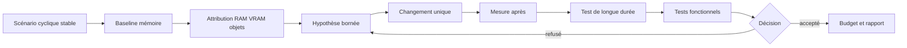

# Optimisation RAM, VRAM et allocations

> **Repères d’utilisation :** **[PS]** PowerShell 7, **[VSC]** Visual Studio Code, **[APP]** application graphique nommée, **[SORTIE]** résultat à lire sans le saisir, **[LECTURE]** exemple ou structure de référence. Voir la [convention complète](../Volume-0/annexes/CONVENTION-OUTILS-ET-CONTEXTES.md).

## 1. Rôle du chapitre

L’optimisation mémoire transforme un arrêt brutal, une croissance lente, un pic de chargement ou une saturation de VRAM en enquête reproductible. Elle distingue la mémoire réellement nécessaire au produit des références oubliées, duplications, caches sans limite et allocations transitoires.

Le chapitre 7 conserve le coût des passes de rendu et les profils graphiques. Le présent chapitre possède les budgets RAM/VRAM, les rapports d’allocations, les stratégies de cache et les tests de longue durée. Le chapitre 9 conservera le chargement en arrière-plan, le streaming, les transitions et les politiques d’éviction liées aux zones.

La règle centrale est la suivante : libérer davantage n’est pas un objectif en soi. Une modification est acceptable lorsqu’elle réduit un pic ou une croissance mesurée, respecte les budgets de plateforme et ne dégrade ni correction fonctionnelle, ni stabilité, ni qualité visuelle.

## 2. Résultats d’apprentissage

- distinguer mémoire résidente, mémoire privée, mémoire statique, pic et mémoire vidéo ;
- définir des budgets souples et durs par plateforme ;
- utiliser les moniteurs mémoire de Godot sans les présenter comme un inventaire exhaustif ;
- identifier références persistantes, nœuds orphelins et ressources dupliquées ;
- concevoir des caches bornés et observables ;
- gérer explicitement la durée de vie des nœuds, `RefCounted` et ressources ;
- limiter les allocations temporaires dans les boucles fréquentes ;
- préparer un test de longue durée avec phases, plateaux et critères de fuite ;
- comparer baseline et candidate avec les mêmes scènes et cycles ;
- relier RAM, VRAM, qualité et temps de frame sans confondre leurs causes ;
- organiser le diagnostic en modes Solo et Studio ;
- refuser une optimisation fondée sur une seule capture ou un seul compteur.

## 3. Niveau de preuve et réserves

Le chapitre est accepté au niveau `static-review`. Les contrats, scripts et procédures sont relus statiquement. Aucune campagne mémoire, aucun profil d’allocations, aucun test de longue durée et aucune réduction runtime de `Project Asteria` ne sont revendiqués comme produits.

> **[LECTURE] État de preuve du chapitre — Ne pas saisir.**

```yaml
evidence_level:
  chapter: static_review
  memory_budget_qualified: false
  allocation_report_created: false
  cache_strategy_executed: false
  soak_test_executed: false
  ram_peak_reduced: false
  vram_peak_reduced: false
  functional_regression_suite_executed: false
  runtime_improvement_claimed: false
```

<!-- qa:code-explanation -->

**Explication structurée du bloc :**

- **Statut :** `static_review` décrit une revue documentaire et non une campagne mémoire.
- **Séparation :** RAM, VRAM, allocations, cache et longue durée possèdent des indicateurs distincts.
- **Régression :** la suite fonctionnelle reste indépendante de la mesure mémoire.
- **Limite :** une future validation devra conserver environnement, cycles, échantillons et artefacts.

## 4. Prérequis et frontières

Le lecteur doit connaître les portes qualité du chapitre 2, les tests fonctionnels du chapitre 3, l’observabilité locale du chapitre 5, les campagnes CPU du chapitre 6 et les signaux VRAM du chapitre 7.

Le présent chapitre possède les budgets mémoire, les rapports d’allocations, les politiques de cache, la recherche de références persistantes et les tests de longue durée. Il peut mesurer une phase de chargement, mais ne définit ni la file de streaming, ni les priorités de zones, ni l’interface de progression du chapitre 9.

> **Frontière essentielle :** une baisse ponctuelle après changement de scène ne démontre ni l’absence de fuite, ni l’efficacité d’un cache, ni la stabilité d’un produit après plusieurs heures.

## 5. Vocabulaire opérationnel

- **RAM :** mémoire principale consommée par le processus, le moteur, les bibliothèques et les données.
- **VRAM :** mémoire vidéo utilisée par textures, buffers et ressources gérées par le pilote.
- **Mémoire résidente :** pages actuellement présentes en mémoire physique pour le processus.
- **Mémoire privée :** mémoire engagée qui n’est pas partagée avec d’autres processus.
- **Mémoire statique Godot :** mémoire suivie par l’allocateur statique exposé par les moniteurs du moteur.
- **Pic :** valeur maximale observée dans une fenêtre ou une phase.
- **Plateau :** niveau relativement stable après une phase de chauffe ou de charge.
- **Fuite :** croissance non récupérée liée à des objets, ressources ou allocations qui restent accessibles ou non libérés.
- **Rétention :** conservation volontaire ou involontaire d’une référence.
- **Duplication :** copie indépendante d’une donnée qui aurait pu être partagée ou reconstruite.
- **Cache :** stockage temporaire destiné à éviter un recalcul ou un rechargement.
- **Allocation temporaire :** mémoire créée pour une opération courte, souvent répétée.
- **Fragmentation :** impossibilité d’utiliser efficacement des espaces libres dispersés.
- **Budget souple :** seuil qui déclenche enquête, réduction ou avertissement.
- **Budget dur :** limite qui bloque une promotion ou force un profil de repli.
- **Test de longue durée :** campagne répétée destinée à observer croissance, plateaux et dérive.

## 6. Modèle de décision

> **[LECTURE] Cycle d’optimisation mémoire — Ne pas exécuter.**



<!-- qa:code-explanation -->

**Explication structurée du bloc :**

- **Entrée :** le scénario cyclique précède la mesure.
- **Attribution :** la croissance est séparée entre RAM, VRAM, objets et caches.
- **Durée :** le test prolongé vérifie qu’un gain local ne masque pas une dérive.
- **Décision :** la correction fonctionnelle et les budgets déterminent l’acceptation.

## 7. Les quatre questions d’une enquête mémoire

- **Combien ?** Quelle quantité est observée, avec quelle unité et quel compteur ?
- **Quand ?** La valeur augmente-t-elle au chargement, pendant l’usage, à la sortie ou après plusieurs cycles ?
- **Qui retient ?** Nœud, ressource, singleton, signal, cache, thread, pilote ou bibliothèque native ?
- **Pourquoi conserver ?** Besoin fonctionnel, anticipation, réutilisation, erreur de durée de vie ou duplication ?

Un seul nombre ne répond pas à ces questions. Le diagnostic associe une série temporelle, un scénario, un inventaire d’objets et une hypothèse de durée de vie.

## 8. Budgets mémoire par plateforme

Un budget sépare le disponible théorique, la part réservée au système, la cible du produit et une marge pour les pics. Les valeurs ci-dessous sont des emplacements à qualifier, pas des mesures.

> **[VSC] Visual Studio Code — Créer `config/performance/memory_budgets.yaml`.**

```yaml
schema_version: 1
budgets:
  windows_reference:
    hardware:
      ram_installed_gib: 32
      vram_installed_gib: 12
    process_ram:
      soft_limit_mib: pending_qualification
      hard_limit_mib: pending_qualification
      peak_window_seconds: 10
    render_vram:
      soft_limit_mib: pending_qualification
      hard_limit_mib: pending_qualification
    temporary_allocations:
      max_growth_per_cycle_mib: pending_qualification
    decision:
      require_functional_suite: true
      require_long_run: true
```

<!-- qa:code-explanation -->

**Explication structurée du bloc :**

- **Plateforme :** le budget est rattaché au poste Windows de référence.
- **Seuils :** les limites souples et dures restent à qualifier par mesure.
- **Pic :** la fenêtre évite de confondre un échantillon isolé et un pic durable.
- **Porte :** la longue durée et la suite fonctionnelle sont obligatoires.

## 9. Unités et conversions

Les outils peuvent afficher octets, mébioctets ou gibioctets. Un rapport doit conserver l’unité source et la conversion appliquée.

> **[LECTURE] Conversions binaires de référence — Ne pas saisir.**

```text
1 KiB = 1 024 octets
1 MiB = 1 024 KiB = 1 048 576 octets
1 GiB = 1 024 MiB = 1 073 741 824 octets

mib = bytes / 1_048_576
gib = bytes / 1_073_741_824
```

<!-- qa:code-explanation -->

**Explication structurée du bloc :**

- **Convention :** les unités binaires évitent une ambiguïté avec les multiples décimaux.
- **Traçabilité :** le nombre d’octets source doit rester disponible.
- **Comparaison :** baseline et candidate utilisent la même conversion.
- **Limite :** une conversion correcte ne garantit pas que deux compteurs mesurent la même chose.

## 10. Contrat de campagne mémoire

> **[VSC] Visual Studio Code — Créer `config/performance/memory_campaign.yaml`.**

```yaml
schema_version: 1
campaign:
  id: AST-MEM-001
  build: pending_build_id
  platform: windows_reference
  scenario: hub_combat_hub_cycle
  warmup_cycles: 3
  measured_cycles: 30
  phases:
    - hub_enter
    - combat_enter
    - combat_play
    - combat_exit
    - hub_return
    - idle_plateau
  sample_interval_ms: 500
  invalidation:
    - build_mismatch
    - scene_error
    - background_update
    - capture_tool_failure
  artifacts:
    raw_samples: reports/performance/memory/raw/
    summaries: reports/performance/memory/summaries/
    snapshots: reports/performance/memory/snapshots/
```

<!-- qa:code-explanation -->

**Explication structurée du bloc :**

- **Cycle :** la même séquence chargement-usage-sortie est répétée.
- **Warm-up :** les premiers cycles sont séparés de la comparaison principale.
- **Phases :** les pics et plateaux sont attribués à une étape nommée.
- **Invalidation :** les exclusions sont définies avant observation.

## 11. Manifeste d’environnement

> **[VSC] Visual Studio Code — Créer `config/performance/memory_environment.yaml`.**

```yaml
schema_version: 1
environment:
  os: Windows 11 64 bits
  cpu: AMD Ryzen 7 2700
  ram_gib: 32
  gpu: AMD Radeon RX 6750 XT
  vram_gib: 12
  renderer: Forward+
  godot: 4.7.1-stable
  display_resolution: pending_record
  graphics_profile: pending_record
  driver_version: pending_record
  page_file_policy: pending_record
  background_process_policy: controlled
  capture_tools: []
```

<!-- qa:code-explanation -->

**Explication structurée du bloc :**

- **Mémoire :** RAM, VRAM et politique de fichier d’échange sont documentées.
- **Rendu :** résolution et profil graphique influencent la VRAM.
- **Pilote :** la version doit rester comparable entre campagnes.
- **Outils :** chaque capture externe est déclarée car elle peut modifier l’empreinte.

## 12. Moniteurs mémoire de Godot

Le singleton `Performance` expose des moniteurs légers. Ils décrivent les domaines suivis par Godot ; ils ne remplacent ni le compteur du système, ni un inventaire natif complet.

> **[VSC] Visual Studio Code — Créer `res://src/core/performance/memory_probe.gd`.**

```gdscript
class_name MemoryProbe
extends RefCounted

static func snapshot() -> Dictionary:
    return {
        "static_bytes": Performance.get_monitor(
            Performance.MEMORY_STATIC
        ),
        "static_peak_bytes": Performance.get_monitor(
            Performance.MEMORY_STATIC_MAX
        ),
        "message_buffer_peak_bytes": Performance.get_monitor(
            Performance.MEMORY_MESSAGE_BUFFER_MAX
        ),
        "object_count": Performance.get_monitor(
            Performance.OBJECT_COUNT
        ),
        "orphan_node_count": Performance.get_monitor(
            Performance.OBJECT_ORPHAN_NODE_COUNT
        ),
        "resource_count": Performance.get_monitor(
            Performance.OBJECT_RESOURCE_COUNT
        ),
        "node_count": Performance.get_monitor(
            Performance.OBJECT_NODE_COUNT
        ),
    }
```

<!-- qa:code-explanation -->

**Explication structurée du bloc :**

- **Mémoire :** `MEMORY_STATIC` et son pic suivent l’allocateur statique exposé par le moteur.
- **Objets :** objets, ressources, nœuds et orphelins orientent l’attribution.
- **Tampon :** le pic de messages peut signaler une pression distincte.
- **Limite :** ces compteurs ne constituent pas toute la mémoire du processus.

## 13. Mémoire du processus côté moteur

Les informations du système d’exploitation complètent les moniteurs Godot. Leur disponibilité et leur définition peuvent varier selon la plateforme.

> **[VSC] Visual Studio Code — Étendre `memory_probe.gd`.**

```gdscript
static func process_snapshot() -> Dictionary:
    return {
        "static_usage_bytes": OS.get_static_memory_usage(),
        "static_peak_bytes": OS.get_static_memory_peak_usage(),
        "platform": OS.get_name(),
        "process_id": OS.get_process_id(),
    }
```

<!-- qa:code-explanation -->

**Explication structurée du bloc :**

- **Source :** les appels `OS` fournissent le point de vue du moteur sur son allocation statique.
- **Identité :** le PID permet de corréler avec un outil système.
- **Plateforme :** le nom du système accompagne chaque série.
- **Prudence :** le rapport doit documenter le sens exact du compteur utilisé.

## 14. Mémoire vidéo depuis RenderingServer

Les indicateurs de rendu exposent des estimations ou compteurs gérés par le moteur. Ils servent à suivre une tendance compatible, pas à reconstituer toute l’allocation du pilote.

> **[VSC] Visual Studio Code — Ajouter une sonde VRAM.**

```gdscript
static func rendering_memory_snapshot() -> Dictionary:
    return {
        "texture_mem_bytes": RenderingServer.get_rendering_info(
            RenderingServer.RENDERING_INFO_TEXTURE_MEM_USED
        ),
        "buffer_mem_bytes": RenderingServer.get_rendering_info(
            RenderingServer.RENDERING_INFO_BUFFER_MEM_USED
        ),
        "video_mem_bytes": RenderingServer.get_rendering_info(
            RenderingServer.RENDERING_INFO_VIDEO_MEM_USED
        ),
    }
```

<!-- qa:code-explanation -->

**Explication structurée du bloc :**

- **Textures :** le compteur isole les ressources de texture suivies par le renderer.
- **Buffers :** les buffers sont suivis séparément.
- **Total :** la mémoire vidéo agrège les éléments connus du moteur.
- **Limite :** pilote, outils et autres processus peuvent consommer de la VRAM hors de cet inventaire.

## 15. Échantillon structuré

> **[VSC] Visual Studio Code — Créer `res://src/core/performance/memory_sample.gd`.**

```gdscript
class_name MemorySample
extends RefCounted

static func capture(phase: StringName, cycle: int) -> Dictionary:
    var sample := {
        "schema_version": 1,
        "timestamp_usec": Time.get_ticks_usec(),
        "phase": String(phase),
        "cycle": cycle,
    }
    sample.merge(MemoryProbe.snapshot())
    sample.merge(MemoryProbe.process_snapshot())
    sample.merge(MemoryProbe.rendering_memory_snapshot())
    return sample
```

<!-- qa:code-explanation -->

**Explication structurée du bloc :**

- **Horloge :** les ticks monotones ordonnent les échantillons dans une exécution.
- **Contexte :** phase et cycle permettent de comparer les mêmes moments.
- **Fusion :** les trois familles de compteurs restent nommées.
- **Schéma :** la version protège les analyses futures.

## 16. Collecteur borné

Échantillonner trop vite peut lui-même allouer, perturber les caches et gonfler les journaux. Le collecteur utilise une cadence explicite et une capacité maximale.

> **[VSC] Visual Studio Code — Créer `res://src/core/performance/memory_sampler.gd`.**

```gdscript
class_name MemorySampler
extends Node

@export var interval_seconds := 0.5
@export var max_samples := 20_000

var _elapsed := 0.0
var _phase: StringName = &"unknown"
var _cycle := 0
var _samples: Array[Dictionary] = []

func _process(delta: float) -> void:
    _elapsed += delta
    if _elapsed < interval_seconds:
        return
    _elapsed = 0.0
    if _samples.size() >= max_samples:
        return
    _samples.append(MemorySample.capture(_phase, _cycle))

func set_context(phase: StringName, cycle: int) -> void:
    _phase = phase
    _cycle = cycle
```

<!-- qa:code-explanation -->

**Explication structurée du bloc :**

- **Cadence :** l’intervalle limite le coût de collecte.
- **Capacité :** le tableau cesse de croître après la limite.
- **Contexte :** la phase est modifiée par le scénario de campagne.
- **Réserve :** le coût propre du collecteur devra être mesuré avant usage prolongé.

## 17. Export JSONL déterministe

> **[VSC] Visual Studio Code — Ajouter l’export au collecteur.**

```gdscript
func export_jsonl(path: String) -> Error:
    var file := FileAccess.open(path, FileAccess.WRITE)
    if file == null:
        return FileAccess.get_open_error()
    for sample in _samples:
        file.store_line(JSON.stringify(sample, "", false, true))
    file.close()
    return OK
```

<!-- qa:code-explanation -->

**Explication structurée du bloc :**

- **Format :** une ligne JSON représente un échantillon.
- **Ordre :** l’ordre d’insertion est conservé.
- **Erreur :** l’échec d’ouverture est renvoyé au scénario.
- **Mémoire :** l’exemple garde les échantillons en RAM ; un collecteur de très longue durée devra écrire par lots bornés.

## 18. Vue système sous Windows

La mémoire du processus vue par Windows complète les compteurs internes. La série doit viser le PID du build mesuré, pas un processus portant seulement un nom similaire.

> **[PS] PowerShell 7 — Échantillonner le processus ciblé.**

```powershell
$ProcessId = 12345
$Samples = 120
$IntervalSeconds = 1

1..$Samples | ForEach-Object {
    $p = Get-Process -Id $ProcessId -ErrorAction Stop
    [pscustomobject]@{
        TimestampUtc       = [DateTimeOffset]::UtcNow.ToString("O")
        ProcessId          = $p.Id
        WorkingSet64       = $p.WorkingSet64
        PrivateMemory64    = $p.PrivateMemorySize64
        VirtualMemory64    = $p.VirtualMemorySize64
        HandleCount        = $p.HandleCount
        ThreadCount        = $p.Threads.Count
    }
    Start-Sleep -Seconds $IntervalSeconds
} | Export-Csv -NoTypeInformation -Encoding utf8 `
    reports/performance/memory/process_samples.csv
```

<!-- qa:code-explanation -->

**Explication structurée du bloc :**

- **Cible :** le PID évite de mélanger plusieurs exécutions.
- **Compteurs :** working set, mémoire privée et mémoire virtuelle restent distincts.
- **Contexte :** handles et threads peuvent révéler une autre croissance de ressources.
- **Cadence :** la fenêtre est bornée par nombre d’échantillons et intervalle.

## 19. Phases et plateaux

Chaque cycle doit laisser un temps de stabilisation après la sortie d’une zone. Une baisse différée peut être normale ; une croissance du plateau après chaque cycle mérite une attribution.

> **[LECTURE] Contrat de phases — Ne pas exécuter.**

```yaml
cycle:
  - phase: hub_enter
    settle_seconds: 5
  - phase: combat_enter
    settle_seconds: 3
  - phase: combat_play
    duration_seconds: 60
  - phase: combat_exit
    settle_seconds: 5
  - phase: hub_return
    settle_seconds: 10
  - phase: idle_plateau
    duration_seconds: 30
comparison_points:
  - combat_enter_peak
  - combat_play_p95
  - idle_plateau_median
  - idle_plateau_end
```

<!-- qa:code-explanation -->

**Explication structurée du bloc :**

- **Stabilisation :** les délais empêchent de mesurer uniquement une transition.
- **Pic :** l’entrée en combat possède un point de comparaison dédié.
- **Plateau :** la médiane et la fin de repos détectent une dérive.
- **Répétition :** les mêmes points sont extraits à chaque cycle.

## 20. Analyser une croissance par cycle

> **[VSC] Visual Studio Code — Créer `tools/performance/analyze_memory_cycles.py`.**

```python
from __future__ import annotations

import csv
import math
from collections import defaultdict
from pathlib import Path

SOURCE = Path("reports/performance/memory/process_samples.csv")

def linear_slope(values: list[float]) -> float:
    if len(values) < 2:
        raise ValueError("Au moins deux cycles sont requis")
    n = len(values)
    xs = list(range(n))
    mean_x = sum(xs) / n
    mean_y = sum(values) / n
    numerator = sum((x - mean_x) * (y - mean_y)
                    for x, y in zip(xs, values))
    denominator = sum((x - mean_x) ** 2 for x in xs)
    if denominator == 0:
        raise ValueError("Cycles non distincts")
    return numerator / denominator

def ensure_finite(values: list[float]) -> None:
    if not values or not all(math.isfinite(value) for value in values):
        raise ValueError("Série vide ou non finie")
```

<!-- qa:code-explanation -->

**Explication structurée du bloc :**

- **Pente :** la régression simple quantifie une tendance par cycle.
- **Minimum :** deux cycles sont insuffisants pour une conclusion robuste mais évitent un calcul impossible.
- **Validation :** les valeurs non finies sont refusées.
- **Unité :** la pente conserve l’unité de la série, à documenter dans le rapport.

## 21. Comparer pics et plateaux

> **[VSC] Visual Studio Code — Compléter l’analyse Python.**

```python
def percentile(values: list[float], ratio: float) -> float:
    ordered = sorted(values)
    if not ordered:
        raise ValueError("Série vide")
    index = min(len(ordered) - 1,
                max(0, math.ceil(ratio * len(ordered)) - 1))
    return ordered[index]

def summarize(values: list[float]) -> dict[str, float]:
    ensure_finite(values)
    ordered = sorted(values)
    middle = len(ordered) // 2
    median = (
        ordered[middle]
        if len(ordered) % 2
        else (ordered[middle - 1] + ordered[middle]) / 2
    )
    return {
        "median": median,
        "p95": percentile(ordered, 0.95),
        "p99": percentile(ordered, 0.99),
        "maximum": max(ordered),
        "minimum": min(ordered),
    }
```

<!-- qa:code-explanation -->

**Explication structurée du bloc :**

- **Distribution :** médiane, p95, p99 et maximum décrivent centre et queue.
- **Méthode :** le percentile nearest-rank est explicite.
- **Reproductibilité :** la même fonction analyse baseline et candidate.
- **Limite :** les statistiques n’attribuent pas la cause de la croissance.

## 22. Définir un critère de fuite

Une fuite ne se déclare pas au seul fait qu’un maximum augmente. Le critère combine croissance de plateau, répétition, absence de récupération et attribution.

> **[LECTURE] Porte de suspicion de fuite — Ne pas interpréter comme mesure.**

```yaml
leak_suspicion:
  minimum_measured_cycles: 20
  compare_phase: idle_plateau_end
  signals:
    private_memory_slope_mib_per_cycle: measured
    static_memory_slope_mib_per_cycle: measured
    object_count_slope_per_cycle: measured
    orphan_node_count_slope_per_cycle: measured
    video_memory_slope_mib_per_cycle: measured
  gates:
    repeated_positive_growth: required
    recovery_window_observed: required
    scenario_errors_absent: required
    attribution_started: required
  decision: pending_human_review
```

<!-- qa:code-explanation -->

**Explication structurée du bloc :**

- **Durée :** un nombre minimal de cycles évite une conclusion depuis une courte chauffe.
- **Phase :** les fins de plateau sont comparées entre elles.
- **Signaux :** mémoire et objets sont rapprochés sans être confondus.
- **Décision :** la suspicion reste soumise à revue et attribution.

## 23. Durée de vie des nœuds

Un nœud retiré de l’arbre n’est pas nécessairement détruit. `queue_free()` programme sa libération sûre ; une référence conservée par un gestionnaire peut maintenir d’autres objets accessibles.

> **[VSC] Visual Studio Code — Libérer une instance de gameplay.**

```gdscript
func retire_enemy(enemy: Node) -> void:
    if not is_instance_valid(enemy):
        return
    enemy.set_process(false)
    enemy.set_physics_process(false)
    enemy.queue_free()
```

<!-- qa:code-explanation -->

**Explication structurée du bloc :**

- **Validation :** la fonction ignore une instance déjà invalide.
- **Arrêt :** les traitements sont coupés avant la libération différée.
- **Libération :** `queue_free()` respecte le cycle de l’arbre.
- **Références :** les collections externes doivent aussi retirer l’ennemi.

## 24. Registre sans rétention involontaire

> **[VSC] Visual Studio Code — Utiliser des références faibles dans un registre d’observation.**

```gdscript
class_name WeakNodeRegistry
extends RefCounted

var _entries: Dictionary[int, WeakRef] = {}

func track(node: Node) -> void:
    _entries[node.get_instance_id()] = weakref(node)

func resolve(instance_id: int) -> Node:
    var ref: WeakRef = _entries.get(instance_id)
    if ref == null:
        return null
    var value := ref.get_ref()
    if value == null:
        _entries.erase(instance_id)
        return null
    return value as Node

func prune() -> void:
    for instance_id in _entries.keys():
        resolve(instance_id)
```

<!-- qa:code-explanation -->

**Explication structurée du bloc :**

- **Clé :** l’identifiant sert à retrouver l’entrée sans référence forte directe.
- **Faible :** `WeakRef` ne prolonge pas volontairement la durée de vie.
- **Nettoyage :** les références mortes sont supprimées lors de la résolution ou de l’élagage.
- **Usage :** ce modèle convient à l’observation, pas à un propriétaire fonctionnel.

## 25. Connexions de signaux et propriétaires

Une connexion peut prolonger ou compliquer la durée de vie si le propriétaire fonctionnel reste global. Le diagnostic documente qui connecte, qui déconnecte et quel objet possède l’abonnement.

> **[VSC] Visual Studio Code — Encadrer un abonnement.**

```gdscript
var _subscribed := false

func activate(bus: Node) -> void:
    if _subscribed:
        return
    bus.event_emitted.connect(_on_event_emitted)
    _subscribed = true

func deactivate(bus: Node) -> void:
    if not _subscribed:
        return
    if bus.event_emitted.is_connected(_on_event_emitted):
        bus.event_emitted.disconnect(_on_event_emitted)
    _subscribed = false
```

<!-- qa:code-explanation -->

**Explication structurée du bloc :**

- **Idempotence :** l’activation ne crée pas plusieurs connexions.
- **Déconnexion :** la sortie retire explicitement l’abonnement.
- **État :** le booléen rend le contrat observable.
- **Responsabilité :** l’appelant doit garantir que `deactivate()` accompagne la fin de vie logique.

## 26. Ressources RefCounted

Les ressources dérivées de `RefCounted` sont libérées lorsque plus aucune référence forte ne les conserve. Les singletons, dictionnaires, callbacks et caches sont donc des suspects naturels.

> **[LECTURE] Carte de propriété d’une ressource — Ne pas saisir.**

```yaml
resource_lifetime:
  path: res://data/items/sword.tres
  owners:
    - inventory_catalog
    - equipped_item
    - ui_preview_cache
  expected_release:
    inventory_catalog: application_shutdown
    equipped_item: unequip
    ui_preview_cache: lru_eviction
  duplicate_policy:
    shared_read_only: preferred
    mutable_runtime_copy: explicit
```

<!-- qa:code-explanation -->

**Explication structurée du bloc :**

- **Propriétaires :** chaque référence forte attendue est nommée.
- **Échéance :** la fin de vie diffère selon le rôle.
- **Cache :** l’éviction devient un événement attendu.
- **Duplication :** une copie mutable doit être explicite.

## 27. Duplications explicites

Une copie profonde de ressources, tableaux ou dictionnaires peut multiplier l’empreinte. Le rapport doit distinguer partage intentionnel, copie de configuration et état runtime mutable.

> **[VSC] Visual Studio Code — Déclarer une copie runtime.**

```gdscript
func create_runtime_state(template: Resource) -> Resource:
    var runtime_state := template.duplicate(true)
    runtime_state.set_meta("source_path", template.resource_path)
    runtime_state.set_meta("copy_reason", "mutable_runtime_state")
    return runtime_state
```

<!-- qa:code-explanation -->

**Explication structurée du bloc :**

- **Copie :** `duplicate(true)` produit une copie profonde volontaire.
- **Provenance :** le chemin source reste attaché à la copie.
- **Justification :** la raison distingue copie nécessaire et duplication accidentelle.
- **Contrôle :** le nombre de copies doit être mesuré dans la campagne.

## 28. Cache borné LRU

> **[VSC] Visual Studio Code — Créer `res://src/core/cache/bounded_lru_cache.gd`.**

```gdscript
class_name BoundedLruCache
extends RefCounted

var _capacity: int
var _values: Dictionary = {}
var _order: Array[Variant] = []

func _init(capacity: int) -> void:
    _capacity = maxi(1, capacity)

func get_value(key: Variant) -> Variant:
    if not _values.has(key):
        return null
    _order.erase(key)
    _order.push_back(key)
    return _values[key]

func put(key: Variant, value: Variant) -> void:
    if _values.has(key):
        _order.erase(key)
    _values[key] = value
    _order.push_back(key)
    while _order.size() > _capacity:
        var evicted_key := _order.pop_front()
        _values.erase(evicted_key)

func clear() -> void:
    _values.clear()
    _order.clear()
```

<!-- qa:code-explanation -->

**Explication structurée du bloc :**

- **Capacité :** le nombre d’entrées possède une limite dure.
- **Récence :** chaque lecture déplace la clé en fin d’ordre.
- **Éviction :** les anciennes entrées perdent leur référence forte.
- **Limite :** une capacité en nombre d’objets ne remplace pas un budget en octets.

## 29. Cache pondéré par coût

Des entrées de tailles très différentes exigent un poids. L’estimation doit être cohérente et versionnée, même si elle n’égale pas exactement l’allocation réelle.

> **[VSC] Visual Studio Code — Étendre le cache avec un budget estimé.**

```gdscript
var _max_weight_bytes := 64 * 1024 * 1024
var _current_weight_bytes := 0
var _weights: Dictionary = {}

func put_weighted(key: Variant, value: Variant, weight_bytes: int) -> void:
    if weight_bytes < 0:
        push_error("Poids négatif interdit")
        return
    if _values.has(key):
        _current_weight_bytes -= int(_weights[key])
        _order.erase(key)
    _values[key] = value
    _weights[key] = weight_bytes
    _current_weight_bytes += weight_bytes
    _order.push_back(key)
    while _current_weight_bytes > _max_weight_bytes and not _order.is_empty():
        var evicted_key := _order.pop_front()
        _current_weight_bytes -= int(_weights[evicted_key])
        _weights.erase(evicted_key)
        _values.erase(evicted_key)
```

<!-- qa:code-explanation -->

**Explication structurée du bloc :**

- **Poids :** chaque entrée déclare une estimation en octets.
- **Remplacement :** l’ancien poids est retiré avant mise à jour.
- **Budget :** l’éviction se poursuit jusqu’au retour sous la limite.
- **Prudence :** l’estimation doit être confrontée aux compteurs réels.

## 30. Cache négatif et expiration

Mémoriser indéfiniment les échecs peut empêcher une ressource corrigée d’être retrouvée. Un cache négatif doit posséder une expiration et une clé de version.

> **[LECTURE] Contrat de cache négatif — Ne pas saisir.**

```yaml
negative_cache:
  key:
    - resource_id
    - content_version
  entry:
    error_code: recorded
    created_at_monotonic_usec: recorded
    ttl_seconds: 30
  invalidation:
    - content_version_changed
    - manual_retry
    - ttl_expired
  maximum_entries: 512
```

<!-- qa:code-explanation -->

**Explication structurée du bloc :**

- **Version :** une correction de contenu produit une autre clé.
- **Expiration :** l’échec n’est pas conservé sans limite.
- **Capacité :** les erreurs sont elles aussi bornées.
- **Diagnostic :** le code d’erreur reste disponible pour le rapport.

## 31. Pooling : bénéfice et dette

Un pool peut réduire les créations fréquentes, mais il conserve volontairement des instances et leurs ressources. Sa taille doit être mesurée et sa remise à zéro testée.

> **[VSC] Visual Studio Code — Créer un pool borné de projectiles.**

```gdscript
class_name ProjectilePool
extends Node

@export var maximum_idle := 128
var _idle: Array[Node] = []

func acquire(factory: Callable) -> Node:
    if not _idle.is_empty():
        var projectile := _idle.pop_back()
        projectile.reset_for_reuse()
        return projectile
    return factory.call()

func release(projectile: Node) -> void:
    projectile.prepare_for_pool()
    if _idle.size() >= maximum_idle:
        projectile.queue_free()
        return
    _idle.push_back(projectile)
```

<!-- qa:code-explanation -->

**Explication structurée du bloc :**

- **Réutilisation :** une instance inactive est remise à zéro avant emploi.
- **Capacité :** le pool ne conserve pas plus de 128 instances inactives.
- **Surplus :** les instances au-delà de la limite sont libérées.
- **Correction :** `reset_for_reuse()` et `prepare_for_pool()` doivent être couverts par des tests.

## 32. Allocations temporaires dans les boucles

Les tableaux, dictionnaires, chaînes et copies créés à chaque frame peuvent augmenter la pression mémoire et le coût CPU. Le premier levier est de réduire la fréquence et la quantité de données produites.

> **[VSC] Visual Studio Code — Réutiliser un tampon de candidats.**

```gdscript
var _nearby_candidates: Array[Node3D] = []

func collect_nearby_candidates(source: Array[Node3D],
        origin: Vector3, radius_squared: float) -> Array[Node3D]:
    _nearby_candidates.clear()
    for candidate in source:
        if candidate.global_position.distance_squared_to(origin) <= radius_squared:
            _nearby_candidates.push_back(candidate)
    return _nearby_candidates
```

<!-- qa:code-explanation -->

**Explication structurée du bloc :**

- **Tampon :** le tableau est conservé entre appels.
- **Calcul :** la distance au carré évite une racine carrée.
- **Fréquence :** la fonction doit rester appelée seulement lorsque nécessaire.
- **Contrat :** l’appelant ne doit pas conserver ou modifier le tampon retourné.

## 33. API sans propriété ambiguë

Retourner un tampon interne est rapide mais fragile. Une API sûre peut remplir un tableau fourni par l’appelant, qui en possède explicitement la durée de vie.

> **[VSC] Visual Studio Code — Préférer un tampon de sortie.**

```gdscript
func fill_nearby_candidates(
        source: Array[Node3D],
        origin: Vector3,
        radius_squared: float,
        output: Array[Node3D]) -> void:
    output.clear()
    for candidate in source:
        if candidate.global_position.distance_squared_to(origin) <= radius_squared:
            output.push_back(candidate)
```

<!-- qa:code-explanation -->

**Explication structurée du bloc :**

- **Propriété :** l’appelant possède le tableau de sortie.
- **Réutilisation :** le même tampon peut servir à plusieurs cycles.
- **Absence de copie :** la fonction ne construit pas un nouveau tableau de résultat.
- **Documentation :** le contrat précise que le contenu précédent est effacé.

## 34. Structures compactes

Les `Packed*Array` conviennent aux séries homogènes et peuvent réduire le surcoût par élément par rapport à des conteneurs de `Variant`. Le choix dépend toutefois des opérations et conversions nécessaires.

> **[LECTURE] Choix de structure — Ne pas saisir.**

```yaml
data_layout:
  positions:
    preferred: PackedVector3Array
    reason: homogeneous_numeric_series
  entity_records:
    preferred: Array[Dictionary]
    reason: heterogeneous_debug_records
  binary_payload:
    preferred: PackedByteArray
    reason: serialized_bytes
  decision:
    benchmark_required: true
    conversion_cost_recorded: true
```

<!-- qa:code-explanation -->

**Explication structurée du bloc :**

- **Homogénéité :** les séries numériques utilisent un conteneur spécialisé.
- **Hétérogénéité :** les rapports de diagnostic privilégient la lisibilité.
- **Binaire :** les octets sérialisés évitent une liste de variants.
- **Mesure :** la conversion et les usages réels déterminent le choix final.

## 35. Chaînes et journaux

Construire de longues chaînes à chaque frame peut provoquer allocations et contention. Le chapitre 5 conserve la politique de journalisation ; ici, la règle est d’éviter la création du message lorsque l’événement n’est pas retenu.

> **[VSC] Visual Studio Code — Garder l’événement mémoire borné.**

```gdscript
func emit_budget_event(category: StringName, used_bytes: int,
        limit_bytes: int, should_emit: bool) -> void:
    if not should_emit:
        return
    var payload := {
        "category": String(category),
        "used_bytes": used_bytes,
        "limit_bytes": limit_bytes,
        "ratio": (
            float(used_bytes) / float(limit_bytes)
            if limit_bytes > 0 else null
        ),
    }
    MemoryEventBus.emit_structured(payload)
```

<!-- qa:code-explanation -->

**Explication structurée du bloc :**

- **Garde :** aucun dictionnaire n’est créé lorsque l’événement est filtré.
- **Données :** les octets sources sont conservés.
- **Ratio :** la division par zéro est évitée.
- **Frontière :** la rétention et le débit restent gouvernés par le chapitre 5.

## 36. Images, textures et mipmaps

Une image CPU, une texture GPU et leurs variantes peuvent coexister. Le rapport identifie les copies, dimensions, formats, mipmaps et propriétaires au lieu d’estimer depuis le seul fichier source.

> **[LECTURE] Inventaire d’une texture — Ne pas saisir.**

```yaml
texture_inventory:
  resource_path: res://assets/environment/rock_albedo.ktx2
  dimensions: measured
  imported_format: recorded
  mipmaps: recorded
  cpu_image_retained: measured
  gpu_texture_present: measured
  duplicate_instances: measured
  owners:
    - material_library
    - preview_cache
  release_points:
    preview_cache: lru_eviction
    material_library: project_shutdown
```

<!-- qa:code-explanation -->

**Explication structurée du bloc :**

- **Étages :** source importée, image CPU et texture GPU sont distinguées.
- **Format :** dimensions, compression et mipmaps influencent l’empreinte.
- **Copies :** le nombre d’instances est mesuré.
- **Propriété :** chaque conservation possède un point de libération.

## 37. Scènes, sous-ressources et localité

Rendre une ressource locale à une scène ou dupliquer une sous-ressource peut être nécessaire pour l’état mutable, mais multiplie les instances. Le diagnostic compare les chemins, identifiants et raisons de localité.

> **[LECTURE] Rapport de duplication de sous-ressources — Ne pas saisir.**

```yaml
subresource_duplicates:
  source_scene: res://scenes/characters/guard.tscn
  resource_type: StandardMaterial3D
  expected_shared_instances: measured
  local_to_scene_instances: measured
  deep_duplicates: measured
  reasons:
    runtime_tint: explicit
    accidental_editor_duplicate: pending_review
  candidate_action:
    share_immutable_base: proposed
    isolate_mutable_parameters: proposed
```

<!-- qa:code-explanation -->

**Explication structurée du bloc :**

- **Source :** la scène canonique est identifiée.
- **Catégories :** partage, localité et copie profonde sont séparés.
- **Raison :** une variation runtime ne justifie pas automatiquement une copie complète.
- **Action :** la proposition reste à mesurer et revoir.

## 38. Test de longue durée

> **[VSC] Visual Studio Code — Créer `config/performance/memory_soak_test.yaml`.**

```yaml
schema_version: 1
soak_test:
  id: AST-MEM-SOAK-001
  duration_minutes: 180
  warmup_minutes: 15
  cycle_count: 120
  sample_interval_seconds: 1
  checkpoints_minutes:
    - 15
    - 30
    - 60
    - 120
    - 180
  required_signals:
    - private_memory_bytes
    - working_set_bytes
    - static_memory_bytes
    - object_count
    - orphan_node_count
    - texture_mem_bytes
    - buffer_mem_bytes
    - video_mem_bytes
  failure:
    crash: blocking
    hard_budget_exceeded: blocking
    unrecovered_growth: review_required
    functional_error: blocking
```

<!-- qa:code-explanation -->

**Explication structurée du bloc :**

- **Durée :** la campagne couvre plusieurs heures et cycles.
- **Checkpoints :** des résumés intermédiaires facilitent l’attribution.
- **Signaux :** processus, moteur, objets et rendu sont rapprochés.
- **Porte :** crash, budget dur et régression fonctionnelle sont bloquants.

## 39. Rapport avant/après

> **[VSC] Visual Studio Code — Créer `reports/performance/memory/AST-MEM-001-comparison.yaml`.**

```yaml
schema_version: 1
comparison:
  baseline:
    commit: pending
    environment_manifest: pending
    raw_samples: pending
  candidate:
    commit: pending
    environment_manifest: pending
    raw_samples: pending
  change:
    hypothesis: pending
    primary_variable: pending
    rollback: pending
  metrics:
    ram_peak_mib:
      before: measured
      after: measured
    idle_plateau_slope_mib_per_cycle:
      before: measured
      after: measured
    vram_peak_mib:
      before: measured
      after: measured
    orphan_nodes_end:
      before: measured
      after: measured
  gates:
    memory_budget: pending
    long_run: pending
    functional_suite: pending
    visual_quality: pending
    human_approval: pending
  decision: pending
```

<!-- qa:code-explanation -->

**Explication structurée du bloc :**

- **Symétrie :** baseline et candidate possèdent environnement et échantillons.
- **Hypothèse :** la variable principale et le retour arrière sont écrits.
- **Métriques :** pics, pente et orphelins sont comparés séparément.
- **Porte :** la décision attend mémoire, durée, fonctionnel, visuel et approbation.

## 40. Diagnostics et anti-patterns
<!-- qa:error-correction-section -->

### 40.1 Conclure depuis une seule capture

**Symptôme ou risque :** Une capture montre une valeur élevée et l’équipe annonce une fuite.

**Exemple fautif :**

> **[LECTURE] Exemple fautif — Ne pas appliquer.**

```yaml
diagnosis:
  samples: 1
  phase: unknown
  warmup: ignored
  cycles: 0
  conclusion: leak_confirmed
```

<!-- qa:code-explanation -->

**Pourquoi cet exemple est fautif :**

- **Erreur :** une valeur isolée ne décrit ni tendance, ni récupération, ni phase.

**Exemple corrigé :**

> **[LECTURE] Exemple corrigé — Adapter au contrat du projet.**

```yaml
diagnosis:
  measured_cycles: 30
  phase: idle_plateau_end
  raw_series: retained
  recovery_window: observed
  slope: measured
  attribution: pending_review
```

<!-- qa:code-explanation -->

**Pourquoi la correction fonctionne :**

- **Correction :** la série cyclique, le plateau et la fenêtre de récupération soutiennent une enquête reproductible.

### 40.2 Confondre working set et mémoire privée

**Symptôme ou risque :** Deux outils affichent des nombres différents et l’un est déclaré faux.

**Exemple fautif :**

> **[LECTURE] Exemple fautif — Ne pas appliquer.**

```yaml
process_memory:
  working_set_bytes: 2400000000
  private_memory_bytes: 3100000000
  interpretation: counters_should_match
```

<!-- qa:code-explanation -->

**Pourquoi cet exemple est fautif :**

- **Erreur :** les compteurs décrivent des concepts différents et ne doivent pas coïncider.

**Exemple corrigé :**

> **[LECTURE] Exemple corrigé — Adapter au contrat du projet.**

```yaml
process_memory:
  working_set_bytes: measured
  private_memory_bytes: measured
  definitions: documented
  comparison: same_counter_across_runs
```

<!-- qa:code-explanation -->

**Pourquoi la correction fonctionne :**

- **Correction :** chaque série conserve sa définition et n’est comparée qu’à son équivalent.

### 40.3 Effacer un cache sans politique

**Symptôme ou risque :** La mémoire baisse, mais les temps de chargement et les saccades se dégradent.

**Exemple fautif :**

> **[LECTURE] Exemple fautif — Ne pas appliquer.**

```gdscript
func fix_memory() -> void:
    global_cache.clear()
```

<!-- qa:code-explanation -->

**Pourquoi cet exemple est fautif :**

- **Erreur :** l’effacement total ignore finalité, fréquence, coût de reconstruction et budget.

**Exemple corrigé :**

> **[LECTURE] Exemple corrigé — Adapter au contrat du projet.**

```yaml
cache_change:
  capacity_before: measured
  capacity_after: proposed
  eviction_policy: lru
  hit_rate: measured
  rebuild_cost_ms: measured
  memory_peak_mib: measured
  rollback: defined
```

<!-- qa:code-explanation -->

**Pourquoi la correction fonctionne :**

- **Correction :** mémoire, efficacité du cache et coût de reconstruction sont évalués ensemble.

### 40.4 Créer un pool sans limite

**Symptôme ou risque :** Le nombre d’objets inactifs augmente après chaque combat.

**Exemple fautif :**

> **[LECTURE] Exemple fautif — Ne pas appliquer.**

```gdscript
func release(projectile: Node) -> void:
    idle_projectiles.push_back(projectile)
```

<!-- qa:code-explanation -->

**Pourquoi cet exemple est fautif :**

- **Erreur :** le pool conserve indéfiniment chaque instance et ses ressources.

**Exemple corrigé :**

> **[LECTURE] Exemple corrigé — Adapter au contrat du projet.**

```gdscript
func release(projectile: Node) -> void:
    projectile.prepare_for_pool()
    if idle_projectiles.size() >= maximum_idle:
        projectile.queue_free()
        return
    idle_projectiles.push_back(projectile)
```

<!-- qa:code-explanation -->

**Pourquoi la correction fonctionne :**

- **Correction :** la taille inactive est bornée et le surplus est libéré.

### 40.5 Supprimer un nœud de l’arbre sans le libérer

**Symptôme ou risque :** Le nœud disparaît visuellement mais le nombre d’objets continue de croître.

**Exemple fautif :**

> **[LECTURE] Exemple fautif — Ne pas appliquer.**

```gdscript
func retire(node: Node) -> void:
    remove_child(node)
```

<!-- qa:code-explanation -->

**Pourquoi cet exemple est fautif :**

- **Erreur :** `remove_child()` ne détruit pas le nœud et aucune autre propriété n’est définie.

**Exemple corrigé :**

> **[LECTURE] Exemple corrigé — Adapter au contrat du projet.**

```gdscript
func retire(node: Node) -> void:
    if is_instance_valid(node):
        node.queue_free()
```

<!-- qa:code-explanation -->

**Pourquoi la correction fonctionne :**

- **Correction :** la fin de vie est explicite et compatible avec le cycle de l’arbre.

### 40.6 Dupliquer toutes les ressources runtime

**Symptôme ou risque :** Chaque instance de personnage possède ses propres matériaux et données immuables.

**Exemple fautif :**

> **[LECTURE] Exemple fautif — Ne pas appliquer.**

```gdscript
func spawn(template: Resource) -> Resource:
    return template.duplicate(true)
```

<!-- qa:code-explanation -->

**Pourquoi cet exemple est fautif :**

- **Erreur :** la copie profonde est appliquée sans besoin de mutabilité ni mesure.

**Exemple corrigé :**

> **[LECTURE] Exemple corrigé — Adapter au contrat du projet.**

```gdscript
func spawn(template: Resource, needs_mutation: bool) -> Resource:
    if not needs_mutation:
        return template
    var copy := template.duplicate(true)
    copy.set_meta("copy_reason", "runtime_mutation")
    return copy
```

<!-- qa:code-explanation -->

**Pourquoi la correction fonctionne :**

- **Correction :** les ressources immuables sont partagées et les copies nécessaires sont traçables.

### 40.7 Mesurer la VRAM avec un seul compteur

**Symptôme ou risque :** Le compteur du moteur reste sous le budget, mais le pilote sature.

**Exemple fautif :**

> **[LECTURE] Exemple fautif — Ne pas appliquer.**

```yaml
vram:
  engine_video_mem_bytes: measured
  driver_view: absent
  other_processes: ignored
  decision: accepted
```

<!-- qa:code-explanation -->

**Pourquoi cet exemple est fautif :**

- **Erreur :** l’indicateur du moteur n’inventorie pas nécessairement le pilote et les autres processus.

**Exemple corrigé :**

> **[LECTURE] Exemple corrigé — Adapter au contrat du projet.**

```yaml
vram:
  engine_texture_mem_bytes: measured
  engine_buffer_mem_bytes: measured
  engine_video_mem_bytes: measured
  system_or_driver_view: recorded
  resolution_and_profile: recorded
  decision: pending_review
```

<!-- qa:code-explanation -->

**Pourquoi la correction fonctionne :**

- **Correction :** plusieurs vues compatibles et le contexte graphique soutiennent la décision.

### 40.8 Réduire la mémoire en cassant la qualité

**Symptôme ou risque :** Les textures sont réduites et le budget est respecté, mais les interfaces deviennent illisibles.

**Exemple fautif :**

> **[LECTURE] Exemple fautif — Ne pas appliquer.**

```yaml
candidate:
  vram_peak: lower
  texture_resolution: reduced_globally
  visual_review: absent
  accessibility_review: absent
  decision: accepted
```

<!-- qa:code-explanation -->

**Pourquoi cet exemple est fautif :**

- **Erreur :** le gain mémoire ignore la qualité visuelle et l’accessibilité.

**Exemple corrigé :**

> **[LECTURE] Exemple corrigé — Adapter au contrat du projet.**

```yaml
candidate:
  vram_peak: measured
  texture_policy: per_asset_class
  reference_images: compared
  ui_legibility: passed
  accessibility_review: passed
  rollback: defined
  decision: pending_human_approval
```

<!-- qa:code-explanation -->

**Pourquoi la correction fonctionne :**

- **Correction :** le budget, les catégories d’assets et la qualité sont contrôlés ensemble.

### 40.9 Nettoyer seulement à la fermeture

**Symptôme ou risque :** La session courte semble stable, mais la mémoire croît entre les transitions.

**Exemple fautif :**

> **[LECTURE] Exemple fautif — Ne pas appliquer.**

```gdscript
func _notification(what: int) -> void:
    if what == NOTIFICATION_WM_CLOSE_REQUEST:
        cache.clear()
```

<!-- qa:code-explanation -->

**Pourquoi cet exemple est fautif :**

- **Erreur :** le nettoyage final ne traite pas les échéances fonctionnelles pendant la session.

**Exemple corrigé :**

> **[LECTURE] Exemple corrigé — Adapter au contrat du projet.**

```yaml
lifetime_policy:
  encounter_cache: combat_exit
  preview_cache: lru_eviction
  chapter_resources: chapter_exit
  global_catalog: application_shutdown
  long_run_validation: required
```

<!-- qa:code-explanation -->

**Pourquoi la correction fonctionne :**

- **Correction :** chaque famille possède une échéance cohérente et vérifiable en longue durée.

### 40.10 Déclarer le succès après un pic plus bas

**Symptôme ou risque :** Le maximum baisse, mais le plateau et le nombre d’orphelins augmentent.

**Exemple fautif :**

> **[LECTURE] Exemple fautif — Ne pas appliquer.**

```yaml
result:
  ram_peak_mib: lower
  idle_plateau_slope: ignored
  orphan_nodes: ignored
  functional_suite: absent
  decision: accepted
```

<!-- qa:code-explanation -->

**Pourquoi cet exemple est fautif :**

- **Erreur :** un seul maximum masque une dérive persistante et l’absence de garde fonctionnelle.

**Exemple corrigé :**

> **[LECTURE] Exemple corrigé — Adapter au contrat du projet.**

```yaml
result:
  ram_peak_mib: measured
  vram_peak_mib: measured
  idle_plateau_slope: measured
  orphan_nodes_end: measured
  long_run: passed
  functional_suite: passed
  visual_quality: passed
  decision: pending_human_approval
```

<!-- qa:code-explanation -->

**Pourquoi la correction fonctionne :**

- **Correction :** pics, dérive, objets, longue durée et régressions soutiennent la décision.

## 41. Modes Solo et Studio

### Mode Solo

- figer le scénario et les budgets avant mesure ;
- conserver les échantillons bruts et les captures ;
- écrire l’hypothèse avant de modifier cache ou durée de vie ;
- limiter le changement à une cause principale ;
- séparer profilage, correction et revue dans le temps ;
- exécuter un test de longue durée après le test court ;
- conserver un retour arrière simple ;
- vérifier fonctionnel et qualité avant acceptation.

### Mode Studio

- **QA performance :** possède scénarios, campagnes, budgets et artefacts ;
- **programmeur moteur :** attribue allocations, ressources et caches ;
- **programmeur gameplay :** corrige propriétaires, pools et temporaires ;
- **art technique :** qualifie textures, formats, mipmaps et qualité ;
- **référent plateforme :** documente RAM, VRAM, fichier d’échange et outils système ;
- **QA fonctionnelle :** vérifie transitions, sauvegardes et comportement ;
- **tech lead :** arbitre budget, dette et risque ;
- **release owner :** conserve l’autorité de promotion.

Une correction critique gagne à être reproduite par une seconde personne ou un scénario automatisé. La personne qui propose une limite de cache ne devrait pas être l’unique autorité de son acceptation.

## 42. Checklist d’acceptation

### Contrat

- [ ] plateforme, build, renderer, résolution et profil déclarés ;
- [ ] budgets souples et durs versionnés ;
- [ ] cycle, phases, warm-up, cadence et durée définis ;
- [ ] compteurs et unités documentés ;
- [ ] exclusions définies avant mesure.

### Mesure

- [ ] échantillons RAM, processus, objets et VRAM conservés ;
- [ ] pics, médiane, p95, p99 et plateaux calculés ;
- [ ] croissance par cycle analysée ;
- [ ] fenêtres de récupération observées ;
- [ ] coût du collecteur déclaré ;
- [ ] captures et inventaires liés au scénario.

### Changement

- [ ] hypothèse et propriétaire écrits ;
- [ ] variable principale isolée ;
- [ ] échéances de libération explicites ;
- [ ] cache ou pool borné ;
- [ ] duplication justifiée ;
- [ ] retour arrière défini.

### Produit

- [ ] test de longue durée réussi ;
- [ ] suite fonctionnelle réussie ;
- [ ] qualité visuelle et accessibilité préservées ;
- [ ] chargements et temps de frame non dégradés hors critères ;
- [ ] décision humaine enregistrée ;
- [ ] aucune valeur runtime inventée.

## 43. Critère d’acceptation du pilote

Le chapitre sera validé au niveau runtime lorsque `Project Asteria` disposera d’au moins une campagne mémoire matérialisée répondant simultanément aux conditions suivantes :

1. budgets RAM et VRAM qualifiés pour une plateforme ;
2. scénario cyclique et manifeste d’environnement versionnés ;
3. baseline avec échantillons moteur et système conservés ;
4. pic ou croissance attribué à une famille de propriétaires ;
5. hypothèse écrite avant modification ;
6. candidate mesurée avec le même contrat ;
7. réduction soutenue par pics, plateaux et pente ;
8. test de longue durée réussi ;
9. tests fonctionnels et qualité visuelle satisfaits ;
10. rapport, rollback et approbation humaine conservés.

## 44. Synthèse opérationnelle pour Project Asteria

- `config/performance/memory_budgets.yaml` pour les limites par plateforme ;
- `config/performance/memory_campaign.yaml` pour le scénario cyclique ;
- `config/performance/memory_environment.yaml` pour l’environnement ;
- `config/performance/memory_soak_test.yaml` pour la longue durée ;
- `res://src/core/performance/` pour sondes et échantillonnage borné ;
- `res://src/core/cache/` pour les caches versionnés et bornés ;
- `tools/performance/` pour l’analyse des séries ;
- `reports/performance/memory/` pour données brutes, résumés et comparaisons ;
- une porte humaine reliant budget, stabilité, fonctionnel et qualité.

Aucun de ces artefacts n’est présenté comme matérialisé. Le chapitre fournit des contrats prêts à être intégrés, exécutés et audités.

## 45. Références techniques

- [Godot 4.7 — Performance](https://docs.godotengine.org/en/4.7/classes/class_performance.html)
- [Godot 4.7 — OS](https://docs.godotengine.org/en/4.7/classes/class_os.html)
- [Godot 4.7 — RenderingServer](https://docs.godotengine.org/en/4.7/classes/class_renderingserver.html)
- [Godot — Optimisation générale](https://docs.godotengine.org/en/stable/tutorials/performance/general_optimization.html)
- [Godot 4.7 — WeakRef](https://docs.godotengine.org/en/4.7/classes/class_weakref.html)
- [Godot 4.7 — RefCounted](https://docs.godotengine.org/en/4.7/classes/class_refcounted.html)
- [Godot 4.7 — Resource](https://docs.godotengine.org/en/4.7/classes/class_resource.html)
- [Godot 4.7 — Node](https://docs.godotengine.org/en/4.7/classes/class_node.html)

## 46. Conclusion

L’optimisation mémoire est une discipline de durée de vie et de preuve. Les budgets orientent l’enquête ; les cycles, plateaux, propriétaires et séries temporelles montrent ce qui reste réellement en mémoire. Un cache, un pool ou une duplication n’est ni bon ni mauvais par nature : sa finalité, sa limite, son coût de reconstruction et son point de libération doivent être mesurés.

Pour `Project Asteria`, l’objectif est un produit qui reste sous ses budgets après des transitions répétées et une longue session, sans sacrifier stabilité, fonctionnalité, qualité visuelle ni maintenabilité.
