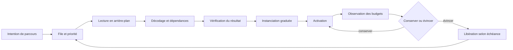
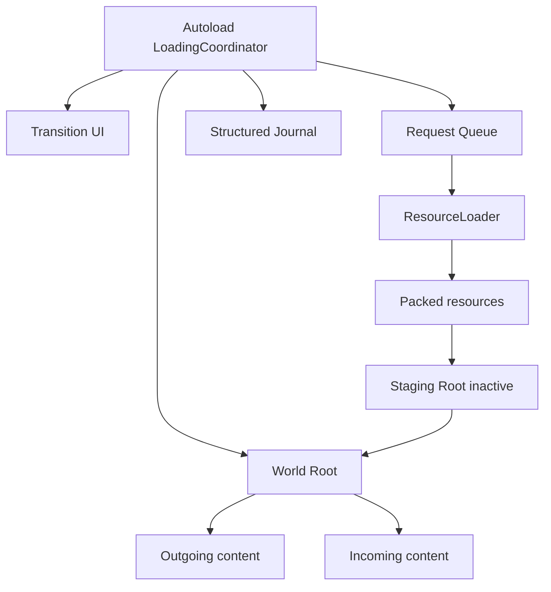

# Chargements, streaming et gestion des ressources

> **Repères d’utilisation :** **[PS]** PowerShell 7, **[VSC]** Visual Studio Code, **[APP]** application graphique nommée, **[SORTIE]** résultat à lire sans le saisir, **[LECTURE]** exemple ou structure de référence. Voir la [convention complète](../Volume-0/annexes/CONVENTION-OUTILS-ET-CONTEXTES.md).

## 1. Rôle du chapitre

Un chargement fiable transforme une attente opaque en opération gouvernée : la demande possède une source, une priorité, un état, un budget, une progression, une issue et une stratégie de repli. Le streaming étend cette discipline aux ressources et zones qui entrent et sortent pendant une session.

Le chapitre 8 conserve les budgets RAM/VRAM, les rétentions, les caches génériques et les tests de longue durée. Le présent chapitre possède le gestionnaire de chargement, les profils de streaming, les scènes de transition, les tests de disque lent et les rapports de temps de chargement. Le chapitre 10 conservera l’optimisation des fréquences de mise à jour, des scripts et des systèmes déjà actifs.

La règle centrale est la suivante : déplacer une lecture vers un thread ne suffit pas. Une solution acceptable doit éviter les blocages excessifs, afficher une progression honnête, respecter les budgets mémoire, traiter annulation et erreur, puis préserver la cohérence fonctionnelle lors de l’activation.

## 2. Résultats d’apprentissage

À la fin du chapitre, le lecteur saura :

- distinguer demande, lecture, décodage, instanciation, activation et éviction ;
- choisir entre `preload()`, `load()`, chargement fileté et chargement applicatif par lots ;
- utiliser `ResourceLoader.load_threaded_request()` sans bloquer prématurément avec `load_threaded_get()` ;
- agréger une progression multi-ressources sans promettre une durée exacte ;
- construire une file bornée avec priorités, concurrence et équité déclarées ;
- organiser une scène de transition persistante ;
- découper zones et chunks sans redéfinir le monde ouvert du Livre III ;
- appliquer préchargement, hystérésis et éviction selon les budgets du chapitre 8 ;
- gérer l’annulation logique lorsqu’une opération sous-jacente ne peut pas être interrompue ;
- distinguer échec transitoire, contenu manquant, incompatibilité et annulation ;
- préparer des tests de stockage lent, de parcours prolongé et de reprise ;
- organiser le travail en modes Solo et Studio ;
- refuser une amélioration fondée sur une seule transition chaude.

## 3. Niveau de preuve et réserves

Le chapitre est accepté au niveau `static-review`. Les contrats, structures, extraits GDScript, scripts Python et procédures sont relus statiquement. Aucun gestionnaire runtime, profil de streaming, test de stockage, parcours prolongé ou gain de chargement de `Project Asteria` n’est revendiqué comme produit.
> **[LECTURE] État de preuve du chapitre — Ne pas saisir.**

```yaml
evidence_level:
  chapter: static_review
  loading_manager_materialized: false
  streaming_profiles_qualified: false
  transition_scenes_materialized: false
  slow_storage_test_executed: false
  traversal_test_executed: false
  loading_report_created: false
  functional_regression_suite_executed: false
  runtime_improvement_claimed: false
```

<!-- qa:code-explanation -->

**Explication structurée du bloc :**

- **Statut :** `static_review` décrit une revue documentaire, pas une exécution de chargement.
- **Séparation :** gestionnaire, profils, transitions, tests et rapport possèdent des indicateurs indépendants.
- **Régression :** la correction fonctionnelle reste une porte distincte du temps de chargement.
- **Limite :** une validation future exigera builds, stockage, séries, captures, erreurs et décisions conservés.
## 4. Prérequis et frontières

Le lecteur doit connaître les portes qualité du chapitre 2, les tests fonctionnels du chapitre 3, la journalisation du chapitre 5, le profilage CPU du chapitre 6 et les budgets mémoire du chapitre 8.

Le présent chapitre possède :

- la file de demandes et ses priorités ;
- le chargement en arrière-plan ;
- les scènes de transition ;
- la progression visible ;
- les profils de zones et de chunks ;
- les règles de préchargement et d’éviction liées au parcours ;
- les erreurs, reprises et annulations ;
- les rapports de temps de chargement.

Le Livre III conserve la conception du monde, ses zones, ses assets et leur production. Le chapitre 8 conserve l’attribution des fuites et la politique mémoire générale. Le chapitre 10 conservera le coût des nœuds et systèmes après activation.

> **Frontière essentielle :** un chargement terminé ne signifie pas qu’une scène peut être activée sans coût. L’instanciation, l’ajout à l’arbre, les notifications, les shaders, la physique et l’initialisation gameplay peuvent encore créer un pic sur le thread principal.

## 5. Vocabulaire opérationnel

- **Demande :** intention de rendre une ressource disponible pour une échéance donnée.
- **Lecture :** transfert des octets depuis le stockage ou le paquet exporté.
- **Décodage :** transformation des octets en données exploitables.
- **Dépendance :** ressource requise directement ou indirectement par une autre ressource.
- **Instanciation :** création de nœuds depuis une `PackedScene`.
- **Activation :** insertion dans le contexte actif et démarrage des systèmes associés.
- **Préchargement :** chargement anticipé avant l’échéance fonctionnelle.
- **Streaming :** entrée et sortie progressive de contenu pendant la session.
- **Chunk :** unité versionnée de chargement, activation et éviction.
- **Zone :** regroupement fonctionnel ou spatial de chunks.
- **Priorité :** ordre relatif de traitement déterminé par l’échéance et la criticité.
- **Hystérésis :** seuils distincts d’entrée et de sortie qui évitent les oscillations.
- **Éviction :** retrait d’une ressource ou d’une instance lorsque sa conservation n’est plus justifiée.
- **Progression :** estimation bornée de l’avancement, pas une promesse de durée.
- **Annulation logique :** décision d’ignorer ou de ne pas activer un résultat devenu inutile.
- **Chargement chaud :** opération aidée par les caches déjà remplis.
- **Chargement froid :** opération exécutée sans supposer la présence préalable des données dans les caches pertinents.
- **Blocage :** attente qui empêche le thread principal de produire une frame ou de répondre.
- **Budget de transition :** limites de durée, mémoire, concurrence et activation pour une famille de parcours.

## 6. Modèle de décision
> **[LECTURE] Cycle de chargement et de streaming — Ne pas exécuter.**



<!-- qa:code-explanation -->

**Explication structurée du bloc :**

- **Entrée :** une intention de parcours produit une demande nommée et priorisée.
- **Séparation :** lecture, instanciation et activation restent des phases distinctes.
- **Budget :** la mémoire et la cadence sont observées avant conservation.
- **Boucle :** l’éviction libère une capacité pour les demandes suivantes.
## 7. États d’une opération

Un gestionnaire n’utilise pas un booléen `loading`. Il conserve des états capables de distinguer attente, travail, succès, erreur, annulation et activation.
> **[LECTURE] Taxonomie d’états — Ne pas saisir.**

```yaml
loading_states:
  queued:
    resource_requested: true
    background_work_started: false
  loading:
    resource_requested: true
    background_work_started: true
  loaded:
    resource_available: true
    instantiated: false
  staging:
    resource_available: true
    instantiated: partial_or_complete
    active: false
  active:
    resource_available: true
    active: true
  failed:
    terminal: true
    retry_policy_applies: true
  cancelled:
    terminal_for_consumer: true
    underlying_work_may_finish: true
  evicted:
    active: false
    references_released: verified
```

<!-- qa:code-explanation -->

**Explication structurée du bloc :**

- **Précision :** `loaded` ne confond pas disponibilité et activation.
- **Annulation :** le consommateur peut abandonner même si un travail sous-jacent finit plus tard.
- **Échec :** la politique de reprise dépend de la catégorie d’erreur.
- **Éviction :** le statut exige la vérification des références libérées.
## 8. Budgets de chargement

Les budgets sont définis par plateforme et parcours. Ils séparent délai avant interaction, blocage maximal du thread principal, mémoire transitoire, concurrence et échéance d’activation. Les valeurs restent à qualifier.
> **[VSC] Visual Studio Code — Créer `config/streaming/loading_budgets.yaml`.**

```yaml
schema_version: 1
loading_budgets:
  windows_reference:
    transition:
      first_feedback_ms: pending_qualification
      main_thread_block_p95_ms: pending_qualification
      interactive_ready_p95_ms: pending_qualification
      complete_ready_p95_ms: pending_qualification
    streaming:
      concurrent_requests_max: 2
      activation_budget_ms_per_frame: pending_qualification
      temporary_ram_mib: pending_qualification
      temporary_vram_mib: pending_qualification
    quality_gates:
      progress_never_regresses: true
      cancellation_supported: true
      functional_suite_required: true
      memory_budget_required: true
```

<!-- qa:code-explanation -->

**Explication structurée du bloc :**

- **Plateforme :** les cibles sont rattachées au poste Windows de référence.
- **Phases :** premier retour, interaction et complétude sont mesurés séparément.
- **Concurrence :** la file ne soumet pas un nombre illimité de demandes.
- **Porte :** progression, annulation, fonctionnel et mémoire doivent être satisfaits ensemble.
## 9. Manifeste d’environnement

Un temps de chargement dépend du build, du stockage, de l’état des caches, du système, du mode d’export et du contenu exact. Une comparaison non qualifiée peut attribuer à tort un écart au code.
> **[VSC] Visual Studio Code — Créer `reports/loading/environment-manifest.yaml`.**

```yaml
schema_version: 1
run:
  id: AST-LOAD-RUN-PENDING
  build_commit: pending
  export_preset: windows_desktop
  engine: Godot_4.7.1_stable
  os: Windows_11_64_bit
  cpu: AMD_Ryzen_7_2700
  ram_gib: 32
  gpu: AMD_Radeon_RX_6750_XT_12_Go
  storage:
    model: pending
    interface: pending
    filesystem: pending
    free_space_gib: pending
  cache_condition:
    process_restart: required
    os_cache_state: recorded
    warm_or_cold: recorded
  renderer: Forward_plus
  resolution: recorded
  background_tasks: recorded
  power_profile: recorded
```

<!-- qa:code-explanation -->

**Explication structurée du bloc :**

- **Build :** le commit et le preset empêchent de comparer des contenus différents.
- **Stockage :** modèle, interface, système de fichiers et espace libre sont conservés.
- **Caches :** chaud ou froid est une condition de campagne, pas une impression.
- **Contexte :** tâches de fond et profil d’alimentation peuvent modifier les durées.
## 10. Architecture persistante de transition

Une transition robuste conserve un petit noyau persistant : coordination, interface, journal et racine de monde. Le contenu lourd est chargé puis activé sous cette racine. Cette architecture évite de demander à la scène sortante de survivre à sa propre suppression.
> **[LECTURE] Architecture de transition — Ne pas exécuter.**



<!-- qa:code-explanation -->

**Explication structurée du bloc :**

- **Persistance :** le coordinateur et l’interface ne dépendent pas de la scène remplacée.
- **Staging :** le contenu entrant peut être préparé avant activation.
- **Traçabilité :** la file et le journal partagent un identifiant de demande.
- **Frontière :** la racine de monde ne transforme pas le streaming en conception du monde ouvert.
## 11. Contrat d’une demande

Chaque demande porte son chemin, son type, sa priorité, son échéance, son consommateur et sa politique de cache. Une chaîne de chemin isolée ne suffit pas à gouverner la concurrence ou l’annulation.
> **[VSC] Visual Studio Code — Créer `config/streaming/loading-request.schema.yaml`.**

```yaml
schema_version: 1
loading_request:
  request_id: required_uuid_or_local_id
  resource_path: required_res_path
  type_hint: optional_resource_type
  consumer:
    owner_id: required
    activation_scope: transition_or_chunk_or_ui
  priority:
    class: critical_or_visible_soon_or_background
    deadline_usec: optional_monotonic
    sequence: required_monotonic
  cache_mode: reuse_or_ignore_or_replace
  use_sub_threads: false_by_default
  cancellation:
    token_id: required
    activation_after_cancel: forbidden
  retry_policy_id: required
  observability:
    correlation_id: required
    text_payloads: forbidden_by_default
```

<!-- qa:code-explanation -->

**Explication structurée du bloc :**

- **Identité :** la demande, le consommateur et la corrélation sont distincts.
- **Ordre :** classe, échéance et séquence permettent une file stable.
- **Cache :** le mode choisi appartient au contrat et non à un appel implicite.
- **Annulation :** un résultat annulé ne peut pas être activé.
## 12. Catalogue de ressources

Le catalogue relie les identifiants fonctionnels aux chemins, dépendances attendues, poids de progression, groupe mémoire et stratégie d’activation. Il évite de disperser des chemins littéraux dans le gameplay.
> **[VSC] Visual Studio Code — Créer `config/streaming/resource-catalog.yaml`.**

```yaml
schema_version: 1
resources:
  asteria_hub:
    path: res://world/hub/hub.tscn
    type_hint: PackedScene
    progress_weight: 8.0
    memory_group: world_hub
    activation: replace_world_content
    dependencies_reviewed: false
  asteria_hub_audio:
    path: res://audio/banks/hub_audio.tres
    type_hint: Resource
    progress_weight: 2.0
    memory_group: hub_audio
    activation: register_audio_bank
    dependencies_reviewed: false
  common_ui:
    path: res://ui/common/common_ui.tscn
    type_hint: PackedScene
    progress_weight: 1.0
    memory_group: persistent_ui
    activation: persistent_once
    dependencies_reviewed: false
```

<!-- qa:code-explanation -->

**Explication structurée du bloc :**

- **Indirection :** le gameplay utilise un identifiant stable et non un chemin dispersé.
- **Progression :** les poids expriment un ordre de grandeur déclaré, pas une durée garantie.
- **Mémoire :** chaque entrée rejoint un groupe suivi par le chapitre 8.
- **Revue :** les dépendances doivent être inspectées avant qualification.
## 13. Gestionnaire minimal de chargement fileté

`ResourceLoader.load_threaded_request()` démarre une demande. Le gestionnaire conserve l’état et ne récupère la ressource qu’après `THREAD_LOAD_LOADED`. L’appel à `load_threaded_get()` avant cet état pourrait bloquer le thread appelant.
> **[VSC] Visual Studio Code — Créer `scripts/streaming/loading_manager.gd`.**

```gdscript
class_name LoadingManager
extends Node

signal request_progress(request_id: StringName, ratio: float)
signal request_loaded(request_id: StringName, resource: Resource)
signal request_failed(request_id: StringName, code: int)

var _requests: Dictionary = {}

func submit(request_id: StringName, path: String,
        type_hint: String = "", use_sub_threads := false,
        cache_mode := ResourceLoader.CACHE_MODE_REUSE) -> Error:
    if _requests.has(request_id):
        return ERR_ALREADY_EXISTS
    if not ResourceLoader.exists(path, type_hint):
        return ERR_FILE_NOT_FOUND

    var error := ResourceLoader.load_threaded_request(
        path, type_hint, use_sub_threads, cache_mode
    )
    if error != OK:
        return error

    _requests[request_id] = {
        "path": path,
        "cancelled": false,
        "last_progress": 0.0,
    }
    return OK

func cancel(request_id: StringName) -> void:
    if _requests.has(request_id):
        _requests[request_id]["cancelled"] = true
```

<!-- qa:code-explanation -->

**Explication structurée du bloc :**

- **Précondition :** le chemin et le type sont vérifiés avant soumission.
- **Unicité :** un identifiant ne peut pas représenter deux opérations simultanées.
- **Concurrence :** `use_sub_threads` reste faux par défaut et doit être qualifié.
- **Annulation :** le drapeau est logique ; il ne prétend pas interrompre le chargeur interne.
## 14. Interroger l’état sur plusieurs frames

Le statut est interrogé dans `_process()` ou une cadence équivalente. Une boucle serrée qui attend le résultat annule le bénéfice du chargement en arrière-plan et peut figer l’interface.
> **[VSC] Visual Studio Code — Compléter `loading_manager.gd` avec le polling non bloquant.**

```gdscript
func _process(_delta: float) -> void:
    for request_id in _requests.keys():
        var entry: Dictionary = _requests[request_id]
        var progress: Array = []
        var status := ResourceLoader.load_threaded_get_status(
            entry["path"], progress
        )

        if status == ResourceLoader.THREAD_LOAD_IN_PROGRESS:
            var ratio := 0.0
            if progress.size() == 1:
                ratio = clampf(float(progress[0]), 0.0, 1.0)
            ratio = maxf(ratio, float(entry["last_progress"]))
            entry["last_progress"] = ratio
            request_progress.emit(request_id, ratio)
            continue

        if status == ResourceLoader.THREAD_LOAD_LOADED:
            var resource := ResourceLoader.load_threaded_get(entry["path"])
            _requests.erase(request_id)
            if not bool(entry["cancelled"]):
                request_loaded.emit(request_id, resource)
            continue

        _requests.erase(request_id)
        request_failed.emit(request_id, status)
```

<!-- qa:code-explanation -->

**Explication structurée du bloc :**

- **Cadence :** le statut est lu sur des frames différentes au lieu d’une attente active.
- **Monotonie :** la progression visible ne régresse pas à cause d’une estimation intermédiaire.
- **Récupération :** `load_threaded_get()` n’est appelé qu’après l’état chargé.
- **Annulation :** le résultat peut finir mais n’est pas remis au consommateur annulé.
## 15. Agréger plusieurs ressources

La progression d’une transition regroupe plusieurs demandes. Une moyenne simple surpondère les petits fichiers. Une somme pondérée est plus utile, tout en restant une estimation : les poids doivent être versionnés et la phase d’activation reste séparée.
> **[VSC] Visual Studio Code — Agréger la progression par poids déclarés.**

```gdscript
func weighted_progress(items: Array[Dictionary]) -> float:
    var completed_weight := 0.0
    var total_weight := 0.0

    for item in items:
        var weight := maxf(float(item.get("weight", 0.0)), 0.0)
        var ratio := clampf(float(item.get("ratio", 0.0)), 0.0, 1.0)
        total_weight += weight
        completed_weight += weight * ratio

    if total_weight <= 0.0:
        return 0.0
    return completed_weight / total_weight

func transition_progress(load_ratio: float,
        staging_ratio: float, activation_ratio: float) -> float:
    return (
        clampf(load_ratio, 0.0, 1.0) * 0.75
        + clampf(staging_ratio, 0.0, 1.0) * 0.15
        + clampf(activation_ratio, 0.0, 1.0) * 0.10
    )
```

<!-- qa:code-explanation -->

**Explication structurée du bloc :**

- **Poids :** chaque ressource contribue selon un poids explicite.
- **Sécurité :** poids négatifs et ratios hors plage sont neutralisés.
- **Phases :** chargement, staging et activation ne sont pas confondus.
- **Limite :** les coefficients décrivent l’interface, pas une estimation fiable du temps restant.
## 16. Priorités, concurrence et équité

`ResourceLoader` ne fournit pas une file métier complète. L’application décide quelles demandes soumettre et limite le nombre d’opérations simultanées. Une priorité absolue sans vieillissement peut affamer les tâches de fond.
> **[VSC] Visual Studio Code — Créer `config/streaming/request-queue.yaml`.**

```yaml
schema_version: 1
request_queue:
  concurrency:
    maximum_in_flight: 2
    use_sub_threads_default: false
  classes:
    critical:
      base_rank: 0
      examples: [current_transition_blocker]
    visible_soon:
      base_rank: 100
      examples: [adjacent_chunk, next_ui_panel]
    background:
      base_rank: 200
      examples: [distant_prefetch]
  ordering:
    keys:
      - effective_rank
      - deadline_usec
      - sequence
    aging:
      enabled: true
      rank_improvement_per_second: 1
      maximum_improvement: 50
  admission:
    memory_budget_check: required
    duplicate_path_coalescing: required
```

<!-- qa:code-explanation -->

**Explication structurée du bloc :**

- **Concurrence :** deux demandes simultanées constituent une limite à qualifier.
- **Équité :** le vieillissement réduit le risque de famine des tâches de fond.
- **Stabilité :** la séquence départage les demandes équivalentes.
- **Admission :** la file consulte le budget mémoire et regroupe les chemins identiques.
## 17. Annulation logique et consommateur disparu

Une demande peut devenir inutile lorsque le joueur change de destination, ferme un écran ou revient au menu. En l’absence d’une interruption garantie du chargement sous-jacent, l’annulation porte sur la livraison, l’instanciation et l’activation.
> **[VSC] Visual Studio Code — Vérifier le jeton avant chaque phase consommatrice.**

```gdscript
class_name LoadingToken
extends RefCounted

var cancelled := false
var reason: StringName = &""

func cancel(cancel_reason: StringName) -> void:
    cancelled = true
    reason = cancel_reason

func deliver_if_current(token: LoadingToken,
        resource: Resource, consumer: Callable) -> Error:
    if token == null or token.cancelled:
        return ERR_SKIP
    if not consumer.is_valid():
        return ERR_INVALID_PARAMETER
    consumer.call(resource)
    return OK

func instantiate_if_current(token: LoadingToken,
        scene: PackedScene) -> Node:
    if token == null or token.cancelled or scene == null:
        return null
    return scene.instantiate()
```

<!-- qa:code-explanation -->

**Explication structurée du bloc :**

- **Portée :** le jeton accompagne la demande jusqu’à l’activation.
- **Livraison :** un consommateur invalide ou annulé ne reçoit pas le résultat.
- **Instanciation :** aucun nœud inutile n’est créé après annulation.
- **Limite :** la fin du travail de fond doit encore être observée et journalisée.
## 18. Catégories d’erreur et reprises

Toutes les erreurs ne sont pas rejouables. Un fichier absent ou une incompatibilité de contenu exige une correction, tandis qu’un stockage temporairement indisponible peut autoriser une reprise bornée.
> **[VSC] Visual Studio Code — Créer `config/streaming/retry-policies.yaml`.**

```yaml
schema_version: 1
retry_policies:
  default:
    maximum_attempts: 2
    backoff_ms: [250, 1000]
    jitter_ms: 50
  categories:
    missing_resource:
      retry: false
      severity: blocking_content_error
    invalid_type:
      retry: false
      severity: blocking_contract_error
    load_failed:
      retry: true
      policy: default
    cancelled:
      retry: false
      severity: informational
    memory_admission_refused:
      retry: true
      wait_for_eviction: true
    unknown:
      retry: false
      severity: manual_review
  fallback:
    optional_cosmetic: placeholder_allowed
    required_world_scene: safe_menu_required
```

<!-- qa:code-explanation -->

**Explication structurée du bloc :**

- **Bornes :** le nombre d’essais et les délais sont finis.
- **Catégories :** contenu absent et type invalide ne sont pas masqués par des reprises.
- **Mémoire :** un refus d’admission attend une éviction au lieu de forcer le chargement.
- **Repli :** le contenu requis et le cosmétique n’ont pas la même politique.
## 19. Inspecter les dépendances

`ResourceLoader.get_dependencies()` aide à inventorier les dépendances déclarées d’une ressource. Le résultat peut contenir un UID et un chemin de repli séparés par `::`. L’inventaire est un signal de préparation, pas une mesure du coût runtime.
> **[VSC] Visual Studio Code — Inventorier les dépendances d’un catalogue.**

```gdscript
func dependency_paths(resource_path: String) -> PackedStringArray:
    var result := PackedStringArray()
    for dependency in ResourceLoader.get_dependencies(resource_path):
        var text := String(dependency)
        var fallback_path := text
        if text.contains("::"):
            fallback_path = text.get_slice("::", 2)
        if fallback_path.begins_with("res://"):
            result.push_back(fallback_path)
    result.sort()
    return result

func dependency_report(resource_path: String) -> Dictionary:
    return {
        "resource_path": resource_path,
        "dependencies": dependency_paths(resource_path),
        "resource_uid": ResourceLoader.get_resource_uid(resource_path),
        "cached_at_report_time": ResourceLoader.has_cached(resource_path),
    }
```

<!-- qa:code-explanation -->

**Explication structurée du bloc :**

- **Format :** l’UID éventuel et le chemin de repli ne sont pas confondus.
- **Filtre :** seuls les chemins de projet reconnus sont conservés dans cette vue.
- **Déterminisme :** le tri stabilise le rapport entre plateformes.
- **Limite :** l’état du cache est une observation ponctuelle, pas une preuve de coût.
## 20. Modes de cache

Le mode de cache détermine si la ressource et ses sous-ressources sont réutilisées, ignorées ou remplacées. Il doit être choisi avec la politique de durée de vie du chapitre 8. Changer de mode pour « forcer » un résultat sans mesurer peut multiplier les instances ou invalider des références partagées.
> **[LECTURE] Matrice de modes de cache — Ne pas saisir.**

```yaml
resource_cache_modes:
  reuse:
    constant: CACHE_MODE_REUSE
    intention: use_cached_instances_when_available
    common_case: normal_runtime_loading
  ignore:
    constant: CACHE_MODE_IGNORE
    intention: bypass_main_resource_and_subresource_cache
    dependencies: reuse
    common_case: controlled_diagnostic_only
  replace:
    constant: CACHE_MODE_REPLACE
    intention: refresh_compatible_cached_instances
    common_case: controlled_reload_workflow
  deep_modes:
    constants:
      - CACHE_MODE_IGNORE_DEEP
      - CACHE_MODE_REPLACE_DEEP
    intention: propagate_policy_through_dependencies
    review_required: true
  decision:
    ownership_review: required
    memory_comparison: required
    compatibility_tests: required
```

<!-- qa:code-explanation -->

**Explication structurée du bloc :**

- **Défaut :** la réutilisation convient au chargement runtime ordinaire.
- **Portée :** le mode `IGNORE` simple ne propage pas automatiquement l’ignorance aux dépendances.
- **Remplacement :** une actualisation contrôlée peut modifier des instances déjà partagées.
- **Porte :** propriété, mémoire et compatibilité précèdent tout changement de mode.
## 21. Choisir `preload`, `load` ou le chargement fileté

Le choix dépend de l’échéance et du coût. `preload()` convient aux ressources petites et obligatoires connues à l’analyse du script. `load()` est synchrone. Le chargement fileté convient aux ressources dont l’attente doit être répartie sur plusieurs frames.
> **[LECTURE] Matrice de choix — Ne pas exécuter.**

```yaml
loading_choice:
  preload:
    path_known_at_parse_time: required
    startup_cost_acceptable: required
    use_for:
      - small_persistent_ui
      - mandatory_shared_icons
  synchronous_load:
    main_thread_blocking: true
    use_for:
      - editor_tools
      - tiny_runtime_resource_after_measurement
  threaded_request:
    poll_across_frames: required
    get_only_after_loaded: required
    use_for:
      - level_scene
      - large_resource_group
      - visible_soon_chunk
  custom_worker_task:
    scene_tree_access: forbidden
    completion_join_required: true
    use_for:
      - project_specific_data_transform_after_thread_safety_review
```

<!-- qa:code-explanation -->

**Explication structurée du bloc :**

- **Échéance :** `preload()` engage le coût avant l’usage runtime ciblé.
- **Blocage :** `load()` reste acceptable seulement après mesure et pour un coût borné.
- **Fileté :** le statut doit être interrogé avant récupération.
- **Threads :** les tâches personnalisées ne manipulent pas l’arbre de scène actif.
## 22. Scène de transition

La scène de transition reste légère, autonome et accessible. Elle ne charge pas elle-même une copie du monde sortant ou entrant. Elle expose un état lisible, une progression, une action d’annulation lorsque permise et une erreur exploitable.
> **[LECTURE] Structure de scène de transition — Ne pas saisir.**

```text
LoadingTransition
├── Background
├── StatusPanel
│   ├── Title
│   ├── Detail
│   ├── ProgressBar
│   └── IndeterminateIndicator
├── Actions
│   ├── CancelButton
│   ├── RetryButton
│   └── ReturnToSafeMenuButton
├── AccessibilityAnnouncer
└── DebugOverlay [development_only]
```

<!-- qa:code-explanation -->

**Explication structurée du bloc :**

- **Légèreté :** la transition ne dépend pas du contenu lourd qu’elle surveille.
- **États :** progression déterminée et indicateur indéterminé sont séparés.
- **Actions :** annuler, reprendre ou rejoindre un menu sûr dépendent de la politique.
- **Accessibilité :** les changements importants sont annoncés sans exiger la lecture d’une barre.
## 23. Changer de scène avec une ressource déjà chargée

Une fois la `PackedScene` disponible, `SceneTree.change_scene_to_packed()` permet de demander le changement. Le code vérifie le type et le code d’erreur. Pour un streaming sous racine persistante, une activation personnalisée peut être préférable.
> **[VSC] Visual Studio Code — Changer de scène après chargement validé.**

```gdscript
func activate_main_scene(resource: Resource) -> Error:
    var packed := resource as PackedScene
    if packed == null:
        return ERR_INVALID_DATA

    var error := get_tree().change_scene_to_packed(packed)
    if error != OK:
        push_error(
            "Échec du changement de scène, code=%s" % error
        )
        return error

    return OK
```

<!-- qa:code-explanation -->

**Explication structurée du bloc :**

- **Type :** une ressource quelconque n’est pas supposée être une scène.
- **Résultat :** le code d’erreur du changement est conservé.
- **Thread :** l’appel s’exécute sur le thread principal.
- **Frontière :** cette méthode remplace la scène principale ; le streaming partiel utilise une racine dédiée.
## 24. Instanciation graduée sous une racine persistante

Le chargement des octets peut finir en arrière-plan, mais l’instanciation et l’ajout à l’arbre peuvent produire des pics. Une stratégie graduée prépare une instance inactive, initialise des sous-systèmes par étapes, puis bascule la visibilité et les entrées à une frontière explicite.
> **[VSC] Visual Studio Code — Préparer et activer une scène sous `WorldRoot`.**

```gdscript
func stage_scene(packed: PackedScene, staging_root: Node) -> Node:
    if packed == null or staging_root == null:
        return null
    var instance := packed.instantiate()
    instance.process_mode = Node.PROCESS_MODE_DISABLED
    staging_root.add_child(instance)
    return instance

func activate_staged_scene(instance: Node,
        world_root: Node, outgoing: Node) -> Error:
    if instance == null or world_root == null:
        return ERR_INVALID_PARAMETER

    instance.reparent(world_root)
    instance.process_mode = Node.PROCESS_MODE_INHERIT
    if instance is CanvasItem:
        (instance as CanvasItem).visible = true

    if is_instance_valid(outgoing):
        outgoing.queue_free()
    return OK
```

<!-- qa:code-explanation -->

**Explication structurée du bloc :**

- **Staging :** l’instance commence avec le traitement désactivé.
- **Activation :** le déplacement sous la racine active est explicite.
- **Sortie :** l’ancien contenu reçoit une fin de vie déclarée.
- **Adaptation :** la visibilité doit être gérée par type et contrat ; l’extrait reste à adapter aux scènes 3D et non visuelles.
## 25. Zones et chunks

Le plan du monde appartient au Livre III. Ici, une zone devient un contrat de chargement : identifiant, ressources, voisinage, seuils, priorité, coût estimé et échéances. Les chunks trop petits augmentent les demandes ; les chunks trop grands augmentent les pics.
> **[VSC] Visual Studio Code — Créer `config/streaming/world-streaming-profile.yaml`.**

```yaml
schema_version: 1
streaming_profile:
  id: asteria_world_reference_v1
  zones:
    hub:
      center: [0.0, 0.0, 0.0]
      enter_radius_m: 220.0
      exit_radius_m: 260.0
      adjacent: [market, docks]
      chunks:
        - hub_geometry
        - hub_gameplay
        - hub_audio
    market:
      center: [320.0, 0.0, 40.0]
      enter_radius_m: 180.0
      exit_radius_m: 230.0
      adjacent: [hub]
      chunks:
        - market_geometry
        - market_gameplay
  chunks:
    hub_geometry:
      resource_id: asteria_hub
      priority_class: visible_soon
      memory_group: world_hub
      estimated_ram_mib: pending_measurement
      estimated_vram_mib: pending_measurement
      activation_group: geometry
```

<!-- qa:code-explanation -->

**Explication structurée du bloc :**

- **Hystérésis :** le rayon de sortie dépasse le rayon d’entrée.
- **Voisinage :** les zones adjacentes soutiennent le préchargement.
- **Découpage :** géométrie, gameplay et audio peuvent avoir des échéances distinctes.
- **Budget :** les estimations restent à confronter aux séries du chapitre 8.
## 26. Hystérésis d’activation

Deux seuils évitent de charger et évincer à répétition près d’une frontière. L’état courant participe à la décision ; une distance unique ne suffit pas.
> **[VSC] Visual Studio Code — Calculer l’état désiré avec hystérésis.**

```gdscript
enum ZoneState {
    UNLOADED,
    PREFETCHED,
    ACTIVE,
}

func desired_zone_state(distance_m: float,
        current: ZoneState, enter_m: float,
        exit_m: float, prefetch_m: float) -> ZoneState:
    if exit_m <= enter_m or prefetch_m <= exit_m:
        push_error("Seuils de streaming invalides")
        return current

    if current == ZoneState.ACTIVE:
        return (
            ZoneState.PREFETCHED
            if distance_m > exit_m
            else ZoneState.ACTIVE
        )

    if distance_m <= enter_m:
        return ZoneState.ACTIVE
    if distance_m <= prefetch_m:
        return ZoneState.PREFETCHED
    return ZoneState.UNLOADED
```

<!-- qa:code-explanation -->

**Explication structurée du bloc :**

- **Validation :** les seuils doivent respecter `entrée < sortie < préchargement`.
- **Mémoire d’état :** une zone active n’est pas retirée dès le franchissement du seuil d’entrée.
- **Préchargement :** l’état intermédiaire réserve les ressources avant activation.
- **Mesure :** les distances doivent être qualifiées par vitesse, stockage et budget.
## 27. Préchargement prédictif

La distance seule réagit tardivement à un déplacement rapide. Une prédiction prudente utilise direction, vitesse, itinéraire connu et probabilité, mais conserve un plafond de coût. Une prédiction incertaine ne doit pas évincer le contenu actuellement utile.
> **[VSC] Visual Studio Code — Définir la politique de préchargement prédictif.**

```yaml
schema_version: 1
predictive_prefetch:
  horizon_seconds: 4.0
  inputs:
    velocity: required
    navigation_route: optional
    camera_forward: optional
    recent_zone_sequence: optional
  candidate_score:
    distance_weight: 0.40
    direction_weight: 0.25
    route_weight: 0.25
    recency_weight: 0.10
  admission:
    maximum_candidates: 2
    minimum_score: pending_qualification
    ram_budget_check: required
    vram_budget_check: required
    current_zone_protected: true
  fallback:
    use_adjacency_only: true
```

<!-- qa:code-explanation -->

**Explication structurée du bloc :**

- **Horizon :** la prédiction reste courte et versionnée.
- **Score :** les signaux sont combinés sans devenir une certitude.
- **Admission :** le nombre de candidats et les budgets sont bornés.
- **Repli :** le voisinage statique reste disponible si la prédiction n’est pas fiable.
## 28. Politique d’éviction

L’éviction dépend de l’utilité future, du coût de reconstruction, du poids mémoire et de la protection fonctionnelle. Une stratégie LRU pure peut retirer une ressource coûteuse juste avant sa réutilisation.
> **[VSC] Visual Studio Code — Créer `config/streaming/eviction-policy.yaml`.**

```yaml
schema_version: 1
eviction:
  protected:
    - current_zone
    - transition_ui
    - active_save_dependencies
  score:
    age_seconds_weight: 0.30
    distance_weight: 0.25
    memory_weight: 0.25
    reload_cost_weight: -0.20
  thresholds:
    soft_budget:
      action: evict_background_candidates
    hard_budget:
      action: block_new_admission_then_evict
  order:
    - cancel_not_started_requests
    - release_staged_cancelled_instances
    - evict_background_chunks
    - evict_prefetched_zones
  verification:
    strong_references_reviewed: true
    cache_rebuild_time_measured: true
    functional_owners_notified: true
```

<!-- qa:code-explanation -->

**Explication structurée du bloc :**

- **Protection :** la zone active et les dépendances de sauvegarde ne sont pas candidates.
- **Coût :** une ressource chère à reconstruire reçoit une pénalité d’éviction.
- **Ordre :** les demandes inutiles sont retirées avant le contenu utile.
- **Vérification :** libérer une entrée de registre ne prouve pas la disparition de toutes les références.
## 29. Intégrer les budgets mémoire

La file consulte les limites du chapitre 8 avant de soumettre ou d’activer. Elle n’invente pas un budget propre. Une demande peut être différée, dégradée ou refusée selon son caractère obligatoire.
> **[LECTURE] Contrat d’admission mémoire — Ne pas saisir.**

```yaml
streaming_memory_admission:
  request:
    request_id: required
    estimated_ram_mib: measured_or_reviewed_estimate
    estimated_vram_mib: measured_or_reviewed_estimate
    required_for_progression: boolean
  current:
    ram_used_mib: measured
    vram_used_mib: measured
    staged_ram_mib: measured
    staged_vram_mib: measured
  decision:
    under_soft_limits: admit
    over_soft_limit:
      optional: defer_and_evict
      required: evict_then_review
    over_hard_limit:
      optional: reject
      required: safe_transition_or_lower_profile
  evidence:
    budget_version: required
    measurement_timestamp: required
    decision_owner: required
```

<!-- qa:code-explanation -->

**Explication structurée du bloc :**

- **Héritage :** les limites proviennent du budget mémoire versionné.
- **Staging :** les ressources préparées mais non actives sont comptées.
- **Criticité :** une ressource obligatoire déclenche une transition sûre plutôt qu’un dépassement silencieux.
- **Preuve :** version, mesure et propriétaire accompagnent la décision.
## 30. Test de stockage lent

Un test utile sépare stockage froid, stockage chaud et contention contrôlée. Il conserve le matériel et la méthode. Une temporisation artificielle dans l’interface ne reproduit pas un disque lent.
> **[VSC] Visual Studio Code — Créer `config/streaming/slow-storage-test.yaml`.**

```yaml
schema_version: 1
slow_storage_test:
  id: AST-LOAD-SLOW-001
  build: exported_windows_reference
  scenarios:
    - id: cold_start_to_hub
      cache_condition: cold_or_recorded_best_effort
      repetitions: 10
    - id: warm_return_to_hub
      cache_condition: warm
      repetitions: 10
    - id: traversal_hub_market
      cache_condition: recorded
      repetitions: 20
  storage_condition:
    method: native_slow_device_or_lab_throttle
    tool_and_version: pending
    throughput_limit_mib_s: recorded_if_applied
    latency_ms: recorded_if_applied
  collected:
    - request_to_first_progress_ms
    - request_to_loaded_ms
    - loaded_to_interactive_ms
    - main_thread_block_ms
    - retry_count
    - cancellation_result
  invalidation:
    background_update_detected: invalidate_run
    build_changed: new_campaign
    unknown_cache_condition: retain_with_warning
```

<!-- qa:code-explanation -->

**Explication structurée du bloc :**

- **Scénarios :** démarrage, retour chaud et parcours sont séparés.
- **Méthode :** un appareil lent ou une limitation de laboratoire est déclaré.
- **Phases :** lecture et activation possèdent des durées distinctes.
- **Intégrité :** les runs ambigus sont conservés avec avertissement ou invalidés selon une règle préalable.
## 31. Mesurer les phases de chargement

Les horodatages monotones relient demande, premier progrès, ressource chargée, début d’activation et interaction. Le chronométrage reste borné et ne remplace pas le profiler CPU.
> **[VSC] Visual Studio Code — Collecter les jalons monotones d’une transition.**

```gdscript
class_name LoadingTimeline
extends RefCounted

var request_usec := 0
var first_progress_usec := 0
var loaded_usec := 0
var activation_start_usec := 0
var interactive_usec := 0

func mark_request() -> void:
    request_usec = Time.get_ticks_usec()

func mark_first_progress() -> void:
    if first_progress_usec == 0:
        first_progress_usec = Time.get_ticks_usec()

func mark_loaded() -> void:
    loaded_usec = Time.get_ticks_usec()

func mark_activation_start() -> void:
    activation_start_usec = Time.get_ticks_usec()

func mark_interactive() -> void:
    interactive_usec = Time.get_ticks_usec()

func durations_ms() -> Dictionary:
    return {
        "request_to_first_progress_ms":
            _delta_ms(request_usec, first_progress_usec),
        "request_to_loaded_ms":
            _delta_ms(request_usec, loaded_usec),
        "loaded_to_interactive_ms":
            _delta_ms(loaded_usec, interactive_usec),
        "activation_ms":
            _delta_ms(activation_start_usec, interactive_usec),
    }

func _delta_ms(start_usec: int, end_usec: int) -> Variant:
    if start_usec <= 0 or end_usec < start_usec:
        return null
    return float(end_usec - start_usec) / 1000.0
```

<!-- qa:code-explanation -->

**Explication structurée du bloc :**

- **Horloge :** les jalons utilisent une horloge monotone.
- **Absence :** une phase non observée produit `null` au lieu d’une durée inventée.
- **Séparation :** lecture et activation restent mesurées indépendamment.
- **Limite :** les pics internes à l’activation doivent être étudiés avec le profiler.
## 32. Schéma d’échantillons

Les données brutes conservent un enregistrement par transition ou activation. Les ratios et percentiles sont calculés après collecte. Les chemins détaillés peuvent être remplacés par des identifiants de catalogue afin d’éviter une cardinalité inutile.
> **[LECTURE] Schéma CSV du rapport de chargement — Ne pas saisir.**

```csv
run_id,scenario_id,iteration,request_id,resource_id,priority_class,cache_condition,request_to_first_progress_ms,request_to_loaded_ms,loaded_to_interactive_ms,activation_ms,main_thread_block_max_ms,retry_count,cancel_requested,cancel_honored,result_code
AST-LOAD-RUN-PENDING,cold_start_to_hub,1,REQ-PENDING,asteria_hub,critical,recorded,,,,,,,false,false,pending
```

<!-- qa:code-explanation -->

**Explication structurée du bloc :**

- **Identifiants :** le run, le scénario, l’itération et la demande permettent la reproduction.
- **Phases :** premier progrès, chargement, interaction et activation sont distincts.
- **Annulation :** demande et respect de l’annulation ne sont pas confondus.
- **Valeurs :** les cellules restent vides tant qu’aucune exécution n’existe.
## 33. Analyser les distributions

La médiane décrit le centre ; p95, p99 et maximum exposent les transitions rares. Le rapport sépare les échecs, annulations et succès au lieu de mélanger leurs durées.
> **[VSC] Visual Studio Code — Créer `tools/analyze_loading_samples.py`.**

```python
from __future__ import annotations

import csv
import math
import statistics
from pathlib import Path


def percentile(values: list[float], ratio: float) -> float:
    if not values:
        raise ValueError("Série vide")
    ordered = sorted(values)
    index = (len(ordered) - 1) * ratio
    lower = math.floor(index)
    upper = math.ceil(index)
    if lower == upper:
        return ordered[lower]
    fraction = index - lower
    return ordered[lower] * (1.0 - fraction) + ordered[upper] * fraction


def load_success_durations(path: Path, column: str) -> list[float]:
    values: list[float] = []
    with path.open("r", encoding="utf-8", newline="") as handle:
        for row in csv.DictReader(handle):
            if row["result_code"] != "success":
                continue
            raw = row[column].strip()
            if not raw:
                continue
            value = float(raw)
            if not math.isfinite(value) or value < 0.0:
                raise ValueError(f"Durée invalide: {raw}")
            values.append(value)
    if not values:
        raise ValueError("Aucune durée de succès")
    return values


def summarize(values: list[float]) -> dict[str, float]:
    return {
        "count": float(len(values)),
        "median_ms": statistics.median(values),
        "p95_ms": percentile(values, 0.95),
        "p99_ms": percentile(values, 0.99),
        "maximum_ms": max(values),
    }
```

<!-- qa:code-explanation -->

**Explication structurée du bloc :**

- **Filtre :** seuls les résultats de succès alimentent cette distribution temporelle.
- **Validation :** les valeurs vides, négatives ou non finies sont refusées.
- **Queue :** p95, p99 et maximum complètent la médiane.
- **Traçabilité :** les échecs et annulations doivent recevoir leurs propres résumés.
## 34. Progression visible et accessible

Une barre de progression ne doit pas reculer ni rester à `100 %` pendant une longue activation silencieuse. Lorsque l’estimation n’est pas disponible, l’interface annonce une phase indéterminée. Les messages évitent les fausses secondes restantes.
> **[VSC] Visual Studio Code — Créer `config/streaming/loading-ui-contract.yaml`.**

```yaml
schema_version: 1
loading_ui:
  states:
    queued:
      label: Préparation
      progress: indeterminate
    loading:
      label: Chargement
      progress: weighted_monotonic
    staging:
      label: Préparation de la scène
      progress: weighted_monotonic
    activating:
      label: Finalisation
      progress: bounded_phase
    failed:
      label: Chargement impossible
      actions: [retry_if_allowed, safe_menu]
    cancelled:
      label: Chargement annulé
      actions: [return]
  rules:
    estimated_time_remaining: hidden_without_qualified_model
    progress_regression: forbidden
    important_state_announced: true
    keyboard_navigation: required
    reduced_motion_respected: true
    minimum_display_time_ms: cosmetic_only_not_measurement
```

<!-- qa:code-explanation -->

**Explication structurée du bloc :**

- **Honnêteté :** aucun temps restant n’est affiché sans modèle qualifié.
- **Phases :** la finalisation reste visible après la lecture.
- **Accessibilité :** annonce, clavier et mouvement réduit font partie du contrat.
- **Mesure :** la durée cosmétique de l’écran n’entre pas dans le temps technique.
## 35. Passage d’état et sauvegarde

Une transition peut coïncider avec une sauvegarde, un point de contrôle ou un changement de profil. Le handoff versionne les données minimales nécessaires et interdit l’activation d’une scène incompatible avec l’état chargé.
> **[VSC] Visual Studio Code — Définir le contrat de handoff.**

```yaml
schema_version: 1
transition_handoff:
  transition_id: required
  source_scene_id: required
  target_scene_id: required
  save_schema_version: required
  player_state_snapshot:
    location_anchor: required
    inventory_revision: required
    quest_revision: required
    transient_effects: filtered
  compatibility:
    target_min_schema: recorded
    migration_required: evaluated
    content_revision: recorded
  commit_point:
    incoming_scene_staged: required
    handoff_validated: required
    outgoing_scene_release_after_commit: true
  rollback:
    preserve_previous_checkpoint: true
    safe_menu_available: true
```

<!-- qa:code-explanation -->

**Explication structurée du bloc :**

- **Version :** la scène cible connaît le schéma et la révision de contenu.
- **Minimisation :** seules les données nécessaires traversent la transition.
- **Commit :** la scène sortante n’est libérée qu’après validation du handoff.
- **Repli :** un point précédent et un menu sûr restent disponibles.
## 36. Threads et arbre de scène

Le chargement de ressources peut utiliser les mécanismes filetés du moteur. En revanche, l’arbre de scène actif n’est pas une structure à modifier librement depuis un thread arbitraire. L’instanciation, l’ajout, le retrait et l’activation doivent suivre les APIs sûres et le thread principal retenu par le projet.

Les tâches personnalisées du `WorkerThreadPool` doivent éviter l’arbre actif, protéger les données partagées et être attendues avec la méthode de complétion appropriée afin que leurs ressources internes puissent être nettoyées. Une tâche de fond n’est pas une excuse pour masquer une propriété de données ambiguë.

## 37. Test de parcours prolongé

Le parcours prolongé combine transitions, retours, annulations, erreurs injectées et évictions. Il complète le test de longue durée mémoire du chapitre 8 avec des critères de blocage et de cohérence de monde.
> **[VSC] Visual Studio Code — Créer `config/streaming/traversal-test.yaml`.**

```yaml
schema_version: 1
traversal_test:
  id: AST-STREAM-TRAVERSAL-001
  duration_minutes: 120
  route:
    - hub
    - market
    - hub
    - docks
    - hub
  repetitions: 20
  injections:
    cancel_visible_soon_request_every: 5
    optional_resource_failure_every: 7
    required_resource_failure_case: isolated_safe_environment
  collected:
    - transition_phase_durations
    - main_thread_block_max_ms
    - queue_depth
    - in_flight_count
    - ram_and_vram_series
    - loaded_chunk_set
    - active_zone
    - retry_count
    - cancellation_outcome
  blocking:
    crash: true
    deadlock_or_unresponsive_ui: true
    wrong_active_zone: true
    duplicate_gameplay_activation: true
    hard_memory_budget_exceeded: true
    unrecoverable_required_load_failure: true
```

<!-- qa:code-explanation -->

**Explication structurée du bloc :**

- **Parcours :** les allers-retours révèlent oscillations et rétentions.
- **Injection :** annulations et erreurs sont planifiées, pas improvisées.
- **Corrélation :** file, mémoire, zone active et durées sont conservées ensemble.
- **Blocage :** crash, incohérence, dépassement dur et absence de reprise sont critiques.
## 38. Rapport avant/après

Une candidate compare le même build de contenu, les mêmes parcours, la même condition de cache et le même stockage. Le rapport ne réduit pas le résultat à un temps moyen.
> **[VSC] Visual Studio Code — Créer `reports/loading/loading-comparison.yaml`.**

```yaml
schema_version: 1
comparison:
  hypothesis:
    id: AST-LOAD-HYP-PENDING
    variable: pending
    owner: pending
    rollback: defined
  compatibility:
    scenario_contract_equal: pending
    content_revision_equal: pending
    storage_condition_equal: pending
    cache_condition_equal: pending
    build_settings_equal: pending
  baseline:
    run_id: pending
    samples_path: pending
  candidate:
    run_id: pending
    samples_path: pending
  metrics:
    request_to_loaded:
      median_ms: pending
      p95_ms: pending
      p99_ms: pending
      maximum_ms: pending
    loaded_to_interactive:
      median_ms: pending
      p95_ms: pending
      p99_ms: pending
    main_thread_block_max_ms: pending
    retry_rate: pending
    cancellation_success_rate: pending
    memory_peak_mib: pending
  gates:
    functional_suite: pending
    traversal_test: pending
    memory_budget: pending
    accessibility_review: pending
    human_approval: pending
  decision: pending
```

<!-- qa:code-explanation -->

**Explication structurée du bloc :**

- **Hypothèse :** la variable et le retour arrière précèdent la candidate.
- **Compatibilité :** stockage, cache, contenu et build doivent être comparables.
- **Distribution :** médiane, queues et blocage principal restent séparés.
- **Porte :** fonctionnel, parcours, mémoire, accessibilité et approbation déterminent la décision.
## 39. Retour arrière

Le retour arrière doit restaurer le gestionnaire, le profil de streaming et les scènes de transition compatibles. Il inclut une procédure de purge confinée pour les artefacts régénérables, sans supprimer sauvegardes ou preuves.
> **[VSC] Visual Studio Code — Définir la procédure de rollback.**

```yaml
schema_version: 1
loading_rollback:
  triggers:
    - functional_regression
    - traversal_deadlock
    - p95_regression_over_threshold
    - memory_hard_limit_exceeded
    - cancellation_contract_broken
    - accessibility_regression
  restore:
    manager_version: previous_qualified
    streaming_profile: previous_qualified
    transition_scene: previous_qualified
    resource_catalog: compatible_revision
  cleanup:
    allowed_roots:
      - user://cache/streaming/
      - user://cache/loading/
    preserve:
      - user://saves/
      - user://reports/
      - user://crash/
  verification:
    cold_transition_campaign: required
    warm_transition_campaign: required
    traversal_test: required
    functional_suite: required
    memory_campaign: required
```

<!-- qa:code-explanation -->

**Explication structurée du bloc :**

- **Déclencheurs :** performance, mémoire, annulation, accessibilité et fonctionnel peuvent imposer le retour.
- **Cohérence :** gestionnaire, profil, transition et catalogue sont restaurés ensemble.
- **Confinement :** les sauvegardes, rapports et crashs ne sont pas supprimés.
- **Vérification :** retour froid, chaud, parcours, fonctionnel et mémoire sont rejoués.
## 40. Gouvernance des chargements

Les règles suivantes sont obligatoires :

- conserver les runs valides, y compris lents ou en échec ;
- qualifier le build, le stockage et l’état de cache ;
- écrire les budgets et exclusions avant la campagne ;
- ne pas utiliser le FPS moyen comme preuve d’absence de blocage ;
- ne pas appeler `load_threaded_get()` avant l’état chargé dans un chemin critique ;
- ne pas manipuler l’arbre actif depuis un thread arbitraire ;
- ne pas soumettre une file sans limite de concurrence ;
- ne pas afficher un temps restant inventé ;
- ne pas assimiler annulation logique et interruption du travail sous-jacent ;
- ne pas évincer sans vérifier les propriétaires et le coût de reconstruction ;
- ne pas accepter une transition plus rapide si elle duplique l’activation gameplay ;
- laisser la décision finale à une personne responsable.

## 41. Diagnostics et corrections

<!-- qa:error-correction-section -->

### 41.1 Appeler `load_threaded_get()` immédiatement

**Symptôme ou risque :** Le bouton répond, puis l’interface se fige jusqu’à la fin du chargement.

**Exemple fautif :**

> **[LECTURE] Exemple fautif — Ne pas appliquer.**

```gdscript
func open_level(path: String) -> Resource:
    ResourceLoader.load_threaded_request(path)
    return ResourceLoader.load_threaded_get(path)
```

<!-- qa:code-explanation -->

**Pourquoi cet exemple est fautif :**

- **Erreur :** `load_threaded_get()` peut bloquer si la demande n’est pas encore dans l’état chargé.

**Exemple corrigé :**

> **[LECTURE] Exemple corrigé — Adapter au contrat du projet.**

```gdscript
func poll_level(path: String) -> Resource:
    var progress: Array = []
    var status := ResourceLoader.load_threaded_get_status(path, progress)
    if status != ResourceLoader.THREAD_LOAD_LOADED:
        return null
    return ResourceLoader.load_threaded_get(path)
```

<!-- qa:code-explanation -->

**Pourquoi la correction fonctionne :**

- **Correction :** le résultat n’est récupéré qu’après confirmation de l’état chargé, sur un polling réparti entre les frames.
### 41.2 Attendre dans une boucle serrée

**Symptôme ou risque :** La barre de progression ne se met pas à jour alors que le chargement est fileté.

**Exemple fautif :**

> **[LECTURE] Exemple fautif — Ne pas appliquer.**

```gdscript
while ResourceLoader.load_threaded_get_status(path)         == ResourceLoader.THREAD_LOAD_IN_PROGRESS:
    pass
```

<!-- qa:code-explanation -->

**Pourquoi cet exemple est fautif :**

- **Erreur :** l’attente active monopolise le thread appelant et empêche l’interface de progresser.

**Exemple corrigé :**

> **[LECTURE] Exemple corrigé — Adapter au contrat du projet.**

```gdscript
func _process(_delta: float) -> void:
    var progress: Array = []
    var status := ResourceLoader.load_threaded_get_status(path, progress)
    update_loading_ui(status, progress)
```

<!-- qa:code-explanation -->

**Pourquoi la correction fonctionne :**

- **Correction :** le statut est observé sur plusieurs frames et laisse l’interface répondre.
### 41.3 Afficher une moyenne de progression non pondérée

**Symptôme ou risque :** Neuf petites ressources terminent vite et la barre affiche presque la fin alors que la scène principale reste à charger.

**Exemple fautif :**

> **[LECTURE] Exemple fautif — Ne pas appliquer.**

```gdscript
func progress(items: Array[Dictionary]) -> float:
    var total := 0.0
    for item in items:
        total += float(item["ratio"])
    return total / items.size()
```

<!-- qa:code-explanation -->

**Pourquoi cet exemple est fautif :**

- **Erreur :** chaque ressource reçoit le même poids, quelle que soit sa contribution déclarée au chargement.

**Exemple corrigé :**

> **[LECTURE] Exemple corrigé — Adapter au contrat du projet.**

```gdscript
func progress(items: Array[Dictionary]) -> float:
    var done := 0.0
    var total := 0.0
    for item in items:
        var weight := maxf(float(item["weight"]), 0.0)
        done += weight * clampf(float(item["ratio"]), 0.0, 1.0)
        total += weight
    return done / total if total > 0.0 else 0.0
```

<!-- qa:code-explanation -->

**Pourquoi la correction fonctionne :**

- **Correction :** la progression utilise des poids versionnés et reste bornée.
### 41.4 Soumettre toutes les demandes simultanément

**Symptôme ou risque :** L’entrée dans une zone déclenche des dizaines de lectures et le temps de frame se dégrade.

**Exemple fautif :**

> **[LECTURE] Exemple fautif — Ne pas appliquer.**

```yaml
queue:
  maximum_in_flight: unlimited
  admission_memory_check: false
  priorities: ignored
```

<!-- qa:code-explanation -->

**Pourquoi cet exemple est fautif :**

- **Erreur :** la concurrence, la mémoire transitoire et l’échéance ne sont pas bornées.

**Exemple corrigé :**

> **[LECTURE] Exemple corrigé — Adapter au contrat du projet.**

```yaml
queue:
  maximum_in_flight: 2
  admission_memory_check: true
  ordering: [effective_rank, deadline_usec, sequence]
  duplicate_path_coalescing: true
```

<!-- qa:code-explanation -->

**Pourquoi la correction fonctionne :**

- **Correction :** la file limite le travail simultané, consulte la mémoire et stabilise l’ordre.
### 41.5 Présenter l’annulation comme interruption garantie

**Symptôme ou risque :** Le joueur annule, mais le journal annonce que le travail de fond a été arrêté sans preuve.

**Exemple fautif :**

> **[LECTURE] Exemple fautif — Ne pas appliquer.**

```gdscript
func cancel_request(id: StringName) -> void:
    requests.erase(id)
    print("Chargement interrompu")
```

<!-- qa:code-explanation -->

**Pourquoi cet exemple est fautif :**

- **Erreur :** retirer l’entrée applicative ne prouve pas l’arrêt du chargeur sous-jacent ni la libération du résultat.

**Exemple corrigé :**

> **[LECTURE] Exemple corrigé — Adapter au contrat du projet.**

```gdscript
func cancel_request(id: StringName) -> void:
    if requests.has(id):
        requests[id]["cancelled"] = true
        requests[id]["cancel_reason"] = &"user_request"
        requests[id]["activation_forbidden"] = true
```

<!-- qa:code-explanation -->

**Pourquoi la correction fonctionne :**

- **Correction :** l’annulation est décrite comme logique et interdit explicitement livraison et activation.
### 41.6 Utiliser un seul seuil de zone

**Symptôme ou risque :** Le joueur reste près d’une frontière et le même chunk est chargé puis évincé en boucle.

**Exemple fautif :**

> **[LECTURE] Exemple fautif — Ne pas appliquer.**

```gdscript
func should_load(distance_m: float, radius_m: float) -> bool:
    return distance_m <= radius_m
```

<!-- qa:code-explanation -->

**Pourquoi cet exemple est fautif :**

- **Erreur :** un seuil unique ne conserve aucune hystérésis entre entrée et sortie.

**Exemple corrigé :**

> **[LECTURE] Exemple corrigé — Adapter au contrat du projet.**

```yaml
zone_thresholds:
  enter_radius_m: 180.0
  exit_radius_m: 230.0
  prefetch_radius_m: 320.0
  validation:
    enter_less_than_exit_less_than_prefetch: true
```

<!-- qa:code-explanation -->

**Pourquoi la correction fonctionne :**

- **Correction :** des seuils ordonnés séparent préchargement, activation et éviction.
### 41.7 Évincer depuis la distance seule

**Symptôme ou risque :** Une ressource éloignée est retirée puis immédiatement rechargée parce qu’elle coûte cher à reconstruire.

**Exemple fautif :**

> **[LECTURE] Exemple fautif — Ne pas appliquer.**

```yaml
eviction:
  score: distance_only
  current_zone_protected: false
  reload_cost: ignored
```

<!-- qa:code-explanation -->

**Pourquoi cet exemple est fautif :**

- **Erreur :** l’utilité fonctionnelle, le poids mémoire, la récence et le coût de reconstruction sont ignorés.

**Exemple corrigé :**

> **[LECTURE] Exemple corrigé — Adapter au contrat du projet.**

```yaml
eviction:
  protected: [current_zone, active_save_dependencies]
  score_inputs:
    - age_seconds
    - distance
    - memory_weight
    - reload_cost
  cache_rebuild_time_measured: true
```

<!-- qa:code-explanation -->

**Pourquoi la correction fonctionne :**

- **Correction :** la décision protège le contenu critique et compare mémoire, utilité et reconstruction.
### 41.8 Confondre ressource chargée et scène interactive

**Symptôme ou risque :** La barre atteint 100 %, puis la frame reste bloquée pendant l’instanciation et l’activation.

**Exemple fautif :**

> **[LECTURE] Exemple fautif — Ne pas appliquer.**

```yaml
transition:
  loaded_status: interactive_ready
  staging_phase: absent
  activation_measurement: absent
```

<!-- qa:code-explanation -->

**Pourquoi cet exemple est fautif :**

- **Erreur :** le chargement des données masque les coûts d’instanciation, d’ajout à l’arbre et d’initialisation.

**Exemple corrigé :**

> **[LECTURE] Exemple corrigé — Adapter au contrat du projet.**

```yaml
transition:
  phases:
    - background_loading
    - staging
    - activation
    - interactive_ready
  each_phase_measured: true
  activation_budget_per_frame: qualified
```

<!-- qa:code-explanation -->

**Pourquoi la correction fonctionne :**

- **Correction :** les phases sont visibles, mesurées et soumises à un budget d’activation.
### 41.9 Rejouer toutes les erreurs sans limite

**Symptôme ou risque :** Une ressource absente déclenche des tentatives continues et masque le défaut de contenu.

**Exemple fautif :**

> **[LECTURE] Exemple fautif — Ne pas appliquer.**

```yaml
retry:
  maximum_attempts: unlimited
  categories: ignored
  backoff_ms: 0
```

<!-- qa:code-explanation -->

**Pourquoi cet exemple est fautif :**

- **Erreur :** une erreur permanente est traitée comme transitoire et la boucle n’a aucune borne.

**Exemple corrigé :**

> **[LECTURE] Exemple corrigé — Adapter au contrat du projet.**

```yaml
retry:
  maximum_attempts: 2
  backoff_ms: [250, 1000]
  missing_resource:
    retry: false
    severity: blocking_content_error
  load_failed:
    retry: true
```

<!-- qa:code-explanation -->

**Pourquoi la correction fonctionne :**

- **Correction :** les catégories, le nombre d’essais et l’attente sont explicites.
### 41.10 Valider sur une transition chaude unique

**Symptôme ou risque :** Le retour vers une scène déjà visitée est rapide et l’équipe conclut que le chargement initial est optimisé.

**Exemple fautif :**

> **[LECTURE] Exemple fautif — Ne pas appliquer.**

```yaml
validation:
  samples: 1
  cache_condition: warm
  storage: unknown
  p95: absent
  functional_suite: absent
  decision: accepted
```

<!-- qa:code-explanation -->

**Pourquoi cet exemple est fautif :**

- **Erreur :** un seul run chaud ne représente ni le démarrage froid, ni les queues, ni les erreurs.

**Exemple corrigé :**

> **[LECTURE] Exemple corrigé — Adapter au contrat du projet.**

```yaml
validation:
  cold_repetitions: 10
  warm_repetitions: 10
  cache_condition: recorded
  storage_manifest: complete
  metrics: [median, p95, p99, maximum]
  traversal_test: passed
  functional_suite: passed
  decision: pending_human_approval
```

<!-- qa:code-explanation -->

**Pourquoi la correction fonctionne :**

- **Correction :** les conditions froides et chaudes, les distributions, le parcours et la correction soutiennent la décision.

## 42. Modes Solo et Studio

### Mode Solo

- figer le scénario, le stockage et l’état de cache avant mesure ;
- utiliser un coordinateur persistant minimal ;
- limiter la concurrence à une valeur facile à observer ;
- conserver les échantillons bruts et les erreurs ;
- écrire la politique d’annulation et de reprise avant l’interface ;
- séparer lecture, instanciation et activation ;
- vérifier les budgets RAM/VRAM à chaque ajout de profil ;
- exécuter un parcours prolongé après les transitions unitaires ;
- conserver un retour arrière simple et un menu sûr.

### Mode Studio

- **QA performance :** possède campagnes, stockage de référence, séries et budgets ;
- **programmeur moteur :** possède file, concurrence, thread safety et instrumentation ;
- **programmeur gameplay :** possède activation, handoff et cohérence des systèmes ;
- **level design :** qualifie zones, voisinages, seuils et parcours représentatifs ;
- **art technique :** qualifie dépendances, textures, audio et coûts de reconstruction ;
- **UX/accessibilité :** valide progression, messages, clavier, annonces et mouvement réduit ;
- **QA fonctionnelle :** couvre annulations, erreurs, sauvegardes et retours ;
- **référent plateforme :** documente stockage, caches, mémoire et tâches de fond ;
- **tech lead :** arbitre découpage, priorité et dette ;
- **release owner :** conserve l’autorité de promotion.

Une correction critique gagne à être reproduite par une seconde personne ou un scénario automatisé. La personne qui modifie les poids de progression ne devrait pas être l’unique autorité de l’honnêteté de l’interface.

## 43. Checklist d’acceptation

### Contrat

- [ ] build, plateforme, stockage et condition de cache déclarés ;
- [ ] budgets de transition et de streaming versionnés ;
- [ ] catalogue, dépendances et profils de zones revus ;
- [ ] priorités, concurrence, vieillissement et admission définis ;
- [ ] annulation, reprise et repli documentés.

### Mesure

- [ ] jalons de demande, premier progrès, chargement, activation et interaction conservés ;
- [ ] médiane, p95, p99, maximum et blocage principal calculés ;
- [ ] succès, erreurs et annulations séparés ;
- [ ] conditions froides et chaudes comparées ;
- [ ] mémoire transitoire et chunks actifs corrélés ;
- [ ] coût de l’instrumentation déclaré.

### Activation

- [ ] instanciation et ajout à l’arbre exécutés sur le contexte sûr ;
- [ ] staging et commit fonctionnel explicites ;
- [ ] ancienne scène libérée à la bonne échéance ;
- [ ] activation gameplay unique ;
- [ ] sauvegarde et handoff compatibles ;
- [ ] retour vers un menu sûr disponible.

### Streaming

- [ ] seuils d’entrée, sortie et préchargement ordonnés ;
- [ ] file bornée et équitable ;
- [ ] éviction protégée par les propriétaires fonctionnels ;
- [ ] coût de reconstruction mesuré ;
- [ ] parcours prolongé réussi ;
- [ ] budgets mémoire respectés.

### Produit

- [ ] interface réactive pendant les chargements ;
- [ ] progression honnête et accessible ;
- [ ] erreurs et annulations testées ;
- [ ] suite fonctionnelle réussie ;
- [ ] aucune régression mémoire ou visuelle ;
- [ ] décision humaine enregistrée ;
- [ ] aucune valeur runtime inventée.

## 44. Critère d’acceptation du pilote

Le chapitre sera validé au niveau runtime lorsque `Project Asteria` disposera d’au moins une campagne matérialisée répondant simultanément aux conditions suivantes :

1. gestionnaire de chargement et catalogue versionnés ;
2. profil de streaming avec seuils, priorités et budgets qualifiés ;
3. scènes de transition accessibles et fonctionnelles ;
4. stockage, build et état de cache documentés ;
5. baseline froide et chaude avec échantillons bruts ;
6. lecture, staging, activation et interaction mesurés séparément ;
7. annulation, erreur requise et repli testés ;
8. parcours prolongé sans blocage excessif ni incohérence ;
9. budgets mémoire et suite fonctionnelle satisfaits ;
10. rapport, rollback et approbation humaine conservés.

## 45. Synthèse opérationnelle pour Project Asteria

- `config/streaming/loading_budgets.yaml` pour les limites par plateforme ;
- `config/streaming/resource-catalog.yaml` pour les ressources et leurs poids ;
- `config/streaming/request-queue.yaml` pour concurrence, priorités et équité ;
- `config/streaming/world-streaming-profile.yaml` pour zones, chunks et seuils ;
- `config/streaming/eviction-policy.yaml` pour la sortie sous budget ;
- `scripts/streaming/loading_manager.gd` pour la coordination non bloquante ;
- une scène `LoadingTransition` légère et accessible ;
- `reports/loading/environment-manifest.yaml` pour l’environnement ;
- un CSV par campagne avec les jalons de transition ;
- `tools/analyze_loading_samples.py` pour les distributions ;
- `config/streaming/traversal-test.yaml` pour le parcours prolongé ;
- `reports/loading/loading-comparison.yaml` pour la décision avant/après.

La séquence d’adoption recommandée est : transition simple, instrumentation, chargement fileté, progression honnête, annulation logique, file bornée, profil de zone, éviction sous budget, test de stockage, parcours prolongé, puis revue de promotion.

## 46. Références techniques

- [Godot Engine 4.7 — ResourceLoader](https://docs.godotengine.org/en/4.7/classes/class_resourceloader.html)
- [Godot Engine 4.7 — SceneTree](https://docs.godotengine.org/en/4.7/classes/class_scenetree.html)
- [Godot Engine 4.7 — PackedScene](https://docs.godotengine.org/en/4.7/classes/class_packedscene.html)
- [Godot Engine 4.7 — Chargement en arrière-plan](https://docs.godotengine.org/en/4.7/tutorials/io/background_loading.html)
- [Godot Engine 4.7 — APIs thread-safe](https://docs.godotengine.org/en/4.7/tutorials/performance/thread_safe_apis.html)
- [Godot Engine 4.7 — WorkerThreadPool](https://docs.godotengine.org/en/4.7/classes/class_workerthreadpool.html)
- [Godot Engine 4.7 — FileAccess](https://docs.godotengine.org/en/4.7/classes/class_fileaccess.html)

## 47. Conclusion

Un chargement fiable n’est ni une barre animée ni un appel fileté isolé. C’est un contrat qui relie demande, priorité, stockage, dépendances, progression, mémoire, activation, annulation, erreur et retour arrière.

Le streaming devient soutenable lorsque les zones et chunks sont versionnés, la concurrence reste bornée, l’hystérésis empêche les oscillations, l’éviction respecte les propriétaires et les campagnes distinguent froid, chaud, lecture et activation.

Au niveau `static-review`, ce chapitre prépare le gestionnaire, les profils, les transitions, les tests et les rapports. Toute affirmation de gain reste réservée à une campagne runtime comparable, répétée et approuvée.
