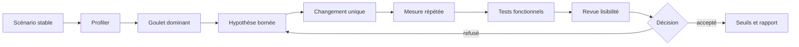

# Optimisation des scènes, scripts et systèmes de jeu

> **Repères d’utilisation :** **[PS]** PowerShell 7, **[VSC]** Visual Studio Code, **[APP]** application graphique nommée, **[SORTIE]** résultat à lire sans le saisir, **[LECTURE]** exemple ou structure de référence. Voir la [convention complète](../Volume-0/annexes/CONVENTION-OUTILS-ET-CONTEXTES.md).

## 1. Rôle du chapitre

Une scène fluide n’est pas une scène dont chaque ligne a été raccourcie. C’est une scène où le travail coûteux est identifié, planifié au bon rythme, limité au bon périmètre et retiré lorsque sa valeur fonctionnelle disparaît. L’optimisation des systèmes de jeu consiste donc à réduire le travail inutile sans casser l’autorité métier, la lisibilité du code, le déterminisme attendu ni les tests.

Le chapitre 6 conserve le profilage CPU général et les contrats de benchmark. Le chapitre 7 conserve le coût GPU et le rendu. Le chapitre 8 conserve les budgets RAM/VRAM, les fuites et la politique mémoire. Le chapitre 9 conserve le chargement et le streaming. Le présent chapitre possède le coût des nœuds et scripts déjà actifs, les fréquences de mise à jour, l’activation logique, le pooling gameplay, les recherches, les signaux et le découpage des systèmes. Le chapitre 11 ouvrira l’architecture multijoueur.

La règle centrale est la suivante : toute optimisation doit partir d’un goulet mesuré, modifier une cause principale, préserver les contrats fonctionnels et être reprofilée. Une complexité supplémentaire sans gain démontré reste une dette, même si elle paraît techniquement élégante.

## 2. Résultats d’apprentissage

À la fin du chapitre, le lecteur saura :

- distinguer coût continu, pic intermittent et coût d’activation ;
- relier une fonction coûteuse à sa fréquence, son nombre d’instances et son contexte ;
- désactiver séparément traitement visuel, physique et entrée lorsque cela est sûr ;
- réduire la fréquence d’un système sans modifier sa sémantique ;
- répartir un travail volumineux sur plusieurs frames ;
- construire des quotas et files équitables ;
- définir une activation par distance, visibilité ou importance ;
- distinguer LOD visuel et LOD logique ;
- utiliser groupes, références mises en cache et index spatiaux sans parcours répétés ;
- limiter les tempêtes de signaux et regrouper les notifications redondantes ;
- concevoir un pool borné avec remise à zéro vérifiable ;
- décider quand découper une scène ou descendre vers une API serveur ;
- comparer baseline et candidate avec mesures répétées ;
- organiser le diagnostic en modes Solo et Studio ;
- refuser une optimisation qui dégrade tests, lisibilité ou testabilité.

## 3. Niveau de preuve et réserves

Le chapitre est accepté au niveau `static-review`. Les contrats, extraits GDScript, structures de configuration et procédures sont relus statiquement. Aucun benchmark de scène, seuil d’activation, pool runtime, LOD logique, réduction de fréquence ou gain de `Project Asteria` n’est revendiqué comme exécuté.

> **[LECTURE] État de preuve du chapitre — Ne pas saisir.**

```yaml
evidence_level:
  chapter: static_review
  benchmark_campaign_executed: false
  update_thresholds_qualified: false
  logical_lod_qualified: false
  gameplay_pool_executed: false
  server_api_migration_executed: false
  functional_regression_suite_executed: false
  readability_review_executed: false
  runtime_improvement_claimed: false
```

<!-- qa:code-explanation -->

**Explication structurée du bloc :**

- **Statut :** `static_review` décrit une revue documentaire et non une campagne de performance.
- **Séparation :** fréquences, LOD logique, pooling et migration serveur possèdent des preuves distinctes.
- **Régression :** les tests fonctionnels et la revue de lisibilité restent des portes indépendantes.
- **Limite :** une validation future devra conserver scènes, builds, séries, profils et décisions.

## 4. Prérequis et frontières

Le lecteur doit connaître les portes qualité du chapitre 2, les tests fonctionnels du chapitre 3, l’observabilité du chapitre 5, le profilage CPU du chapitre 6, les signaux GPU du chapitre 7 et les budgets mémoire du chapitre 8.

Le présent chapitre possède :

- les fréquences de `_process()` et `_physics_process()` ;
- les files de travail par frame ;
- les seuils d’activation logique ;
- le LOD logique des systèmes de jeu ;
- les registres et recherches des instances actives ;
- les politiques de signaux et de notifications ;
- le pooling gameplay et la remise à zéro ;
- le découpage de scènes et de responsabilités ;
- la décision de descendre vers les serveurs bas niveau ;
- les exemples avant/après et la checklist de revue.

Le chapitre ne redéfinit ni la production des assets, ni le streaming des zones, ni les budgets mémoire, ni l’architecture réseau. Une technique peut consommer les seuils de ces chapitres sans leur reprendre l’autorité.

> **Frontière essentielle :** désactiver une représentation n’autorise pas à désactiver une règle métier. Une quête, un délai, une autorité de combat ou une simulation persistante peut devoir continuer même lorsque son nœud visuel est éloigné ou invisible.

## 5. Vocabulaire opérationnel

- **Coût par appel :** durée attribuée à une exécution d’une fonction ou d’une phase.
- **Fréquence :** nombre d’appels par seconde, par frame ou par tick physique.
- **Multiplicité :** nombre d’instances qui exécutent le même travail.
- **Coût continu :** travail présent sur la plupart des frames.
- **Pic :** travail ponctuel qui dépasse fortement le niveau habituel.
- **Budget de frame :** durée maximale attribuée à une famille de systèmes.
- **Quota :** quantité de tâches ou d’instances traitées pendant une fenêtre.
- **Time slicing :** répartition d’un lot sur plusieurs frames.
- **Activation :** autorisation donnée à un système de produire son travail complet.
- **Désactivation :** suspension explicite d’un ou plusieurs callbacks.
- **LOD logique :** réduction contrôlée de la précision, fréquence ou étendue d’une simulation.
- **Hystérésis :** seuils distincts d’entrée et de sortie qui empêchent les oscillations.
- **Coalescence :** regroupement de demandes équivalentes en une seule opération.
- **Index spatial :** structure qui limite une requête à une région pertinente.
- **Pool :** stock borné d’instances réutilisables.
- **Remise à zéro :** restauration vérifiée de l’état requis avant réemploi.
- **API serveur :** interface bas niveau de rendu, physique ou audio manipulée par `RID`.
- **Dette d’optimisation :** complexité ajoutée dont le bénéfice n’est pas démontré ou maintenable.

## 6. Modèle de décision

> **[LECTURE] Boucle d’optimisation des systèmes — Ne pas exécuter.**



<!-- qa:code-explanation -->

**Explication structurée du bloc :**

- **Entrée :** le scénario et l’environnement sont figés avant toute modification.
- **Attribution :** le goulet dominant est relié à une fonction, une fréquence et une multiplicité.
- **Contrôle :** la mesure répétée précède les tests fonctionnels et la revue de code.
- **Décision :** le gain n’est accepté que si performance et maintenabilité progressent ensemble.

## 7. Classer le coût avant de modifier

Une fonction lente appelée rarement ne produit pas le même risque qu’une petite fonction exécutée par plusieurs milliers d’instances. Le rapport associe durée, fréquence, multiplicité et phase. Il distingue également les appels propres du temps inclusif afin de ne pas optimiser un simple orchestrateur à la place de ses dépendances.

> **[LECTURE] Classification d’un goulet — Ne pas saisir.**

```yaml
bottleneck:
  id: AST-SYS-BOTTLENECK-PENDING
  scenario: combat_square_reference
  phase: active_gameplay
  function: pending_profile
  timing:
    self_ms: measured
    inclusive_ms: measured
    calls_per_frame: measured
    instances: measured
  pattern:
    continuous: measured
    intermittent: measured
    activation_spike: measured
  suspected_multiplier:
    - frequency
    - instance_count
    - query_scope
  decision: pending_review
```

<!-- qa:code-explanation -->

**Explication structurée du bloc :**

- **Identité :** le constat porte un identifiant, un scénario et une phase reproductibles.
- **Temps :** durée propre et durée inclusive empêchent une attribution prématurée.
- **Multiplicateur :** fréquence, nombre d’instances et portée de requête sont séparés.
- **Décision :** le diagnostic reste en attente tant que le profil n’est pas conservé.

## 8. Contrat de benchmark de scène

Une comparaison utilise la même scène, le même nombre d’agents, les mêmes chemins de caméra, les mêmes événements et la même durée. Les variantes chaudes, l’éditeur, les overlays et les outils de capture sont déclarés. Le chapitre 6 conserve la méthode générale ; ici, le contrat nomme les systèmes actifs et leurs seuils.

> **[VSC] Visual Studio Code — Créer `config/performance/system_benchmark.yaml`.**

```yaml
schema_version: 1
benchmark:
  id: AST-SYS-BENCH-001
  scene: res://scenes/benchmarks/system_square.tscn
  duration_seconds: 120
  warmup_seconds: 20
  repetitions: 7
  fixed_seed: 20260726
  active_population:
    guards: 160
    civilians: 240
    projectiles_peak: 180
    interactables: 320
  camera_path: res://data/benchmarks/system_square_camera.json
  captures:
    profiler: required
    raw_samples: required
    functional_log: required
  candidate:
    one_primary_change: true
    rollback_defined: true
```

<!-- qa:code-explanation -->

**Explication structurée du bloc :**

- **Scène :** la population et le parcours de caméra sont explicitement versionnés.
- **Répétitions :** chauffe et sept passages réduisent le poids d’une frame atypique.
- **Preuves :** profil, échantillons bruts et journal fonctionnel sont conservés.
- **Candidate :** une cause principale et un retour arrière sont exigés.

## 9. Manifeste d’environnement

Le coût relatif varie avec le build, le mode d’exécution, les outils ouverts, la fréquence physique et les paramètres de rendu. Une campagne ne compare pas un run éditeur avec un export optimisé sans qualifier cet écart.

> **[VSC] Visual Studio Code — Créer `reports/performance/system-environment.yaml`.**

```yaml
schema_version: 1
environment:
  run_id: AST-SYS-RUN-PENDING
  commit: pending
  engine: Godot_4.7.1_stable
  execution_mode: exported_debug_or_release
  os: Windows_11_64_bit
  cpu: AMD_Ryzen_7_2700
  ram_gib: 32
  gpu: AMD_Radeon_RX_6750_XT_12_Go
  renderer: Forward_plus
  display:
    resolution: recorded
    vsync: recorded
    frame_cap: recorded
  simulation:
    physics_ticks_per_second: recorded
    time_scale: 1.0
  instrumentation:
    profiler_enabled: recorded
    custom_sampling_enabled: recorded
    overhead_measured: false
```

<!-- qa:code-explanation -->

**Explication structurée du bloc :**

- **Build :** commit, moteur et mode d’exécution permettent de reproduire le binaire.
- **Affichage :** résolution, synchronisation et limite de frame sont conservées.
- **Simulation :** fréquence physique et échelle temporelle sont déclarées.
- **Instrumentation :** le coût du profilage reste une réserve à mesurer.

## 10. Budget par famille de systèmes

Le budget n’impose pas le même rythme à l’IA, aux interactions, aux effets, à la navigation et aux interfaces. Il réserve une enveloppe par famille, puis distingue médiane, p95, p99 et dépassements. Les valeurs restent à qualifier sur les plateformes cibles.

> **[VSC] Visual Studio Code — Créer `config/performance/system_budgets.yaml`.**

```yaml
schema_version: 1
budgets:
  frame_cpu_ms: pending_qualification
  families:
    ai_decision:
      p95_ms: pending_qualification
      max_jobs_per_frame: pending_qualification
    navigation_updates:
      p95_ms: pending_qualification
      max_agents_per_frame: pending_qualification
    interaction_queries:
      p95_ms: pending_qualification
      max_queries_per_frame: pending_qualification
    gameplay_effects:
      p95_ms: pending_qualification
      max_activations_per_frame: pending_qualification
  gates:
    functional_suite_required: true
    profiler_comparison_required: true
    readability_review_required: true
```

<!-- qa:code-explanation -->

**Explication structurée du bloc :**

- **Familles :** chaque catégorie possède un budget et un quota propres.
- **Distribution :** le p95 évite de réduire la décision à une moyenne.
- **Quota :** la charge maximale par frame est indépendante du nombre total d’éléments.
- **Porte :** tests, profiler et lisibilité doivent être satisfaits ensemble.

## 11. Échantillonner le coût d’un système

Le collecteur ne remplace pas le profiler. Il ajoute une série bornée autour d’une famille connue, avec phase, nombre d’éléments traités et durée monotone. La journalisation du chapitre 5 reste propriétaire de la rétention et de la confidentialité.

> **[VSC] Visual Studio Code — Créer `src/performance/system_cost_sampler.gd`.**

```gdscript
class_name SystemCostSampler
extends RefCounted

var _samples: Array[Dictionary] = []
var _capacity := 4096

func measure(label: StringName, phase: StringName,
        item_count: int, work: Callable) -> Variant:
    var started_usec := Time.get_ticks_usec()
    var result: Variant = work.call()
    var elapsed_usec := Time.get_ticks_usec() - started_usec
    _samples.push_back({
        "label": String(label),
        "phase": String(phase),
        "item_count": item_count,
        "elapsed_usec": elapsed_usec,
    })
    if _samples.size() > _capacity:
        _samples.pop_front()
    return result

func snapshot() -> Array[Dictionary]:
    return _samples.duplicate(true)
```

<!-- qa:code-explanation -->

**Explication structurée du bloc :**

- **Entrées :** `label`, `phase`, `item_count` et `Callable` décrivent l’opération mesurée.
- **Horloge :** `Time.get_ticks_usec()` fournit une durée monotone adaptée à l’intervalle.
- **Capacité :** la série est bornée à 4 096 enregistrements.
- **Retour :** le résultat du travail est conservé sans changer le contrat de l’appelant.

## 12. Résumer une campagne

L’analyse conserve les échantillons bruts et refuse les séries vides, négatives ou non finies. Elle calcule les percentiles par interpolation simple, le coût par élément et le nombre de dépassements du budget déclaré.

> **[VSC] Visual Studio Code — Créer `tools/performance/analyze_system_samples.py`.**

```python
from __future__ import annotations

import json
import math
import statistics
import sys
from pathlib import Path


def percentile(values: list[float], ratio: float) -> float:
    ordered = sorted(values)
    position = (len(ordered) - 1) * ratio
    low = math.floor(position)
    high = math.ceil(position)
    if low == high:
        return ordered[low]
    weight = position - low
    return ordered[low] * (1.0 - weight) + ordered[high] * weight


path = Path(sys.argv[1])
rows = [json.loads(line) for line in path.read_text(encoding="utf-8").splitlines()
        if line.strip()]
durations_ms = [float(row["elapsed_usec"]) / 1000.0 for row in rows]
if not durations_ms or any(not math.isfinite(value) or value < 0.0
                           for value in durations_ms):
    raise SystemExit("Série de durées invalide")

summary = {
    "samples": len(durations_ms),
    "median_ms": statistics.median(durations_ms),
    "p95_ms": percentile(durations_ms, 0.95),
    "p99_ms": percentile(durations_ms, 0.99),
    "maximum_ms": max(durations_ms),
}
print(json.dumps(summary, ensure_ascii=False, indent=2))
```

<!-- qa:code-explanation -->

**Explication structurée du bloc :**

- **Lecture :** chaque ligne JSON représente un échantillon conservé.
- **Validation :** les séries vides, négatives ou non finies interrompent l’analyse.
- **Statistiques :** médiane, p95, p99 et maximum décrivent plusieurs aspects de la distribution.
- **Sortie :** le résumé JSON reste dérivé des données brutes, qui ne sont pas supprimées.

## 13. Registre des fréquences

Une fréquence est une décision de conception, pas un nombre dispersé dans plusieurs scripts. Le registre associe famille, cadence cible, déclencheurs immédiats et exigences de test. Un événement critique peut court-circuiter une cadence réduite lorsqu’il possède une cause explicite.

> **[VSC] Visual Studio Code — Créer `config/performance/update_frequencies.yaml`.**

```yaml
schema_version: 1
update_frequencies:
  perception_near:
    interval_seconds: pending_qualification
    immediate_triggers:
      - damage_received
      - target_entered_melee_range
  perception_far:
    interval_seconds: pending_qualification
    immediate_triggers:
      - alarm_broadcast
  ambient_animation_logic:
    interval_seconds: pending_qualification
    immediate_triggers:
      - player_interaction
  strategic_simulation:
    interval_seconds: pending_qualification
    immediate_triggers:
      - authority_state_changed
  gates:
    latency_test: required
    deterministic_replay: required_when_applicable
```

<!-- qa:code-explanation -->

**Explication structurée du bloc :**

- **Cadence :** chaque famille possède un intervalle à qualifier.
- **Déclencheurs :** les événements critiques peuvent demander une mise à jour immédiate.
- **Autorité :** la simulation stratégique reste distincte des représentations visuelles.
- **Tests :** latence et déterminisme sont vérifiés lorsque le système les exige.

## 14. Désactiver le traitement inutile

`set_process(false)` ne désactive que `_process()`. La physique, les entrées et le mode global doivent être traités séparément. Le composant ci-dessous rend cette séparation visible et réversible.

> **[VSC] Visual Studio Code — Créer `src/performance/processing_gate.gd`.**

```gdscript
class_name ProcessingGate
extends Node

var _visual_enabled := true
var _physics_enabled := true
var _input_enabled := true

func configure(visual: bool, physics: bool, input_events: bool) -> void:
    _visual_enabled = visual
    _physics_enabled = physics
    _input_enabled = input_events
    set_process(_visual_enabled)
    set_physics_process(_physics_enabled)
    set_process_input(_input_enabled)
    set_process_unhandled_input(_input_enabled)

func disable_all_processing() -> void:
    process_mode = Node.PROCESS_MODE_DISABLED

func restore_inherited_mode() -> void:
    process_mode = Node.PROCESS_MODE_INHERIT
    configure(_visual_enabled, _physics_enabled, _input_enabled)
```

<!-- qa:code-explanation -->

**Explication structurée du bloc :**

- **Séparation :** visuel, physique et entrée sont activés par des appels distincts.
- **Mode global :** `PROCESS_MODE_DISABLED` suspend l’ensemble du traitement du sous-arbre concerné.
- **Réversibilité :** le retour à l’héritage restaure ensuite les choix mémorisés.
- **Limite :** la désactivation n’est sûre qu’après inventaire des callbacks et contrats.

## 15. Réduire une cadence avec un accumulateur

Un accumulateur conserve le temps écoulé et exécute une opération lorsque l’intervalle est atteint. Il évite de créer un minuteur par instance, mais ne convient pas à une autorité qui exige chaque tick physique. Le code limite également le rattrapage afin qu’une longue frame ne déclenche pas une rafale non bornée.

> **[VSC] Visual Studio Code — Ajouter un accumulateur borné à un système non critique.**

```gdscript
@export_range(0.01, 10.0, 0.01) var update_interval_seconds := 0.25
@export_range(1, 8, 1) var maximum_catch_up_steps := 2

var _accumulator_seconds := 0.0

func _process(delta: float) -> void:
    _accumulator_seconds += delta
    var steps := 0
    while (_accumulator_seconds >= update_interval_seconds
            and steps < maximum_catch_up_steps):
        _accumulator_seconds -= update_interval_seconds
        _update_non_critical_logic(update_interval_seconds)
        steps += 1
    if steps == maximum_catch_up_steps:
        _accumulator_seconds = min(
            _accumulator_seconds,
            update_interval_seconds
        )
```

<!-- qa:code-explanation -->

**Explication structurée du bloc :**

- **Intervalle :** la cadence est exportée et peut être qualifiée par profil.
- **Rattrapage :** deux étapes au maximum empêchent une spirale après un ralentissement.
- **Delta :** la logique reçoit l’intervalle simulé, pas la durée arbitraire de la frame.
- **Limite :** les systèmes déterministes ou physiques peuvent exiger une autre stratégie.

## 16. Répartir un lot sur plusieurs frames

Le time slicing transforme un lot indivisible en file. Le budget est exprimé en microsecondes monotones et le traitement s’arrête dès qu’il est dépassé. Une tâche trop longue doit encore être découpée, car elle peut consommer le budget à elle seule.

> **[VSC] Visual Studio Code — Créer `src/performance/frame_job_queue.gd`.**

```gdscript
class_name FrameJobQueue
extends Node

@export_range(100, 10000, 100) var budget_usec := 1500
var _jobs: Array[Callable] = []

func enqueue(job: Callable) -> void:
    if not job.is_valid():
        push_error("Tâche invalide")
        return
    _jobs.push_back(job)

func _process(_delta: float) -> void:
    var frame_start := Time.get_ticks_usec()
    while not _jobs.is_empty():
        var job := _jobs.pop_front()
        job.call()
        if Time.get_ticks_usec() - frame_start >= budget_usec:
            break

func pending_count() -> int:
    return _jobs.size()
```

<!-- qa:code-explanation -->

**Explication structurée du bloc :**

- **Admission :** seuls les `Callable` valides entrent dans la file.
- **Budget :** la durée monotone limite le travail agrégé de la frame.
- **Équité :** l’ordre FIFO empêche une tâche récente de dépasser systématiquement les anciennes.
- **Limite :** une tâche individuelle doit rester plus petite que l’enveloppe visée.

## 17. Adapter un quota sans masquer une surcharge

Un quota adaptatif peut réduire le nombre de tâches lorsque les frames sont déjà coûteuses. Il ne doit pas transformer une dette permanente en latence infinie. Des limites minimale et maximale, une cible et un âge maximal restent nécessaires.

> **[VSC] Visual Studio Code — Créer `src/performance/adaptive_quota.gd`.**

```gdscript
class_name AdaptiveQuota
extends RefCounted

var minimum_jobs := 1
var maximum_jobs := 32
var target_frame_ms := 16.67
var current_jobs := 8

func update(previous_frame_ms: float, oldest_job_age_ms: float) -> int:
    if oldest_job_age_ms > 250.0:
        current_jobs = min(current_jobs + 1, maximum_jobs)
    elif previous_frame_ms > target_frame_ms:
        current_jobs = max(current_jobs - 1, minimum_jobs)
    elif previous_frame_ms < target_frame_ms * 0.80:
        current_jobs = min(current_jobs + 1, maximum_jobs)
    return current_jobs
```

<!-- qa:code-explanation -->

**Explication structurée du bloc :**

- **Bornes :** le quota reste compris entre une et trente-deux tâches.
- **Pression :** une frame dépassée réduit progressivement la charge.
- **Famine :** l’âge de la plus ancienne tâche peut forcer une remontée du quota.
- **Décision :** les seuils sont des exemples à qualifier, pas des valeurs universelles.

## 18. Ordre d’exécution et dépendances

`process_priority` et `process_physics_priority` ordonnent les callbacks actifs : les valeurs les plus faibles passent en premier. Une priorité ne réduit aucun coût. Elle sert seulement à rendre une dépendance explicite, par exemple lire les intentions avant de produire les mouvements.

Pour `Project Asteria`, l’ordre prévisionnel est le suivant :

- intentions d’entrée avant décision ;
- décision avant représentation du mouvement ;
- autorité physique avant consommateurs de son résultat ;
- aucun cycle de dépendances ;
- toute modification d’ordre accompagnée d’un test fonctionnel ciblé.

## 19. Activation par visibilité

`VisibleOnScreenEnabler3D` peut modifier le `process_mode` d’un nœud cible lorsque sa boîte devient visible. Cette heuristique dépend de la caméra et ne constitue ni un test de distance, ni une preuve d’occlusion, ni une autorité gameplay. Elle convient à des représentations dont l’arrêt hors écran est explicitement acceptable.

> **[VSC] Visual Studio Code — Ajouter un enabler à une scène de représentation.**

```gdscript
func configure_visual_enabler(
        enabler: VisibleOnScreenEnabler3D,
        target: Node,
        bounds: AABB) -> void:
    if enabler == null or target == null:
        push_error("Enabler ou cible absent")
        return
    enabler.aabb = bounds
    enabler.enable_node_path = enabler.get_path_to(target)
    enabler.enable_mode = VisibleOnScreenEnabler3D.ENABLE_MODE_INHERIT
```

<!-- qa:code-explanation -->

**Explication structurée du bloc :**

- **Cible :** le chemin relatif relie explicitement l’enabler au nœud de représentation.
- **Volume :** l’AABB doit couvrir la zone pertinente de visibilité.
- **Mode :** la cible revient au mode hérité lorsqu’elle est visible.
- **Limite :** la logique d’autorité ne doit pas dépendre de cette heuristique de caméra.

## 20. Activation par distance avec hystérésis

La distance au joueur peut sélectionner un niveau d’activité. Deux seuils distincts empêchent une entité de basculer à chaque petite variation autour d’une frontière. Le calcul utilise la distance au carré et ne s’exécute qu’à une cadence qualifiée.

> **[VSC] Visual Studio Code — Créer `src/performance/distance_activity_gate.gd`.**

```gdscript
class_name DistanceActivityGate
extends Node3D

@export var activate_distance := 35.0
@export var deactivate_distance := 45.0
var _active := true

func evaluate(observer_position: Vector3) -> bool:
    var distance_squared := global_position.distance_squared_to(observer_position)
    var activate_squared := activate_distance * activate_distance
    var deactivate_squared := deactivate_distance * deactivate_distance
    if _active and distance_squared > deactivate_squared:
        _active = false
    elif not _active and distance_squared < activate_squared:
        _active = true
    return _active
```

<!-- qa:code-explanation -->

**Explication structurée du bloc :**

- **Calcul :** la distance au carré évite une racine carrée inutile.
- **Hystérésis :** l’activation à trente-cinq et la désactivation à quarante-cinq séparent les frontières.
- **État :** la méthode retourne le niveau courant après éventuel basculement.
- **Qualification :** les distances et la cadence d’évaluation doivent être mesurées en contexte.

## 21. Définir un LOD logique

Le LOD logique réduit la fréquence, la portée ou le détail d’un système sans changer ses invariants essentiels. Il ne doit pas rendre un ennemi inoffensif uniquement parce qu’il est éloigné de la caméra. Les décisions persistantes, dégâts confirmés et délais d’autorité restent dans un niveau indépendant de la représentation.

> **[VSC] Visual Studio Code — Créer `config/performance/logical_lod.yaml`.**

```yaml
schema_version: 1
logical_lod:
  near:
    perception_interval_seconds: pending_qualification
    navigation_detail: full
    animation_logic: full
    strategic_authority: full
  medium:
    perception_interval_seconds: pending_qualification
    navigation_detail: reduced
    animation_logic: reduced
    strategic_authority: full
  far:
    perception_interval_seconds: pending_qualification
    navigation_detail: coarse_or_event_driven
    animation_logic: suspended_when_safe
    strategic_authority: full
  transitions:
    hysteresis_required: true
    state_conversion_required: true
    latency_test_required: true
```

<!-- qa:code-explanation -->

**Explication structurée du bloc :**

- **Niveaux :** proche, moyen et lointain possèdent des capacités explicites.
- **Autorité :** la simulation stratégique demeure complète dans les trois niveaux.
- **Transition :** l’état doit être converti sans perte lors d’un changement de niveau.
- **Tests :** hystérésis et latence sont des portes obligatoires.

## 22. Planifier les agents par niveau

Le planificateur conserve une file par niveau logique. Il traite d’abord les agents proches, puis réserve une part aux autres niveaux afin d’éviter la famine. Un identifiant ne peut apparaître que dans une file à la fois.

> **[VSC] Visual Studio Code — Créer `src/ai/agent_update_scheduler.gd`.**

```gdscript
class_name AgentUpdateScheduler
extends RefCounted

var _queues := {
    &"near": [],
    &"medium": [],
    &"far": [],
}
var _registered: Dictionary = {}

func register(agent_id: StringName, tier: StringName) -> void:
    unregister(agent_id)
    if not _queues.has(tier):
        push_error("Niveau logique inconnu")
        return
    _queues[tier].push_back(agent_id)
    _registered[agent_id] = tier

func unregister(agent_id: StringName) -> void:
    if not _registered.has(agent_id):
        return
    var tier: StringName = _registered[agent_id]
    _queues[tier].erase(agent_id)
    _registered.erase(agent_id)

func take_batch(near_count: int, medium_count: int, far_count: int) -> Array[StringName]:
    var result: Array[StringName] = []
    _take_round_robin(_queues[&"near"], near_count, result)
    _take_round_robin(_queues[&"medium"], medium_count, result)
    _take_round_robin(_queues[&"far"], far_count, result)
    return result

func _take_round_robin(
        queue: Array,
        count: int,
        output: Array[StringName]) -> void:
    var take_count := min(max(count, 0), queue.size())
    for _index in range(take_count):
        var agent_id: StringName = queue.pop_front()
        output.push_back(agent_id)
        queue.push_back(agent_id)
```

<!-- qa:code-explanation -->

**Explication structurée du bloc :**

- **Unicité :** l’inscription retire d’abord l’agent de son ancien niveau.
- **Validation :** un niveau inconnu est refusé.
- **Équité :** chaque niveau reçoit un nombre déclaré de places.
- **Rotation :** les identifiants servis sont replacés en fin de file pour préserver l’équité.

## 23. Physique, sommeil et activation

La désactivation d’un système gameplay ne doit pas contourner l’autorité physique. Les corps dynamiques peuvent dormir selon les mécanismes du moteur, tandis que les collisions, détecteurs et agents sont activés selon un contrat de proximité et de sécurité. Les seuils sont vérifiés dans les scènes réelles.

> **[LECTURE] Politique d’activation physique — Ne pas saisir.**

```yaml
physics_activity:
  dynamic_bodies:
    allow_sleep: true
    force_sleep_from_gameplay: only_when_state_safe
  detection_areas:
    near: enabled
    medium: reduced_set
    far: disabled_if_no_authority_dependency
  navigation_agents:
    near: full_updates
    medium: reduced_frequency
    far: strategic_representation
  forbidden:
    - disable_collision_during_confirmed_contact
    - skip_authoritative_damage_resolution
    - change_physics_tick_rate_for_one_entity
  validation:
    - collision_regression
    - wake_up_latency
    - deterministic_replay_when_required
```

<!-- qa:code-explanation -->

**Explication structurée du bloc :**

- **Sommeil :** le moteur peut suspendre un corps lorsque son état le permet.
- **Détecteurs :** la portée de collision dépend des besoins d’autorité.
- **Navigation :** les agents lointains peuvent utiliser une représentation stratégique.
- **Interdits :** contacts, dégâts confirmés et fréquence physique globale restent protégés.

## 24. Groupes comme registres actifs

Les groupes évitent de parcourir toute l’arborescence lorsqu’une famille d’instances doit être adressée. L’inscription et la désinscription suivent le cycle de vie du nœud. Le résultat d’une requête de groupe n’est pas demandé à chaque frame pour recréer un registre déjà connu.

> **[VSC] Visual Studio Code — Inscrire un composant dans un groupe stable.**

```gdscript
class_name OptimizableActor
extends Node3D

const ACTIVE_GROUP := &"asteria_active_actors"

func _enter_tree() -> void:
    add_to_group(ACTIVE_GROUP)

func _exit_tree() -> void:
    remove_from_group(ACTIVE_GROUP)

func apply_quality_tier(tier: StringName) -> void:
    if tier == &"reduced":
        set_process(false)
    elif tier == &"full":
        set_process(true)
    else:
        push_error("Niveau de qualité inconnu")
```

<!-- qa:code-explanation -->

**Explication structurée du bloc :**

- **Identité :** `StringName` stabilise le nom de groupe réutilisé.
- **Cycle :** entrée et sortie de l’arbre encadrent l’inscription.
- **Commande :** le composant expose une méthode ciblée plutôt qu’un accès à ses détails internes.
- **Validation :** un niveau inconnu est refusé explicitement.

## 25. Différer et coalescer un appel de groupe

`GROUP_CALL_UNIQUE` ne fonctionne qu’avec `GROUP_CALL_DEFERRED`. Il évite de répéter la même méthode plusieurs fois dans une frame, mais les arguments différents ne sont pas distingués : le premier appel gagne. Cette propriété convient à une invalidation sans paramètre, pas à des mises à jour qui transportent des valeurs différentes.

> **[VSC] Visual Studio Code — Coalescer une invalidation de groupe.**

```gdscript
const DIRTY_GROUP := &"asteria_spatial_consumers"
const REBUILD_METHOD := &"rebuild_spatial_cache"

func request_spatial_cache_rebuild() -> void:
    get_tree().call_group_flags(
        SceneTree.GROUP_CALL_DEFERRED | SceneTree.GROUP_CALL_UNIQUE,
        DIRTY_GROUP,
        REBUILD_METHOD
    )
```

<!-- qa:code-explanation -->

**Explication structurée du bloc :**

- **Différé :** l’appel est exécuté à la fin de la frame courante.
- **Unique :** plusieurs demandes identiques produisent une seule invocation par nœud.
- **Méthode :** l’invalidation sans argument évite l’ambiguïté des valeurs concurrentes.
- **Limite :** une mise à jour paramétrée doit utiliser une file ou un état agrégé.

## 26. Mettre les références en cache

Une référence stable est résolue à l’initialisation et invalidée lorsque le propriétaire disparaît. Les recherches par chemin, nom ou type ne sont pas répétées dans les boucles chaudes. Une référence optionnelle conserve un contrôle de validité avant usage.

> **[VSC] Visual Studio Code — Mettre en cache les dépendances d’un composant.**

```gdscript
class_name GuardCombatView
extends Node3D

@onready var _animation_tree: AnimationTree = %AnimationTree
@onready var _target_marker: Marker3D = %TargetMarker
var _optional_target: WeakRef

func set_optional_target(target: Node3D) -> void:
    _optional_target = weakref(target) if target != null else null

func read_optional_target() -> Node3D:
    if _optional_target == null:
        return null
    var target := _optional_target.get_ref()
    return target as Node3D if is_instance_valid(target) else null
```

<!-- qa:code-explanation -->

**Explication structurée du bloc :**

- **Résolution :** les nœuds uniques sont récupérés une fois avec `%Nom`.
- **Option :** la cible externe utilise une référence faible afin de ne pas imposer sa durée de vie.
- **Validation :** `is_instance_valid()` protège l’usage d’une instance détruite.
- **Limite :** une dépendance obligatoire doit échouer tôt plutôt que devenir silencieusement optionnelle.

## 27. Indexer l’espace au lieu de tout comparer

Une recherche naïve compare chaque acteur à chaque autre acteur. Un index spatial limite les candidats à des cellules voisines, puis applique le test exact. Le contrat conserve la taille de cellule, les règles de déplacement et le coût de reconstruction.

> **[LECTURE] Contrat d’index spatial — Ne pas saisir.**

```yaml
spatial_index:
  type: uniform_grid
  cell_size_meters: pending_qualification
  membership:
    update_on_cell_change: true
    stable_entity_id_required: true
  query:
    neighboring_cells_only: true
    exact_distance_filter_after_lookup: true
    maximum_candidates: pending_qualification
  rebuild:
    full_rebuild_trigger: explicit
    incremental_updates_preferred: true
  metrics:
    candidates_per_query: measured
    query_p95_ms: measured
    rebuild_p95_ms: measured
```

<!-- qa:code-explanation -->

**Explication structurée du bloc :**

- **Structure :** une grille uniforme constitue une option simple à mesurer.
- **Mise à jour :** l’appartenance change seulement lorsqu’une frontière de cellule est franchie.
- **Précision :** l’index produit des candidats, puis le filtre exact confirme la distance.
- **Mesure :** coût de requête et coût de reconstruction restent séparés.

## 28. Cycle de vie des signaux

Une connexion répétée peut multiplier les appels ; une connexion oubliée peut conserver un propriétaire ou produire des réactions après désactivation. Le composant vérifie l’état de connexion et retire explicitement l’abonnement lorsque sa relation fonctionnelle se termine.

> **[VSC] Visual Studio Code — Encadrer une connexion de signal.**

```gdscript
class_name DamageIndicator
extends Node

var _source: Node

func bind_source(source: Node) -> void:
    unbind_source()
    if source == null or not source.has_signal(&"damaged"):
        push_error("Source de dégâts invalide")
        return
    _source = source
    var callback := Callable(self, &"_on_source_damaged")
    if not _source.is_connected(&"damaged", callback):
        _source.connect(&"damaged", callback)

func unbind_source() -> void:
    if _source == null or not is_instance_valid(_source):
        _source = null
        return
    var callback := Callable(self, &"_on_source_damaged")
    if _source.is_connected(&"damaged", callback):
        _source.disconnect(&"damaged", callback)
    _source = null
```

<!-- qa:code-explanation -->

**Explication structurée du bloc :**

- **Remplacement :** l’ancienne source est détachée avant toute nouvelle connexion.
- **Validation :** la présence du signal est contrôlée.
- **Idempotence :** `is_connected()` empêche les abonnements dupliqués.
- **Fin de vie :** la déconnexion explicite ferme la relation fonctionnelle.

## 29. Regrouper les notifications redondantes

Plusieurs mutations d’un même inventaire pendant une frame ne doivent pas forcément reconstruire l’interface autant de fois. Un drapeau sale coalesce les changements et émet un snapshot une fois à la fin de la frame.

> **[VSC] Visual Studio Code — Coalescer les changements d’un modèle.**

```gdscript
class_name InventoryChangeCoalescer
extends Node

signal snapshot_ready(snapshot: Dictionary)

var _dirty := false
var _snapshot_provider: Callable

func configure(provider: Callable) -> void:
    _snapshot_provider = provider

func mark_dirty() -> void:
    if _dirty:
        return
    _dirty = true
    call_deferred(&"_flush")

func _flush() -> void:
    _dirty = false
    if not _snapshot_provider.is_valid():
        push_error("Fournisseur de snapshot invalide")
        return
    snapshot_ready.emit(_snapshot_provider.call())
```

<!-- qa:code-explanation -->

**Explication structurée du bloc :**

- **Drapeau :** la première mutation planifie le flush et les suivantes sont regroupées.
- **Différé :** le snapshot est produit après les mutations de la frame.
- **Validation :** le fournisseur doit être un `Callable` valide.
- **Effet :** les consommateurs reçoivent un état cohérent plutôt qu’une suite de transitions intermédiaires.

## 30. Concevoir un pool borné

Un pool réduit certaines créations fréquentes mais conserve volontairement des instances. Sa capacité, sa remise à zéro, sa politique de surplus et ses métriques doivent être explicites. Le chapitre 8 conserve l’analyse mémoire ; ici, la décision porte sur le coût CPU et la correction du réemploi.

> **[VSC] Visual Studio Code — Créer `src/gameplay/bounded_node_pool.gd`.**

```gdscript
class_name BoundedNodePool
extends Node

@export var maximum_idle := 128
var _idle: Array[Node] = []

func acquire(factory: Callable) -> Node:
    if not _idle.is_empty():
        var instance := _idle.pop_back()
        instance.call(&"reset_for_reuse")
        return instance
    var created := factory.call()
    if created is not Node:
        push_error("La fabrique doit retourner un Node")
        return null
    return created

func release(instance: Node) -> void:
    if instance == null:
        return
    instance.call(&"prepare_for_pool")
    if _idle.size() >= maximum_idle:
        instance.queue_free()
        return
    _idle.push_back(instance)
```

<!-- qa:code-explanation -->

**Explication structurée du bloc :**

- **Réemploi :** une instance inactive est remise à zéro avant acquisition.
- **Fabrique :** le résultat est contrôlé comme `Node`.
- **Capacité :** cent vingt-huit instances inactives au maximum sont conservées.
- **Surplus :** les instances au-delà de la limite sont libérées.

## 31. Contrat de remise à zéro

La remise à zéro est une liste d’invariants, pas une méthode vide. Elle couvre signaux temporaires, timers, cible, vélocité, effets, propriétaire et données de session. Chaque invariant possède un test de réemploi.

> **[VSC] Visual Studio Code — Créer `tests/contracts/projectile_pool_reset.yaml`.**

```yaml
pool_reset_contract:
  type: projectile
  before_release:
    - stop_trail
    - disconnect_temporary_signals
    - clear_damage_owner
    - clear_target
    - disable_collision
  before_acquire:
    - reset_transform
    - reset_velocity
    - reset_lifetime
    - assign_damage_owner
    - enable_collision
  forbidden_residue:
    - previous_target
    - previous_owner
    - pending_timer
    - active_tween
  tests:
    repeated_reuse_cycles: 100
    state_equivalence_with_fresh_instance: required
```

<!-- qa:code-explanation -->

**Explication structurée du bloc :**

- **Libération :** les relations et effets temporaires sont fermés avant stockage.
- **Acquisition :** l’état requis est reconstruit avant retour à l’appelant.
- **Résidus :** les références de la session précédente sont explicitement interdites.
- **Test :** le réemploi est comparé à une instance fraîche sur cent cycles.

## 32. Réutiliser les tampons des boucles chaudes

Une fonction appelée fréquemment peut remplir un tampon fourni par l’appelant au lieu de créer un nouveau tableau. Le contrat précise que le contenu précédent est effacé et que le tableau reste la propriété de l’appelant.

> **[VSC] Visual Studio Code — Remplir un tampon de candidats.**

```gdscript
func fill_nearby_candidates(
        source: Array[Node3D],
        origin: Vector3,
        radius_squared: float,
        output: Array[Node3D]) -> void:
    output.clear()
    for candidate in source:
        if candidate == null or not is_instance_valid(candidate):
            continue
        if candidate.global_position.distance_squared_to(origin) <= radius_squared:
            output.push_back(candidate)
```

<!-- qa:code-explanation -->

**Explication structurée du bloc :**

- **Propriété :** l’appelant fournit et conserve le tableau de sortie.
- **Réutilisation :** `clear()` permet d’employer le même tampon entre plusieurs appels.
- **Filtre :** les instances absentes ou détruites sont ignorées.
- **Portée :** l’index spatial doit réduire `source` lorsque la population devient importante.

## 33. Découper les scènes par responsabilité

Une scène volumineuse n’est pas automatiquement lente, mais elle rend l’activation, le test et la mesure plus difficiles lorsqu’elle mélange représentation, autorité, navigation, effets et interface. Le découpage vise des responsabilités observables, pas un nombre arbitraire de nœuds.

> **[LECTURE] Découpage d’un acteur Asteria — Ne pas saisir.**

```yaml
actor_scene:
  root: GuardActor
  children:
    authority:
      owns:
        - health_state
        - combat_rules
        - stable_identity
    decision:
      owns:
        - perception_schedule
        - tactical_intent
    movement:
      owns:
        - navigation_request
        - locomotion_command
    representation:
      owns:
        - mesh
        - animation
        - audio_emitters
      may_disable_when_safe: true
    diagnostics:
      owns:
        - performance_counters
        - debug_overlay
  contracts:
    no_visual_node_owns_damage_authority: true
    each_child_testable_in_isolation: true
```

<!-- qa:code-explanation -->

**Explication structurée du bloc :**

- **Autorité :** l’état de santé et les règles de combat restent indépendants du visuel.
- **Décision :** la perception et l’intention peuvent recevoir une cadence propre.
- **Représentation :** mesh, animation et audio peuvent être désactivés lorsqu’ils ne portent pas d’autorité.
- **Testabilité :** chaque responsabilité possède une frontière vérifiable.

## 34. Descendre vers les API serveur

Les serveurs bas niveau réduisent la surcharge du système de scènes pour des populations très importantes, mais ajoutent gestion manuelle des `RID`, durée de vie, synchronisation et dette de maintenance. Ils ne sont envisagés qu’après mesure des solutions par nœuds, regroupement et réduction de fréquence.

> **[LECTURE] Porte de décision pour une API serveur — Ne pas saisir.**

```yaml
server_api_decision:
  candidate_family: pending_profile
  prerequisites:
    profiler_bottleneck_confirmed: false
    node_level_optimizations_exhausted: false
    functional_contract_stable: false
    team_maintainability_reviewed: false
  risks:
    rid_lifetime_manual: true
    server_readback_stall_possible: true
    debugging_complexity_increases: true
    scene_tooling_reduced: true
  acceptance:
    repeated_measurement_required: true
    rollback_prototype_required: true
    ownership_documented: true
```

<!-- qa:code-explanation -->

**Explication structurée du bloc :**

- **Prérequis :** le goulet et l’épuisement des solutions haut niveau doivent être démontrés.
- **Durée de vie :** les `RID` imposent une gestion explicite des ressources.
- **Synchronisation :** certaines lectures serveur peuvent provoquer une attente.
- **Acceptation :** prototype réversible, mesures répétées et propriété sont obligatoires.

## 35. Travail en arrière-plan

Un thread peut préparer des données indépendantes, mais l’arbre de scène actif n’est pas manipulé depuis un thread arbitraire. Les entrées sont copiées ou immuables, le résultat est validé, puis appliqué sur le thread principal sous un budget. Le chapitre 9 conserve le chargement des ressources.
## 36. Exemples avant et après

Le rapport ne juxtapose pas deux extraits de code hors contexte. Il conserve le scénario, le profil avant, l’hypothèse, le changement, les séries après, les régressions, la complexité et le rollback.

> **[VSC] Visual Studio Code — Créer `reports/performance/system-before-after.yaml`.**

```yaml
schema_version: 1
comparison:
  id: AST-SYS-COMP-PENDING
  scenario: AST-SYS-BENCH-001
  baseline:
    commit: pending
    profiler_capture: pending
    samples: pending
  hypothesis:
    bottleneck: pending
    primary_change: pending
    expected_effect: pending
  candidate:
    commit: pending
    profiler_capture: pending
    samples: pending
  metrics:
    family_p95_ms:
      before: measured
      after: measured
    frame_p99_ms:
      before: measured
      after: measured
    functional_failures:
      before: measured
      after: measured
  maintainability:
    complexity_change: reviewed
    readability_review: pending
  rollback: defined
  decision: pending_human_approval
```

<!-- qa:code-explanation -->

**Explication structurée du bloc :**

- **Comparabilité :** baseline et candidate utilisent le même scénario.
- **Hypothèse :** le goulet, le changement principal et l’effet attendu sont écrits avant décision.
- **Métriques :** coût de famille, queue de frame et erreurs fonctionnelles sont séparés.
- **Maintenabilité :** complexité, lisibilité et rollback participent à l’acceptation.

## 37. Seuils d’activation

Un seuil d’activation possède une unité, une population, une cadence d’évaluation, une hystérésis, une latence maximale et un propriétaire. Les valeurs ne sont pas copiées d’un autre projet.

> **[VSC] Visual Studio Code — Créer `config/performance/activation_thresholds.yaml`.**

```yaml
schema_version: 1
activation_thresholds:
  guard_representation:
    metric: distance_meters
    enter_full: pending_qualification
    leave_full: pending_qualification
    evaluation_interval_seconds: pending_qualification
    maximum_reactivation_latency_ms: pending_qualification
    owner: gameplay_performance
  civilian_decision:
    metric: importance_score
    enter_full: pending_qualification
    leave_full: pending_qualification
    evaluation_interval_seconds: pending_qualification
    maximum_reactivation_latency_ms: pending_qualification
    owner: ai_team
  validation:
    oscillation_count: measured
    missed_reaction_count: measured
    p95_cost_ms: measured
```

<!-- qa:code-explanation -->

**Explication structurée du bloc :**

- **Unité :** chaque seuil déclare la métrique qui le pilote.
- **Hystérésis :** entrée et sortie utilisent des valeurs distinctes.
- **Latence :** la réactivation possède une limite fonctionnelle.
- **Validation :** oscillations, réactions manquées et coût sont mesurés ensemble.

## 38. Porte de régression

Une baisse du temps CPU n’est pas acceptée si le comportement change, si les files ne se vident plus, si les agents réagissent trop tard ou si le code devient impraticable. La porte agrège performance, fonctionnel, latence, déterminisme, mémoire et maintenabilité.

> **[LECTURE] Porte de promotion d’une optimisation — Ne pas saisir.**

```yaml
promotion_gate:
  performance:
    profiler_bottleneck_reduced: required
    repeated_measurements_passed: required
    no_new_frame_tail_regression: required
  functional:
    regression_suite: required
    latency_limits: required
    deterministic_cases: required_when_applicable
  resources:
    memory_budgets: required
    loading_regressions: forbidden
  maintainability:
    readability_review: required
    testability_preserved: required
    ownership_documented: required
  decision:
    automatic_promotion: forbidden
    human_approval: required
```

<!-- qa:code-explanation -->

**Explication structurée du bloc :**

- **Performance :** le goulet doit baisser sans créer une nouvelle queue de frames.
- **Fonctionnel :** suite, latence et déterminisme protègent la sémantique.
- **Ressources :** mémoire et chargements ne peuvent pas payer silencieusement le gain.
- **Autorité :** la promotion finale reste humaine.

## 39. Checklist de revue technique

La checklist est utilisée avant fusion d’une optimisation. Elle exige un profil d’entrée, un propriétaire, une hypothèse, une preuve de sortie et un plan de retrait. Elle ne remplace pas la revue spécialisée.

> **[LECTURE] Checklist de revue — Ne pas saisir.**

```yaml
review_checklist:
  evidence:
    profiler_capture_linked: false
    raw_samples_linked: false
    scenario_versioned: false
  design:
    authority_boundaries_preserved: false
    frequency_or_scope_explicit: false
    fallback_defined: false
  implementation:
    hot_path_allocations_reviewed: false
    signal_lifecycle_reviewed: false
    pool_reset_tested: false
    thread_boundaries_reviewed: false
  validation:
    functional_suite_passed: false
    repeated_measurements_passed: false
    readability_review_passed: false
  closure:
    rollback_tested: false
    owner_approved: false
```

<!-- qa:code-explanation -->

**Explication structurée du bloc :**

- **Preuves :** profil, échantillons et scénario sont liés à la proposition.
- **Conception :** autorité, fréquence, portée et repli sont visibles.
- **Implémentation :** allocations, signaux, pool et threads reçoivent une revue ciblée.
- **Clôture :** rollback et approbation ferment la décision.

## 40. Retour arrière

Le rollback restaure code, seuils, scènes et configuration. Il ne se limite pas à inverser un booléen si la candidate a changé la structure des nœuds ou le format d’état. La vérification rejoue le benchmark et la suite fonctionnelle.

> **[VSC] Visual Studio Code — Enregistrer le plan de rollback.**

```yaml
rollback_plan:
  change_id: AST-SYS-COMP-PENDING
  restore:
    code_commit: pending
    activation_thresholds_version: pending
    scene_revision: pending
    pool_configuration_version: pending
  state_compatibility:
    migration_required: reviewed
    stale_runtime_state_cleared: procedure_defined
  verification:
    benchmark_rerun: required
    functional_suite: required
    latency_checks: required
    memory_checks: required
  authority:
    approver: pending
```

<!-- qa:code-explanation -->

**Explication structurée du bloc :**

- **Sources :** commit, seuils, scène et configuration sont restaurés explicitement.
- **État :** la compatibilité des données runtime est revue.
- **Vérification :** benchmark, fonctionnel, latence et mémoire sont rejoués.
- **Approbation :** une personne responsable confirme la restauration.

## 41. Diagnostics et corrections
<!-- qa:error-correction-section -->

### 41.1 Optimiser sans profil

**Symptôme ou risque :** Une fonction est réécrite parce qu’elle semble lente, mais le temps de frame ne change pas.

**Exemple fautif :**

> **[LECTURE] Exemple fautif — Ne pas appliquer.**

```yaml
optimization:
  profiler_capture: absent
  hypothesis: "les boucles sont toujours lentes"
  changed_systems:
    - ai
    - navigation
    - animation
  decision: accepted
```

<!-- qa:code-explanation -->

**Pourquoi cet exemple est fautif :**

- **Erreur :** plusieurs systèmes sont modifiés sans profil, sans métrique et sans cause principale.

**Exemple corrigé :**

> **[LECTURE] Exemple corrigé — Adapter au contrat du projet.**

```yaml
optimization:
  profiler_capture: reports/profiler/AST-SYS-001.json
  bottleneck: GuardPerception.scan_candidates
  self_ms_p95: measured
  calls_per_frame: measured
  hypothesis: reduce_query_scope
  primary_change: spatial_index
  repeated_measurement: required
  decision: pending_review
```

<!-- qa:code-explanation -->

**Pourquoi la correction fonctionne :**

- **Correction :** le goulet, sa fréquence, l’hypothèse et la mesure répétée sont déclarés avant acceptation.

### 41.2 Désactiver seulement `_process()`

**Symptôme ou risque :** Une entité supposée inactive continue d’exécuter sa physique et ses entrées.

**Exemple fautif :**

> **[LECTURE] Exemple fautif — Ne pas appliquer.**

```gdscript
func deactivate() -> void:
    set_process(false)
```

<!-- qa:code-explanation -->

**Pourquoi cet exemple est fautif :**

- **Erreur :** `set_process(false)` n’affecte ni `_physics_process()` ni les callbacks d’entrée.

**Exemple corrigé :**

> **[LECTURE] Exemple corrigé — Adapter au contrat du projet.**

```gdscript
func deactivate() -> void:
    set_process(false)
    set_physics_process(false)
    set_process_input(false)
    set_process_unhandled_input(false)

func deactivate_subtree() -> void:
    process_mode = Node.PROCESS_MODE_DISABLED
```

<!-- qa:code-explanation -->

**Pourquoi la correction fonctionne :**

- **Correction :** chaque famille de callbacks est traitée explicitement et le mode global reste réservé au sous-arbre approprié.

### 41.3 Confondre visibilité et autorité gameplay

**Symptôme ou risque :** Un ennemi cesse de réagir derrière un mur ou hors caméra alors qu’il reste proche du joueur.

**Exemple fautif :**

> **[LECTURE] Exemple fautif — Ne pas appliquer.**

```gdscript
func _on_screen_exited() -> void:
    combat_authority.process_mode = Node.PROCESS_MODE_DISABLED
```

<!-- qa:code-explanation -->

**Pourquoi cet exemple est fautif :**

- **Erreur :** la visibilité caméra devient une autorité de combat alors qu’elle est approximative et dépend du cadrage.

**Exemple corrigé :**

> **[LECTURE] Exemple corrigé — Adapter au contrat du projet.**

```gdscript
func _on_screen_exited() -> void:
    visual_representation.process_mode = Node.PROCESS_MODE_DISABLED
    combat_authority.set_relevance_source(&"camera_visible", false)

func update_distance_relevance(distance_squared: float) -> void:
    combat_authority.set_relevance_source(
        &"player_near",
        distance_squared <= combat_authority_distance_squared
    )
```

<!-- qa:code-explanation -->

**Pourquoi la correction fonctionne :**

- **Correction :** la représentation peut s’arrêter, tandis que l’autorité combine des sources de pertinence distinctes.

### 41.4 Mettre à jour tous les agents à chaque frame

**Symptôme ou risque :** Le coût de perception augmente presque linéairement avec la population active.

**Exemple fautif :**

> **[LECTURE] Exemple fautif — Ne pas appliquer.**

```gdscript
func _process(_delta: float) -> void:
    for agent in all_agents:
        agent.scan_environment()
        agent.choose_action()
        agent.update_path()
```

<!-- qa:code-explanation -->

**Pourquoi cet exemple est fautif :**

- **Erreur :** chaque agent exécute trois opérations coûteuses à la cadence d’affichage sans priorité ni quota.

**Exemple corrigé :**

> **[LECTURE] Exemple corrigé — Adapter au contrat du projet.**

```gdscript
func _process(_delta: float) -> void:
    var batch := scheduler.take_batch(
        near_jobs_per_frame,
        medium_jobs_per_frame,
        far_jobs_per_frame
    )
    for agent_id in batch:
        var agent := registry.find_active(agent_id)
        if agent != null:
            agent.run_scheduled_update()
```

<!-- qa:code-explanation -->

**Pourquoi la correction fonctionne :**

- **Correction :** le planificateur borne le lot, réserve des places par niveau et utilise un registre actif.

### 41.5 Utiliser `GROUP_CALL_UNIQUE` sans différé

**Symptôme ou risque :** Plusieurs invalidations identiques déclenchent encore plusieurs reconstructions.

**Exemple fautif :**

> **[LECTURE] Exemple fautif — Ne pas appliquer.**

```gdscript
get_tree().call_group_flags(
    SceneTree.GROUP_CALL_UNIQUE,
    &"spatial_consumers",
    &"rebuild_spatial_cache"
)
```

<!-- qa:code-explanation -->

**Pourquoi cet exemple est fautif :**

- **Erreur :** `GROUP_CALL_UNIQUE` doit être combiné à `GROUP_CALL_DEFERRED` pour produire la coalescence attendue.

**Exemple corrigé :**

> **[LECTURE] Exemple corrigé — Adapter au contrat du projet.**

```gdscript
get_tree().call_group_flags(
    SceneTree.GROUP_CALL_DEFERRED | SceneTree.GROUP_CALL_UNIQUE,
    &"spatial_consumers",
    &"rebuild_spatial_cache"
)
```

<!-- qa:code-explanation -->

**Pourquoi la correction fonctionne :**

- **Correction :** l’appel différé et unique regroupe les demandes identiques de la frame.

### 41.6 Rechercher les mêmes nœuds dans une boucle chaude

**Symptôme ou risque :** Le profiler attribue une part croissante du temps aux parcours de l’arbre.

**Exemple fautif :**

> **[LECTURE] Exemple fautif — Ne pas appliquer.**

```gdscript
func _process(_delta: float) -> void:
    var player := get_tree().root.find_child("Player", true, false)
    var guards := get_tree().get_nodes_in_group(&"guards")
    for guard in guards:
        guard.update_against(player)
```

<!-- qa:code-explanation -->

**Pourquoi cet exemple est fautif :**

- **Erreur :** la scène entière et le groupe sont reparcourus à chaque frame pour reconstruire des références stables.

**Exemple corrigé :**

> **[LECTURE] Exemple corrigé — Adapter au contrat du projet.**

```gdscript
@onready var _player: Node3D = %Player
var _guard_registry: GuardRegistry

func configure(registry: GuardRegistry) -> void:
    _guard_registry = registry

func _process(_delta: float) -> void:
    for guard in _guard_registry.active_guards():
        guard.update_against(_player)
```

<!-- qa:code-explanation -->

**Pourquoi la correction fonctionne :**

- **Correction :** la dépendance obligatoire et le registre actif sont résolus une fois puis réutilisés.

### 41.7 Créer un pool sans remise à zéro

**Symptôme ou risque :** Un projectile réutilisé conserve la cible, le propriétaire ou un signal de sa vie précédente.

**Exemple fautif :**

> **[LECTURE] Exemple fautif — Ne pas appliquer.**

```gdscript
func acquire() -> Node:
    if idle_projectiles.is_empty():
        return projectile_scene.instantiate()
    return idle_projectiles.pop_back()
```

<!-- qa:code-explanation -->

**Pourquoi cet exemple est fautif :**

- **Erreur :** l’instance est renvoyée sans restaurer ses invariants et le pool ne possède aucun contrat de réemploi.

**Exemple corrigé :**

> **[LECTURE] Exemple corrigé — Adapter au contrat du projet.**

```gdscript
func acquire() -> Node:
    var projectile: Node
    if idle_projectiles.is_empty():
        projectile = projectile_scene.instantiate()
    else:
        projectile = idle_projectiles.pop_back()
    projectile.reset_for_reuse()
    return projectile
```

<!-- qa:code-explanation -->

**Pourquoi la correction fonctionne :**

- **Correction :** la remise à zéro devient une étape obligatoire avant exposition à l’appelant.

### 41.8 Modifier l’arbre actif depuis un thread

**Symptôme ou risque :** Des erreurs intermittentes apparaissent lors de l’ajout ou du retrait de nœuds.

**Exemple fautif :**

> **[LECTURE] Exemple fautif — Ne pas appliquer.**

```gdscript
func _worker_build_enemy() -> void:
    var enemy := enemy_scene.instantiate()
    active_world.add_child(enemy)
```

<!-- qa:code-explanation -->

**Pourquoi cet exemple est fautif :**

- **Erreur :** un thread arbitraire instancie et modifie directement l’arbre de scène actif.

**Exemple corrigé :**

> **[LECTURE] Exemple corrigé — Adapter au contrat du projet.**

```gdscript
func _worker_build_enemy_data() -> Dictionary:
    return enemy_factory.prepare_spawn_data()

func apply_enemy_data(data: Dictionary) -> void:
    var enemy := enemy_scene.instantiate()
    enemy.apply_spawn_data(data)
    active_world.add_child(enemy)
```

<!-- qa:code-explanation -->

**Pourquoi la correction fonctionne :**

- **Correction :** le worker prépare des données indépendantes et le thread principal applique le résultat à l’arbre.

### 41.9 Réduire le LOD logique en supprimant l’autorité

**Symptôme ou risque :** Un événement lointain n’applique plus ses dégâts ou son délai persistant.

**Exemple fautif :**

> **[LECTURE] Exemple fautif — Ne pas appliquer.**

```yaml
far_lod:
  combat_updates: disabled
  strategic_state: disabled
  damage_resolution: skipped
  timers: paused
```

<!-- qa:code-explanation -->

**Pourquoi cet exemple est fautif :**

- **Erreur :** le niveau lointain supprime des règles d’autorité au lieu de réduire seulement leur représentation ou leur fréquence sûre.

**Exemple corrigé :**

> **[LECTURE] Exemple corrigé — Adapter au contrat du projet.**

```yaml
far_lod:
  combat_representation: suspended
  tactical_perception: event_driven
  strategic_state: full
  confirmed_damage_resolution: full
  persistent_timers: full
  return_to_near:
    state_conversion_test: required
```

<!-- qa:code-explanation -->

**Pourquoi la correction fonctionne :**

- **Correction :** l’autorité persistante reste complète et seules les couches réductibles changent de cadence.

### 41.10 Accepter un gain qui dégrade les tests

**Symptôme ou risque :** Le p95 CPU baisse, mais les agents réagissent tard et le code devient difficile à isoler.

**Exemple fautif :**

> **[LECTURE] Exemple fautif — Ne pas appliquer.**

```yaml
candidate:
  system_p95_ms: lower
  reaction_latency: ignored
  functional_suite: failed
  readability_review: absent
  rollback: absent
  decision: accepted
```

<!-- qa:code-explanation -->

**Pourquoi cet exemple est fautif :**

- **Erreur :** une seule métrique de performance masque les régressions fonctionnelles et la dette de maintenance.

**Exemple corrigé :**

> **[LECTURE] Exemple corrigé — Adapter au contrat du projet.**

```yaml
candidate:
  system_p95_ms: measured
  frame_p99_ms: measured
  reaction_latency_p95_ms: measured
  functional_suite: passed
  deterministic_cases: passed_when_required
  readability_review: passed
  rollback: tested
  decision: pending_human_approval
```

<!-- qa:code-explanation -->

**Pourquoi la correction fonctionne :**

- **Correction :** performance, latence, fonctionnel, déterminisme, lisibilité et rollback soutiennent ensemble la décision.

## 42. Modes Solo et Studio

### Mode Solo

- profiler un seul scénario à la fois ;
- noter le goulet et l’hypothèse avant modification ;
- utiliser un registre simple de fréquences et seuils ;
- limiter chaque candidate à une cause principale ;
- conserver les séries brutes et un retour arrière ;
- privilégier l’activation et le time slicing avant les API bas niveau ;
- vérifier manuellement les réactions proches, lointaines et les transitions ;
- refuser une optimisation trop complexe à maintenir seul.

### Mode Studio

- **QA performance :** possède scénarios, campagnes, séries et rapports ;
- **programmeur gameplay :** protège règles, latence et déterminisme ;
- **programmeur IA :** possède cadences, niveaux logiques et files d’agents ;
- **programmeur moteur :** évalue serveurs, threads et structures de données ;
- **level designer :** valide distances, densités et cas extrêmes ;
- **QA fonctionnelle :** vérifie interactions, combats, navigation et reprises ;
- **tech lead :** arbitre complexité, dette et lisibilité ;
- **release owner :** conserve l’autorité de promotion.

Une optimisation critique gagne à être reproduite par une seconde personne. La personne qui propose un seuil, un pool ou une migration serveur ne devrait pas être l’unique autorité de son acceptation.

## 43. Checklist d’acceptation

### Mesure

- [ ] scénario, build et environnement versionnés ;
- [ ] profiler d’entrée conservé ;
- [ ] coût propre, coût inclusif, fréquence et multiplicité identifiés ;
- [ ] médiane, p95, p99 et maximum calculés ;
- [ ] overhead de l’instrumentation déclaré.

### Conception

- [ ] autorité métier séparée de la représentation ;
- [ ] fréquence, quota ou seuil possède une unité ;
- [ ] hystérésis et latence maximale définies ;
- [ ] file bornée et équitable ;
- [ ] pool borné avec contrat de remise à zéro ;
- [ ] thread et serveur utilisés seulement avec frontière explicite.

### Validation

- [ ] candidate mesurée avec le même scénario ;
- [ ] goulet principal réduit ;
- [ ] aucune nouvelle queue de frame problématique ;
- [ ] suite fonctionnelle réussie ;
- [ ] cas déterministes réussis lorsque requis ;
- [ ] latence de réaction sous la limite ;
- [ ] mémoire et chargements non dégradés ;
- [ ] lisibilité et testabilité approuvées ;
- [ ] rollback testé ;
- [ ] décision humaine enregistrée.

## 44. Critère d’acceptation du pilote

Le chapitre sera validé au niveau runtime lorsque `Project Asteria` disposera d’au moins une campagne matérialisée répondant simultanément aux conditions suivantes :

1. scénario et manifeste d’environnement versionnés ;
2. profil d’entrée identifiant un goulet de scène, script ou système ;
3. hypothèse écrite avant modification ;
4. candidate limitée à une cause principale ;
5. séries répétées avant et après conservées ;
6. seuils, fréquences ou quotas qualifiés ;
7. tests fonctionnels et latence satisfaits ;
8. mémoire et chargements non dégradés ;
9. lisibilité, testabilité et rollback approuvés ;
10. rapport et décision humaine archivés.

## 45. Synthèse opérationnelle pour Project Asteria

- `config/performance/system_benchmark.yaml` définit la scène de benchmark ;
- `config/performance/system_budgets.yaml` sépare les familles de coût ;
- `config/performance/update_frequencies.yaml` centralise les cadences ;
- `config/performance/logical_lod.yaml` protège l’autorité stratégique ;
- `config/performance/activation_thresholds.yaml` porte seuils et hystérésis ;
- `src/performance/system_cost_sampler.gd` collecte des durées bornées ;
- `src/performance/frame_job_queue.gd` répartit les lots ;
- `src/performance/adaptive_quota.gd` borne la charge et la famine ;
- `src/performance/processing_gate.gd` sépare les callbacks ;
- `src/ai/agent_update_scheduler.gd` réserve des quotas par niveau ;
- `src/gameplay/bounded_node_pool.gd` limite le pooling gameplay ;
- `reports/performance/system-before-after.yaml` conserve la décision ;
- aucune technique n’est promue sans profiler, tests et mesure répétée ;
- aucune valeur runtime ou amélioration de performance n’est revendiquée dans ce chapitre.

## 46. Références techniques

- [Conseils généraux d’optimisation — Godot Engine](https://docs.godotengine.org/fr/4.x/tutorials/performance/general_optimization.html)
- [Optimisation CPU — Godot Engine](https://docs.godotengine.org/en/stable/tutorials/performance/cpu_optimization.html)
- [Classe Node — Godot Engine 4.7](https://docs.godotengine.org/en/4.7/classes/class_node.html)
- [Classe SceneTree — Godot Engine 4.7](https://docs.godotengine.org/en/4.7/classes/class_scenetree.html)
- [Groupes — Godot Engine 4.7](https://docs.godotengine.org/en/4.7/tutorials/scripting/groups.html)
- [VisibleOnScreenEnabler3D — Godot Engine 4.7](https://docs.godotengine.org/en/4.7/classes/class_visibleonscreenenabler3d.html)
- [Optimisation à l’aide des serveurs — Godot Engine](https://docs.godotengine.org/fr/4.x/tutorials/performance/using_servers.html)
- [API sûres pour les threads — Godot Engine](https://docs.godotengine.org/en/stable/tutorials/performance/thread_safe_apis.html)
