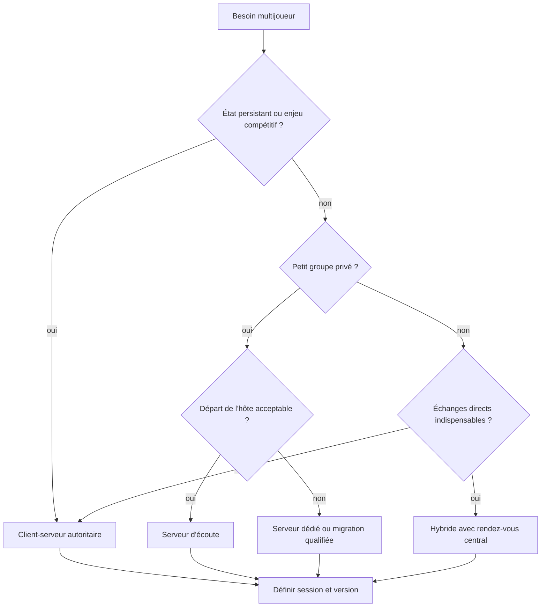
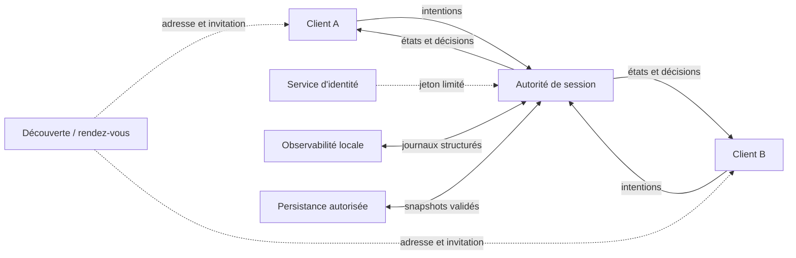
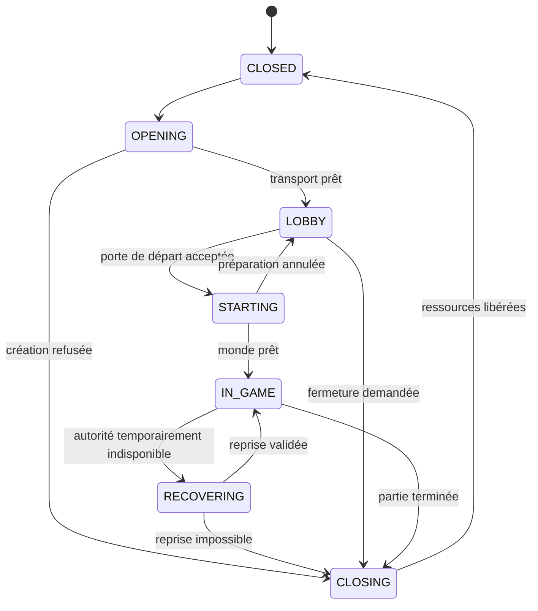
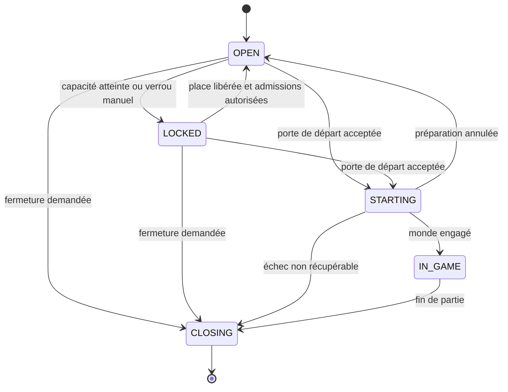
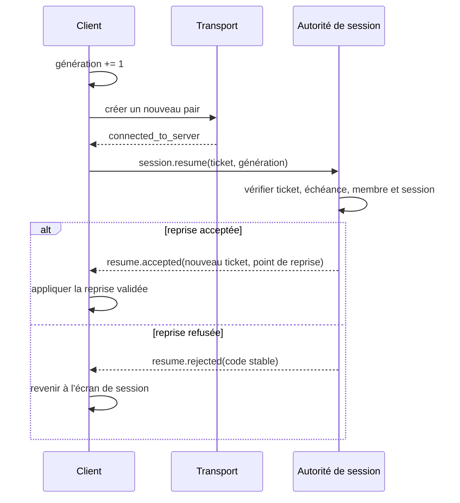

# Architecture multijoueur

> **Repères d’utilisation :** **[PS]** PowerShell 7, **[VSC]** Visual Studio Code, **[APP]** application graphique nommée, **[SORTIE]** résultat à lire sans le saisir, **[LECTURE]** exemple ou structure de référence. Voir la [convention complète](../Volume-0/annexes/CONVENTION-OUTILS-ET-CONTEXTES.md).
## 1. Rôle du chapitre

Le multijoueur ne commence pas par un appel RPC. Il commence par une décision d’architecture : qui crée la vérité, qui peut demander une action, comment une session naît, comment elle se termine et comment une partie reprend après une coupure. Une topologie mal choisie transforme chaque fonctionnalité future en exception ; une topologie explicite fournit au contraire des frontières stables pour la synchronisation, la sécurité et l’exploitation.

Le chapitre 10 conserve l’optimisation des scènes et systèmes actifs. Le présent chapitre possède le choix entre client-serveur, pair-à-pair et hybride, le contrat de session, le lobby, la découverte, l’identité de connexion, la négociation de version, la reconnexion, les coûts et les risques. Le chapitre 12 conservera la réplication détaillée, l’interpolation, la prédiction, le rollback et les stratégies de réduction de bande passante. Le chapitre 13 conservera le build serveur dédié, le déploiement, les secrets, le pare-feu, le durcissement et la réponse aux abus.

La décision par défaut de `Project Asteria` est un modèle client-serveur autoritaire. Le client transmet des intentions et présente des résultats ; l’autorité de session accepte, refuse et ordonne les transitions. Un mode pair-à-pair ou hybride ne devient acceptable qu’après justification documentée des contraintes de coût, de disponibilité, de NAT, de triche, de migration d’hôte et de support.

## 2. Résultats d’apprentissage

À la fin du chapitre, le lecteur saura :

- comparer client-serveur, pair-à-pair et hybride selon autorité, coût et exploitation ;
- distinguer hôte d’écoute, serveur dédié, joueur hôte et autorité métier ;
- séparer identité durable, identifiant de compte, ticket de session et identifiant de pair ;
- concevoir les états d’une session et d’un lobby ;
- versionner les enveloppes et négocier les capacités ;
- initialiser un serveur ou un client ENet sans confondre création et connexion effective ;
- réagir aux signaux de connexion, d’échec et de déconnexion ;
- limiter les demandes de lobby par validation, idempotence et débit ;
- préparer découverte, invitation et rendez-vous sans les confondre avec le transport de jeu ;
- définir une reconnexion bornée, corrélée et protégée contre les réponses obsolètes ;
- tester connexion, départ, coupure et reprise sans inventer de résultat ;
- documenter les coûts d’hébergement, d’exploitation et de support ;
- organiser les responsabilités en modes Solo et Studio ;
- maintenir les frontières avec synchronisation, prédiction et sécurité réseau.

## 3. Niveau de preuve et réserves

Le chapitre est accepté au niveau `static-review`. Les contrats, diagrammes, configurations et extraits GDScript sont relus statiquement. Aucun serveur, lobby, service de découverte, ticket de reconnexion, campagne de latence ou coût d’hébergement de `Project Asteria` n’est revendiqué comme matérialisé.

> **[LECTURE] État de preuve du chapitre — Ne pas saisir.**

```yaml
evidence_level:
  chapter: static_review
  topology_selected: documented_default
  connection_prototype_executed: false
  lobby_state_machine_executed: false
  discovery_service_materialized: false
  reconnection_campaign_executed: false
  latency_loss_campaign_executed: false
  hosting_costs_qualified: false
  security_hardening_executed: false
  runtime_improvement_claimed: false
```

<!-- qa:code-explanation -->

**Explication structurée du bloc :**

- **Statut :** `static_review` décrit une validation documentaire, pas une session réseau exécutée.
- **Séparation :** topologie, connexion, lobby, découverte et reconnexion possèdent des preuves distinctes.
- **Frontière :** le durcissement du serveur et les tests sous perte restent réservés aux chapitres propriétaires.
- **Limite :** une validation future devra conserver builds, configurations, journaux, captures et décisions.

## 4. Prérequis et frontières

Le lecteur doit connaître l’architecture modulaire et l’injection de dépendances du Livre II, les tests fonctionnels du chapitre 3, la journalisation du chapitre 5 et les budgets de performance des chapitres 6 à 10. Il doit également distinguer l’état métier durable de sa représentation dans une scène.

Le présent chapitre possède :

- la topologie réseau et sa justification ;
- le cycle de vie d’une session ;
- le contrat d’identité de connexion ;
- le lobby et ses transitions ;
- la découverte et les invitations ;
- la négociation de version et de capacités ;
- la reconnexion et le rejet des complétions obsolètes ;
- les coûts, risques, rôles et portes d’acceptation.

Le chapitre 12 possédera les propriétés répliquées, les événements synchronisés, les canaux de transfert, l’interpolation, la prédiction et le rollback. Le chapitre 13 possédera l’exposition Internet, l’authentification de production, les secrets, les certificats, les règles pare-feu, l’atténuation des abus et le déploiement d’un serveur dédié.

> **Frontière essentielle :** l’identifiant de pair Godot est une adresse de connexion temporaire. Il ne remplace ni l’identité durable d’un joueur, ni un droit, ni un ticket de reprise.

## 5. Vocabulaire opérationnel

- **Autorité :** composant habilité à accepter une transition et à produire l’état canonique.
- **Client :** processus qui demande des actions et présente une vue de la session.
- **Serveur d’écoute :** processus qui héberge et joue dans la même instance.
- **Serveur dédié :** processus sans joueur local, exploité séparément.
- **Pair-à-pair :** topologie où plusieurs pairs échangent sans serveur d’autorité unique permanent.
- **Hybride :** combinaison de services centraux et d’échanges directs entre pairs.
- **Session :** unité bornée de participation, de règles, de version et de durée de vie.
- **Lobby :** état préparatoire où les membres, réglages et décisions de départ sont coordonnés.
- **Découverte :** mécanisme qui permet de trouver une session ou une invitation.
- **Rendez-vous :** service qui met en relation des participants sans devenir nécessairement transport de jeu.
- **Identifiant de pair :** entier attribué par l’implémentation réseau pendant une connexion.
- **Identité durable :** identifiant stable du joueur ou du profil, indépendant de la connexion.
- **Ticket de session :** preuve opaque et limitée qui autorise une tentative d’entrée ou de reprise.
- **Génération :** numéro monotone qui distingue plusieurs tentatives successives d’une même session.
- **Compatibilité :** capacité de deux builds à comprendre leurs contrats communs.
- **Capacité :** fonctionnalité annoncée et négociée, distincte d’un simple numéro de version.
- **Migration d’hôte :** transfert contrôlé de la responsabilité d’hébergement.
- **Reprise :** rattachement d’une identité durable à une session encore valide après coupure.

## 6. Choisir la topologie par contraintes

Le choix ne dépend pas d’une préférence abstraite. Il dépend de la triche tolérable, de la persistance, du nombre de joueurs, des plateformes, de la traversée NAT, du coût d’exploitation, de la disponibilité et du support attendu. Le tableau suivant sert de point de départ, pas de verdict universel.

> **[LECTURE] Matrice de décision de topologie — Ne pas saisir.**

```yaml
topology_matrix:
  client_server:
    authority: centralized
    cheat_resistance: strongest_default
    nat_complexity_for_clients: lower
    hosting_cost: recurring
    host_migration: not_required_with_dedicated_server
    suitable_for:
      - persistent_progression
      - competitive_rules
      - cross_platform_sessions
  listen_server:
    authority: host_process
    cheat_resistance: moderate
    hosting_cost: player_supplied
    host_departure_risk: high
    suitable_for:
      - cooperative_small_groups
      - private_sessions
  peer_to_peer:
    authority: distributed_or_elected
    cheat_resistance: application_dependent
    nat_complexity: high
    hosting_cost: low_central_cost
    suitable_for:
      - trusted_small_groups
      - deterministic_lockstep_when_qualified
  hybrid:
    authority: mixed
    central_services:
      - identity
      - matchmaking
      - rendezvous
    direct_transport: optional
    complexity: highest
```

<!-- qa:code-explanation -->

**Explication structurée du bloc :**

- **Axes :** autorité, triche, NAT, coût et départ de l’hôte sont comparés séparément.
- **Client-serveur :** la centralisation simplifie la vérité mais crée un coût et une dépendance d’exploitation.
- **Pair-à-pair :** le faible coût central ne supprime ni la traversée NAT ni les conflits d’autorité.
- **Hybride :** la combinaison n’est justifiée que si chaque frontière réduit un risque précis.

## 7. Arbre de décision initial

Une équipe peut éliminer rapidement les modèles incompatibles. La présence de progression persistante ou d’enjeux compétitifs oriente vers une autorité centrale. Une coopération privée à faible enjeu peut utiliser un serveur d’écoute, à condition de traiter le départ de l’hôte. Le pair-à-pair exige des participants de confiance ou un protocole déterministe qualifié.

> **[LECTURE] Arbre de décision de topologie — Ne pas exécuter.**



<!-- qa:code-explanation -->

**Explication structurée du bloc :**

- **Entrée :** la décision part des contraintes de produit, pas d’une API disponible.
- **Autorité :** persistance et compétition favorisent une source de vérité centrale.
- **Disponibilité :** le départ de l’hôte devient une exigence d’architecture, pas un détail d’interface.
- **Sortie :** tous les modèles convergent vers un contrat de session versionné.

## 8. Décision de référence pour Project Asteria

`Project Asteria` retient un client-serveur autoritaire. Le prototype local peut fonctionner comme serveur d’écoute afin de réduire les coûts d’apprentissage, mais l’architecture garde un rôle serveur séparé du joueur hôte. Cette séparation permet de remplacer plus tard l’hébergement local par un processus dédié sans déplacer les règles métier dans l’interface.

Le serveur :

- crée et ferme la session ;
- accepte ou refuse les membres ;
- possède l’état du lobby ;
- ordonne le départ de partie ;
- valide les commandes de session ;
- attribue les identités temporaires de connexion ;
- publie les raisons de refus et de fermeture.

Le client :

- demande une connexion ;
- présente une identité et un ticket éventuel ;
- reçoit l’état accepté ;
- soumet des intentions ;
- rend l’état reçu ;
- conserve une interface de reprise sans inventer la réussite.

## 9. Diagramme réseau de référence

Le diagramme distingue le transport de jeu des services de contrôle. Une invitation ou un service de rendez-vous aide à trouver une session ; il ne devient pas automatiquement l’autorité du monde. Le serveur de session reste le propriétaire des transitions du lobby et de la partie.

> **[LECTURE] Diagramme réseau de référence — Ne pas exécuter.**



<!-- qa:code-explanation -->

**Explication structurée du bloc :**

- **Flux plein :** les intentions et décisions de jeu passent par l’autorité de session.
- **Flux pointillé :** identité et découverte assistent la connexion sans posséder la simulation.
- **Observabilité :** les journaux restent séparés de l’état canonique.
- **Persistance :** les snapshots sont consommés par un port autorisé et non par l’interface réseau.

## 10. Séparer les couches applicatives

Un nœud de scène ne doit pas décider à la fois du transport, de l’identité, du lobby et du gameplay. Le bootstrap choisit l’adaptateur réseau. Le service de session dépend d’un port abstrait et publie des événements typés vers l’interface. Cette organisation maintient un chemin hors ligne et permet de tester les transitions sans socket réel.

> **[VSC] Visual Studio Code — Créer `src/core/network/session_transport.gd`.**

```gdscript
class_name SessionTransport
extends RefCounted

signal connected(peer_id: int)
signal connection_failed(code: int, detail: String)
signal disconnected(reason: String)
signal message_received(envelope: Dictionary)

func start_server(_config: SessionEndpoint) -> Error:
    return ERR_UNAVAILABLE

func start_client(_config: SessionEndpoint) -> Error:
    return ERR_UNAVAILABLE

func send(_envelope: Dictionary) -> Error:
    return ERR_UNAVAILABLE

func close(_reason: String) -> void:
    pass
```

<!-- qa:code-explanation -->

**Explication structurée du bloc :**

- **Rôle :** `SessionTransport` définit le port minimal entre application et technologie réseau.
- **Signaux :** connexion, échec, fermeture et message sont des faits de transport, pas des décisions métier.
- **Retours :** les méthodes renvoient `Error` pour distinguer refus immédiat et résultat asynchrone.
- **Limite :** l’implémentation concrète reste remplaçable par ENet, un double de test ou un mode hors ligne.

## 11. Identités à ne pas confondre

Une connexion possède plusieurs identifiants dont les durées de vie diffèrent. L’identifiant de pair est attribué par le réseau et peut changer à chaque tentative. L’identité durable du joueur traverse les reconnexions. Le ticket de session est secret, limité et révocable. L’identifiant de membre du lobby relie une identité acceptée à une session précise.

> **[LECTURE] Contrat d’identité de session — Ne pas saisir.**

```yaml
identity_contract:
  account_id:
    stable: true
    public_display: false
    owner: identity_service
  player_profile_id:
    stable: true
    owner: game_domain
  peer_id:
    stable: false
    scope: current_connection
    owner: multiplayer_transport
  session_member_id:
    stable: within_session
    owner: session_authority
  reconnect_ticket:
    opaque: true
    single_purpose: resume_session
    expires: required
    reusable: false
  display_name:
    unique: false
    authoritative: false
```

<!-- qa:code-explanation -->

**Explication structurée du bloc :**

- **Durée :** chaque identifiant possède une portée et un propriétaire explicites.
- **Pair :** `peer_id` reste temporaire et ne doit jamais devenir une clé durable.
- **Ticket :** la reprise utilise une preuve opaque, expirante et à usage contrôlé.
- **Affichage :** le nom visible peut changer et ne possède aucune autorité.

## 12. Contrat de session

Le contrat de session fixe les paramètres qui doivent être identiques pour tous les participants. Il porte l’identité de la session, la version du protocole, la version de contenu, la topologie, les limites et les règles de reprise. Une valeur non négociable est refusée avant l’entrée dans le lobby.

> **[VSC] Visual Studio Code — Créer `config/network/session-contract.yaml`.**

```yaml
schema_version: 1
session_contract:
  session_id: AST-NET-SESSION-PENDING
  topology: authoritative_client_server
  protocol:
    family: asteria-session
    major: 1
    minor: 0
  content_revision: pending
  build_channel: development
  transport:
    kind: enet
    port: 27111
    max_clients: 8
    channels_reserved: 4
  lobby:
    minimum_members: 1
    maximum_members: 8
    host_is_player: allowed_in_prototype
  reconnect:
    grace_seconds: pending_measurement
    ticket_rotation: required
  admission:
    unknown_major_version: reject
    content_mismatch: reject
    full_session: reject
```

<!-- qa:code-explanation -->

**Explication structurée du bloc :**

- **Version :** la famille, la majeure et la mineure sont séparées pour appliquer des règles de compatibilité.
- **Contenu :** une révision différente peut être refusée même si le transport fonctionne.
- **Prototype :** le serveur d’écoute est autorisé sans fusionner rôle serveur et rôle joueur.
- **Mesure :** la grâce de reconnexion reste à qualifier et n’est pas inventée.

## 13. Cycle de vie d’une session

Les états doivent être finis et leurs transitions contrôlées. Une session ne passe pas directement de `CLOSED` à `IN_GAME`. Une fermeture interdit les nouvelles admissions, notifie les membres puis libère le transport. Un état `RECOVERING` représente une reprise globale et non la simple reconnexion d’un client.

> **[LECTURE] Machine à états de session — Ne pas exécuter.**



<!-- qa:code-explanation -->

**Explication structurée du bloc :**

- **Ordre :** l’ouverture du transport précède l’admission au lobby.
- **Annulation :** un départ de partie peut revenir au lobby tant que le monde n’est pas engagé.
- **Reprise :** `RECOVERING` exige une validation globale et ne masque pas une panne.
- **Fermeture :** la libération des ressources termine explicitement le cycle.

## 14. Enveloppe protocolaire versionnée

Tous les messages de contrôle partagent une enveloppe minimale. Elle fournit corrélation, génération, identité de session, type de message et version. Le payload reste spécifique au message. Une enveloppe inconnue ou surdimensionnée est refusée avant tout changement d’état.

> **[VSC] Visual Studio Code — Créer `docs/network/session-envelope.schema.json`.**

```json
{
  "$schema": "https://json-schema.org/draft/2020-12/schema",
  "title": "AsteriaSessionEnvelope",
  "type": "object",
  "additionalProperties": false,
  "required": [
    "protocol",
    "session_id",
    "connection_generation",
    "message_id",
    "message_type",
    "payload"
  ],
  "properties": {
    "protocol": {
      "type": "object",
      "required": ["major", "minor"],
      "properties": {
        "major": {"type": "integer", "minimum": 1},
        "minor": {"type": "integer", "minimum": 0}
      }
    },
    "session_id": {"type": "string", "minLength": 1, "maxLength": 96},
    "connection_generation": {"type": "integer", "minimum": 1},
    "message_id": {"type": "string", "minLength": 1, "maxLength": 96},
    "message_type": {"type": "string", "minLength": 1, "maxLength": 64},
    "payload": {"type": "object"}
  }
}
```

<!-- qa:code-explanation -->

**Explication structurée du bloc :**

- **Fermeture :** `additionalProperties: false` bloque les champs silencieusement ignorés au niveau supérieur.
- **Corrélation :** `message_id` permet l’idempotence et le suivi d’une demande.
- **Génération :** une ancienne connexion ne peut pas appliquer une réponse destinée à une tentative plus récente.
- **Payload :** la validation spécialisée reste nécessaire pour chaque `message_type`.

## 15. Règles de compatibilité

Un numéro de version n’est utile que s’il possède une politique. Une majeure différente signifie contrat incompatible. Une mineure plus récente peut être acceptée si les capacités obligatoires communes existent et si les champs inconnus sont traités selon le schéma. La version de contenu reste une porte indépendante.

> **[LECTURE] Politique de compatibilité — Ne pas saisir.**

```yaml
compatibility_policy:
  protocol_family: asteria-session
  major:
    mismatch: reject
  minor:
    client_newer:
      action: negotiate_capabilities
    server_newer:
      action: negotiate_capabilities
  capabilities:
    required:
      - lobby.members.v1
      - lobby.ready.v1
      - session.resume.v1
    optional:
      - lobby.chat.v1
      - invite.join-code.v1
  content_revision:
    mismatch: reject
  unknown_message_type:
    required_namespace: reject
    optional_namespace: ignore_and_log
```

<!-- qa:code-explanation -->

**Explication structurée du bloc :**

- **Majeure :** une divergence structurelle bloque l’admission avant le lobby.
- **Mineure :** la compatibilité dépend des capacités et non d’un simple ordre numérique.
- **Contenu :** des données différentes peuvent désynchroniser la partie malgré un protocole compatible.
- **Inconnu :** les espaces de noms obligatoires et optionnels possèdent des comportements distincts.

## 16. Négociation des capacités

La première conversation applicative annonce les capacités offertes et exigées. Le serveur calcule l’intersection, refuse les manques obligatoires et renvoie le profil retenu. Le résultat est figé pour la génération de connexion afin d’éviter qu’une fonctionnalité apparaisse au milieu d’une session.

> **[LECTURE] Échange de capacités — Ne pas saisir.**

```json
{
  "message_type": "session.capabilities.offer",
  "payload": {
    "required": [
      "lobby.members.v1",
      "lobby.ready.v1",
      "session.resume.v1"
    ],
    "optional": [
      "lobby.chat.v1",
      "invite.join-code.v1"
    ],
    "limits": {
      "max_lobby_members": 8,
      "max_control_payload_bytes": 16384
    }
  }
}
```

<!-- qa:code-explanation -->

**Explication structurée du bloc :**

- **Obligatoire :** une capacité requise absente produit un refus explicite.
- **Optionnel :** une capacité optionnelle peut être désactivée sans casser la session.
- **Limites :** les plafonds négociés protègent les deux extrémités contre des charges imprévues.
- **Stabilité :** le profil accepté est attaché à la génération courante.

## 17. Configuration d’un point de terminaison

La configuration de connexion ne doit pas être dispersée dans l’interface. Elle est validée avant de créer un pair. Les valeurs de développement local, de test et de production utilisent des profils distincts. Les secrets et jetons ne figurent jamais dans cette ressource.

> **[VSC] Visual Studio Code — Créer `src/core/network/session_endpoint.gd`.**

```gdscript
class_name SessionEndpoint
extends Resource

@export var address: String = "127.0.0.1"
@export_range(1, 65535, 1) var port: int = 27111
@export_range(1, 64, 1) var max_clients: int = 8
@export_range(0, 32, 1) var channel_count: int = 4
@export var bind_address: String = "127.0.0.1"

func validate_for_server() -> PackedStringArray:
    var issues := PackedStringArray()
    if bind_address.strip_edges().is_empty():
        issues.append("bind_address_empty")
    if max_clients < 1:
        issues.append("max_clients_invalid")
    return issues

func validate_for_client() -> PackedStringArray:
    var issues := PackedStringArray()
    if address.strip_edges().is_empty():
        issues.append("address_empty")
    return issues
```

<!-- qa:code-explanation -->

**Explication structurée du bloc :**

- **Types :** la ressource regroupe adresse, port, capacité et nombre de canaux.
- **Bornes :** les annotations limitent l’édition sans remplacer la validation métier.
- **Serveur :** l’adresse de liaison est contrôlée séparément de l’adresse de destination.
- **Secrets :** aucun ticket ou jeton n’est persisté dans la configuration.

## 18. Créer un serveur ENet

`ENetMultiplayerPeer.create_server()` crée le pair d’écoute et renvoie immédiatement un code `Error`. Un retour `OK` signifie que le pair a été créé, pas qu’un client s’est connecté. L’implémentation fixe explicitement l’adresse de liaison du prototype local afin d’éviter une exposition involontaire sur toutes les interfaces.

> **[VSC] Visual Studio Code — Créer `src/core/network/enet_session_transport.gd` puis ajouter la méthode serveur.**

```gdscript
class_name EnetSessionTransport
extends SessionTransport

var _peer: ENetMultiplayerPeer
var _multiplayer_api: MultiplayerAPI

func configure(api: MultiplayerAPI) -> void:
    _multiplayer_api = api

func start_server(config: SessionEndpoint) -> Error:
    if _multiplayer_api == null:
        return ERR_UNCONFIGURED

    var issues := config.validate_for_server()
    if not issues.is_empty():
        return ERR_INVALID_PARAMETER

    _peer = ENetMultiplayerPeer.new()
    _peer.set_bind_ip(config.bind_address)

    var result := _peer.create_server(
        config.port,
        config.max_clients,
        config.channel_count
    )
    if result != OK:
        _peer = null
        return result

    _multiplayer_api.multiplayer_peer = _peer
    return OK
```

<!-- qa:code-explanation -->

**Explication structurée du bloc :**

- **Configuration :** l’API multijoueur est injectée au lieu d’être recherchée globalement.
- **Validation :** la création est refusée avant l’ouverture si le profil est invalide.
- **Liaison :** `set_bind_ip()` limite le prototype à l’interface déclarée.
- **Retour :** `OK` confirme la création du pair ; les connexions futures arrivent par signaux.

## 19. Créer un client ENet

`create_client()` lance une tentative vers une adresse et un port. Le code de retour couvre la création immédiate du client. Le succès de la connexion est annoncé plus tard par `connected_to_server`; l’échec asynchrone utilise `connection_failed`.

> **[VSC] Visual Studio Code — Ajouter la méthode client à `src/core/network/enet_session_transport.gd`.**

```gdscript
func start_client(config: SessionEndpoint) -> Error:
    if _multiplayer_api == null:
        return ERR_UNCONFIGURED

    var issues := config.validate_for_client()
    if not issues.is_empty():
        return ERR_INVALID_PARAMETER

    _peer = ENetMultiplayerPeer.new()
    var result := _peer.create_client(
        config.address,
        config.port,
        config.channel_count
    )
    if result != OK:
        _peer = null
        return result

    _multiplayer_api.multiplayer_peer = _peer
    return OK
```

<!-- qa:code-explanation -->

**Explication structurée du bloc :**

- **Asynchrone :** le retour décrit la création du pair, pas l’acceptation par le serveur.
- **Adresse :** le nom ou l’adresse IP provient d’un profil validé.
- **Canaux :** le nombre déclaré prépare les usages futurs sans définir encore la réplication.
- **Échec :** un refus immédiat libère la référence et remonte le code exact.

## 20. Relier les signaux de cycle de vie

Les signaux de `MultiplayerAPI` constituent la source de vérité pour la connexion de haut niveau. Le serveur reçoit `peer_connected` et `peer_disconnected`. Le client reçoit en plus `connected_to_server`, `connection_failed` et `server_disconnected`. Les connexions de signaux sont symétriques afin d’éviter les doublons après une reprise.

> **[VSC] Visual Studio Code — Ajouter le cycle de vie à `src/core/network/enet_session_transport.gd`.**

```gdscript
func bind_signals() -> void:
    var bindings := [
        [_multiplayer_api.peer_connected, _on_peer_connected],
        [_multiplayer_api.peer_disconnected, _on_peer_disconnected],
        [_multiplayer_api.connected_to_server, _on_connected_to_server],
        [_multiplayer_api.connection_failed, _on_connection_failed],
        [_multiplayer_api.server_disconnected, _on_server_disconnected],
    ]
    for binding in bindings:
        var source: Signal = binding[0]
        var target: Callable = binding[1]
        if not source.is_connected(target):
            source.connect(target)

func unbind_signals() -> void:
    var bindings := [
        [_multiplayer_api.peer_connected, _on_peer_connected],
        [_multiplayer_api.peer_disconnected, _on_peer_disconnected],
        [_multiplayer_api.connected_to_server, _on_connected_to_server],
        [_multiplayer_api.connection_failed, _on_connection_failed],
        [_multiplayer_api.server_disconnected, _on_server_disconnected],
    ]
    for binding in bindings:
        var source: Signal = binding[0]
        var target: Callable = binding[1]
        if source.is_connected(target):
            source.disconnect(target)
```

<!-- qa:code-explanation -->

**Explication structurée du bloc :**

- **Symétrie :** les mêmes couples signal-callback sont connectés et déconnectés.
- **Idempotence :** `is_connected()` évite une double notification après réinitialisation.
- **Types :** `Signal` et `Callable` rendent la boucle explicite.
- **Responsabilité :** les callbacks traduisent ensuite les événements vers le service de session.

## 21. Fermer proprement le transport

La fermeture retire le pair actif et restaure un état hors ligne. Elle ne prétend pas garantir la livraison d’un dernier message. Les décisions métier de fermeture sont enregistrées avant de libérer le transport ; les détails de persistance restent dans leurs autorités propriétaires.

> **[VSC] Visual Studio Code — Ajouter la fermeture à `src/core/network/enet_session_transport.gd`.**

```gdscript
func close(reason: String) -> void:
    if _peer != null:
        _peer.close()
    if _multiplayer_api != null:
        _multiplayer_api.multiplayer_peer = OfflineMultiplayerPeer.new()
    _peer = null
    disconnected.emit(reason)
```

<!-- qa:code-explanation -->

**Explication structurée du bloc :**

- **Ordre :** le pair ENet est fermé avant le remplacement par le mode hors ligne.
- **Hors ligne :** `OfflineMultiplayerPeer` restaure un comportement local cohérent.
- **Signal :** la raison applicative est publiée une fois le transport libéré.
- **Limite :** la méthode ne revendique ni accusé de réception final ni migration d’état.

## 22. Coordonner les tentatives de connexion

Un coordinateur possède une génération monotone. Chaque démarrage invalide les callbacks de la tentative précédente. Le service refuse les transitions incompatibles et distingue `CONNECTING`, `CONNECTED`, `RECONNECTING`, `CLOSING` et `CLOSED`.

> **[VSC] Visual Studio Code — Créer `src/core/network/session_connection_coordinator.gd`.**

```gdscript
class_name SessionConnectionCoordinator
extends RefCounted

enum State {
    CLOSED,
    CONNECTING,
    CONNECTED,
    RECONNECTING,
    CLOSING,
}

var state: State = State.CLOSED
var generation: int = 0
var transport: SessionTransport

func begin_connect(endpoint: SessionEndpoint) -> Error:
    if state not in [State.CLOSED, State.RECONNECTING]:
        return ERR_BUSY

    generation += 1
    state = State.CONNECTING
    var started := transport.start_client(endpoint)
    if started != OK:
        state = State.CLOSED
    return started

func accept_connected(callback_generation: int) -> bool:
    if callback_generation != generation:
        return false
    if state != State.CONNECTING:
        return false
    state = State.CONNECTED
    return true
```

<!-- qa:code-explanation -->

**Explication structurée du bloc :**

- **État :** les transitions refusent une nouvelle tentative concurrente.
- **Génération :** chaque tentative reçoit un numéro strictement croissant.
- **Échec immédiat :** le coordinateur revient à `CLOSED` si le pair ne peut pas être créé.
- **Obsolescence :** un callback d’une ancienne génération ne peut pas valider la connexion courante.

## 23. Modèle du lobby

Le lobby est un état métier sous autorité serveur. Il contient les membres acceptés, leur statut prêt, les paramètres autorisés et la décision de départ. L’interface ne modifie jamais directement ce modèle ; elle soumet une commande.

> **[VSC] Visual Studio Code — Créer `docs/network/lobby-state.yaml`.**

```yaml
lobby_state:
  lobby_id: AST-LOBBY-PENDING
  revision: 0
  phase: open
  owner_member_id: pending
  members:
    - member_id: pending
      player_profile_id: pending
      display_name: pending
      connection_status: connected
      ready: false
      role: player
  settings:
    ruleset_id: cooperative_expedition_v1
    map_id: relay_valley
    privacy: invite_only
  start_gate:
    minimum_members_met: false
    all_required_members_ready: false
    content_revisions_match: false
    authority_approved: false
```

<!-- qa:code-explanation -->

**Explication structurée du bloc :**

- **Révision :** chaque mutation réussie incrémente une révision monotone.
- **Membre :** l’identité de lobby est séparée du profil et du pair.
- **Réglages :** seules les clés autorisées peuvent être modifiées.
- **Porte :** le départ dépend de plusieurs conditions explicites et d’une approbation serveur.

## 24. Transitions du lobby

Le lobby refuse les commandes qui ne correspondent pas à sa phase. Un membre ne peut pas devenir prêt pendant la fermeture. Le serveur peut verrouiller les admissions pendant `STARTING`, puis revenir à `OPEN` si la préparation échoue avant engagement de la partie.

> **[LECTURE] Machine à états du lobby — Ne pas exécuter.**



<!-- qa:code-explanation -->

**Explication structurée du bloc :**

- **Admission :** `LOCKED` distingue une session vivante d’une session encore ouverte.
- **Départ :** `STARTING` protège la préparation contre les changements de membres.
- **Retour :** une annulation avant engagement peut restaurer `OPEN`.
- **Fin :** `CLOSING` interdit les nouvelles commandes et prépare la fermeture.

## 25. Commandes de lobby

Une commande contient identité, type, révision attendue et clé d’idempotence. Le serveur récupère l’expéditeur depuis le contexte réseau, puis résout son `session_member_id`. Il n’accepte jamais un identifiant de membre librement fourni comme preuve d’autorité.

> **[LECTURE] Commande de lobby — Ne pas saisir.**

```json
{
  "message_type": "lobby.command",
  "payload": {
    "command_id": "AST-LOBBY-CMD-PENDING",
    "command_type": "set_ready",
    "expected_revision": 12,
    "arguments": {
      "ready": true
    }
  }
}
```

<!-- qa:code-explanation -->

**Explication structurée du bloc :**

- **Identité :** l’expéditeur réel vient du contexte du transport et non du payload.
- **Révision :** `expected_revision` détecte une commande fondée sur un état ancien.
- **Idempotence :** `command_id` permet de rejouer une réponse sans répéter la mutation.
- **Arguments :** chaque type de commande utilise un schéma fermé et borné.

## 26. Résultat d’une commande

Le résultat distingue acceptation, refus métier et panne technique. Un refus normal porte un code stable et la révision courante. Le client met à jour son interface depuis l’état reçu au lieu de supposer que le clic a réussi.

> **[LECTURE] Résultat de commande — Ne pas saisir.**

```json
{
  "message_type": "lobby.command_result",
  "payload": {
    "command_id": "AST-LOBBY-CMD-PENDING",
    "status": "rejected",
    "reason_code": "revision_conflict",
    "current_revision": 13,
    "state_refresh_required": true
  }
}
```

<!-- qa:code-explanation -->

**Explication structurée du bloc :**

- **Corrélation :** le résultat reprend l’identifiant exact de la commande.
- **Statut :** `rejected` décrit un refus contrôlé et non une panne du transport.
- **Révision :** le client connaît l’état courant à demander ou à appliquer.
- **Interface :** la présentation attend le résultat autoritaire avant d’afficher la réussite.

## 27. Limiter les commandes et les abus fonctionnels

Même avant le durcissement du chapitre 13, l’architecture impose des plafonds. Chaque commande a une taille maximale, une fréquence admissible et une phase autorisée. Une demande excessive est refusée sans allouer un travail non borné.

> **[VSC] Visual Studio Code — Créer `config/network/session-limits.yaml`.**

```yaml
session_limits:
  control_payload_bytes: 16384
  display_name_codepoints: 48
  lobby_chat_message_codepoints: 512
  commands_per_second:
    set_ready: 4
    update_setting: 2
    send_chat: 6
    request_start: 1
  pending_commands_per_member: 16
  idempotency_records_per_member: 128
  admission_attempts_per_minute: pending_security_review
  disconnect_on_repeated_violation: policy_required
```

<!-- qa:code-explanation -->

**Explication structurée du bloc :**

- **Taille :** les charges sont bornées avant parsing ou copie profonde.
- **Débit :** les commandes fréquentes et rares ont des quotas différents.
- **Mémoire :** les registres d’attente et d’idempotence possèdent une capacité.
- **Frontière :** les seuils d’admission et sanctions restent à qualifier avec la sécurité réseau.

## 28. Découverte de sessions

La découverte répond à la question « où se connecter ? ». Elle ne prouve ni l’identité du serveur ni l’autorisation d’entrer. Plusieurs mécanismes peuvent coexister : saisie d’adresse pour le développement, diffusion locale pour un LAN, code d’invitation, liste privée et service de rendez-vous.

> **[LECTURE] Matrice de découverte — Ne pas saisir.**

```yaml
discovery_modes:
  direct_address:
    environments: [development, private_test]
    central_service: false
    internet_usability: limited
  lan_announcement:
    environments: [local_network]
    central_service: false
    trust_level: untrusted_advertisement
  invite_code:
    environments: [private_session, production_candidate]
    central_service: required
    reveals_server_address: after_authorization
  private_list:
    environments: [studio_test, production_candidate]
    central_service: required
    access_control: required
  matchmaking:
    environments: [production_candidate]
    central_service: required
    scope: chapter_13_and_product_design
```

<!-- qa:code-explanation -->

**Explication structurée du bloc :**

- **Adresse :** la saisie directe suffit à un prototype local mais pas à une expérience publique.
- **LAN :** une annonce locale est une information non fiable à valider.
- **Invitation :** le code doit être résolu par un service et ne pas contenir un secret durable.
- **Périmètre :** le matchmaking complet dépend du produit, de la sécurité et de l’exploitation.

## 29. Annonce LAN bornée

Une annonce locale peut publier un identifiant court, un nom, une version et un port. Elle ne publie ni ticket de reprise, ni jeton de compte, ni état détaillé de la partie. Le client traite toutes les valeurs comme non fiables et expire les annonces silencieuses.

> **[LECTURE] Charge d’annonce LAN — Ne pas saisir.**

```json
{
  "kind": "asteria.lan.session",
  "protocol_major": 1,
  "session_hint": "AST-LAN-7F2A",
  "display_name": "Expédition privée",
  "port": 27111,
  "members": 2,
  "capacity": 4,
  "content_revision": "pending",
  "announcement_sequence": 18
}
```

<!-- qa:code-explanation -->

**Explication structurée du bloc :**

- **Minimalité :** l’annonce ne contient que les données utiles à l’affichage et à la compatibilité.
- **Non-confiance :** le port, la capacité et la version sont revalidés lors de la connexion.
- **Séquence :** un numéro aide à ignorer une annonce plus ancienne du même émetteur.
- **Expiration :** l’absence d’annonce future retire l’entrée sans conclure à une panne globale.

## 30. Invitations et codes de jonction

Un code d’invitation est une référence courte vers une autorisation côté service. Il n’embarque pas l’adresse complète, l’identité du joueur ni un secret réutilisable. La résolution peut renvoyer une adresse, un ticket à usage unique, une expiration et la version attendue.

> **[LECTURE] Résolution d’une invitation — Ne pas saisir.**

```json
{
  "invite_code": "RELAY-7K4M",
  "resolution": {
    "session_id": "AST-NET-SESSION-PENDING",
    "endpoint": {
      "address": "resolved_by_service",
      "port": 27111
    },
    "join_ticket": "opaque_single_use_value",
    "expires_at": "server_supplied_timestamp",
    "protocol_major": 1,
    "content_revision": "pending"
  }
}
```

<!-- qa:code-explanation -->

**Explication structurée du bloc :**

- **Référence :** le code visible n’est qu’une clé de résolution limitée.
- **Ticket :** la preuve de jonction est opaque, expirante et à usage unique.
- **Adresse :** le service révèle le point de terminaison après autorisation.
- **Temps :** l’expiration provient du serveur et ne doit pas être inventée par le client.

## 31. Authentification de connexion et identité applicative

La création d’un pair réseau n’authentifie pas un joueur. L’architecture réserve une phase d’admission avant l’entrée complète dans la session. Godot fournit des mécanismes d’authentification dans `SceneMultiplayer`, mais leur politique, leurs secrets et leur exposition publique appartiennent au chapitre 13.

Le chapitre présent impose seulement les contrats suivants :

- aucune commande métier avant admission ;
- aucune confiance accordée au nom affiché ;
- un ticket limité à une session et une finalité ;
- une association côté serveur entre pair temporaire et membre accepté ;
- une suppression de cette association à la fermeture ;
- des refus explicites pour version, contenu, capacité, session pleine ou ticket invalide.

## 32. Ticket de reconnexion

La reconnexion n’utilise pas l’ancien `peer_id`. Le serveur remet un ticket de reprise après admission. Le ticket référence côté serveur une identité, une session, une génération et une échéance. Une utilisation réussie le fait tourner afin de limiter le rejeu.

> **[LECTURE] Enregistrement serveur d’un ticket de reprise — Ne pas saisir.**

```yaml
reconnect_record:
  ticket_hash: stored_hash_only
  session_id: AST-NET-SESSION-PENDING
  session_member_id: AST-MEMBER-PENDING
  player_profile_id: AST-PLAYER-PENDING
  issued_generation: 3
  minimum_next_generation: 4
  expires_at: server_clock_value
  consumed: false
  allowed_state:
    - lobby
    - in_game
  rotation_on_success: required
```

<!-- qa:code-explanation -->

**Explication structurée du bloc :**

- **Stockage :** le serveur conserve une empreinte plutôt que la valeur du ticket.
- **Identité :** le ticket relie membre et profil sans dépendre du pair précédent.
- **Génération :** une tentative plus ancienne que le minimum est rejetée.
- **Rotation :** la réussite invalide le ticket présenté et en émet un nouveau.

## 33. Protocole de reprise

Le client entre dans `RECONNECTING`, incrémente sa génération, crée un nouveau pair et présente le ticket. Le serveur vérifie session, échéance, identité et état. Il renvoie ensuite un snapshot ou un point de reprise autorisé. Les détails de rattrapage d’état appartiennent au chapitre 12.

> **[LECTURE] Séquence de reconnexion — Ne pas exécuter.**



<!-- qa:code-explanation -->

**Explication structurée du bloc :**

- **Nouveau pair :** la reprise crée une connexion distincte et n’essaie pas de restaurer l’ancien identifiant.
- **Vérification :** toutes les portes sont contrôlées avant d’envoyer un état de reprise.
- **Rotation :** un nouveau ticket est remis seulement après acceptation.
- **Frontière :** le contenu précis du rattrapage d’état sera défini avec la synchronisation.

## 34. Délais, retries et backoff

Une coupure ne déclenche pas une boucle immédiate infinie. Le client applique un nombre borné de tentatives, un délai croissant et une petite variation. Il s’arrête lorsqu’une erreur est permanente, lorsque le ticket expire ou lorsque l’utilisateur annule.

> **[VSC] Visual Studio Code — Créer `config/network/reconnect-policy.yaml`.**

```yaml
reconnect_policy:
  maximum_attempts: 5
  initial_delay_seconds: 0.5
  multiplier: 2.0
  maximum_delay_seconds: 8.0
  jitter_fraction: 0.2
  stop_on:
    - protocol_major_mismatch
    - content_revision_mismatch
    - ticket_expired
    - ticket_rejected
    - session_closed
    - user_cancelled
  retry_on:
    - connection_timeout
    - temporary_unreachable
    - server_recovering
  values_status: provisional_until_runtime_campaign
```

<!-- qa:code-explanation -->

**Explication structurée du bloc :**

- **Borne :** cinq tentatives empêchent une boucle sans fin dans le prototype.
- **Backoff :** le délai augmente et limite les rafales synchronisées de clients.
- **Permanent :** les incompatibilités et refus de ticket ne sont pas retentés.
- **Réserve :** les valeurs restent provisoires tant qu’une campagne runtime ne les qualifie pas.

## 35. Rejeter les complétions obsolètes

Une réponse arrivée après annulation ou après une nouvelle tentative ne doit pas modifier l’interface. Chaque callback transporte la génération capturée. Le coordinateur compare cette valeur avant toute transition.

> **[VSC] Visual Studio Code — Ajouter le contrôle de génération au coordinateur.**

```gdscript
func begin_reconnect(endpoint: SessionEndpoint) -> int:
    generation += 1
    state = State.RECONNECTING
    var captured_generation := generation
    _start_reconnect_attempt(endpoint, captured_generation)
    return captured_generation

func handle_resume_result(
    callback_generation: int,
    accepted: bool,
    reason_code: StringName
) -> void:
    if callback_generation != generation:
        return
    if state != State.RECONNECTING:
        return

    if accepted:
        state = State.CONNECTED
    else:
        state = State.CLOSED
        connection_failed.emit(ERR_CANT_CONNECT, String(reason_code))
```

<!-- qa:code-explanation -->

**Explication structurée du bloc :**

- **Capture :** la tentative transmet la génération qu’elle a reçue au démarrage.
- **Filtre :** une réponse obsolète s’arrête avant tout effet de bord.
- **État :** le résultat n’est accepté que pendant `RECONNECTING`.
- **Refus :** le code métier est conservé pour l’interface et les journaux.

## 36. Départ volontaire, coupure et expulsion

Toutes les déconnexions ne signifient pas la même chose. Un départ volontaire libère immédiatement la place. Une coupure temporaire peut réserver le membre pendant une grâce mesurée. Une expulsion invalide les tickets et interdit la reprise avec la même autorisation. La fermeture serveur notifie une raison stable lorsque le transport le permet.

> **[LECTURE] Taxonomie de déconnexion — Ne pas saisir.**

```yaml
disconnect_reasons:
  voluntary_leave:
    reconnect_allowed: false
    release_member_immediately: true
  network_lost:
    reconnect_allowed: policy_and_ticket
    reserve_member_until: grace_deadline
  kicked:
    reconnect_allowed: false
    revoke_tickets: true
  protocol_violation:
    reconnect_allowed: false
    security_review: required
  server_shutdown:
    reconnect_allowed: deployment_policy
    retry_hint: optional
  session_completed:
    reconnect_allowed: false
    preserve_results: domain_policy
```

<!-- qa:code-explanation -->

**Explication structurée du bloc :**

- **Intention :** un départ demandé ne consomme pas la même politique qu’une coupure.
- **Grâce :** la place peut être réservée seulement jusqu’à une échéance explicite.
- **Expulsion :** les tickets sont révoqués afin d’empêcher une reprise automatique.
- **Frontière :** la conservation des résultats dépend du domaine et non du transport.

## 37. Autorité réseau au niveau architectural

Le serveur est l’autorité par défaut des nœuds réseau critiques, mais l’autorité Godot d’un nœud n’est pas à elle seule une politique de sécurité. Le chapitre 12 détaillera qui émet quelles propriétés et comment les clients prédisent. Ici, l’architecture impose que les décisions de lobby, de création de partie, d’inventaire, de combat et de progression restent validées par leur propriétaire serveur.

Les clients peuvent recevoir une autorité locale de présentation ou d’entrée, mais cette délégation ne transforme pas une position, un temps de recharge ou un résultat de combat envoyé par le client en vérité.

## 38. Simulation locale et simulation autoritaire

Le mode Solo conserve les mêmes ports applicatifs que le multijoueur. Un adaptateur hors ligne exécute les commandes dans le même processus et garde l’autorité côté application. Cette symétrie évite de maintenir deux règles de jeu divergentes. Elle ne force pas pour autant le mode Solo à sérialiser chaque action sur un socket.

> **[VSC] Visual Studio Code — Créer `src/core/network/offline_session_transport.gd`.**

```gdscript
class_name OfflineSessionTransport
extends SessionTransport

var _next_message_id: int = 1

func start_server(_config: SessionEndpoint) -> Error:
    connected.emit(MultiplayerPeer.TARGET_PEER_SERVER)
    return OK

func start_client(_config: SessionEndpoint) -> Error:
    connected.emit(MultiplayerPeer.TARGET_PEER_SERVER)
    return OK

func send(envelope: Dictionary) -> Error:
    var copy := envelope.duplicate(true)
    copy["offline_sequence"] = _next_message_id
    _next_message_id += 1
    message_received.emit(copy)
    return OK
```

<!-- qa:code-explanation -->

**Explication structurée du bloc :**

- **Parité :** le mode hors ligne respecte le même port que le transport réseau.
- **Autorité :** le serveur local utilise l’identifiant réservé à l’autorité.
- **Copie :** le payload est dupliqué avant émission pour éviter une mutation partagée.
- **Limite :** cet adaptateur teste les contrats applicatifs mais pas ENet, la latence ou les coupures.

## 39. Migration d’hôte

La migration d’hôte n’est pas le comportement par défaut de `Project Asteria`. Elle exige une élection, un état de session transférable, des tickets renouvelés, une prévention du double hôte et un mécanisme de découverte de la nouvelle adresse. Tant que ces preuves ne sont pas matérialisées, le départ du serveur d’écoute ferme la session.

Un système qui promet la migration sans gérer les partitions réseau peut créer deux autorités concurrentes. La stratégie sûre du prototype est donc un arrêt explicite avec possibilité de recréer une session, plutôt qu’une continuité fictive.

> **[LECTURE] Porte préalable à une migration d’hôte — Ne pas saisir.**

```yaml
host_migration_gate:
  default_status: disabled
  required_evidence:
    - deterministic_candidate_election
    - authoritative_snapshot_transfer
    - split_brain_prevention
    - endpoint_rediscovery
    - ticket_rotation
    - stale_host_rejection
    - reconnect_campaign
    - functional_regression_suite
  fallback:
    action: close_session
    user_message: explicit
    results_preservation: domain_policy
```

<!-- qa:code-explanation -->

**Explication structurée du bloc :**

- **Désactivation :** la fonction reste absente tant que les preuves ne sont pas disponibles.
- **Double autorité :** la prévention du split-brain est une exigence bloquante.
- **Reprise :** adresse, tickets et état doivent être renouvelés ensemble.
- **Repli :** la fermeture explicite est préférable à une migration partielle.

## 40. Plan de test de connexion

Le prototype doit couvrir les transitions observables sans prétendre tester la synchronisation complète. Chaque cas fixe build, profils, adresse, port, séquence d’actions et oracle. Les résultats restent `pending` tant que les exécutions ne sont pas réalisées.

> **[VSC] Visual Studio Code — Créer `tests/network/session-connection-cases.yaml`.**

```yaml
test_suite:
  id: AST-NET-CONNECTION-SUITE-001
  cases:
    - id: connect_local_success
      setup: server_listening_on_loopback
      action: client_connects
      expected: client_enters_lobby
      result: pending
    - id: incompatible_major
      setup: protocol_major_mismatch
      action: client_connects
      expected: admission_rejected_with_stable_code
      result: pending
    - id: voluntary_leave
      setup: member_in_lobby
      action: member_requests_leave
      expected: member_removed_and_ticket_revoked
      result: pending
    - id: temporary_disconnect_resume
      setup: accepted_member_with_valid_ticket
      action: transport_interrupted_then_recreated
      expected: same_session_member_resumed
      result: pending
    - id: expired_ticket
      setup: reconnect_ticket_expired
      action: resume_requested
      expected: resume_rejected_without_state_mutation
      result: pending
```

<!-- qa:code-explanation -->

**Explication structurée du bloc :**

- **Cas :** connexion, incompatibilité, départ, reprise et expiration sont testés séparément.
- **Oracle :** chaque résultat attendu décrit une transition observable.
- **Identité :** la reprise vérifie le même membre de session, pas le même pair.
- **Preuve :** `pending` interdit de présenter les cas comme exécutés.

## 41. Profils de conditions réseau

Le chapitre 12 exécutera les campagnes détaillées de latence, jitter et perte pour la synchronisation. Le présent chapitre prépare seulement des profils d’environnement afin de vérifier que le cycle de connexion et la reprise restent contrôlés.

> **[VSC] Visual Studio Code — Créer `config/network/condition-profiles.yaml`.**

```yaml
network_condition_profiles:
  loopback_reference:
    latency_ms: environment_default
    jitter_ms: environment_default
    packet_loss_percent: environment_default
  local_network_reference:
    latency_ms: measured
    jitter_ms: measured
    packet_loss_percent: measured
  degraded_connection:
    latency_ms: pending_qualification
    jitter_ms: pending_qualification
    packet_loss_percent: pending_qualification
  interruption:
    disconnect_duration_seconds: pending_qualification
  ownership:
    connection_lifecycle: chapter_11
    replication_quality: chapter_12
```

<!-- qa:code-explanation -->

**Explication structurée du bloc :**

- **Référence :** loopback et réseau local sont distingués afin d’éviter des comparaisons trompeuses.
- **Dégradation :** aucune valeur artificielle n’est présentée comme seuil qualifié.
- **Interruption :** la durée de coupure doit être mesurée contre la grâce de reprise.
- **Frontière :** la qualité de réplication reste explicitement au chapitre 12.

## 42. Journalisation et corrélation

Les événements réseau utilisent les contrats du chapitre 5. Ils enregistrent session, génération, phase, type d’événement et code stable. Ils n’enregistrent ni ticket brut, ni jeton, ni payload libre non expurgé. Un identifiant de corrélation suit une tentative complète.

> **[LECTURE] Événement réseau structuré — Ne pas saisir.**

```json
{
  "event_name": "network.session.resume_rejected",
  "severity": "warning",
  "correlation_id": "AST-NET-CORR-PENDING",
  "session_id": "AST-NET-SESSION-PENDING",
  "connection_generation": 4,
  "phase": "reconnecting",
  "reason_code": "ticket_expired",
  "peer_id": "ephemeral_redacted",
  "ticket": "forbidden",
  "payload": "not_recorded"
}
```

<!-- qa:code-explanation -->

**Explication structurée du bloc :**

- **Corrélation :** une tentative conserve le même identifiant entre création du pair et résultat.
- **Génération :** le journal distingue les retries successifs.
- **Confidentialité :** tickets et payloads libres sont absents.
- **Diagnostic :** un code stable permet d’agréger les refus sans forte cardinalité.

## 43. Matrice de risques

La matrice relie chaque risque à une prévention, une détection, un repli et un propriétaire. Une probabilité ou un impact non mesuré reste qualitatif. Le chapitre 13 approfondira les menaces et les contrôles d’exposition publique.

> **[VSC] Visual Studio Code — Créer `docs/network/multiplayer-risk-register.yaml`.**

```yaml
risk_register:
  - id: AST-NET-RISK-001
    risk: client_claims_authoritative_result
    impact: critical
    prevention: server_validates_intentions
    detection: rejected_command_metrics
    fallback: disconnect_after_policy_threshold
    owner: gameplay_authority
  - id: AST-NET-RISK-002
    risk: host_departure_closes_listen_session
    impact: high
    prevention: dedicated_server_or_explicit_scope
    detection: server_disconnected_event
    fallback: return_to_session_screen
    owner: session_service
  - id: AST-NET-RISK-003
    risk: stale_resume_overwrites_current_state
    impact: high
    prevention: connection_generation
    detection: stale_completion_counter
    fallback: ignore_and_log
    owner: connection_coordinator
  - id: AST-NET-RISK-004
    risk: protocol_or_content_mismatch
    impact: high
    prevention: admission_negotiation
    detection: stable_rejection_code
    fallback: block_join
    owner: protocol_governance
  - id: AST-NET-RISK-005
    risk: hosting_cost_exceeds_budget
    impact: product_dependent
    prevention: capacity_and_cost_model
    detection: monthly_cost_review
    fallback: capacity_or_region_policy
    owner: product_operations
```

<!-- qa:code-explanation -->

**Explication structurée du bloc :**

- **Autorité :** la falsification d’un résultat est bloquée à la frontière serveur.
- **Disponibilité :** le départ de l’hôte est traité comme un risque produit.
- **Obsolescence :** la génération empêche une ancienne reprise d’écraser l’état courant.
- **Coût :** l’exploitation reçoit un propriétaire et une revue séparée du code.

## 44. Modèle de coûts

Le coût ne se résume pas au prix d’une machine. Il inclut bande passante sortante, régions, orchestration, observabilité, stockage, support, protection, mises à jour et temps d’astreinte. Le modèle reste paramétrique tant qu’aucun fournisseur ni trafic réel n’est qualifié.

> **[VSC] Visual Studio Code — Créer `docs/network/hosting-cost-model.yaml`.**

```yaml
hosting_cost_model:
  currency: EUR
  period: monthly
  assumptions:
    concurrent_sessions: pending
    players_per_session: pending
    regions: pending
    average_session_hours: pending
    outbound_gb: pending
  cost_categories:
    compute: pending_quote
    outbound_bandwidth: pending_quote
    storage: pending_quote
    observability: pending_quote
    identity_and_rendezvous: pending_quote
    backups: pending_quote
    support_and_operations: pending_estimate
  decision:
    qualified_total: false
    sensitivity_analysis: required
    owner: pending
```

<!-- qa:code-explanation -->

**Explication structurée du bloc :**

- **Devise :** le modèle utilise l’euro sans inventer de montant.
- **Hypothèses :** sessions, joueurs, régions et trafic restent des entrées séparées.
- **Catégories :** calcul, réseau, services et travail humain sont tous visibles.
- **Décision :** aucun total n’est qualifié avant devis et analyse de sensibilité.

## 45. Livrables du prototype

Le prototype documentaire prépare les fichiers suivants :

- `src/core/network/session_transport.gd` ;
- `src/core/network/enet_session_transport.gd` ;
- `src/core/network/offline_session_transport.gd` ;
- `src/core/network/session_endpoint.gd` ;
- `src/core/network/session_connection_coordinator.gd` ;
- `src/features/session/domain/session_state.gd` ;
- `src/features/session/domain/lobby_state.gd` ;
- `src/features/session/application/session_service.gd` ;
- `src/features/session/application/lobby_command_service.gd` ;
- `src/features/session/infrastructure/reconnect_ticket_store.gd` ;
- `src/app/network_bootstrap.gd` ;
- `config/network/session-contract.yaml` ;
- `config/network/session-limits.yaml` ;
- `config/network/reconnect-policy.yaml` ;
- `tests/network/session-connection-cases.yaml` ;
- `docs/network/multiplayer-risk-register.yaml` ;
- `docs/network/hosting-cost-model.yaml`.

La présence d’un chemin dans cette liste décrit une cible pédagogique. Elle ne prouve pas que le fichier existe dans un projet runtime.

## 46. Modes Solo et Studio

### Mode Solo

Une personne conserve un seul service de session et deux adaptateurs : hors ligne pour le jeu solo, ENet pour les essais multijoueurs. Le serveur d’écoute reste limité à la boucle locale ou à un réseau privé tant que le chapitre 13 n’a pas qualifié l’exposition. Les décisions de topologie, limites, versions et reprises sont consignées dans des fichiers simples relus avant chaque changement.

La même personne joue successivement les rôles de concepteur, développeur, testeur et opérateur, mais sépare les moments de décision. Elle n’accepte pas sa propre hypothèse de reprise sans rejouer les cas de connexion, coupure, annulation et expiration.

### Mode Studio

Le studio sépare architecture réseau, gameplay, sécurité, exploitation, QA et produit. L’équipe réseau possède le transport et le cycle de session ; les équipes gameplay possèdent les commandes et invariants métier ; l’exploitation possède capacité, régions et coût ; la sécurité possède admission publique et contrôles d’abus ; QA possède les campagnes et preuves.

Les changements de protocole suivent une revue de compatibilité. Une capacité obligatoire ne peut être retirée sans plan de migration. Les coûts et risques possèdent un propriétaire, une date de revue et une décision. Un serveur d’écoute de développement n’est jamais confondu avec le profil de production.

## 47. Porte d’acceptation

La porte ne déclare pas le multijoueur prêt à publier. Elle vérifie que l’architecture peut entrer dans la phase de synchronisation sans dette bloquante. Une seule case manquante maintient la décision en attente.

> **[LECTURE] Porte d’acceptation du chapitre — Ne pas saisir.**

```yaml
acceptance_gate:
  architecture:
    topology_decision_recorded: required
    authority_boundaries_recorded: required
    solo_offline_path_preserved: required
  contracts:
    session_state_machine_reviewed: required
    lobby_state_machine_reviewed: required
    identity_scopes_reviewed: required
    protocol_compatibility_reviewed: required
  lifecycle:
    connect_disconnect_cases_defined: required
    reconnection_generation_defined: required
    stale_completion_rejection_defined: required
  risks:
    risk_register_reviewed: required
    host_departure_policy_defined: required
    hosting_cost_model_prepared: required
  boundaries:
    replication_deferred_to_chapter_12: required
    hardening_deferred_to_chapter_13: required
  decision:
    automatic_approval: forbidden
    human_approval: required
```

<!-- qa:code-explanation -->

**Explication structurée du bloc :**

- **Architecture :** topologie, autorité et chemin hors ligne doivent être décidés ensemble.
- **Contrats :** session, lobby, identités et compatibilité constituent le socle.
- **Cycle :** connexion, reprise et obsolescence possèdent des cas vérifiables.
- **Autorité :** la décision finale reste humaine et ne dépend pas d’un simple workflow vert.

## 48. Retour arrière

Le rollback restaure la topologie et les contrats précédemment acceptés. Une version majeure de protocole déjà diffusée ne se retire pas comme une simple option : il faut restaurer les builds compatibles ou fermer explicitement les sessions concernées. Les tickets émis par une candidate retirée sont révoqués.

> **[VSC] Visual Studio Code — Enregistrer le plan de rollback réseau.**

```yaml
rollback_plan:
  change_id: AST-NET-CHANGE-PENDING
  restore:
    protocol_contract_version: pending
    session_configuration_revision: pending
    lobby_rules_revision: pending
    client_build: pending
    server_build: pending
  revoke:
    candidate_join_tickets: required
    candidate_reconnect_tickets: required
  active_sessions:
    compatibility_review: required
    graceful_close_or_supported_downgrade: decision_required
  verification:
    local_connect_case: required
    disconnect_case: required
    expired_ticket_case: required
    offline_mode_case: required
  approver: pending
```

<!-- qa:code-explanation -->

**Explication structurée du bloc :**

- **Contrats :** protocole, configuration et règles de lobby sont restaurés par version.
- **Tickets :** les preuves émises par la candidate sont invalidées.
- **Sessions :** une session active exige fermeture contrôlée ou compatibilité démontrée.
- **Vérification :** les cas fondamentaux et le mode hors ligne sont rejoués.

## 49. Diagnostics et corrections
<!-- qa:error-correction-section -->

### 49.1 Utiliser le `peer_id` comme identité durable

**Symptôme ou risque :** Un joueur reconnecté reçoit un nouvel identifiant et perd son profil ou hérite du mauvais membre.

> **[LECTURE] Exemple fautif — Ne pas appliquer.**

```yaml
player:
  primary_key: peer_id
  peer_id: 184731
  display_name: "Mira"
  save_slot: "member-184731" 
```

<!-- qa:code-explanation -->

**Pourquoi cet exemple est fautif :**

- **Erreur :** l’identifiant de pair est temporaire et dépend de la connexion courante.

> **[LECTURE] Exemple corrigé — Adapter au contrat du projet.**

```yaml
player_identity:
  player_profile_id: AST-PLAYER-0042
  session_member_id: AST-MEMBER-0007
  current_peer_id: 184731
  reconnect_ticket: opaque_reference
```

<!-- qa:code-explanation -->

**Pourquoi la correction fonctionne :**

- **Correction :** le profil et le membre restent stables tandis que le pair peut être remplacé.

### 49.2 Croire que `create_client()` signifie connecté

**Symptôme ou risque :** L’interface affiche le lobby alors que la tentative réseau n’a pas encore été acceptée.

> **[LECTURE] Exemple fautif — Ne pas appliquer.**

```gdscript
var peer := ENetMultiplayerPeer.new()
if peer.create_client(address, port) == OK:
    show_lobby()
```

<!-- qa:code-explanation -->

**Pourquoi cet exemple est fautif :**

- **Erreur :** `OK` confirme seulement la création immédiate du client ENet.

> **[LECTURE] Exemple corrigé — Adapter au contrat du projet.**

```gdscript
var result := peer.create_client(address, port)
if result != OK:
    show_connection_error(result)
    return
multiplayer.multiplayer_peer = peer
show_connecting()

func _on_connected_to_server() -> void:
    show_lobby()
```

<!-- qa:code-explanation -->

**Pourquoi la correction fonctionne :**

- **Correction :** l’interface attend le signal asynchrone avant d’afficher la session.

### 49.3 Faire confiance à un résultat envoyé par le client

**Symptôme ou risque :** Un client annonce lui-même qu’il est prêt, propriétaire ou vainqueur sans validation serveur.

> **[LECTURE] Exemple fautif — Ne pas appliquer.**

```json
{
  "message_type": "lobby.force_state",
  "payload": {
    "member_id": "AST-MEMBER-0007",
    "owner": true,
    "ready": true
  }
}
```

<!-- qa:code-explanation -->

**Pourquoi cet exemple est fautif :**

- **Erreur :** le client fournit directement l’état final et l’identité censée l’autoriser.

> **[LECTURE] Exemple corrigé — Adapter au contrat du projet.**

```json
{
  "message_type": "lobby.command",
  "payload": {
    "command_id": "AST-CMD-104",
    "command_type": "set_ready",
    "expected_revision": 8,
    "arguments": {"ready": true}
  }
}
```

<!-- qa:code-explanation -->

**Pourquoi la correction fonctionne :**

- **Correction :** le client soumet une intention ; le serveur résout l’expéditeur et valide la transition.

### 49.4 Accepter toutes les versions mineures sans capacités

**Symptôme ou risque :** Deux builds portent une version proche mais ne partagent pas une fonctionnalité obligatoire du lobby.

> **[LECTURE] Exemple fautif — Ne pas appliquer.**

```yaml
compatibility:
  accept_when_client_minor_greater_or_equal: true
  required_capabilities: []
```

<!-- qa:code-explanation -->

**Pourquoi cet exemple est fautif :**

- **Erreur :** l’ordre numérique de la mineure ne prouve pas la présence d’un contrat.

> **[LECTURE] Exemple corrigé — Adapter au contrat du projet.**

```yaml
compatibility:
  major_must_match: true
  required_capabilities:
    - lobby.members.v1
    - lobby.ready.v1
    - session.resume.v1
  optional_capabilities_negotiated: true
```

<!-- qa:code-explanation -->

**Pourquoi la correction fonctionne :**

- **Correction :** la majeure et les capacités obligatoires déterminent explicitement l’admission.

### 49.5 Retenter sans borne après un refus permanent

**Symptôme ou risque :** Un client incompatible envoie des tentatives continues et surcharge l’écran comme les journaux.

> **[LECTURE] Exemple fautif — Ne pas appliquer.**

```yaml
reconnect:
  maximum_attempts: unlimited
  delay_seconds: 0
  retry_on:
    - any_failure
```

<!-- qa:code-explanation -->

**Pourquoi cet exemple est fautif :**

- **Erreur :** la politique ne distingue ni refus permanent ni limite de tentative.

> **[LECTURE] Exemple corrigé — Adapter au contrat du projet.**

```yaml
reconnect:
  maximum_attempts: 5
  backoff: exponential_with_jitter
  retry_on:
    - connection_timeout
    - temporary_unreachable
  stop_on:
    - protocol_major_mismatch
    - ticket_rejected
    - session_closed
```

<!-- qa:code-explanation -->

**Pourquoi la correction fonctionne :**

- **Correction :** les erreurs transitoires seules sont retentées avec délai et borne.

### 49.6 Appliquer une réponse d’une ancienne tentative

**Symptôme ou risque :** Une reconnexion annulée termine plus tard et remplace l’état d’une connexion plus récente.

> **[LECTURE] Exemple fautif — Ne pas appliquer.**

```gdscript
func _on_resume_completed(accepted: bool) -> void:
    if accepted:
        state = State.CONNECTED
```

<!-- qa:code-explanation -->

**Pourquoi cet exemple est fautif :**

- **Erreur :** le callback ne sait pas à quelle tentative il appartient.

> **[LECTURE] Exemple corrigé — Adapter au contrat du projet.**

```gdscript
func _on_resume_completed(
    callback_generation: int,
    accepted: bool
) -> void:
    if callback_generation != generation:
        return
    if state != State.RECONNECTING:
        return
    state = State.CONNECTED if accepted else State.CLOSED
```

<!-- qa:code-explanation -->

**Pourquoi la correction fonctionne :**

- **Correction :** la génération et l’état courant filtrent toute complétion obsolète.

### 49.7 Publier un ticket dans une annonce LAN

**Symptôme ou risque :** Un participant du réseau local récupère une preuve réutilisable sans être invité.

> **[LECTURE] Exemple fautif — Ne pas appliquer.**

```json
{
  "session_name": "Expédition privée",
  "port": 27111,
  "reconnect_ticket": "secret-ticket-value"
}
```

<!-- qa:code-explanation -->

**Pourquoi cet exemple est fautif :**

- **Erreur :** l’annonce non authentifiée diffuse un secret permettant une tentative de reprise.

> **[LECTURE] Exemple corrigé — Adapter au contrat du projet.**

```json
{
  "kind": "asteria.lan.session",
  "session_hint": "AST-LAN-7F2A",
  "port": 27111,
  "protocol_major": 1
}
```

<!-- qa:code-explanation -->

**Pourquoi la correction fonctionne :**

- **Correction :** l’annonce reste minimale et l’admission exige une preuve obtenue par un autre canal.

### 49.8 Promettre une migration d’hôte sans prévenir le double hôte

**Symptôme ou risque :** Après une partition réseau, deux pairs se déclarent serveurs et acceptent des commandes divergentes.

> **[LECTURE] Exemple fautif — Ne pas appliquer.**

```yaml
host_migration:
  enabled: true
  election: highest_peer_id
  state_transfer: best_effort
  split_brain_prevention: absent
```

<!-- qa:code-explanation -->

**Pourquoi cet exemple est fautif :**

- **Erreur :** un simple classement ne garantit ni quorum, ni état commun, ni exclusion de l’ancien hôte.

> **[LECTURE] Exemple corrigé — Adapter au contrat du projet.**

```yaml
host_migration:
  enabled: false
  prerequisite_gate:
    - authoritative_snapshot_transfer
    - split_brain_prevention
    - endpoint_rediscovery
    - ticket_rotation
    - reconnect_campaign
  fallback: close_session_explicitly
```

<!-- qa:code-explanation -->

**Pourquoi la correction fonctionne :**

- **Correction :** la fonction reste désactivée jusqu’à preuve et le repli ferme la session sans ambiguïté.

### 49.9 Lier l’interface directement au transport

**Symptôme ou risque :** Chaque écran crée son propre pair, connecte les mêmes signaux et produit des états contradictoires.

> **[LECTURE] Exemple fautif — Ne pas appliquer.**

```gdscript
func _on_join_pressed() -> void:
    var peer := ENetMultiplayerPeer.new()
    peer.create_client(address_field.text, 27111)
    multiplayer.multiplayer_peer = peer
    status_label.text = "Connected" 
```

<!-- qa:code-explanation -->

**Pourquoi cet exemple est fautif :**

- **Erreur :** l’écran possède le transport, la configuration et une conclusion asynchrone.

> **[LECTURE] Exemple corrigé — Adapter au contrat du projet.**

```gdscript
func _on_join_pressed() -> void:
    var request := JoinSessionRequest.new()
    request.endpoint_id = selected_endpoint_id
    session_service.request_join(request)

func _on_session_state_changed(new_state: int) -> void:
    render_session_state(new_state)
```

<!-- qa:code-explanation -->

**Pourquoi la correction fonctionne :**

- **Correction :** l’interface soumet une demande au service et rend uniquement l’état publié.

### 49.10 Confondre réussite du workflow et validation runtime

**Symptôme ou risque :** Le lot documentaire est déclaré prêt pour Internet alors qu’aucun serveur ni test réseau n’a été exécuté.

> **[LECTURE] Exemple fautif — Ne pas appliquer.**

```yaml
validation:
  documentation_workflow: success
  multiplayer_runtime_ready: true
  internet_exposure_approved: true
```

<!-- qa:code-explanation -->

**Pourquoi cet exemple est fautif :**

- **Erreur :** une revue statique ne mesure ni connexion réelle, ni perte, ni sécurité publique.

> **[LECTURE] Exemple corrigé — Adapter au contrat du projet.**

```yaml
validation:
  documentation_workflow: success
  audit_level: static-review
  connection_campaign: pending
  latency_loss_campaign: chapter_12
  hardening_and_exposure: chapter_13
  multiplayer_runtime_ready: false
```

<!-- qa:code-explanation -->

**Pourquoi la correction fonctionne :**

- **Correction :** chaque niveau de preuve reste séparé et les campagnes futures sont attribuées.

## 50. Références techniques officielles

- [Godot 4.7 — `MultiplayerAPI`](https://docs.godotengine.org/en/4.7/classes/class_multiplayerapi.html) : interface de haut niveau, signaux de connexion et propriété `multiplayer_peer`.
- [Godot 4.7 — `ENetMultiplayerPeer`](https://docs.godotengine.org/en/4.7/classes/class_enetmultiplayerpeer.html) : création client, serveur et mesh, paramètres de canaux et liaison d’adresse.
- [Godot — API multijoueur de haut niveau](https://docs.godotengine.org/en/latest/tutorials/networking/high_level_multiplayer.html) : initialisation, signaux, RPC, considérations d’hébergement et principes d’autorité.
- [Godot 4.7 — `MultiplayerPeer`](https://docs.godotengine.org/en/4.7/classes/class_multiplayerpeer.html) : état de connexion, fermeture, identifiants de pairs et modes de transfert.
- [Godot 4.7 — `SceneMultiplayer`](https://docs.godotengine.org/en/4.7/classes/class_scenemultiplayer.html) : implémentation par défaut, authentification, limites et relais serveur.
- [Godot 4.7 — `OfflineMultiplayerPeer`](https://docs.godotengine.org/en/4.7/classes/class_offlinemultiplayerpeer.html) : comportement hors ligne et autorité locale.
- [Godot stable — `Node.set_multiplayer_authority()`](https://docs.godotengine.org/en/stable/classes/class_node.html#class-node-method-set-multiplayer-authority) : attribution d’autorité et limites de propagation.
- [Documentation ENet](http://enet.bespin.org/) : principes du transport UDP fiable utilisé par l’adaptateur ENet.

## 51. Synthèse opérationnelle pour Project Asteria

`Project Asteria` adopte les décisions permanentes suivantes :

- client-serveur autoritaire comme topologie par défaut ;
- serveur d’écoute limité au prototype et aux sessions privées qualifiées ;
- rôle serveur séparé du joueur hôte dans le code ;
- `SessionTransport` comme port applicatif ;
- adaptateurs ENet et hors ligne derrière le même contrat ;
- identité durable, membre de session, pair et ticket strictement séparés ;
- session et lobby modélisés par états finis et révisions monotones ;
- enveloppe `asteria-session` versionnée avec génération et corrélation ;
- compatibilité fondée sur majeure, capacités obligatoires et révision de contenu ;
- découverte séparée de l’admission et du transport de jeu ;
- reconnexion par nouveau pair, ticket opaque, rotation et génération ;
- migration d’hôte désactivée jusqu’à preuve complète ;
- limites de taille, fréquence, attente et idempotence préparées ;
- coûts d’hébergement conservés comme modèle paramétrique en euros ;
- réplication, interpolation, prédiction et rollback maintenus au chapitre 12 ;
- exposition publique, secrets, durcissement et déploiement maintenus au chapitre 13.

Les livrables sont acceptés au niveau documentaire et statique. La porte runtime restera fermée tant que les prototypes, campagnes de connexion, profils dégradés, coûts et contrôles de sécurité ne seront pas matérialisés.
