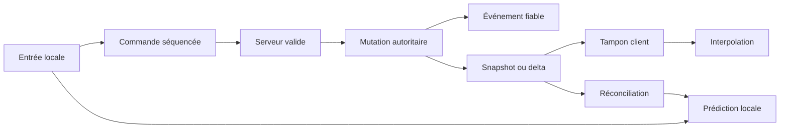

# Synchronisation, autorité et prédiction

> **Repères d’utilisation :** **[PS]** PowerShell 7, **[VSC]** Visual Studio Code, **[APP]** application graphique nommée, **[SORTIE]** résultat à lire sans le saisir, **[LECTURE]** exemple ou structure de référence. Voir la [convention complète](../Volume-0/annexes/CONVENTION-OUTILS-ET-CONTEXTES.md).

## 1. Rôle du chapitre

Une architecture multijoueur ne devient jouable que lorsque les pairs partagent une représentation suffisamment cohérente du monde malgré la latence, la perte, le désordre, les fréquences différentes et les corrections tardives. Synchroniser ne signifie pas copier toute la scène à chaque frame : il faut choisir ce qui relève d’une commande, d’un événement, d’un état répliqué ou d’une approximation locale.

Le chapitre 11 conserve la topologie, les sessions, le lobby, la découverte, l’admission et la reconnexion. Le présent chapitre possède l’autorité détaillée, les messages de gameplay, la réplication, l’interpolation, l’extrapolation, la prédiction client, la réconciliation, le rollback borné, les budgets de bande passante et le diagnostic des désynchronisations. Le chapitre 13 conservera le déploiement, les secrets, le pare-feu, les permissions et le durcissement du serveur dédié.

La règle centrale est la suivante : le serveur décide des conséquences critiques, le client envoie des intentions bornées, la présentation masque la latence sans devenir une seconde autorité, et toute correction conserve une provenance, un tick et une séquence.

## 2. Résultats d’apprentissage

À la fin du chapitre, le lecteur saura :

- distinguer commande, événement, snapshot, delta et état dérivé ;
- attribuer l’autorité d’un nœud sans en faire une permission métier ;
- valider l’émetteur et les arguments d’une RPC ;
- choisir mode de transfert et canal selon la sémantique ;
- configurer `MultiplayerSpawner`, `MultiplayerSynchronizer` et `SceneReplicationConfig` ;
- limiter la réplication par pertinence et visibilité réseau ;
- construire un tampon d’interpolation ;
- borner une extrapolation et son retour à l’état autoritaire ;
- enregistrer les entrées locales pour la prédiction ;
- réconcilier un client à partir d’un acquittement serveur ;
- réserver le rollback aux systèmes déterministes et bornés ;
- quantifier et prioriser les messages ;
- comparer des états par empreinte sans exposer de données sensibles ;
- tester latence, jitter, perte, duplication et réordonnancement ;
- organiser les responsabilités en modes Solo et Studio.

## 3. Niveau de preuve et réserves

Le chapitre est accepté au niveau `static-review`. Les contrats, extraits GDScript, structures de données, scénarios et outils de comparaison sont relus statiquement. Aucun serveur, synchroniseur, spawner, prédicteur, rollback, profil réseau ou gain de bande passante de `Project Asteria` n’est revendiqué comme exécuté.

> **[LECTURE] État de preuve du chapitre — Ne pas saisir.**

```yaml
evidence_level:
  chapter: static_review
  replication_model_executed: false
  rpc_protocol_executed: false
  interpolation_profile_qualified: false
  prediction_and_reconciliation_executed: false
  rollback_executed: false
  latency_loss_campaign_executed: false
  bandwidth_budget_measured: false
  desync_tool_executed: false
  anti_cheat_review_executed: false
  runtime_claimed: false
```

<!-- qa:code-explanation -->

**Explication structurée du bloc :**

- **Statut :** `static_review` décrit une revue documentaire et non une session réseau.
- **Séparation :** réplication, prédiction, rollback et campagne d’altération possèdent des preuves indépendantes.
- **Mesure :** les budgets restent des cibles à qualifier sur builds et plateformes réels.
- **Limite :** les résultats futurs devront conserver captures, traces, profils et versions.

## 4. Prérequis et frontières

Le lecteur doit connaître les contrats de session du chapitre 11, les tests fonctionnels du chapitre 3, l’observabilité du chapitre 5, le profilage CPU du chapitre 6 et les budgets mémoire du chapitre 8.

Le présent chapitre possède :

- l’autorité réseau des objets et commandes ;
- les RPC et messages de gameplay ;
- la réplication de spawn, d’état et d’événements ;
- la pertinence par pair ;
- l’interpolation et l’extrapolation ;
- la prédiction locale et la réconciliation ;
- le rollback borné ;
- les canaux, modes de transfert et budgets de bande passante ;
- les outils de comparaison d’état ;
- les campagnes sous latence, jitter et perte.

Il ne définit ni authentification de production, ni règles pare-feu, ni secrets, ni déploiement, ni mitigation professionnelle des attaques. Il prépare des contrôles applicatifs sans prétendre remplacer le chapitre 13.

## 5. Vocabulaire opérationnel

- **Autorité réseau :** pair autorisé par l’API multijoueur à appeler certaines RPC ou à répliquer un nœud.
- **Autorité métier :** système qui décide si une commande respecte les règles du jeu.
- **Commande :** intention proposée à l’autorité, avec identité, séquence et paramètres bornés.
- **Événement :** fait déjà décidé, transmis pour mise à jour ou présentation.
- **Snapshot :** état autoritaire cohérent associé à un tick.
- **Delta :** différence depuis un état ou une révision connue.
- **Acquittement :** confirmation du dernier élément consommé par l’autorité.
- **Interpolation :** estimation entre deux états autoritaires reçus.
- **Extrapolation :** estimation temporaire au-delà du dernier état reçu.
- **Prédiction :** application locale anticipée d’une entrée avant la réponse serveur.
- **Réconciliation :** correction locale depuis un état serveur puis réapplication des entrées non acquittées.
- **Rollback :** restauration d’un état antérieur puis resimulation déterministe.
- **Pertinence :** décision indiquant quelles données un pair doit recevoir.
- **Quantification :** représentation d’une valeur avec une précision réduite et déclarée.
- **Désynchronisation :** divergence non prévue entre états qui devraient partager les mêmes invariants.

## 6. Modèle général de synchronisation

> **[LECTURE] Flux autoritaire — Ne pas exécuter.**



<!-- qa:code-explanation -->

**Explication structurée du bloc :**

- **Entrée :** le client transforme l’action en commande, pas en résultat final.
- **Autorité :** le serveur valide puis produit la mutation canonique.
- **Distribution :** événements et états utilisent des contrats distincts.
- **Présentation :** interpolation et prédiction restent corrigeables.

## 7. Registre d’autorité

L’autorité réseau d’un nœud est un mécanisme de routage et de contrôle d’appel. Elle ne dispense jamais l’autorité métier de vérifier identité, état de session, cadence, ressources et contexte. Le serveur reste autoritaire sur les conséquences critiques même lorsque le client possède temporairement l’autorité réseau d’un nœud de saisie.

> **[VSC] Visual Studio Code — Créer `config/network/authority_matrix.yaml`.**

```yaml
authority_matrix:
  player_input:
    network_authority: owning_peer
    business_authority: server
    replicated_result: server
  character_state:
    network_authority: server
    business_authority: character_runtime
    presentation: clients
  projectile:
    network_authority: server
    business_authority: combat
    client_prediction: visual_only
  inventory:
    network_authority: server
    business_authority: inventory_service
    replication: events_and_snapshots
  chat:
    network_authority: any_authenticated_peer
    business_authority: moderated_server_path
```

<!-- qa:code-explanation -->

**Explication structurée du bloc :**

- **Colonne réseau :** elle indique qui peut émettre ou répliquer via l’API.
- **Colonne métier :** elle nomme le système qui décide réellement.
- **Résultat :** l’état final critique provient du serveur.
- **Revue :** toute exception doit être justifiée par type de donnée.

## 8. Attribuer l’autorité d’un nœud

`Node.set_multiplayer_authority()` applique par défaut l’identifiant récursivement aux enfants existants. Cette attribution doit être reproduite de façon cohérente sur tous les pairs ; elle n’est pas une identité durable et ne doit pas être déduite d’un nom affiché.

> **[VSC] Visual Studio Code — Créer `src/network/authority_assignment.gd`.**

```gdscript
class_name AuthorityAssignment
extends RefCounted

static func apply_to_player_root(player_root: Node, peer_id: int) -> void:
    assert(peer_id > 0)
    player_root.set_multiplayer_authority(peer_id, true)

static func verify(player_root: Node, expected_peer_id: int) -> bool:
    return player_root.get_multiplayer_authority() == expected_peer_id
```

<!-- qa:code-explanation -->

**Explication structurée du bloc :**

- **Type :** `RefCounted` porte une fonction pure d’orchestration sans devenir un nœud global.
- **Application :** le booléen `true` inclut les enfants existants du joueur.
- **Garde :** un identifiant nul ou négatif est refusé avant attribution.
- **Vérification :** le contrôle compare l’autorité attendue après construction.

## 9. Autorité et apparition

L’autorité doit être déterminée à partir des données de spawn validées par le serveur. Un client ne choisit pas librement l’identifiant autoritaire d’une entité. Le même ordre de construction, le même nom de nœud et la même attribution sont nécessaires pour que les RPC et la réplication ciblent les mêmes chemins.

> **[VSC] Visual Studio Code — Créer `src/network/player_spawn_factory.gd`.**

```gdscript
class_name PlayerSpawnFactory
extends RefCounted

var player_scene: PackedScene

func build(data: Dictionary) -> Node:
    var peer_id: int = int(data.get("peer_id", 0))
    var member_id: String = str(data.get("member_id", ""))
    assert(peer_id > 0)
    assert(not member_id.is_empty())

    var player := player_scene.instantiate()
    player.name = "Player_%d" % peer_id
    player.set("member_id", member_id)
    player.set_multiplayer_authority(peer_id, true)
    return player
```

<!-- qa:code-explanation -->

**Explication structurée du bloc :**

- **Entrées :** `peer_id` et `member_id` sont lus depuis un payload serveur validé.
- **Nom :** un nom déterministe stabilise le `NodePath` partagé.
- **Autorité :** l’attribution intervient avant l’ajout automatique par le spawner.
- **Retour :** le nœud est rendu hors arbre pour laisser `MultiplayerSpawner` l’insérer.

## 10. Commandes, événements et états

Une commande exprime ce que le joueur tente de faire. Un événement exprime ce que l’autorité a accepté. Un état répliqué décrit ce qui est vrai à un tick donné. Les trois catégories ne partagent ni la même fiabilité, ni la même fréquence, ni le même traitement des doublons.

| Catégorie | Exemple | Sens | Traitement |
|---|---|---|---|
| commande | déplacement souhaité | client vers serveur | validation, séquence, débit |
| événement | objet ramassé | serveur vers clients | fiable, idempotent |
| état | position et vitesse | serveur vers clients | fréquent, périssable |
| correction | snapshot autoritaire | serveur vers propriétaire | réconciliation |
| présentation | trace de tir | local ou répliqué | aucun pouvoir métier |

## 11. Enveloppe de commande

> **[LECTURE] Schéma d’une commande — Ne pas saisir.**

```json
{
  "schema": "asteria-command",
  "version": 1,
  "session_generation": 12,
  "member_id": "member_pending",
  "entity_id": "character_pending",
  "client_tick": 18420,
  "sequence": 731,
  "kind": "move",
  "payload": {
    "axis_x_q": 0,
    "axis_y_q": 0,
    "buttons": 0
  }
}
```

<!-- qa:code-explanation -->

**Explication structurée du bloc :**

- **Version :** le schéma permet de refuser un contrat incompatible.
- **Génération :** une commande d’une ancienne reconnexion est rejetée.
- **Séquence :** le serveur détecte doublons, retards et trous.
- **Payload :** les axes sont quantifiés et les boutons bornés.

## 12. RPC d’entrée

Une RPC marquée `any_peer` autorise l’appel distant, mais elle ne valide ni l’identité métier ni le contenu. `multiplayer.get_remote_sender_id()` doit être lu dans le contexte de la RPC et comparé au propriétaire de la commande. Les entrées fréquentes peuvent utiliser un canal séparé et un mode non fiable lorsque la commande suivante remplace naturellement la précédente.

> **[VSC] Visual Studio Code — Créer `src/network/player_command_endpoint.gd`.**

```gdscript
class_name PlayerCommandEndpoint
extends Node

var command_service: PlayerCommandService

@rpc("any_peer", "call_local", "unreliable_ordered", 1)
func submit_move(
    session_generation: int,
    client_tick: int,
    sequence: int,
    axis_q: Vector2i,
    buttons: int
) -> void:
    if not multiplayer.is_server():
        return

    var sender_peer_id := multiplayer.get_remote_sender_id()
    command_service.accept_move(
        sender_peer_id,
        session_generation,
        client_tick,
        sequence,
        axis_q,
        buttons
    )
```

<!-- qa:code-explanation -->

**Explication structurée du bloc :**

- **Annotation :** `any_peer` autorise les clients à proposer l’entrée.
- **Canal :** le canal `1` isole les mouvements des messages fiables.
- **Émetteur :** l’identifiant distant vient du contexte RPC, pas du payload.
- **Délégation :** le nœud réseau transmet à un service métier validant.

## 13. Validation serveur d’une commande

Le serveur valide dans un ordre stable : session, génération, association pair-membre, propriétaire de l’entité, séquence, cadence, plage des valeurs, état du personnage et règle métier. Le refus d’une commande ne doit pas laisser une mutation partielle.

> **[VSC] Visual Studio Code — Créer `src/network/player_command_service.gd`.**

```gdscript
class_name PlayerCommandService
extends RefCounted

const AXIS_LIMIT := 1000
const MAX_SEQUENCE_AHEAD := 128

func accept_move(
    sender_peer_id: int,
    generation: int,
    client_tick: int,
    sequence: int,
    axis_q: Vector2i,
    buttons: int
) -> bool:
    var member := sessions.member_for_peer(sender_peer_id)
    if member == null or member.generation != generation:
        return false
    if not sequence_window.accept(member.member_id, sequence, MAX_SEQUENCE_AHEAD):
        return false
    if abs(axis_q.x) > AXIS_LIMIT or abs(axis_q.y) > AXIS_LIMIT:
        return false

    var command := MoveCommand.new(
        member.member_id, client_tick, sequence, axis_q, buttons
    )
    return movement_authority.commit(command)
```

<!-- qa:code-explanation -->

**Explication structurée du bloc :**

- **Association :** le pair courant est résolu vers le membre de session.
- **Fenêtre :** la séquence est contrôlée avant le coût métier.
- **Plage :** les valeurs quantifiées ne peuvent pas dépasser leur contrat.
- **Commit :** la mutation appartient au système de mouvement autoritaire.

## 14. Tick serveur et séquences

Le tick de simulation autoritaire constitue la référence temporelle des snapshots. Le client peut envoyer son tick local pour corrélation, mais ne dicte pas l’horloge du serveur. Les séquences sont propres à un flux : commande de mouvement, commande d’inventaire et événement fiable ne partagent pas nécessairement le même compteur.

> **[LECTURE] Compteurs d’un membre — Ne pas saisir.**

```yaml
network_counters:
  server_tick: 92014
  member_id: member_pending
  session_generation: 12
  streams:
    movement_input:
      last_received_sequence: 731
      last_applied_sequence: 729
    reliable_command:
      last_received_sequence: 88
      last_applied_sequence: 88
    snapshot:
      last_sent_sequence: 4410
      last_acknowledged_sequence: 4407
```

<!-- qa:code-explanation -->

**Explication structurée du bloc :**

- **Tick :** la simulation serveur possède sa propre progression.
- **Flux :** chaque famille conserve un compteur indépendant.
- **Réception :** recevoir ne signifie pas nécessairement appliquer.
- **Acquittement :** le snapshot sait quelle base le client confirme.

## 15. Modèle de snapshot

Un snapshot minimal contient un tick, une séquence, une base éventuelle, l’état nécessaire au consommateur et l’acquittement des entrées. Les propriétés visuelles dérivables localement n’y figurent pas. Les identifiants d’instance, `RID` et objets `Resource` ne sont pas des données réseau portables.

> **[LECTURE] Snapshot de mouvement — Ne pas saisir.**

```json
{
  "schema": "asteria-movement-snapshot",
  "version": 1,
  "server_tick": 92014,
  "snapshot_sequence": 4410,
  "base_sequence": 4409,
  "entity_id": "character_pending",
  "position_mm": [0, 0, 0],
  "velocity_mm_s": [0, 0, 0],
  "facing_millirad": 0,
  "state_flags": 0,
  "last_processed_input_sequence": 729
}
```

<!-- qa:code-explanation -->

**Explication structurée du bloc :**

- **Unités :** positions et vitesses utilisent des entiers aux unités déclarées.
- **Base :** `base_sequence` identifie le delta éventuel.
- **État :** les drapeaux remplacent des chaînes répétitives.
- **Réconciliation :** la dernière entrée traitée permet de purger l’historique client.

## 16. Snapshot complet et delta

Un snapshot complet sert à l’entrée en pertinence, à la reprise après perte de base et à la correction majeure. Un delta économise de la bande passante seulement si le client possède la base exacte. Une base manquante entraîne une demande de resynchronisation, pas l’application approximative d’un delta.

> **[VSC] Visual Studio Code — Créer `src/network/snapshot_delta.gd`.**

```gdscript
class_name SnapshotDelta
extends RefCounted

static func can_apply(delta: Dictionary, known_sequence: int) -> bool:
    return int(delta.get("base_sequence", -1)) == known_sequence

static func apply(base: Dictionary, delta: Dictionary) -> Dictionary:
    assert(can_apply(delta, int(base["snapshot_sequence"])))
    var result := base.duplicate(true)
    for key in delta.get("changes", {}).keys():
        result[key] = delta["changes"][key]
    result["snapshot_sequence"] = delta["snapshot_sequence"]
    return result
```

<!-- qa:code-explanation -->

**Explication structurée du bloc :**

- **Garde :** le delta exige la séquence de base exacte.
- **Copie :** l’état candidat est détaché avant modification.
- **Changements :** seules les clés déclarées remplacent la base.
- **Résultat :** la nouvelle séquence devient l’identité du snapshot produit.

## 17. Configurer `SceneReplicationConfig`

`REPLICATION_MODE_ALWAYS` envoie régulièrement la propriété avec un transfert non fiable. `REPLICATION_MODE_ON_CHANGE` utilise un transfert fiable lorsqu’un changement est détecté. Le choix doit suivre la sémantique : une position périssable et une équipe rarement modifiée n’ont pas le même contrat.

> **[VSC] Visual Studio Code — Créer `src/network/replication_profile_factory.gd`.**

```gdscript
class_name ReplicationProfileFactory
extends RefCounted

static func movement_profile() -> SceneReplicationConfig:
    var config := SceneReplicationConfig.new()

    var position_path := NodePath(":position")
    config.add_property(position_path)
    config.property_set_spawn(position_path, true)
    config.property_set_replication_mode(
        position_path,
        SceneReplicationConfig.REPLICATION_MODE_ALWAYS
    )

    var team_path := NodePath(":team_id")
    config.add_property(team_path)
    config.property_set_spawn(team_path, true)
    config.property_set_replication_mode(
        team_path,
        SceneReplicationConfig.REPLICATION_MODE_ON_CHANGE
    )
    return config
```

<!-- qa:code-explanation -->

**Explication structurée du bloc :**

- **Position :** elle est envoyée au spawn puis régulièrement en mode non fiable.
- **Équipe :** elle est envoyée au spawn et fiabilisée lors d’un changement.
- **Chemins :** les propriétés sont relatives au `root_path` du synchroniseur.
- **Portée :** le profil ne contient ni `Resource`, ni `RID`, ni identifiant d’instance.

## 18. Régler `MultiplayerSynchronizer`

Les intervalles `replication_interval` et `delta_interval` réduisent la fréquence des modes `ALWAYS` et `ON_CHANGE`. Une valeur nulle utilise chaque frame de traitement réseau. Les seuils doivent être qualifiés par type d’entité et par plateforme, sans les confondre avec la fréquence physique.

> **[VSC] Visual Studio Code — Configurer le synchroniseur de mouvement.**

```gdscript
func configure_movement_synchronizer(
    synchronizer: MultiplayerSynchronizer
) -> void:
    synchronizer.root_path = NodePath("..")
    synchronizer.replication_config = (
        ReplicationProfileFactory.movement_profile()
    )
    synchronizer.replication_interval = 0.05
    synchronizer.delta_interval = 0.10
    synchronizer.public_visibility = false
    synchronizer.visibility_update_mode = (
        MultiplayerSynchronizer.VISIBILITY_PROCESS_NONE
    )
```

<!-- qa:code-explanation -->

**Explication structurée du bloc :**

- **Racine :** les propriétés sont relatives au parent du synchroniseur.
- **Fréquences :** les deux intervalles restent des cibles provisoires à mesurer.
- **Visibilité :** aucun pair ne reçoit l’état avant décision de pertinence.
- **Mode :** la visibilité est recalculée explicitement par l’orchestrateur.

## 19. Apparition avec `MultiplayerSpawner`

Le spawner réplique les nœuds créés par l’autorité. Pour un spawn personnalisé, `spawn_function` est appelée sur tous les pairs et doit retourner un nœud hors arbre ; l’ajout sous `spawn_path` est automatique. `spawn_limit` doit être borné dans un profil produit.

> **[VSC] Visual Studio Code — Créer `src/network/player_spawner.gd`.**

```gdscript
class_name PlayerSpawner
extends MultiplayerSpawner

@export var player_scene: PackedScene

func _ready() -> void:
    spawn_path = NodePath("../Players")
    spawn_limit = 64
    spawn_function = _build_player

func spawn_player(peer_id: int, member_id: String) -> Node:
    assert(multiplayer.is_server())
    return spawn({
        "peer_id": peer_id,
        "member_id": member_id
    })

func _build_player(data: Variant) -> Node:
    var player := player_scene.instantiate()
    var peer_id := int(data["peer_id"])
    player.name = "Player_%d" % peer_id
    player.set("member_id", str(data["member_id"]))
    player.set_multiplayer_authority(peer_id, true)
    return player
```

<!-- qa:code-explanation -->

**Explication structurée du bloc :**

- **Type :** hériter du spawner conserve son contrat de réplication.
- **Limite :** soixante-quatre est un plafond de configuration à requalifier.
- **Autorité :** seul le serveur demande le spawn.
- **Insertion :** la fabrique ne fait aucun `add_child()` manuel.

## 20. Pertinence et visibilité réseau

La visibilité de `MultiplayerSynchronizer` détermine quels pairs reçoivent ses propriétés et peut aussi piloter spawn et despawn lorsque le nœud a été créé par un spawner. Cette visibilité est une décision réseau ; elle ne supprime pas l’existence métier de l’entité et ne doit pas devenir une règle de simulation.

> **[VSC] Visual Studio Code — Créer `src/network/relevance_service.gd`.**

```gdscript
class_name RelevanceService
extends RefCounted

func update_for_peer(
    synchronizer: MultiplayerSynchronizer,
    peer_id: int,
    observer_cell: Vector2i,
    entity_cell: Vector2i,
    radius_cells: int
) -> void:
    var delta := entity_cell - observer_cell
    var visible := (
        abs(delta.x) <= radius_cells
        and abs(delta.y) <= radius_cells
    )
    synchronizer.set_visibility_for(peer_id, visible)
```

<!-- qa:code-explanation -->

**Explication structurée du bloc :**

- **Entrées :** observateur et entité utilisent des cellules logiques stables.
- **Décision :** le rayon est explicite et indépendant de la caméra.
- **Application :** la visibilité est définie pair par pair.
- **Frontière :** la fonction ne désactive ni simulation ni autorité métier.

## 21. Index de pertinence

Recalculer la distance entre chaque pair et chaque entité produit un coût quadratique. Un index spatial partage les entités par cellules, puis la pertinence ne parcourt que les cellules voisines. Les changements de cellule sont coalescés et les mises à jour possèdent un budget.

> **[LECTURE] Profil de pertinence — Ne pas saisir.**

```yaml
relevance_profile:
  schema_version: 1
  grid_cell_meters: 32
  enter_radius_cells: 3
  leave_radius_cells: 4
  max_visibility_changes_per_tick: 128
  priority:
    - owner
    - combat_contact
    - party_member
    - nearby_entity
    - distant_ambient
  stale_visibility_deadline_ms: pending_measurement
```

<!-- qa:code-explanation -->

**Explication structurée du bloc :**

- **Grille :** la taille de cellule appartient au profil et non au code métier.
- **Hystérésis :** le rayon de sortie supérieur évite les oscillations.
- **Budget :** les changements par tick sont bornés.
- **Échéance :** la latence maximale reste à mesurer avant promotion.

## 22. Modes de transfert et canaux

Les messages fiables sont renvoyés jusqu’à acquittement et conservent l’ordre ; ils peuvent donc bloquer le canal. Les états périssables préfèrent souvent `unreliable` ou `unreliable_ordered`. Les canaux isolent les flux indépendants, notamment commande de mouvement, snapshots, événements critiques et discussion.

> **[VSC] Visual Studio Code — Créer `config/network/channels.yaml`.**

```yaml
channels:
  0:
    name: control
    messages:
      - join_accept
      - match_transition
      - inventory_result
    transfer_mode: reliable
  1:
    name: movement_input
    messages:
      - move_command
    transfer_mode: unreliable_ordered
  2:
    name: snapshots
    messages:
      - movement_snapshot
    transfer_mode: unreliable
  3:
    name: chat
    messages:
      - chat_message
    transfer_mode: reliable
```

<!-- qa:code-explanation -->

**Explication structurée du bloc :**

- **Contrôle :** les transitions critiques restent fiables.
- **Mouvement :** une nouvelle commande rend souvent l’ancienne obsolète.
- **Snapshots :** l’ordre est géré par séquence applicative.
- **Isolation :** la discussion ne bloque pas les événements de match.

## 23. Protocole d’événements fiables

Un événement fiable possède un identifiant stable, un tick, une séquence de flux et une clé d’idempotence. Le client applique l’événement une seule fois, même après reconnexion ou répétition. Les effets visuels peuvent être rejoués séparément de la mutation métier.

> **[LECTURE] Événement autoritaire — Ne pas saisir.**

```json
{
  "schema": "asteria-event",
  "version": 1,
  "event_id": "event_pending",
  "stream": "inventory",
  "stream_sequence": 89,
  "server_tick": 92020,
  "member_id": "member_pending",
  "kind": "item_transferred",
  "idempotency_key": "transfer_pending",
  "payload": {
    "item_id": "item_pending",
    "source_id": "container_a",
    "destination_id": "container_b"
  }
}
```

<!-- qa:code-explanation -->

**Explication structurée du bloc :**

- **Identité :** `event_id` distingue l’observation de tout autre événement.
- **Flux :** la séquence est locale au domaine d’inventaire.
- **Idempotence :** la clé relie retries et résultat durable.
- **Payload :** les identifiants métier remplacent chemins et instances.

## 24. Déduplication et ordre

Une fenêtre bornée mémorise les identifiants ou séquences récemment appliqués. Un événement trop ancien peut être ignoré, un trou peut déclencher une resynchronisation et un événement futur au-delà de la fenêtre est refusé. La taille de fenêtre dépend du débit et de la durée maximale de reprise.

> **[VSC] Visual Studio Code — Créer `src/network/sequence_window.gd`.**

```gdscript
class_name SequenceWindow
extends RefCounted

var highest_applied := -1
var recent: Dictionary[int, bool] = {}
var capacity := 256

func should_apply(sequence: int) -> bool:
    if recent.has(sequence):
        return false
    if highest_applied >= 0 and sequence < highest_applied - capacity:
        return false
    return true

func mark_applied(sequence: int) -> void:
    recent[sequence] = true
    highest_applied = maxi(highest_applied, sequence)
    var floor := highest_applied - capacity
    for value in recent.keys():
        if value < floor:
            recent.erase(value)
```

<!-- qa:code-explanation -->

**Explication structurée du bloc :**

- **Doublon :** une séquence déjà vue est rejetée.
- **Ancienneté :** la fenêtre refuse les éléments trop éloignés.
- **Borne :** le dictionnaire est purgé selon la capacité.
- **Portée :** ce composant ne décide pas comment combler un trou.

## 25. Tampon d’interpolation

Le client affiche le monde à un tick légèrement antérieur afin de disposer de deux snapshots. Le délai d’interpolation doit couvrir la majorité du jitter sans ajouter une latence excessive. Il se mesure par profil réseau et peut varier par catégorie d’entité.

> **[LECTURE] État du tampon — Ne pas saisir.**

```yaml
interpolation_buffer:
  entity_id: character_pending
  render_tick: 91998.5
  target_delay_ticks: pending_measurement
  snapshots:
    - server_tick: 91998
      position_mm: [0, 0, 0]
    - server_tick: 91999
      position_mm: [0, 0, 0]
  underflow_policy: bounded_extrapolation
  overflow_policy: discard_oldest_after_render
```

<!-- qa:code-explanation -->

**Explication structurée du bloc :**

- **Décalage :** `render_tick` reste derrière le tick estimé du serveur.
- **Paire :** deux états encadrent le temps affiché.
- **Sous-flux :** l’extrapolation est un repli borné.
- **Nettoyage :** les états déjà rendus sont retirés avec une marge.

## 26. Interpoler une transformation

L’interpolation travaille sur des états autoritaires reçus et ne modifie pas l’état métier local. La rotation utilise un chemin adapté à sa représentation, et le facteur est borné entre zéro et un. Une téléportation ou une correction majeure impose un saut contrôlé plutôt qu’une interpolation à travers le monde.

> **[VSC] Visual Studio Code — Créer `src/network/transform_interpolator.gd`.**

```gdscript
class_name TransformInterpolator
extends RefCounted

static func sample(
    before: Dictionary,
    after: Dictionary,
    render_tick: float
) -> Vector3:
    var tick_a := float(before["server_tick"])
    var tick_b := float(after["server_tick"])
    if tick_b <= tick_a:
        return _to_meters(after["position_mm"])

    var ratio := clampf(
        (render_tick - tick_a) / (tick_b - tick_a),
        0.0,
        1.0
    )
    return _to_meters(before["position_mm"]).lerp(
        _to_meters(after["position_mm"]),
        ratio
    )

static func _to_meters(value: Array) -> Vector3:
    return Vector3(value[0], value[1], value[2]) / 1000.0
```

<!-- qa:code-explanation -->

**Explication structurée du bloc :**

- **Temps :** le facteur provient des ticks, pas du nombre de frames rendues.
- **Garde :** un intervalle nul choisit l’état le plus récent.
- **Borne :** `clampf` interdit une extrapolation accidentelle.
- **Unités :** les millimètres réseau sont convertis explicitement en mètres.

## 27. Extrapolation bornée

Lorsque le tampon manque d’un état futur, le client peut prolonger brièvement position et vitesse. L’extrapolation possède une durée maximale, une vitesse bornée et des règles par état. Au-delà, la présentation gèle, ralentit ou masque l’entité plutôt que d’accumuler une erreur illimitée.

> **[VSC] Visual Studio Code — Créer `src/network/bounded_extrapolator.gd`.**

```gdscript
class_name BoundedExtrapolator
extends RefCounted

static func sample(
    snapshot: Dictionary,
    missing_ticks: float,
    tick_seconds: float,
    max_ticks: float,
    max_speed_m_s: float
) -> Vector3:
    var duration := minf(missing_ticks, max_ticks) * tick_seconds
    var position := Vector3(snapshot["position_mm"][0],
        snapshot["position_mm"][1],
        snapshot["position_mm"][2]) / 1000.0
    var velocity := Vector3(snapshot["velocity_mm_s"][0],
        snapshot["velocity_mm_s"][1],
        snapshot["velocity_mm_s"][2]) / 1000.0
    velocity = velocity.limit_length(max_speed_m_s)
    return position + velocity * duration
```

<!-- qa:code-explanation -->

**Explication structurée du bloc :**

- **Durée :** l’extrapolation est plafonnée en ticks.
- **Vitesse :** une limite empêche un payload aberrant de projeter l’entité.
- **Calcul :** position et vitesse conservent des unités explicites.
- **Retour :** le résultat reste une pose de présentation temporaire.

## 28. Prédiction locale

La prédiction s’applique aux actions dont le joueur contrôle directement l’entrée et dont le modèle local est suffisamment proche du serveur. Le client numérote chaque entrée, l’applique localement, l’envoie au serveur et conserve l’historique jusqu’à acquittement.

> **[LECTURE] Historique d’entrées — Ne pas saisir.**

```yaml
prediction_history:
  entity_id: character_pending
  predicted_tick: 18424
  last_server_ack: 729
  pending_inputs:
    - sequence: 730
      client_tick: 18422
      axis_q: [1000, 0]
      buttons: 0
    - sequence: 731
      client_tick: 18423
      axis_q: [1000, 0]
      buttons: 1
  max_entries: 256
  overflow_policy: request_authoritative_reset
```

<!-- qa:code-explanation -->

**Explication structurée du bloc :**

- **Acquittement :** les entrées antérieures ou égales à `729` sont supprimables.
- **Ordre :** les entrées restantes sont réappliquées par séquence.
- **Borne :** l’historique ne croît pas sans limite.
- **Débordement :** un reset autoritaire remplace une prédiction non fiable.

## 29. Simuler une entrée prédite

La fonction de simulation partagée doit recevoir un état détaché, une entrée et un pas fixe. Elle ne lit ni temps système, ni entrée globale, ni nœud de présentation. Le serveur et le client utilisent la même version qualifiée du modèle pour réduire les corrections.

> **[VSC] Visual Studio Code — Créer `src/network/predicted_movement_model.gd`.**

```gdscript
class_name PredictedMovementModel
extends RefCounted

const AXIS_SCALE := 1000.0

static func step(
    state: Dictionary,
    input: Dictionary,
    tick_seconds: float,
    speed_m_s: float
) -> Dictionary:
    var next := state.duplicate(true)
    var axis := Vector2(
        float(input["axis_q"][0]) / AXIS_SCALE,
        float(input["axis_q"][1]) / AXIS_SCALE
    ).limit_length(1.0)
    var velocity := Vector3(axis.x, 0.0, axis.y) * speed_m_s
    next["position"] = Vector3(state["position"]) + velocity * tick_seconds
    next["velocity"] = velocity
    next["tick"] = int(state["tick"]) + 1
    return next
```

<!-- qa:code-explanation -->

**Explication structurée du bloc :**

- **Pureté :** l’état entrant est copié avant mutation.
- **Quantification :** l’axe entier est reconverti selon une échelle déclarée.
- **Pas :** le tick fixe rend la resimulation reproductible dans son périmètre.
- **Limite :** ce modèle ne remplace pas les collisions serveur complexes.

## 30. Boucle de prédiction client

Le client prélève l’entrée au tick local, crée une commande séquencée, l’ajoute à l’historique, applique le modèle partagé et envoie l’intention. La présentation lit l’état prédit, tandis que les systèmes critiques attendent le résultat serveur.

> **[VSC] Visual Studio Code — Créer `src/network/client_predictor.gd`.**

```gdscript
class_name ClientPredictor
extends RefCounted

var next_sequence := 1
var pending: Array[Dictionary] = []
var predicted_state: Dictionary

func push_input(axis_q: Vector2i, buttons: int) -> Dictionary:
    var command := {
        "sequence": next_sequence,
        "client_tick": int(predicted_state["tick"]),
        "axis_q": [axis_q.x, axis_q.y],
        "buttons": buttons
    }
    next_sequence += 1
    pending.append(command)
    predicted_state = PredictedMovementModel.step(
        predicted_state,
        command,
        1.0 / 60.0,
        6.0
    )
    return command
```

<!-- qa:code-explanation -->

**Explication structurée du bloc :**

- **Séquence :** chaque commande locale reçoit une identité croissante.
- **Historique :** la commande est enregistrée avant envoi.
- **Simulation :** le même modèle produit l’état affiché immédiatement.
- **Réserve :** fréquence et vitesse restent des paramètres à qualifier.

## 31. Réconciliation

À la réception d’un snapshot propriétaire, le client remplace son état de base par l’état serveur, retire les entrées acquittées puis réapplique dans l’ordre les entrées encore en attente. La correction visuelle peut être lissée séparément, mais la base logique doit être exacte.

> **[VSC] Visual Studio Code — Ajouter la réconciliation à `client_predictor.gd`.**

```gdscript
func reconcile(snapshot: Dictionary) -> void:
    var acknowledged := int(snapshot["last_processed_input_sequence"])
    predicted_state = {
        "tick": int(snapshot["server_tick"]),
        "position": _position_from_snapshot(snapshot),
        "velocity": _velocity_from_snapshot(snapshot)
    }

    pending = pending.filter(
        func(command: Dictionary) -> bool:
            return int(command["sequence"]) > acknowledged
    )
    pending.sort_custom(
        func(a: Dictionary, b: Dictionary) -> bool:
            return int(a["sequence"]) < int(b["sequence"])
    )
    for command in pending:
        predicted_state = PredictedMovementModel.step(
            predicted_state,
            command,
            1.0 / 60.0,
            6.0
        )
```

<!-- qa:code-explanation -->

**Explication structurée du bloc :**

- **Base :** l’état serveur remplace toute estimation précédente.
- **Purge :** les commandes acquittées quittent l’historique.
- **Ordre :** les commandes restantes sont triées par séquence.
- **Resimulation :** le client retrouve une estimation issue de la nouvelle base.

## 32. Correction visuelle

Téléporter immédiatement la représentation à chaque petite correction produit des tremblements. Le client mesure l’écart logique, choisit saut, amortissement ou absence de correction visuelle, puis maintient la représentation séparée de l’état prédit utilisé par la prochaine simulation.

> **[LECTURE] Politique de correction — Ne pas saisir.**

```yaml
visual_correction:
  small_error_meters: pending_measurement
  hard_snap_error_meters: pending_measurement
  smoothing_duration_ms: pending_measurement
  policies:
    - condition: teleport_or_respawn
      action: hard_snap
    - condition: error_above_hard_snap
      action: hard_snap
    - condition: error_above_small
      action: damped_offset
    - condition: error_below_small
      action: keep_current_visual
  collision_state_uses_visual_offset: false
```

<!-- qa:code-explanation -->

**Explication structurée du bloc :**

- **Seuils :** les valeurs restent à mesurer sur scénarios réels.
- **Téléportation :** les changements discontinus ne sont pas interpolés.
- **Découplage :** l’offset visuel ne modifie pas collision ni autorité.
- **Confort :** l’amortissement traite uniquement la présentation.

## 33. Rollback borné

Le rollback est pertinent lorsque plusieurs acteurs interagissent sur un modèle déterministe et que la fenêtre historique reste maîtrisable. Il exige snapshots fréquents, entrées ordonnées, simulation sans dépendances non déterministes et coût de resimulation compatible avec le budget. Il n’est pas une option automatique pour tout jeu.

> **[LECTURE] Contrat de rollback — Ne pas saisir.**

```yaml
rollback_contract:
  scope: combat_arena_pending
  fixed_tick_hz: 60
  history_ticks: pending_measurement
  state_schema_version: 1
  deterministic_components:
    - transforms_quantized
    - combat_cooldowns
    - hitboxes
    - local_rng_state
  excluded_components:
    - particles
    - audio
    - camera
    - navigation_queries
    - asynchronous_loading
  maximum_resimulation_ms: pending_measurement
```

<!-- qa:code-explanation -->

**Explication structurée du bloc :**

- **Périmètre :** le rollback vise une arène identifiée, pas le monde entier.
- **État :** seules les composantes déterministes et nécessaires sont capturées.
- **Exclusions :** présentation et tâches asynchrones ne sont pas resimulées.
- **Budget :** la fenêtre dépend d’un coût maximal à mesurer.

## 34. Anneau d’états

Un anneau indexé par tick conserve les snapshots nécessaires à la fenêtre. Lorsqu’un tick sort de la capacité, il est écrasé. Toute restauration vérifie version, tick et intégrité avant de remplacer l’état actif.

> **[VSC] Visual Studio Code — Créer `src/network/state_ring_buffer.gd`.**

```gdscript
class_name StateRingBuffer
extends RefCounted

var capacity: int
var entries: Array[Dictionary]

func _init(p_capacity: int) -> void:
    assert(p_capacity > 0)
    capacity = p_capacity
    entries.resize(capacity)

func store(tick: int, state: Dictionary) -> void:
    entries[posmod(tick, capacity)] = {
        "tick": tick,
        "state": state.duplicate(true)
    }

func load_tick(tick: int) -> Dictionary:
    var entry: Dictionary = entries[posmod(tick, capacity)]
    if entry.is_empty() or int(entry["tick"]) != tick:
        return {}
    return Dictionary(entry["state"]).duplicate(true)
```

<!-- qa:code-explanation -->

**Explication structurée du bloc :**

- **Capacité :** l’anneau possède une taille obligatoire.
- **Index :** `posmod` stabilise l’accès même pour une arithmétique signée.
- **Copie :** les snapshots sont détachés à l’écriture et à la lecture.
- **Absence :** un tick écrasé renvoie un dictionnaire vide explicite.

## 35. Déterminisme et RNG

Un rollback ne doit pas dépendre du générateur pseudo-aléatoire global. Chaque système resimulé conserve un état RNG local dans son snapshot. Les calculs sensibles privilégient entiers, ordres lexicaux stables et itérations dont l’ordre ne dépend pas d’un dictionnaire non contrôlé.

> **[LECTURE] État déterministe minimal — Ne pas saisir.**

```json
{
  "schema": "asteria-rollback-state",
  "version": 1,
  "tick": 92014,
  "actors": [],
  "projectiles": [],
  "cooldowns": [],
  "rng": {
    "combat_state": [0, 0],
    "loot_state": [0, 0]
  },
  "ordering": {
    "actors": "entity_id_ascending",
    "projectiles": "projectile_id_ascending"
  }
}
```

<!-- qa:code-explanation -->

**Explication structurée du bloc :**

- **Version :** le snapshot indique son codec.
- **RNG :** les états locaux sont persistés par système.
- **Ordre :** les collections nomment leur tri déterministe.
- **Portée :** aucune donnée de présentation n’entre dans l’autorité.

## 36. Compensation de latence pour une action ciblée

Une validation de tir peut reconstruire une vue historique bornée du serveur au tick estimé de l’action, puis vérifier portée, cadence et ligne de vue. Le serveur ne remplace jamais son présent par l’horodatage client : il borne la fenêtre, estime le tick admissible et conserve le résultat dans le présent autoritaire.

> **[LECTURE] Requête de validation historique — Ne pas saisir.**

```yaml
lag_compensation_request:
  member_id: member_pending
  command_sequence: 120
  claimed_client_tick: 18420
  estimated_server_tick: pending_server_calculation
  maximum_rewind_ticks: pending_measurement
  origin_mm: [0, 0, 0]
  direction_q: [0, 0, 0]
  weapon_id: weapon_pending
  validation:
    cadence: required
    ownership: required
    historical_pose_available: required
    range: required
    line_of_sight: required
```

<!-- qa:code-explanation -->

**Explication structurée du bloc :**

- **Estimation :** le serveur calcule le tick historique admissible.
- **Borne :** la fenêtre maximale limite abus et mémoire.
- **Provenance :** arme, membre et séquence sont corrélés.
- **Contrôles :** le rewind n’annule aucune règle métier.

## 37. Budget de bande passante

Le budget se calcule par direction, type de message, fréquence, population pertinente et surcharge mesurée. Une estimation documentaire ne devient pas une mesure réseau. Les percentiles et les pics de spawn ou de resynchronisation sont conservés séparément du débit moyen.

> **[VSC] Visual Studio Code — Créer `config/network/bandwidth_budget.yaml`.**

```yaml
bandwidth_budget:
  profile: pending_platform
  directions:
    client_to_server:
      sustained_kbit_s: pending_measurement
      p95_kbit_s: pending_measurement
      burst_kbit: pending_measurement
    server_to_client:
      sustained_kbit_s: pending_measurement
      p95_kbit_s: pending_measurement
      burst_kbit: pending_measurement
  message_families:
    movement_input:
      payload_bytes: measured
      messages_per_second: measured
    movement_snapshot:
      payload_bytes: measured
      relevant_entities: measured
      messages_per_second: measured
    reliable_events:
      payload_bytes: measured
      events_per_minute: measured
```

<!-- qa:code-explanation -->

**Explication structurée du bloc :**

- **Direction :** montant et descendant sont budgétés séparément.
- **Distribution :** débit soutenu, p95 et burst ne sont pas confondus.
- **Famille :** taille et fréquence sont conservées avant agrégation.
- **Statut :** aucune valeur numérique n’est inventée avant capture.

## 38. Quantification

La quantification réduit la taille mais introduit une erreur maximale. Chaque champ déclare unité, plage, résolution, saturation et conversion. Les valeurs hors plage sont refusées ou saturées selon une règle explicite ; un changement de contrat exige une nouvelle version.

> **[LECTURE] Profil de quantification — Ne pas saisir.**

```yaml
quantization:
  position_mm:
    type: signed_integer
    unit: millimeter
    min: -2000000
    max: 2000000
    resolution: 1
    overflow: reject
  velocity_cm_s:
    type: signed_integer
    unit: centimeter_per_second
    min: -32768
    max: 32767
    resolution: 1
    overflow: clamp_and_flag
  facing_millirad:
    type: unsigned_integer
    min: 0
    max: 6283
    wrap: true
```

<!-- qa:code-explanation -->

**Explication structurée du bloc :**

- **Position :** la plage couvre un espace déclaré en millimètres.
- **Vitesse :** la saturation produit aussi un indicateur de diagnostic.
- **Angle :** la valeur est cyclique et possède une unité.
- **Version :** modifier une plage ou résolution change le contrat réseau.

## 39. Priorisation et adaptation

Quand le budget est dépassé, le serveur réduit fréquence ou précision des données non critiques avant de retarder les événements fiables. Le propriétaire, les contacts de combat et les changements majeurs sont prioritaires. L’adaptation possède une hystérésis et une latence maximale par classe.

> **[LECTURE] Politique d’adaptation — Ne pas saisir.**

```yaml
replication_adaptation:
  congestion_signal: measured_queue_and_delivery
  classes:
    critical_event:
      downgrade: forbidden
      maximum_delay_ms: pending_measurement
    owner_correction:
      minimum_rate_hz: pending_measurement
      priority: highest
    nearby_motion:
      rate_hz: pending_measurement
      quantization_profile: near
    distant_motion:
      rate_hz: pending_measurement
      quantization_profile: far
    ambient_state:
      on_change_only: true
  recovery_hysteresis_seconds: pending_measurement
```

<!-- qa:code-explanation -->

**Explication structurée du bloc :**

- **Signal :** l’adaptation repose sur files et livraisons mesurées.
- **Critique :** les événements nécessaires ne sont pas transformés en messages périssables.
- **Distance :** fréquence et précision peuvent varier par pertinence.
- **Retour :** l’hystérésis évite les oscillations de profil.

## 40. Empreintes d’état

Une empreinte de diagnostic porte sur une représentation canonique minimale, jamais sur des objets Godot, des adresses mémoire ou des dictionnaires non triés. Elle sert à localiser un premier tick divergent ; elle ne prouve pas à elle seule la cause.

> **[VSC] Visual Studio Code — Créer `src/network/state_fingerprint.gd`.**

```gdscript
class_name StateFingerprint
extends RefCounted

static func canonical_record(state: Dictionary) -> String:
    var actor_ids: Array = state.get("actors", {}).keys()
    actor_ids.sort()
    var rows: Array[String] = []
    for actor_id in actor_ids:
        var actor: Dictionary = state["actors"][actor_id]
        rows.append("%s|%s|%s|%s" % [
            actor_id,
            actor.get("position_mm", []),
            actor.get("health", 0),
            actor.get("state_flags", 0)
        ])
    return "
".join(rows)

static func sha256_hex(state: Dictionary) -> String:
    return canonical_record(state).sha256_text()
```

<!-- qa:code-explanation -->

**Explication structurée du bloc :**

- **Canonique :** les acteurs sont triés par identifiant stable.
- **Périmètre :** seuls les champs d’autorité utiles sont inclus.
- **Empreinte :** SHA-256 compare des représentations identiques.
- **Diagnostic :** une différence demande ensuite une analyse champ par champ.

## 41. Outil de comparaison d’états

Le comparateur lit deux captures déjà expurgées, vérifie leur schéma, aligne les ticks et affiche les premières différences. Il ne modifie aucune sauvegarde et ne conclut pas automatiquement à une triche.

> **[VSC] Visual Studio Code — Créer `tools/network/compare_states.py`.**

```python
from __future__ import annotations

import json
from pathlib import Path
from typing import Any

def load(path: Path) -> dict[str, Any]:
    data = json.loads(path.read_text(encoding="utf-8"))
    if data.get("schema") != "asteria-state-capture":
        raise ValueError(f"Schéma inattendu: {path}")
    return data

def first_difference(left: dict[str, Any], right: dict[str, Any]) -> str:
    left_ticks = {int(row["tick"]): row for row in left["ticks"]}
    right_ticks = {int(row["tick"]): row for row in right["ticks"]}
    for tick in sorted(set(left_ticks) & set(right_ticks)):
        if left_ticks[tick]["fingerprint"] != right_ticks[tick]["fingerprint"]:
            return f"première divergence au tick {tick}"
    return "aucune divergence dans l’intersection"

if __name__ == "__main__":
    import sys
    if len(sys.argv) != 3:
        raise SystemExit("usage: compare_states.py LEFT.json RIGHT.json")
    print(first_difference(load(Path(sys.argv[1])), load(Path(sys.argv[2]))))
```

<!-- qa:code-explanation -->

**Explication structurée du bloc :**

- **Chargement :** le schéma est validé avant comparaison.
- **Alignement :** les captures sont indexées par tick.
- **Résultat :** l’outil signale la première empreinte divergente.
- **Limite :** l’absence de divergence ne couvre que l’intersection disponible.

## 42. Capture de diagnostic réseau

Une capture locale contient versions, environnement, profil d’altération, compteurs, séquences, ticks et empreintes. Les identités joueur, adresses publiques, jetons et textes libres sont remplacés ou retirés avant partage.

> **[LECTURE] Manifeste de capture — Ne pas saisir.**

```json
{
  "schema": "asteria-network-capture",
  "version": 1,
  "build_id": "pending",
  "protocol_version": "1.0",
  "content_revision": "pending",
  "role": "client_or_server",
  "network_profile": "pending",
  "window": {
    "start_server_tick": 0,
    "end_server_tick": 0
  },
  "counters": {},
  "state_fingerprints": [],
  "privacy": {
    "member_ids_pseudonymized": true,
    "addresses_removed": true,
    "tokens_removed": true
  }
}
```

<!-- qa:code-explanation -->

**Explication structurée du bloc :**

- **Versions :** build, protocole et contenu sont séparés.
- **Fenêtre :** les ticks bornent la capture utile.
- **Compteurs :** les valeurs brutes restent disponibles pour le diagnostic.
- **Confidentialité :** identités, adresses et secrets sont exclus.

## 43. Matrice de tests réseau

Les scénarios couvrent connexion stable, latence constante, jitter, perte, duplication, réordonnancement, burst, déconnexion et reprise. Chaque profil possède un oracle fonctionnel et un oracle de cohérence. Une simulation au niveau message ne remplace pas un test réel de transport et de plateforme.

> **[VSC] Visual Studio Code — Créer `tests/network/network_profiles.yaml`.**

```yaml
profiles:
  - id: stable_local
    latency_ms: 0
    jitter_ms: 0
    loss_percent: 0
    duplicate_percent: 0
    reorder_percent: 0
  - id: moderate_jitter
    latency_ms: pending_measurement
    jitter_ms: pending_measurement
    loss_percent: pending_measurement
    duplicate_percent: 0
    reorder_percent: pending_measurement
  - id: burst_loss
    latency_ms: pending_measurement
    jitter_ms: pending_measurement
    loss_model: burst
    burst_length_packets: pending_measurement
oracles:
  - no_unauthorized_mutation
  - bounded_prediction_error
  - reliable_events_eventually_applied_once
  - interpolation_buffer_recovers
  - reconnect_requires_current_generation
  - fingerprints_converge_after_resync
```

<!-- qa:code-explanation -->

**Explication structurée du bloc :**

- **Profils :** les altérations sont versionnées par scénario.
- **Valeurs :** les seuils non qualifiés restent explicitement en attente.
- **Oracles :** sécurité applicative et convergence sont testées séparément.
- **Limite :** le harness ne prétend pas reproduire tous les réseaux réels.

## 44. File d’altération pour tests

Un double de transport peut retarder, perdre, dupliquer ou réordonner des messages de test avec une graine locale. Il sert aux suites reproductibles du chapitre 3. Il ne remplace pas la validation ENet réelle, les buffers du système, le NAT ni les pilotes de plateforme.

> **[VSC] Visual Studio Code — Créer `tests/network/network_impairment_queue.gd`.**

```gdscript
class_name NetworkImpairmentQueue
extends RefCounted

var rng := RandomNumberGenerator.new()
var scheduled: Array[Dictionary] = []

func configure(seed: int) -> void:
    rng.seed = seed

func enqueue(now_ms: int, payload: PackedByteArray, profile: Dictionary) -> void:
    if rng.randf() < float(profile.get("loss_ratio", 0.0)):
        return
    var jitter := rng.randi_range(
        -int(profile.get("jitter_ms", 0)),
        int(profile.get("jitter_ms", 0))
    )
    scheduled.append({
        "due_ms": now_ms + int(profile.get("latency_ms", 0)) + jitter,
        "payload": payload.duplicate()
    })

func take_due(now_ms: int) -> Array[PackedByteArray]:
    scheduled.sort_custom(
        func(a: Dictionary, b: Dictionary) -> bool:
            return int(a["due_ms"]) < int(b["due_ms"])
    )
    var result: Array[PackedByteArray] = []
    while not scheduled.is_empty() and int(scheduled[0]["due_ms"]) <= now_ms:
        result.append(scheduled.pop_front()["payload"])
    return result
```

<!-- qa:code-explanation -->

**Explication structurée du bloc :**

- **Graine :** le RNG local rend le scénario reproductible.
- **Perte :** un message peut être écarté avant planification.
- **Jitter :** l’échéance varie autour d’une latence déclarée.
- **Limite :** la file reste un double applicatif, pas un émulateur complet.

## 45. Mesures de campagne

La campagne conserve débit, taille de paquet, files, snapshots perdus, temps sous extrapolation, amplitude des corrections, resimulations, événements dupliqués et premier tick divergent. Moyenne, médiane, p95, p99 et maximum sont calculés par scénario.

> **[LECTURE] Colonnes de mesure — Ne pas saisir.**

```csv
run_id,profile,role,server_tick,bytes_sent,bytes_received,snapshot_gap,buffer_depth_ticks,extrapolated_ticks,prediction_error_mm,resimulated_ticks,reliable_duplicate_count,state_fingerprint
pending,stable_local,client,0,0,0,0,0,0,0,0,0,pending
```

<!-- qa:code-explanation -->

**Explication structurée du bloc :**

- **Identité :** chaque ligne appartient à un run et un profil.
- **Débit :** octets envoyés et reçus restent des compteurs bruts.
- **Qualité :** trous, tampon, extrapolation et correction sont séparés.
- **Cohérence :** l’empreinte relie la mesure au tick observé.

## 46. Analyse des distributions

Le script d’analyse regroupe par profil, conserve les échantillons et calcule les percentiles avec une méthode déclarée. Une amélioration moyenne n’est pas acceptée si la queue de corrections, les trous de snapshots ou les désynchronisations s’aggravent.

> **[VSC] Visual Studio Code — Créer `tools/network/analyze_network_runs.py`.**

```python
from __future__ import annotations

import csv
import statistics
from pathlib import Path

def percentile(values: list[float], ratio: float) -> float:
    ordered = sorted(values)
    if not ordered:
        raise ValueError("série vide")
    index = round((len(ordered) - 1) * ratio)
    return ordered[index]

def summarize(path: Path, column: str) -> dict[str, float]:
    with path.open(encoding="utf-8", newline="") as handle:
        rows = list(csv.DictReader(handle))
    values = [float(row[column]) for row in rows]
    return {
        "count": float(len(values)),
        "median": statistics.median(values),
        "p95": percentile(values, 0.95),
        "p99": percentile(values, 0.99),
        "maximum": max(values),
    }
```

<!-- qa:code-explanation -->

**Explication structurée du bloc :**

- **Lecture :** les données brutes CSV sont conservées.
- **Méthode :** le percentile par rang est explicitement implémenté.
- **Sortie :** médiane, p95, p99 et maximum sont distincts.
- **Garde :** une série vide est refusée au lieu de produire zéro.

## 47. Triche et validation applicative

Le client est une source d’intentions non fiable. Le serveur contrôle fréquence, portée, propriétaire, état, ressources, collisions et transitions. La prédiction ne donne aucun droit supplémentaire. Les mécanismes anti-abus de production, l’authentification, le chiffrement et le durcissement restent au chapitre 13.

> **[LECTURE] Porte de validation d’une commande — Ne pas saisir.**

```yaml
command_gate:
  identity:
    current_peer_mapping: required
    current_session_generation: required
  rate:
    per_command_bucket: required
    global_member_bucket: required
  state:
    entity_owned_or_permitted: required
    transition_allowed: required
    resources_available: required
  geometry:
    range_checked: required_when_applicable
    collision_or_line_of_sight_checked: required_when_applicable
  result:
    mutation_prepared_before_commit: required
    rejection_code_structured: required
    security_log_minimized: required
```

<!-- qa:code-explanation -->

**Explication structurée du bloc :**

- **Identité :** le pair courant est lié à la génération active.
- **Débit :** les limites existent par commande et par membre.
- **État :** propriété et transitions sont vérifiées par l’autorité métier.
- **Résultat :** le refus est structuré sans fuite de données sensibles.

## 48. Rapport de compromis

Chaque mécanisme ajoute latence, bande passante, CPU, mémoire, complexité et risque de correction visible. Le rapport compare au moins une baseline sans prédiction, une candidate avec interpolation et une candidate avec prédiction, tout en conservant les mêmes scénarios.

> **[VSC] Visual Studio Code — Créer `reports/network/replication_tradeoff.yaml`.**

```yaml
tradeoff_report:
  scenario: pending
  environment: pending
  candidates:
    - id: baseline_authoritative
      interpolation: false
      prediction: false
      rollback: false
    - id: interpolated_remote
      interpolation: true
      prediction: false
      rollback: false
    - id: predicted_owner
      interpolation: true
      prediction: true
      rollback: false
  evidence:
    raw_measurements: required
    functional_results: required
    desync_captures: required
    bandwidth_capture: required
  decision:
    accepted_candidate: pending_review
    rejected_candidates_preserved: true
    rollback_plan: required
```

<!-- qa:code-explanation -->

**Explication structurée du bloc :**

- **Candidates :** les mécanismes sont activés explicitement.
- **Preuves :** performance, fonctionnel et cohérence restent séparés.
- **Historique :** les résultats défavorables sont conservés.
- **Décision :** aucune candidate n’est promue automatiquement.

## 49. Porte de validation

La promotion exige connexion et reprise du chapitre 11, stabilité fonctionnelle, convergence des états, absence de mutation non autorisée, budgets de bande passante et CPU, corrections visuelles acceptables et revue humaine. Les tests sous latence, jitter et perte utilisent plusieurs répétitions et des profils versionnés.

> **[LECTURE] Porte de promotion — Ne pas saisir.**

```yaml
promotion_gate:
  connectivity:
    join_disconnect_reconnect: required
  functional:
    command_oracles: required
    reliable_events_once: required
    no_unauthorized_mutation: required
  synchronization:
    snapshot_recovery: required
    bounded_prediction_error: required
    fingerprints_converge: required
  performance:
    bandwidth_budget: required
    server_cpu_budget: required
    client_resimulation_budget: required
  quality:
    visual_correction_review: required
    accessibility_review: required
  authority:
    automatic_promotion: forbidden
    human_approval: required
```

<!-- qa:code-explanation -->

**Explication structurée du bloc :**

- **Connexion :** la base du chapitre 11 reste une précondition.
- **Cohérence :** récupération, erreur et convergence sont testées.
- **Performance :** réseau, serveur et resimulation possèdent des budgets.
- **Autorité :** la promotion finale reste humaine.

## 50. Retour arrière

Le rollback de livraison désactive prédiction, interpolation adaptative ou réplication candidate sans invalider le protocole de base. Les clients incompatibles sont refusés selon le chapitre 11. Les tickets actifs, historiques de prédiction et caches de delta sont purgés lors d’un changement de profil.

> **[VSC] Visual Studio Code — Enregistrer `config/network/rollback_plan.yaml`.**

```yaml
rollback_plan:
  change_id: AST-NET-SYNC-PENDING
  restore:
    protocol_version: pending
    replication_profile_version: pending
    channel_profile_version: pending
    prediction_enabled: false
    rollback_enabled: false
  invalidate:
    reconnect_tickets: required_when_protocol_changes
    prediction_histories: required
    delta_bases: required
    interpolation_buffers: required
  verification:
    offline_path: required
    authoritative_baseline: required
    join_disconnect_reconnect: required
    functional_suite: required
    bandwidth_capture: required
  approver: pending
```

<!-- qa:code-explanation -->

**Explication structurée du bloc :**

- **Versions :** protocole, réplication et canaux sont restaurés séparément.
- **Purge :** historiques et bases incompatibles sont supprimés.
- **Vérification :** le chemin autoritaire simple est rejoué.
- **Approbation :** une personne responsable confirme le retour.

## 51. Modes Solo et Studio

### Mode Solo

Une seule personne peut conserver un port de simulation commun au hors ligne et au réseau, puis activer progressivement snapshots, interpolation et prédiction. Elle privilégie d’abord un client et un serveur locaux, des scénarios courts, des compteurs simples et une seule entité prédite. Les décisions sont consignées dans un ADR et chaque mécanisme possède un interrupteur de repli.

### Mode Studio

Le studio sépare au minimum gameplay autoritaire, réseau, client, QA, sécurité, exploitation et expérience utilisateur. Les propriétaires du protocole relisent toute modification de schéma ; les spécialistes QA conservent profils d’altération et captures ; l’équipe sécurité révise les surfaces d’entrée ; les responsables plateforme qualifient transport et budgets. Une revue indépendante est requise avant d’augmenter la fenêtre de rollback ou d’exposer un serveur.

## 52. Diagnostics et corrections
<!-- qa:error-correction-section -->

### 52.1 Accepter une position finale envoyée par le client

**Symptôme ou risque :** Le personnage se téléporte ou traverse les obstacles parce que le serveur applique une position proposée.

**Exemple fautif :**

> **[LECTURE] Exemple fautif — Ne pas appliquer.**

```gdscript
@rpc("any_peer", "reliable")
func set_character_position(value: Vector3) -> void:
    character.global_position = value
```

<!-- qa:code-explanation -->

**Pourquoi cet exemple est fautif :**

- **Erreur :** la RPC transforme directement une valeur cliente en état autoritaire sans propriétaire, cadence ni collision.

**Exemple corrigé :**

> **[LECTURE] Exemple corrigé — Adapter au contrat du projet.**

```gdscript
@rpc("any_peer", "unreliable_ordered", 1)
func submit_move(sequence: int, axis_q: Vector2i) -> void:
    if not multiplayer.is_server():
        return
    movement_authority.accept(
        multiplayer.get_remote_sender_id(),
        sequence,
        axis_q
    )
```

<!-- qa:code-explanation -->

**Pourquoi la correction fonctionne :**

- **Correction :** le client envoie une intention séquencée et le serveur délègue la décision à l’autorité de mouvement.

### 52.2 Confondre autorité réseau et permission métier

**Symptôme ou risque :** Un pair autoritaire sur un nœud peut modifier un inventaire qu’il ne possède pas.

**Exemple fautif :**

> **[LECTURE] Exemple fautif — Ne pas appliquer.**

```gdscript
func can_transfer_item(actor: Node) -> bool:
    return actor.is_multiplayer_authority()
```

<!-- qa:code-explanation -->

**Pourquoi cet exemple est fautif :**

- **Erreur :** l’autorité de nœud devient une autorisation d’inventaire alors que les deux contrats sont indépendants.

**Exemple corrigé :**

> **[LECTURE] Exemple corrigé — Adapter au contrat du projet.**

```gdscript
func can_transfer_item(member_id: String, item_id: String) -> bool:
    return inventory_permissions.can_transfer(
        member_id,
        item_id
    )
```

<!-- qa:code-explanation -->

**Pourquoi la correction fonctionne :**

- **Correction :** le droit est calculé par le système propriétaire à partir d’identifiants métier.

### 52.3 Utiliser le fiable pour chaque snapshot

**Symptôme ou risque :** Une perte retarde tous les états suivants et la correction arrive en bloc.

**Exemple fautif :**

> **[LECTURE] Exemple fautif — Ne pas appliquer.**

```gdscript
@rpc("authority", "call_remote", "reliable", 0)
func receive_snapshot(snapshot: Dictionary) -> void:
    buffer.push(snapshot)
```

<!-- qa:code-explanation -->

**Pourquoi cet exemple est fautif :**

- **Erreur :** les états périssables partagent un flux fiable et accumulent une latence de tête de ligne.

**Exemple corrigé :**

> **[LECTURE] Exemple corrigé — Adapter au contrat du projet.**

```gdscript
@rpc("authority", "call_remote", "unreliable", 2)
func receive_snapshot(snapshot: Dictionary) -> void:
    if snapshot_sequence.accept(snapshot):
        buffer.push(snapshot)
```

<!-- qa:code-explanation -->

**Pourquoi la correction fonctionne :**

- **Correction :** le snapshot utilise un canal non fiable et une séquence applicative élimine les états obsolètes.

### 52.4 Appliquer un delta sans sa base

**Symptôme ou risque :** Le client reconstruit un état impossible après la perte d’un snapshot.

**Exemple fautif :**

> **[LECTURE] Exemple fautif — Ne pas appliquer.**

```gdscript
func apply_delta(delta: Dictionary) -> void:
    current_state.merge(delta["changes"], true)
```

<!-- qa:code-explanation -->

**Pourquoi cet exemple est fautif :**

- **Erreur :** aucune vérification ne relie le delta à la séquence possédée par le client.

**Exemple corrigé :**

> **[LECTURE] Exemple corrigé — Adapter au contrat du projet.**

```gdscript
func apply_delta(delta: Dictionary) -> bool:
    if int(delta["base_sequence"]) != current_sequence:
        request_full_snapshot()
        return false
    current_state = SnapshotDelta.apply(current_state, delta)
    current_sequence = int(delta["snapshot_sequence"])
    return true
```

<!-- qa:code-explanation -->

**Pourquoi la correction fonctionne :**

- **Correction :** une base absente déclenche une resynchronisation complète au lieu d’une fusion approximative.

### 52.5 Interpoler l’état logique

**Symptôme ou risque :** Les collisions et règles locales dépendent d’une pose retardée destinée au rendu.

**Exemple fautif :**

> **[LECTURE] Exemple fautif — Ne pas appliquer.**

```gdscript
func _physics_process(_delta: float) -> void:
    global_position = interpolation_buffer.sample()
    combat_state.position = global_position
```

<!-- qa:code-explanation -->

**Pourquoi cet exemple est fautif :**

- **Erreur :** la présentation interpolée devient la source de l’autorité locale et décale les règles.

**Exemple corrigé :**

> **[LECTURE] Exemple corrigé — Adapter au contrat du projet.**

```gdscript
func _process(_delta: float) -> void:
    visual_root.global_position = interpolation_buffer.sample()

func authoritative_position() -> Vector3:
    return replicated_state.position
```

<!-- qa:code-explanation -->

**Pourquoi la correction fonctionne :**

- **Correction :** la représentation visuelle est séparée de l’état autoritaire consommé par les règles.

### 52.6 Extrapoler sans limite

**Symptôme ou risque :** Une entité continue de traverser la carte pendant une coupure prolongée.

**Exemple fautif :**

> **[LECTURE] Exemple fautif — Ne pas appliquer.**

```gdscript
func render_position(snapshot: Dictionary, missing_ticks: float) -> Vector3:
    return snapshot.position + snapshot.velocity * missing_ticks
```

<!-- qa:code-explanation -->

**Pourquoi cet exemple est fautif :**

- **Erreur :** durée, unité et vitesse ne possèdent aucune borne.

**Exemple corrigé :**

> **[LECTURE] Exemple corrigé — Adapter au contrat du projet.**

```gdscript
func render_position(snapshot: Dictionary, missing_ticks: float) -> Vector3:
    return BoundedExtrapolator.sample(
        snapshot,
        missing_ticks,
        1.0 / 60.0,
        max_extrapolation_ticks,
        max_speed_m_s
    )
```

<!-- qa:code-explanation -->

**Pourquoi la correction fonctionne :**

- **Correction :** l’extrapolateur borne durée et vitesse avec des unités déclarées.

### 52.7 Purger toutes les entrées à chaque correction

**Symptôme ou risque :** Les contrôles paraissent mous parce que des commandes non traitées disparaissent.

**Exemple fautif :**

> **[LECTURE] Exemple fautif — Ne pas appliquer.**

```gdscript
func reconcile(snapshot: Dictionary) -> void:
    predicted_state = snapshot
    pending_inputs.clear()
```

<!-- qa:code-explanation -->

**Pourquoi cet exemple est fautif :**

- **Erreur :** les entrées postérieures à l’acquittement serveur sont perdues.

**Exemple corrigé :**

> **[LECTURE] Exemple corrigé — Adapter au contrat du projet.**

```gdscript
func reconcile(snapshot: Dictionary) -> void:
    var acknowledged := int(snapshot["last_processed_input_sequence"])
    predicted_state = snapshot_to_state(snapshot)
    pending_inputs = pending_inputs.filter(
        func(input: Dictionary) -> bool:
            return int(input["sequence"]) > acknowledged
    )
    replay_pending_inputs()
```

<!-- qa:code-explanation -->

**Pourquoi la correction fonctionne :**

- **Correction :** seules les entrées acquittées sont retirées et les autres sont resimulées.

### 52.8 Mettre des `Resource` dans le synchroniseur

**Symptôme ou risque :** Les pairs reçoivent des valeurs absentes ou incompatibles pour un équipement.

**Exemple fautif :**

> **[LECTURE] Exemple fautif — Ne pas appliquer.**

```gdscript
@export var equipped_definition: ItemDefinition

func configure(sync: MultiplayerSynchronizer) -> void:
    sync.replication_config.add_property(
        NodePath(":equipped_definition")
    )
```

<!-- qa:code-explanation -->

**Pourquoi cet exemple est fautif :**

- **Erreur :** `MultiplayerSynchronizer` ne prend pas en charge les propriétés de type `Object` comme `Resource`.

**Exemple corrigé :**

> **[LECTURE] Exemple corrigé — Adapter au contrat du projet.**

```gdscript
@export var equipped_item_id: StringName

func configure(sync: MultiplayerSynchronizer) -> void:
    sync.replication_config.add_property(
        NodePath(":equipped_item_id")
    )
```

<!-- qa:code-explanation -->

**Pourquoi la correction fonctionne :**

- **Correction :** un identifiant stable et sérialisable remplace l’objet propre à la session.

### 52.9 Ajouter manuellement le nœud retourné par `spawn_function`

**Symptôme ou risque :** Le joueur apparaît deux fois ou le spawner signale une structure incohérente.

**Exemple fautif :**

> **[LECTURE] Exemple fautif — Ne pas appliquer.**

```gdscript
func _build_player(data: Dictionary) -> Node:
    var player := player_scene.instantiate()
    players.add_child(player)
    return player
```

<!-- qa:code-explanation -->

**Pourquoi cet exemple est fautif :**

- **Erreur :** la fabrique insère le nœud alors que `MultiplayerSpawner` réalise déjà cette opération.

**Exemple corrigé :**

> **[LECTURE] Exemple corrigé — Adapter au contrat du projet.**

```gdscript
func _build_player(data: Dictionary) -> Node:
    var player := player_scene.instantiate()
    player.name = "Player_%d" % int(data["peer_id"])
    return player
```

<!-- qa:code-explanation -->

**Pourquoi la correction fonctionne :**

- **Correction :** la fabrique renvoie un nœud hors arbre avec un nom déterministe.

### 52.10 Conclure à une triche depuis une empreinte différente

**Symptôme ou risque :** Un joueur est sanctionné automatiquement après un seul hash divergent.

**Exemple fautif :**

> **[LECTURE] Exemple fautif — Ne pas appliquer.**

```gdscript
if client_fingerprint != server_fingerprint:
    ban_member(member_id)
```

<!-- qa:code-explanation -->

**Pourquoi cet exemple est fautif :**

- **Erreur :** une empreinte localise une divergence mais ne prouve ni la cause, ni l’intention, ni la responsabilité.

**Exemple corrigé :**

> **[LECTURE] Exemple corrigé — Adapter au contrat du projet.**

```gdscript
if client_fingerprint != server_fingerprint:
    desync_reports.open_case(
        member_id,
        server_tick,
        client_fingerprint,
        server_fingerprint
    )
    request_authoritative_resync(member_id)
```

<!-- qa:code-explanation -->

**Pourquoi la correction fonctionne :**

- **Correction :** la divergence ouvre un diagnostic expurgé et déclenche une resynchronisation, sans sanction automatique.

## 53. Références techniques officielles

- [Godot 4.7 — API multijoueur de haut niveau](https://docs.godotengine.org/en/4.7/tutorials/networking/high_level_multiplayer.html)
- [Godot 4.7 — `MultiplayerAPI`](https://docs.godotengine.org/en/4.7/classes/class_multiplayerapi.html)
- [Godot 4.7 — `MultiplayerPeer`](https://docs.godotengine.org/en/4.7/classes/class_multiplayerpeer.html)
- [Godot 4.7 — `Node`](https://docs.godotengine.org/en/4.7/classes/class_node.html)
- [Godot 4.7 — `MultiplayerSynchronizer`](https://docs.godotengine.org/en/4.7/classes/class_multiplayersynchronizer.html)
- [Godot 4.7 — `SceneReplicationConfig`](https://docs.godotengine.org/en/4.7/classes/class_scenereplicationconfig.html)
- [Godot 4.7 — `MultiplayerSpawner`](https://docs.godotengine.org/en/4.7/classes/class_multiplayerspawner.html)
- [Godot 4.7 — `SceneMultiplayer`](https://docs.godotengine.org/en/4.7/classes/class_scenemultiplayer.html)

## 54. Synthèse opérationnelle pour `Project Asteria`

`Project Asteria` retient un serveur autoritaire pour les conséquences de gameplay. Les clients envoient des commandes séquencées et bornées ; le pair réseau courant ne remplace ni l’identité durable ni les permissions métier. Les événements critiques utilisent des flux fiables et idempotents, tandis que les snapshots de mouvement restent périssables, séquencés et séparés par canal.

Les entités apparaissent par `MultiplayerSpawner`, reçoivent une autorité déterministe et exposent uniquement des propriétés sérialisables dans `MultiplayerSynchronizer`. La pertinence est calculée par pair sans devenir une règle d’existence du monde. Les clients distants sont interpolés ; le propriétaire peut être prédit puis réconcilié à partir de la dernière entrée acquittée. L’extrapolation et le rollback restent bornés par des profils à qualifier.

La promotion exigera des campagnes répétées sous latence, jitter, perte, duplication et réordonnancement, des budgets CPU et bande passante, des captures expurgées, des empreintes convergentes, une revue des corrections visuelles et l’absence de mutation non autorisée. Tant que ces preuves ne sont pas produites, le chapitre demeure une architecture documentaire relue au niveau `static-review`.
