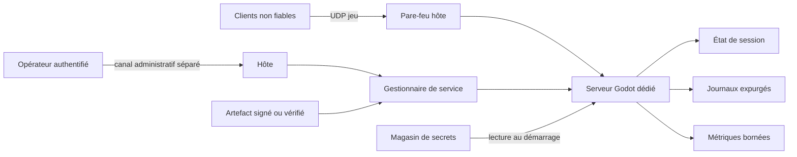

# Serveurs dédiés et sécurité réseau

> **Repères d’utilisation :** **[PS]** PowerShell 7, **[VSC]** Visual Studio Code, **[APP]** application graphique nommée, **[DCK]** Docker Desktop, **[WSL]** terminal Linux ou WSL, **[DCT]** terminal dans un conteneur, **[SORTIE]** résultat à lire sans le saisir, **[LECTURE]** exemple ou structure de référence. Voir la [convention complète](../Volume-0/annexes/CONVENTION-OUTILS-ET-CONTEXTES.md).
## 1. Rôle du chapitre

Le chapitre 12 a défini l’autorité, la réplication, la prédiction et les contrôles applicatifs. Le présent chapitre transforme cette architecture en service exploitable : un processus serveur distinct, démarré sans interface graphique, configuré hors du package, limité par le système d’exploitation, supervisé, journalisé et capable de refuser proprement de nouvelles sessions.

La sécurité réseau ne repose pas sur une fonction unique. Elle combine réduction de surface, moindre privilège, admission explicite, validation des messages, quotas, séparation des secrets, journalisation expurgée, mises à jour réversibles et procédures d’incident. Le chapitre 14 conservera la chaîne CI/CD générale, les matrices de plateformes et la gouvernance globale des artefacts.

Ce chapitre ne constitue pas un audit professionnel de sécurité, un test d’intrusion ni une certification. Il prépare des contrats et des configurations à vérifier dans un environnement isolé et autorisé.

## 2. Résultats d’apprentissage

À la fin du chapitre, le lecteur saura :

- produire un export dédié ou lancer un build headless ;
- séparer le processus serveur du rôle de joueur ;
- charger une configuration validée sans embarquer de secret ;
- limiter l’identité système, les chemins accessibles et les interfaces réseau ;
- créer des règles pare-feu ciblées pour le transport réellement utilisé ;
- superviser le serveur avec systemd ou un conteneur non privilégié ;
- fermer l’admission avant un arrêt ou une mise à jour ;
- authentifier les pairs avant leur entrée dans la partie ;
- conserver `allow_object_decoding` désactivé pour les sources non fiables ;
- appliquer limites de taille, cadence, concurrence et coût par pair ;
- distinguer santé du processus, disponibilité et aptitude à recevoir des joueurs ;
- journaliser sans exposer tickets, secrets ou données personnelles ;
- préparer rollback, rotation des secrets et réponse aux incidents ;
- organiser les responsabilités en modes Solo et Studio.

## 3. Niveau de preuve et réserves

> **[LECTURE] État de preuve du chapitre — Ne pas saisir.**

```yaml
evidence_level:
  chapter: static_review
  dedicated_export_produced: false
  isolated_host_provisioned: false
  firewall_rules_applied: false
  systemd_service_started: false
  container_image_built: false
  authentication_campaign_executed: false
  abuse_and_dos_tests_executed: false
  vulnerability_scan_executed: false
  incident_drill_executed: false
  runtime_claimed: false
```

<!-- qa:code-explanation -->

**Explication structurée du bloc :**

- **Statut :** `static_review` décrit la cohérence documentaire, pas un serveur public.
- **Indépendance :** build, hôte, pare-feu, service, conteneur et campagne d’abus possèdent des preuves distinctes.
- **Autorisation :** tout scan ou test offensif futur doit viser un environnement isolé et explicitement autorisé.
- **Limite :** aucune conformité réglementaire ou résistance à une attaque réelle n’est déduite de ce chapitre.

## 4. Prérequis et frontières

Le lecteur doit connaître les sessions et la reconnexion du chapitre 11, la synchronisation du chapitre 12, la journalisation du chapitre 5, les tests de régression du chapitre 3 et les sauvegardes du Livre II.

Le chapitre possède le build serveur, le bootstrap d’exploitation, la configuration d’instance, l’identité système, les secrets, le pare-feu, l’admission, les limites d’abus, la supervision, le drainage, les mises à jour réversibles et la réponse aux incidents.

Le chapitre 14 possède la CI/CD générale, les branches, tags, matrices de plateformes, signatures automatisées et politiques de rétention des artefacts. Le présent chapitre ne montre qu’un script d’export local et des contrôles de promotion nécessaires au serveur.

## 5. Vocabulaire opérationnel

- **Serveur dédié :** processus sans joueur local, responsable de l’état autoritaire d’une ou plusieurs sessions.
- **Headless :** exécution avec pilote d’affichage headless et audio factice, sans fenêtre.
- **Plan de données :** trafic de jeu entre clients et serveur.
- **Plan de contrôle :** administration, déploiement, santé, métriques et incidents ; il ne doit pas être exposé comme le port de jeu.
- **Admission :** décision d’autoriser un pair authentifié à rejoindre une session donnée.
- **Secret :** donnée dont la divulgation permet une usurpation, un accès ou une dégradation de sécurité.
- **Drainage :** refus des nouvelles admissions pendant que les sessions existantes se terminent ou migrent.
- **Readiness :** capacité actuelle à accepter du trafic utile.
- **Liveness :** indication que le processus progresse encore.
- **Fail closed :** refus contrôlé lorsque l’identité, la configuration ou la preuve requise manque.
- **Surface d’attaque :** ensemble des interfaces, fonctionnalités, formats et dépendances accessibles à un acteur non fiable.
- **Défense en profondeur :** superposition de contrôles indépendants afin qu’une erreur locale ne suffise pas à compromettre le service.

## 6. Architecture d’exploitation

> **[LECTURE] Flux d’exploitation et de confiance — Ne pas exécuter.**



<!-- qa:code-explanation -->

**Explication structurée du bloc :**

- **Entrée :** seul le port de jeu déclaré traverse le pare-feu vers le processus.
- **Séparation :** administration, secrets et artefacts n’empruntent pas le protocole de gameplay.
- **Autorité :** le gestionnaire de service démarre et arrête le serveur sous une identité dédiée.
- **Sorties :** journaux et métriques sont expurgés et ne deviennent pas des commandes gameplay.

## 7. Modèle de menaces minimal

> **[VSC] Visual Studio Code — Créer `config/server/threat_model.yaml`.**

```yaml
assets:
  - authoritative_world_state
  - session_admission
  - player_identity_bindings
  - server_signing_material
  - incident_evidence
actors:
  - unauthenticated_remote_peer
  - authenticated_abusive_peer
  - compromised_operator_account
  - vulnerable_dependency
  - accidental_misconfiguration
trust_boundaries:
  - public_udp_socket
  - authentication_callback
  - host_filesystem
  - deployment_channel
  - log_and_metric_sinks
```

<!-- qa:code-explanation -->

**Explication structurée du bloc :**

- **Actifs :** l’état autoritaire et l’admission sont protégés avant les performances ou le confort.
- **Acteurs :** le modèle inclut l’erreur opérationnelle et la dépendance vulnérable, pas seulement un attaquant distant.
- **Frontières :** chaque passage de confiance doit posséder validation, journalisation et refus.
- **Usage :** ce fichier lance la revue de risques ; il ne prouve pas que les menaces sont mitigées.

## 8. Registre des surfaces exposées

> **[VSC] Visual Studio Code — Créer `config/server/exposure_registry.yaml`.**

```yaml
exposures:
  gameplay_udp:
    bind: "0.0.0.0"
    port: 24570
    audience: public_clients
    protocol: enet_udp
  admin_shell:
    bind: private_management_network
    audience: operators_only
    protocol: ssh_or_provider_console
  metrics:
    bind: "127.0.0.1"
    audience: local_collector
    protocol: file_or_local_socket
forbidden:
  - public_debugger
  - public_editor
  - public_database_port
  - public_secret_endpoint
```

<!-- qa:code-explanation -->

**Explication structurée du bloc :**

- **Inventaire :** chaque interface possède protocole, adresse d’écoute et public attendu.
- **Plan de contrôle :** l’administration ne partage pas le port UDP de jeu.
- **Réduction :** éditeur, débogueur, base de données et secrets restent hors exposition publique.
- **Revue :** toute nouvelle écoute réseau doit modifier ce registre avant déploiement.

## 9. Choisir un profil de déploiement

> **[LECTURE] Matrice de profils — Ne pas saisir.**

```yaml
deployment_profiles:
  local_validation:
    host: windows_11
    exposure: loopback_or_lan
    purpose: controlled_two_process_tests
  studio_staging:
    host: linux_vm
    supervisor: systemd
    exposure: isolated_test_network
  production_candidate:
    host: linux_vm_or_container
    supervisor: systemd_or_orchestrator
    exposure: public_udp_through_firewall
    promotion_requires: security_and_failure_campaign
```

<!-- qa:code-explanation -->

**Explication structurée du bloc :**

- **Local :** Windows sert à la validation contrôlée et non à prouver la robustesse publique.
- **Staging :** l’environnement Studio reproduit identité, chemins et supervision sans données réelles.
- **Candidat :** l’exposition publique est conditionnée par une campagne distincte.
- **Parité :** la configuration conserve les mêmes clés mais pas nécessairement les mêmes secrets ni capacités.

## 10. Démarrer un serveur sans rôle de joueur

> **[VSC] Visual Studio Code — Créer `src/server/server_bootstrap.gd`.**

```gdscript
extends Node
class_name ServerBootstrap

func _ready() -> void:
    var dedicated_export := OS.has_feature("dedicated_server")
    var headless_runtime := DisplayServer.get_name() == "headless"
    var requested := "--server" in OS.get_cmdline_user_args()
    if not (dedicated_export or headless_runtime or requested):
        return
    ServerRuntime.start_from_environment()
```

<!-- qa:code-explanation -->

**Explication structurée du bloc :**

- **Détection :** le tag d’export, le pilote headless ou un argument utilisateur peuvent sélectionner le rôle serveur.
- **Séparation :** le serveur ne crée pas automatiquement un joueur local.
- **Entrées :** les arguments après le séparateur moteur sont lus avec `OS.get_cmdline_user_args()`.
- **Effet de bord :** le bootstrap délègue la validation de configuration avant toute écoute réseau.

## 11. Exporter une version dédiée

> **[LECTURE] Réglages à sélectionner dans le preset `Linux Dedicated Server` — Ne pas saisir.**

```yaml
export_preset:
  name: Linux Dedicated Server
  platform: Linux/BSD
  resource_mode: export_as_dedicated_server
  visuals_default: strip_visuals
  client_only_resources: remove_after_dependency_review
  server_required_resources: keep
  embed_pck: false
```

<!-- qa:code-explanation -->

**Explication structurée du bloc :**

- **Mode :** le mode `Export as dedicated server` ajoute le tag `dedicated_server` et remplace les visuels pris en charge par des placeholders.
- **Ressources :** chaque suppression client doit être revue pour éviter une référence serveur introuvable.
- **Secrets :** le preset versionné ne contient ni mot de passe ni clé privée.
- **Validation :** le manifeste exporté doit confirmer la présence des scènes et données autoritaires.

> **[PS] PowerShell 7 — Exporter le preset serveur depuis la racine du projet.**

```powershell
$ErrorActionPreference = "Stop"
$Godot = "C:\Tools\Godot\Godot_v4.7.1-stable_win64.exe"
$Output = "dist/server/asteria_server.x86_64"
& $Godot --headless --path . --export-release "Linux Dedicated Server" $Output
if ($LASTEXITCODE -ne 0) { throw "Échec de l’export serveur" }
```

<!-- qa:code-explanation -->

**Explication structurée du bloc :**

- **Entrée :** le preset et la sortie sont explicites afin d’éviter un export client accidentel.
- **Mode :** `--headless` permet l’automatisation sans ouvrir l’éditeur graphique.
- **Échec :** un code de sortie non nul arrête le script au lieu de publier un artefact incomplet.
- **Frontière :** la signature et la publication automatisée restent au chapitre 14.

## 12. Produire un manifeste d’artefact

> **[PS] PowerShell 7 — Calculer l’empreinte du build serveur.**

```powershell
$Artifact = Resolve-Path "dist/server/asteria_server.x86_64"
$Hash = Get-FileHash -Algorithm SHA256 -Path $Artifact
[ordered]@{
  artifact = $Artifact.Path
  sha256 = $Hash.Hash.ToLowerInvariant()
  engine = "4.7.1-stable"
  role = "dedicated_server"
} | ConvertTo-Json | Set-Content -Encoding utf8 "dist/server/manifest.json"
```

<!-- qa:code-explanation -->

**Explication structurée du bloc :**

- **Empreinte :** le SHA-256 identifie les octets vérifiés sans attester leur absence de vulnérabilité.
- **Provenance :** le moteur et le rôle sont enregistrés avec l’artefact.
- **Sortie :** le manifeste peut être comparé avant installation sur l’hôte.
- **Limite :** la signature cryptographique par une identité de publication est une étape distincte.

## 13. Contrat de configuration d’instance

> **[VSC] Visual Studio Code — Créer `config/server/server_config.schema.yaml`.**

```yaml
server_config:
  bind_ip: string
  gameplay_port: integer_1024_to_65535
  max_clients: integer_1_to_512
  auth_timeout_seconds: number_1_to_30
  shutdown_grace_seconds: number_1_to_120
  state_directory: absolute_path
  log_level: enum_info_warning_error
  build_id: non_empty_string
forbidden_keys:
  - private_key
  - raw_password
  - admin_token
```

<!-- qa:code-explanation -->

**Explication structurée du bloc :**

- **Types :** les bornes empêchent ports privilégiés, capacités absurdes et délais infinis.
- **Chemins :** le répertoire d’état est absolu et fourni par l’exploitation.
- **Secrets :** les valeurs sensibles ne sont pas admises dans le fichier de configuration ordinaire.
- **Version :** `build_id` permet de corréler processus, journaux et incident.

## 14. Lire et valider les variables d’environnement

> **[VSC] Visual Studio Code — Créer `src/server/server_environment.gd`.**

```gdscript
extends RefCounted
class_name ServerEnvironment

static func require_int(name: String, minimum: int, maximum: int) -> int:
    if not OS.has_environment(name):
        push_error("Variable requise absente: %s" % name)
        return -1
    var raw := OS.get_environment(name)
    if not raw.is_valid_int():
        push_error("Variable entière invalide: %s" % name)
        return -1
    var value := raw.to_int()
    if value < minimum or value > maximum:
        push_error("Variable hors bornes: %s" % name)
        return -1
    return value
```

<!-- qa:code-explanation -->

**Explication structurée du bloc :**

- **Entrée :** le nom de variable et ses bornes sont fournis par le contrat de configuration.
- **Retour :** `-1` représente ici un refus de bootstrap ; le port valide commence au-dessus de zéro.
- **Journal :** la valeur brute n’est jamais imprimée, ce qui évite une fuite accidentelle.
- **Échec fermé :** une variable absente, mal formée ou hors borne empêche l’ouverture du socket.

## 15. Séparer configuration et secrets

> **[LECTURE] Organisation des sources de configuration — Ne pas saisir.**

```yaml
configuration_sources:
  committed:
    - config/server/defaults.yaml
    - export_presets.cfg
  host_managed:
    - /etc/asteria/server.env
    - /etc/asteria/policy.yaml
  runtime_credentials:
    - auth_hmac_key
    - telemetry_client_secret
never_committed:
  - .godot/export_credentials.cfg
  - private_keys
  - production_tokens
```

<!-- qa:code-explanation -->

**Explication structurée du bloc :**

- **Versionné :** les valeurs non sensibles et les schémas restent reproductibles.
- **Hôte :** l’opérateur possède les valeurs propres à l’instance.
- **Identifiants :** les secrets sont fournis au démarrage par un mécanisme dédié.
- **Interdiction :** le fichier de credentials d’export et les clés privées ne rejoignent pas le dépôt.

## 16. Lire un secret comme fichier éphémère

> **[VSC] Visual Studio Code — Créer `src/server/credential_reader.gd`.**

```gdscript
extends RefCounted
class_name CredentialReader

static func read_required(name: StringName) -> PackedByteArray:
    var directory := OS.get_environment("CREDENTIALS_DIRECTORY")
    if directory.is_empty():
        push_error("Répertoire de credentials absent")
        return PackedByteArray()
    var path := directory.path_join(String(name))
    var file := FileAccess.open(path, FileAccess.READ)
    if file == null:
        push_error("Credential requis inaccessible")
        return PackedByteArray()
    var value := file.get_buffer(4096)
    if value.is_empty() or not file.eof_reached():
        push_error("Credential vide ou trop volumineux")
        return PackedByteArray()
    return value
```

<!-- qa:code-explanation -->

**Explication structurée du bloc :**

- **Source :** le chemin provient du répertoire de credentials fourni au service.
- **Borne :** la lecture maximale de 4 096 octets refuse un secret anormalement volumineux.
- **Confidentialité :** le nom logique peut être journalisé, jamais le contenu.
- **Retour :** un tableau vide bloque l’initialisation du composant dépendant.

## 17. Identité système et arborescence

> **[LECTURE] Arborescence Linux de référence — Ne pas exécuter.**

```text
/opt/asteria/server/        binaire et PCK en lecture seule
/etc/asteria/               configuration opérateur
/var/lib/asteria/           état durable de service
/var/log/asteria/           optionnel si journald n’est pas la seule sortie
/run/asteria/               sockets et fichiers éphémères
```

<!-- qa:code-explanation -->

**Explication structurée du bloc :**

- **Code :** le binaire est séparé de l’état modifiable.
- **Configuration :** `/etc/asteria` reste administré par l’hôte.
- **Persistance :** `/var/lib/asteria` contient seulement les données durables déclarées.
- **Runtime :** `/run/asteria` disparaît au redémarrage et ne reçoit aucun état canonique.

## 18. Écouter sur l’interface voulue

> **[VSC] Visual Studio Code — Créer `src/server/enet_listener.gd`.**

```gdscript
extends RefCounted
class_name EnetListener

static func create(config: Dictionary) -> ENetMultiplayerPeer:
    var peer := ENetMultiplayerPeer.new()
    peer.set_bind_ip(String(config["bind_ip"]))
    var error := peer.create_server(
        int(config["gameplay_port"]),
        int(config["max_clients"]),
        int(config["max_channels"]),
        int(config["in_bandwidth_bytes_s"]),
        int(config["out_bandwidth_bytes_s"])
    )
    if error != OK:
        push_error("Impossible de créer l’écoute ENet: %s" % error_string(error))
        return null
    return peer
```

<!-- qa:code-explanation -->

**Explication structurée du bloc :**

- **Interface :** `set_bind_ip()` est appliqué avant `create_server()`.
- **Transport :** ENet écoute le port de jeu en UDP ; le pare-feu doit refléter ce choix.
- **Capacité :** clients, canaux et bandes passantes viennent d’une configuration bornée.
- **Retour :** `null` empêche l’affectation d’un pair partiellement créé.

## 19. Règle pare-feu Windows de validation

> **[PS] PowerShell 7 administrateur — Créer une règle UDP ciblée pour le build serveur.**

```powershell
$Program = (Resolve-Path "C:\AsteriaServer\asteria_server.exe").Path
$RuleName = "Asteria-Dedicated-UDP-24570"
Get-NetFirewallRule -Name $RuleName -ErrorAction SilentlyContinue | Remove-NetFirewallRule
New-NetFirewallRule `
  -Name $RuleName `
  -DisplayName "Asteria Dedicated UDP 24570" `
  -Direction Inbound `
  -Action Allow `
  -Protocol UDP `
  -LocalPort 24570 `
  -Program $Program `
  -Profile Private
```

<!-- qa:code-explanation -->

**Explication structurée du bloc :**

- **Cible :** la règle associe protocole, port, programme et profil réseau.
- **Idempotence :** une règle du même nom est remplacée explicitement.
- **Portée :** le profil `Private` convient à la validation LAN, pas à une exposition publique implicite.
- **Contrôle :** le chemin résolu évite une règle attachée à un exécutable inattendu.

## 20. Politique pare-feu Linux

> **[VSC] Visual Studio Code — Créer `ops/firewall/asteria.nft`.**

```text
table inet asteria {
  chain input {
    type filter hook input priority 0; policy drop;
    ct state established,related accept
    iifname "lo" accept
    ip protocol icmp accept
    ip6 nexthdr ipv6-icmp accept
    udp dport 24570 limit rate 2000/second burst 4000 packets accept
  }
}
```

<!-- qa:code-explanation -->

**Explication structurée du bloc :**

- **Défaut :** la chaîne d’exemple refuse le trafic entrant non déclaré.
- **État :** les flux établis et le loopback restent autorisés.
- **Jeu :** seul le port UDP 24570 est exposé dans cette table minimale.
- **Limite :** le débit nftables est un garde grossier à qualifier ; il ne remplace pas les quotas par pair.

## 21. Définir une unité systemd

> **[VSC] Visual Studio Code — Créer `ops/systemd/asteria-server.service`.**

```ini
[Unit]
Description=Project Asteria dedicated server
After=network-online.target
Wants=network-online.target

[Service]
Type=simple
User=asteria
Group=asteria
WorkingDirectory=/opt/asteria/server
ExecStart=/opt/asteria/server/asteria_server.x86_64 --headless -- --server
Restart=on-failure
RestartSec=5s
TimeoutStopSec=30s
StateDirectory=asteria
RuntimeDirectory=asteria
LoadCredential=auth_hmac_key:/etc/asteria/credentials/auth_hmac_key
NoNewPrivileges=yes
PrivateTmp=yes
ProtectSystem=strict
ProtectHome=yes
ReadWritePaths=/var/lib/asteria /run/asteria
RestrictAddressFamilies=AF_UNIX AF_INET AF_INET6

[Install]
WantedBy=multi-user.target
```

<!-- qa:code-explanation -->

**Explication structurée du bloc :**

- **Identité :** le service utilise un compte sans privilège dédié.
- **Cycle :** `Restart=on-failure` redémarre les pannes sans créer une boucle immédiate.
- **Écriture :** le système est protégé en lecture seule hors chemins explicitement autorisés.
- **Réseau :** les familles d’adresses sont limitées à Unix, IPv4 et IPv6.

## 22. Installer et vérifier le service

> **[WSL] Terminal Linux administrateur — Installer puis vérifier l’unité systemd.**

```bash
sudo install -m 0644 ops/systemd/asteria-server.service /etc/systemd/system/
sudo systemctl daemon-reload
sudo systemctl enable --now asteria-server.service
sudo systemctl status --no-pager asteria-server.service
sudo journalctl -u asteria-server.service -n 100 --no-pager
```

<!-- qa:code-explanation -->

**Explication structurée du bloc :**

- **Installation :** l’unité est copiée avec des permissions non exécutables.
- **Activation :** `enable --now` configure le démarrage et lance le service.
- **État :** `systemctl status` vérifie le processus et le dernier code de sortie.
- **Journal :** `journalctl` lit les messages sans ouvrir un endpoint administratif public.

## 23. Rendre les journaux disponibles au superviseur

> **[VSC] Godot — Activer le flush stdout pour l’export serveur.**

```ini
[application]
run/flush_stdout_on_print=true

[debug]
file_logging/enable_file_logging=false
```

<!-- qa:code-explanation -->

**Explication structurée du bloc :**

- **Flush :** les messages stdout d’un build release deviennent visibles pendant l’exécution.
- **Collecte :** journald peut collecter le flux sans attendre la fin du processus.
- **Duplication :** la journalisation fichier est désactivée dans cet exemple pour éviter deux rétentions divergentes.
- **Performance :** la fréquence des logs doit rester bornée, car le flush augmente le coût des impressions.

## 24. Construire une image de conteneur non privilégiée

> **[VSC] Visual Studio Code — Créer `ops/container/Dockerfile.server`.**

```dockerfile
FROM debian:bookworm-slim
RUN useradd --system --uid 10001 --home /nonexistent --shell /usr/sbin/nologin asteria
WORKDIR /opt/asteria/server
COPY --chown=asteria:asteria dist/server/asteria_server.x86_64 ./server
COPY --chown=asteria:asteria dist/server/asteria_server.pck ./server.pck
RUN chmod 0555 ./server && chmod 0444 ./server.pck
USER 10001:10001
EXPOSE 24570/udp
ENTRYPOINT ["/opt/asteria/server/server", "--headless", "--", "--server"]
```

<!-- qa:code-explanation -->

**Explication structurée du bloc :**

- **Base :** l’image minimale ne contient ni éditeur Godot ni outils d’administration.
- **Utilisateur :** le processus ne s’exécute pas comme root.
- **Permissions :** le binaire et le PCK sont non modifiables par le compte runtime.
- **Port :** `EXPOSE` documente l’UDP mais n’ouvre pas à lui seul le pare-feu de l’hôte.

## 25. Exécuter le conteneur avec une surface réduite

> **[WSL] Terminal Linux ou WSL — Lancer le candidat Docker dans un environnement isolé.**

```bash
docker run --rm   --name asteria-server   --read-only   --tmpfs /tmp:rw,noexec,nosuid,size=64m   --cap-drop ALL   --security-opt no-new-privileges:true   --pids-limit 256   --memory 2g   --cpus 2   --mount type=volume,src=asteria-state,dst=/var/lib/asteria   --publish 24570:24570/udp   asteria/server:candidate
```

<!-- qa:code-explanation -->

**Explication structurée du bloc :**

- **Système de fichiers :** `--read-only` limite les écritures aux volumes et tmpfs déclarés.
- **Privilèges :** toutes les capabilities sont retirées et l’escalade est interdite.
- **Ressources :** processus, mémoire et CPU possèdent des plafonds explicites.
- **Réseau :** la publication précise UDP afin d’éviter une ouverture TCP inutile.

## 26. Distinguer liveness et readiness

> **[VSC] Visual Studio Code — Créer `src/server/server_health.gd`.**

```gdscript
extends Node
class_name ServerHealth

var boot_complete := false
var admission_open := false
var last_tick_msec := 0

func mark_tick() -> void:
    last_tick_msec = Time.get_ticks_msec()

func is_live(now_msec: int, maximum_stall_msec: int) -> bool:
    return boot_complete and now_msec - last_tick_msec <= maximum_stall_msec

func is_ready() -> bool:
    return boot_complete and admission_open and not IncidentState.is_degraded()
```

<!-- qa:code-explanation -->

**Explication structurée du bloc :**

- **Liveness :** la progression du tick est comparée à un délai monotone.
- **Readiness :** l’admission et l’état d’incident peuvent rendre le service non prêt sans le tuer.
- **Séparation :** un processus vivant peut refuser de nouveaux joueurs pendant un drainage.
- **Mesure :** le seuil de blocage doit être qualifié selon la fréquence serveur réelle.

## 27. Fermer l’admission avant maintenance

> **[VSC] Visual Studio Code — Créer `src/server/admission_gate.gd`.**

```gdscript
extends RefCounted
class_name AdmissionGate

var accepting := true
var reason := &"open"

func close(new_reason: StringName, peer: MultiplayerPeer) -> void:
    accepting = false
    reason = new_reason
    peer.refuse_new_connections = true

func open(peer: MultiplayerPeer) -> void:
    reason = &"open"
    accepting = true
    peer.refuse_new_connections = false
```

<!-- qa:code-explanation -->

**Explication structurée du bloc :**

- **API :** `refuse_new_connections` bloque les nouvelles connexions au niveau du pair.
- **État :** la raison reste disponible pour journaux et métriques.
- **Drainage :** les connexions existantes ne sont pas expulsées automatiquement.
- **Réouverture :** elle n’intervient qu’après contrôle de readiness et de version.

## 28. Configurer l’authentification de `SceneMultiplayer`

> **[VSC] Visual Studio Code — Créer `src/server/network_authenticator.gd`.**

```gdscript
extends Node
class_name NetworkAuthenticator

func configure(api: SceneMultiplayer, timeout_seconds: float) -> void:
    api.auth_timeout = timeout_seconds
    api.allow_object_decoding = false
    api.auth_callback = _on_auth_payload

func _on_auth_payload(peer_id: int, payload: PackedByteArray) -> void:
    var scene_api := multiplayer as SceneMultiplayer
    var result := AuthEnvelope.decode_and_verify(payload)
    if not result.ok:
        scene_api.disconnect_peer(peer_id)
        return
    if not SessionAdmission.accept(peer_id, result.claims):
        scene_api.disconnect_peer(peer_id)
        return
    if scene_api.complete_auth(peer_id) != OK:
        scene_api.disconnect_peer(peer_id)
```

<!-- qa:code-explanation -->

**Explication structurée du bloc :**

- **Délai :** un pair qui ne termine pas l’authentification reste borné par `auth_timeout`.
- **Décodage :** les objets sérialisés restent interdits pour les données non fiables.
- **Validation :** l’enveloppe et l’admission métier sont vérifiées avant `complete_auth()`.
- **Refus :** une preuve invalide ou une complétion impossible ferme la connexion sans exécuter de payload objet.

## 29. Contrat de ticket d’admission

> **[LECTURE] Enveloppe logique du ticket — Ne pas saisir.**

```json
{
  "format": "asteria-admission",
  "version": 1,
  "session_id": "session_7f2a",
  "member_id": "member_128",
  "audience": "asteria-game-server",
  "issued_at_unix": 0,
  "expires_at_unix": 0,
  "nonce": "opaque-single-use",
  "capabilities": ["play"]
}
```

<!-- qa:code-explanation -->

**Explication structurée du bloc :**

- **Audience :** le ticket est lié au service attendu et ne devient pas un jeton universel.
- **Durée :** émission et expiration limitent la fenêtre d’usage.
- **Rejeu :** un nonce opaque à usage unique permet de détecter une seconde présentation.
- **Permissions :** les capacités sont minimales et vérifiées côté serveur.

## 30. Valider une commande en couches

> **[VSC] Visual Studio Code — Créer `src/server/secure_command_gate.gd`.**

```gdscript
extends RefCounted
class_name SecureCommandGate

static func evaluate(peer_id: int, command: Dictionary) -> Dictionary:
    if not SessionDirectory.is_authenticated(peer_id):
        return {"accepted": false, "reason": &"unauthenticated"}
    if not CommandSchema.is_valid(command):
        return {"accepted": false, "reason": &"invalid_schema"}
    if not SequenceWindow.accept(peer_id, int(command["sequence"])):
        return {"accepted": false, "reason": &"replayed_or_stale"}
    if not RateLimits.consume(peer_id, StringName(command["kind"]), 1.0):
        return {"accepted": false, "reason": &"rate_limited"}
    return DomainAuthorizer.evaluate(peer_id, command)
```

<!-- qa:code-explanation -->

**Explication structurée du bloc :**

- **Ordre :** authentification, schéma, séquence, quota puis autorisation métier sont séparés.
- **Coût :** les contrôles peu coûteux précèdent l’accès au domaine.
- **Retour :** les raisons sont stables et ne divulguent pas de secret interne.
- **Autorité :** seul `DomainAuthorizer` peut accepter l’intention pour la simulation.

## 31. Limiter la taille avant le décodage

> **[VSC] Visual Studio Code — Créer `src/server/bounded_auth_envelope.gd`.**

```gdscript
extends RefCounted
class_name BoundedAuthEnvelope

const MAX_AUTH_BYTES := 4096

static func decode(payload: PackedByteArray) -> Dictionary:
    if payload.is_empty() or payload.size() > MAX_AUTH_BYTES:
        return {"ok": false, "reason": &"size"}
    var text := payload.get_string_from_utf8()
    if text.length() > MAX_AUTH_BYTES:
        return {"ok": false, "reason": &"utf8_size"}
    var value = JSON.parse_string(text)
    if not value is Dictionary:
        return {"ok": false, "reason": &"shape"}
    return {"ok": true, "value": value}
```

<!-- qa:code-explanation -->

**Explication structurée du bloc :**

- **Borne :** la taille binaire est contrôlée avant parsing JSON.
- **UTF-8 :** la représentation textuelle possède aussi une limite.
- **Forme :** seul un dictionnaire est transmis à la validation de schéma.
- **Effet :** un payload excessif est refusé sans allocation non bornée volontaire.

## 32. Quota par pair avec seau de jetons

> **[VSC] Visual Studio Code — Créer `src/server/token_bucket.gd`.**

```gdscript
extends RefCounted
class_name TokenBucket

var capacity: float
var tokens: float
var refill_per_second: float
var last_msec: int

func consume(cost: float, now_msec: int) -> bool:
    var elapsed := maxf(0.0, float(now_msec - last_msec) / 1000.0)
    tokens = minf(capacity, tokens + elapsed * refill_per_second)
    last_msec = now_msec
    if cost <= 0.0 or tokens < cost:
        return false
    tokens -= cost
    return true
```

<!-- qa:code-explanation -->

**Explication structurée du bloc :**

- **État :** capacité, jetons, recharge et temps monotone sont conservés par pair et famille de commande.
- **Recharge :** le délai écoulé augmente les jetons sans dépasser la capacité.
- **Refus :** un coût nul, négatif ou supérieur au solde est rejeté.
- **Limite :** les paramètres doivent être qualifiés par scénario et coût métier.

## 33. Limiter la concurrence des opérations coûteuses

> **[VSC] Visual Studio Code — Créer `src/server/expensive_operation_gate.gd`.**

```gdscript
extends RefCounted
class_name ExpensiveOperationGate

var active_by_peer: Dictionary = {}
const MAX_ACTIVE_PER_PEER := 2

func try_begin(peer_id: int) -> bool:
    var active := int(active_by_peer.get(peer_id, 0))
    if active >= MAX_ACTIVE_PER_PEER:
        return false
    active_by_peer[peer_id] = active + 1
    return true

func finish(peer_id: int) -> void:
    var active := maxi(0, int(active_by_peer.get(peer_id, 0)) - 1)
    if active == 0:
        active_by_peer.erase(peer_id)
    else:
        active_by_peer[peer_id] = active
```

<!-- qa:code-explanation -->

**Explication structurée du bloc :**

- **Concurrence :** le nombre d’opérations coûteuses est borné indépendamment du débit de paquets.
- **Libération :** `finish()` doit être appelé sur succès, refus tardif et exception contrôlée.
- **Nettoyage :** les compteurs nuls sont supprimés pour éviter un registre croissant.
- **Limite :** la constante est un exemple à qualifier, pas une capacité de production.

## 34. Fenêtre anti-rejeu

> **[VSC] Visual Studio Code — Créer `src/server/sequence_window.gd`.**

```gdscript
extends RefCounted
class_name SequenceWindow

var highest := -1
var recent: Dictionary = {}
const WINDOW := 128

func accept(sequence: int) -> bool:
    if sequence < 0 or sequence <= highest - WINDOW or recent.has(sequence):
        return false
    recent[sequence] = true
    highest = maxi(highest, sequence)
    for value in recent.keys():
        if int(value) <= highest - WINDOW:
            recent.erase(value)
    return true
```

<!-- qa:code-explanation -->

**Explication structurée du bloc :**

- **Séquence :** les valeurs négatives, trop anciennes ou déjà vues sont refusées.
- **Désordre :** la fenêtre accepte un réordonnancement borné sans exiger une arrivée strictement croissante.
- **Mémoire :** les anciennes entrées sont retirées à mesure que le maximum avance.
- **Portée :** une fenêtre distincte est nécessaire par session, pair et flux sémantique.

## 35. Budget de coût applicatif

> **[VSC] Visual Studio Code — Créer `config/server/abuse_budget.yaml`.**

```yaml
abuse_budget:
  move_intent:
    tokens_per_second: 30
    burst: 60
    cost: 1
  inventory_query:
    tokens_per_second: 2
    burst: 4
    cost: 1
  path_request:
    tokens_per_second: 0.5
    burst: 2
    cost: 1
  chat_message:
    tokens_per_second: 0.2
    burst: 3
    cost: 1
```

<!-- qa:code-explanation -->

**Explication structurée du bloc :**

- **Familles :** chaque intention reçoit un budget proportionné à son coût et à son usage.
- **Rafale :** le burst absorbe une courte variation sans autoriser une charge soutenue infinie.
- **Unités :** taux, capacité et coût sont déclarés ensemble.
- **Qualification :** ces nombres sont des exemples documentaires à remplacer par des mesures.

## 36. Éviter l’amplification des réponses

> **[VSC] Visual Studio Code — Créer `src/server/response_budget.gd`.**

```gdscript
extends RefCounted
class_name ResponseBudget

const MAX_RESPONSE_BYTES := 16 * 1024
const MAX_ITEMS := 128

static func bound_inventory_page(items: Array, cursor: String) -> Dictionary:
    var page := items.slice(0, mini(items.size(), MAX_ITEMS))
    var response := {"items": page, "next_cursor": cursor}
    var encoded := JSON.stringify(response).to_utf8_buffer()
    if encoded.size() > MAX_RESPONSE_BYTES:
        return {"items": [], "next_cursor": cursor, "truncated": true}
    return response
```

<!-- qa:code-explanation -->

**Explication structurée du bloc :**

- **Amplification :** une petite requête ne peut pas déclencher une réponse arbitrairement grande.
- **Pagination :** le nombre d’éléments possède une borne avant sérialisation.
- **Octets :** la taille finale est contrôlée avec le codec réellement utilisé.
- **Repli :** une réponse tronquée explicite conserve le curseur sans envoyer le payload excessif.

## 37. Expurger les journaux

> **[VSC] Visual Studio Code — Créer `src/server/security_log.gd`.**

```gdscript
extends RefCounted
class_name SecurityLog

const SENSITIVE_KEYS := [&"token", &"password", &"secret", &"ticket", &"authorization"]

static func sanitize(fields: Dictionary) -> Dictionary:
    var result := fields.duplicate(true)
    for key in result.keys():
        if StringName(String(key).to_lower()) in SENSITIVE_KEYS:
            result[key] = "[REDACTED]"
    return result

static func event(kind: StringName, fields: Dictionary) -> void:
    print(JSON.stringify({"kind": kind, "fields": sanitize(fields)}))
```

<!-- qa:code-explanation -->

**Explication structurée du bloc :**

- **Liste :** les clés sensibles sont comparées sans dépendre de la casse.
- **Copie :** le dictionnaire appelant n’est pas modifié pendant la rédaction.
- **Format :** les événements structurés facilitent corrélation et filtrage.
- **Limite :** la rédaction par nom de clé doit être complétée par des schémas autorisés, pas par une liste seule.

## 38. Métriques de sécurité sans cardinalité explosive

> **[LECTURE] Catalogue de métriques bornées — Ne pas saisir.**

```yaml
metrics:
  server_admission_total:
    labels: [result, reason_family]
  command_rejection_total:
    labels: [command_family, reason_family]
  active_authenticated_peers:
    labels: []
  rate_limit_total:
    labels: [command_family]
forbidden_labels:
  - member_id
  - peer_id
  - ip_address
  - raw_error
```

<!-- qa:code-explanation -->

**Explication structurée du bloc :**

- **Cardinalité :** les identifiants individuels ne deviennent pas des labels de métriques.
- **Agrégation :** les raisons sont regroupées en familles stables.
- **Confidentialité :** IP et identité restent dans des preuves d’incident à accès restreint si nécessaires.
- **Séparation :** une métrique alerte ; elle ne sanctionne jamais directement un joueur.

## 39. Préparer un arrêt gracieux

> **[VSC] Visual Studio Code — Créer `src/server/graceful_shutdown.gd`.**

```gdscript
extends Node
class_name GracefulShutdown

var deadline_msec := 0
var active := false

func begin(grace_seconds: int) -> void:
    if active:
        return
    active = true
    Admission.close(&"shutdown", multiplayer.multiplayer_peer)
    deadline_msec = Time.get_ticks_msec() + grace_seconds * 1000
    SessionDirectory.announce_shutdown(deadline_msec)

func _process(_delta: float) -> void:
    if not active:
        return
    if SessionDirectory.is_empty() or Time.get_ticks_msec() >= deadline_msec:
        Persistence.flush_bounded()
        get_tree().quit(0)
```

<!-- qa:code-explanation -->

**Explication structurée du bloc :**

- **Idempotence :** un second signal d’arrêt ne recrée pas une échéance.
- **Drainage :** l’admission ferme avant l’annonce aux sessions existantes.
- **Borne :** l’arrêt se termine au plus tard à l’échéance déclarée.
- **Persistance :** le flush final doit lui-même posséder une durée et une stratégie de récupération.

## 40. Versionner l’état durable du serveur

> **[VSC] Visual Studio Code — Créer `config/server/state_manifest.yaml`.**

```yaml
state_manifest:
  format: asteria-server-state
  version: 1
  build_compatibility:
    minimum_reader: 1
    maximum_reader: 1
  datasets:
    - session_snapshots
    - moderation_decisions
    - idempotency_records
  excluded:
    - runtime_peer_ids
    - transient_rate_limits
    - raw_auth_payloads
```

<!-- qa:code-explanation -->

**Explication structurée du bloc :**

- **Compatibilité :** le lecteur accepté est défini avant une mise à jour.
- **Durable :** seuls les éléments nécessaires à la reprise sont persistés.
- **Éphémère :** pairs, quotas temporaires et payloads bruts sont reconstruits ou supprimés.
- **Migration :** toute évolution de version doit posséder sauvegarde, migration et rollback.

## 41. Sauvegarder avant une mise à jour

> **[WSL] Terminal Linux administrateur — Créer une archive fermée avant déploiement.**

```bash
set -euo pipefail
stamp="$(date -u +%Y%m%dT%H%M%SZ)"
sudo systemctl stop asteria-server.service
sudo tar --xattrs --acls --numeric-owner   -C /var/lib   -czf "/var/backups/asteria/state-${stamp}.tar.gz"   asteria
sudo sha256sum "/var/backups/asteria/state-${stamp}.tar.gz"   > "/var/backups/asteria/state-${stamp}.tar.gz.sha256"
```

<!-- qa:code-explanation -->

**Explication structurée du bloc :**

- **Cohérence :** le service est arrêté avant l’archive de référence.
- **Métadonnées :** ACL, attributs et propriétaires numériques sont conservés.
- **Empreinte :** le fichier de hash permet de détecter une corruption de l’archive.
- **Limite :** la restauration doit être testée sur un hôte isolé avant dépendance opérationnelle.

## 42. Déployer par répertoire versionné

> **[WSL] Terminal Linux administrateur — Installer un candidat sans écraser la version active.**

```bash
set -euo pipefail
build_id="2026.07.26-ch13-candidate"
install_root="/opt/asteria/releases/${build_id}"
sudo install -d -o root -g root -m 0755 "$install_root"
sudo install -o root -g root -m 0555 dist/server/asteria_server.x86_64 "$install_root/server"
sudo install -o root -g root -m 0444 dist/server/asteria_server.pck "$install_root/server.pck"
sudo ln -sfn "$install_root" /opt/asteria/current
```

<!-- qa:code-explanation -->

**Explication structurée du bloc :**

- **Immutabilité :** chaque build possède son propre répertoire en lecture seule.
- **Activation :** le lien `current` sélectionne la version sans modifier les anciens octets.
- **Propriétaire :** root installe le code mais le processus runtime ne peut pas le modifier.
- **Rollback :** le lien peut revenir vers une version conservée après vérification de compatibilité d’état.

## 43. Définir une porte de promotion

> **[LECTURE] Critères de promotion serveur — Ne pas saisir.**

```yaml
promotion_gate:
  artifact_hash_verified: required
  configuration_schema_valid: required
  secret_source_available: required
  isolated_boot_success: required
  admission_failure_cases: required
  rate_limit_cases: required
  graceful_shutdown_case: required
  state_restore_case: required
  unauthorized_scan: forbidden
  authorized_hardening_scan: required
  rollback_rehearsed: required
  human_approval: required
```

<!-- qa:code-explanation -->

**Explication structurée du bloc :**

- **Artefact :** les octets et la configuration sont vérifiés avant le démarrage.
- **Sécurité :** refus d’admission et limites d’abus font partie des cas obligatoires.
- **Autorisation :** un scan n’est accepté que sur une cible explicitement autorisée.
- **Décision :** la promotion finale reste humaine et réversible.

## 44. Matrice de tests de durcissement

> **[VSC] Visual Studio Code — Créer `tests/server/hardening_matrix.yaml`.**

```yaml
scenarios:
  - id: missing_secret
    expected: startup_refused
  - id: invalid_config_port
    expected: startup_refused
  - id: oversized_auth_payload
    expected: peer_disconnected
  - id: replayed_admission_nonce
    expected: admission_refused
  - id: command_rate_burst
    expected: bounded_rejections
  - id: object_encoded_rpc
    expected: decoding_refused
  - id: drain_then_join
    expected: new_connection_refused
  - id: forced_process_exit
    expected: supervisor_restart_bounded
  - id: incompatible_state_version
    expected: update_refused
  - id: rollback_release
    expected: previous_build_restored
```

<!-- qa:code-explanation -->

**Explication structurée du bloc :**

- **Oracles :** chaque scénario possède un résultat contrôlable plutôt qu’une impression générale.
- **Défaillances :** secrets, configuration, payload, rejeu, débit et état sont séparés.
- **Supervision :** le redémarrage doit rester borné et observable.
- **Preuve :** captures et journaux futurs devront être expurgés avant archivage.

## 45. Classer les incidents

> **[VSC] Visual Studio Code — Créer `ops/incidents/severity.yaml`.**

```yaml
severity:
  SEV1:
    examples: [active_compromise, mass_data_exposure, authoritative_state_corruption]
    response: immediate_isolation_and_rotation
  SEV2:
    examples: [sustained_service_unavailability, repeated_auth_bypass_attempt]
    response: incident_team_and_drain
  SEV3:
    examples: [bounded_abuse, single_instance_failure, suspicious_dependency_alert]
    response: investigate_and_patch
  SEV4:
    examples: [configuration_warning, non_exploitable_misconfiguration]
    response: scheduled_correction
```

<!-- qa:code-explanation -->

**Explication structurée du bloc :**

- **Gravité :** l’impact et la portée déterminent la classe, pas le nombre de logs.
- **Action :** chaque classe possède une réponse minimale.
- **Évolution :** un incident peut être reclassé lorsque les faits changent.
- **Prudence :** une alerte ou empreinte différente ne prouve pas une compromission.

## 46. Procédure d’incident

> **[LECTURE] Ordre de réponse à incident — Ne pas exécuter.**

```yaml
incident_runbook:
  - declare_incident_and_owner
  - close_admission_or_isolate_instance
  - preserve_clocks_build_ids_and_logs
  - rotate_exposed_credentials
  - identify_scope_without_destroying_evidence
  - deploy_known_good_or_keep_offline
  - validate_state_before_reopening
  - communicate_confirmed_facts_only
  - document_root_cause_and_actions
  - add_regression_tests
```

<!-- qa:code-explanation -->

**Explication structurée du bloc :**

- **Pilotage :** un responsable et une chronologie sont définis immédiatement.
- **Confinement :** l’admission ferme ou l’instance est isolée avant une investigation longue.
- **Preuves :** horloges, builds et journaux sont préservés sans copier des secrets inutiles.
- **Réouverture :** un build connu et un état validé précèdent le retour du trafic.

## 47. Rotation des secrets

> **[LECTURE] Contrat de rotation — Ne pas saisir.**

```yaml
secret_rotation:
  phases:
    - issue_new_version
    - distribute_to_target_instances
    - accept_old_and_new_during_bounded_overlap
    - switch_signing_to_new
    - revoke_old
    - verify_no_old_use
  invariants:
    - secret_values_never_logged
    - overlap_has_deadline
    - rollback_key_is_not_the_revoked_key
```

<!-- qa:code-explanation -->

**Explication structurée du bloc :**

- **Version :** les secrets possèdent un identifiant de version distinct de leur valeur.
- **Chevauchement :** une courte période bornée évite une coupure brutale.
- **Révocation :** l’ancienne version cesse d’être acceptée après l’échéance.
- **Rollback :** revenir au code précédent ne doit pas réactiver un secret compromis.

## 48. Conserver une matrice de risques

> **[VSC] Visual Studio Code — Créer `ops/security/risk_register.yaml`.**

```yaml
risks:
  public_udp_flood:
    likelihood: medium
    impact: high
    controls: [host_rate_limit, per_peer_budget, provider_mitigation]
    residual: unqualified
  stolen_admission_ticket:
    likelihood: medium
    impact: high
    controls: [short_expiry, audience, nonce, tls_for_ticket_delivery]
    residual: unqualified
  malicious_rpc_payload:
    likelihood: medium
    impact: high
    controls: [bounded_bytes, schema, no_object_decoding, domain_authorization]
    residual: unqualified
  compromised_host_account:
    likelihood: low
    impact: critical
    controls: [least_privilege, separate_operator_accounts, audit_logs, credential_rotation]
    residual: unqualified
```

<!-- qa:code-explanation -->

**Explication structurée du bloc :**

- **Évaluation :** probabilité et impact restent des appréciations à revoir.
- **Contrôles :** chaque risque possède plusieurs défenses indépendantes.
- **Résiduel :** `unqualified` empêche de présenter la mitigation comme prouvée.
- **Propriétaire :** la version Studio doit ajouter responsable, échéance et preuve attendue.

## 49. Rapport de compromis

> **[LECTURE] Rapport de décision — Ne pas saisir.**

```yaml
tradeoff_report:
  deployment: systemd_on_linux_vm
  benefits:
    - simple_process_supervision
    - host_level_firewall
    - explicit_filesystem_permissions
  costs:
    - operator_maintenance
    - patching_and_backup_discipline
    - capacity_planning
  rejected_for_now:
    - privileged_container
    - public_admin_endpoint
    - automatic_host_migration
  review_after:
    - measured_concurrent_sessions
    - incident_drill
    - authorized_security_assessment
```

<!-- qa:code-explanation -->

**Explication structurée du bloc :**

- **Choix :** le profil retenu est explicite et révisable.
- **Coûts :** l’exploitation, les correctifs et la capacité ne sont pas masqués.
- **Refus :** les options trop privilégiées ou non qualifiées sont écartées.
- **Révision :** des preuves concrètes déclenchent la prochaine décision.

## 50. Checklist de revue avant exposition publique

La revue vérifie au minimum :

- build dédié distinct, empreinte et manifeste conservés ;
- aucun éditeur, débogueur ou endpoint administratif exposé ;
- identité système non privilégiée et chemins d’écriture limités ;
- secrets absents du dépôt, du package et des journaux ;
- port UDP exact ouvert, autres ports refusés ;
- admission fermée par défaut jusqu’à configuration complète ;
- authentification bornée et `allow_object_decoding` désactivé ;
- tailles, séquences, débits, concurrence et coûts bornés ;
- readiness, liveness, drainage et arrêt gracieux distingués ;
- état durable versionné, sauvegarde et restauration testées ;
- mise à jour réversible et ancienne version encore disponible ;
- campagne autorisée de durcissement exécutée dans un environnement isolé ;
- journaux expurgés, horodatés et reliés au build ;
- opérateur, astreinte, procédure d’incident et canal de décision définis.

## 51. Modes Solo et Studio

### Mode Solo

Le parcours Solo utilise deux processus locaux ou une session LAN privée pour valider les frontières client-serveur. Il conserve un export dédié, une configuration séparée, une règle pare-feu limitée au profil privé et des tickets de test sans secret de production. L’objectif est de reproduire les refus et l’arrêt gracieux, pas d’ouvrir un service permanent sur Internet.

Le développeur reste responsable de retirer les règles temporaires, de supprimer les credentials de test et de ne jamais réutiliser une clé de démonstration dans un environnement partagé.

### Mode Studio

Le parcours Studio sépare propriétaires du code, opérateurs, responsables sécurité et personnes autorisées à approuver une exposition. Les environnements développement, staging et production possèdent comptes, secrets, réseaux, journaux et données distincts. Les accès opérateur sont nominatifs et révocables ; les changements sensibles exigent revue et preuve.

Le Studio maintient un registre de risques, une rotation des secrets, une procédure d’incident, une restauration testée, une capacité de drainage et une décision humaine de promotion. Les tests offensifs ou scans sont réalisés uniquement sur des cibles explicitement autorisées et selon un périmètre écrit.

## 52. Diagnostics et corrections

<!-- qa:error-correction-section -->

### 52.1 Lancer le serveur comme joueur local

**Symptôme ou risque :** Le serveur consomme un slot et possède un personnage contrôlable.

**Exemple fautif :**

> **[LECTURE] Exemple fautif — Ne pas appliquer.**

```gdscript
func _ready() -> void:
    create_player(multiplayer.get_unique_id())
    start_server()
```

<!-- qa:code-explanation -->

**Pourquoi cet exemple est fautif :**

- **Erreur :** le rôle serveur et le rôle joueur sont créés sans distinction.

**Exemple corrigé :**

> **[LECTURE] Exemple corrigé — Adapter au contrat du projet.**

```gdscript
func _ready() -> void:
    if OS.has_feature("dedicated_server") or DisplayServer.get_name() == "headless":
        start_server_without_local_player()
    else:
        start_client_flow()
```

<!-- qa:code-explanation -->

**Pourquoi la correction fonctionne :**

- **Correction :** le bootstrap choisit un chemin dédié qui n’instancie aucun joueur local.

### 52.2 Embarquer une clé dans le projet

**Symptôme ou risque :** Une clé de production apparaît dans le dépôt ou le PCK.

**Exemple fautif :**

> **[LECTURE] Exemple fautif — Ne pas appliquer.**

```gdscript
const AUTH_KEY := "prod-super-secret-key"
```

<!-- qa:code-explanation -->

**Pourquoi cet exemple est fautif :**

- **Erreur :** le secret est copié dans les sources et les artefacts distribués.

**Exemple corrigé :**

> **[LECTURE] Exemple corrigé — Adapter au contrat du projet.**

```gdscript
var auth_key := CredentialReader.read_required(&"auth_hmac_key")
if auth_key.is_empty():
    get_tree().quit(78)
```

<!-- qa:code-explanation -->

**Pourquoi la correction fonctionne :**

- **Correction :** le secret est fourni au runtime et son absence provoque un refus fermé.

### 52.3 Ouvrir tous les ports et protocoles

**Symptôme ou risque :** Le serveur est joignable sur des services qui ne participent pas au jeu.

**Exemple fautif :**

> **[PS] Exemple fautif — Ne pas appliquer.**

```powershell
New-NetFirewallRule -DisplayName "Asteria Allow All" -Direction Inbound -Action Allow
```

<!-- qa:code-explanation -->

**Pourquoi cet exemple est fautif :**

- **Erreur :** la règle autorise tout trafic entrant sans protocole, port ni programme ciblé.

**Exemple corrigé :**

> **[PS] Exemple corrigé — Adapter au contrat du projet.**

```powershell
New-NetFirewallRule -Name "Asteria-UDP-24570" -Direction Inbound `
  -Action Allow -Protocol UDP -LocalPort 24570 -Program $Program
```

<!-- qa:code-explanation -->

**Pourquoi la correction fonctionne :**

- **Correction :** la règle limite l’exposition au transport UDP, au port et au binaire attendus.

### 52.4 Exécuter le conteneur en mode privilégié

**Symptôme ou risque :** Une compromission du processus obtient une surface proche de l’hôte.

**Exemple fautif :**

> **[WSL] Exemple fautif — Ne pas appliquer dans un terminal Linux ou WSL.**

```bash
docker run --privileged --network host asteria/server:latest
```

<!-- qa:code-explanation -->

**Pourquoi cet exemple est fautif :**

- **Erreur :** `--privileged` rend tous les devices et capabilities disponibles au conteneur.

**Exemple corrigé :**

> **[WSL] Exemple corrigé — Adapter au contrat du projet dans un terminal Linux ou WSL.**

```bash
docker run --read-only --cap-drop ALL --security-opt no-new-privileges:true   --publish 24570:24570/udp asteria/server:candidate
```

<!-- qa:code-explanation -->

**Pourquoi la correction fonctionne :**

- **Correction :** le candidat retire les capabilities, interdit l’escalade et publie uniquement le port requis.

### 52.5 Activer le décodage d’objets non fiables

**Symptôme ou risque :** Un payload distant peut demander la désérialisation d’objets exécutables.

**Exemple fautif :**

> **[LECTURE] Exemple fautif — Ne pas appliquer.**

```gdscript
var scene_api := multiplayer as SceneMultiplayer
scene_api.allow_object_decoding = true
```

<!-- qa:code-explanation -->

**Pourquoi cet exemple est fautif :**

- **Erreur :** le décodage d’objets est activé pour une source distante non fiable.

**Exemple corrigé :**

> **[LECTURE] Exemple corrigé — Adapter au contrat du projet.**

```gdscript
var scene_api := multiplayer as SceneMultiplayer
scene_api.allow_object_decoding = false
scene_api.auth_callback = _on_bounded_auth_payload
```

<!-- qa:code-explanation -->

**Pourquoi la correction fonctionne :**

- **Correction :** les payloads restent des octets bornés puis passent par un codec et un schéma contrôlés.

### 52.6 Accepter un ticket expiré

**Symptôme ou risque :** Un ticket intercepté reste utilisable sans limite temporelle.

**Exemple fautif :**

> **[LECTURE] Exemple fautif — Ne pas appliquer.**

```gdscript
if signature_is_valid(ticket):
    admit(peer_id)
```

<!-- qa:code-explanation -->

**Pourquoi cet exemple est fautif :**

- **Erreur :** la signature seule ne vérifie ni audience, ni expiration, ni rejeu.

**Exemple corrigé :**

> **[LECTURE] Exemple corrigé — Adapter au contrat du projet.**

```gdscript
if signature_is_valid(ticket) and ticket.audience == EXPECTED_AUDIENCE and ticket.expires_at_unix > Time.get_unix_time_from_system() and NonceStore.consume_once(ticket.nonce):
    admit(peer_id)
```

<!-- qa:code-explanation -->

**Pourquoi la correction fonctionne :**

- **Correction :** l’admission exige audience, validité temporelle et nonce à usage unique.

### 52.7 Journaliser le payload d’authentification

**Symptôme ou risque :** Les tickets et données d’identité se retrouvent dans les journaux.

**Exemple fautif :**

> **[LECTURE] Exemple fautif — Ne pas appliquer.**

```gdscript
print("auth payload=", payload.get_string_from_utf8())
```

<!-- qa:code-explanation -->

**Pourquoi cet exemple est fautif :**

- **Erreur :** le contenu brut potentiellement sensible est copié dans une sortie durable.

**Exemple corrigé :**

> **[LECTURE] Exemple corrigé — Adapter au contrat du projet.**

```gdscript
SecurityLog.event(&"auth_rejected", {
    "peer_bucket": PeerPrivacy.bucket(peer_id),
    "reason": &"invalid_signature"
})
```

<!-- qa:code-explanation -->

**Pourquoi la correction fonctionne :**

- **Correction :** le journal conserve une raison stable et un identifiant pseudonymisé sans payload.

### 52.8 Redémarrer sans drainage

**Symptôme ou risque :** Les clients perdent brutalement leur session pendant une mise à jour.

**Exemple fautif :**

> **[WSL] Exemple fautif — Ne pas appliquer.**

```bash
sudo systemctl restart asteria-server.service
```

<!-- qa:code-explanation -->

**Pourquoi cet exemple est fautif :**

- **Erreur :** le superviseur arrête immédiatement le processus sans fermer les admissions ni attendre les sessions.

**Exemple corrigé :**

> **[WSL] Exemple corrigé — Adapter au contrat du projet.**

```bash
asteria-admin close-admission --reason maintenance
asteria-admin wait-drained --timeout 30
sudo systemctl restart asteria-server.service
```

<!-- qa:code-explanation -->

**Pourquoi la correction fonctionne :**

- **Correction :** la procédure ferme l’admission, attend une borne puis redémarre le service.

### 52.9 Conserver un rollback incompatible

**Symptôme ou risque :** Le binaire précédent lit un état migré qu’il ne comprend pas.

**Exemple fautif :**

> **[WSL] Exemple fautif — Ne pas appliquer.**

```bash
sudo ln -sfn /opt/asteria/releases/previous /opt/asteria/current
sudo systemctl restart asteria-server
```

<!-- qa:code-explanation -->

**Pourquoi cet exemple est fautif :**

- **Erreur :** le retour de code ignore la compatibilité du format d’état durable.

**Exemple corrigé :**

> **[WSL] Exemple corrigé — Adapter au contrat du projet.**

```bash
asteria-state verify-reader --release previous --state /var/lib/asteria
sudo ln -sfn /opt/asteria/releases/previous /opt/asteria/current
sudo systemctl restart asteria-server
```

<!-- qa:code-explanation -->

**Pourquoi la correction fonctionne :**

- **Correction :** la compatibilité de lecture est contrôlée avant de réactiver l’ancienne version.

### 52.10 Traiter un scan automatique comme audit professionnel

**Symptôme ou risque :** Une alerte isolée est présentée comme preuve de sécurité globale.

**Exemple fautif :**

> **[LECTURE] Exemple fautif — Ne pas appliquer.**

```yaml
security_status: certified
reason: scanner_returned_zero_findings
```

<!-- qa:code-explanation -->

**Pourquoi cet exemple est fautif :**

- **Erreur :** l’absence de signal d’un outil ne couvre ni logique métier, ni configuration, ni opérations.

**Exemple corrigé :**

> **[LECTURE] Exemple corrigé — Adapter au contrat du projet.**

```yaml
security_status: static_review_with_authorized_scan_pending
scanner_result:
  scope: isolated_staging
  findings: not_executed
professional_assessment: not_performed
```

<!-- qa:code-explanation -->

**Pourquoi la correction fonctionne :**

- **Correction :** le statut conserve le niveau de preuve, le périmètre et l’absence d’évaluation professionnelle.

## 53. Références techniques officielles

- [Godot 4.7 — Exporting for dedicated servers](https://docs.godotengine.org/en/4.7/tutorials/export/exporting_for_dedicated_servers.html)
- [Godot 4.7 — Exporting projects](https://docs.godotengine.org/en/4.7/tutorials/export/exporting_projects.html)
- [Godot 4.7 — Command line tutorial](https://docs.godotengine.org/en/4.7/tutorials/editor/command_line_tutorial.html)
- [Godot 4.7 — `OS`](https://docs.godotengine.org/en/4.7/classes/class_os.html)
- [Godot 4.7 — `ENetMultiplayerPeer`](https://docs.godotengine.org/en/4.7/classes/class_enetmultiplayerpeer.html)
- [Godot 4.7 — `SceneMultiplayer`](https://docs.godotengine.org/en/4.7/classes/class_scenemultiplayer.html)
- [Godot 4.7 — `MultiplayerPeer`](https://docs.godotengine.org/en/4.7/classes/class_multiplayerpeer.html)
- [Godot — Logging](https://docs.godotengine.org/en/stable/tutorials/scripting/logging.html)
- [Microsoft Learn — `New-NetFirewallRule`](https://learn.microsoft.com/powershell/module/netsecurity/new-netfirewallrule)
- [Docker Docs — Docker Engine security](https://docs.docker.com/engine/security/)
- [Docker Docs — Rootless mode](https://docs.docker.com/engine/security/rootless/)
- [systemd — System and Service Credentials](https://systemd.io/CREDENTIALS/)
- [systemd — Using temporary directories safely](https://systemd.io/TEMPORARY_DIRECTORIES/)

## 54. Synthèse opérationnelle pour `Project Asteria`

`Project Asteria` retient un export Godot dédié exécuté sans joueur local, sous une identité système non privilégiée. Le code installé est en lecture seule, l’état durable possède un répertoire et une version explicites, et les secrets sont fournis au démarrage comme credentials plutôt qu’embarqués dans le dépôt ou le PCK.

Le plan de données expose uniquement le port UDP ENet déclaré. L’administration, les sauvegardes, les métriques et les secrets restent sur des canaux séparés. `SceneMultiplayer` utilise une authentification bornée et conserve le décodage d’objets désactivé. Toute commande distante passe successivement par identité de session, schéma, fenêtre de séquences, quota, limite de concurrence et autorisation métier.

La supervision distingue liveness, readiness et admission. Une mise à jour ferme d’abord les nouvelles connexions, draine les sessions avec une échéance, vérifie la compatibilité de l’état, conserve l’ancienne release et n’est promue qu’après restauration, rollback et scénarios d’échec contrôlés. Les journaux sont structurés et expurgés ; une alerte ou une empreinte divergente ouvre un incident sans devenir une preuve automatique de compromission.

Tant qu’aucun build serveur, hôte isolé, pare-feu, service, conteneur, campagne d’admission, test d’abus, scan autorisé, restauration et exercice d’incident n’ont été exécutés, le chapitre demeure une architecture documentaire relue au niveau `static-review`.
