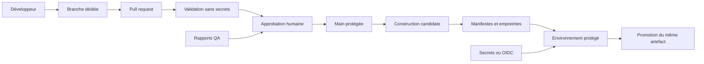

# DevOps et intégration continue

> **Repères d’utilisation :** **[PS]** PowerShell 7, **[CMD]** Invite de commandes Windows, **[WSL]** terminal Linux ou WSL, **[DCT]** terminal dans un conteneur, **[DCK]** Docker Desktop, **[VSC]** Visual Studio Code, **[WEB]** navigateur internet, **[APP]** application graphique nommée, **[SORTIE]** résultat à lire sans le saisir et **[LECTURE]** exemple ou structure de référence. Voir la [convention complète](../Volume-0/annexes/CONVENTION-OUTILS-ET-CONTEXTES.md).

## 1. Rôle du chapitre

Le chapitre 13 a préparé l’exploitation d’un serveur dédié : identité système, configuration, credentials runtime, pare-feu, supervision, admission, durcissement et procédures d’incident. Le présent chapitre possède une autre responsabilité : transformer les contrôles reproductibles du projet en une chaîne automatisée, observable et réversible qui produit toujours le même type de preuves à partir d’une révision donnée.

Le terme **DevOps** ne signifie pas « mettre tout en production automatiquement ». Il décrit ici la coopération entre conception, développement, assurance qualité et exploitation autour de contrats exécutables : scripts versionnés, environnements déclarés, permissions minimales, artefacts identifiés, journaux conservés et décisions humaines explicites. Une chaîne utile sait aussi s’arrêter, refuser une promotion incomplète et expliquer pourquoi.

Le chapitre 15 traitera la politique globale de sauvegarde, les objectifs RPO/RTO, les restaurations et la reprise après catastrophe. Le chapitre 16 possédera les presets d’export Godot et les détails de packaging par plateforme. Le chapitre 17 possédera la publication commerciale et les boutiques. Ici, les exemples orchestrent ces responsabilités sans les redéfinir ni prétendre qu’un build réel de `Project Asteria` a été produit.

## 2. Résultats d’apprentissage

À la fin du chapitre, le lecteur saura :

- distinguer intégration continue, livraison continue, déploiement et publication ;
- choisir les événements qui déclenchent un workflow sans donner de secrets à du code non fiable ;
- organiser branches, pull requests, tags, versions, identifiants de build et canaux de promotion ;
- limiter explicitement les permissions de `GITHUB_TOKEN` ;
- séparer scripts canoniques, workflows, caches, artefacts et preuves ;
- construire une matrice de plateformes sans masquer les échecs ;
- appliquer délais, concurrence, annulation et reprise bornés ;
- préparer les commandes Godot headless sans consommer le contenu du chapitre 16 ;
- vérifier empreintes, manifestes, provenance et dépendances d’actions ;
- utiliser des secrets ou OIDC sans les écrire dans les journaux ;
- conserver rapports, logs, checksums et métadonnées avec une rétention déclarée ;
- reproduire localement la même entrée de script que la CI ;
- reconstruire la chaîne depuis un clone neuf ;
- organiser les responsabilités Solo et Studio ;
- diagnostiquer les anti-patterns les plus fréquents.

## 3. Niveau de preuve et réserves

## 3.1. Déclarer honnêtement le niveau de preuve


> **[LECTURE] Déclarer honnêtement le niveau de preuve — Adapter les chemins et valeurs au projet.**

```yaml
evidence_level:
  chapter: static_review
  ci_workflow_materialized: false
  fresh_clone_rebuild_executed: false
  godot_build_executed: false
  automated_tests_executed: false
  packages_produced: false
  repository_secrets_configured: false
  oidc_exchange_executed: false
  artifact_attestation_generated: false
  deployment_performed: false
  runtime_claimed: false
```

<!-- qa:code-explanation -->

**Explication structurée du bloc :**

- **`chapter` :** `static_review` indique une revue documentaire et syntaxique, pas une exécution sur runner.
- **Booléens :** chaque famille de preuve reste indépendante ; un workflow écrit ne prouve ni build, ni test, ni déploiement.
- **Résultat :** toute future exécution devra remplacer uniquement les valeurs réellement prouvées et joindre ses journaux.
- **Limite :** aucune disponibilité, reproductibilité binaire ou sécurité de production n’est déduite de ce document.

## 4. Prérequis et frontières

Le lecteur doit connaître Git et GitHub du Livre I, l’architecture Solo/Studio du Livre II, la stratégie QA du chapitre 2, les tests fonctionnels du chapitre 3, la journalisation du chapitre 5, les profils CPU/GPU/mémoire des chapitres 6 à 10 et l’exploitation serveur du chapitre 13.

Le chapitre possède :

- les conventions de branches, pull requests, tags et identifiants de build ;
- l’orchestration des scripts de validation, test, build et préparation de package ;
- les permissions et frontières de confiance des workflows ;
- les matrices de plateformes ;
- les caches, artefacts, rapports et politiques de rétention ;
- les portes automatisées et humaines ;
- la reprise d’un workflow interrompu et la reconstruction depuis un clone neuf.

Le chapitre ne possède pas :

- la définition des cas de test, qui reste au chapitre 3 ;
- les règles de sécurité du serveur en exploitation, qui restent au chapitre 13 ;
- les objectifs RPO/RTO et restaurations globales, qui viennent au chapitre 15 ;
- les presets d’export, signatures de plateforme, installateurs et contenu des packages, qui viennent au chapitre 16 ;
- les boutiques, canaux commerciaux et pages de publication, qui viennent au chapitre 17.

## 5. Vocabulaire opérationnel

- **Intégration continue, CI :** exécution fréquente de contrôles sur une révision afin de détecter tôt les incompatibilités.
- **Livraison continue :** capacité à produire automatiquement un candidat vérifié, sans imposer son déploiement.
- **Déploiement continu :** promotion automatique vers un environnement ; cette option reste fermée par défaut pour `Project Asteria`.
- **Workflow :** fichier YAML qui décrit événements, permissions, jobs et étapes d’une automatisation.
- **Job :** unité exécutée sur un runner ; ses étapes partagent le même espace de travail.
- **Runner :** machine ou conteneur qui exécute un job.
- **Artefact :** sortie conservée après le job, par exemple un rapport, un binaire, un manifeste ou des journaux.
- **Cache :** accélérateur reconstructible ; il ne constitue ni une preuve ni une source canonique.
- **Build ID :** identité immuable d’une tentative de construction.
- **Version produit :** version lisible du logiciel, distincte du numéro de tentative CI.
- **Promotion :** décision de faire passer le même artefact vérifié vers un canal plus exigeant.
- **Provenance :** informations permettant de relier un artefact à sa source, son workflow, ses dépendances et ses paramètres.
- **Porte :** ensemble de conditions qui doivent être satisfaites avant une transition.
- **Reprise :** continuation contrôlée après interruption, sans confondre artefact partiel et résultat valide.
- **Déclencheur de faible confiance :** événement pouvant exécuter du code proposé par une personne non autorisée, notamment une pull request provenant d’un fork.

## 6. Cartographier la chaîne de confiance


> **[LECTURE] Cartographier la chaîne de confiance — Adapter les chemins et valeurs au projet.**



<!-- qa:code-explanation -->

**Explication structurée du bloc :**

- **Entrée :** le code non fusionné n’accède qu’aux validations nécessaires à sa revue.
- **Séparation :** les secrets et identités de déploiement ne rejoignent qu’un environnement protégé après approbation.
- **Promotion :** le même artefact identifié traverse les portes ; il n’est pas reconstruit silencieusement entre deux canaux.
- **Sorties :** rapports QA, manifestes et empreintes permettent de relier la décision au commit et au run.

## 7. Choisir une stratégie de branches

`Project Asteria` retient une branche principale courte et protégée :

- `main` représente l’état intégré ;
- chaque changement part d’une branche dédiée ;
- une pull request porte le contexte, les contrôles et la décision ;
- les branches ne deviennent pas des environnements permanents ;
- les releases proviennent de commits déjà présents dans `main`.

Les branches longues augmentent les conflits et retardent la validation réelle. Une branche dédiée doit rester ciblée, être remise à niveau avant fusion lorsqu’une règle l’exige et être supprimée après clôture. Un hotfix ne contourne pas la revue : il raccourcit le périmètre et les délais, mais conserve identité, tests, preuve et possibilité de retour arrière.

## 7.1. Convention de noms des branches


> **[LECTURE] Convention de noms des branches — Adapter les chemins et valeurs au projet.**

```yaml
branch_policy:
  main: main
  prefixes:
    feature: feat/
    fix: fix/
    documentation: docs/
    operations: ops/
    hotfix: hotfix/
  required:
    - lowercase_ascii
    - hyphen_separated_subject
    - single_declared_scope
  forbidden:
    - personal_long_lived_branch
    - environment_name_as_branch
    - secret_or_ticket_content
```

<!-- qa:code-explanation -->

**Explication structurée du bloc :**

- **Préfixes :** ils indiquent l’intention sans devenir une autorité métier.
- **Caractères :** une forme simple évite les problèmes de shell, d’URL et de règles de filtre.
- **Périmètre :** une branche correspond à un changement révisable ; plusieurs migrations indépendantes exigent plusieurs lots.
- **Confidentialité :** le nom ne contient ni secret, ni donnée personnelle, ni détail d’incident sensible.

## 8. Définir les portes de pull request

Une pull request valide d’abord ce qui est sûr et rapide :

1. structure des sources et métadonnées ;
2. formatage et validation statique ;
3. tests unitaires et fonctionnels rapides ;
4. contrôle des dépendances et secrets accidentels ;
5. comparaison des sorties attendues ;
6. revue humaine du périmètre et des risques.

Les suites longues, exports et campagnes de plateformes sont ensuite répartis selon le risque. Un contrôle obligatoire doit être stable, explicable et relié à une action corrective. Un job « vert » qui ignore ses codes de sortie n’est pas une porte.

## 8.1. Contrat d’une porte de validation


> **[LECTURE] Contrat d’une porte de validation — Adapter les chemins et valeurs au projet.**

```yaml
quality_gate:
  id: pr-fast-validation
  trigger: pull_request
  trust: untrusted_code
  secrets_available: false
  required_checks:
    - markdown_and_schema
    - static_code_review
    - fast_tests
    - duplicate_detection
    - secret_scan_without_upload
  timeout_minutes: 20
  success_requires:
    - every_required_job_success
    - no_suppressed_failure
    - report_uploaded
```

<!-- qa:code-explanation -->

**Explication structurée du bloc :**

- **`trust` :** la pull request est traitée comme du code non fiable, même si son auteur est connu.
- **Secrets :** l’absence de secrets est une propriété de conception, pas une convention orale.
- **Délai :** le timeout borne la consommation et rend un blocage visible.
- **Décision :** `continue-on-error` ne peut pas transformer une porte obligatoire en succès.

## 9. Distinguer version produit, révision et build

Une chaîne reproductible conserve plusieurs identités :

- la **version produit**, par exemple `0.14.0`, décrit une évolution fonctionnelle ;
- le **commit SHA** identifie les sources ;
- le **run ID** identifie l’exécution GitHub Actions ;
- le **numéro de tentative** distingue une reprise du même run ;
- le **build ID** regroupe ces éléments dans les fichiers et journaux ;
- l’empreinte SHA-256 identifie les octets produits.

Le nom d’un fichier n’est pas une preuve suffisante. Deux fichiers portant `asteria-0.14.0.zip` peuvent contenir des octets différents s’ils proviennent de commits, outils ou paramètres distincts.

## 9.1. Construire un identifiant de build en Python


> **[VSC] Construire un identifiant de build en Python — Adapter les chemins et valeurs au projet.**

```python
from __future__ import annotations

import os
import re

SAFE_REF = re.compile(r"[^a-z0-9._-]+")


def normalized_ref(value: str) -> str:
    cleaned = SAFE_REF.sub("-", value.strip().lower()).strip("-")
    return cleaned or "detached"


def build_id(version: str, commit_sha: str, run_id: str, attempt: str) -> str:
    if not re.fullmatch(r"\d+\.\d+\.\d+(?:-[0-9a-z.-]+)?", version):
        raise ValueError("version produit invalide")
    if not re.fullmatch(r"[0-9a-f]{40}", commit_sha):
        raise ValueError("SHA Git invalide")
    if not run_id.isdigit() or not attempt.isdigit():
        raise ValueError("identité de run invalide")
    return f"{version}+git.{commit_sha[:12]}.run.{run_id}.{attempt}"


if __name__ == "__main__":
    print(
        build_id(
            os.environ["ASTERIA_VERSION"],
            os.environ["GITHUB_SHA"],
            os.environ["GITHUB_RUN_ID"],
            os.environ["GITHUB_RUN_ATTEMPT"],
        )
    )
```

<!-- qa:code-explanation -->

**Explication structurée du bloc :**

- **Fonction `normalized_ref(value: str) -> str` :** remplace les caractères non autorisés par `-` et garantit une valeur non vide ; elle sert aux chemins lisibles, pas à l’identité cryptographique.
- **Fonction `build_id(...) -> str` :** reçoit quatre chaînes, valide leurs formats puis retourne une identité immuable de tentative.
- **Opérateurs :** `[:12]` prend un préfixe lisible du SHA, tandis que le SHA complet reste conservé dans le manifeste.
- **Exceptions :** `ValueError` refuse une entrée mal formée avant la création d’un artefact.
- **Résultat :** la sortie peut être injectée dans les manifestes, journaux et noms d’artefacts sans remplacer l’empreinte des fichiers.

## 9.2. Manifeste d’identité d’une construction


> **[LECTURE] Manifeste d’identité d’une construction — Adapter les chemins et valeurs au projet.**

```yaml
build_identity:
  product_version: 0.14.0
  commit_sha: 0123456789abcdef0123456789abcdef01234567
  workflow_run_id: "123456789"
  workflow_attempt: "1"
  build_id: 0.14.0+git.0123456789ab.run.123456789.1
  source_ref: refs/heads/main
  created_at_utc: 2026-07-26T18:30:00Z
  status: candidate
```

<!-- qa:code-explanation -->

**Explication structurée du bloc :**

- **Types :** les identifiants numériques de service sont conservés comme chaînes afin d’éviter une conversion ou une perte de zéros dans d’autres outils.
- **Temps :** `created_at_utc` décrit la création du manifeste ; il ne sert pas à ordonner les événements internes du jeu.
- **Statut :** `candidate` n’accorde aucune permission de publication.
- **Traçabilité :** le commit complet et le run exact permettent de retrouver les journaux et les entrées.

## 10. Versionner sans déplacer les tags

Un tag de release représente une décision immuable. Il ne doit pas être déplacé après publication pour « corriger » silencieusement son contenu. Lorsqu’un candidat est invalide, une nouvelle version ou un nouveau suffixe de prépublication est créé.

La chaîne vérifie :

- que le tag respecte la convention ;
- que le commit tagué appartient à `main` ;
- que la version déclarée dans le projet correspond ;
- qu’aucun artefact du même identifiant n’existe déjà ;
- que la promotion utilise les octets déjà vérifiés.

## 10.1. Vérifier la forme d’un tag avec PowerShell


> **[PS] Vérifier la forme d’un tag avec PowerShell — Adapter les chemins et valeurs au projet.**

```powershell
param(
    [Parameter(Mandatory)]
    [string]$Tag
)

$ErrorActionPreference = "Stop"
if ($Tag -notmatch '^v\d+\.\d+\.\d+(?:-[0-9A-Za-z.-]+)?$') {
    throw "Tag invalide : $Tag"
}

$Commit = git rev-list -n 1 --verify "refs/tags/$Tag"
if ($LASTEXITCODE -ne 0 -or [string]::IsNullOrWhiteSpace($Commit)) {
    throw "Tag introuvable : $Tag"
}

git merge-base --is-ancestor $Commit origin/main
if ($LASTEXITCODE -ne 0) {
    throw "Le commit tagué n’appartient pas à main"
}

[ordered]@{
    tag = $Tag
    commit = $Commit
    accepted = $true
} | ConvertTo-Json
```

<!-- qa:code-explanation -->

**Explication structurée du bloc :**

- **Paramètre `Tag` :** obligatoire et typé `string`, il est validé avant tout appel Git.
- **Expression régulière :** `^` et `$` imposent que toute la chaîne corresponde à la convention `vMAJEUR.MINEUR.CORRECTIF`.
- **Codes de retour :** `$LASTEXITCODE` contrôle chaque commande externe ; un échec interrompt le script.
- **`merge-base --is-ancestor` :** renvoie zéro uniquement si le commit tagué est un ancêtre de `origin/main`.
- **Sortie :** le JSON est une preuve lisible par une étape suivante ; il ne crée ni tag ni release.

## 11. Conserver les scripts comme interface canonique

Un workflow YAML orchestre ; il ne doit pas contenir toute la logique métier de construction. Les commandes importantes vivent dans des scripts versionnés exécutables localement et en CI. Cette séparation réduit les divergences entre postes, rend les paramètres testables et évite un fichier YAML impossible à diagnostiquer.

`Project Asteria` retient les interfaces suivantes :

- `tools/ci/validate.py` pour les contrôles statiques ;
- `tools/ci/test.py` pour sélectionner une suite ;
- `tools/ci/build.py` pour appeler Godot avec un preset fourni ;
- `tools/ci/package.py` pour préparer un répertoire de staging sans décider du format final du chapitre 16 ;
- `tools/ci/manifest.py` pour calculer les empreintes et métadonnées ;
- `tools/ci/verify_artifact.py` pour refuser un artefact incomplet.

## 11.1. Définir une CLI de build typée


> **[VSC] Définir une CLI de build typée — Adapter les chemins et valeurs au projet.**

```python
from __future__ import annotations

import argparse
import subprocess
from pathlib import Path


def run_export(
    godot: Path,
    project: Path,
    preset: str,
    output: Path,
    debug: bool,
) -> None:
    mode = "--export-debug" if debug else "--export-release"
    output.parent.mkdir(parents=True, exist_ok=True)
    command = [
        str(godot),
        "--headless",
        "--path",
        str(project),
        mode,
        preset,
        str(output),
    ]
    completed = subprocess.run(command, check=False)
    if completed.returncode != 0:
        raise SystemExit(completed.returncode)
    if not output.exists() or output.stat().st_size == 0:
        raise SystemExit("Godot a terminé sans artefact non vide")


def parser() -> argparse.ArgumentParser:
    result = argparse.ArgumentParser()
    result.add_argument("--godot", type=Path, required=True)
    result.add_argument("--project", type=Path, required=True)
    result.add_argument("--preset", required=True)
    result.add_argument("--output", type=Path, required=True)
    result.add_argument("--debug", action="store_true")
    return result


if __name__ == "__main__":
    args = parser().parse_args()
    run_export(
        args.godot.resolve(),
        args.project.resolve(),
        args.preset,
        args.output.resolve(),
        args.debug,
    )
```

<!-- qa:code-explanation -->

**Explication structurée du bloc :**

- **Fonction `run_export(...) -> None` :** reçoit des chemins, un nom de preset et un booléen ; elle termine sans valeur uniquement si l’export et la vérification minimale réussissent.
- **`mode` :** l’expression conditionnelle choisit `--export-debug` ou `--export-release` sans dupliquer la commande.
- **`subprocess.run(..., check=False)` :** conserve explicitement le code de retour pour le propager à la CI.
- **Postcondition :** le fichier attendu doit exister et être non vide ; cela ne prouve pas qu’il s’installe ou se lance.
- **Frontière :** le preset et le format de package sont fournis par le chapitre 16 ; la CLI ne les invente pas.

## 12. Choisir les événements de workflow

Les déclencheurs ne sont pas interchangeables :

- `pull_request` convient aux validations de code proposé ; les secrets ne doivent pas être requis ;
- `push` sur `main` convient à l’intégration et à la préparation d’un candidat interne ;
- `workflow_dispatch` permet une exécution manuelle avec paramètres validés ;
- un tag versionné peut ouvrir une chaîne de release, mais la porte vérifie encore le commit et la version ;
- `schedule` convient aux contrôles périodiques, jamais à une publication implicite ;
- `pull_request_target` s’exécute dans le contexte de la branche cible et exige une prudence extrême ; il ne doit pas extraire puis exécuter le code non fiable de la pull request avec des permissions ou secrets élevés.

## 12.1. Déclencheurs séparés par niveau de confiance


> **[LECTURE] Déclencheurs séparés par niveau de confiance — Adapter les chemins et valeurs au projet.**

```yaml
name: Asteria CI

on:
  pull_request:
    branches: [main]
  push:
    branches: [main]
    tags: ["v*.*.*"]
  workflow_dispatch:
    inputs:
      suite:
        description: Suite autorisée
        type: choice
        options: [fast, complete]
        default: fast
        required: true

concurrency:
  group: ci-${{ github.workflow }}-${{ github.ref }}
  cancel-in-progress: ${{ github.event_name == 'pull_request' }}
```

<!-- qa:code-explanation -->

**Explication structurée du bloc :**

- **`on` :** chaque événement est déclaré ; aucun déploiement n’est implicite.
- **Entrée `suite` :** le type `choice` réduit les valeurs acceptées par le workflow manuel.
- **`concurrency.group` :** le groupe combine workflow et référence pour éviter qu’une branche annule une autre.
- **`cancel-in-progress` :** les validations obsolètes de pull request peuvent être annulées, tandis qu’un run de `main` reste conservé.
- **Limite :** le déclencheur ne décide pas seul des permissions ni de la promotion.

## 13. Réduire les permissions du jeton automatique

`GITHUB_TOKEN` reçoit des permissions par workflow ou par job. La chaîne part d’un défaut explicite en lecture seule, puis ajoute une permission uniquement au job qui en a besoin. Un job de validation n’a pas besoin d’écrire le dépôt, d’ouvrir une release ou de demander un jeton OIDC.

Les permissions courantes sont :

- `contents: read` pour extraire les sources ;
- `checks: write` ou `pull-requests: write` uniquement pour publier un résultat ciblé ;
- `id-token: write` uniquement au job qui demande un jeton OIDC ;
- `attestations: write` uniquement à la génération d’une attestation ;
- `packages: write` uniquement à une publication de package explicitement autorisée.

## 13.1. Permissions minimales par défaut


> **[LECTURE] Permissions minimales par défaut — Adapter les chemins et valeurs au projet.**

```yaml
permissions:
  contents: read

jobs:
  validate:
    permissions:
      contents: read

  publish-summary:
    if: github.event_name == 'push' && github.ref == 'refs/heads/main'
    permissions:
      contents: read
      checks: write
```

<!-- qa:code-explanation -->

**Explication structurée du bloc :**

- **Portée globale :** `contents: read` devient le plafond initial de tous les jobs.
- **Portée du job :** chaque bloc `permissions` documente les capacités réellement nécessaires.
- **Condition :** l’écriture d’un check est limitée à un push de la branche principale.
- **Refus :** aucun job de pull request n’obtient de permission d’écriture par simple commodité.

## 14. Traiter les entrées comme non fiables

Les titres de pull request, noms de branches, messages de commit, labels et valeurs issues d’un fichier peuvent contenir des caractères interprétés par un shell. Une expression GitHub ne doit pas être injectée directement dans une commande. La valeur est transmise par variable d’environnement puis consommée comme donnée.

Les scripts utilisent des listes d’arguments plutôt qu’une chaîne concaténée lorsqu’ils appellent un processus. Les chemins sont résolus dans un workspace déclaré et les sorties sont écrites dans des répertoires nettoyés.

## 14.1. Transmettre une valeur de contexte sans l’interpréter


> **[LECTURE] Transmettre une valeur de contexte sans l’interpréter — Adapter les chemins et valeurs au projet.**

```yaml
- name: Vérifier le titre
  env:
    PR_TITLE: ${{ github.event.pull_request.title }}
  shell: bash
  run: |
    python tools/ci/check_title.py --title "$PR_TITLE"
```

<!-- qa:code-explanation -->

**Explication structurée du bloc :**

- **Variable `PR_TITLE` :** GitHub place la valeur dans l’environnement au lieu de construire une ligne de shell dynamique.
- **Guillemets :** `"$PR_TITLE"` transmet une seule valeur même si elle contient des espaces.
- **Responsabilité :** `check_title.py` valide la longueur et la forme ; le shell ne décide pas du contenu.
- **Limite :** une variable d’environnement reste non fiable et ne doit pas devenir un chemin ou une commande sans validation.

## 15. Épingler les actions et qualifier leur provenance

Une action tierce est du code exécuté avec les permissions du job. Une référence mobile comme une branche ou un tag peut changer. Le parcours Studio épingle les actions à un SHA complet vérifié dans le dépôt officiel, conserve le tag lisible dans un commentaire et planifie leur mise à jour.

Le parcours Solo peut commencer avec des actions GitHub largement utilisées, mais il enregistre immédiatement :

- dépôt source ;
- licence ;
- version ou tag observé ;
- SHA complet retenu ;
- permissions nécessaires ;
- raison d’usage ;
- date de revue ;
- procédure de mise à jour et de rollback.

## 15.1. Registre des actions externes


> **[LECTURE] Registre des actions externes — Adapter les chemins et valeurs au projet.**

```yaml
actions:
  checkout:
    repository: actions/checkout
    tag_observed: v4.2.2
    commit_sha: 11bd71901bbe5b1630ceea73d27597364c9af683
    permissions: [contents_read]
    update_policy: reviewed_pull_request
  upload_artifact:
    repository: actions/upload-artifact
    tag_observed: v4
    commit_sha: TO_BE_VERIFIED_BEFORE_MATERIALIZATION
    permissions: []
    update_policy: reviewed_pull_request
```

<!-- qa:code-explanation -->

**Explication structurée du bloc :**

- **`commit_sha` :** une valeur réelle complète rend la référence immuable ; un placeholder bloque la matérialisation tant qu’il n’est pas qualifié.
- **`tag_observed` :** facilite la lecture mais ne remplace pas le SHA utilisé dans le workflow.
- **Permissions :** le registre distingue la capacité de l’action de celle accordée au job.
- **Mise à jour :** toute nouvelle empreinte passe par une pull request et les mêmes validations.

## 16. Construire une matrice de plateformes

Une matrice évite de copier le même job, mais elle ne garantit pas que toutes les combinaisons sont pertinentes. Chaque ligne doit correspondre à une cible supportée, à un runner disponible et à un oracle observable.

Le chapitre 16 fournira les presets et extensions. Le présent chapitre transporte seulement des paramètres déclarés : système du runner, nom du preset, chemin de sortie, suite à exécuter et caractère obligatoire ou expérimental.

## 16.1. Matrice explicite de cibles


> **[LECTURE] Matrice explicite de cibles — Adapter les chemins et valeurs au projet.**

```yaml
strategy:
  fail-fast: false
  matrix:
    include:
      - runner: windows-latest
        preset: Windows Desktop
        output: dist/windows/asteria.exe
        required: true
      - runner: ubuntu-latest
        preset: Linux/X11
        output: dist/linux/asteria.x86_64
        required: true
      - runner: ubuntu-latest
        preset: Linux Dedicated Server
        output: dist/server/asteria_server.x86_64
        required: false

runs-on: ${{ matrix.runner }}
timeout-minutes: 45
```

<!-- qa:code-explanation -->

**Explication structurée du bloc :**

- **`include` :** chaque objet contient des champs cohérents plutôt qu’un produit cartésien de combinaisons invalides.
- **`fail-fast: false` :** un échec n’annule pas les autres cibles, ce qui conserve le diagnostic complet.
- **`required` :** la donnée est destinée à la politique de porte ; elle ne transforme pas automatiquement un échec en succès.
- **Délai :** `timeout-minutes` borne chaque job, pas l’ensemble du workflow.
- **Frontière :** les noms de presets restent des entrées venant de la configuration d’export qualifiée au chapitre 16.

## 17. Préparer un environnement propre

Un runner hébergé est éphémère, mais son image contient de nombreux outils préinstallés qui évoluent. La chaîne ne suppose pas silencieusement une version. Elle installe ou vérifie les outils requis, affiche leurs versions et échoue si elles ne respectent pas le manifeste.

Pour Godot, `Project Asteria` conserve :

- version `4.7.1-stable` ;
- archive ou binaire récupéré depuis une source officielle ;
- empreinte attendue versionnée dans un manifeste ;
- export templates de la même version ;
- cache optionnel après vérification ;
- séparation entre binaire de l’éditeur, templates et credentials d’export.

## 17.1. Vérifier un outil téléchargé sous PowerShell


> **[PS] Vérifier un outil téléchargé sous PowerShell — Adapter les chemins et valeurs au projet.**

```powershell
param(
    [Parameter(Mandatory)]
    [string]$Archive,
    [Parameter(Mandatory)]
    [string]$ExpectedSha256
)

$ErrorActionPreference = "Stop"
$Resolved = (Resolve-Path $Archive).Path
$Actual = (Get-FileHash -Algorithm SHA256 -Path $Resolved).Hash.ToLowerInvariant()
$Expected = $ExpectedSha256.Trim().ToLowerInvariant()

if ($Expected -notmatch '^[0-9a-f]{64}$') {
    throw "Empreinte attendue invalide"
}
if ($Actual -ne $Expected) {
    throw "Empreinte différente pour $Resolved"
}

Write-Output "sha256=$Actual"
```

<!-- qa:code-explanation -->

**Explication structurée du bloc :**

- **Paramètres :** `Archive` et `ExpectedSha256` sont obligatoires ; l’empreinte attendue doit contenir exactement 64 caractères hexadécimaux.
- **`Resolve-Path` :** transforme le chemin en cible existante avant lecture.
- **Comparaison :** `-ne` refuse toute différence après normalisation en minuscules.
- **Sortie :** la ligne `sha256=...` peut être copiée dans un rapport, mais ne prouve pas l’origine de l’empreinte attendue.
- **Sécurité :** l’archive n’est extraite qu’après cette vérification.

## 17.2. Vérifier un outil dans un terminal Linux


> **[WSL] Vérifier un outil dans un terminal Linux — Adapter les chemins et valeurs au projet.**

```bash
set -euo pipefail

archive="${1:?archive manquante}"
expected="${2:?empreinte manquante}"

case "$expected" in
  (*[!0-9a-fA-F]*|'') echo "empreinte invalide" >&2; exit 64 ;;
esac

actual="$(sha256sum "$archive" | awk '{print $1}')"
if [ "${actual,,}" != "${expected,,}" ]; then
  echo "empreinte différente" >&2
  exit 65
fi

printf 'sha256=%s\n' "$actual"
```

<!-- qa:code-explanation -->

**Explication structurée du bloc :**

- **Options du shell :** `-e` arrête sur erreur, `-u` refuse une variable absente et `pipefail` propage l’échec d’un élément du pipeline.
- **Paramètres positionnels :** `${1:?...}` et `${2:?...}` terminent le script avec un diagnostic si une valeur manque.
- **Validation :** le `case` refuse les caractères non hexadécimaux avant comparaison.
- **`awk` :** extrait uniquement la première colonne produite par `sha256sum`.
- **Codes de sortie :** `64` signale une entrée invalide et `65` une empreinte différente.

## 18. Installer les dépendances Python de manière reproductible

Une CI ne lance pas `pip install` sans version ni fichier de verrouillage. Le projet distingue :

- les dépendances runtime ;
- les dépendances d’outillage ;
- les dépendances de test ;
- la version de Python ;
- les plateformes qualifiées ;
- les empreintes ou fichiers de verrouillage lorsque l’outil retenu les fournit.

Le cache accélère le téléchargement, mais l’installation doit réussir depuis zéro. Un cache supprimé ne doit pas empêcher la reconstruction.

## 18.1. Créer un environnement Python isolé


> **[CMD] Créer un environnement Python isolé — Adapter les chemins et valeurs au projet.**

```bat
@echo off
setlocal
set "PYTHONUTF8=1"
set "VENV=.venv-ci"

py -3.14 -m venv "%VENV%"
if errorlevel 1 exit /b %errorlevel%

call "%VENV%\Scripts\activate.bat"
python -m pip install --upgrade pip
if errorlevel 1 exit /b %errorlevel%

python -m pip install --require-hashes -r requirements-ci.txt
if errorlevel 1 exit /b %errorlevel%

python --version
python -m pip check
exit /b %errorlevel%
```

<!-- qa:code-explanation -->

**Explication structurée du bloc :**

- **`setlocal` :** limite les variables à ce script.
- **`py -3.14 -m venv` :** sélectionne explicitement l’interpréteur puis crée un environnement isolé.
- **`if errorlevel 1` :** propage le code de retour de chaque commande au lieu de continuer.
- **`--require-hashes` :** exige des empreintes déclarées pour les distributions listées.
- **Postcondition :** `pip check` vérifie les dépendances installées ; il ne remplace pas les tests du projet.

## 19. Distinguer cache, artefact et source canonique

Un **cache** peut être supprimé, évincé ou empoisonné ; il doit rester reconstructible et ne contient aucun secret. Un **artefact** conserve une sortie de run pour diagnostic ou promotion. Une **source canonique** appartient au dépôt ou à un registre gouverné et permet de reconstruire les deux.

Exemples :

- cache : téléchargements Python ou archive Godot vérifiée ;
- artefact : rapport de tests, package candidat, manifeste, logs expurgés ;
- source : scripts, lockfiles, presets versionnables, schémas et paramètres.

Un job ne publie jamais le contenu entier du workspace. Il sélectionne les fichiers attendus depuis un répertoire de staging fermé.

## 19.1. Contrat de cache reconstructible


> **[LECTURE] Contrat de cache reconstructible — Adapter les chemins et valeurs au projet.**

```yaml
cache_policy:
  name: python-downloads
  path: ~/.cache/pip
  key_inputs:
    - runner_os
    - python_version
    - hash_of_requirements_ci
  contains_secrets: false
  executable_after_restore: false
  validation_after_restore:
    - reinstall_from_lock
    - pip_check
  cache_miss_supported: true
```

<!-- qa:code-explanation -->

**Explication structurée du bloc :**

- **Clé :** le système, Python et le fichier verrouillé invalident le cache lorsqu’une dépendance change.
- **Contenu :** seuls des téléchargements reconstructibles sont conservés.
- **Restauration :** les fichiers restaurés restent non fiables jusqu’à l’installation et aux contrôles.
- **Cache miss :** la chaîne doit terminer correctement sans entrée existante.

## 20. Nettoyer le répertoire de sortie

Un runner réutilisé ou un poste local peut contenir des restes d’un build précédent. Avant toute construction, le script supprime uniquement un répertoire connu situé sous la racine du workspace. Il refuse les chemins vides, la racine du dépôt et les chemins extérieurs.

## 20.1. Préparer un staging confiné


> **[VSC] Préparer un staging confiné — Adapter les chemins et valeurs au projet.**

```python
from __future__ import annotations

import shutil
from pathlib import Path


def prepare_staging(root: Path, relative: str) -> Path:
    root = root.resolve()
    target = (root / relative).resolve()
    if target == root:
        raise ValueError("le staging ne peut pas être la racine")
    if root not in target.parents:
        raise ValueError("le staging sort du workspace")
    if target.exists():
        shutil.rmtree(target)
    target.mkdir(parents=True)
    return target
```

<!-- qa:code-explanation -->

**Explication structurée du bloc :**

- **Entrées :** `root` est un `Path` de workspace et `relative` une chaîne contrôlée par la configuration.
- **Résolution :** `resolve()` normalise les segments comme `..` avant la comparaison.
- **Invariants :** la cible doit être différente de la racine et avoir la racine parmi ses parents.
- **Effet de bord :** `shutil.rmtree` supprime uniquement la cible validée, puis `mkdir` recrée un dossier vide.
- **Retour :** la fonction renvoie le chemin absolu du staging prêt à recevoir les sorties.

## 21. Orchestrer les validations rapides

Le workflow de pull request appelle les mêmes scripts que le poste local. Chaque commande produit un rapport, retourne un code non nul sur non-conformité et n’utilise ni secret ni accès de déploiement.

La suite rapide peut inclure :

- validation des schémas ;
- vérification des liens et identifiants ;
- analyse statique des scripts ;
- tests unitaires ;
- tests fonctionnels courts en headless ;
- contrôle des ressources obligatoires ;
- audit de secrets sur le diff ;
- vérification que le job n’a pas produit de package de release.

## 21.1. Workflow de validation de pull request


> **[LECTURE] Workflow de validation de pull request — Adapter les chemins et valeurs au projet.**

```yaml
name: Pull Request Validation

on:
  pull_request:
    branches: [main]

permissions:
  contents: read

concurrency:
  group: pr-validation-${{ github.event.pull_request.number }}
  cancel-in-progress: true

jobs:
  validate:
    runs-on: ubuntu-latest
    timeout-minutes: 20
    steps:
      - name: Extraire les sources
        uses: actions/checkout@11bd71901bbe5b1630ceea73d27597364c9af683
        with:
          persist-credentials: false

      - name: Préparer Python
        run: |
          python3 -m venv .venv
          . .venv/bin/activate
          python -m pip install --require-hashes -r requirements-ci.txt

      - name: Exécuter la suite rapide
        run: |
          . .venv/bin/activate
          python tools/ci/validate.py --report dist/qa/validation.json
          python tools/ci/test.py --suite fast --report dist/qa/tests.xml

      - name: Refuser un package de release
        run: test ! -d dist/release
```

<!-- qa:code-explanation -->

**Explication structurée du bloc :**

- **Déclencheur :** le workflow s’exécute sur la version proposée de la pull request sans permission d’écriture.
- **Checkout :** `persist-credentials: false` évite de laisser un jeton Git dans la configuration locale.
- **Environnement :** l’installation utilise le fichier verrouillé et ses empreintes.
- **Scripts :** validation et tests écrivent des rapports distincts puis propagent leurs codes de retour.
- **Garde :** l’absence de `dist/release` empêche une validation de faible confiance de produire un candidat publiable.
- **Réserve :** l’exemple ne revendique pas l’existence actuelle de ces scripts dans `Project Asteria`.

## 22. Lancer Godot en mode headless

Godot accepte `--headless`, `--path`, `--export-debug` et `--export-release`. La CI fournit le preset et la sortie ; elle vérifie le code de retour et la présence de l’artefact. Les export templates doivent correspondre à la version du moteur.

Les tests de scène ou scripts peuvent également utiliser le mode headless. Un retour zéro est nécessaire, mais pas suffisant : la chaîne contrôle les rapports, les fichiers attendus et l’absence de marqueur d’échec dans les sorties structurées.

## 22.1. Appeler le build canonique depuis PowerShell


> **[PS] Appeler le build canonique depuis PowerShell — Adapter les chemins et valeurs au projet.**

```powershell
$ErrorActionPreference = "Stop"

$Arguments = @(
    "tools/ci/build.py",
    "--godot", $env:GODOT_BIN,
    "--project", ".",
    "--preset", $env:ASTERIA_PRESET,
    "--output", $env:ASTERIA_OUTPUT
)

& $env:PYTHON @Arguments
if ($LASTEXITCODE -ne 0) {
    throw "Le build canonique a échoué avec le code $LASTEXITCODE"
}
```

<!-- qa:code-explanation -->

**Explication structurée du bloc :**

- **Tableau `Arguments` :** chaque argument reste une valeur distincte ; aucun nom de preset n’est concaténé dans une commande.
- **Variables :** `GODOT_BIN`, `ASTERIA_PRESET` et `ASTERIA_OUTPUT` proviennent d’une matrice contrôlée.
- **Opérateur d’appel `&` :** exécute le chemin contenu dans `$env:PYTHON` avec l’éclatement du tableau `@Arguments`.
- **Code de retour :** un code non nul devient une exception PowerShell et bloque le job.
- **Frontière :** le script Python décide comment appeler Godot, tandis que le workflow ne connaît pas les détails du package.

## 23. Séparer construction et promotion

La construction produit un candidat dans un staging fermé. La promotion n’exécute pas à nouveau les compilations ou exports ; elle télécharge le même artefact, vérifie son manifeste et son empreinte, puis l’associe à un environnement ou canal.

Cette séparation évite deux risques :

- un artefact différent entre validation et publication ;
- un job de build qui possède inutilement les secrets de déploiement.

Le job de promotion exige l’identité de l’artefact, la réussite des portes, une approbation humaine lorsque le risque le demande et une compatibilité avec le canal cible.

## 23.1. Graphe de jobs sans reconstruction


> **[LECTURE] Graphe de jobs sans reconstruction — Adapter les chemins et valeurs au projet.**

```yaml
jobs:
  validate:
    uses: ./.github/workflows/reusable-validate.yml

  build:
    needs: validate
    uses: ./.github/workflows/reusable-build.yml
    with:
      version: ${{ inputs.version }}

  approve:
    needs: build
    runs-on: ubuntu-latest
    environment: release-candidate
    steps:
      - run: echo "Porte humaine franchie"

  promote:
    needs: [build, approve]
    uses: ./.github/workflows/reusable-promote.yml
    with:
      artifact_name: ${{ needs.build.outputs.artifact_name }}
```

<!-- qa:code-explanation -->

**Explication structurée du bloc :**

- **`needs` :** impose l’ordre logique et rend les sorties des jobs précédents accessibles.
- **Workflows réutilisables :** validation, build et promotion possèdent des contrats séparés.
- **Environnement :** `release-candidate` peut appliquer des approbations et secrets propres.
- **Entrée de promotion :** le nom d’artefact vient du build validé ; aucun nouveau build n’est demandé.
- **Permissions :** un workflow appelé ne peut pas élever silencieusement les permissions accordées par l’appelant.

## 24. Créer un workflow réutilisable

Un workflow réutilisable expose des entrées typées et des sorties documentées. Il ne lit pas arbitrairement des variables globales si une entrée explicite est possible. Les secrets sont nommés individuellement ; `secrets: inherit` reste réservé à un périmètre Studio maîtrisé.

Les workflows réutilisables du même dépôt sont appelés avec un chemin relatif. Ils proviennent alors du même commit que le workflow appelant, ce qui évite un décalage entre orchestration et implémentation.

## 24.1. Contrat d’un workflow de validation réutilisable


> **[LECTURE] Contrat d’un workflow de validation réutilisable — Adapter les chemins et valeurs au projet.**

```yaml
name: Reusable Validation

on:
  workflow_call:
    inputs:
      suite:
        required: true
        type: string
      upload_reports:
        required: false
        type: boolean
        default: true
    outputs:
      report_name:
        description: Nom de l’artefact de rapport
        value: ${{ jobs.validate.outputs.report_name }}

permissions:
  contents: read

jobs:
  validate:
    runs-on: ubuntu-latest
    outputs:
      report_name: ${{ steps.identity.outputs.name }}
    steps:
      - id: identity
        shell: bash
        run: echo "name=qa-${{ github.run_id }}-${{ github.run_attempt }}" >> "$GITHUB_OUTPUT"
```

<!-- qa:code-explanation -->

**Explication structurée du bloc :**

- **`workflow_call` :** rend le fichier appelable par un autre workflow.
- **Entrées :** `suite` est obligatoire et `upload_reports` possède un type booléen avec valeur par défaut.
- **Sortie :** `report_name` traverse d’abord le step, puis le job, puis le workflow.
- **`GITHUB_OUTPUT` :** reçoit une paire `nom=valeur` sans utiliser les anciennes commandes de sortie.
- **Permissions :** le workflow réutilisable demande uniquement la lecture des sources.

## 25. Gérer les artefacts et leur rétention

Un artefact de CI possède :

- un nom stable incluant le build ID ou le run ;
- un répertoire fermé ;
- un manifeste listant chaque fichier ;
- des empreintes SHA-256 ;
- le commit et le workflow source ;
- une durée de rétention adaptée à son usage ;
- une classification : diagnostic, candidat, preuve ou publication.

Les rapports de pull request peuvent être conservés moins longtemps que les candidats approuvés. Une preuve de release doit aussi être copiée dans l’archive de publication définie par les chapitres 15 et 22 ; la rétention GitHub Actions seule ne constitue pas une stratégie d’archivage.

## 25.1. Politique de rétention par famille


> **[LECTURE] Politique de rétention par famille — Adapter les chemins et valeurs au projet.**

```yaml
artifact_retention:
  pr_diagnostics:
    days: 14
    promotion_allowed: false
  main_validation:
    days: 30
    promotion_allowed: false
  release_candidate:
    days: 90
    promotion_allowed: true
  publication_evidence:
    days: 365
    promotion_allowed: false
    external_archive_required: true
```

<!-- qa:code-explanation -->

**Explication structurée du bloc :**

- **Durées :** chaque valeur est une politique candidate soumise aux limites du dépôt et aux coûts réels.
- **Promotion :** seuls les candidats construits par la chaîne de confiance peuvent avancer.
- **Preuve :** les rapports de publication ne sont pas eux-mêmes des packages.
- **Archive :** la conservation durable appartient à la politique des chapitres 15 et 22.

## 25.2. Téléverser uniquement le staging fermé


> **[LECTURE] Téléverser uniquement le staging fermé — Adapter les chemins et valeurs au projet.**

```yaml
- name: Publier le candidat
  uses: actions/upload-artifact@v4
  with:
    name: asteria-${{ env.BUILD_ID }}
    path: |
      dist/staging/**
      !dist/staging/**/*.tmp
    if-no-files-found: error
    retention-days: 90
    compression-level: 6
```

<!-- qa:code-explanation -->

**Explication structurée du bloc :**

- **`path` :** limite l’upload au staging et exclut les fichiers temporaires.
- **`if-no-files-found: error` :** refuse un run vert sans sortie.
- **Rétention :** 90 jours est une valeur de candidat à confirmer dans les réglages du dépôt.
- **Compression :** le niveau agit sur temps et taille, pas sur l’identité des fichiers listés dans le manifeste.
- **Sécurité :** avant matérialisation Studio, l’action doit être épinglée à un SHA complet vérifié.

## 26. Produire un manifeste fermé

Le manifeste énumère les fichiers attendus plutôt que de découvrir « tout ce qui se trouve dans `dist` ». Pour chaque entrée, il conserve chemin relatif, taille et SHA-256. Le manifeste lui-même reçoit ensuite une empreinte.

La liste est triée pour être stable. Les chemins absolus, dates de modification et noms de runner ne sont pas utilisés comme identité, car ils varient entre environnements.

## 26.1. Générer un manifeste d’artefact


> **[VSC] Générer un manifeste d’artefact — Adapter les chemins et valeurs au projet.**

```python
from __future__ import annotations

import hashlib
import json
from pathlib import Path


def sha256(path: Path) -> str:
    digest = hashlib.sha256()
    with path.open("rb") as stream:
        for chunk in iter(lambda: stream.read(1024 * 1024), b""):
            digest.update(chunk)
    return digest.hexdigest()


def manifest(staging: Path, build_id: str) -> dict[str, object]:
    staging = staging.resolve()
    files: list[dict[str, object]] = []
    for path in sorted(item for item in staging.rglob("*") if item.is_file()):
        relative = path.relative_to(staging).as_posix()
        files.append({
            "path": relative,
            "size": path.stat().st_size,
            "sha256": sha256(path),
        })
    if not files:
        raise ValueError("staging vide")
    return {
        "schema": "asteria-artifact-manifest",
        "version": 1,
        "build_id": build_id,
        "files": files,
    }


def write_manifest(staging: Path, build_id: str, output: Path) -> None:
    value = manifest(staging, build_id)
    output.write_text(
        json.dumps(value, ensure_ascii=False, sort_keys=True, indent=2) + "\n",
        encoding="utf-8",
    )
```

<!-- qa:code-explanation -->

**Explication structurée du bloc :**

- **Fonction `sha256(path: Path) -> str` :** lit le fichier par blocs d’un mégaoctet et retourne une empreinte hexadécimale.
- **`iter(lambda..., b"")` :** appelle la lecture jusqu’à obtenir le marqueur vide de fin de fichier.
- **Fonction `manifest(...)` :** retourne un dictionnaire typé contenant schéma, version, build ID et liste triée.
- **Chemins :** `relative_to` empêche l’enregistrement d’un chemin absolu propre au runner.
- **Postcondition :** un staging vide lève `ValueError` ; le JSON canonique lisible termine par un saut de ligne.
- **Limite :** une empreinte prouve l’intégrité relative à une valeur attendue, pas la sécurité ou la qualité du binaire.

## 27. Vérifier avant de promouvoir

Le job de promotion télécharge l’artefact, lit le manifeste, refuse les chemins absolus ou traversants, recalcule tailles et empreintes, puis vérifie l’identité du commit et du build. Il n’exécute pas immédiatement un binaire téléchargé.

La comparaison est stricte :

- aucun fichier attendu manquant ;
- aucun fichier supplémentaire non autorisé ;
- tailles identiques ;
- empreintes identiques ;
- schéma et version supportés ;
- build ID attendu ;
- statut des portes conservé.

## 27.1. Vérifier un manifeste avant usage


> **[VSC] Vérifier un manifeste avant usage — Adapter les chemins et valeurs au projet.**

```python
from __future__ import annotations

import json
from pathlib import Path

from manifest import sha256


def verify(staging: Path, manifest_path: Path, expected_build_id: str) -> None:
    staging = staging.resolve()
    data = json.loads(manifest_path.read_text(encoding="utf-8"))
    if data.get("schema") != "asteria-artifact-manifest":
        raise ValueError("schéma inconnu")
    if data.get("version") != 1:
        raise ValueError("version de manifeste non supportée")
    if data.get("build_id") != expected_build_id:
        raise ValueError("build ID différent")

    expected_paths: set[str] = set()
    for entry in data.get("files", []):
        relative = Path(entry["path"])
        if relative.is_absolute() or ".." in relative.parts:
            raise ValueError("chemin de manifeste non confiné")
        path = (staging / relative).resolve()
        if staging not in path.parents:
            raise ValueError("fichier hors staging")
        if not path.is_file():
            raise ValueError(f"fichier manquant : {relative.as_posix()}")
        if path.stat().st_size != int(entry["size"]):
            raise ValueError(f"taille différente : {relative.as_posix()}")
        if sha256(path) != entry["sha256"]:
            raise ValueError(f"empreinte différente : {relative.as_posix()}")
        expected_paths.add(relative.as_posix())

    actual_paths = {
        path.relative_to(staging).as_posix()
        for path in staging.rglob("*")
        if path.is_file() and path != manifest_path
    }
    if actual_paths != expected_paths:
        raise ValueError("ensemble de fichiers différent")
```

<!-- qa:code-explanation -->

**Explication structurée du bloc :**

- **Entrées :** staging, chemin du manifeste et build ID attendu sont fournis par la porte de promotion.
- **Schéma :** les appels `get` refusent une famille ou version inconnue avant de parcourir les fichiers.
- **Confinement :** chemins absolus, segments `..` et sorties du staging sont bloqués.
- **Conversions :** `int(entry["size"])` normalise la taille déclarée avant comparaison.
- **Ensembles :** l’égalité finale détecte aussi les fichiers supplémentaires.
- **Retour :** la fonction ne renvoie rien sur succès et lève `ValueError` au premier invariant violé.

## 28. Conserver les journaux et rapports

Les logs de console sont utiles au diagnostic, mais ils ne constituent pas seuls une preuve structurée. Chaque outil écrit un rapport machine lisible et un résumé humain. Les rapports contiennent :

- identité de build ;
- environnement et versions ;
- commande logique, sans secret ;
- heure UTC et durée monotone ;
- statut ;
- compteurs ;
- chemins d’artefacts ;
- réserves ;
- lien vers le run.

Les sorties sensibles sont expurgées avant upload. Un rapport d’échec est téléversé même lorsque le job échoue, à condition que l’étape d’upload soit sûre et qu’elle n’ignore pas l’échec principal.

## 28.1. Catalogue de preuves d’un run


> **[LECTURE] Catalogue de preuves d’un run — Adapter les chemins et valeurs au projet.**

```yaml
run_evidence:
  identity:
    - build-identity.json
    - environment-manifest.json
  validation:
    - static-validation.json
    - tests-junit.xml
    - coverage-summary.json
  build:
    - artifact-manifest.json
    - artifact-manifest.sha256
  diagnostics:
    - godot-export.log
    - runner-summary.md
  forbidden:
    - raw_secrets
    - export_credentials
    - complete_environment_dump
    - unredacted_player_data
```

<!-- qa:code-explanation -->

**Explication structurée du bloc :**

- **Catégories :** identité, validation, build et diagnostic restent séparés pour faciliter la revue.
- **Logs :** le journal d’export est utile mais ne remplace pas le manifeste.
- **Interdictions :** aucun dump complet d’environnement ou credential n’est conservé.
- **Extension :** chaque nouveau rapport doit définir schéma, rétention et propriétaire.

## 29. Résumer sans masquer l’échec

Un résumé GitHub facilite la lecture du run. Il doit reprendre les statuts réels et fournir les chemins des preuves. Il ne transforme jamais une commande échouée en succès.

Une étape de collecte exécutée avec `if: always()` peut fonctionner après un échec. Elle ne doit pas utiliser `continue-on-error` sur la validation principale. Le job final conserve le code d’échec d’origine.

## 29.1. Écrire un résumé de job


> **[LECTURE] Écrire un résumé de job — Adapter les chemins et valeurs au projet.**

```yaml
- name: Résumer les résultats
  if: always()
  shell: bash
  env:
    BUILD_ID: ${{ env.BUILD_ID }}
    VALIDATION_STATUS: ${{ steps.validate.outcome }}
    TEST_STATUS: ${{ steps.tests.outcome }}
  run: |
    {
      echo "## Project Asteria — CI"
      echo
      echo "- Build ID : \`$BUILD_ID\`"
      echo "- Validation : \`$VALIDATION_STATUS\`"
      echo "- Tests : \`$TEST_STATUS\`"
      echo "- Preuves : \`dist/qa/\`"
    } >> "$GITHUB_STEP_SUMMARY"
```

<!-- qa:code-explanation -->

**Explication structurée du bloc :**

- **`if: always()` :** permet d’écrire le diagnostic après succès, échec ou annulation.
- **Variables :** les statuts proviennent des résultats réels des étapes identifiées.
- **`GITHUB_STEP_SUMMARY` :** reçoit du Markdown affiché dans l’interface du run.
- **Limite :** le résumé n’altère pas `steps.validate.outcome` et ne remplace pas les rapports détaillés.

## 30. Protéger les secrets

Les secrets de CI ne sont ni des fichiers de configuration ordinaires ni des variables affichées pour diagnostic. La chaîne suit ces règles :

- secret absent des pull requests non fiables ;
- secret limité à l’environnement et au job qui en ont besoin ;
- nom logique distinct de la valeur ;
- rotation et révocation documentées ;
- aucun passage dans un argument de ligne de commande visible lorsque l’outil propose un canal plus sûr ;
- aucune copie dans un cache, un artefact ou un résumé ;
- valeur masquée explicitement si elle est dérivée dynamiquement ;
- approbation humaine avant accès aux secrets de release.

Les secrets GitHub conviennent aux valeurs durables de petite taille. Lorsqu’un fournisseur le permet, OIDC échange une identité GitHub bornée contre un jeton court plutôt que de stocker une clé cloud longue durée.

## 30.1. Limiter OIDC au job de déploiement


> **[LECTURE] Limiter OIDC au job de déploiement — Adapter les chemins et valeurs au projet.**

```yaml
jobs:
  deploy-staging:
    if: github.ref == 'refs/heads/main'
    runs-on: ubuntu-latest
    environment: staging
    permissions:
      contents: read
      id-token: write
    steps:
      - name: Demander un jeton court au fournisseur
        run: ./tools/ci/oidc-login.sh
```

<!-- qa:code-explanation -->

**Explication structurée du bloc :**

- **Condition :** seul `main` peut atteindre ce job ; les règles de l’environnement ajoutent une seconde porte.
- **`id-token: write` :** autorise la demande d’un jeton OIDC, pas l’écriture générale du dépôt.
- **Jeton court :** le fournisseur vérifie audience, sujet et autres claims avant d’émettre ses propres credentials.
- **Script :** `oidc-login.sh` doit éviter d’imprimer le jeton et nettoyer tout fichier temporaire.
- **Réserve :** aucun fournisseur ni échange OIDC n’est matérialisé dans ce chapitre.

## 31. Utiliser des environnements protégés

Les environnements GitHub représentent des cibles comme `staging` ou `release`. Ils peuvent posséder :

- approbateurs ;
- délai d’attente ;
- restrictions de branches ou tags ;
- secrets et variables propres ;
- historique de déploiement.

L’environnement ne remplace pas la validation applicative. Il ajoute une barrière de gouvernance autour d’un job déjà limité. `production` ne doit pas être sélectionné par une chaîne libre saisie dans une pull request.

## 31.1. Déclarer une cible depuis une liste fermée


> **[LECTURE] Déclarer une cible depuis une liste fermée — Adapter les chemins et valeurs au projet.**

```yaml
on:
  workflow_dispatch:
    inputs:
      target:
        description: Environnement de promotion
        required: true
        type: choice
        options:
          - staging
          - release-candidate

jobs:
  promote:
    environment: ${{ inputs.target }}
    runs-on: ubuntu-latest
```

<!-- qa:code-explanation -->

**Explication structurée du bloc :**

- **Entrée :** `choice` ferme les valeurs aux environnements explicitement préparés.
- **`environment` :** applique les protections de la cible choisie.
- **Absence de production :** la liste ne propose pas de déploiement public automatique.
- **Contrôle complémentaire :** le job vérifie encore le build ID et le manifeste.

## 32. Définir les timeouts et la concurrence

Un job bloqué consomme des ressources et retarde le diagnostic. Chaque job possède un délai adapté. Les commandes internes peuvent avoir des délais plus courts afin de produire un rapport précis avant que GitHub annule tout le job.

La concurrence distingue :

- validations de pull request obsolètes, annulables ;
- builds de `main`, conservés pour traçabilité ;
- promotions vers un même environnement, sérialisées ;
- tâches de maintenance, qui ne doivent pas chevaucher une publication.

## 32.1. Sérialiser une promotion


> **[LECTURE] Sérialiser une promotion — Adapter les chemins et valeurs au projet.**

```yaml
jobs:
  promote:
    concurrency:
      group: promote-${{ inputs.target }}
      cancel-in-progress: false
    timeout-minutes: 30
    runs-on: ubuntu-latest
```

<!-- qa:code-explanation -->

**Explication structurée du bloc :**

- **Groupe :** toutes les promotions vers la même cible partagent une clé.
- **`cancel-in-progress: false` :** une nouvelle demande ne tue pas une opération déjà commencée.
- **Délai :** le job doit terminer ou échouer dans les trente minutes prévues.
- **Ordre :** la sérialisation évite deux mutations concurrentes, mais ne garantit pas un ordre métier sans file explicite.

## 33. Gérer les reprises et tentatives

Un retry est acceptable pour une panne transitoire identifiée : téléchargement interrompu, service temporairement indisponible ou limite distante. Il ne doit pas masquer :

- un test déterministe en échec ;
- une empreinte différente ;
- un schéma invalide ;
- un secret absent ;
- une incompatibilité de version ;
- une autorisation refusée.

Chaque tentative conserve son numéro, son délai, sa cause et son résultat. Une reprise n’écrase pas les preuves de la tentative précédente.

## 33.1. Appliquer un retry borné en Python


> **[VSC] Appliquer un retry borné en Python — Adapter les chemins et valeurs au projet.**

```python
from __future__ import annotations

import time
from collections.abc import Callable
from typing import TypeVar

T = TypeVar("T")


class TransientFailure(RuntimeError):
    pass


def retry(
    operation: Callable[[], T],
    attempts: int = 3,
    initial_delay_seconds: float = 1.0,
) -> T:
    if attempts < 1:
        raise ValueError("attempts doit être positif")
    delay = initial_delay_seconds
    for index in range(1, attempts + 1):
        try:
            return operation()
        except TransientFailure:
            if index == attempts:
                raise
            time.sleep(delay)
            delay = min(delay * 2.0, 8.0)
    raise AssertionError("boucle de retry incohérente")
```

<!-- qa:code-explanation -->

**Explication structurée du bloc :**

- **Générique `T` :** la fonction retourne le même type que l’opération appelée.
- **Paramètre `operation` :** callable sans argument ; l’appelant encapsule les entrées déjà validées.
- **Exception dédiée :** seul `TransientFailure` déclenche une nouvelle tentative ; les autres erreurs remontent immédiatement.
- **Boucle :** `range(1, attempts + 1)` numérote les essais de 1 à la borne incluse.
- **Backoff :** le délai double jusqu’au plafond de huit secondes.
- **Retour :** la première réussite est renvoyée ; le dernier échec transitoire est propagé.

## 34. Conserver les échecs utiles

Lorsqu’une validation échoue, la chaîne collecte ce qui existe déjà sans fabriquer une sortie manquante. Elle distingue :

- **échec attendu de porte** : rapport valide décrivant une non-conformité ;
- **erreur d’outil** : le validateur n’a pas pu terminer ;
- **timeout** : échéance dépassée ;
- **annulation** : run rendu obsolète ou interrompu ;
- **échec d’infrastructure** : runner ou service indisponible.

Le rapport final ne marque pas « tests échoués » si les tests n’ont jamais démarré. Il conserve les statuts `not_started`, `running`, `passed`, `failed`, `timed_out`, `cancelled` ou `infrastructure_error`.

## 34.1. Machine d’états d’une étape


> **[LECTURE] Machine d’états d’une étape — Adapter les chemins et valeurs au projet.**

```yaml
step_status:
  allowed:
    - not_started
    - running
    - passed
    - failed
    - timed_out
    - cancelled
    - infrastructure_error
  terminal:
    - passed
    - failed
    - timed_out
    - cancelled
    - infrastructure_error
  forbidden_transitions:
    - passed_to_running
    - failed_to_passed_without_new_attempt
    - not_started_to_passed_without_evidence
```

<!-- qa:code-explanation -->

**Explication structurée du bloc :**

- **États :** la liste sépare absence d’exécution, erreur fonctionnelle et panne d’infrastructure.
- **Terminaux :** une tentative terminée ne revient pas à `running`.
- **Tentatives :** une nouvelle exécution reçoit une nouvelle identité plutôt que de réécrire l’historique.
- **Oracle :** `passed` exige la preuve définie par l’étape.

## 35. Éviter les sorties non déterministes inutiles

Deux builds peuvent différer pour des raisons légitimes : format d’archive, timestamps, ordre des fichiers, version d’outil ou signature. La chaîne documente ces sources avant de promettre une reproductibilité binaire.

Le niveau minimal attendu est une **reproductibilité de procédure** :

- même commit ;
- mêmes versions d’outils ;
- mêmes dépendances verrouillées ;
- mêmes paramètres ;
- même liste de fichiers ;
- mêmes contrôles ;
- différences enregistrées.

Une promesse de binaire identique bit à bit exige une campagne dédiée et des formats maîtrisés. Elle n’est pas revendiquée ici.

## 35.1. Créer une archive ZIP à ordre stable


> **[VSC] Créer une archive ZIP à ordre stable — Adapter les chemins et valeurs au projet.**

```python
from __future__ import annotations

from pathlib import Path
from zipfile import ZIP_DEFLATED, ZipFile, ZipInfo

FIXED_TIMESTAMP = (1980, 1, 1, 0, 0, 0)


def stable_zip(source: Path, output: Path) -> None:
    source = source.resolve()
    files = sorted(path for path in source.rglob("*") if path.is_file())
    if not files:
        raise ValueError("source vide")
    with ZipFile(output, "w", compression=ZIP_DEFLATED, compresslevel=6) as archive:
        for path in files:
            relative = path.relative_to(source).as_posix()
            info = ZipInfo(relative, FIXED_TIMESTAMP)
            info.compress_type = ZIP_DEFLATED
            info.external_attr = 0o100644 << 16
            archive.writestr(info, path.read_bytes())
```

<!-- qa:code-explanation -->

**Explication structurée du bloc :**

- **Constante :** le timestamp ZIP minimal évite d’enregistrer l’heure du runner dans chaque entrée.
- **Tri :** la liste des fichiers est ordonnée par chemin relatif.
- **`ZipInfo` :** contrôle le nom, le temps, la compression et les permissions enregistrées.
- **Effet :** le même ensemble d’octets et le même compresseur ont davantage de chances de produire la même archive.
- **Limite :** cette fonction ne garantit pas à elle seule une reproductibilité inter-version de Python ou de zlib.

## 36. Préparer les attestations et la provenance

Une attestation relie un artefact à une identité de workflow et à des métadonnées de construction. Elle complète le manifeste et l’empreinte ; elle ne remplace ni les tests, ni la signature de plateforme, ni l’approbation humaine.

Avant d’activer une attestation, le Studio définit :

- quels artefacts sont attestés ;
- quelle identité de workflow est autorisée ;
- quelles permissions sont accordées ;
- comment le consommateur vérifie l’attestation ;
- quelle politique s’applique aux forks et runners auto-hébergés ;
- comment révoquer ou remplacer un workflow compromis.

## 36.1. Porte de provenance candidate


> **[LECTURE] Porte de provenance candidate — Adapter les chemins et valeurs au projet.**

```yaml
provenance_gate:
  source_commit_verified: required
  workflow_identity_verified: required
  artifact_manifest_verified: required
  sha256_verified: required
  action_dependencies_pinned: required
  runner_profile_recorded: required
  attestation:
    status: not_materialized
    required_before_public_release: true
  platform_signature:
    owner: chapter_16
```

<!-- qa:code-explanation -->

**Explication structurée du bloc :**

- **Séparation :** manifeste, empreinte, dépendances et identité de workflow sont des contrôles différents.
- **Statut :** `not_materialized` empêche de présenter une attestation comme existante.
- **Publication :** la politique peut rendre l’attestation obligatoire avant une release publique.
- **Frontière :** la signature propre à Windows, macOS ou une boutique appartient au chapitre 16.

## 37. Scanner les secrets sans publier le contenu

Un scanner de secrets cherche des motifs ou entropies suspects. Un résultat est un signal de revue, pas une preuve automatique de compromission. La CI :

- scanne le diff ou le dépôt selon le niveau de confiance ;
- n’upload pas le secret détecté ;
- expurge les extraits ;
- conserve chemin, règle et empreinte partielle non réversible si nécessaire ;
- bloque la fusion lorsqu’un secret réel ou une clé privée est confirmé ;
- déclenche une rotation si une valeur valide a été exposée.

Le scan n’a besoin d’aucun secret de production.

## 37.1. Rapport expurgé de détection


> **[LECTURE] Rapport expurgé de détection — Adapter les chemins et valeurs au projet.**

```json
{
  "schema": "asteria-secret-scan",
  "version": 1,
  "status": "review_required",
  "findings": [
    {
      "path": "config/example.env",
      "line": 12,
      "rule": "generic-api-key",
      "excerpt": "[REDACTED]",
      "value_stored": false
    }
  ]
}
```

<!-- qa:code-explanation -->

**Explication structurée du bloc :**

- **Schéma :** la version permet de faire évoluer le rapport sans ambiguïté.
- **Extrait :** la valeur suspecte n’est jamais recopiée dans l’artefact.
- **Statut :** `review_required` demande une décision humaine ; il ne déclare pas une fuite confirmée.
- **Traçabilité :** chemin, ligne et règle suffisent à retrouver localement le problème avec les droits appropriés.

## 38. Contrôler les dépendances et licences

La chaîne compare les dépendances déclarées à un inventaire approuvé. Elle peut produire un SBOM candidat, vérifier les licences connues et signaler les vulnérabilités publiées. Ces contrôles ne remplacent pas une revue juridique ou sécurité.

Une alerte de vulnérabilité conserve :

- composant et version ;
- source de l’avis ;
- portée dans le projet ;
- exploitabilité connue ou inconnue ;
- correctif disponible ;
- propriétaire ;
- échéance ;
- décision de blocage ou dérogation.

## 38.1. Registre de décision sur une dépendance


> **[LECTURE] Registre de décision sur une dépendance — Adapter les chemins et valeurs au projet.**

```yaml
dependency_decision:
  component: example-library
  version: 1.2.3
  source: official_registry
  license: MIT
  vulnerability_status: review_required
  runtime_reachable: unknown
  decision: blocked_pending_analysis
  owner: security-review
  evidence:
    - lockfile_entry
    - advisory_reference
    - usage_search
```

<!-- qa:code-explanation -->

**Explication structurée du bloc :**

- **Composant :** nom et version exacts évitent une alerte générique impossible à traiter.
- **Atteignabilité :** `unknown` reste distinct de `false` tant que le chemin runtime n’a pas été étudié.
- **Décision :** le blocage est explicite et réversible après analyse.
- **Preuves :** le lockfile, l’avis et la recherche d’usage soutiennent la décision sans prétendre à une certification.

## 39. Utiliser des runners auto-hébergés avec prudence

Un runner auto-hébergé conserve potentiellement des fichiers, processus, caches et accès réseau entre jobs. Il ne doit pas exécuter du code de pull request non fiable sur une machine possédant des secrets ou un accès de production.

Le Studio sépare des pools :

- runners éphémères sans secrets pour code non fiable ;
- runners de build spécialisés avec accès minimal aux SDK ;
- runners de signature ou promotion isolés derrière une approbation ;
- aucun runner partagé avec un poste personnel ou un serveur de jeu.

Le nettoyage ne suffit pas à rendre sûr un runner persistant déjà compromis. Les images sont reconstruites, les identités sont courtes et les réseaux sont segmentés.

## 39.1. Profil de runner déclaré


> **[LECTURE] Profil de runner déclaré — Adapter les chemins et valeurs au projet.**

```yaml
runner_profile:
  id: asteria-linux-build-v1
  trust: trusted_main_only
  lifecycle: ephemeral_single_job
  network:
    outbound_allowlist:
      - github_api
      - official_dependency_registries
    inbound: none
  secrets:
    persistent: false
    oidc_only: true
  workspace:
    destroyed_after_job: true
  prohibited_events:
    - pull_request_from_fork
    - pull_request_target_with_checkout
```

<!-- qa:code-explanation -->

**Explication structurée du bloc :**

- **Cycle de vie :** un runner éphémère est détruit après un seul job.
- **Réseau :** les sorties sont limitées aux services nécessaires ; aucune écoute entrante n’est prévue.
- **Secrets :** aucune valeur durable n’est installée dans l’image.
- **Événements :** les déclencheurs de faible confiance sont explicitement interdits.
- **Preuve :** ce profil est une cible d’architecture, pas un runner actuellement matérialisé.

## 40. Préparer une reconstruction depuis un clone neuf

Le critère du plan maître est la reconstruction propre. La procédure doit fonctionner sans état caché du poste précédent :

1. cloner une révision précise ;
2. vérifier les sous-modules ou dépendances déclarées ;
3. installer Python et les outils épinglés ;
4. récupérer Godot et les templates avec empreintes ;
5. créer un workspace vide ;
6. exécuter validation, tests, build et manifeste ;
7. comparer les sorties à la politique ;
8. archiver les preuves ;
9. supprimer l’environnement ;
10. recommencer au moins une fois sur une cible indépendante avant de revendiquer la reproductibilité.

Les credentials d’export ou de signature ne sont ajoutés que pour les étapes qui les exigent. Une reconstruction technique sans signature doit rester possible lorsque le format le permet.

## 40.1. Piloter une reconstruction locale sous PowerShell


> **[PS] Piloter une reconstruction locale sous PowerShell — Adapter les chemins et valeurs au projet.**

```powershell
param(
    [Parameter(Mandatory)]
    [string]$Commit,
    [Parameter(Mandatory)]
    [string]$Workspace
)

$ErrorActionPreference = "Stop"
if ($Commit -notmatch '^[0-9a-f]{40}$') {
    throw "Commit invalide"
}

$Root = [System.IO.Path]::GetFullPath($Workspace)
if (Test-Path $Root) {
    throw "Le workspace doit être neuf : $Root"
}

git clone --no-checkout . $Root
if ($LASTEXITCODE -ne 0) { throw "Échec du clone" }

Push-Location $Root
try {
    git checkout --detach $Commit
    if ($LASTEXITCODE -ne 0) { throw "Échec du checkout" }
    pwsh -File tools/ci/bootstrap.ps1
    pwsh -File tools/ci/validate.ps1
    pwsh -File tools/ci/build.ps1
    pwsh -File tools/ci/verify.ps1
} finally {
    Pop-Location
}
```

<!-- qa:code-explanation -->

**Explication structurée du bloc :**

- **Paramètres :** le commit complet et un workspace absent sont obligatoires.
- **`GetFullPath` :** normalise la cible ; le script refuse de réutiliser un dossier existant.
- **Clone détaché :** `--no-checkout` puis `checkout --detach` sélectionnent exactement la révision demandée.
- **`try/finally` :** garantit le retour au répertoire initial même après un échec.
- **Scripts :** bootstrap, validation, build et vérification restent les interfaces canoniques.
- **Limite :** ce pilote ne supprime pas automatiquement le workspace afin de préserver les preuves en cas d’échec.

## 40.2. Inspecter un run depuis l’interface GitHub


> **[APP] GitHub — Inspecter un run depuis l’interface GitHub — Adapter les chemins et valeurs au projet.**

```text
Dépôt GitHub
  → Actions
  → Workflow concerné
  → Run identifié par commit et numéro
  → Job en échec
  → Étape
  → Artefacts et résumé
```

<!-- qa:code-explanation -->

**Explication structurée du bloc :**

- **Navigation :** le lecteur part du dépôt et conserve le run lié au commit.
- **Diagnostic :** le job et l’étape réduisent le périmètre avant lecture des logs.
- **Preuves :** les artefacts sont téléchargés uniquement depuis le run attendu.
- **Confidentialité :** une capture ou un export de logs est expurgé avant partage.

## 40.3. Vérifier Docker Desktop sans construire d’image


> **[DCK] Vérifier Docker Desktop sans construire d’image — Adapter les chemins et valeurs au projet.**

```text
Docker Desktop
  → Settings
  → Resources
  → WSL Integration
  → vérifier uniquement les distributions autorisées
  → Apply & restart si une modification est réellement nécessaire
```

<!-- qa:code-explanation -->

**Explication structurée du bloc :**

- **Application :** cette vérification concerne Docker Desktop, pas un terminal.
- **Portée :** seules les distributions nécessaires reçoivent l’intégration.
- **Redémarrage :** il n’est demandé qu’après un changement explicite.
- **Frontière :** aucune image de build ou de serveur n’est produite par cette lecture.

## 40.4. Lire les versions depuis un conteneur isolé


> **[WSL] Terminal Linux ou WSL — Lire les versions depuis un conteneur isolé — Adapter les chemins et valeurs au projet.**

```bash
python --version
git --version
godot --version
printf 'workspace=%s\n' "$PWD"
```

<!-- qa:code-explanation -->

**Explication structurée du bloc :**

- **Contexte :** les commandes s’exécutent dans le terminal du conteneur déjà démarré.
- **Sorties :** versions et workspace qualifient l’environnement du job.
- **Absence de secret :** aucun dump complet de variables n’est réalisé.
- **Résultat :** ces informations rejoignent le manifeste d’environnement, sans prouver un build.

## 40.5 Vérifier les protections de branche dans l’interface

> **[APP] GitHub — Ouvrir les règles de branche du dépôt sans modifier une règle non approuvée.**

```text
GitHub
  → Settings
  → Rules
  → Rulesets
  → ouvrir la règle visant main
  → vérifier pull request, checks requis et interdiction du force-push
```

<!-- qa:code-explanation -->

**Explication structurée du bloc :**

- **Application :** la procédure s’effectue dans l’interface GitHub du dépôt.
- **Cible :** la règle contrôlée doit viser `main` ou le motif explicitement approuvé.
- **Portes :** pull request et checks requis rendent la fusion dépendante des preuves attendues.
- **Protection :** le force-push reste interdit afin de ne pas réécrire silencieusement l’historique intégré.
- **Prudence :** une modification de ruleset constitue un changement de gouvernance distinct, soumis à revue.

## 40.6 Reconnaître une sortie de reconstruction documentaire

> **[SORTIE] Résultat attendu du pilote de clone neuf — Ne pas saisir.**

```text
commit=0123456789abcdef0123456789abcdef01234567
workspace=fresh
validation=passed
tests=not_executed_in_static_review
build=not_executed_in_static_review
runtime_claimed=false
```

<!-- qa:code-explanation -->

**Explication structurée du bloc :**

- **Commit :** la révision complète identifie les sources étudiées.
- **Workspace :** `fresh` signifie qu’aucun dossier antérieur n’a été réutilisé.
- **Statuts :** validation documentaire, tests runtime et build restent des preuves séparées.
- **Honnêteté :** les valeurs `not_executed_in_static_review` empêchent d’inventer une exécution.
- **Résultat :** cette sortie illustre le format attendu ; elle ne provient pas d’un run de `Project Asteria`.

## 41. Comparer mode Solo et mode Studio

### Mode Solo

Le développeur utilise GitHub Actions comme seconde exécution indépendante, mais conserve des scripts locaux identiques. Il privilégie :

- une validation rapide à chaque pull request ;
- un build manuel ou déclenché sur `main` ;
- peu de secrets et aucun déploiement automatique ;
- des artefacts à rétention courte ;
- une checklist de release ;
- une reconstruction périodique depuis un dossier neuf.

Les coûts et quotas sont surveillés. Un runner auto-hébergé sur la machine personnelle n’exécute pas de pull request non fiable et ne contient aucun secret de production.

### Mode Studio

Le Studio sépare propriétaires de scripts, mainteneurs de workflows, responsables QA, sécurité, release et exploitation. Il ajoute :

- protections de branches et approbations obligatoires ;
- workflows réutilisables ;
- actions épinglées et registre de provenance ;
- runners éphémères par niveau de confiance ;
- environnements protégés ;
- OIDC et identités courtes ;
- artefacts promus sans reconstruction ;
- attestations ;
- rétention et archivage ;
- tableaux de bord de durée, échec et consommation ;
- exercices de reprise de la chaîne.

Les dérogations sont temporaires, documentées et approuvées par une personne qui n’est pas seule à l’origine du changement.

## 42. Budgets de la chaîne

La CI possède ses propres budgets :

- durée médiane et p95 des validations ;
- temps d’attente avant runner ;
- taux d’annulation pour runs obsolètes ;
- taux d’échec par famille ;
- volume d’artefacts et caches ;
- fréquence de cache miss ;
- nombre de retries ;
- consommation de minutes ;
- délai moyen de correction d’une porte rouge.

Ces métriques servent à améliorer la chaîne. Elles ne doivent pas encourager la suppression d’un test utile uniquement pour réduire la durée.

## 42.1. Catalogue de métriques de CI à faible cardinalité


> **[LECTURE] Catalogue de métriques de CI à faible cardinalité — Adapter les chemins et valeurs au projet.**

```yaml
ci_metrics:
  workflow_duration_seconds:
    labels: [workflow_family, conclusion]
  queue_duration_seconds:
    labels: [runner_family]
  job_failure_total:
    labels: [job_family, reason_family]
  artifact_bytes:
    labels: [artifact_family]
  cache_result_total:
    labels: [cache_family, result]
forbidden_labels:
  - commit_sha
  - branch_name
  - pull_request_title
  - artifact_name
  - actor_login
```

<!-- qa:code-explanation -->

**Explication structurée du bloc :**

- **Labels :** seules des familles stables sont utilisées comme dimensions.
- **Identifiants :** commit, branche et acteur restent dans les logs ou rapports, pas dans les séries métriques.
- **Taille :** `artifact_bytes` aide à piloter la rétention et les coûts.
- **Autorité :** une métrique n’annule pas un test et ne publie pas un artefact.

## 43. Porte de promotion de `Project Asteria`

## 43.1. Critères avant candidat


> **[LECTURE] Critères avant candidat — Adapter les chemins et valeurs au projet.**

```yaml
promotion_gate:
  source:
    commit_on_main: required
    tag_immutable: required_for_versioned_release
  validation:
    static_checks: passed
    fast_tests: passed
    complete_tests: passed
    platform_matrix: passed_or_documented_exception
  artifact:
    staging_closed: required
    manifest_verified: required
    sha256_verified: required
    unexpected_files: zero
  security:
    external_actions_qualified: required
    secrets_absent_from_artifacts: required
    permissions_reviewed: required
  governance:
    human_approval: required
    rollback_reference: required
  runtime:
    installation_test: owned_by_chapter_16
    public_distribution: owned_by_chapter_17
```

<!-- qa:code-explanation -->

**Explication structurée du bloc :**

- **Source :** le candidat provient de `main` et un tag publié ne se déplace pas.
- **Validation :** une exception de plateforme doit être explicite et approuvée, jamais masquée.
- **Artefact :** le staging et le manifeste bloquent les fichiers inattendus.
- **Sécurité :** dépendances d’actions, permissions et absence de secrets sont contrôlées avant promotion.
- **Frontières :** installation et distribution restent aux chapitres 16 et 17.

## 44. Checklist de revue

Avant d’accepter le chapitre comme architecture de référence, vérifier :

- branche principale et modèle de pull request définis ;
- déclencheurs classés par niveau de confiance ;
- permissions minimales déclarées ;
- code non fiable privé de secrets ;
- actions externes enregistrées et destinées à être épinglées ;
- scripts locaux canoniques séparés du YAML ;
- versions Python, Godot et templates qualifiées ;
- matrice de plateformes explicite ;
- timeouts et concurrence bornés ;
- codes de retour propagés ;
- caches reconstructibles et sans secrets ;
- staging nettoyé et confiné ;
- artefacts fermés avec manifeste et SHA-256 ;
- rétention déclarée ;
- promotion du même artefact ;
- environnements protégés ;
- retries limités aux erreurs transitoires ;
- rapports d’échec conservés sans masquer le statut ;
- procédure de clone neuf définie ;
- modes Solo et Studio documentés ;
- aucune exécution, build ou déploiement inventé.

## 45. Critère d’acceptation documentaire

Le chapitre passe au niveau `static-review` lorsque :

1. son périmètre correspond au plan maître ;
2. les frontières avec les chapitres 3, 13, 15, 16 et 17 sont explicites ;
3. chaque bloc significatif possède un repère et une explication ;
4. les commandes propagent les codes de retour ;
5. les secrets, permissions et niveaux de confiance sont cohérents ;
6. les diagnostics suivent la séquence sémantique complète ;
7. les références officielles sont cliquables ;
8. les doublons, liens et métadonnées passent les contrôles légers ;
9. l’index, la roadmap, `contents.txt`, le plan maître et la continuité sont mis à jour ;
10. aucun PDF ni résultat runtime n’est revendiqué.

La validation finale prévue par le plan maître — reconstruction propre depuis un clone neuf — reste une réserve runtime tant que les scripts, outils, presets, tests et artefacts de `Project Asteria` ne sont pas matérialisés.

## 46. Diagnostics et corrections

<!-- qa:error-correction-section -->

### 46.1 Donner des secrets à une pull request

**Symptôme ou risque :** Une contribution non fusionnée peut lire ou exfiltrer un credential.

**Exemple fautif :**

> **[LECTURE] Exemple fautif — Ne pas appliquer.**

```yaml
on: pull_request_target
jobs:
  test:
    steps:
      - uses: actions/checkout@v4
        with:
          ref: ${{ github.event.pull_request.head.sha }}
      - run: ./untrusted-tests.sh
        env:
          DEPLOY_TOKEN: ${{ secrets.DEPLOY_TOKEN }}
```

<!-- qa:code-explanation -->

**Pourquoi cet exemple est fautif :**

- **Erreur :** `pull_request_target` utilise le contexte de la branche cible, puis extrait et exécute le code non fiable avec un secret.

**Exemple corrigé :**

> **[LECTURE] Exemple corrigé — Adapter au contrat du projet.**

```yaml
on: pull_request
permissions:
  contents: read
jobs:
  test:
    steps:
      - uses: actions/checkout@11bd71901bbe5b1630ceea73d27597364c9af683
        with:
          persist-credentials: false
      - run: ./tools/ci/test-safe.sh
```

<!-- qa:code-explanation -->

**Pourquoi la correction fonctionne :**

- **Correction :** la validation de pull request ne reçoit aucun secret, utilise une permission de lecture et exécute seulement la suite prévue pour ce niveau de confiance.

### 46.2 Ignorer le code de retour d’un outil

**Symptôme ou risque :** Le workflow devient vert alors que la commande de validation a échoué.

**Exemple fautif :**

> **[PS] Exemple fautif — Ne pas appliquer.**

```powershell
python tools/ci/validate.py
Write-Output "Validation terminée"
exit 0
```

<!-- qa:code-explanation -->

**Pourquoi cet exemple est fautif :**

- **Erreur :** le `exit 0` final remplace le code d’échec et annonce un succès artificiel.

**Exemple corrigé :**

> **[PS] Exemple corrigé — Adapter au contrat du projet.**

```powershell
python tools/ci/validate.py
if ($LASTEXITCODE -ne 0) {
    exit $LASTEXITCODE
}
Write-Output "Validation réussie"
```

<!-- qa:code-explanation -->

**Pourquoi la correction fonctionne :**

- **Correction :** le code non nul est propagé immédiatement et le message de réussite n’apparaît qu’après un vrai succès.

### 46.3 Utiliser un tag mobile pour une action

**Symptôme ou risque :** Une action peut changer sans modification du workflow.

**Exemple fautif :**

> **[LECTURE] Exemple fautif — Ne pas appliquer.**

```yaml
- uses: some-owner/some-action@main
```

<!-- qa:code-explanation -->

**Pourquoi cet exemple est fautif :**

- **Erreur :** la branche `main` est mobile et peut exécuter de nouveaux octets avec les permissions du job.

**Exemple corrigé :**

> **[LECTURE] Exemple corrigé — Adapter au contrat du projet.**

```yaml
- uses: some-owner/some-action@0123456789abcdef0123456789abcdef01234567
  # SHA complet vérifié dans le dépôt officiel
```

<!-- qa:code-explanation -->

**Pourquoi la correction fonctionne :**

- **Correction :** une référence complète et vérifiée est immuable ; sa mise à jour devient une modification révisable.

### 46.4 Confondre cache et preuve

**Symptôme ou risque :** Un build dépend d’un cache ancien ou compromis et ne sait plus repartir de zéro.

**Exemple fautif :**

> **[LECTURE] Exemple fautif — Ne pas appliquer.**

```yaml
- uses: actions/cache@v4
  with:
    path: dist/release
    key: release-latest
- run: publish dist/release
```

<!-- qa:code-explanation -->

**Pourquoi cet exemple est fautif :**

- **Erreur :** le répertoire publiable est restauré comme cache sans manifeste ni reconstruction.

**Exemple corrigé :**

> **[LECTURE] Exemple corrigé — Adapter au contrat du projet.**

```yaml
- run: python tools/ci/build.py --clean
- run: python tools/ci/verify_artifact.py
- uses: actions/upload-artifact@v4
  with:
    name: asteria-${{ env.BUILD_ID }}
    path: dist/staging
```

<!-- qa:code-explanation -->

**Pourquoi la correction fonctionne :**

- **Correction :** le candidat est reconstruit dans un staging propre, vérifié puis conservé comme artefact identifié ; le cache reste optionnel.

### 46.5 Reconstruire pendant la promotion

**Symptôme ou risque :** Le package publié diffère de celui qui a passé les tests.

**Exemple fautif :**

> **[LECTURE] Exemple fautif — Ne pas appliquer.**

```yaml
jobs:
  test:
    steps:
      - run: build-and-test
  deploy:
    steps:
      - run: build-again
      - run: deploy
```

<!-- qa:code-explanation -->

**Pourquoi cet exemple est fautif :**

- **Erreur :** le second build peut utiliser d’autres outils, dépendances ou entrées et n’est pas l’artefact testé.

**Exemple corrigé :**

> **[LECTURE] Exemple corrigé — Adapter au contrat du projet.**

```yaml
jobs:
  build:
    steps:
      - run: build-test-and-upload
  deploy:
    needs: build
    steps:
      - run: download-verify-and-promote-same-artifact
```

<!-- qa:code-explanation -->

**Pourquoi la correction fonctionne :**

- **Correction :** la promotion consomme l’artefact identifié du job de build, recalcule son empreinte et ne relance pas la construction.

### 46.6 Téléverser tout le workspace

**Symptôme ou risque :** Des credentials, caches ou fichiers personnels rejoignent l’artefact.

**Exemple fautif :**

> **[LECTURE] Exemple fautif — Ne pas appliquer.**

```yaml
- uses: actions/upload-artifact@v4
  with:
    path: .
```

<!-- qa:code-explanation -->

**Pourquoi cet exemple est fautif :**

- **Erreur :** le point désigne tout le dépôt et les fichiers créés par les outils, sans liste autorisée.

**Exemple corrigé :**

> **[LECTURE] Exemple corrigé — Adapter au contrat du projet.**

```yaml
- uses: actions/upload-artifact@v4
  with:
    path: |
      dist/staging/**
      !dist/staging/**/*.tmp
    if-no-files-found: error
```

<!-- qa:code-explanation -->

**Pourquoi la correction fonctionne :**

- **Correction :** seul le staging fermé est envoyé, les temporaires sont exclus et l’absence de sortie bloque le job.

### 46.7 Retenter un test déterministe jusqu’au vert

**Symptôme ou risque :** Une régression réelle est masquée par plusieurs exécutions.

**Exemple fautif :**

> **[VSC] Exemple fautif — Ne pas appliquer.**

```python
for _ in range(5):
    if run_tests() == 0:
        raise SystemExit(0)
raise SystemExit(0)
```

<!-- qa:code-explanation -->

**Pourquoi cet exemple est fautif :**

- **Erreur :** le script retourne toujours zéro et traite l’instabilité ou l’échec comme un succès.

**Exemple corrigé :**

> **[VSC] Exemple corrigé — Adapter au contrat du projet.**

```python
result = run_tests()
write_report(result)
raise SystemExit(result.returncode)
```

<!-- qa:code-explanation -->

**Pourquoi la correction fonctionne :**

- **Correction :** une seule tentative produit un rapport et son code exact ; un retry éventuel exige une classification transitoire distincte.

### 46.8 Partager un dump complet d’environnement

**Symptôme ou risque :** Les logs exposent tokens, chemins sensibles ou données personnelles.

**Exemple fautif :**

> **[WSL] Exemple fautif — Ne pas appliquer.**

```bash
env
set
printenv
```

<!-- qa:code-explanation -->

**Pourquoi cet exemple est fautif :**

- **Erreur :** ces commandes publient toutes les variables, y compris celles injectées par le runner ou un outil.

**Exemple corrigé :**

> **[WSL] Exemple corrigé — Adapter au contrat du projet.**

```bash
printf 'python=%s\n' "$(python --version 2>&1)"
printf 'godot=%s\n' "$(godot --version)"
printf 'runner_os=%s\n' "${RUNNER_OS:-unknown}"
```

<!-- qa:code-explanation -->

**Pourquoi la correction fonctionne :**

- **Correction :** seules les versions et catégories autorisées sont enregistrées ; aucune valeur secrète arbitraire n’est parcourue.

### 46.9 Déplacer un tag de release

**Symptôme ou risque :** Le même nom de version désigne successivement plusieurs commits.

**Exemple fautif :**

> **[WSL] Exemple fautif — Ne pas appliquer dans un terminal Linux ou WSL.**

```bash
git tag -f v1.0.0 NEW_COMMIT
git push --force origin v1.0.0
```

<!-- qa:code-explanation -->

**Pourquoi cet exemple est fautif :**

- **Erreur :** la force réécrit une décision publiée et invalide les liens entre version, preuve et artefact.

**Exemple corrigé :**

> **[WSL] Exemple corrigé — Adapter au contrat du projet dans un terminal Linux ou WSL.**

```bash
git tag -a v1.0.1 NEW_COMMIT -m "Correctif 1.0.1"
git push origin v1.0.1
```

<!-- qa:code-explanation -->

**Pourquoi la correction fonctionne :**

- **Correction :** une nouvelle version conserve l’historique de `v1.0.0` et crée une identité distincte pour les nouveaux octets.

### 46.10 Déclarer la reproductibilité sans clone neuf

**Symptôme ou risque :** La chaîne dépend d’un fichier ou outil présent seulement sur le poste historique.

**Exemple fautif :**

> **[LECTURE] Exemple fautif — Ne pas appliquer.**

```yaml
reproducible: true
evidence: build_succeeded_on_developer_machine
```

<!-- qa:code-explanation -->

**Pourquoi cet exemple est fautif :**

- **Erreur :** un succès sur un environnement déjà préparé ne révèle pas les dépendances cachées ni l’état résiduel.

**Exemple corrigé :**

> **[LECTURE] Exemple corrigé — Adapter au contrat du projet.**

```yaml
reproducibility:
  status: pending_runtime
  required_evidence:
    - fresh_clone
    - pinned_tool_manifest
    - cache_miss_build
    - independent_second_run
    - artifact_comparison
```

<!-- qa:code-explanation -->

**Pourquoi la correction fonctionne :**

- **Correction :** le statut reste en attente jusqu’à deux reconstructions indépendantes avec outils déclarés et comparaison des artefacts.

## 47. Références techniques officielles

- [GitHub Actions — Workflows and actions reference](https://docs.github.com/en/actions/reference/workflows-and-actions)
- [GitHub Actions — Workflow syntax](https://docs.github.com/en/actions/reference/workflows-and-actions/workflow-syntax)
- [GitHub Actions — Secure use reference](https://docs.github.com/en/actions/reference/security/secure-use)
- [GitHub Actions — Security concepts](https://docs.github.com/en/actions/concepts/security)
- [GitHub Actions — OpenID Connect reference](https://docs.github.com/en/actions/reference/security/oidc)
- [GitHub Actions — Reuse workflows](https://docs.github.com/en/actions/how-tos/reuse-automations/reuse-workflows)
- [GitHub Actions — Concurrency](https://docs.github.com/en/actions/concepts/workflows-and-actions/concurrency)
- [GitHub Actions — Dependency caching](https://docs.github.com/en/actions/reference/workflows-and-actions/dependency-caching)
- [GitHub Actions — Store and share workflow artifacts](https://docs.github.com/en/actions/tutorials/store-and-share-data)
- [Godot 4.7 — Exporting projects](https://docs.godotengine.org/en/4.7/tutorials/export/exporting_projects.html)
- [Godot 4.7 — Command line tutorial](https://docs.godotengine.org/en/4.7/tutorials/editor/command_line_tutorial.html)
- [Godot 4.7 — Exporting for dedicated servers](https://docs.godotengine.org/en/4.7/tutorials/export/exporting_for_dedicated_servers.html)

## 48. Synthèse opérationnelle pour `Project Asteria`

`Project Asteria` retient `main` comme branche intégrée protégée et utilise des branches dédiées courtes reliées à des pull requests. Les validations de code non fusionné fonctionnent sans secret et avec `contents: read`. Les scripts versionnés constituent l’interface canonique ; les workflows GitHub Actions ne font que fournir des entrées contrôlées, ordonner les jobs, borner les délais et conserver les preuves.

Une construction possède une version produit, un commit complet, un run, une tentative, un build ID, un manifeste et des empreintes. Les matrices transportent les presets et sorties définis ailleurs sans inventer la configuration de packaging. Les caches restent reconstructibles et non fiables ; les artefacts proviennent d’un staging nettoyé, fermé et vérifié. La promotion réutilise les mêmes octets au lieu de reconstruire.

Les actions externes sont inventoriées puis épinglées à un SHA complet avant matérialisation Studio. Les permissions partent d’un minimum explicite. Les environnements protégés, secrets ciblés et OIDC restent confinés aux jobs de promotion. Les retries ne couvrent que des pannes transitoires classées. Les rapports conservent les échecs, les réserves et les statuts sans imprimer de credentials.

Tant que les workflows, scripts, runners, presets, dépendances, secrets, matrices, builds, tests, artefacts, attestations et reconstructions depuis un clone neuf n’ont pas été matérialisés et exécutés, ce chapitre demeure une architecture documentaire relue au niveau `static-review`. Aucun package, déploiement, publication, gain de durée ou reproductibilité binaire de `Project Asteria` n’est revendiqué.
