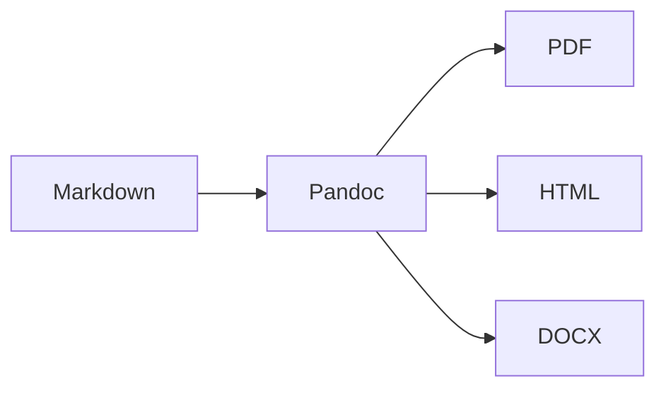

# Volume 0 — Chapitre 5 : Conventions Markdown et Pandoc

> **Repères d’utilisation :** **[PS]** PowerShell, **[VSC]** Visual Studio Code, **[WEB]** navigateur internet, **[APP]** interface graphique, **[SORTIE]** résultat à ne pas saisir. Voir la [convention complète](annexes/CONVENTION-OUTILS-ET-CONTEXTES.md).

## 1. Objet du chapitre

Ce chapitre définit les règles de rédaction et de compilation applicables à tous les fichiers Markdown du projet **Guide-IA-GameDev**.

Ces conventions ont quatre objectifs :

1. conserver une source textuelle simple et versionnable ;
2. garantir une conversion fiable vers PDF, HTML et DOCX ;
3. éviter les différences de rendu entre les volumes ;
4. permettre l’automatisation progressive des contrôles documentaires.

Le Markdown constitue la source de vérité. Les fichiers PDF, HTML, DOCX et EPUB sont des produits générés.

---

## 2. Statut des règles

| Élément | Statut | Justification |
|---|---|---|
| Markdown UTF-8 | **Obligatoire** | Format source commun à tout le dépôt. |
| Métadonnées YAML | **Obligatoire** | Identification, versionnement et compilation. |
| Pandoc | **Obligatoire** | Moteur principal de conversion documentaire. |
| Mermaid | **Recommandé** | Diagrammes textuels versionnables. |
| LaTeX personnalisé | **Optionnel** | Mise en page PDF avancée. |
| HTML brut dans Markdown | **À éviter** | Réduit la portabilité entre formats. |

---

## 3. Encodage et fins de ligne

Tous les fichiers texte doivent être enregistrés en **UTF-8 sans BOM**.

Les fins de ligne recommandées sont :

- `LF` dans Git et dans les fichiers du dépôt ;
- conversion locale automatique autorisée par Git lorsque nécessaire ;
- aucune dépendance à une fin de ligne particulière dans les scripts documentaires.

Les caractères accentués français sont écrits directement :

> **[LECTURE] Exemple ou structure de référence - Ne pas saisir.**

```text
é è ê à ù ç œ
```

Ils ne doivent pas être remplacés par des entités HTML telles que `&eacute;`.

---

## 4. Nommage des fichiers Markdown

Les chapitres suivent cette forme :

> **[LECTURE] Exemple ou structure de référence - Ne pas saisir.**

```text
CHAPITRE-NN-Titre-court-et-explicite.md
```

Exemples :

> **[LECTURE] Exemple ou structure de référence - Ne pas saisir.**

```text
CHAPITRE-01-Vision-generale-du-projet.md
CHAPITRE-05-Conventions-Markdown-et-Pandoc.md
```

Règles :

- deux chiffres minimum pour le numéro du chapitre ;
- aucun espace dans le nom du fichier ;
- aucun accent dans le nom du fichier ;
- mots séparés par des tirets ;
- extension `.md` en minuscules ;
- titre lisible et stable ;
- renommage exceptionnel seulement, car les liens peuvent dépendre du chemin.

Les fichiers d’entrée d’une section portent le nom `index.md`.

---

## 5. En-tête YAML obligatoire

Chaque chapitre doit commencer par un bloc YAML.

Modèle minimal :

> **[VSC] Visual Studio Code - Créer ou modifier :** `index.md`.

```yaml
---
title: "Titre complet du chapitre"
id: "DOC-V0-CH05"
status: "draft"
version: "0.1.0"
date: "2026-07-18"
---
```

### 5.1 Champs obligatoires

| Champ | Description |
|---|---|
| `title` | Titre humain complet. |
| `id` | Identifiant stable défini par `DOC-V0-CH04`. |
| `status` | État documentaire. |
| `version` | Version propre au document. |
| `date` | Date ISO `AAAA-MM-JJ`. |

### 5.2 États autorisés

> **[LECTURE] Exemple ou structure de référence - Ne pas saisir.**

```text
draft
review
validated
deprecated
archived
```

### 5.3 Champs facultatifs

Selon le besoin :

> **[LECTURE] Exemple de code - Ne pas exécuter directement :** utiliser selon l’instruction qui précède.

```yaml
author: "Nom ou équipe"
reviewers:
  - "Relecteur 1"
tags:
  - markdown
  - pandoc
prerequisites:
  - "DOC-V0-CH03"
companion_resources:
  - "TMP-DOC-001"
```

Un champ facultatif ne doit être ajouté que s’il est effectivement exploité.

---

## 6. Hiérarchie des titres

Un chapitre contient un seul titre de niveau 1 :

> **[LECTURE] Exemple de code - Ne pas exécuter directement :** utiliser selon l’instruction qui précède.

```markdown
# Titre du chapitre
```

La hiérarchie normale est ensuite :

> **[LECTURE] Exemple de code - Ne pas exécuter directement :** utiliser selon l’instruction qui précède.

```markdown
## Section
### Sous-section
#### Détail
```

Règles :

- ne jamais sauter directement de `##` à `####` ;
- ne pas utiliser les titres uniquement pour produire un effet visuel ;
- limiter la profondeur habituelle à quatre niveaux ;
- conserver des titres explicites et autonomes ;
- éviter les titres génériques tels que « Divers » ou « Autres ».

Le numéro des sections est écrit dans le titre lorsque le chapitre adopte une numérotation interne :

> **[LECTURE] Exemple de code - Ne pas exécuter directement :** utiliser selon l’instruction qui précède.

```markdown
## 6. Hiérarchie des titres
```

---

## 7. Paragraphes et lisibilité

Les paragraphes doivent rester courts et traiter une seule idée principale.

Recommandations :

- deux à six phrases par paragraphe dans la majorité des cas ;
- une ligne vide entre deux paragraphes ;
- une ligne vide avant et après une liste, un tableau ou un bloc de code ;
- phrases complètes ;
- vocabulaire technique défini avant son premier usage ;
- préférence pour les formulations directes.

Le retour à la ligne visuel de l’éditeur ne constitue pas un nouveau paragraphe.

---

## 8. Mise en forme du texte

### 8.1 Gras

Le gras met en valeur un terme important, un statut ou une action :

> **[LECTURE] Exemple de code - Ne pas exécuter directement :** utiliser selon l’instruction qui précède.

```markdown
**Obligatoire**
```

Il ne doit pas remplacer une structure de titres correcte.

### 8.2 Italique

L’italique est réservé aux termes étrangers, aux titres d’œuvres ou à une nuance ponctuelle :

> **[LECTURE] Exemple de code - Ne pas exécuter directement :** utiliser selon l’instruction qui précède.

```markdown
*workflow*
```

### 8.3 Code en ligne

Les noms de fichiers, commandes, variables, nœuds et identifiants sont écrits avec des accents graves :

> **[LECTURE] Exemple de code - Ne pas exécuter directement :** utiliser selon l’instruction qui précède.

```markdown
`project.godot`
`docker compose up -d`
`WF-CFY-001`
```

### 8.4 Texte barré

Le texte barré n’est pas utilisé pour conserver un historique. Git et `CHANGELOG.md` remplissent ce rôle.

---

## 9. Listes

### 9.1 Listes non ordonnées

Utiliser le tiret :

> **[VSC] Visual Studio Code - Créer ou modifier :** `CHANGELOG.md`.

```markdown
- premier élément ;
- deuxième élément ;
- troisième élément.
```

### 9.2 Listes ordonnées

Utiliser des nombres réels lorsque l’ordre est important :

> **[LECTURE] Exemple de code - Ne pas exécuter directement :** utiliser selon l’instruction qui précède.

```markdown
1. installer l’outil ;
2. redémarrer le terminal ;
3. vérifier la version.
```

### 9.3 Listes imbriquées

Limiter l’imbrication à trois niveaux. Une structure plus profonde doit devenir une sous-section ou un tableau.

### 9.4 Ponctuation

Dans une liste composée de fragments courts, chaque élément peut se terminer par un point-virgule et le dernier par un point. Pour des phrases complètes, chaque élément se termine par un point.

---

## 10. Tableaux

Les tableaux servent aux comparaisons structurées et aux matrices courtes.

Exemple :

> **[LECTURE] Exemple de code - Ne pas exécuter directement :** utiliser selon l’instruction qui précède.

```markdown
| Outil | Rôle | Statut |
|---|---|---|
| Godot | Moteur de jeu | Obligatoire |
| Blender | Production 3D | Obligatoire |
```

Règles :

- toujours inclure une ligne d’en-tête ;
- éviter les cellules contenant plusieurs paragraphes ;
- éviter les tableaux excessivement larges ;
- préférer une liste ou plusieurs sous-sections sur écran étroit ;
- ne pas utiliser un tableau uniquement pour la mise en page ;
- expliquer dans le texte les conclusions importantes du tableau.

Les tableaux très grands doivent être placés dans le Livre V ou dans un fichier de données du Companion Pack.

---

## 11. Blocs de code

Chaque bloc de code doit indiquer son langage lorsque celui-ci est connu.

> **[LECTURE] Exemple de code - Ne pas exécuter directement :** utiliser selon l’instruction qui précède.

```markdown
```gdscript
extends Node

func _ready() -> void:
    print("Guide IA GameDev")
```

> **[LECTURE] Exemple ou structure de référence - Ne pas saisir.**

```

Langages courants :

```text
gdscript
python
sql
json
yaml
bash
powershell
dockerfile
text
mermaid
```

Règles :

- fournir un code exécutable ou explicitement marqué comme pseudocode ;
- utiliser quatre espaces pour l’indentation dans les exemples Python et GDScript ;
- ne jamais tronquer silencieusement une partie indispensable ;
- signaler les valeurs que le lecteur doit adapter ;
- ne pas inclure de secrets, jetons, mots de passe ou données personnelles ;
- préciser le chemin du fichier lorsque cela facilite l’application.

Exemple avec chemin :

> **[LECTURE] Exemple de code - Ne pas exécuter directement :** utiliser selon l’instruction qui précède.

```markdown
Fichier : `Scripts/validation/check_json.py`
```

---

## 12. Commandes de terminal

Les commandes sont séparées du résultat attendu.

Commande :

> **[PS] PowerShell 7 - Exécuter :** utiliser PowerShell sur l’hôte Windows.

```powershell
pandoc --version
```

Résultat attendu, donné sous forme indicative :

> **[SORTIE] Résultat attendu - Ne pas saisir :** comparer avec la sortie obtenue.

```text
pandoc 3.x
```

Règles :

- ne pas inclure le symbole d’invite `>` ou `$` dans une commande à copier ;
- préciser le terminal concerné : PowerShell, Bash, invite de commandes ou terminal Docker ;
- séparer les commandes Windows et Linux lorsqu’elles diffèrent ;
- fournir une commande de vérification après une installation ;
- éviter les commandes destructrices sans avertissement explicite.

### 12.1 Repères obligatoires d’utilisation

Tout bloc procédural reçoit immédiatement un repère défini par `DOC-V0-ANN-CONTEXTES`.

> **[LECTURE] Exemple ou structure de référence - Ne pas saisir.**

```text
[PS] PowerShell 7
[VSC] Visual Studio Code
[WEB] Navigateur internet
[DCK] Interface Docker Desktop
[DCT] Terminal dans un conteneur
[WSL] Terminal WSL/Bash
[APP] Interface de l’application nommée
[SORTIE] Résultat attendu
[LECTURE] Exemple non exécutable
```

Exemple de commande :

> **[PS] PowerShell 7 - Exécuter :** utiliser PowerShell sur l’hôte Windows.

```powershell
pandoc --version
```

Exemple de fichier :

> **[VSC] Visual Studio Code - Créer :** `.vscode/settings.json` à la racine du projet. Ouvrir le dossier du projet dans VS Code, créer le dossier `.vscode` s’il n’existe pas, puis créer `settings.json`.

```json
{
  "files.encoding": "utf8"
}
```

Une adresse de téléchargement utilisée dans une procédure reçoit **[WEB]**. Une sortie de commande reçoit **[SORTIE]**. Un schéma ou une valeur illustrative reçoit **[LECTURE]**.

La convention complète est disponible dans [Convention des outils et contextes d’utilisation](annexes/CONVENTION-OUTILS-ET-CONTEXTES.md).

---

## 13. Liens internes

Les liens internes utilisent des chemins relatifs.

Exemple depuis le Volume 0 :

> **[LECTURE] Exemple de code - Ne pas exécuter directement :** utiliser selon l’instruction qui précède.

```markdown
[Architecture documentaire](CHAPITRE-03-Architecture-documentaire.md)
```

Exemple vers la racine :

> **[VSC] Visual Studio Code - Créer ou modifier :** `markdown [Architecture documentaire](CHAPITRE-03-Architecture-documentaire.md)`.

```markdown
[Guide de style](../STYLE_GUIDE.md)
```

Règles :

- ne pas utiliser d’URL GitHub absolue pour lier un fichier du même dépôt ;
- utiliser un texte de lien descriptif ;
- vérifier la casse exacte du chemin ;
- privilégier l’identifiant stable en complément du titre ;
- éviter les liens vers des numéros de page, car ils changent selon le format.

---

## 14. Liens externes et références

Les liens externes doivent pointer en priorité vers :

1. la documentation officielle ;
2. le dépôt officiel ;
3. une publication scientifique ou technique primaire ;
4. une source secondaire reconnue, lorsque nécessaire.

Chaque information susceptible d’évoluer doit être datée ou vérifiée lors de la publication du chapitre.

Les URL brutes ne doivent pas encombrer le corps du texte. Elles peuvent apparaître dans une bibliographie structurée ou dans une note produite par Pandoc.

Aucun lien vers un modèle, un workflow ou un asset ne doit laisser croire qu’une licence autorise automatiquement la redistribution.

---

## 15. Images

Syntaxe standard :

> **[LECTURE] Exemple de code - Ne pas exécuter directement :** utiliser selon l’instruction qui précède.

```markdown
{#fig:identifiant width=90%}
```

Règles :

- fournir un texte alternatif utile ;
- utiliser un nom de fichier explicite ;
- conserver les images dans le dossier `assets/` approprié ;
- privilégier `PNG`, `WEBP` ou `SVG` selon le contenu ;
- conserver une résolution suffisante pour le PDF ;
- retirer les informations personnelles des captures ;
- ne pas intégrer de fichiers dont la licence de redistribution est inconnue.

Les captures d’écran doivent mettre en évidence seulement les éléments utiles à l’étape expliquée.

---

## 16. Diagrammes Mermaid

Les diagrammes textuels sont écrits en Mermaid lorsque le rendu cible le permet.

Exemple :

> **[VSC] Visual Studio Code - Créer ou modifier :** `assets/`.



Règles :

- diagramme simple et lisible ;
- identifiants de nœuds courts ;
- libellés en français ;
- pas de couleurs indispensables à la compréhension ;
- fournir une alternative textuelle lorsque le diagramme porte une information essentielle ;
- exporter une image statique pour le PDF si la chaîne de compilation ne traite pas Mermaid directement.

---

## 17. Notes, avertissements et statuts

Le projet utilise une syntaxe textuelle portable.

> **[LECTURE] Exemple de code - Ne pas exécuter directement :** utiliser selon l’instruction qui précède.

```markdown
> **Attention — Obligatoire**  
> Sauvegardez le fichier avant de poursuivre.
```

Catégories autorisées :

- **Information** ;
- **Astuce** ;
- **Attention** ;
- **Danger** ;
- **Mode Solo** ;
- **Mode Studio** ;
- **Optimisation AMD** ;
- **Contenu optionnel**.

L’icônographie peut être ajoutée dans les formats de diffusion, mais le texte doit rester compréhensible sans icône.

---

## 18. Citations et notes Pandoc

Les citations bibliographiques utiliseront ultérieurement un fichier BibLaTeX ou CSL JSON centralisé.

Exemple prévu :

> **[LECTURE] Exemple de code - Ne pas exécuter directement :** utiliser selon l’instruction qui précède.

```markdown
Godot recommande d’organiser les ressources par fonctionnalité [@godot-project-organization].
```

Une note de bas de page Markdown peut être utilisée pour une précision non essentielle :

> **[LECTURE] Exemple de code - Ne pas exécuter directement :** utiliser selon l’instruction qui précède.

```markdown
Cette règle s’applique au pipeline principal.[^pipeline]

[^pipeline]: Les alternatives sont présentées dans les chapitres comparatifs.
```

Les notes ne doivent pas contenir une étape nécessaire à la réussite d’une procédure.

---

## 19. Mathématiques

Les formules simples utilisent la syntaxe LaTeX compatible Pandoc.

En ligne :

> **[LECTURE] Exemple de code - Ne pas exécuter directement :** utiliser selon l’instruction qui précède.

```markdown
La complexité est notée $O(n)$.
```

En bloc :

> **[LECTURE] Exemple de code - Ne pas exécuter directement :** utiliser selon l’instruction qui précède.

```markdown
$$
T_{total} = T_{generation} + T_{import} + T_{validation}
$$
```

Toute variable doit être définie dans le texte.

---

## 20. Échappement et HTML brut

Les caractères Markdown ayant une signification spéciale doivent être échappés lorsque nécessaire.

Le HTML brut est interdit dans le pipeline principal, sauf justification documentée, car son comportement varie selon le format de sortie.

Alternatives recommandées :

- Markdown standard ;
- extensions Pandoc ;
- filtres Pandoc versionnés ;
- modèles de sortie ;
- CSS pour HTML ;
- LaTeX pour PDF.

---

## 21. Séparateurs et sauts de page

Le séparateur horizontal Markdown est utilisé avec modération :

> **[LECTURE] Exemple de code - Ne pas exécuter directement :** utiliser selon l’instruction qui précède.

```markdown
---
```

Il ne doit pas être placé immédiatement après un en-tête YAML sans contenu intermédiaire pouvant créer une ambiguïté.

Les sauts de page forcés doivent rester exceptionnels. Ils sont gérés de préférence par le modèle Pandoc plutôt que par le contenu source.

---

## 22. Ordre de compilation

Le fichier racine `contents.txt` définit l’ordre officiel des documents.

Chaque ligne non vide contient un chemin relatif :

> **[LECTURE] Exemple ou structure de référence - Ne pas saisir.**

```text
README.md
Volume-0/index.md
Volume-0/CHAPITRE-01-Vision-generale-du-projet.md
```

Lorsqu’un chapitre est créé :

1. le fichier est ajouté au dépôt ;
2. son chemin est ajouté à `contents.txt` ;
3. l’index de son volume est mis à jour ;
4. la roadmap est mise à jour ;
5. une compilation de contrôle est exécutée.

---

## 23. Métadonnées globales Pandoc

Le fichier `metadata.yaml` contient les propriétés communes à l’ouvrage :

- titre général ;
- langue ;
- auteur ou équipe ;
- version de la collection ;
- paramètres de table des matières ;
- géométrie et typographie du PDF ;
- propriétés de document.

Les métadonnées locales d’un chapitre ne doivent pas contredire les métadonnées globales sans justification.

---

## 24. Compilation PDF

Le pipeline principal utilise Pandoc et un moteur PDF compatible.

Principe :

> **[LECTURE] Exemple ou structure de référence - Ne pas saisir.**

```text
Markdown + metadata.yaml + contents.txt
                ↓
              Pandoc
                ↓
       PDF / HTML / DOCX
```

Le script `build.ps1` est la commande de référence sous Windows. Le script `build.sh` est son équivalent sous Linux.

Les fichiers générés sont placés dans `build/` ou `PDF/` et ne sont pas considérés comme des sources éditoriales.

---

## 25. Compatibilité entre formats

Une construction est valide lorsqu’elle reste compréhensible dans :

- le rendu Markdown de GitHub ;
- le PDF Pandoc ;
- le HTML ;
- le DOCX, lorsque ce format est généré.

Il faut éviter :

- les tableaux trop larges ;
- les blocs HTML spécifiques à un navigateur ;
- les mises en page reposant uniquement sur des espaces ;
- les couleurs sans équivalent textuel ;
- les polices non redistribuables ;
- les liens dépendant d’un numéro de page.

---

## 26. Validation minimale d’un chapitre

Avant le passage à l’état `validated`, vérifier :

- [ ] le fichier est encodé en UTF-8 ;
- [ ] l’en-tête YAML est valide ;
- [ ] l’identifiant est unique ;
- [ ] le titre de niveau 1 est unique ;
- [ ] la hiérarchie des titres est continue ;
- [ ] les blocs de code ont un langage ;
- [ ] les chemins relatifs existent ;
- [ ] les images ont un texte alternatif ;
- [ ] aucun secret n’est présent ;
- [ ] le chapitre figure dans `contents.txt` ;
- [ ] l’index du volume est à jour ;
- [ ] la compilation Pandoc ne produit pas d’erreur bloquante.

---

## 27. Exemple de squelette de chapitre

> **[VSC] Visual Studio Code - Créer ou modifier :** `contents.txt`.

```markdown
---
title: "Livre X — Chapitre Y : Titre"
id: "LIV-X-CHYY"
status: "draft"
version: "0.1.0"
date: "2026-07-18"
---

# Livre X — Chapitre Y : Titre

## 1. Objectifs

## 2. Prérequis

## 3. Obligatoire, recommandé et optionnel

## 4. Concepts

## 5. Procédure pas à pas

## 6. Exemple simple

## 7. Exemple avancé

## 8. Mode Solo

## 9. Mode Studio

## 10. Optimisations

## 11. Erreurs fréquentes

## 12. Checklist

## 13. Références croisées

## 14. Ressources du Companion Pack
```

Ce squelette est adapté au contenu réel. Les sections sans valeur pédagogique ne doivent pas être conservées artificiellement.

---

## 28. Mode Solo et Mode Studio

### Mode Solo

Le contributeur peut modifier directement une branche locale, compiler le document et effectuer une relecture personnelle structurée.

### Mode Studio

Le chapitre doit passer par :

1. une branche dédiée ;
2. une revue de contenu ;
3. une revue technique ;
4. une compilation automatisée ;
5. une validation avant fusion.

Les deux modes produisent les mêmes fichiers sources et respectent les mêmes conventions.

---

## 29. Erreurs fréquentes

### Plusieurs titres H1

Conséquence : structure incohérente dans la table des matières.

Correction : conserver un seul `#` par chapitre.

### Bloc de code sans langage

Conséquence : lecture et coloration moins efficaces.

Correction : indiquer `gdscript`, `python`, `json`, `text` ou un autre langage approprié.

### Liens absolus vers le dépôt

Conséquence : liens cassés lors d’un fork ou d’un export hors ligne.

Correction : employer des chemins relatifs.

### Mise en page avec des espaces

Conséquence : rendu différent selon le format.

Correction : utiliser des listes, tableaux, titres ou modèles de sortie.

### Information importante dans une note

Conséquence : étape ignorée par le lecteur.

Correction : replacer l’information dans le corps principal.

---

## 30. Checklist de validation du chapitre

| Contrôle | État attendu |
|---|---|
| Source Markdown unique | Conforme |
| En-tête YAML documenté | Conforme |
| Hiérarchie des titres | Conforme |
| Règles de code et terminal | Conforme |
| Liens et images | Conforme |
| Diagrammes textuels | Conforme |
| Compilation Pandoc | Définie |
| Compatibilité multiformat | Définie |
| Modes Solo et Studio | Définis |

---

## 31. Références croisées

- `DOC-V0-CH03` — Architecture documentaire.
- `DOC-V0-CH04` — Convention des identifiants.
- `DOC-V0-CH06` — Style rédactionnel.
- [`STYLE_GUIDE.md`](../STYLE_GUIDE.md) — règles éditoriales synthétiques.
- [`BUILD.md`](../BUILD.md) — compilation du dépôt.
- [`metadata.yaml`](../metadata.yaml) — métadonnées globales.
- [`contents.txt`](../contents.txt) — ordre de compilation.

---

## 32. Ressources Companion Pack prévues

| Identifiant | Ressource | État |
|---|---|---|
| `TMP-DOC-001` | Modèle universel de chapitre Markdown | Prévu |
| `TMP-DOC-002` | Modèle de fiche technique | Prévu |
| `PY-DOC-001` | Validateur des en-têtes YAML | Prévu |
| `PY-DOC-002` | Vérificateur des liens relatifs | Prévu |
| `PS1-DOC-001` | Compilation documentaire Windows | Initial |
| `BASH-DOC-001` | Compilation documentaire Linux | Initial |

---

**Fin du chapitre `DOC-V0-CH05`.**
